# 用 NextAuth.js 构建认证 API

> 原文：<https://blog.logrocket.com/building-authentication-api-nextauth-js/>

***编者按:**这篇文章在 2021 年 8 月更新了相关信息，解决了开发人员在使用 GitLab OAuth 以及使用 NextAuth.js 命名文件以创建动态 API 路径时遇到的常见错误。*

认证是证明某人是他们所说的那个人的行为，例如在应用程序中确认用户的身份。在本教程中，我们将学习如何使用 [NextAuth.js](https://next-auth.js.org/) 在 [Next.js](https://nextjs.org/) 应用中实现认证。

## 什么是 NextAuth.js？

NextAuth.js 是一个库，专门用于处理 Next.js 应用程序中的身份验证解决方案。根据[文档](https://next-auth.js.org/getting-started/introduction)，“NextAuth.js 是针对 Next.js 应用的完整开源认证解决方案。它被从头设计来支持 Next.js 和[无服务器](https://www.serverless.com/)。”

## 为 Next.js 构建身份验证 API 的先决条件

要跟随本教程，您需要以下内容:

*   基本了解[反应](https://reactjs.org/)
*   对 [MongoDB](https://www.mongodb.com/) 或任何其他数据库有基本的了解
*   对身份验证工作原理的基本理解

美好的未来:

*   以前使用 Next.js 框架的经验

## 用 NextAuth.js 构建身份验证 API

在本教程中，我们将使用内置的 Next.js API 路由构建一个基本的身份验证 API。认证将包括一个无密码的电子邮件登录和谷歌开放认证。然后，我们将研究如何保护 API 端点和受保护的页面。

本教程中编写的所有代码都可以在这个 GitHub [资源库](https://github.com/francisudeji/authentication-for-nextjs-serverless)上获得。

### 搭建应用程序

Next.js 有一个方便的 CLI，我们可以用它来生成一个启动项目。首先，全局安装 CLI:

```
npm install -g create-next-app

```

现在，创建新的 Next.js 应用程序:

```
create-next-app next-authentication

```

当提示选择模板时，选择**默认启动应用**选项并点击**回车**继续。

现在将目录更改为新创建的项目文件夹:

```
cd next-authentication

```

然后，启动开发服务器:

```
yarn dev

```

这应该会在`[http://localhost:3000](http://localhost:3000)`启动开发服务器。

### 在 Next.js 中创建环境变量

因为我们将使用几个凭证，所以我们需要隐藏它们。在名为`.env.local`的项目文件夹的根目录下创建一个新文件，并粘贴到以下代码片段中:

```
NEXTAUTH_URL=http://localhost:3000

```

请注意，这与我们的开发服务器的 URL 相同。如果你的在另一个端口上运行，那么就替换它。随着我们的进展，我们将填充这个文件。

## 设置 NextAuth.js

在这一步，我们将安装`next-auth`依赖项并使用 API 路由。Next.js 中的 API 路由允许我们在不创建定制服务器的情况下创建 API 端点。

API 路由在开发过程中运行在一个服务器上，并且在部署时，被部署为彼此独立运行的无服务器功能。在[文档](https://nextjs.org/docs/api-routes/introduction)中了解更多关于 API 路由的信息。

### 安装`next-auth`依赖项

通过运行下面的代码片段安装`next-auth`:

```
yarn add next-auth
npm install next-auth
```

### 创建动态 API 路由

在`pages/api/auth`中创建一个名为`[…nextauth].js`的新文件，并将这段代码粘贴到新创建的文件中:

```
// pages/api/auth/[...nextauth].js
import NextAuth from 'next-auth'

const options = {
  site: process.env.NEXTAUTH_URL
}

export default (req, res) => NextAuth(req, res, options)
```

确保您已经将文件命名为`[...nextauth.js]`而不是`[...nextAuth.js]`。如果你这样做，你会收到一个`undefined`错误。注意我们是如何在方括号中的动态 API 路由名称中使用 spread 操作符的。那是因为在后台，所有对`/api/auth/*`的请求(签到、回叫、签出等。)，会自动由 NextAuth.js 处理。

NextAuth.js 使用`site`选项作为基本 URL，因此所有重定向和回调 URL 都将使用`[http://localhost:3000](http://localhost:3000)`作为它们的基本 URL。例如，在生产中，这应该替换为您网站的基本 URL。

### 使用 NextAuth.js `<Provider>`

根据[文档](https://next-auth.js.org/getting-started/client):使用提供的 React `<Provider>` 允许 `useSession()` 的实例通过使用 [React 上下文](https://reactjs.org/docs/context.html) 跨组件共享会话对象。这提高了性能，减少了网络调用，并避免了呈现时的页面闪烁。强烈建议您使用 `pages/_app.js` 将其轻松添加到 Next.js 应用程序的所有页面中。”

所以现在，打开`pages/_app.js`并用下面的代码片段替换它:

```
// pages/_app.js
import { Provider } from 'next-auth/client'

export default function App({ Component, pageProps }) {
  return (
    <Provider session={pageProps.session}>
      <Component {...pageProps} />
    </Provider>
  )
}

```

在这段代码中，我们用来自 NextAuth.js 的`Provider`组件包装了我们的应用程序，并传入了会话页面属性。这是为了避免在支持服务器端和客户端呈现的页面上检查会话两次。

## 使用电子邮件地址登录

为了让电子邮件登录工作，我们需要一个数据库来存储用户信息。如前所述，我们将使用 MongoDB 作为数据库选择，但也可以随意使用任何其他数据库。

> 注意:如果使用电子邮件登录，NextAuth.js 需要一个数据库。但是，对于 OAuth，不需要数据库。

### 创建 MongoDB 数据库

因为我们将使用 MongoDB，所以我们可以通过运行以下代码片段来创建数据库:

输入 MongoDB shell:

```
mongosh

```

创建一个名为`nextauth`的新数据库:

```
use nextauth

```

### 添加用于身份验证的数据库凭据

我们的数据库连接字符串应该如下所示:

```
mongodb://localhost:27017/nextauth.
```

现在打开`.env.local`文件并添加以下代码片段:

```
DATABASE_URL=mongodb://localhost:27017/nextauth

```

数据库工作所需的最后一部分是数据库驱动程序。幸运的是，我们现在需要做的就是安装`mongodb`作为一个依赖项:

```
yarn add mongodb
npm install mongodb
```

如果您使用任何其他数据库，请通过链接中的[安装适当的数据库驱动程序。](https://next-auth.js.org/configuration/databases)

### 将`Providers`添加到 NextAuth.js

NextAuth.js 有一个提供者的概念，它定义了可以用来登录的服务，比如 email 或者 OAuth。

首先，导入`Providers`模块，并用`pages/api/auth/[…nextauth].js`中的以下代码片段替换 options 对象:

```
// pages/api/auth/[…nextauth].js
// ...other imports
import Providers from 'next-auth/providers'

const options = {
  site: process.env.NEXTAUTH_URL,
  providers: [
    Providers.Email({
      server: {
        port: 465,
        host: 'smtp.gmail.com',
        secure: true,
        auth: {
          user: process.env.EMAIL_USERNAME,
          pass: process.env.EMAIL_PASSWORD,
        },
        tls: {
          rejectUnauthorized: false,
        },
      },
      from: process.env.EMAIL_FROM,
    })
  ],
  database: process.env.DATABASE_URL
}

```

让我们来分解一下这些新变化是什么:

首先，我们导入了`Providers`模块，它让我们能够访问 NextAuth.js 支持的不同提供者。接下来，我们引入了一个新的`providers`选项，这是一个接受所有提供者列表的数组。现在，我们通过了`Email`提供者以及一些关于我们电子邮件服务器的选项。

电子邮件提供者接受连接字符串或配置对象，类似于使用 [Nodemailer](https://nodemailer.com/about/) 根据上面传递的凭证发送确认电子邮件。

点击了解更多关于[配置电子邮件提供商的信息。](https://next-auth.js.org/providers/email)

> 注意:在上面的配置中，我使用的是我的 Gmail 账户。如果你选择使用你的，那么你可能需要[启用不太安全的应用](https://support.google.com/accounts/answer/6010255?hl=en)。稍后，请求一个应用程序密码，以便您可以将您的 Gmail 帐户与 NextAuth 链接。如果没有，请从您的电子邮件服务器提供凭证。

接下来，`database`选项接收到之前创建的数据库的连接字符串。

从上面的片段中，我们引用了一些新的变量，所以通过将这个片段粘贴到`.env.local`文件中来添加它们:

```
EMAIL_FROM=YOUR NAME <[email protected]>
[email protected]
EMAIL_PASSWORD=your_app_password

```

此时，我们需要重启服务器，让这些新的环境变量生效。完成后，我们需要导航到`[http://localhost:3000/api/auth/signin](http://localhost:3000/api/auth/signin)`来查看登录屏幕。

它应该是这样的:

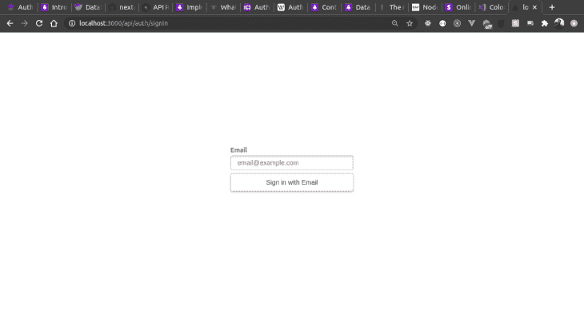

默认情况下，NextAuth.js 附带了一个最小化的 UI，该 UI 根据配置期间提供的身份验证提供者显示登录选项。

提交表单后，我们应该被重定向到成功页面，并收到一封带有验证令牌的电子邮件(如果这是首次使用该电子邮件登录)。如果没有，我们将收到一个登录电子邮件链接。

成功页面应该是这样的:

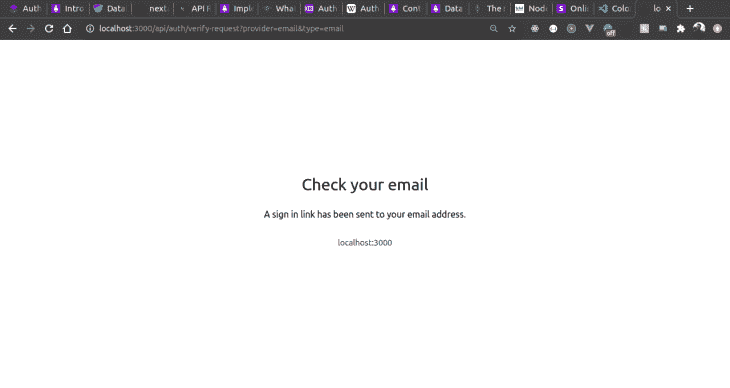

这是验证邮件的样子。

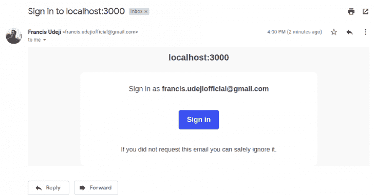

默认情况下，点击**登录**链接会将我们带到主页。

在下一节中，我们将看看如何显示当前的用户信息。如果我们现在看一下我们的数据库，我们将看到一个新条目，其中包含有关登录用户的信息:

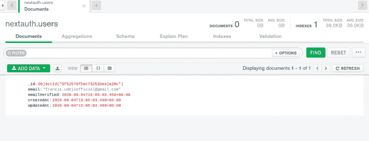

处理用户会话

## 在本节中，我们将使用会话数据来显示关于当前用户的信息。值得注意的是，默认情况下，NextAuth.js 使用数据库会话进行电子邮件登录，使用 [JWT](https://jwt.io/) 进行 OAuth。

要在使用电子邮件登录时启用 JWT，我们需要将该选项添加到 API 路由中。为此，将这个代码片段添加到`options`对象`in pages/api/[...nextauth].js`中:

这个选项告诉 NextAuth.js 使用 JWT 来存储用户会话，并且会话应该持续 30 天。有关可能选项的更多信息，请参考[文档](https://next-auth.js.org/configuration/options)。

```
 session: {
  jwt: true,
  maxAge: 30 * 24 * 60 * 60 // the session will last 30 days
},

```

现在，要在我们的应用程序中获取会话数据，我们要么选择在客户端使用`useSession`钩子，要么在服务器端使用`getSession`函数。

接下来，打开`pages/index.js`，用下面的代码片段替换当前内容:

在这个代码片段中，我们导入了几个函数:`signIn`、`signOut`和`useSession`。正如您可能已经猜到的，前两个用于登录用户和注销已登录的用户。

```
// pages/index.js
import { signIn, signOut, useSession } from 'next-auth/client'

export default function Page() {
  const [session, loading] = useSession()

  if (loading) {
    return <p>Loading...</p>
  }

  return (
    <>
      {!session && (
        <>
          Not signed in <br />
          <button onClick={signIn}>Sign in</button>
        </>
      )}
      {session && (
        <>
          Signed in as {session.user.email} <br />
          <button onClick={signOut}>Sign out</button>
        </>
      )}
    </>
  )
}

```

`useSession`钩子返回一个包含`session`和`loading`状态的元组。我们使用加载状态来显示加载文本，并根据用户当前是否登录，有条件地呈现登录或注销按钮以及用户数据。

以下是登录用户和未登录用户的主页预览:

Next.js 中受保护的路线

现在我们已经实现了电子邮件登录，我们可以使用用户会话来授权或拒绝对任何页面的访问。我们也可以选择在服务器上或者在客户端上做这件事。


View of an authenticated user

服务器端保护


View of an unauthenticated user

## 为了利用 SSR 的路由保护，我们可以使用`getSession`函数。首先，在`pages`文件夹中创建一个名为`dashboard.js`的新文件，并粘贴以下代码片段:

为了在 Next.js 中呈现页面，我们需要导出一个名为`getServerSideProps`的`async`函数。这个函数接收一个上下文参数，通过将上下文传递给`getSession`函数，我们得到了会话。要在接下来了解更多关于 SSR 的内容，请阅读[文档](https://nextjs.org/docs/basic-features/data-fetching#getserversideprops-server-side-rendering)。

### 如果没有会话，我们简单地将用户重定向回主页，否则我们返回一个带有`user`属性的对象。这包含用户信息，如他们的电子邮件和全名。

最后，在`Dashboard`组件上，我们访问了包含用户数据的`user`属性。

```
// pages/dashboard.js
import { getSession } from 'next-auth/client'

export default function Dashboard({ user }) {
  return (
    <div>
      <h1>Dashboard</h1>
      <p>Welcome {user.email}</p>
    </div>
  )
}

export async function getServerSideProps(ctx) {
  const session = await getSession(ctx)
  //if no session found(user hasn’t logged in)  if (!session) {
    return {
     redirect: {
     destination: ‘/’, //redirect user to homepage
     permanent: false,
     }
    }
   }
  return {
    props: {
      user: session.user,
    },
  }
}

```

客户端保护

首先，在`pages`文件夹中创建一个名为`profile.js`的新文件，并粘贴以下代码片段:

这有点类似于我们在`pages/index.js`文件中的内容，但是这一次，我们通过延迟加载`AuthenticatedComponent`和`UnauthenticatedComponent`来利用代码分割。

### 下面是这段代码的概要:

首先，我们导入了`useSession`钩子，然后我们在 Next.js 中导入了一个名为`dynamic`的特殊函数。这个函数使我们能够动态地导入任何组件。因为我们的应用程序总是处于两种状态之一——已验证或未验证——如果一次只使用一个组件，我们不需要导入两个组件。

```
// pages/profile.js
import { useSession } from 'next-auth/client'
import dynamic from 'next/dynamic'

const UnauthenticatedComponent = dynamic(() =>
  import('../components/unauthenticated')
)
const AuthenticatedComponent = dynamic(() =>
  import('../components/authenticated')
)

export default function Profile() {
  const [session, loading] = useSession()

  if (typeof window !== 'undefined' && loading) return <p>Loading...</p>

  if (!session) return <UnauthenticatedComponent />

  return <AuthenticatedComponent user={session.user} />
}

```

接下来，我们析构了`session`和`loading`状态，并使用`session`来动态呈现 DOM。

最后，我们在 NextAuth.js 仍在加载时呈现了一个加载文本，以及`AuthenticatedComponent`或`UnauthenticatedComponent`，这取决于我们是否有一个会话。

现在，创建一个名为`components`的新文件夹和两个文件:`authenticated.js`和`unauthenticated.js`。

在`authenticated.js`中，粘贴以下代码片段:

在`unauthenticated.js`文件中，粘贴以下代码片段:

在`components/authenticated.js`中，我们导入了`signOut`函数，并析构了从`pages/profile.js`传来的`user`道具。我们还显示了用户数据和注销用户的注销按钮。

在`components/unauthenticated.js`中，我们向用户显示了一条消息。当用户点击登录按钮时，我们调用上面导入的`signIn`函数。

```
// components/authenticated.js
import { signOut } from 'next-auth/client'

export default function Authenticated({ user }) {
  return (
    <div>
      <p>You are authenticated {user.email}</p>
      <button onClick={signOut}>Sign Out</button>
    </div>
  )
}

```

API 路由保护

```
// components/unauthenticated.js
import { signIn } from 'next-auth/client'

export default function Unauthenticated() {
  return (
    <div>
      <p>You are not authenticated</p>
      <button onClick={signIn}>Sign In</button>
    </div>
  )
}

```

我们还可以将我们的认证服务扩展到 Next.js 的 API 路由。这将类似于我们对服务器端渲染所做的，对于只允许经过身份验证的用户访问 API 非常有用。

首先，在`pages/api`中创建一个名为`data.js`的新文件，并粘贴以下代码片段:

### 任何导出默认`async`函数并在`page/api`文件夹中创建的文件都将自动成为 API 路径。在这种情况下，该文件将被映射到`[http://localhost:3000/api/data](http://localhost:3000/api/data)`。

在这个代码片段中，我们导入了`getSession`函数，并传入了从 API route 获取的请求对象。从那里，NextAuth.js 负责读取 cookies。最后，我们根据会话的可用性向用户返回一条消息。

为了测试这一点，我们可以创建一个对`[http://localhost:3000/api/data](http://localhost:3000/api/data)`的`GET`请求来获得响应。

```
// pages/api/data.js
import { getSession } from 'next-auth/client'

export default async (req, res) => {
  const session = await getSession({ req })

  if (session) {
    res.status(200).json({
      message: 'You can access this content because you are signed in.',
    })
  } else {
    res.status(403).json({
      message:
        'You must be sign in to view the protected content on this page.',
    })
  }
}

```

使用 OAuth 登录

NextAuth.js 有许多现成的内置提供程序。与电子邮件提供商不同，我们不需要数据库来使用它们。在本节中，我们将在 Google 的开发人员控制台上创建一个应用程序，并获取我们的客户端 ID 和密码。

如果你已经熟悉在这些平台上创建应用，那么你可以跳到[“处理页面重定向”](#handling-page-redirects)部分。

## 使用 Google 登录

要启用 Google 登录，我们需要在开发人员控制台上创建一个新项目，使用我们的 Google 帐户登录，并通过单击模式上的**新项目**按钮创建一个新应用程序。

它应该是这样的:

### 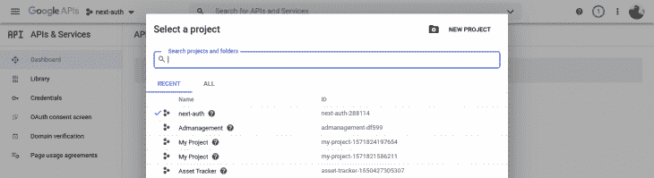

接下来，我们需要为我们的项目命名，并单击 **CREATE** 按钮:

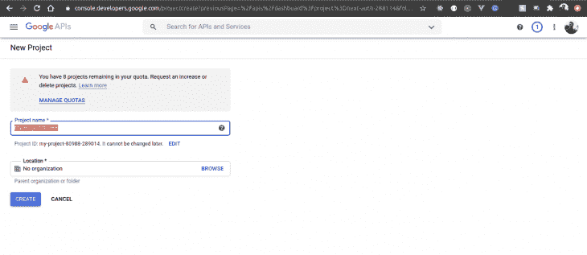

接下来，点击**配置同意屏幕**按钮:

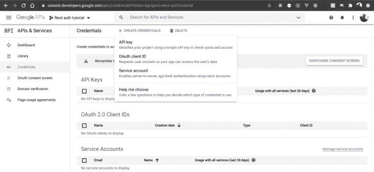

然后，勾选**外部**复选框，然后点击**创建**按钮。这是屏幕:

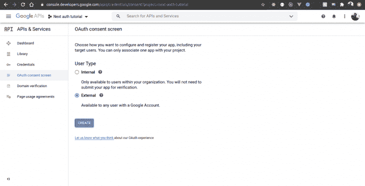

下一步，我们需要给我们的应用命名。完成后，点击**保存**按钮。

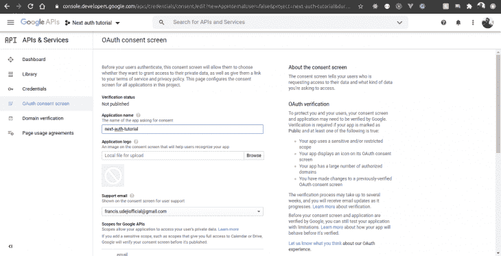

现在我们需要返回到凭证页面，点击**创建凭证**下拉按钮，并选择 **OAuth 客户端 ID** :

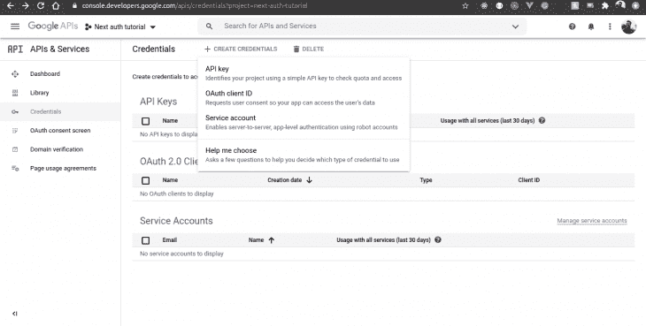

选择 **Web 应用**作为应用类型:

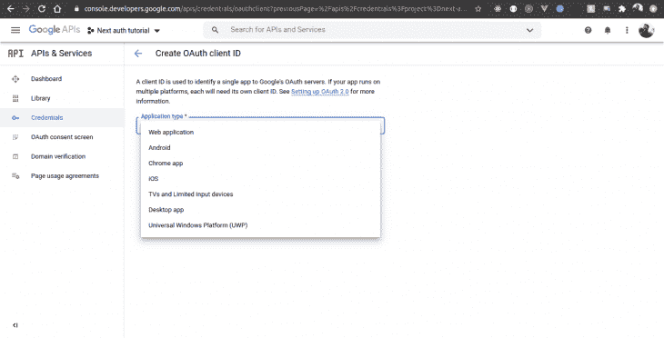

像下面的截图一样填写表格:

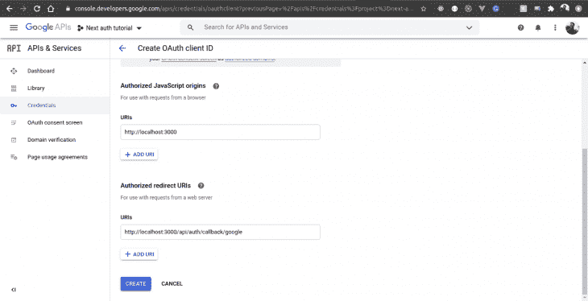

这里，我们添加了应用程序的基本 URL 和 NextAuth.js 为 Google OAuth 期望的回调 URL。使用另一个类似 GitHub 的服务意味着我们需要用“/callback/github”替换“/callback/google”

点击 **CREATE** 按钮后，会弹出一个带有我们凭证的模态，如下所示:

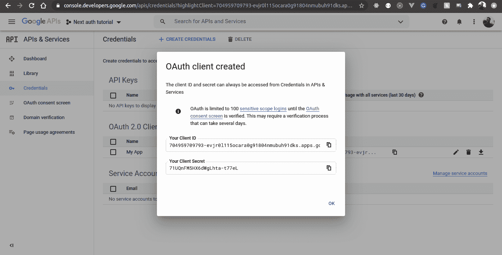

我们现在需要做的就是将这些作为环境变量添加进来，并注册一个新的提供者。

添加 Google 凭据

打开`.env.local` lo 文件并粘贴以下代码片段:

添加新的提供程序

### 打开`pages/api/auth/[nextauth].js`文件并将该代码片段添加到`providers`数组中:

我们需要重新启动应用程序才能看到新的变化。重新启动后，我们的登录页面应该是这样的。

```
GOOGLE_ID=YOUR_GOOGLE_ID
GOOGLE_SECRET=YOUR_GOOGLE_SECRET

```

### 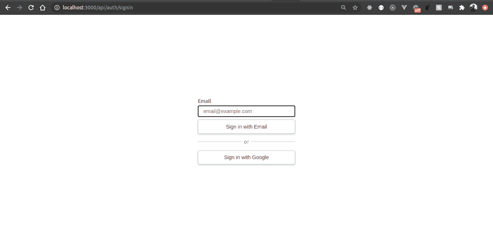

```
 Providers.Google({
  clientId: process.env.GOOGLE_ID,
  clientSecret: process.env.GOOGLE_SECRET,
}),

```

有了这个，我们应该可以用我们的谷歌账户登录了。从现在开始，添加一个新的提供商应该像在平台上创建一个应用程序、获取凭证并将其添加到提供商列表中一样简单。

处理页面重定向

Next.js 提供了一种在我们的应用程序中定制回调的方法。其中一个回调是重定向回调。每当用户被重定向到回调时，例如登录和注销，都会调用这个函数。

但是我们为什么要关心这个呢？你有没有注意到我们每次登录，都会被重定向回主页？让我们把它改成我们之前创建的`/profile`页面。

## 为了处理这个问题，我们需要挂钩到 NextAuth.js 的'`callbacks`选项，并且只修改`redirect`函数。将这段代码添加到`pages/api/auth/[…nextauth].js`中的`options`对象中:

`redirect`函数有两个参数:`url`和`baseUrl`。但是对于这个例子，我们不关心第二个参数。这个函数也期望我们返回一个承诺。

现在，查看我们当前是否在登录页面上。如果是，那么我们需要去`/profile`页面，否则我们被送回签到页面。

常见问题

```
// ...other options
callbacks: {
    redirect: async (url, baseUrl) => {
      if (url === '/api/auth/signin') {
        return Promise.resolve('/profile')
      }
      return Promise.resolve('/api/auth/signin')
    },
},

```

有时 GitLab OAuth 会给出回调错误。确保您已经在 [**应用**](https://github.com/nextauthjs/next-auth/issues/285#issuecomment-646483474) 页面上启用了`read_user`和`email`范围。此外，确保您的 GitLab 配置与 [NextAuth 的配置](https://github.com/nextauthjs/next-auth/issues/285#issuecomment-646483474)匹配。这将允许您为您的应用程序成功启用 OAuth。如果还是不行，看本期 GitHub 的这个解决方案[。](https://github.com/nextauthjs/next-auth/issues/285#issuecomment-646483474)

结论

## 在本教程中，我们学习了如何在应用程序中使用 Next.js 和 NextAuth.js 实现电子邮件和 OAuth 身份验证。在这个过程中，我们使用会话数据来保护客户端和服务器端的页面。读完这篇文章后，希望在全新或现有的 Next.js 应用程序中添加身份验证现在是无缝的。

NextAuth.js 内置了许多本教程中没有涉及的特性。下一步要做的是添加更多的 OAuth 提供者，并遵循本指南定制登录页面的设计。

## [LogRocket](https://lp.logrocket.com/blg/nextjs-signup) :全面了解生产 Next.js 应用

调试下一个应用程序可能会很困难，尤其是当用户遇到难以重现的问题时。如果您对监视和跟踪状态、自动显示 JavaScript 错误、跟踪缓慢的网络请求和组件加载时间感兴趣，

.

## LogRocket 就像是网络和移动应用的 DVR，记录下你的 Next.js 应用上发生的一切。您可以汇总并报告问题发生时应用程序的状态，而不是猜测问题发生的原因。LogRocket 还可以监控应用程序的性能，报告客户端 CPU 负载、客户端内存使用等指标。

LogRocket Redux 中间件包为您的用户会话增加了一层额外的可见性。LogRocket 记录 Redux 存储中的所有操作和状态。

[try LogRocket](https://lp.logrocket.com/blg/nextjs-signup)

让您调试 Next.js 应用的方式现代化— [开始免费监控](https://lp.logrocket.com/blg/nextjs-signup)。

[](https://lp.logrocket.com/blg/nextjs-signup)[](https://lp.logrocket.com/blg/nextjs-signup)

[LogRocket](https://lp.logrocket.com/blg/nextjs-signup) is like a DVR for web and mobile apps, recording literally everything that happens on your Next.js app. Instead of guessing why problems happen, you can aggregate and report on what state your application was in when an issue occurred. LogRocket also monitors your app's performance, reporting with metrics like client CPU load, client memory usage, and more.

The LogRocket Redux middleware package adds an extra layer of visibility into your user sessions. LogRocket logs all actions and state from your Redux stores.

Modernize how you debug your Next.js apps — [start monitoring for free](https://lp.logrocket.com/blg/nextjs-signup).