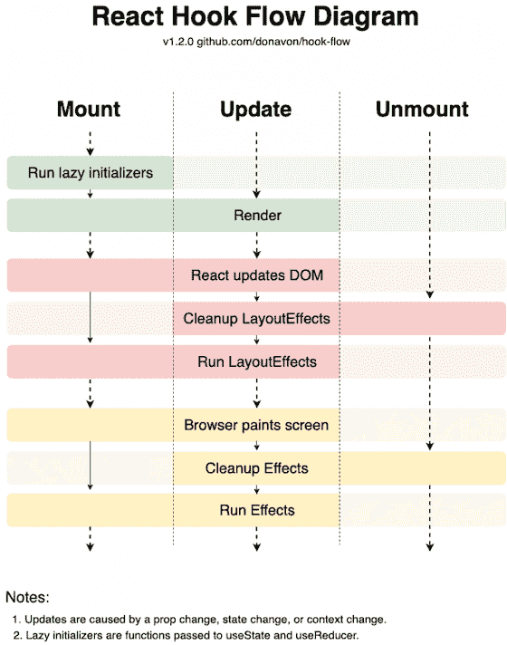
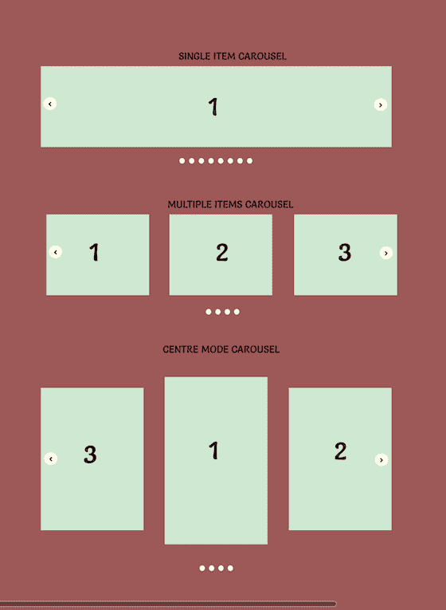
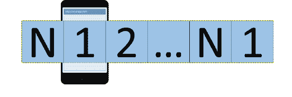
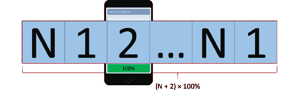
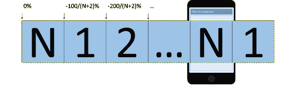

# 使用钩子在 React 中构建一个 carousel 组件

> 原文：<https://blog.logrocket.com/building-carousel-component-react-hooks/>

***编者按**:本文最后一次更新于 2023 年 2 月 1 日，介绍最近发布的 use-carousel-hook。要探索 React 钩子，请查看这个 [React 钩子备忘单](https://blog.logrocket.com/react-hooks-cheat-sheet-unlock-solutions-to-common-problems-af4caf699e70/)。*

当今 web 开发中的一个问题是不同层的纠缠。我们不仅面临与多个依赖项的强耦合，而且还将逻辑代码直接连接到某个样式层或表示层。最终的结果可能仍然比几年前的类似代码更容易重用，但它肯定比它应该的更难重用。

在本文中，我们将通过使用 [React 钩子](https://blog.logrocket.com/state-management-using-only-react-hooks/)来实现一个 carousel，试图简化纠缠。

*向前跳跃*:

## React 中的 Carousel 实现

看看 React 空间中可用的 carousel 实现的情况可能会令人望而生畏。还挺多的，而且每一家的承诺都不一样。有许多是相当古老的，而其他人是超级受欢迎的，有些人有许多依赖。然而，他们都有一个共同点，那就是他们对表现形式和风格都有自己的看法。

在我们的情况下，我们不希望这样。我们心中已经有了一种风格，我们希望用不同的风格来重用同一个旋转木马——例如，不仅要为一些箭头选择不同的颜色，而且实际上还要选择是否使用箭头。理想情况下，组件的整体使用由用户决定。最后，我们决定使用 React 钩子来实现我们自己的实现。

## 什么是 React 钩子？

React 钩子的引入是为了简化代码重用。React 团队引入钩子的一个原因是为了消除类组件，这需要更高程度的 JavaScript 知识，并且引入了更高的错误风险。核心原因是对 JavaScript 中`this`的正确理解，对于来自其他语言的人来说，这一切都不直观。

在 JavaScript 中，`this`是上下文绑定的，而不是实例绑定的。例如，如果一个方法作为回调传递，它将丢失它的上下文。如果该方法像函数一样被调用，那么上下文将是`undefined`。因此，为了避免这种情况，必须在方法中捕获`this`上下文。这可以通过包装方法(`() => f()`)、使用带箭头功能的字段(`f = () => {}`)或者使用它的绑定版本(使用`bind` ( `f = f.bind(this)`)来实现。

引入钩子的另一个原因是能够重用更容易处理组件状态和生命周期的代码。以前，我们有 React 类组件的 mixins，但是它们有很多问题，弊大于利。这里的核心问题是 mixins 仍然分别在不同的生命周期功能上运行。它们也只是在类组件实例中操作，这意味着不同的 mixins 互相影响的可能性很高(例如，通过覆盖变量)。

通过使用 React 钩子，我们可以很容易地将复杂的行为从它们的表示中分离出来。因此，代码可能是这样的:

```
const MyCarousel = ({ slideTime }) => {
  const carouselBehavior = useCarousel(slideTime);
  return <div className="my-carousel">...</div>;
};

```

尽管有各种各样的核心钩子，但最有趣的是`useState`(创建或获取一个状态单元)和`useEffect`(让我们能够根据某些条件执行副作用)。一旦状态变得复杂，`useReducer`也许还会得心应手。

下图可以很好地概括钩子的流程(或生命周期):



React 挂钩是与 React dispatcher 一起工作的简单函数。因此，它们需要在(相应组件的)呈现时被调用，并且必须以相同的顺序出现。一个结果是，React 钩子不应该出现在条件或循环中。此外，它们只能由功能组件使用。

## 了解转盘的基本状态

轮播是一个 UI 组件，它使用单个视图来显示多个项目。这些项目在视图中以旋转方式显示。一些传送带允许时间触发旋转；其他的允许用户使用项目符号(自由导航)或箭头(向前或向后)进行交互。在手机上，一种流行的模式是向前或向后滑动:



因此，转盘的基本状态可以写成:

```
const [current, setCurrent] = React.useState(0);

```

用初始值调用`useState`钩子的结果是一个包含当前值和改变当前值的回调的元组(即一个固定项数的数组)。这里，一个元组简化了我们的自定义命名。

如果我们想在一定时间后(`time`，以毫秒为单位)引入自动旋转，我们可以这样做:

```
React.useEffect(() => {
  const next = (current + 1) % slides.length;
  const id = setTimeout(() => setCurrent(next), time);
  return () => clearTimeout(id);
}, [current]);

```

幻灯片的数量由`slides.length`决定。由于模运算，我们确保当前幻灯片始终在 0(包括)和幻灯片数量(不包括)之间。

有趣的是，我们可以使用`useEffect`的第二个参数来确定何时必须触发副作用。通过将一个数组设置为`current`，我们告诉 React 处理之前的效果(有效地调用`clearTimeout`)，如果有的话，并再次运行它。

自然地，我们因此重置了手动用户交互的时钟(去任何地方，例如，前进)并且具有类似于`setInterval`的效果，但是更容易控制并且更符合 React 钩子的核心思想。

## 期望的传送带行为

因为我们已经为我们的 carousel 准备了两个潜在的构件——坦白地说，两个构件对于一个非常简单的 carousel 实现来说已经足够了——让我们看看我们想要什么行为。

显然，我们的传送带应该能够自动旋转。为此，我们需要一个像前面介绍的效果。但是，此外，用户应该能够向前或向后拖动当前幻灯片。通过一些 CSS 动画，这一切应该可以顺利运行。当用户开始拖动时，自动旋转应该被重置。

为了区分不同的模式，我们引入以下状态变量，这些变量在许多情况下是联合设置的:

```
const initialCarouselState = {
  offset: 0,
  desired: 0,
  active: 0
};

```

`offset`与管理用户当前的拖动努力相关。同样，`desired`和`active`也是必要的，用来指示当前活动的幻灯片和我们实际想要去的幻灯片。在持续过渡的情况下，两者是不同的。

我们对拖动和平滑滚动的要求要求我们在旋转中没有 N 个幻灯片(或“图像”)，但实际上是 N + 2 个。我们的需求应该是这样的:



当我们从通常的第一张幻灯片开始时，我们必须事先插入一张幻灯片(实际索引`0`，指的是最后第 n 张幻灯片)。当我们向左滑动或者将要向左滑动时，将使用这个伪滑动。但是，请注意，一旦我们到达这张幻灯片，我们将把偏移量重置为真正的幻灯片(没有任何过渡)。

一旦我们“进入”幻灯片组，前进或后退都没有问题:



在最后一张幻灯片上也可以看到与第一张幻灯片相同的问题。在这种情况下，有问题的不是向后(向右滑动)，而是向前(向左滑动)。同样，我们的解决方案是插入一个伪幻灯片(真实索引`N+1`)，这次是指第一张幻灯片。



请记住，当可视容器被设置为`overflow: hidden`时，内部容器将扩展到屏幕之外。因此，这个容器的宽度相对于可视(转盘)容器实际上是`(N + 2) * 100%`。

然而，内部容器内部的过渡指的是内部容器的宽度。因此，虽然内部容器的`width`可以是例如`500%`(对于三个载玻片)，但是从一个载玻片到另一个载玻片的平移将总是小于 100%。因为幻灯片的最小数量是三个(一个真实幻灯片和两个伪幻灯片—指的是同一个幻灯片)，所以翻译的最大大小是 33%。对于八个真实的幻灯片(即总共 10 个幻灯片)，我们在过渡之间得到 10%的偏移。

## 使用 React 钩子实现轮播状态

因为状态变量是联合使用的，所以我们应该使用`useReducer`钩子。如前所述，基于轮播状态的一种可能的实现如下所示:

```
function carouselReducer(state, action) {
  switch (action.type) {
    case "jump":
      return {
        ...state,
        desired: action.desired
      };
    case "next":
      return {
        ...state,
        desired: next(action.length, state.active)
      };
    case "prev":
      return {
        ...state,
        desired: previous(action.length, state.active)
      };
    case "done":
      return {
        ...state,
        offset: NaN,
        active: state.desired
      };
    case "drag":
      return {
        ...state,
        offset: action.offset
      };
    default:
      return state;
  }
}

```

使用`carouselReducer`就像写一样简单:

```
const [state, dispatch] = useReducer(carouselReducer, initialCarouselState);

```

可以通过库(`react-swipeable`)来引入高级触摸手势(滑动)。这个库已经给了我们一个提示:

```
const handlers = useSwipeable({
  onSwiping(e) {
    dispatch({
      type: "drag",
      offset: -e.deltaX
    });
  },
  onSwipedLeft(e) {
    const t = threshold(e.event.target);

    if (e.deltaX >= t) {
      dispatch({
        type: "next",
        length
      });
    } else {
      dispatch({
        type: "drag",
        offset: 0
      });
    }
  },
  onSwipedRight(e) {
    const t = threshold(e.event.target);

    if (-e.deltaX >= t) {
      dispatch({
        type: "prev",
        length
      });
    } else {
      dispatch({
        type: "drag",
        offset: 0
      });
    }
  },
  trackMouse: true,
  trackTouch: true
});

```

返回值是可以附加到任何容器的处理程序，用于跟踪拖动操作。`threshold`可以设置为任何值。在这个实现中，我们将其设置为容器宽度的三分之一(通过`e.event.target`获得)。

换句话说，在前面的代码中，我们区分了以下几种情况:

*   一个`drag`操作当前正在进行，我们需要在状态中反映当前的进度
*   一个`drag`操作成功完成，我们需要转到下一张或上一张幻灯片
*   一个`drag`操作没有成功完成——现在我们应该重置偏移量

整个国家机器在`useEffect`的协助下掌握好时机:

```
useEffect(() => {
  const id = setTimeout(() => dispatch({ type: "next", length }), interval);
  return () => clearTimeout(id);
}, [state.offset, state.active]);

useEffect(() => {
  const id = setTimeout(() => dispatch({ type: "done" }), transitionTime);
  return () => clearTimeout(id);
}, [state.desired]);

```

如前所述，第一个`useEffect`负责自动旋转。与前面给出的代码的唯一区别是使用了另一个依赖项来触发/处理旋转。由于我们的要求，我们还引入了`offset`。因此，如果拖动操作正在进行，我们将不会触发自动旋转。

第二个`useEffect`将是最终将活动状态设置为所需状态所必需的。因为我们使用 CSS 转换，所以我们不控制从 JS 的转换。因此，需要有一个相同时间的超时来帮助我们。

对于转换，我们设置以下常量:

```
const transitionTime = 400;
const elastic = `transform ${transitionTime}ms cubic-bezier(0.68, -0.55, 0.265, 1.55)`;
const smooth = `transform ${transitionTime}ms ease`;

```

当拖动当前幻灯片不足以向前或向后移动时，弹性过渡用于指示“弹回”。当我们转到另一张幻灯片时，平稳过渡是我们的首选。

最后，`useCarousel`钩子的一种用法如下:

```
export const Carousel = ({ slides, interval = 5000 }) => {
  const length = slides.length;
  const [active, setActive, handlers, style] = useCarousel(length, interval);

  return (
    length > 0 && (
      <div className="carousel">
        <ol className="carousel-indicators">
          {slides.map((_, index) => (
            <li
              onClick={() => setActive(index)}
              key={index}
              className={`${active === index ? "active" : ""}`}
            />
          ))}
        </ol>
        <div className="carousel-content" {...handlers} style={style}>
          <div className="carousel-item">{slides[slides.length - 1]}</div>
          {slides.map((slide, index) => (
            <div className="carousel-item" key={index}>
              {slide}
            </div>
          ))}
          <div className="carousel-item">{slides[0]}</div>
        </div>
      </div>
    )
  );
};

```

请注意，我们引入了行为部分中描述的两个副本；第一个轮播项目(指的是最后一张幻灯片)和最后一个轮播项目(指的是第一张幻灯片)允许连续拖动，产生周期性的体验(如轮播所期望的，即具有一定周期性的圆形对象)。

确切的风格——比如指标在哪里，或者我们是否使用指标——完全由我们决定。表示也与行为逻辑分离。我们只接收管理或决定转换显示逻辑的样式。同样，我们收到了附加在我们看到交互点的处理程序。

## `use-carousel-hook`

本文的主要目的是实现一个高度可配置的、非 pinion 化的、可重用的 carousel 组件，让用户能够构建自己的 carousel。到这次更新的时候，已经发布了一个新的钩子，它具备所有这些特性，并且易于集成和使用。在本节中，我们将快速了解如何使用这个钩子:`[use-carousel-hook](https://www.npmjs.com/package/use-carousel-hook)`。

是一个新的 React 挂钩，用于创建可配置的滑动传送带。就像上面我们自己的钩子一样，风格完全由用户决定，并且它还返回函数来集成到你的滑块中，以提供对你创建的旋转木马的完全灵活性和控制。

这些是函数:

```
import { useCarousel } from 'use-carousel-hook';
const { ref, previous, next, setCurrent, reset } = useCarousel();

```

`ref`将连接到包含转盘元件的转盘容器上。`previous`和`next`用于导航到转盘中的上一个或下一个元素。您也可以设置金额减少/增加；默认值为 1。`setCurrent`用于跳转到特定元素，当您想要一次显示多个元素时会很有帮助。当然，`reset`是回到旋转木马的开始。

下面的代码展示了实际运行的函数:

```
      return (
        <div>
            <button onClick={() => previous()}>Previous</button>
            <button onClick={() => previous(2)}>Go back 2 items</button>
            <button onClick={() => next()}>Next</button>
            <button onClick={() => next(2)}>Go forward 2 items</button>
            <button onClick={() => reset()}>Reset</button>
            <button onClick={() => setCurrent(2)}>Set index to 2</button>
            <ul ref={ref} className="carousel__list">
                <li className="carousel__item">
                  
                </li>
                <li className="carousel__item">
                  
                </li>
                <li className="carousel__item">
                  
                </li>
                <li className="carousel__item">
                  
                </li>
            </ul>
        </div>
    );

```

和一点点造型:

```
.carousel__list {
  display: flex;
  list-style: none;
  padding: 0;
  padding: 1rem 0 0;
  overflow: hidden;
  position: relative;
  width: 75vw;
  margin: 0 auto;
  max-width: 50rem;
}

.carousel__item {
  flex: 0 0 auto;
  width: 100%;
  padding: 0;
  margin: 0;
}

```

如你所见，这个库与我们实现的非常相似，它让用户在提供轮播核心功能的同时处理轮播的外观。这是 [CodeSandbox](https://codesandbox.io/s/usecarousel-demo-bb79e4?file=/src/styles.css) 以便近距离观察。

## 结论

使用 React 钩子，我们可以离可重用的软件更近一步。在给定的例子中，我们构建了一个相当复杂的 UI 组件，它能够以多种形式重用。完整代码可从 GitHub 获得。

也许`useLayoutEffect`会更好。我还不完全确定，但我的第一次测试表明`useEffect`足够好。你的想法和喜好是什么？你看到钩子在哪里发光？我很想听听你在评论中的想法！

## [LogRocket](https://lp.logrocket.com/blg/react-signup-general) :全面了解您的生产 React 应用

调试 React 应用程序可能很困难，尤其是当用户遇到难以重现的问题时。如果您对监视和跟踪 Redux 状态、自动显示 JavaScript 错误以及跟踪缓慢的网络请求和组件加载时间感兴趣，

[try LogRocket](https://lp.logrocket.com/blg/react-signup-general)

.

[ ](https://lp.logrocket.com/blg/react-signup-general) [](https://lp.logrocket.com/blg/react-signup-general) 

LogRocket 结合了会话回放、产品分析和错误跟踪，使软件团队能够创建理想的 web 和移动产品体验。这对你来说意味着什么？

LogRocket 不是猜测错误发生的原因，也不是要求用户提供截图和日志转储，而是让您回放问题，就像它们发生在您自己的浏览器中一样，以快速了解哪里出错了。

不再有嘈杂的警报。智能错误跟踪允许您对问题进行分类，然后从中学习。获得有影响的用户问题的通知，而不是误报。警报越少，有用的信号越多。

LogRocket Redux 中间件包为您的用户会话增加了一层额外的可见性。LogRocket 记录 Redux 存储中的所有操作和状态。

现代化您调试 React 应用的方式— [开始免费监控](https://lp.logrocket.com/blg/react-signup-general)。