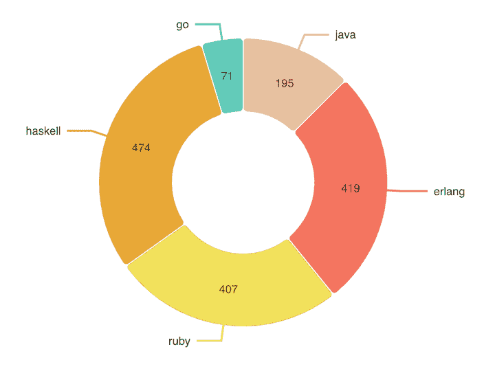

# 使用 Nivo - LogRocket 博客构建图表

> 原文：<https://blog.logrocket.com/building-charts-in-react-with-nivo/>

React 生态系统有一个非常丰富和庞大的社区，其中有许多开源库可以帮助我们解决各种各样的问题——从最基本、最常见的问题，如状态管理和表单，到最复杂的挑战，如数据的可视化表示。对于后者，很难找到合适的库来完成这项工作。

React 库通常在几个月内就被创建和废弃，使用特定库的决定会影响整个开发团队。这就是为什么为你计划嵌入到应用中的任何任务或功能选择正确的库是非常重要的。数据可视化也不例外。

在本教程中，我们将通过构建一些图表并在 React 应用程序中实现它们，向您展示如何使用 Nivo，这是 React 的一个数据可视化库。我们将重点介绍几个关键组件，并展示它们如何协同工作，使数据在视觉上更吸引用户。

## 为什么要使用 React 图表库？

在 React 中使用库进行数据可视化的最重要的好处是能够实现各种各样的图表，而无需重新发明轮子。你不应该花费你宝贵的时间去实现一个简单的条形图。Nivo 等强大的图表库可以帮助您节省时间，实现更好的结果，并为 React 应用程序创建独特的用户体验。

以一种美观的方式表示数据可以让您的应用程序看起来更新鲜、更现代。如今，大多数公司都使用某种数据可视化特性来提供有洞察力和令人愉快的用户体验。

构建自己的数据可视化或图表库既困难又耗时。许多已经着手这样做的开发者发现果汁不值得压榨。

## Nivo 是什么？

Nivo 是 React 应用程序的一个丰富的数据可视化组件。它包括各种组件，可用于在现代 React 应用程序中显示图形和数据。

Nivo 构建在 D3.js 之上，并带有强大的额外功能，如服务器端呈现和声明性图表。这是一个高度可定制的数据可视化库，提供了编写良好的文档，包含许多示例和响应性数据可视化组件。它还支持开箱即用的运动和过渡。

## 为什么用 Nivo 而不用 D3？

JavaScript 应用程序最流行的数据可视化工具之一是 D3.js 库。 [D3 是一个强大的图表库](https://blog.logrocket.com/using-d3-to-create-a-calendar-app/),它使你能够使用 HTML、SVG 和 CSS 将数据变得生动。

D3.js 的唯一问题是它有一个陡峭的学习曲线，你的代码一定会变得非常复杂。D3.js 大量使用 SVG、HTML 和 CSS。为了正确使用这个库，您必须很好地理解 SVG 和 DOM 是如何工作的。

不要误解我——D3 . js 是一个非常强大和有用的库，用于在现代应用程序中构建数据可视化。但是大多数时候，你不想花几个小时去创建一个简单的条形图。React 完全是关于可重用性的，Nivo 使您能够创建可重用的组件，这样做可以省去几个小时的调试。

Nivo 是 React 中数据可视化的更好选择，因为它消除了构建组件的复杂性。使用 Nivo，您可以更有效地工作，定制您的组件，并轻松创建各种各样的数据可视化。

## 安装 Nivo

在 React 应用程序中使用 Nivo 的第一步是将其安装到项目中:

```
yarn add @nivo/core

```

当我们安装核心包时，它并不包含库的所有组件。这听起来像是一个缺点，但实际上是一件好事。

我们不想仅仅为了使用单个组件而添加一个会增加我们的包大小的沉重的包。相反，我们可以添加使用特定组件所需的特定包。

让我们将第一个 Nivo 组件包添加到 React 应用程序中。

## 构建条形图

首先，我们将添加[条形图组件](https://nivo.rocks/bar/)以在 React 应用程序中使用它:

```
yarn add @nivo/bar

```

条形图组件有许多功能。它可以堆叠或并排显示数据。它支持垂直和水平布局，并且可以定制为呈现任何有效的 SVG 元素。

我们将把`bar`组件导入到我们的文件中，这样我们就可以开始使用 Nivo 创建我们的第一个条形图。

```
import { ResponsiveBar } from '@nivo/bar'

```

要开始使用 bar 组件，我们需要一个道具:`data`。`data`属性是我们传递给`ResponsiveBar`组件的对象数组。每个对象应该至少有一个索引数据的键属性和一个确定每个序列的键属性。

我们将使用以下对象:

```
const data = [
  {
    day: "Monday",
    degress: 59
  },
  {
    day: "Tuesday",
    degress: 61
  },
  {
    day: "Wednesday",
    degress: 55
  },
  {
    day: "Thursday",
    degress: 78
  },
  {
    day: "Friday",
    degress: 71
  },
  {
    day: "Saturday",
    degress: 56
  },
  {
    day: "Sunday",
    degress: 67
  }
];

```

我们将这个`data`数组传递给我们的`ResponsiveBar`组件。`ResponsiveBar`组件需要一个`indexBy`字符串来索引数据和一个`keys`属性，后者是一个字符串数组，用于确定每个序列。

我们将把我们的`degrees`属性作为键来传递，并且我们希望通过`days`来索引我们的数据。我们的组件最终会变成这样:

```
const Bar = () => {
  return (
    <ResponsiveBar
      data={data}
      keys={["degress"]}
      indexBy="day"
      margin={{ top: 50, right: 130, bottom: 50, left: 60 }}
      padding={0.4}
      valueScale={{ type: "linear" }}
      colors="#3182CE"
      animate={true}
      enableLabel={false}
      axisTop={null}
      axisRight={null}
      axisLeft={{
        tickSize: 5,
        tickPadding: 5,
        tickRotation: 0,
        legend: "degrees",
        legendPosition: "middle",
        legendOffset: -40
      }}
    />
  );
};

```

现在我们有了一个漂亮而强大的使用 Nivo 的数据可视化组件！如您所见，只需几行代码，我们就可以获得如下强大的结果:


## 构建饼图

饼图将数字数据显示为单个圆形的切片。这种类型的数据可视化适用于几乎所有的行业和各种各样的用例。

Nivo 有一个[饼图组件](https://nivo.rocks/pie/)，可以用下面的命令安装:

```
yarn add @nivo/pie

```

类似于`bar`组件，`pie`组件需要一些道具来工作:对象的`data`数组和用于显示饼图的`width`和`height`。

我们传递给 pie 组件的`data`对象可能会有一点不同。我们可以使用许多属性，比如`id`、`label`、`value`和`color`，来定制我们的饼状图。

我们有一个对象数组，每个对象都有一个特定的属性，将在我们的饼图中使用:

*   `id`属性是数组中每个对象的唯一值
*   `value`属性是将要呈现在图表上的对象的值
*   `color`对象是一个字符串，我们将把它作为图表中对象的颜色来传递
*   属性是我们对象的标签名

```
const data = [
  {
    id: "java",
    label: "java",
    value: 195,
    color: "hsl(90, 70%, 50%)"
  },
  {
    id: "erlang",
    label: "erlang",
    value: 419,
    color: "hsl(56, 70%, 50%)"
  },
  {
    id: "ruby",
    label: "ruby",
    value: 407,
    color: "hsl(103, 70%, 50%)"
  },
  {
    id: "haskell",
    label: "haskell",
    value: 474,
    color: "hsl(186, 70%, 50%)"
  },
  {
    id: "go",
    label: "go",
    value: 71,
    color: "hsl(104, 70%, 50%)"
  }
];

```

我们还可以通过传递属性来定制我们的`pie`组件，比如`padAngle`和`cornerRadius`。`padAngle`道具决定了图表中每个对象之间的角度。`cornerRadius`道具是我们可以作为每个对象的边界半径传递的值。

我们最后的组件是这样的:

```
const Pie = () => {
  return (
    <ResponsivePie
      data={pieData}
      margin={{ top: 40, right: 80, bottom: 80, left: 80 }}
      innerRadius={0.5}
      padAngle={0.7}
      cornerRadius={3}
      activeOuterRadiusOffset={8}
      borderWidth={1}
      borderColor={{ from: "color", modifiers: [["darker", 0.2]] }}
      arcLinkLabelsSkipAngle={10}
      arcLinkLabelsTextColor="#333333"
      arcLinkLabelsThickness={2}
      arcLinkLabelsColor={{ from: "color" }}
      arcLabelsSkipAngle={10}
      arcLabelsTextColor={{ from: "color", modifiers: [["darker", 2]] }}
    />
  );
};

```

最终结果应该是这样的:



## 结论

Nivo 为在 React 应用程序中创建数据可视化提供了许多不同的组件。其庞大的组件列表包括一个[日历组件](https://nivo.rocks/calendar/)，一个 [Choropleth 组件](https://nivo.rocks/choropleth/)(一个划分的地理区域组件)，一个[树状图组件](https://nivo.rocks/treemap/)，等等。

除了条形图和饼图之外，您可以应用我们在本教程中学到的大多数技术来创建其他类型的数据可视化组件。这里的想法是让您了解使用 Nivo 可以实现什么，以及这个数据可视化库有多强大。

给定任务没有正确或错误的图表库；这完全取决于你想要达到的结果和你项目的要求。也就是说，Nivo 提供的工具和功能使它成为一个优秀的图表库，可以在 React 中创建令人惊叹的、有影响力的数据可视化。

Nivo 是开源的，它周围的社区非常活跃，非常有用。文档写得很好，您可以在几分钟内学会如何使用一些组件。最终，组件的广泛选择和它们所服务的各种用例使 Nivo 成为最好的 React 图表库之一。

## 使用 LogRocket 消除传统反应错误报告的噪音

[LogRocket](https://lp.logrocket.com/blg/react-signup-issue-free)

是一款 React analytics 解决方案，可保护您免受数百个误报错误警报的影响，只针对少数真正重要的项目。LogRocket 告诉您 React 应用程序中实际影响用户的最具影响力的 bug 和 UX 问题。

[ ](https://lp.logrocket.com/blg/react-signup-general) [  ](https://lp.logrocket.com/blg/react-signup-general) [LogRocket](https://lp.logrocket.com/blg/react-signup-issue-free)

自动聚合客户端错误、反应错误边界、还原状态、缓慢的组件加载时间、JS 异常、前端性能指标和用户交互。然后，LogRocket 使用机器学习来通知您影响大多数用户的最具影响力的问题，并提供您修复它所需的上下文。

关注重要的 React bug—[今天就试试 LogRocket】。](https://lp.logrocket.com/blg/react-signup-issue-free)