# 使用 DialogFlow、Node.js 和 React - LogRocket Blog 构建聊天机器人

> 原文：<https://blog.logrocket.com/building-chatbots-dialogflow-node-js-and-react/>

对我们人类来说，谈话是第二天性；对我们来说，这很自然，但对机器人来说就不一样了。甚至是一个简单的问题，比如“今天过得怎么样？”，可以用几种方式重新表述(例如，“进展如何？”“你好吗？”)，这些机器人通常都无法理解。

我们可以解释这个问题背后的意图，但构建逻辑以促进与机器人进行更智能的对话需要很多时间，对于大多数开发人员来说，从头开始编写代码是不可行的。

幸运的是，有一种叫做 NLU(自然语言理解)的东西，它可以实现更好的人机对话——换句话说，一种智能聊天机器人，它利用机器学习和其他技术来更好地理解人类互动。

NLU 算法不仅能识别文本，还能解释文本背后的意图。因此，它是聊天机器人的理想算法。点击阅读更多关于 NLU 的信息。

这就是本文的目的所在。我们将使用谷歌的 NLU 平台 DialogFlow 来构建我们的聊天机器人。继续阅读这篇后续教程，了解关于 DialogFlow 的更多信息，以及如何将其集成到 React 应用程序中。

## DialogFlow 入门

简单来说，DialogFlow 是一款由 NLU 提供支持的端到端工具，用于设计聊天机器人并将其集成到我们的界面中。它使用由我们提供的语言训练的机器学习(ML)模型，将自然语言翻译成机器可读的数据。它是如何工作的？让我们边做聊天机器人边学习吧。

打开 [DialogFlow](https://dialogflow.cloud.google.com/#/login) 控制台，使用您的 Google 帐户登录。成功登录后，我们会看到以下界面:

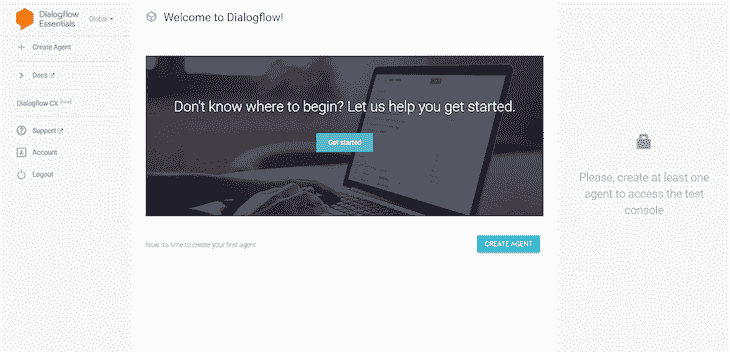

首先可能引起您注意的是 Create Agent 选项。

## 什么是代理？

没什么花哨的！聊天机器人本身就是一个代理。收集用户的查询，处理它，最后发送响应都是由我们的代理处理的。

让我们创建我们的聊天机器人；以咖啡店为例，机器人怎么样？猜猜我的咖啡店灵感没有奖品。

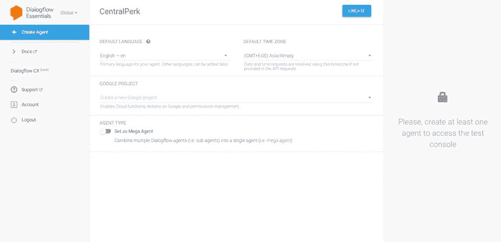

控制台现在应该是这样的:

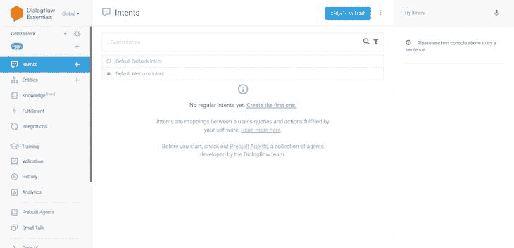

现在，屏幕上出现了更多的行话——意图。

## 意图是什么？

控制台说“意图是用户的查询和你的软件完成的动作之间的映射”。那么，这意味着什么呢？

让我解释一下:在我们的机器人的例子中，我们希望收到类似“我想要一杯卡布奇诺”和“商店什么时候开门？”等。我们可以将这些查询分类为用户意图，比如“接受订单”、“计时”等。为了处理它们，我们在代理中将这些类别定义为意图。

我们还看到我们的代理带有两个默认意图；默认欢迎意图和默认回退意图。让我们更详细地探讨一下:

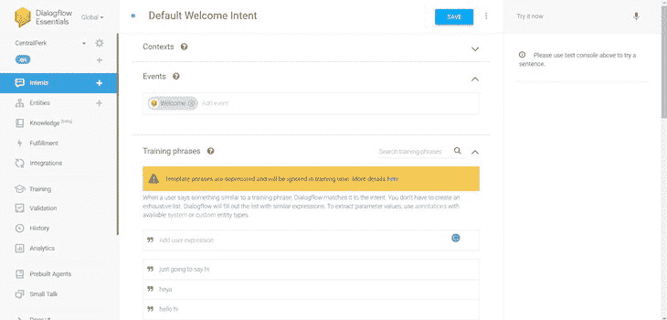

这里有相当多的术语。让我们一个一个地看一下:

### 内容

在人类对话中，为了理解短语，我们通常需要一些上下文。同样，对于机器人，意图需要知道查询的上下文。为了使这成为可能，我们通过上下文将一个或多个意图联系起来。我们将在本文后面了解更多这方面的内容。

### 训练短语

这些示例短语用于训练和帮助我们的代理将查询与正确的意图相匹配。更多的短语和变体将提高意图匹配的准确性。

通过查看默认的短语列表，很明显这个意图是用来问候我们的用户的。

### 事件

我们刚刚了解到代理寻找训练短语来触发意图。然而，意图也可以由事件触发。有两种类型的事件:

*   平台事件:这些事件由平台本身提供，当特定于平台的事件发生时发生(例如， *Welcome* 事件)
*   自定义事件:这些是由我们定义的(例如，来自我们发出的 API 调用的响应)

### 动作和参数

一旦查询与正确的意图相匹配，接下来就是对其采取行动。为了采取行动，有时我们需要从查询中提取一些数据。为了提取，我们用实体类型定义参数。以此为例:“咖啡店今天开门吗？”；这里要提取的参数是 today，这是执行一些逻辑并做出相应响应所需的关键信息。我们将在本教程的后面了解更多。

### 反应

对用户的响应。这里，我们看到静态短语，但是如果我们利用参数或实现，它们也可以是动态的。

### 完成

当我们启用 fulfillment 时，代理通过我们定义的 API 调用给出动态响应(例如，如果用户想要预订一张桌子，我们可以检查数据库并根据可用性做出响应)。稍后，我们将再次详细介绍这一点。

在进一步讨论之前，让我们先尝试一下这个默认意图。在右侧，我们有一个 Dialogflow 模拟器来测试我们的代理。我们说一些类似于训练短语的话，代理从响应列表中做出响应:

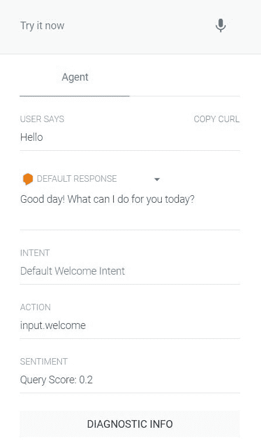

如果我们说了完全不同的话，代理会触发默认的回退意图:

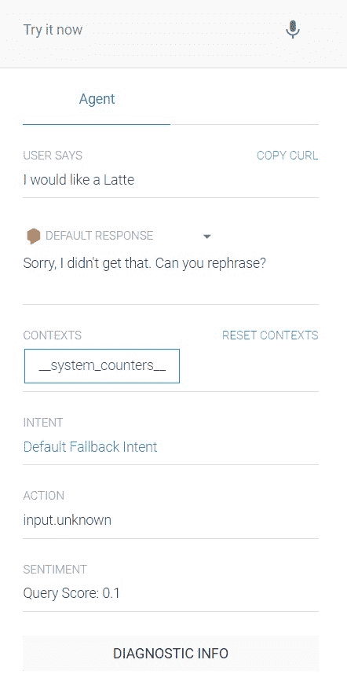

因此，如果代理无法找到正确的意图，它会触发回退意图。很顺利，对吧？但是，让我们尽量避免它，并添加意图进行整个谈话。

## 添加常规意图

让我们尝试创建下图所示的对话:

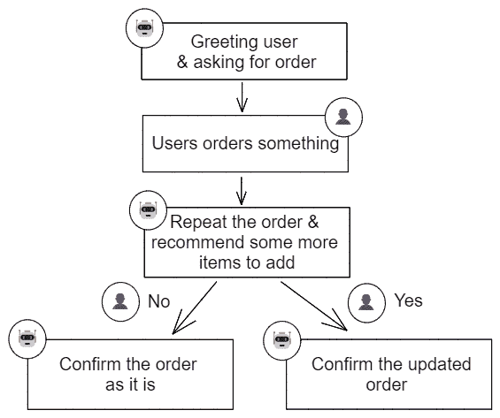

修改**默认欢迎意图**的响应，以问候和请求订单。类似这样的东西；“问候！你想点什么？”。

创建一个接受订单的意图，并给这个意图起一个简单有意义的名字，比如**接受订单**。

现在，我们添加训练短语。用户可能会说，“我想要两杯拿铁”。将这一点添加到训练短语列表中就足以使它与这一意图相匹配。但是，我们也需要合格信息；“两杯”和“拿铁”。

为了提取它们，我们将在短语–quantity(@ sys . number 实体类型)和 item (@sys.any 实体类型)中添加几个参数:

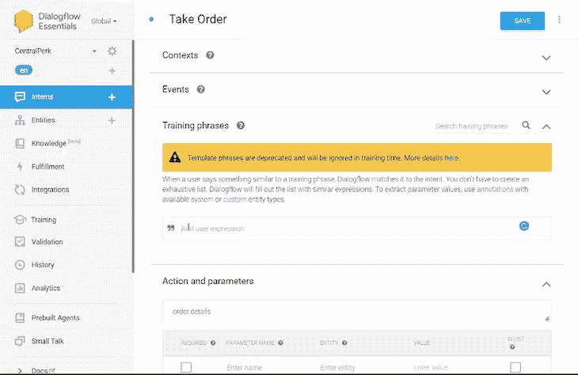

添加更多的变化，使它更好。以下是我补充的一些内容:

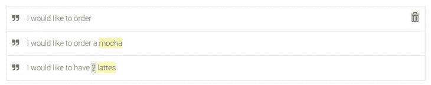

一旦添加了参数丰富的短语，这个表就会自动填充。我们可以将它们标记为必需/可选，并根据需要设置默认值。此外，我们需要定义一个问题作为提示，如果第一次没有输入，就强制用户输入所需的参数。

因此，这意味着如果我们从列表中获得第一个短语“我想订购”，并且缺少项目(必需的)，提示将被触发来询问它。如果我们从列表中得到第二个短语。“我想点一杯摩卡”，并且数量(可选)不存在，那么，我们不提示用户输入数量，而是将默认值设置为“1”并使用它。

我们可以返回一个动态响应，利用参数重复订单，并询问他们是否想要一个附加产品:

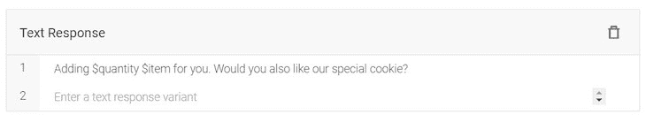

为此，创建一个意图来处理用户对附加问题的响应。

回答要么是，要么不是。这是引入跟进意向的理想场景。顾名思义，这些用于跟进父意图中的对话。

DialogFlow 为常见回复提供了许多预定义的后续意图，如“是”、“否”或“取消”。此外，如果您需要处理自定义回复，您可以创建自己的自定义跟进。在本教程中，我们将使用预定义的方法，但如果您想在其中加入自己的想法，这取决于您。

在意向列表中，将鼠标悬停在采购意向上，然后单击添加跟进意向。选择是，后续意图被创建，命名为*接受订单-是*。

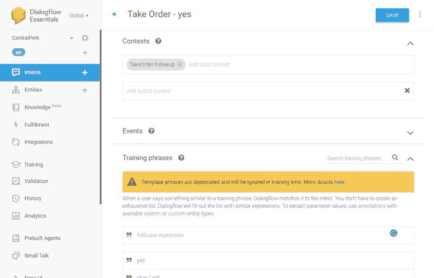

您可能已经注意到添加了一个输入上下文(TakeOrder-followup)。为了使后续工作有效，它们需要与父母的意图相联系，这就是上下文派上用场的地方。

当我们创建后续意图时，输出上下文会自动添加到父意图，而同名的输入上下文会添加到后续意图。

我们不需要担心训练短语，因为它们已经存在了。现在，为这个意图添加一个动态响应。当上下文就位时，我们可以使用来自父意图的参数，如下所示:

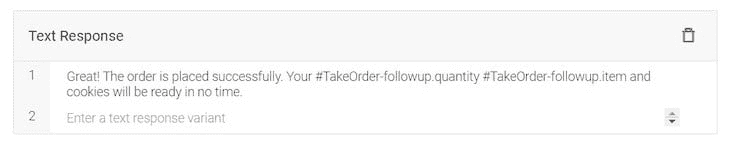

类似地，创建一个预定义的跟进意图来处理“否”响应。这一个将被命名为*接单–编号为*。在这里也添加一个动态响应:

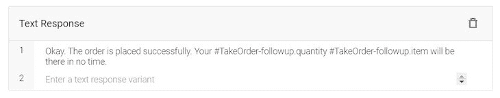

代理准备好进行对话。我们总是可以在模拟器中测试它，但是让我们尝试一些不同的东西。点击侧边栏中的“集成”并启用 Web 演示。打开此处提供的 URL 并开始对话:

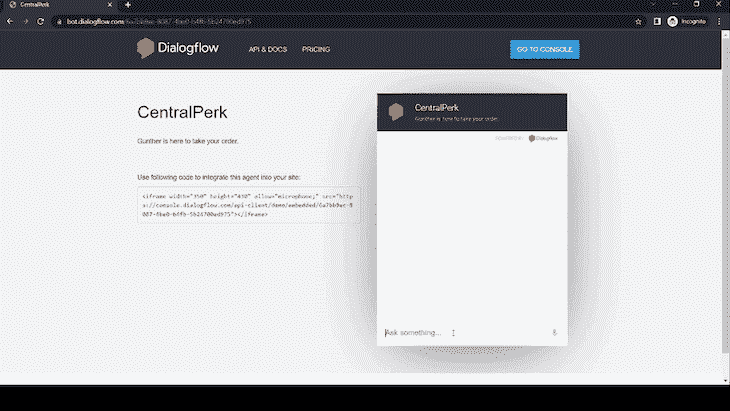

代理工作正常，但是显示订单的总账单金额不是很好吗？我们可以从服务器获取价格，并将计算出的金额返回给用户。

## 与 Node.js 服务器连接

在讨论意图时，我们遇到了实现，它通过调用我们定义的 API 来帮助返回动态响应。这就是我们与服务器交互所需要的。

在侧边栏中找到 Fulfillment 并打开它。DialogFlow 提供了两种使用实现的方式:

*   由谷歌云功能支持的内嵌编辑器。但是，要实现这一点，我们需要添加一个有效的计费帐户，因为如果使用超过一定的限制，这种集成会产生费用
*   webhook 服务

我要建立一个 webhook 服务，并将其公开。继续之前，请确保服务满足此处提到的[要求。](https://cloud.google.com/dialogflow/es/docs/fulfillment-webhook)

### 构建我们的服务器

在新目录中创建一个节点应用程序，并安装必要的依赖项:

```
mkdir centralperk-server
cd centralperk-server
npm init -y
npm i express dialogflow-fulfillment
```

从 index.js 中的一个基本服务器开始:

```
const express = require("express");
const app = express();

app.get("/", (req, res) => {
  res.send("Hi from server!");
});

app.listen(8080, () => {
  console.log("server running...");
});
```

这只是在端口 8080 运行服务器。现在，让我们编写一些代码来处理来自 DialogFlow 的 webhook 请求:

```
const express = require("express");
const app = express();

const { WebhookClient } = require("dialogflow-fulfillment");
const getPrice = require("./helpers");

app.get("/", (req, res) => {
  res.send("Hi from server!");
});

app.post("/", express.json(), (req, res) => {
  const agent = new WebhookClient({ request: req, response: res });

  function handleIntent(agent) {
    const intent = agent.intent;
    const item = agent.contexts[0].parameters.item;
    const quantity = agent.contexts[0].parameters.quantity;
    const billingAmount = getPrice(intent, item, quantity);

    const response =
      intent === "Take Order - yes"
        ? `Great! Your ${quantity} ${item} and cookies will be ready in no time. Please pay ${billingAmount}$.`
        : `Okay! Your ${quantity} ${item} will be ready in no time. Please pay ${billingAmount}$.`;

    agent.add(response);
  }

  const intentMap = new Map();
  intentMap.set("Take Order - yes", handleIntent);
  intentMap.set("Take Order - no", handleIntent);
  agent.handleRequest(intentMap);
});

app.listen(8080, () => {
  console.log("server running...");
});
```

计算价格的助手:

```
const priceList = {
  mocha: 5,
  latte: 7,
  cookies: 2,
};

module.exports = function (intent, item, quantity) {
  const total =
    intent === "Take Order - yes"
      ? priceList[`${item}`] * quantity + priceList["cookies"]
      : priceList[`${item}`] * quantity;

  return total;
};
```

让我们浏览一下上面的实现。

导入的 WebhookClient 将处理与 DialogFlow 的 webhook 实现 API 的通信。当实现的意图匹配时，一个 HTTPS 邮报网络挂钩请求被发送到我们的服务器。此请求由 agent.handleRequest(intentMap)处理。它接受处理程序的映射，每个处理程序都是一个函数回调。这里定义的方法从传递的实例中提取所有需要的信息，计算账单金额，然后最终返回动态响应。

### 公开服务器

使用 ngrok 是将服务器放在互联网上最快最简单的方法。按照此处的步骤[进行快速设置和安装。完成这些步骤后，运行以下命令:](https://dashboard.ngrok.com/get-started/setup)

```
ngrok http 8080
```

安全的公共 URL 很快就准备好了:

```
ngrok                                                                                                   (Ctrl+C to quit)                                                                                                                        Visit http://localhost:4040/ to inspect, replay, and modify your requests                                                                                                                                                                       Session Status                online                                                                                    Account                       Piyush (Plan: Free)                                                                       Version                       3.0.6                                                                                     Region                        India (in)                                                                                Latency                       55ms                                                                                      Web Interface                 http://127.0.0.1:4040                                                                     Forwarding                    https://2c73-182-64-199-236.in.ngrok.io -> http://localhost:8080                                                                                                                                                  Connections                   ttl     opn     rt1     rt5     p50     p90                                                                             5       0       0.00    0.01    2.37    5.21
```

(注意:记得保持本地服务器启动和运行)

### 启用 webhook

继续操作，在执行窗口中启用 webhook，并输入安全的公共 URL。此外，请记住，对于这两种跟进意图，都需要启用 webhook 调用。

一切看起来不错。现在让我们来测试一下:

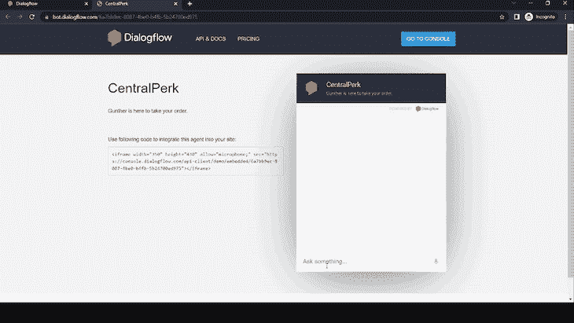

我们的聊天机器人都设置好了！

## 将 DialogFlow 聊天机器人集成到 React 应用程序中

有许多方法可以将聊天机器人集成到 React 应用程序中:

*   从头开始在 React 中构建聊天小部件。使用像 Redux 这样的库处理传入和传出消息的状态，并修改节点服务器以处理来自 React 应用程序的调用，并将它们发送到 DialogFlow。这听起来确实很有趣，但是涉及的内容太多，超出了本文的范围
*   使用[通信](https://www.kommunicate.io/)更加轻松地将 DialogFlow 聊天机器人集成到 React 应用程序中

在这篇博客教程中，我们将使用通信选项。

### 安静是:公报集成

请遵循以下步骤:

去免费试用，并用你的谷歌帐户注册。

单击 Bot 集成并选择对话流 ES。

使用下图中提到的说明从 DialogFlow 云帐户获取 JSON 密钥:

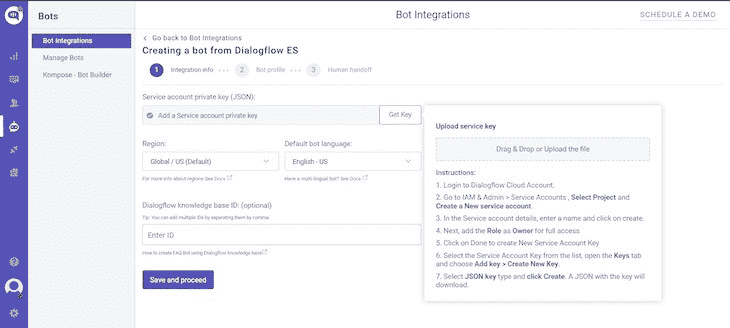

接下来，我们要选择一个定制的头像:

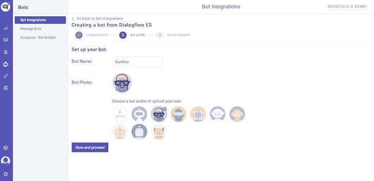

这就是我们为对话流和通信集成所需要做的一切！


创建一个 chatbot 组件，并将以下代码粘贴到 useEffect()中:

```
(function (d, m) {
      var kommunicateSettings = {
        appId: "<YOUR APP_ID>",
        popupWidget: true,
        automaticChatOpenOnNavigation: true,
      };
      var s = document.createElement("script");
      s.type = "text/javascript";
      s.async = true;
      s.src = "https://widget.kommunicate.io/v2/kommunicate.app";
      var h = document.getElementsByTagName("head")[0];
      h.appendChild(s);
      window.kommunicate = m;
      m._globals = kommunicateSettings;
    })(document, window.kommunicate || {});
```

```
import React, { useEffect } from "react";

function Chatbot() {
  useEffect(() => {
    (function (d, m) {
      var kommunicateSettings = {
        appId: "<YOUR APP_ID>",
        popupWidget: true,
        automaticChatOpenOnNavigation: true,
      };
      var s = document.createElement("script");
      s.type = "text/javascript";
      s.async = true;
      s.src = "https://widget.kommunicate.io/v2/kommunicate.app";
      var h = document.getElementsByTagName("head")[0];
      h.appendChild(s);
      window.kommunicate = m;
      m._globals = kommunicateSettings;
    })(document, window.kommunicate || {});
  }, []);
  return <div></div>;
}

export default Chatbot;
```

记得用 appId 替换占位符。最后，将其导入到 App 组件中:

```
import "./App.css";
import Chatbot from "./Chatbot";

function App() {
  return (
    <div className="App">
      <Chatbot />
    </div>
  );
}

export default App;
```

在本地运行应用程序以测试集成:

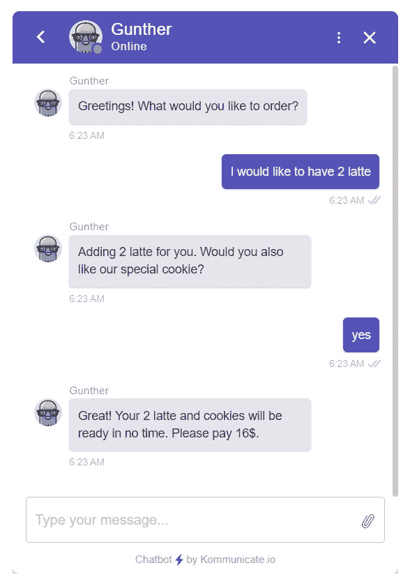

就这样，我们将聊天机器人添加到了 React 应用程序中。访问[这个](https://dashboard.kommunicate.io/settings/chat-widget-customization#chat-widget-styling)仪表板，添加更多自定义内容，如颜色、图标和通知声音等。

## 结论

这个博客到此为止！我们学习了聊天机器人开发的几个方面；从用 DialogFlow 搭建，连接 [Node.js](https://blog.logrocket.com/tag/node/) 服务器，到最后集成到 React app 中。我希望它对你有意义，并且你能够轻松地跟随这个教程。

如果你有什么问题，可以在评论里留下，我很乐意回答。请随时通过 LinkedIn 或 T2 Twitter 联系我。

## [LogRocket](https://lp.logrocket.com/blg/react-signup-general) :全面了解您的生产 React 应用

调试 React 应用程序可能很困难，尤其是当用户遇到难以重现的问题时。如果您对监视和跟踪 Redux 状态、自动显示 JavaScript 错误以及跟踪缓慢的网络请求和组件加载时间感兴趣，

[try LogRocket](https://lp.logrocket.com/blg/react-signup-general)

.

[ ](https://lp.logrocket.com/blg/react-signup-general) [](https://lp.logrocket.com/blg/react-signup-general) 

LogRocket 结合了会话回放、产品分析和错误跟踪，使软件团队能够创建理想的 web 和移动产品体验。这对你来说意味着什么？

LogRocket 不是猜测错误发生的原因，也不是要求用户提供截图和日志转储，而是让您回放问题，就像它们发生在您自己的浏览器中一样，以快速了解哪里出错了。

不再有嘈杂的警报。智能错误跟踪允许您对问题进行分类，然后从中学习。获得有影响的用户问题的通知，而不是误报。警报越少，有用的信号越多。

LogRocket Redux 中间件包为您的用户会话增加了一层额外的可见性。LogRocket 记录 Redux 存储中的所有操作和状态。

现代化您调试 React 应用的方式— [开始免费监控](https://lp.logrocket.com/blg/react-signup-general)。