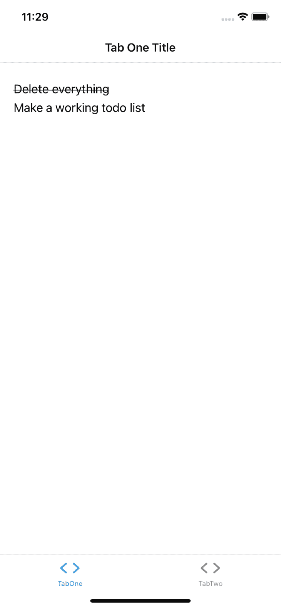

# 用 Expo 而不是 React Native - LogRocket 博客构建跨平台应用

> 原文：<https://blog.logrocket.com/building-cross-platform-apps-expo-instead-of-react-native/>

在本教程中，我们将学习如何使用 [Expo](https://expo.io/) 构建一个运行在 iOS、Android 和 web 上的跨平台应用程序。

## React Native vs. Expo:有什么区别？

在我们开始使用 Expo 之前，我想介绍一下它与 React Native 的相似之处和不同之处。

简而言之，Expo 是 React Native 的超集。React Native 做 Expo 能做的一切，React Native 做不到 Expo 能做的一切(默认)。

React Native 为您提供了所有的工具和选项，而 Expo 为您做出了一些决定。这些决策是基于 React 本地应用通常需要什么，因此，从等式中去掉了许多繁琐的工作和决策。

此外，因为它是一个标准化的平台，它使您能够利用许多令人惊叹的工具和服务，如 Expo Snack，它允许您在浏览器中构建本机应用。

现在，让我们用 Expo 构建一个跨平台的应用程序。

## 安装 Expo

Expo 有一些我见过的最好的文档，但是我会给你一个如何安装它的快速纲要。

有趣的是，尽管 Expo 是 React Native 的超集，但我们实际上不必在我们的系统上安装 React Native 来构建 Expo 应用程序。我们将利用他们的基础架构在幕后完成繁重的工作。

世博会有三个要求:

1.  [Node.js(随 LTS 版本走)](https://nodejs.org/en/)
2.  [去](https://git-scm.com/downloads)
3.  [Watchman](https://facebook.github.io/watchman/docs/install#buildinstall) (Watchman 看文件自动刷新 app)

有了这些系统，你就可以通过 NPM 在全球范围内安装 Expo CLI。

```
npm install --global expo-cli

```

通过运行`expo whoami`来验证安装。您应该看到您没有登录。

因为我们将利用博览会的基础设施，我们需要创建一个帐户。您可以通过`expo register`或使用`expo login`登录您现有的账户来完成。

在我们开始构建之前，让我们想想如何运行我们的应用程序。我们将在三个平台上工作:iOS、Android 和 web。

网络是最简单的。对于 iOS 和 Android，我会建议从 app store 下载 Expo Go 应用。这将允许您在您的设备上访问您的世博会应用程序，而不必通过发布过程。不要担心，以后你可以用你自己的品牌发布你的应用——这只会让开发变得非常快。

## 创建跨平台应用程序

创建新的 Expo 应用程序就像运行以下命令行一样简单:

```
expo init MyCrossPlatformApp

```

当您运行它时，应该会提示您选择一个模板。

> 关于托管与裸工作流的重要说明:“托管”意味着您正在利用 Expo 的基础设施。“裸露”意味着你在使用他们的模板，断开他们的服务，然后自己管理一切。您始终可以从受管工作流导出到裸工作流，但不能返回。我总是建议从管理工作流开始。

我将选择“tabs (TypeScript)”模板，这样我们就能获得最大的收益(即导航全部设置好)。


我们做到了！一款跨平台的应用，可以在 iOS、Android 和网络上运行。运行`yarn start`,它会打印出一个二维码，你可以从你的 iOS 或 Android 设备上的摄像头扫描该二维码，以打开 Expo Go 应用程序，运行它，并在每次文件保存时获得实时刷新。

或者，您可以运行`yarn web`，它将打开浏览器。

如果您的机器上安装了 iOS 模拟器或 Android 模拟器，您可以运行它们，它会打开相应的模拟器或模拟器，但这不是必需的。

## 世博项目导航

我们选择的世博会模板为您搭建了一个很好的平台。您可能会对各种文件和文件夹感兴趣:

*   **app . tsx**–这是我们文件的入口点。这是进行应用程序所需的任何设置工作的好地方
*   **屏幕/**–该目录包含我们在导航器中注册的屏幕
*   **导航/**–该目录管理与导航相关的一切。由于我们针对的所有平台，它可能会变得非常广泛，但是 Expo 模板中包含的 React 导航大大简化了事情
*   **Hooks/**–Hooks 是 React/React 原生应用中管理功能的常用方式。这个目录编译来自应用程序的定制钩子
*   **constants/**–该目录用于保存不变的静态值
*   **components/**–这个目录是您想要存储组成应用程序功能的可重用组件的地方。它们被屏幕甚至其他组件使用

## 在 Expo 中编写代码和创建待办事项列表

让我们进入一些代码，创建一个简单的待办事项列表。我们将在`screens/TabOneScreen.tsx`工作。继续删除文件中的所有内容。

首先，我们有我们的进口。这些是我们将用来构建我们的用户界面，然后添加功能。

```
import * as React from "react";
import { StyleSheet, TextInput, ScrollView, View, Text } from "react-native";

```

注意，`react-native`导入实际上映射到应用程序运行平台的底层原生视图。例如，一个`View`变成了:

*   iOS → `UIView`
*   安卓→ `ViewGroup`
*   网页→ `div`

接下来，让我们创建一个任务列表。

```
// ... 

export default function TabOneScreen() {
  const tasks = [
    { title: "Delete everything", complete: true },
    { title: "Make a working todo list", complete: false },
  ];

  return (
    <ScrollView
      style={styles.container}
      contentContainerStyle={styles.contentContainer}
    >
      <View style={styles.tasksContainer}>
        {tasks.map((task, index) => {
          const textStyles = [styles.taskText];

          if (task.complete) {
            textStyles.push(styles.taskTextComplete);
          }

          return (
            <Text style={textStyles}>
              {task.title}
            </Text>
          );
        })}
      </View>
    </ScrollView>
  );
}

const styles = StyleSheet.create({
  container: {
    flex: 1,
    backgroundColor: "#fff",
  },
  contentContainer: {
    marginVertical: 10,
    marginHorizontal: 20,
  },
  tasksContainer: {
    marginTop: 15,
  },
  taskText: {
    fontSize: 18,
    marginVertical: 3,
  },
  taskTextComplete: {
    textDecorationLine: "line-through",
    fontSize: 18,
    marginVertical: 3,
  },
});

```



我们有一组任务来跟踪一个标题和一个完整的状态，我们通过`map`迭代这些任务，并将它们呈现在屏幕上。

与 web 相比，Expo/React Native 的独特之处在于，我们需要明确声明该视图应该是可滚动的。这就是`ScrollView`的用途。

最后，我们使用`StyleSheet`为我们的屏幕定义一些样式。这些映射到典型的 CSS 属性，但是采用 CSS-in-JS 格式。

现在让我们捕捉用户输入。我们将使用`TextInput`和 React 状态来这样做。

```
export default function TabOneScreen() {
  const tasks = [
    { title: "Delete everything", complete: true },
    { title: "Make a working todo list", complete: false },
  ];
  const [inputValue, setInputValue] = React.useState("");

  return (
    <ScrollView
      style={styles.container}
      contentContainerStyle={styles.contentContainer}
    >
      <TextInput
        value={inputValue}
        style={styles.input}
        onChangeText={(text) => setInputValue(text)}
        placeholder="Next task"
        onSubmitEditing={() => {
          setInputValue("");
        }}
      />
      <View style={styles.tasksContainer}>
        {tasks.map((task, index) => {
          const textStyles = [styles.taskText];

          if (task.complete) {
            textStyles.push(styles.taskTextComplete);
          }

          return (
            <Text style={textStyles}>
              {task.title}
            </Text>
          );
        })}
      </View>
    </ScrollView>
  );
}

const styles = StyleSheet.create({
  //...

  input: {
    backgroundColor: "#f3f3f3",
    paddingHorizontal: 10,
    paddingVertical: 5,
    borderRadius: 5,
    width: "80%",
    fontSize: 20,
    borderWidth: 1,
    borderColor: "#dad4d4",
  },
});

```


类似于`View`如何映射到每个平台上的底层本地组件，一个`TextInput`做同样的事情。我们已经设置了它来捕获用户输入的值，并通过`React.useState`存储在 state 中。按下输入/完成按钮后，数值将被重置。

`React.useState`是您希望如何管理动态变化的数据，以便随着数据的变化，UI 也随之更新。

目前，当我们提交输入时，它只是重置输入值。让我们实际存储和显示他们的输入。

```
// ...

const useTasks = () => {
  const [tasks, setTasks] = React.useState([
    { title: "Delete everything", complete: true },
    { title: "Make a working todo list", complete: false },
  ]);

  const addTask = (title: string) => {
    setTasks((existingTasks) => [...existingTasks, { title, complete: false }]);
  };

  return {
    tasks,
    addTask, 
  };
};

export default function TabOneScreen() {
  const { tasks, addTask } = useTasks();
  const [inputValue, setInputValue] = React.useState("");

  return (
    <ScrollView
      style={styles.container}
      contentContainerStyle={styles.contentContainer}
    >
      <TextInput
        value={inputValue}
        style={styles.input}
        onChangeText={(text) => setInputValue(text)}
        placeholder="Next task"
        onSubmitEditing={() => {
          addTask(inputValue);
          setInputValue("");
        }}
      />
      {/* ... */}
    </ScrollView>
  );
}

// ...

```

这里，我们创建了一个名为`useTasks`的定制钩子。在其中，我们使用`React.useState`跟踪我们的任务数组，因为它会动态变化，因此，当数据变化时，我们需要重新呈现我们的屏幕。

我们还创建了一个`addTask`函数，它将适当格式化的任务附加到我们的任务列表中。

现在，通过添加`addTask(inputValue)`，用户在`onSubmitEditing` prop 中输入和提交的文本将被添加到任务数组中，并在屏幕上自动更新。

最后，让我们允许用户切换任务是否已经完成。

```
// ...

const useTasks = () => {
  const [tasks, setTasks] = React.useState([
    { title: "Delete everything", complete: true },
    { title: "Make a working todo list", complete: false },
  ]);

  const addTask = (title: string) => {
    setTasks((existingTasks) => [...existingTasks, { title, complete: false }]);
  };

  const toggleTaskStatus = (index: number) => {
    setTasks((existingTasks) => {
      const target = existingTasks[index];
      return [
        ...existingTasks.slice(0, index),
        {
          ...target,
          complete: !target.complete,
        },
        ...existingTasks.slice(index + 1),
      ];
    });
  };

  return {
    tasks,
    addTask,
    toggleTaskStatus,
  };
};

export default function TabOneScreen() {
  const { tasks, addTask, toggleTaskStatus } = useTasks();
  const [inputValue, setInputValue] = React.useState("");

  return (
    <ScrollView
      style={styles.container}
      contentContainerStyle={styles.contentContainer}
    >
      {/* ... */}
      <View style={styles.tasksContainer}>
        {tasks.map((task, index) => {
          const textStyles = [styles.taskText];

          if (task.complete) {
            textStyles.push(styles.taskTextComplete);
          }

          return (
            <Text style={textStyles} onPress={() => toggleTaskStatus(index)}>
              {task.title}
            </Text>
          );
        })}
      </View>
    </ScrollView>
  );
}

// ...

```

在定制的`useTasks`钩子内部，我们创建了一个`toggleTaskStatus`函数，它将在给定的索引处查找任务，并切换其完成状态，从而改变样式。

同样，因为我们使用的是`React.useState`，只要我们调用函数，UI 就会用更新的数据重新呈现。

下面是我们完成的这个文件的代码:

```
// screens/TabOneScreen.tsx

import * as React from "react";
import { StyleSheet, TextInput, ScrollView, View, Text } from "react-native";

const useTasks = () => {
  const [tasks, setTasks] = React.useState([
    { title: "Delete everything", complete: true },
    { title: "Make a working todo list", complete: false },
  ]);

  const addTask = (title: string) => {
    setTasks((existingTasks) => [...existingTasks, { title, complete: false }]);
  };

  const toggleTaskStatus = (index: number) => {
    setTasks((existingTasks) => {
      const target = existingTasks[index];
      return [
        ...existingTasks.slice(0, index),
        {
          ...target,
          complete: !target.complete,
        },
        ...existingTasks.slice(index + 1),
      ];
    });
  };

  return {
    tasks,
    addTask,
    toggleTaskStatus,
  };
};

export default function TabOneScreen() {
  const { tasks, addTask, toggleTaskStatus } = useTasks();
  const [inputValue, setInputValue] = React.useState("");

  return (
    <ScrollView
      style={styles.container}
      contentContainerStyle={styles.contentContainer}
    >
      <TextInput
        value={inputValue}
        style={styles.input}
        onChangeText={(text) => setInputValue(text)}
        placeholder="Next task"
        onSubmitEditing={() => {
          addTask(inputValue);
          setInputValue("");
        }}
      />
      <View style={styles.tasksContainer}>
        {tasks.map((task, index) => {
          const textStyles = [styles.taskText];

          if (task.complete) {
            textStyles.push(styles.taskTextComplete);
          }

          return (
            <Text style={textStyles} onPress={() => toggleTaskStatus(index)}>
              {task.title}
            </Text>
          );
        })}
      </View>
    </ScrollView>
  );
}

const styles = StyleSheet.create({
  container: {
    flex: 1,
    backgroundColor: "#fff",
  },
  contentContainer: {
    marginVertical: 10,
    marginHorizontal: 20,
  },
  tasksContainer: {
    marginTop: 15,
  },
  taskText: {
    fontSize: 18,
    marginVertical: 3,
  },
  taskTextComplete: {
    textDecorationLine: "line-through",
    fontSize: 18,
    marginVertical: 3,
  },
  input: {
    backgroundColor: "#f3f3f3",
    paddingHorizontal: 10,
    paddingVertical: 5,
    borderRadius: 5,
    width: "80%",
    fontSize: 20,
    borderWidth: 1,
    borderColor: "#dad4d4",
  },
});

```

## 使用 NPM 的代码

React Native 最伟大的部分之一是，我们可以利用广泛的 NPM 生态系统，在我们的应用程序中使用第三方代码。让我们迁移我们的`TextInput`来使用`styled-components`。

首先，我们将安装软件包。

```
yarn add styled-components

```

然后，我们可以用一个`styled-components`版本替换我们的`TextInput`。

```
import * as React from "react";
import { StyleSheet, ScrollView, View, Text } from "react-native";
import styled from "styled-components/native";

const Input = styled.TextInput`
  background-color: #f3f3f3;
  border-radius: 5;
  padding-left: 10;
  padding-right: 10;
  padding-top: 5;
  padding-bottom: 5;
  width: 80%;
  font-size: 20;
  border-width: 1;
  border-color: #dad4d4;
`;

// ...

export default function TabOneScreen() {
  const { tasks, addTask, toggleTaskStatus } = useTasks();
  const [inputValue, setInputValue] = React.useState("");

  return (
    <ScrollView
      style={styles.container}
      contentContainerStyle={styles.contentContainer}
    >
      <Input
        value={inputValue}
        onChangeText={(text: string) => setInputValue(text)}
        placeholder="Next task"
        onSubmitEditing={() => {
          addTask(inputValue);
          setInputValue("");
        }}
      />
      {/* ... */}
    </ScrollView>
  );
}

// ...

```

这里最棒的是，就像使用 React Native 的核心组件一样，[风格组件](https://styled-components.com/)将继续将我们的组件翻译成应用程序运行平台的相关原生组件。我们在这里也可以使用传统的 CSS。

使用`styled-components`完成的代码:

```
import * as React from "react";
import { StyleSheet, ScrollView, View, Text } from "react-native";
import styled from "styled-components/native";

const Input = styled.TextInput`
  background-color: #f3f3f3;
  border-radius: 5;
  padding-left: 10;
  padding-right: 10;
  padding-top: 5;
  padding-bottom: 5;
  width: 80%;
  font-size: 20;
  border-width: 1;
  border-color: #dad4d4;
`;

const useTasks = () => {
  const [tasks, setTasks] = React.useState([
    { title: "Delete everything", complete: true },
    { title: "Make a working todo list", complete: false },
  ]);

  const addTask = (title: string) => {
    setTasks((existingTasks) => [...existingTasks, { title, complete: false }]);
  };

  const toggleTaskStatus = (index: number) => {
    setTasks((existingTasks) => {
      const target = existingTasks[index];
      return [
        ...existingTasks.slice(0, index),
        {
          ...target,
          complete: !target.complete,
        },
        ...existingTasks.slice(index + 1),
      ];
    });
  };

  return {
    tasks,
    addTask,
    toggleTaskStatus,
  };
};

export default function TabOneScreen() {
  const { tasks, addTask, toggleTaskStatus } = useTasks();
  const [inputValue, setInputValue] = React.useState("");

  return (
    <ScrollView
      style={styles.container}
      contentContainerStyle={styles.contentContainer}
    >
      <Input
        value={inputValue}
        onChangeText={(text: string) => setInputValue(text)}
        placeholder="Next task"
        onSubmitEditing={() => {
          addTask(inputValue);
          setInputValue("");
        }}
      />
      <View style={styles.tasksContainer}>
        {tasks.map((task, index) => {
          const textStyles = [styles.taskText];

          if (task.complete) {
            textStyles.push(styles.taskTextComplete);
          }

          return (
            <Text style={textStyles} onPress={() => toggleTaskStatus(index)}>
              {task.title}
            </Text>
          );
        })}
      </View>
    </ScrollView>
  );
}

const styles = StyleSheet.create({
  container: {
    flex: 1,
    backgroundColor: "#fff",
  },
  contentContainer: {
    marginVertical: 10,
    marginHorizontal: 20,
  },
  tasksContainer: {
    marginTop: 15,
  },
  taskText: {
    fontSize: 18,
    marginVertical: 3,
  },
  taskTextComplete: {
    textDecorationLine: "line-through",
    fontSize: 18,
    marginVertical: 3,
  },
});

```

伙计们，这就是使用 Expo 构建一个运行在 iOS、Android 和 web 上的跨平台应用程序的全部内容！这是一个奇妙的工作流程、公司和团队，它将允许您在创建真正的本地体验的同时，倍增您的开发影响。

## [LogRocket](https://lp.logrocket.com/blg/react-native-signup) :即时重现 React 原生应用中的问题。

[](https://lp.logrocket.com/blg/react-native-signup)

[LogRocket](https://lp.logrocket.com/blg/react-native-signup) 是一款 React 原生监控解决方案，可帮助您即时重现问题、确定 bug 的优先级并了解 React 原生应用的性能。

LogRocket 还可以向你展示用户是如何与你的应用程序互动的，从而帮助你提高转化率和产品使用率。LogRocket 的产品分析功能揭示了用户不完成特定流程或不采用新功能的原因。

开始主动监控您的 React 原生应用— [免费试用 LogRocket】。](https://lp.logrocket.com/blg/react-native-signup)