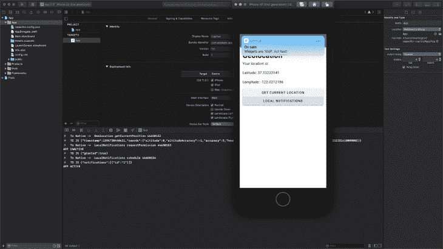

# 使用 Capacitor 和 Vue 构建跨平台应用

> 原文：<https://blog.logrocket.com/building-cross-platform-apps-with-capacitor-and-vue-js/>

作为 web 开发人员，我们经常赞美 web，谈论它是一个多么伟大的平台。但事实证明，在引人注目的功能方面，网络仍然是有限的。例如，如果您想要访问设备的文件系统、推送通知或蓝牙功能，您很可能需要一个本地应用程序来配合您的 web 应用程序。

令人欣慰的是，web 开发人员可以使用他们的 web 应用程序并添加原生目标，而无需做任何更改。

介绍:电容。

## 它是如何工作的

电容器可以被认为是本机应用程序的一个 [ponyfill](https://github.com/sindresorhus/ponyfill) 以及 web 应用程序的一个运行时。Capacitor 提供了一个 API，允许开发者通过 JavaScript 调用原生 API，并通过 iOS 应用商店和 Google Play 部署他们的 web 应用。

例如，如果我们想在一个应用程序中安排一个本地通知，使用 Capacitor 只需调用`LocalNotifications.schedule`并传递一组通知。

```
import { Plugins } from '@capacitor/core';
const { LocalNotifications } = Plugins;

LocalNotifications.schedule({
  notifications: [
    {
      title: "On sale",
      body: "Widgets are 10% off. Act fast!",
      id: 1,
      schedule: { at: new Date(Date.now() + 1000 * 5) },
      sound: null,
      attachments: null,
      actionTypeId: "",
      extra: null
    }
  ]
});
```

这是可能的，因为 Capacitor 位于浏览器、原生 iOS 和原生 Android 的各种 API 之间。当我们调用一个电容器 API 时，我们实际上是在调用代理 API。

因此，当我们在 iOS 上调用本地通知示例时，我们实际上会调用本地通知 API 并在那里处理事情。在 web 上，我们也可以调用通知 API，那么为什么不直接使用现有的 API 呢？

如果我们把例子从通知改为后台任务，这在 web 上没有对等物，好处就变得非常明显了。通过提供自己的 API，Capacitor 让您可以安全地调用 API，并在特性不可用时提供优雅的回退。比应用程序中出现巨大错误要好得多。

## 与 Vue 应用程序集成

由于电容器本身主要集中在设备功能上，我们仍然需要构建一个应用程序。在这种情况下，我们将构建一个小的 Vue 应用程序，并将库 Vuetify 用于我们的组件。我假设你知道如何创建一个 Vue 项目，以及如何对它进行 Vue 化，但是 TL；博士是:

```
npm i -g @vue/cli
vue create my-project
cd my-project
vue add vuetify
```

减去这里那里的几个提示，就这样了。

创建好项目后，我们还要安装电容器核心及其 CLI，以用于我们的项目:

```
npm install @capacitor/core @capacitor/cli
```

我们一会儿会用到这些，所以让我们看看我们的组件。在我们的应用程序中，我们应该有一个指向 Home.vue 组件的 Home route。

让我们开始为此搭建框架:

```
<template>
  <div>
    <h1>Geolocation</h1>
    <p>Your location is:</p>
    <p>
      Latitude: <span v-if="loc">{{ loc.coords.latitude }}</span>
    </p>
    <p>
      Longitude: <span v-if="loc">{{ loc.coords.longitude }}</span>
    </p>
    <v-btn block elevation="2" @click="getCurrentPosition">Get Current Location</v-btn>
    <v-btn block elevation="2" @click="scheduleNotification">Local Notifications</v-btn>
  </div>
</template>

<script>
import Vue from "vue";
export default Vue.extend({
  name: "Home",
  data: function() {
    return { loc: null };
  },
  methods: {
    getCurrentPosition: function() { },
    scheduleNotification: async function() { },
  }
});
</script>
```

有了这些，我们就可以开始构建获取当前位置和安排通知的逻辑了。让我们先从地理定位部分开始。

### 地理定位

首先，我们需要从`@capacitor/core`导入插件对象。这将允许我们通过电容器调用各种设备功能:

```
import Vue from "vue";
import { Plugins } from "@capacitor/core";

export default Vue.extend({
  name: "Home",
  data: function() {
    return { loc: null };
  },
  methods: {
    getCurrentPosition: function() { },
    scheduleNotification: async function() { },
  }
});
```

在我们的`getCurrentPosition`函数中，我们可以获得地理位置对象，并开始调用其上的各种函数。这里我们将调用`getCurrentPosition`函数，它将返回一个承诺。

```
getCurrentPosition: function() {
  const { Geolocation } = Plugins;
  Geolocation.getCurrentPosition().then(
    loc => (this.loc = loc),
    e => console.log("there was an error", e)
  );
},
```

一旦检索到位置数据，我们就可以将 loc 绑定设置为位置数据。

当在浏览器中测试时，在 Chrome 或 Firefox 中测试，因为如果连接不安全，Safari 将阻止对地理位置的访问。Chrome 和 Firefox 也将阻止不安全的访问，但给予本地主机域特殊的访问权限。

就是这样！

地理位置数据现在可以显示在我们的应用程序中。让我们转到通过本地通知 API 的通知。

### 本地通知

本地通知经常与推送通知混淆，但两者有很大不同。推送通知来自一个中心枢纽，要么是谷歌，要么是苹果，以及它们的各种服务。顾名思义，本地通知是应用程序本身的本地通知。

与地理位置示例一样，我们首先想要访问`LocalNotifications`对象:

```
scheduleNotification: async function() {
  const { LocalNotifications } = Plugins;
},
```

通知稍微复杂一点，需要你先获得许可才能显示它们。

因此，我们将在这里使用 async/await 并请求许可:

```
scheduleNotification: async function() {
  const { LocalNotifications } = Plugins;
  const canSend = await LocalNotifications.requestPermission();
  if (canSend) {  }
},
```

现在，如果我们可以发送通知，我们可以在 if 语句中这样做。如果用户点击拒绝，那么我们的功能就结束了。

* * *

### 更多来自 LogRocket 的精彩文章:

* * *

在“if”语句中，我们可以像这样安排一个通知:

```
if (canSend) {
  await LocalNotifications.schedule({
    notifications: [
      {
        title: "On sale",
        body: "Widgets are 10% off. Act fast!",
        id: 1,
        schedule: { at: new Date(Date.now() + 1000 * 5) },
        actionTypeId: "",
        extra: null
      }
    ]
  });
}
```

我们实际上可以在这里安排多个通知，但是我们的演示只需要一个。我们可以为我们的通知设置更多的条目，所以我鼓励你看一看这里的文档。

总之，我们的函数应该是这样的:

```
scheduleNotification: async function() {
  const { LocalNotifications } = Plugins;
  const canSend = await LocalNotifications.requestPermission();
  if (canSend) {
    await LocalNotifications.schedule({
      notifications: [
        {
          title: "On sale",
          body: "Widgets are 10% off. Act fast!",
          id: 1,
          schedule: { at: new Date(Date.now() + 1000 * 5) },
          actionTypeId: "",
          extra: null
        }
      ]
    });
  }
},
```

总之，我们的组件逻辑如下所示:

```
import Vue from "vue";
import { Plugins } from "@capacitor/core";

export default Vue.extend({
  name: "Home",
  data: function(): { loc: GeolocationPosition | null } {
    return { loc: null };
  },
  methods: {
    scheduleNotification: async function() {
      const { LocalNotifications } = Plugins;
      const canSend = await LocalNotifications.requestPermission();
      if (canSend) {
        await LocalNotifications.schedule({
          notifications: [
            {
              title: "On sale",
              body: "Widgets are 10% off. Act fast!",
              id: 1,
              schedule: { at: new Date(Date.now() + 1000 * 5) },
              actionTypeId: "",
              extra: null
            }
          ]
        });
      }
    },
    getCurrentPosition: function() {
      const { Geolocation } = Plugins;
      Geolocation.getCurrentPosition().then(
        loc => (this.loc = loc),
        e => console.log("there was an error", e)
      );
    }
  }
});
```

## 部署

添加了我们的功能后，让我们构建我们的应用程序，并开始添加原生平台。

```
npm run build
```

要添加本地平台，我们首先需要通过调用电容器 CLI 在项目中启用电容器:

```
npx cap init MyVueApp --webDir=dist
```

所有这些都是让电容器知道我们的应用程序名称应该是什么，以及网络资产位于何处。

完成后，我们可以将 iOS 或 Android 部署目标添加到我们的项目中:

```
npx cap add ios
*# or*
npx cap add android
```

这两个操作都要求您在计算机上安装本地 SDK。对于 iOS，这意味着安装 Xcode 和 Cocoapods，对于 Android，你需要安装 Android Studio。

一旦添加了本地平台，剩下要做的就是在模拟器或真实设备上运行应用程序:



### 结论

凭借其最简单的 CLI 和以 Web 为中心的方法，Capacitor 是一款真正的嵌入式工具，可用于将您的应用部署到 native。

这里我们看了 Vue，但是电容器本身是框架无关的，可以与 Angular、React、Preact 一起使用，或者根本没有框架。

如果你有兴趣了解更多关于电容器的知识，一定要查看[电容器文档](https://capacitorjs.com/docs)以及各种可用的[插件/API](https://capacitorjs.com/docs/apis)的文档。

## 像用户一样体验您的 Vue 应用

调试 Vue.js 应用程序可能会很困难，尤其是当用户会话期间有几十个(如果不是几百个)突变时。如果您对监视和跟踪生产中所有用户的 Vue 突变感兴趣，

[try LogRocket](https://lp.logrocket.com/blg/vue-signup)

.

[](https://lp.logrocket.com/blg/vue-signup)[https://logrocket.com/signup/](https://lp.logrocket.com/blg/vue-signup)

LogRocket 就像是网络和移动应用程序的 DVR，记录你的 Vue 应用程序中发生的一切，包括网络请求、JavaScript 错误、性能问题等等。您可以汇总并报告问题发生时应用程序的状态，而不是猜测问题发生的原因。

LogRocket Vuex 插件将 Vuex 突变记录到 LogRocket 控制台，为您提供导致错误的环境，以及出现问题时应用程序的状态。

现代化您调试 Vue 应用的方式- [开始免费监控](https://lp.logrocket.com/blg/vue-signup)。