# 使用 Kotlin 多平台构建跨平台移动应用

> 原文：<https://blog.logrocket.com/building-cross-platform-mobile-apps-kotlin-multiplatform/>

想象一下，你是一个 Android 开发专家，有一个杀手级应用的想法。你有信心可以轻松地为 Android 开发一个应用程序，但对 iOS 却不那么确定。

如果你有为 Android 开发移动用户界面的经验，你也许可以学习一些 SwiftUI 教程，并过得很好。但是 app 的核心呢？即使你有 iOS 开发经验，为 iOS 重新编写相同的核心也可能是多余的。

那么，如何用最小的学习曲线来实现你的想法呢？进入科特林多平台移动，或 KMM。

根据他们的[官网](https://kotlinlang.org/docs/multiplatform-mobile-getting-started.html)，“Kotlin Multiplatform Mobile (KMM)是一款 SDK，旨在简化跨平台移动应用的开发。”

有了 KMM，你可以用 Kotlin 编写应用程序的核心，并在 Android 和 iOS 应用程序中使用。你只需要像 UI 一样编写特定于平台的代码。

在本帖中，我们将通过构建一个具有本地数据库操作的小型笔记应用程序来学习 KMM。我们还将看到如何重用常见的业务逻辑，如数据库操作。但首先，我们需要明确一些先决条件。

## 环境设置

首先，我们需要安装 [Android Studio](https://developer.android.com/studio) 。如果我们想尝试 iOS 方面的东西，我们还需要安装 [Xcode](https://apps.apple.com/us/app/xcode) 。我们可以在没有 Xcode 的情况下用 KMM 代码构建和运行 Android 应用程序。

接下来，我们需要确保我们安装了最新的 Kotlin 插件。转到**安卓工作室工具**然后悬停在**科特林**上。接下来，点击**配置 Kotlin 插件更新**，接着是**再次检查**。你可以在下面看到一个图像。

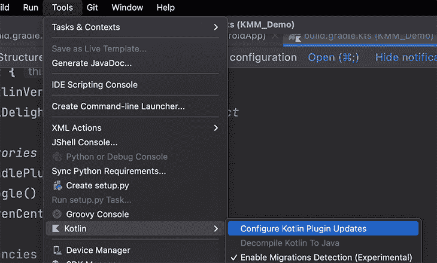

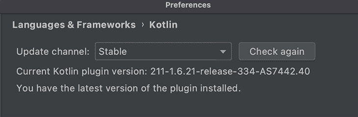

之后，在**首选项**菜单的**插件**部分搜索 KMM 插件。点击**安装 Kotlin 多平台移动插件**并安装。

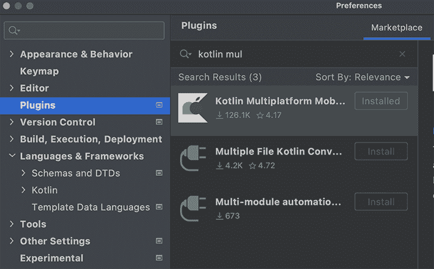

不用说，我们还需要安装 JDK。小心这一点，因为它可能有点棘手。我们可能需要在**系统路径**中设置 JDK 安装路径来让它工作。幸运的是，栈溢出有资源和任何问题的答案。

如果你不得不使用 SQLDelight ，确保安装[这个插件](https://cashapp.github.io/sqldelight/multiplatform_sqlite/intellij_plugin/)以便更容易使用。

## 创建 KMM 项目

现在环境已经设置好了，让我们创建一个 KMM 项目。

如果你已经有了一个想要用 KMM 扩展的 Android/iOS 项目，你需要将 KMM 模块添加到你的 Android 项目中，重新构建代码以将公共代码移动到共享模块中，并配置 iOS 项目以链接到 KMM 框架。你可以[在这里](https://kotlinlang.org/docs/multiplatform-mobile-understand-project-structure.html#ios-application)参考这个过程，但是我们先忽略这个复杂的案例，同时开始。

首先，我们在 Android Studio 中新建一个项目，方法是进入**文件**->-**新建**->-**新建项目**。然后，选择 **Kotlin 多平台应用**。如果我们成功完成环境设置，就会出现这种情况:

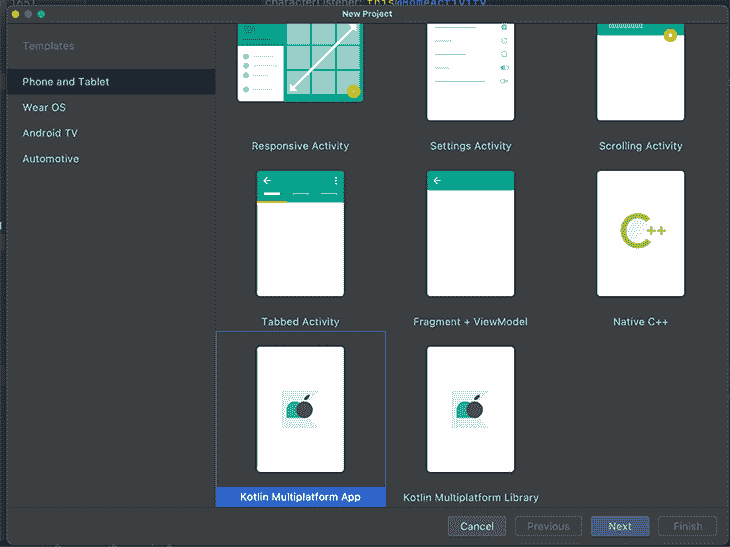

接下来，填写包名和项目路径。

第三步是新的，并且是 KMM 特有的。在这里，我们可以重命名 Android、iOS 或共享模块的名称。因为我们是第一次尝试 KMM，让我们保持这些选项不变。

如果您想要尝试测试执行，请启用**为共享模块**添加样本测试的复选框，并为 iOS 框架分发选择**常规框架**。它应该是这样的:

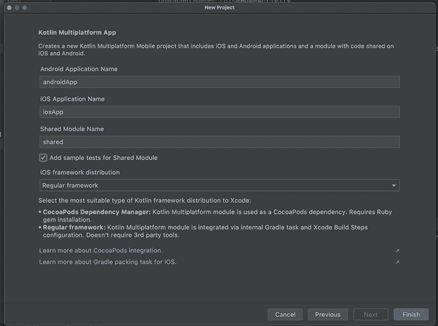

现在，该项目将很快准备就绪！一旦设置完毕，我们就可以将**项目文件视图**从**安卓**更改为**项目**并查看完整的结构。请记住，在幕后发生了很多事情，我们将在接下来讨论。

## KMM 项目结构

一个 KMM 项目有三个模块:Android、shared 和 iOS。

### Android 模块

Android 模块是我们构建到 Android 应用程序中的普通应用程序模块。在我们的例子中，我们将其命名为 androidApp。

### 共享模块

这是一个 Kotlin 多平台模块，可以编译成 Android 库和 iOS 框架。共享模块保存了应用程序所有通用的、可重用的代码。其中有三个部分:`commonMain`、`androidMain`和`iosMain`。

`commonMain`不是特定于平台的，包含所有可以在两个平台上直接运行的代码。在某些用例中，有些 Kotlin 库是 KMM 兼容的。例如，我们将对数据库使用 SQLDelight，对网络调用使用 Ktor。

在`androidMain`中，公共模块中的一些代码可能需要不同的 API 或行为。这个模块保存了 Android 特有的代码。

`iosMain`是`androidMain`的对应。它保存了 iOS 特有的代码`commonMain`。将`androidMain`和`iosMain`放在共享模块中可能看起来违反直觉，但是一旦我们动手做了一些工作，就会明白了。

### iOS 模块

这个模块是一个 Xcode 项目，构建为一个 iOS 应用程序，使用我们共享的 KMM 模块作为框架。如果您还记得，我们在上一节的第三步中为 iOS 选择了**常规框架**。

请注意，虽然这个模块是在我们的根项目目录中创建的，但是它并没有连接到项目的任何其他部分(除了使用共享模块)。

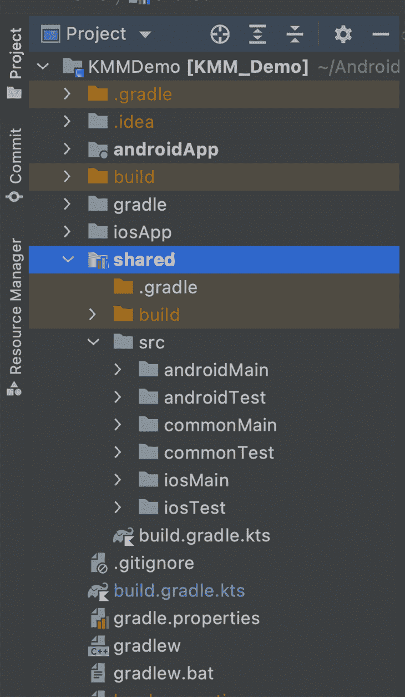

## Xcode 项目是怎么知道共享框架的？

正如我们刚刚提到的，共享模块被编译到一个 iOS 框架中，然后由根项目中的 iOS 应用程序使用。但是它是怎么知道的呢？我们需要手动连接它们吗？不要！

当您在 Android Studio 中创建新的 KMM 项目时，它会自动配置框架的构建路径和其他所需的设置。

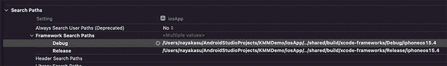

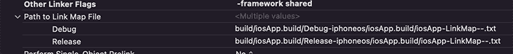

有一个名为`embedAndSignAppleFrameworkForXcode`的 gradle 任务，它在每次构建 iOS 应用程序以生成新框架时执行。

## Kotlin 多平台手机的实际操作

为了巩固上述概念，并看到 KMM 的行动，我们将建立一个小的应用程序。具体来说，我们将构建一个设备上的数据库，并使用 Android 和 iOS 的通用代码执行一些操作。

特别是对于 Android，我们将有一个启动屏幕，显示从设备上的数据库中检索的笔记列表和用于添加新笔记的 CTA，如下所示:

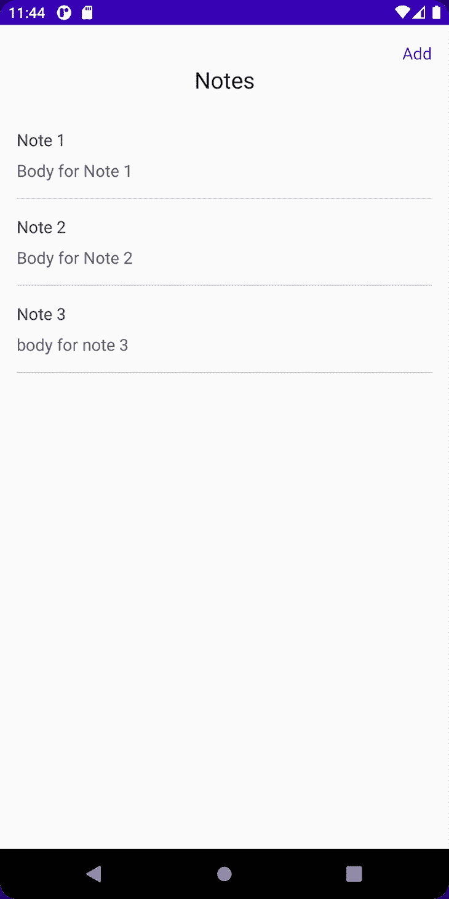

如果用户点击**添加**，应用程序将带他们到一个新的屏幕添加新的笔记，并将其保存到数据库中。该应用程序将使用新数据刷新第一个屏幕，如下所示:

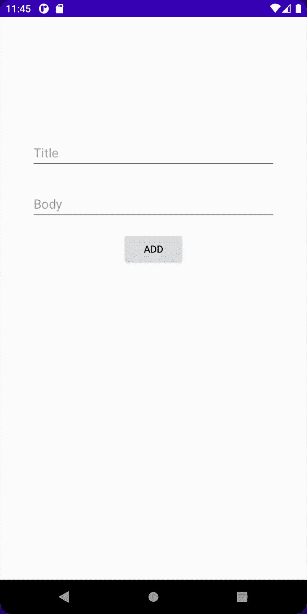

然而，对于 iOS，我们将只有一个屏幕，我们将在每次启动时清除数据库，插入带有时间戳的新的自动注释，并在屏幕上获取和显示它们:

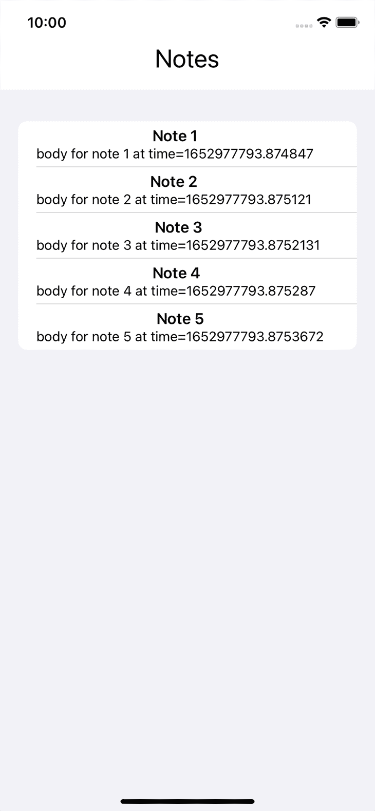

免责声明——我不是 iOS 开发者。因为我们在这里的目标是演示如何在两个平台上执行通用的业务逻辑代码，所以在 iOS 上完成所有这三个操作就足以满足本文的目的了。

这个项目可以从 [my GitHub repo](https://github.com/nayash/kotlin-multiplatform-demo) 中克隆出来，或者你也可以继续创建一个新项目。您可以按照本文“创建 KMM 项目”一节中的步骤，创建一个新的 Android KMM 应用程序。

### 添加依赖关系

这个项目没有太多的外部依赖项，所以我们可以专注于如何构建依赖项。

从项目级`build.gradle`开始，这需要常见的 gradle 相关依赖项以及 SQLDelight 相关依赖项。

```
classpath("org.jetbrains.kotlin:kotlin-gradle-plugin:1.6.21")
classpath("com.android.tools.build:gradle:7.1.3")
classpath("com.squareup.sqldelight:gradle-plugin:$sqlDelightVersion")

```

App-level `build.gradle`也有所有的标准项目，但是还有一个额外的要求。我们必须在`dependencies`块中添加对共享模块的依赖:

```
implementation(project(":shared"))

```

共享模块`build.gradle`具有所有主要的变化:

```
plugins {
   kotlin("multiplatform")
   id("com.android.library")
   id("com.squareup.sqldelight")
}

kotlin {
   android()

   listOf(
       iosX64(),
       iosArm64(),
       iosSimulatorArm64()
   ).forEach {
       it.binaries.framework {
           baseName = "shared"
       }
   }

   val coroutinesVersion = "1.6.1"
   val ktorVersion = "1.6.1"
   val sqlDelightVersion: String by project

   sourceSets {
       val commonMain by getting {
           dependencies {
               implementation("com.squareup.sqldelight:runtime:$sqlDelightVersion")
           }
       }
       val commonTest by getting {
           dependencies {
               implementation(kotlin("test"))
           }
       }
       val androidMain by getting {
           dependencies {
               implementation("com.squareup.sqldelight:android-driver:$sqlDelightVersion")
           }
       }
       val androidTest by getting
       val iosX64Main by getting
       val iosArm64Main by getting
       val iosSimulatorArm64Main by getting
       val iosMain by creating {
           dependsOn(commonMain)
           iosX64Main.dependsOn(this)
           iosArm64Main.dependsOn(this)
           iosSimulatorArm64Main.dependsOn(this)
           dependencies {
               implementation("com.squareup.sqldelight:native-driver:$sqlDelightVersion")
           }
       }
       val iosX64Test by getting
       val iosArm64Test by getting
       val iosSimulatorArm64Test by getting
       val iosTest by creating {
           dependsOn(commonTest)
           iosX64Test.dependsOn(this)
           iosArm64Test.dependsOn(this)
           iosSimulatorArm64Test.dependsOn(this)
       }
   }
}

android {
   compileSdk = 31
   sourceSets["main"].manifest.srcFile("src/androidMain/AndroidManifest.xml")
   defaultConfig {
       minSdk = 21
       targetSdk = 31
   }
}

sqldelight {
   database("KmmDemoDB") {
       packageName = "com.outliers.kmmdemo.shared.cache"
   }
}

```

除了外部依赖项声明之外，其他的都是在创建新的 KMM 项目时自动添加的。然而，我们确实需要理解各种块，以便知道在哪里添加依赖项。

从`plugins`块开始，注意我们已经应用了`library`插件和自动添加的`multiplatform`插件。`sqldelight`插件用于我们的数据库 SDK，其他项目可能不需要，因此需要手动添加。

SQLDelight 还需要最后一个块来定义数据库名称和定义查询的包/路径。在共享模块的`androidMain`中编写的代码所需的依赖关系在`sourceSets`内的`androidMain`块中声明。同样的事情也适用于`iosMain`和`commonMain`。

现在让我们看看源代码。这里的症结是共享模块。我们将建立数据库 SDK，SQLDelight。

首先，在共享模块的`commonMain`文件夹中创建一个目录路径`sqldelight/your-package-name/shared/cache`，其中`your-package-name`是您在创建项目时定义的包名(在本例中，路径是`sqldelight/com/outliers/kmmdemo/shared/cache`)。

这里，我们需要创建一个保存所有 SQL 查询的文件`<your database name>.sq`，比如`insert`或`select all`。对于这个演示，我将文件命名为`KmmDemoDB.sq`。

数据库名和包名必须与我们在`shared/build.gradle`的`sqldelight`块中定义的相匹配。SQLDelight 使用这个文件生成与在`~/shared/build/generated/sqldelight`提供的查询相对应的代码。

如果您觉得这令人困惑，请花些时间浏览项目并确定我们正在讨论的文件。您可以放心的是，这只是特定于 SQLDelight 库的，因此可以从它们的文档中彻底了解。

为了在 Kotlin 公共代码中实际执行 SQL 查询，我们需要一个名为`SqlDriver`的对象。但是这个`SqlDriver`是使用 Android 和 iOS 平台的不同 API 创建的。

`androidMain`和`iosMain`的作用来了。我们将首先定义一个名为`DatabaseDriverFactory`的类，在 common sourceset ( `commonMain`)中将其声明为`expect`:

```
expect class DatabaseDriverFactory {
   fun createDriver(): SqlDriver
}

```

`expect`关键字告诉编译器在所有源集中的同一个包(`commonMain/com/outliers/kmmdemo/shared/cache`)中的平台特定的源集中(`androidMain`和`iosMain`)寻找这个类的实际实现。

这允许使用特定于平台的 API 来创建`SqlDriver`，之后一切都是一样的。下面是`androidMain`和`iosMain`的实际实现:

```
actual class DatabaseDriverFactory(private val context: Context) {
   actual fun createDriver(): SqlDriver {
       return AndroidSqliteDriver(KmmDemoDB.Schema, context, "notes.db")
   }
}

actual class DatabaseDriverFactory {
   actual fun createDriver(): SqlDriver {
       return NativeSqliteDriver(KmmDemoDB.Schema, "notes.db")
   }
}

```

请注意，我们使用不同的 API 来创建和返回一个`SqlDriver`的实例，即`AndroidSqliteDriver`和`NativeSqliteDriver`。通过在共享模块的`build.gradle`文件中为每个 sourceset 声明的不同依赖关系，`androidMain`和`iOSMain`可以使用这些 API。

现在，我们将在同一个包中创建一个名为`Database`的包装类，它使用`DatabaseDriverFactory`在内部创建一个`SqlDriver`对象，并公开函数来执行数据库操作。

```
class Database(databaseDriverFactory: DatabaseDriverFactory) {
   private val database = KmmDemoDB(databaseDriverFactory.createDriver())
   private val dbQuery = database.kmmDemoDBQueries

   internal fun getAllNotes(): List<Note> {
       return dbQuery.selectAllNotes().executeAsList()
   }

   internal fun getLastNote(): Note {
       return dbQuery.selectLastNote().executeAsOne()
   }

   internal fun insertNote(title: String, body: String?) {
       return dbQuery.insertNote(title, body)
   }

   internal fun deleteAll() {
       return dbQuery.deleteAll()
   }
}

```

接下来，让我们创建另一个 SDK 根类。这创建了`Database`对象并公开了所有的操作。这将成为我们进入 Android/iOS 应用共享库的入口。

```
class KmmSDK(dbDriverFactory: DatabaseDriverFactory) {
   private val database: Database = Database(dbDriverFactory)

   fun getAllNotes(): List<Note> {
       return database.getAllNotes()
   }

   fun getLastNote(): Note {
       return database.getLastNote()
   }

   fun insertNote(title: String, body: String?) {
       database.insertNote(title, body)
   }

   fun deleteAll() {
       database.deleteAll()
   }
}

```

这是 Android 和 iOS 应用程序将实例化并执行核心工作的类。这个类接受一个`DatabseDriverFactory`的实例。因此，当 iOS 实例化这个类时，编译器将从`iosMain`中选择实现。

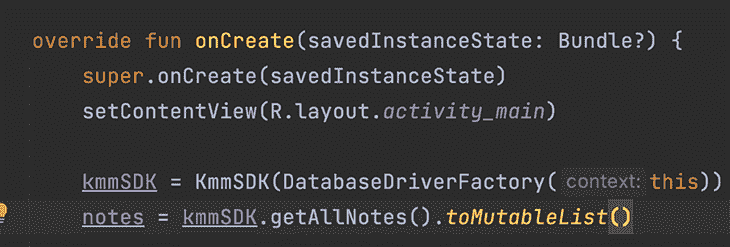

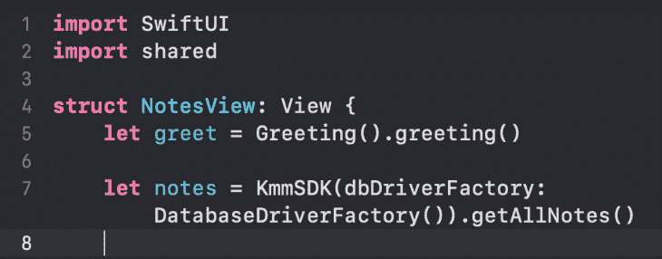

现在你要做的就是在 Android 中导入`KmmSDK`或者在 iOS 中导入`shared`，调用它们的方法，如上图。剩下的都是 UI 开发，我们太熟悉了。将笔记列表传递给`RecyclerViewAdapter`并显示在屏幕上。iOS 也实现了类似的逻辑。

## 结论

唷！我们已经讨论了很多问题。但是，还有一件事需要考虑:如果我们用 Kotlin 编写了所有代码，iOS 如何理解它？

是因为 Kotlin 编译器。Kotlin 编译器首先将 Kotlin 代码转换成中间表示(Android JVM 的字节码)，然后再转换成平台的本机代码。

就是这样！我们已经介绍了开始使用 Kotlin 多平台所需的大部分内容。

欢迎在我的 LinkedIn 和 T2 GitHub 个人资料中向我问好！

*进一步参考:* 

## LogRocket :即时重现你的安卓应用中的问题。

[](https://lp.logrocket.com/blg/kotlin-signup)

[LogRocket](https://lp.logrocket.com/blg/kotlin-signup) 是一款 Android 监控解决方案，可以帮助您即时重现问题，确定 bug 的优先级，并了解您的 Android 应用程序的性能。

LogRocket 还可以向你展示用户是如何与你的应用程序互动的，从而帮助你提高转化率和产品使用率。LogRocket 的产品分析功能揭示了用户不完成特定流程或不采用新功能的原因。

开始主动监控您的 Android 应用程序— [免费试用 LogRocket】。](hhttps://lp.logrocket.com/blg/kotlin-signup)