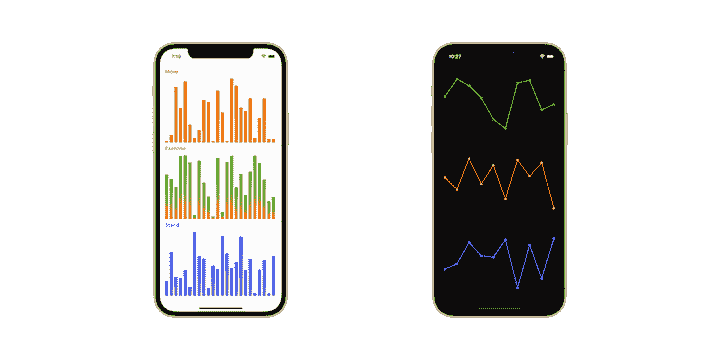
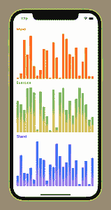
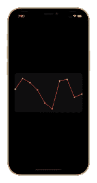
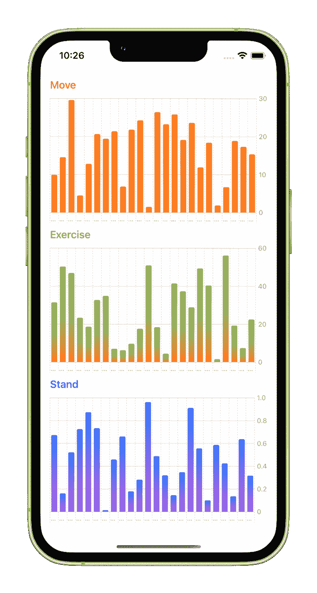
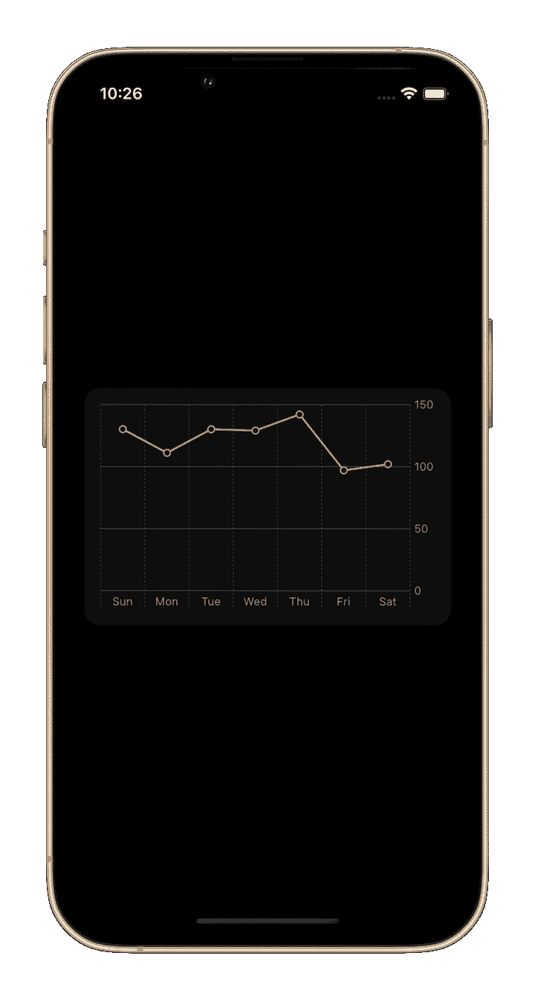

# 在 SwiftUI - LogRocket 博客中构建自定义图表

> 原文：<https://blog.logrocket.com/building-custom-charts-swiftui/>

图表可以帮助应用程序用户更好地可视化数据，更容易识别趋势。此外，许多用户发现保留以图形方式呈现的数据更容易。

SwiftUI 可以用于更快地为 iOS 应用程序构建图表，因为它需要更少的代码。SwiftUI 提供了丰富的图形功能，可用于在所有苹果平台上创建和设计各种图表。

在本文中，我们将使用 SwiftUI 创建模仿苹果健康应用程序的条形图和折线图。我们还将展示如何使用苹果的 [Swift Charts](https://developer.apple.com/documentation/Charts) 框架，用几行代码创建条形图和折线图。该框架建立在 SwiftUI 之上，极大地简化了图表的工作，并免费提供动态调整大小、本地化、黑暗模式、高对比度模式、voiceover 和音频图表支持。

在撰写本文时，Swift Charts 仍处于测试阶段，仅适用于 iOS 16.0+、iPadOS 16.0+、macOS 13.0+、Mac Catalyst 16.0+、tvOS 16.0+和 watchOS 9.0+。预计将于 2022 年 9 月底公开发布。

您将能够使用本文中的这些示例在您自己的 iOS 应用程序中创建和设计图表。

*向前跳转:*

以下是我们将构建的自定义图表:



我们开始吧！

## 在 SwiftUI 中创建条形图

条形图对于比较不同数据组或子组的值很有用。按产品类别划分的季度收入或按活动划分的月度投资回报率都是可以用条形图显示的常见数据示例。

### 构建条形图并设计其样式

我们将从创建图表的条形开始。我们会给它们一个线性渐变的颜色。首先创建一个名为`BarView`的`View`:

```
struct BarView: View {
  var datum: Double
  var colors: [Color]

  var gradient: LinearGradient {
    LinearGradient(gradient: Gradient(colors: colors), startPoint: .top, endPoint: .bottom)
  }

  var body: some View {
    Rectangle()
      .fill(gradient)
      .opacity(datum == 0.0 ? 0.0 : 1.0)
  }
}

```

首先定义两个参数:`datum`和一个`Color`数组。然后，基于`colors`参数，定义一个计算属性`gradient`。

在`View`的主体中，声明一个`Rectangle`视图并用`gradient`声明`fill`。如果`datum`值为`0.0`，则`View`不可见。

接下来，创建一个文件`BarChartView.swift`并添加以下代码:

```
struct BarChartView: View {
  var data: [Double]
  var colors: [Color]

  var highestData: Double {
    let max = data.max() ?? 1.0
    if max == 0 { return 1.0 }
    return max
  }

  var body: some View {
    GeometryReader { geometry in
      HStack(alignment: .bottom, spacing: 4.0) {
        ForEach(data.indices, id: \.self) { index in
          let width = (geometry.size.width / CGFloat(data.count)) - 4.0
          let height = geometry.size.height * data[index] / highestData

          BarView(datum: data[index], colors: colors)
            .frame(width: width, height: height, alignment: .bottom)
        }
      }
    }
  }
}

```

我们首先接受一组数据。在这种情况下，我们使用一个`Double`数组，但是您也可以传入一个对象。对于第二个参数，我们接受一个`Color`数组。

接下来，我们使用一个计算属性`highestData`来计算最大值`data.max()`。该值用于定义条形的最大高度。

在`View`的`body`中，我们从一个`GeometryReader`开始，并声明一个水平堆栈`HStack()`。我们声明一个`ForEach()`，并通过提供单个值来循环遍历`BarView`。

`geometry`参数用于确定每个条的宽度和高度。每个条形的宽度通过取全宽并除以数据计数来计算:`geometry.size.width / CGFloat(data.count)`。每个条形的高度由全高乘以单个数据除以最大高度的比率确定:`geometry.size.height * data[index] / highestData`。

### 向条形图添加数据

准备好之后，是时候在视图中使用它了！

创建一个名为`ActivityView`的`View`。对于本教程，我们将添加带有随机值的模拟数据:

```
struct ActivityView: View {
  @State private var moveValues: [Double] = ActivityView.mockData(24, in: 0...300)
  @State private var exerciseValues: [Double] = ActivityView.mockData(24, in: 0...60)
  @State private var standValues: [Double] = ActivityView.mockData(24, in: 0...1)

  var body: some View {
    VStack(alignment: .leading) {
      Text("Move").bold()
        .foregroundColor(.red)

      BarChartView(data: moveValues, colors: [.red, .orange])

      Text("Exercise").bold()
        .foregroundColor(.green)

      BarChartView(data: exerciseValues, colors: [.green, .yellow])

      Text("Stand").bold()
        .foregroundColor(.blue)

      BarChartView(data: standValues, colors: [.blue, .purple])
    }
    .padding()
  }

  static func mockData(_ count: Int, in range: ClosedRange<Double>) -> [Double] {
    (0..<count).map { _ in .random(in: range) }
  }
}

```

在这个例子中，我们首先为`moveValues`、`exerciseValues`和`standValues`创建变量。

接下来，我们为健身数据创建相应的标题(`Move`、`Exercise`和`Stand`)，这些标题将显示在垂直堆栈中。

我们添加`BarChartView`来传递相关的数据和颜色。当`View`出现时，我们为变量提供随机值。在您自己的应用程序中，您将调用特定的方法将实际数据加载到图表中。

就这样，我们创建了第一个条形图！



## 在 SwiftUI 中创建折线图

折线图将数字信息显示为由线条连接的一系列数据点(或标记)。显示股票价格变化的股票图是折线图的常见示例。

### 构建折线图的线条并设置其样式

我们将从创建图表线条开始。创建一个名为`LineView`的`View`:

```
struct LineView: View {
  var dataPoints: [Double]

  var highestPoint: Double {
    let max = dataPoints.max() ?? 1.0
    if max == 0 { return 1.0 }
    return max
  }

  var body: some View {
    GeometryReader { geometry in
      let height = geometry.size.height
      let width = geometry.size.width

      Path { path in
        path.move(to: CGPoint(x: 0, y: height * self.ratio(for: 0)))

        for index in 1..<dataPoints.count {
          path.addLine(to: CGPoint(
            x: CGFloat(index) * width / CGFloat(dataPoints.count - 1),
            y: height * self.ratio(for: index)))
        }
      }
      .stroke(Color.accentColor, style: StrokeStyle(lineWidth: 2, lineJoin: .round))
    }
    .padding(.vertical)
  }

  private func ratio(for index: Int) -> Double {
    1 - (dataPoints[index] / highestPoint)
  }
}

```

这个`View`接受数组形式的数据点——在本例中是`Double`。你可以用一个物体来代替它。接下来，`View`接受一个`Color`来填充线条。

类似于在`BarChartView`中使用的方法，我们使用一个计算属性`highestPoint`来计算`dataPoints.max()`。该值用于定义线条的最大高度。

在`GeometryReader`中，我们创建了一个`Path`类型，它移动到第一个点。线上每个点的位置由高度乘以单个数据点除以最高点的比率确定:`height * self.ratio()`。

我们在`LineView`上循环，直到到达最后一个点，用一条线连接每个点。

### 构建折线图的标记并设置其样式

接下来，我们将创建数据标记。创建一个文件`LineChartCircleView.swift`并添加以下代码:

```
struct LineChartCircleView: View {
  var dataPoints: [Double]
  var radius: CGFloat

  var highestPoint: Double {
    let max = dataPoints.max() ?? 1.0
    if max == 0 { return 1.0 }
    return max
  }

  var body: some View {
    GeometryReader { geometry in
      let height = geometry.size.height
      let width = geometry.size.width

      Path { path in
        path.move(to: CGPoint(x: 0, y: (height * self.ratio(for: 0)) - radius))

        path.addArc(center: CGPoint(x: 0, y: height * self.ratio(for: 0)),
                    radius: radius, startAngle: .zero,
                    endAngle: .degrees(360.0), clockwise: false)

        for index in 1..<dataPoints.count {
          path.move(to: CGPoint(
            x: CGFloat(index) * width / CGFloat(dataPoints.count - 1),
            y: height * dataPoints[index] / highestPoint))

          path.addArc(center: CGPoint(
            x: CGFloat(index) * width / CGFloat(dataPoints.count - 1),
            y: height * self.ratio(for: index)),
                      radius: radius, startAngle: .zero,
                      endAngle: .degrees(360.0), clockwise: false)
        }
      }
      .stroke(Color.accentColor, lineWidth: 2)
    }
    .padding(.vertical)
  }

  private func ratio(for index: Int) -> Double {
    1 - (dataPoints[index] / highestPoint)
  }
}

```

该`View`遵循与`LineView`相似的逻辑。然而，这个`View`不是创建直线，而是为每个数据点画一个圆。

我们将`LineView`和`LineChartCircleView`组合起来创建`LineChartView`:

```
struct LineChartView: View {
  var dataPoints: [Double]
  var lineColor: Color = .red
  var outerCircleColor: Color = .red
  var innerCircleColor: Color = .white

  var body: some View {
    ZStack {
      LineView(dataPoints: dataPoints)
        .accentColor(lineColor)

      LineChartCircleView(dataPoints: dataPoints, radius: 3.0)
        .accentColor(outerCircleColor)

      LineChartCircleView(dataPoints: dataPoints, radius: 1.0)
        .accentColor(innerCircleColor)
    }
  }
}

```

在一个`ZStack`中，我们将`LineView`加上`dataPoints`，并指定一个`accentColor`。在此之上，我们添加了一个`outerCircleColor`，其`radius`为`3.0`。然后我们添加一个顶层`innerCircleColor`，带有`1.0`的`radius`。这会产生一个带有彩色轮廓的白色圆圈。

### 向折线图添加数据

现在，我们将`LineChartView`放入容器视图`HeartRateView`，以传入相关数据:

```
struct HeartRateView: View {
  @State var dataPoints: [Double] = [15, 2, 7, 16, 32, 39, 5, 3, 25, 21]

  var body: some View {
    LineChartView(dataPoints: dataPoints)
      .frame(height: 200)
      .padding(4)
      .background(Color.gray.opacity(0.1).cornerRadius(16))
      .padding()
  }
}

```

这是我们创建和配置的折线图:



## 使用 Swift 图表创建条形图

在 Swift 图表框架中，我们有一个接受图表内容的`Chart`结构。还有一个用于定义条形图的`Barmark`函数；每个`BarMark`代表一个单独的酒吧。

```
struct NewBarView: View {
  var data: [Double]
  var colors: [Color]

  var gradient: LinearGradient {
    LinearGradient(gradient: Gradient(colors: colors), startPoint: .top, endPoint: .bottom)
  }

  var body: some View {
    Chart(data, id: \.self) { value in
      BarMark(x: .value("Type", "\(value)"),
              y: .value("Value", value))
      .foregroundStyle(gradient)
    }
  }
}

```

如上面的代码所示，我们简单地为每个个体`BarMark`提供了`x`和`y`轴的值。然后，我们使用 Swift Charts 框架中的`Chart`结构遍历数据，以创建条形图。

这是一个只用两行代码创建的 Swift Chart 条形图示例！



## 使用 Swift 图表创建折线图

Swift 图表框架也可用于简化折线图的创建。我们用一个`LineMark`代替一个`BarMark`，并提供`x`和`y`轴的相关值。为了给数据点创建一个圆形标记，我们使用了`symbol`修改器。该修改器也可以用于提供不同的标记形状。

```
struct HeartRate: Hashable {
  var day: String
  var value: Int = .random(in: 60..<150)
}

extension HeartRate {
  static var data: [HeartRate] {
    let calendar = Calendar(identifier: .gregorian)
    let days = calendar.shortWeekdaySymbols

    return days.map { day in
      HeartRate(day: day)
    }
  }
}

struct NewLineChartView: View {
  var dataPoints: [HeartRate]

  var body: some View {
    Chart(dataPoints, id: \.self) { rate in
      LineMark(x: .value("Day", rate.day),
               y: .value("Heart rate", rate.value))
      .foregroundStyle(.red)
      .symbol(Circle().strokeBorder(lineWidth: 1.5))
    }
  }
}

```

这是我们之前创建的相同的自定义折线图。借助 Swift Charts，我们只用四行代码就能生成图表！



## 结论

在本文中，我们展示了在 SwiftUI 中创建简单的图表并设置其样式是多么容易，以便在所有苹果平台上使用。除了在 SwiftUI 中构建图表的传统流程，我们还展示了如何使用 Swift Charts 以最少的开发时间构建图表。

要了解更多关于苹果 Swift 图表框架的信息，请参考关于 [Hello Swift 图表](https://developer.apple.com/wwdc22/10136)的 WWDC 2022 会议。关于定制和创建更精细图表的技巧，请参加以下 WWDC 会议: [Swift Charts:提高标准](https://developer.apple.com/wwdc22/10137)、[Design app experiences with Charts](https://developer.apple.com/wwdc22/110342)和[Design a effective Charts](https://developer.apple.com/videos/play/wwdc2022/110340/)。

在大多数情况下，Swift Charts 通常是向您的应用程序添加图表的最佳方式。但是，仍然需要您的自定义实现来支持旧版本的 iOS。

开源库也有助于以更少的工作量和开发时间构建图表。要获得更多高级定制和灵感，请查看这个附加的[开源库](https://blog.logrocket.com/the-top-8-react-native-chart-libraries-for-2021/)列表。

## 使用 [LogRocket](https://lp.logrocket.com/blg/signup) 消除传统错误报告的干扰

[](https://lp.logrocket.com/blg/signup)

[LogRocket](https://lp.logrocket.com/blg/signup) 是一个数字体验分析解决方案，它可以保护您免受数百个假阳性错误警报的影响，只针对几个真正重要的项目。LogRocket 会告诉您应用程序中实际影响用户的最具影响力的 bug 和 UX 问题。

然后，使用具有深层技术遥测的会话重放来确切地查看用户看到了什么以及是什么导致了问题，就像你在他们身后看一样。

LogRocket 自动聚合客户端错误、JS 异常、前端性能指标和用户交互。然后 LogRocket 使用机器学习来告诉你哪些问题正在影响大多数用户，并提供你需要修复它的上下文。

关注重要的 bug—[今天就试试 LogRocket】。](https://lp.logrocket.com/blg/signup-issue-free)