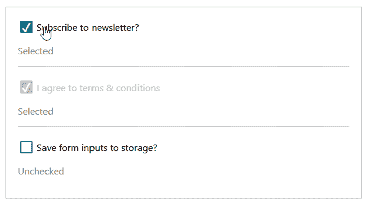
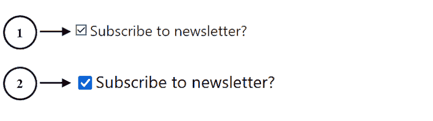
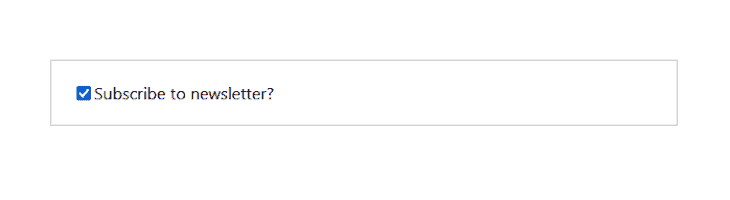
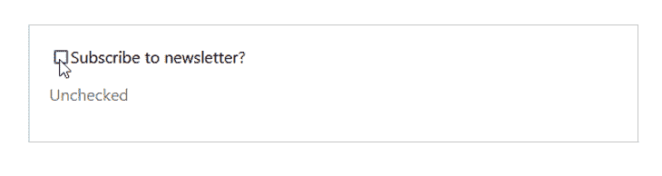
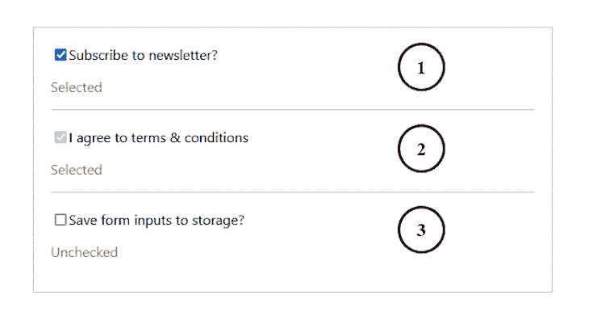
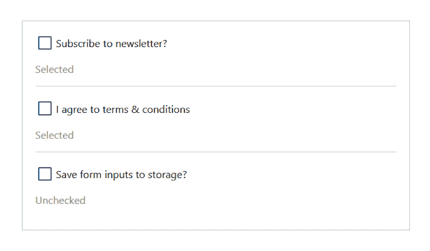
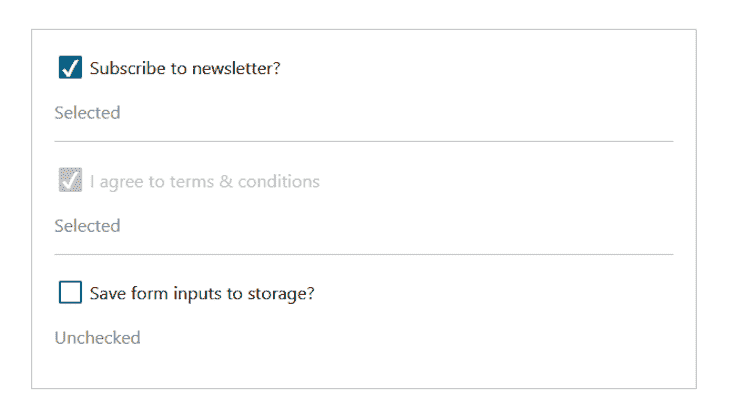
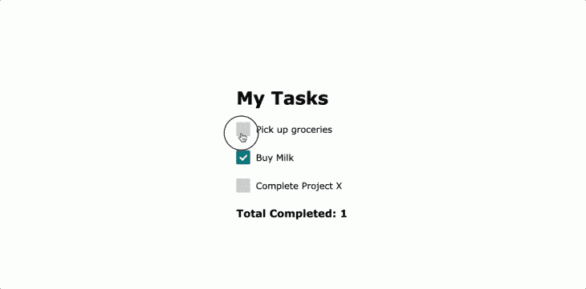

# 在 React - LogRocket 博客中构建自定义复选框

> 原文：<https://blog.logrocket.com/building-custom-checkbox-react/>

在本指南中，我们将介绍如何在 React 中构建自定义复选框，而不牺牲辅助技术的可访问性:

下面是我们将在本教程中构建的自定义复选框。你[可以和它](https://x87497.csb.app/)互动，之后，就可以开始了。



要学习本教程，请确保您熟悉 React。

## React 中的默认和自定义复选框

checkbox 是一个控制元素，它提供了在真和假状态之间切换的选项。它是一个属性设置为`checkbox`的`input`元素，如下所示:

```
<input type="checkbox" />

```

最简单的形式是，一些标签文本旁边的输入框如下所示:



输入复选框应用了默认样式。这些样式来自浏览器的底层操作系统，因此使得复选框的外观在不同的浏览器上有所不同。

上图中标记的第一个例子显示了复选框的设计如何出现在 Opera mini 浏览器中。第二个例子是同样的默认复选框如何出现在 Firefox 中，Firefox 在 Chrome 中也有类似的外观。

一般来说，我们希望在网页上有一个自定义复选框的原因是为了确保外观在不同的浏览器和设备上保持一致。

## 在 React 中使用表单控件的受控输入

在 React 中处理表单控件与在常规 HTML 中处理有所不同。

在 HTML 中，表单控件(包括复选框)监听 DOM 并由 DOM 管理。在这种情况下，我们不需要设置任何逻辑来切换这些框；默认情况下，它们可以切换。

然而，在 React 中，复选框必须是受[控制或不受控制的输入](https://blog.logrocket.com/controlled-vs-uncontrolled-components-in-react/)。受控输入允许我们将浏览器 DOM 的责任转移到组件状态(通常是呈现输入的组件)。

React 推荐这种方法来形成控件。这样，国家就成了真理的唯一来源。让我们在实践中看到这一点！

### 创建复选框组件

让我们首先创建一个名为`Checkbox`的组件，它接受一个`label`文本作为道具，并在文本旁边呈现一个复选框:

```
const Checkbox = ({ label }) => {
  return (
    <div className="checkbox-wrapper">
      <label>
        <input type="checkbox" />
        <span>{label}</span>
      </label>
    </div>
  );
};
export default Checkbox;

```

然后我们将在任何想要显示复选框的地方呈现`<Checkbox />`组件。在我们的例子中，我们将在一个`App`组件中呈现它:

```
import Checkbox from "./Checkbox";

const App = () => {
  return (
    <div className="app">
      <Checkbox label="Subscribe to newsletter?" />
    </div>
  );
};
export default App;

```

这些步骤应该会产生类似这样的结果:



注意，我们[已经包含了为包含元素添加边框的基本样式](https://codesandbox.io/s/focused-curie-x87497?file=/src/styles.css)。在这一点上，我们在呈现复选框时没有做任何特殊的事情。上面类似于渲染一个基本的 HTML 复选框。

### 控制输入复选框

如前所述，React 建议让我们的表单元素成为一个受控字段。为此，我们必须添加一个组件状态来管理用户的输入，然后将状态变量传递给输入。对于复选框输入，我们将把状态分配给输入`checked`属性:

```
import { useState } from "react";
const Checkbox = ({ label }) => {
  const [isChecked, setIsChecked] = useState(false);
  return (
    <div className="checkbox-wrapper">
      <label>
        <input type="checkbox" checked={isChecked} />
        <span>{label}</span>
      </label>
    </div>
  );
};
export default Checkbox;

```

使用上面的实现，复选框将不再监听 DOM，而是监听组件中定义的`useState`。因为我们用一个`false`值初始化了`useState`，所以在初始 DOM 呈现中复选框字段将被取消选中。

在这一页的后面，我们将定义让我们将初始状态传递到`Checkbox`组件的逻辑，无论我们希望它被选中、取消选中还是禁用。

至此，我们已经成功地将复选框变成了受控输入。但是，我们不能切换它，因为它不再监听浏览器 DOM。所以我们需要自己处理切换。

### 使用更新程序功能

updater 函数的第二个参数是`[useState()](https://blog.logrocket.com/react-hooks-cheat-sheet-unlock-solutions-to-common-problems-af4caf699e70/#usestate)` [React Hook](https://blog.logrocket.com/react-hooks-cheat-sheet-unlock-solutions-to-common-problems-af4caf699e70/#usestate) 。它允许我们更新状态，并确保它保存更新的状态值。

要使用 updater 函数，我们必须使用一个`onChange`事件处理程序来监听输入复选框的变化。该处理程序将使用最新的输入值为每个输入变化调用更新函数`setIsChecked`:

```
const Checkbox = ({ label }) => {
  // ...
  return (
    <div className="checkbox-wrapper">
      <label>
        <input
          // ...
          onChange={() => setIsChecked((prev) => !prev)}
        />
        {/* ... */}
      </label>
      <p>{isChecked ? "Selected" : "Unchecked"}</p>
    </div>
  );
};
export default Checkbox;

```

如代码所示，`setIsChecked` updater 函数获取先前的状态值，并通过切换其布尔值来更新它。

请注意，我们在标签后添加了一个段落，以显示复选框监听组件中定义的状态:



### 指定复选框的初始状态和其他控制属性

让我们提供一个选项，将一些道具和`label`一起传递给`Checkbox`组件。例如，我们可以指定是否默认选中复选框，以及是否禁用复选框。

在下面的`App`组件中，我们添加了额外的`<Checkbox />`来包含一个`checked`和`disabled`道具:

```
const App = () => {
  return (
    <div className="app">
      <Checkbox label="Subscribe to newsletter?" checked={true} />
      <Checkbox label="I agree to terms & conditions" checked={true} disabled />
      <Checkbox label="Save form inputs to storage?" />
    </div>
  );
};
export default App;

```

给`checked`属性分配一个`true`值意味着我们希望复选框字段默认被选中。否则，我们希望它不被检查。同样，传递一个`disabled`道具意味着我们希望复选框被禁用。

接下来，让我们从`Checkbox`组件访问道具并使用它们:

```
const Checkbox = ({ label, checked, ...props }) => {
  const defaultChecked = checked ? checked : false;
  const [isChecked, setIsChecked] = useState(defaultChecked);

  return (
    <div className="checkbox-wrapper">
      <label>
        <input
          // ...
          {...props}
        />
        {/* ... */}
    </div>
  );
};
export default Checkbox;

```

在代码中，我们首先使用三元运算符来检查`checked`属性的值是`true`还是`false`。然后将结果用作初始状态值，应用于初始 DOM 呈现中的复选框。

然后，在`input`元素上，我们传播组件接收的其他道具。例如，组件可能接收到一个`disabled`属性，所以它也被应用到输入元素。此时，我们的复选框如下所示:



默认情况下，第一个和第二个复选框是选中的，因为我们给它们的`checked`属性分配了一个`true`值。第二个复选框被禁用，因为我们还传递了一个`disabled`道具。在下一节中，我们将为我们的复选框提供一个自定义的外观。

## 在 React 中设置复选框的样式

我们前面提到过，应用于本地复选框的样式是从浏览器的操作系统继承的。这导致对复选框的一些样式限制。

有各种各样的方法来设计组件的风格。我们可以克服这些特定限制并为复选框提供自定义设计的一种方法是使用`appearance: none;` CSS 属性移除默认外观。

另一种方法——更像是黑客——是隐藏原生复选框，然后创建一个自定义设计，同时仍然监听隐藏复选框上的事件。

对于第二种方法，我们不能将 CSS display 属性设置为`none`或使用`hidden`属性，这样复选框对浏览器和屏幕阅读器就不会不可见。

相反，我们可以简单地应用`opacity: 0;`和`position: absolute;`来隐藏本地复选框。然后，我们在`label`元素上创建一个伪元素，我们可以用它来代替复选框。

### 如何在 React 中设置可访问复选框的样式

本教程中的自定义复选框建立在 React 中的本机复选框之上，它自然地提供了对辅助技术的支持。我们可以使用 CSS 属性`appearance: none;`剥离浏览器样式，并给它一个自定义的外观，我们将在下面详细介绍。

使用这种方法或者我们前面提到的使用`opacity: 0;`和`position: absolute;`的另一种方法，复选框将自然地支持辅助技术，并且可以是可聚焦的和键盘可访问的。

如果我们已经将输入复选框的 CSS `display`属性设置为`none`或者在`input`上使用了`hidden`属性，那么浏览器就看不到复选框了。这不支持 web 可访问性，所以我们应该避免这样做。

我们可以定制复选框的另一种方法是用不可聚焦的元素如`<div>`或`span`替换原有的`input`，然后将其样式化为复选框的形状。在这种情况下，我们必须[通过添加 ARIA 属性](https://developer.mozilla.org/en-US/docs/Web/Accessibility/ARIA/Roles/checkbox_role)如`role="checkbox"`、`aria-checked`、`tabindex="0"`来重新调整元素的用途，以支持辅助技术。

但是，最好在本机输入上构建一个自定义复选框。继续阅读，看看我们是如何在本教程中使用`appearance: none;` CSS 属性做到这一点的。

### 使用`appearance: none;` CSS 属性

使用`appearance: none;`的方法是现代的，适合定制复选框。我们将从移除本地复选框的默认样式并添加自定义样式开始:

```
.checkbox-wrapper input[type="checkbox"] {
  /* removing default appearance */
  -webkit-appearance: none;
  appearance: none;
  /* creating a custom design */
  width: 1.6em;
  height: 1.6em;
  border-radius: 0.15em;
  margin-right: 0.5em;
  border: 0.15em solid #007a7e;
  outline: none;
  cursor: pointer;
}

```

这里的焦点是`appearance`属性，我们将其设置为`none`。这让我们可以为复选框创建自定义设计。复选框现在应该如下所示:



接下来，当字段被选中时，我们需要设置自定义框的样式。我们可以通过向 input 元素动态添加一个自定义类来实现这一点，然后我们可以对其进行样式化。我们还可以使用`:checked`伪类选择器来匹配每个复选框。

### 向输入元素添加自定义类

如果`isChecked`状态变量是`true`，我们将使用三元运算符向输入添加一个自定义类:

```
const Checkbox = ({ label, checked, ...props }) => {
  // ...
  return (
    <div className="checkbox-wrapper">
      <label>
        <input
          // ...
          className={isChecked ? "checked" : ""}
        />
      </label>
    </div>
  );
};
export default Checkbox;

```

然后，我们可以使用 CSS 使用动态类来样式化选定的输入字段，如下所示:

```
input.checked {
  background-color: #007a7e;
  position: relative;
}

```

在我们查看设计之前，让我们添加一个复选标记来表示该字段已被选中。为此，我们将使用 CSS `content`属性和`::before`伪元素来插入复选标记。

我们更新的 CSS 文件应该包含以下内容:

```
input.checked::before {
  content: "2714";
  font-size: 1.5em;
  color: #fff;
  position: absolute;
  right: 1px;
  top: -5px;
}

```

接下来，让我们为`disabled`和`focus`状态添加以下样式:

```
.checkbox-wrapper input[type="checkbox"]:disabled {
  border-color: #c0c0c0;
  background-color: #c0c0c0;
}

.checkbox-wrapper input[type="checkbox"]:disabled + span {
  color: #c0c0c0;
}

.checkbox-wrapper input[type="checkbox"]:focus {
  box-shadow: 0 0 20px #007a7e;
}

```

复选框现在应该看起来像这样:



### 使用`:checked`选择器而不是添加自定义类

如果我们不想像上面那样在输入中添加一个自定义类，我们可以在输入中使用`:checked`选择器来定位选中的元素，然后对其进行相应的样式化。在这种情况下，我们可以从`input`元素中移除`className`属性，使其看起来像这样:

```
<input
  type="checkbox"
  checked={isChecked}
  onChange={() => setIsChecked((prev) => !prev)}
  {...props}
/>

```

然后，我们用`:checked`伪类选择器替换`.checked`类选择器:

```
input:checked {
  background-color: #007a7e;
  position: relative;
}

input:checked::before {
  content: "2714";
  font-size: 1.5em;
  color: #fff;
  position: absolute;
  right: 1px;
  top: -5px;
}

```

此时，我们可以保存所有文件并测试我们的项目。查看 CodeSandbox 上的[演示和完整代码。](https://codesandbox.io/s/focused-curie-x87497?file=/src/Checkbox.js)

## 输入和标签元素是同级元素，而不是嵌套元素

有时，我们可能希望将`input`和`label`元素作为兄弟元素，而不是将`input`直接嵌套在`label`中。在这种情况下，我们必须提供一个唯一的`id`来关联每个`label`和它们的`input`元素。

为此，每个`<Checkbox />`元素必须包含一个唯一的`id`属性，如下所示:

```
import Checkbox from "./Checkbox";
const App = () => {
  return (
    <div className="app">
      <Checkbox 
        id="subscribeNews" 
        label="Subscribe to newsletter?" 
        checked={true} 
      />
      {/* other checkboxes */}
    </div>
  );
}
export default App;

```

然后在`Checkbox`组件中，我们可以访问`id`并使用它将输入元素与标签关联起来，就像这样:

```
const Checkbox = ({ id, label, checked, ...props }) => {
  // ...
  return (
    <div className="checkbox-wrapper">
      <input
        id={id}
        type="checkbox"
        checked={isChecked}
        onChange={() => setIsChecked((prev) => !prev)}
        {...props}
      />
      <label htmlFor={id}>{label}</label>
    </div>
  );
}

export default Checkbox;

```

## 处理多个复选框

在一些不寻常的情况下，您必须处理多个复选框的状态。例如，一个简单的待办事项应用程序需要用户通过切换各自的复选框来改变每个任务的状态。下面是我们如何将这样的事情付诸行动:

当然，我们首先需要一个待办事项数组，所以让我们用`useState`钩子创建一个:

```
import { useState } from "react";

const App = () => {
  const [todos, setTodos] = useState([
    { task: "Pick up groceries", done: false },
    { task: "Buy Milk", done: true },
    { task: "Complete Project X", done: false },
  ]);

  return (
    <div className="app">
     {/* markup here */}
    </div>
  );
};

export default App;

```

然后，在我们返回的 JSX 中，我们可以循环遍历我们的`todos`,并为每次迭代呈现一个复选框，如下所示:

```
<div className="app">
  <h1>My Tasks</h1>
  {todos.map(({ task, done }, i) => (
    <div key={i}>
      <label htmlFor={i}>
        <input
          type="checkbox"
          onChange={() => handleChange(done, i)}
          checked={done}
          id={i}
        />
        <span>{task}</span>
      </label>
    </div>
  ))}
</div>

```

您会注意到我们添加了一个新的`handleChange()`函数，用于当每个复选框的值改变时——传递任务的状态及其在我们的 to-dos 数组中的索引；我们还需要将该函数定义如下:

```
const handleChange = (done, i) => {
  let tmp = todos[i];
  tmp.done = !done;
  let todosClone = [...todos];
  todosClone[i] = tmp;
  setTodos([...todosClone]);
};

```

这个函数的目标是改变已传递的待办事项的状态。为了完成这个操作，我们首先创建临时变量来存储待办事项的新状态。然后，我们修改了原始的`todos`数组，并将带有传递索引的任务的值设置为之前生成的值。

因此，我们所有的复选框现在都是反应性的，如果我们切换它们的任何状态，值会立即改变。最后，我希望我们显示所有已完成任务的总长度，因此让我们用以下代码替换返回的 JSX 代码:

```
<div className="app">
  <h1>My Tasks</h1>

  {todos.map(({ task, done }, i) => (
    <div key={i}>
      <label htmlFor={i}>
        <input
          type="checkbox"
          onChange={() => handleChange(done, i)}
          checked={done}
          id={i}
        />
        <span>{task}</span>
      </label>
    </div>
  ))}

  <h3>Total Completed: {todos.filter((todo) => todo.done).length}</h3>
</div>

```

这里的新内容是我们添加了代码来过滤我们的`todos`数组，并返回已标记为完成的任务总数。如果我们在此时预览我们的应用程序，我们应该有以下输出:



## 结论

如果我们希望在不同的浏览器和设备上保持一致的外观，构建一个定制的复选框是理想的。在 HTML 中，我们只需要自定义原生复选框。然而，React 希望我们控制复选框，使它们与组件状态同步。

在本教程中，我们学习了如何在 React 中使用表单控件，同时还构建了一个自定义复选框。如果你喜欢阅读本教程，努力在网络上分享它。如果你有问题或贡献，请在评论区分享你的想法。

## 使用 LogRocket 消除传统反应错误报告的噪音

[LogRocket](https://lp.logrocket.com/blg/react-signup-issue-free)

是一款 React analytics 解决方案，可保护您免受数百个误报错误警报的影响，只针对少数真正重要的项目。LogRocket 告诉您 React 应用程序中实际影响用户的最具影响力的 bug 和 UX 问题。

[ ](https://lp.logrocket.com/blg/react-signup-general) [  ](https://lp.logrocket.com/blg/react-signup-general) [LogRocket](https://lp.logrocket.com/blg/react-signup-issue-free)

自动聚合客户端错误、反应错误边界、还原状态、缓慢的组件加载时间、JS 异常、前端性能指标和用户交互。然后，LogRocket 使用机器学习来通知您影响大多数用户的最具影响力的问题，并提供您修复它所需的上下文。

关注重要的 React bug—[今天就试试 LogRocket】。](https://lp.logrocket.com/blg/react-signup-issue-free)