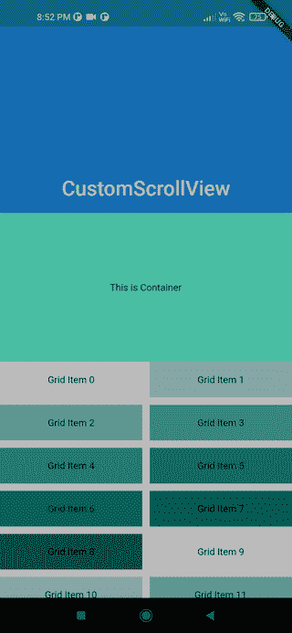

# 构建自定义的 Flutter ScrollView 

> 原文：<https://blog.logrocket.com/building-custom-flutter-scrollview/>

在本文中，我们将学习如何使用 CustomScrollView 和 Slivers 创建一个自定义滚动屏幕，其中包含多个水平、垂直滚动的可滚动组件，或者只是在 CustomScrollView 中放置一个不可滚动的小部件。

如果您想要创建自定义滚动效果或对 ScrollView 的滚动内容有更多的控制，这个小部件特别有用。

如果您构建一个像我这样的自定义 ScrollView，您应该会得到这样的结果:



## 目录

## 条子到底是什么？

长条是可滚动区域的一部分，您可以对其进行配置，使其具有不同的行为。

正如[官方文档所述](https://docs.flutter.dev/development/ui/advanced/slivers)，一个长条是 CustomScrollview 中可滚动区域的一小部分，可以相应地配置为以某种方式运行。使用 Flutter 的 Slivers，我们可以轻松地创建过多的奇妙滚动效果。Slivers 由 Flutter 中的所有可滚动视图使用；例如，ListView 使用 SliverList，GridView 使用 SliverGrid。

因为当窗口小部件进入视口时，Slivers 会懒洋洋地构建它们的视图，所以显示大量的孩子而不用担心内存问题是非常有用的。此外，我们可以很容易地通过使用颤动的细长条做出许多奇妙的滚动效果。

CustomScrollView 是一个使用多个 Slivers 而不是一个 Slivers 的小部件，就像我们在 ListView 和 GridView 中看到的那样。它使您能够直接利用 Slivers 来创建滚动效果，如列表、网格和扩展标题。

实现很简单；简单地将所有的长条放入`CustomScrollView`中，如图所示:

```
CustomScrollView(
    slivers: [
      SliverAppBar(...),
    SliverToBoxAdapter(...),
      SliverGrid(...),
        SliverToBoxAdapter(...),
    SliverFixedExtenrList(...),
    ],
    controller: ScrollController(),
)

```

给`CustomScrollView`一个`ScrollController`来控制初始滚动偏移量或者处理一般的滚动行为。

## 棉条简介

如前所述，长条是可滚动区域的一部分，可以在 CustomScrollView 中使用。有许多可用的切片，我们将选择一些来演示如何使用它们。

*   [SliverAppBar](https://blog.logrocket.com/how-to-add-sliverappbar-to-your-flutter-app/) :这个长条呈现一个应用程序栏，它是最常用的长条部件之一，通过设置`flexibleSpace`和`expandedHeight`参数来创建可折叠的`AppBars`
*   SliverList:沿着 ScrollView 的主轴线以线性数组的形式呈现列表的长条。为了在列表项滚动到视图中时构建列表项，SliverList 接受一个委托参数。一个`SliverChildListDelegate`指定了一次创建的孩子的固定列表，而一个`SliverChildBuilderDelegate`指定了它们是如何被延迟构建的
*   SliverFixedExtentList:SliverFixedExtentList 与 SliverList 相同，只是 SliverFixedExtentList 保证所有列表项在主轴上具有相同的大小(即，在垂直滚动列表上具有相同的高度，在水平滚动列表上具有相同的宽度)。这对于滚动时 ListView 的性能有很大的影响，因为当您希望跳很远的距离时，在加载项目之前知道它们的大小是非常有益的。例如，如果我们知道每个项目的高度固定为 50 像素，我们想向下滚动 5，000 像素，我们可以通过加载第 101 个项目并显示它来轻松跳过 100 个项目
*   SliverGrid: SliverGrid 是一个在 ScrollView 中显示 2D 子数组的长条。它通过一个委托或一个显式列表接受子部件，并且它还定义了`gridDelegate`，它决定了子部件在网格中的位置
*   长条填充:在另一长条周围产生空白空间的长条。它和 Padding 小部件之间的唯一区别是它生成 RenderSliver 而不是 RenderBox，因此它可以在 CustomScrollView 中使用
*   sliverToBoxAdapter:一个 Sliver，允许您扭曲任何其他不是 Sliver 的小部件，并在 CustomScrollView 中使用它；这对于用各种小部件创建复杂的滚动屏幕来说是非常有用的
*   SliverOpacity:使其子 sliver 部分透明的 sliver 小部件。它是不透明度小部件的一个易于使用的替代品，就像 SliverPadding 一样

说够了；现在是时候深入代码并应用我们所学的关于 CustomScrollView 和 Slivers 的知识了。我们将构建一个示例应用程序，其中多个可滚动/不可滚动的小部件在一个滚动视图中垂直排列，作为一个单独的可滚动区域。

下面是我们的 CustomScrollView 视图的结构:

*   SliverAppBar:一个可折叠的 AppBar，当我们垂直滚动时，它可以展开和折叠。您可以尝试使用`pinned`、`floating`和`snap`参数来控制当我们进一步滚动时，SliverAppBar 如何以及何时折叠、展开或固定在顶部
*   SliverToBoxAdapter:我们将在`SliverAppBar`下面放置一个具有高度`200`和颜色`tealAccent`的`Container`来表示一个需要用`SliverToBoxAdapter`包装的非银色小部件，以便成为`CustomScrollView`的子部件
*   `SliverGrid: Underneath the Container is a SliverGrid with twenty child items each with a different color flavor of `tealAccent`。我们使用了`SliverGridDelegateWithMaxCrossAxisExtent`，它为图块选择最大的横轴范围；如果你想创建一个在横轴上有固定数量瓷砖的布局，使用`SliverGridDelegateWithFixedCrossAxisCount``
`*   SliverToBoxAdapter:在`SliverGrid`下面，我们有一个带有`amberAccent`颜色的`Container`小部件*   ListView(在 SliverToBoxAdapter 内部):你可能想知道为什么我们在`SliverToBoxAdapter`内部使用了`ListView`。原因是我们想做一个水平滚动的列表，这在`SliverList`中是不可能的，因为我们必须把这个“列表视图”放在`CustomScrollView`中，我们需要把它放在`SliverToBoxAdapter`中*   SliverFixedExtentList:作为最后一个 slin 子元素，我们使用`SliverFixedExtentList`来生成一个具有固定`itemExtent`的垂直滚动列表，这意味着每个子元素将具有固定的高度，这将帮助我们提高滚动性能:`

 ````
import 'package:flutter/material.dart';

void main() => runApp(const MyApp());

class MyApp extends StatelessWidget {
  const MyApp({Key? key}) : super(key: key);

  static const String _title = 'Flutter Code Sample';

  @override
  Widget build(BuildContext context) {
    return const MaterialApp(
      title: _title,
      home: CustomScrollingWidget(),
    );
  }
}

class CustomScrollingWidget extends StatefulWidget {
  const CustomScrollingWidget({Key? key}) : super(key: key);

  @override
  State createState() => _CustomScrollingWidgetState();
}

class _CustomScrollingWidgetState extends State {
  @override
  Widget build(BuildContext context) {
    return Scaffold(
      body: CustomScrollView(
        slivers: [
          const SliverAppBar(
            pinned: true,
            expandedHeight: 250.0,
            flexibleSpace: FlexibleSpaceBar(
              title: Text('CustomScrollView'),
              centerTitle: true,
            ),
          ),
          SliverToBoxAdapter(
            child: Container(
              color: Colors.tealAccent,
              alignment: Alignment.center,
              height: 200,
              child: const Text('This is Container'),
            ),
          ),
          SliverGrid(
            gridDelegate: const SliverGridDelegateWithMaxCrossAxisExtent(
              maxCrossAxisExtent: 200.0,
              mainAxisSpacing: 10.0,
              crossAxisSpacing: 10.0,
              childAspectRatio: 4.0,
            ),
            delegate: SliverChildBuilderDelegate(
              (BuildContext context, int index) {
                return Container(
                  alignment: Alignment.center,
                  color: Colors.teal[100 * (index % 9)],
                  child: Text('Grid Item $index'),
                );
              },
              childCount: 20,
            ),
          ),
          SliverToBoxAdapter(
            child: Container(
              color: Colors.amberAccent,
              alignment: Alignment.center,
              height: 200,
              child: const Text('This is Container'),
            ),
          ),
          SliverToBoxAdapter(
            child: SizedBox(
              height: 100.0,
              child: ListView.builder(
                scrollDirection: Axis.horizontal,
                itemCount: 10,
                itemBuilder: (context, index) {
                  return SizedBox(
                    width: 100.0,
                    child: Card(
                      color: Colors.cyan[100 * (index % 9)],
                      child: Text('Item $index'),
                    ),
                  );
                },
              ),
            ),
          ),
          SliverFixedExtentList(
            itemExtent: 50.0,
            delegate: SliverChildBuilderDelegate(
              (BuildContext context, int index) {
                return Container(
                  alignment: Alignment.center,
                  color: Colors.lightBlue[100 * (index % 9)],
                  child: Text('List Item $index'),
                );
              },
            ),
          ),
        ],
      ),
    );
  }
}

```

## 结论

在本文中，您了解了如何使用大量滚动组件创建 ScrollView，现在您可以使用 Slivers 和 CustomScrollView 设计任何类型的复杂滚动屏幕。希望你继续探索新事物。

现在我们已经做好了一切准备，您所要做的就是启动应用程序并开始享受。

最美好的祝愿！开心飘飘！

如果你有任何问题，请在这里发表。感谢所有的反馈。

## 使用 [LogRocket](https://lp.logrocket.com/blg/signup) 消除传统错误报告的干扰

[](https://lp.logrocket.com/blg/signup)

[LogRocket](https://lp.logrocket.com/blg/signup) 是一个数字体验分析解决方案，它可以保护您免受数百个假阳性错误警报的影响，只针对几个真正重要的项目。LogRocket 会告诉您应用程序中实际影响用户的最具影响力的 bug 和 UX 问题。

然后，使用具有深层技术遥测的会话重放来确切地查看用户看到了什么以及是什么导致了问题，就像你在他们身后看一样。

LogRocket 自动聚合客户端错误、JS 异常、前端性能指标和用户交互。然后 LogRocket 使用机器学习来告诉你哪些问题正在影响大多数用户，并提供你需要修复它的上下文。

关注重要的 bug—[今天就试试 LogRocket】。](https://lp.logrocket.com/blg/signup-issue-free)`