# 使用 Vizzu 通过图表构建数据故事

> 原文：<https://blog.logrocket.com/building-data-stories-through-charts-vizzu/>

## 介绍

数据很重要，它的重要性贯穿于我们生活的方方面面。数据如此重要，以至于个人、企业和组织都投入资源进行数据收集。然而，如何显示数据与收集数据同样重要。以有意义的方式显示数据非常重要，这样目标受众可以轻松地消费和理解。大多数时候，人们以图表的形式呈现数据。

一些开源库解决了数据的可视化表示问题，Vizzu 就是其中之一。Vizzu 是一个免费的开源 JavaScript 库，用于构建动画图表、数据故事和交互式浏览器。与其他图表库不同，Vizzu 不仅能让我们显示数据，还能让数据生动起来。

在本文中，我们将学习如何用 Vizzu 创建图表并制作动画。我们将深入探讨 Vizzu 的工作原理、特性以及它支持的不同动画。

## 装置

在您的终端中运行以下命令来安装 Vizzu:

```
npm install vizzu

```

或者，我们可以通过它的 CDN 安装 Vizzu:

```
<script type="module">
import Vizzu from 'https://cdn.jsdelivr.net/npm/[email protected]/dist/vizzu.min.js';
</script> 

```

## 创建简单的条形图

任何图表的核心都是我们将在图表上绘制的数据。

Vizzu 中有两种类型的图表数据，“维度”和“度量”。维度是图表上每个元素的类别，度量是这些元素的值。维度只接受字符串数组，度量只接受数字。

让我们通过为条形图创建一些数据来看看维度和度量在代码中是如何工作的:

```
const barData = {
  series: [
    { name: "Names", values: ["Alice", "Bob", "Ted", "John", "Rose"] },
    { name: "Ages", type: "measure", values: [15, 32, 12, 36, 28] },
  ],
};

```

在`barData`数组中，`Names`数据是维度，`Ages`是数值。我们明确地为`Ages`设置了类型，但没有为`Names`设置。这是因为`type`属性是可选的。

如果省略了`type`属性，Vizzu 将使用`typeof`操作符根据值数组的第一个元素自动选择类型。如果所有项目都是数字，它将被声明为一个度量。在任何其他情况下，它将被声明为一个维度。

定义完数据后，让我们设置显示图表的 HTML:

```
<!DOCTYPE html>
<html lang="en">
  <head>
    <title>LogRocket Vizzu Article</title>
  </head>
  <body>
    <div class="chart" id="vizzu-bar"></div>

    <script type="module" src="/script.js"></script>
  </body>
</html>

```

我们设置了一个`div`，给它一个“图表”类。我们将以这个类为目标，用它来设计`div`的样式。

然后，我们给`div`一个 ID“vizzu-bar ”,并链接到一个`script.js`文件，在这里我们将初始化图表功能。稍后，我们将在 JavaScript 文件中把这个`div`作为目标。

接下来，我们设计`div`元素的样式:

```
.chart {
  width: 600px;
  height: 450px;
  border: 1px solid black;
}

```

在这里，我们设置`div`的宽度、高度和边框。

接下来，我们初始化`script.js`文件中的图表:

```
import Vizzu from "https://cdn.jsdelivr.net/npm/[email protected]/dist/vizzu.min.js";

const barData = {
  series: [
    { name: "Names", values: ["Alice", "Bob", "Ted", "John", "Rose"] },
    { name: "Ages", type: "measure", values: [15, 32, 12, 36, 28] },
  ],
};

//new instance of the 'Vizzu' class
let barChart = new Vizzu("vizzu-bar", { data: barData });

//we initialize the bar chart with the `animate` call
barChart.animate({
  config: {
    channels: {
      x: { set: ["Names"] },
      y: { set: ["Ages"] },
    },
  },
});

```

我们来分解一下上面的代码片段。首先，我们导入 Vizzu 类构造函数。然后，我们创建 Vizzu 类的一个新对象实例，并传入我们设置的`"vizzu-bar”` ID。我们还将数据传递给实例。最后，我们用`animate`调用初始化图表。

`animate`方法接受一个对象，我们在该对象中定义数据在图表上的绘制方式。`config`对象有一个`channels`属性，我们将数据添加到相关的轴上。我们将`Names`传递给 x 轴，将`Ages`传递给 y 轴。

至此，我们已经创建了一个简单的静态条形图。

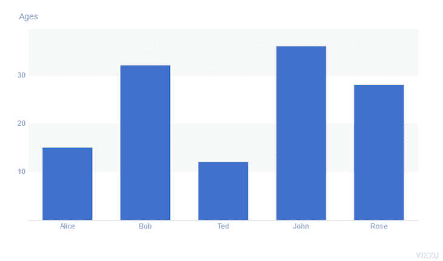

## 向图表添加动画

正如我们之前了解到的，Vizzu 的主要功能不是创建图表，而是制作动画。在我们向我们创建的条形图添加动画之前，让我们了解一下 Vizzu 是如何制作图表动画的。

每个`animate`调用保存图表配置的当前状态。第一个`animate`调用呈现一个静态图表，而后续调用在我们设置的不同动画状态之间转换图表。Vizzu 会自动在这两者之间转换。

每个`animation`状态都保存着我们想要动态显示的图表属性，比如标签、标题和几何图形。

现在我们已经了解了 Vizzu 图表动画是如何工作的，让我们来制作条形图动画:

```
//first animate call display chart 
barChart.animate({
  config: {
    channels: {
      x: { set: ["Names"] },
      y: { set: ["Ages"] },
    },
  },
});

//chart animation call
barChart.animate({
  geometry: "circle",
});

```

我们已经知道，要在 Vizzu 中制作图表动画，我们需要调用两次`animate`方法。

在上面的代码片段中，第一个`animate`调用负责初始化图表。我们之前在创建条形图时已经这样做了。

* * *

### 更多来自 LogRocket 的精彩文章:

* * *

第二个`animate`调用负责动画图表。在第二次调用中，我们定义了想要制作动画的图表的属性。这里，我们将`geometry`属性制作成动画，并将其更改为圆形。这样，图表上绘制区域的外观将从矩形条转变为圆形点。

除了定义我们想要制作动画的属性，我们还可以像这样控制动画的行为:

```
//chart animation call
barChart.animate(
  { geometry: "circle" },
  { geometry: { duration: 4, delay: 4, easing: 'linear' }}
);

```

这里，我们将持续时间和延迟设置为 4 秒，并将缓动设置为“线性”。

## 样式图表

从我们创建的条形图的屏幕截图中，我们可以看到 Vizzu 图表的默认外观。我们可以使用`style`对象定制图表的外观。

### 颜色；色彩；色调

除了 Vizzu 应用于图表的蓝色之外，它还有默认的调色板，我们可以用它来改变图表的外观。但是，我们必须激活此功能才能应用它。

让我们将 Vizzu 的默认颜色应用于条形图:

```
//basic setup of our bar chart
barChart.animate({
  config: {
    channels: {
      x: { set: ["Names"] },
      y: { set: ["Ages"] },

      //Vizzu's color palette added
      color: { set: ["Names"] },
    },
  },
});

```

就这么简单。通过这两行代码，我们改进了条形图的外观。

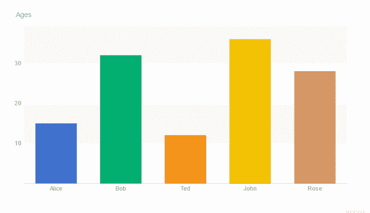

除了使用 Vizzu 的默认颜色，我们还可以定义符合我们品牌身份或设计要求的定制托盘:

```
barChart.animate({
  config: {
    channels: {
      x: { set: ["Names"] },
      y: { set: ["Ages"] },
      color: { set: ["Names"] },
    },
  },

  style: {
    plot: {
      marker: {
        //we define our custom color palletes here
        colorPalette: "#9355e8FF #123456FF #BDAF10FF #123ab2",
      },
    },
  },
});

```

这里，我们通过`colorPalette`属性为每个图表元素定义调色板。`colorPalette`接受一串空格分隔的值。RGB 和 Hex 是唯一可接受的颜色格式。

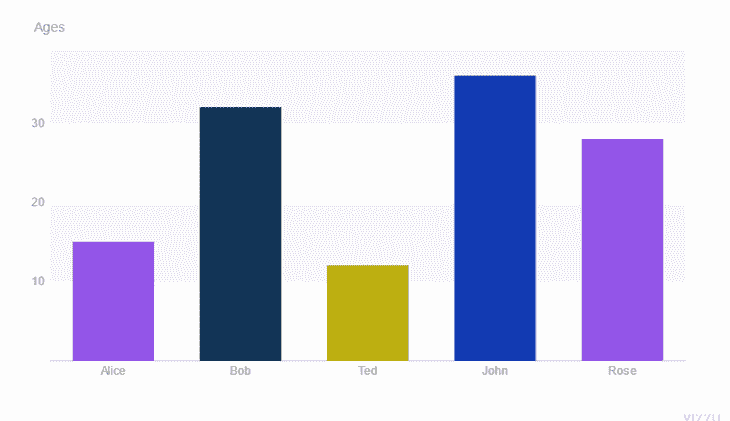

### 字体大小

我们还可以更改图表的字体大小:

```
barChart.animate({
  config: {
    channels: {...},
  },
  style: {
    title: {
      //changing the title's font size
      fontSize: 20,
    },
  },
});

```

这里，我们使用图表的`fontSize`属性设置图表标题的字体大小。

我们也可以用顶级的`fontSize`参数改变整个图表的字体大小:

```
barChart.animate({
  style: {
    fontSize: 20,
  },
});

```

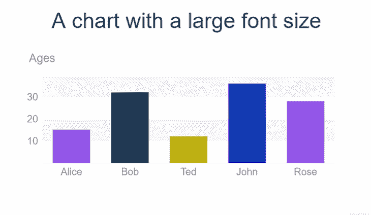

## 图表配置和选项

我们可以通过`config`对象来调整 Vizzu 图表的配置。以下是可以根据我们的喜好进行配置的一些项目:

### 标题

我们可以给图表添加标题，告诉读者图表显示的信息类型:

```
barChart.animate({
  config: {
    channels: {
      x: { set: ["Names"] },
      y: { set: ["Ages"] },

      //title of chart added
      title: "A chart showing something useful",
    },
  },
});

```

为了设置图表的标题，我们使用`channels`的`title`属性并传入一个值。

### 标签

数据标签使读者能够轻松识别图表中的每一条数据:

```
barChart.animate({
  config: {
    channels: {
      x: { set: ["Names"] },
      y: { set: ["Ages"] },
      label: { set: ["Names"] },
    },
    title: "A chart with labels added",
  },
});

```

为了给图表添加标签，我们使用了`label`属性。这里，我们使用`Names`数据作为图表的标签。

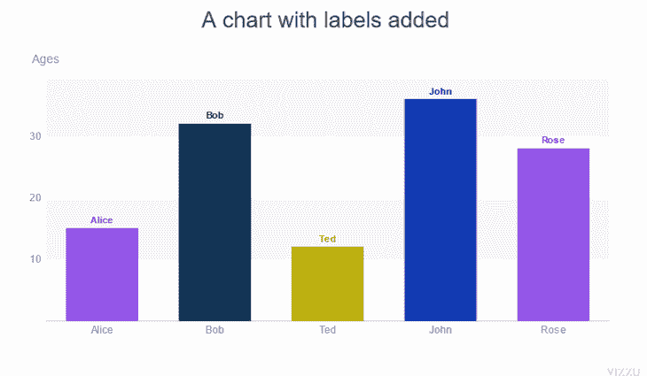

### 传说

图例是图表数据的小型可视化表示。像标签一样，图例有助于读者更好地理解和解释图表数据。

```
barChart.animate({
  config: {
    channels: {
      x: { set: ["Names"] },
      y: { set: ["Ages"] },
      color: { set: ["Names"] },
    },
    title: "A chart with it's legend showing",
    legend: "color",
  },
});

```

我们必须将图例附加到一个可用的通道上，以便显示图例。

在上面的代码块中，我们将图例附加到`color`通道。

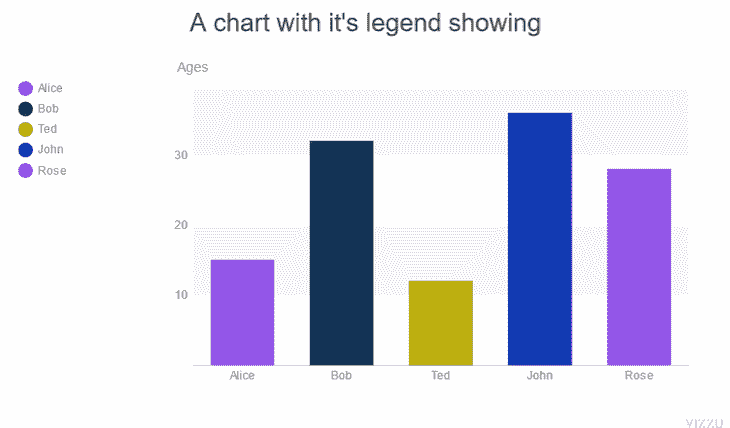

### 几何学

正如我们前面看到的，图表元素的几何图形是 Vizzu 图表的动画属性之一。这也是我们可以配置的属性之一。Vizzu 中有 4 种几何图形:
`area``line``circle``rectangle`。

让我们看看如何更改图表的几何图形:

```
chart.animate({
  config: {
    //we set the geometry we want for the chart here
    geometry: "rectangle","area", "line", "circle"
  },
});

```

要改变图表的几何形状，我们使用`geometry`属性，并将其设置为我们想要的形状。

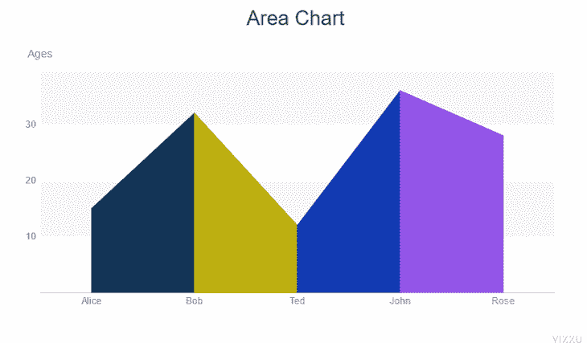

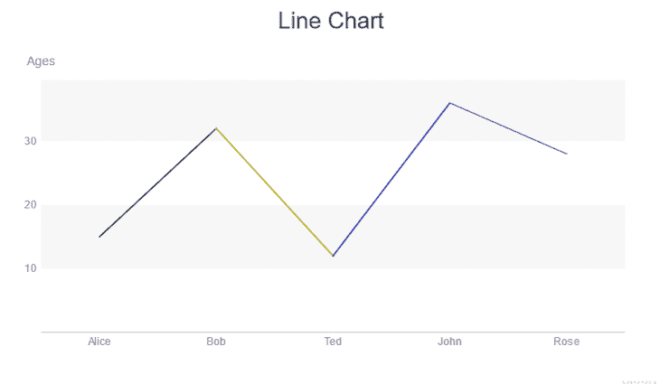

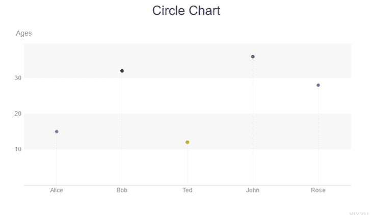

### 整理

Vizzu 提供了图表排序选项，允许我们安排数据在图表上的绘制顺序。默认情况下，地块数据按照添加的顺序排序。

为了按升序对图表进行排序，我们将`sort`属性设置为`byValue`:

```
barChart.animate({
  config: {
    channels: {...},
    //sorts chart elements in ascending order
    sort: "byValue",
  },
});

```

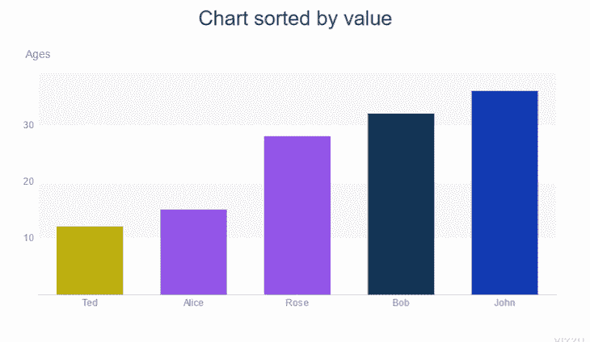

为了对图表进行降序排序，我们将`reverse`属性设置为`true`。当使用`reverse`而未将`sort`设置为`byValue`时，图表将按照数据传入的相反顺序排列:

```
barChart.animate({
  config: {
    channels: {...},
    //sorts chart elements in ascending order
    sort: "byValue",

    //changes to descending order
    reverse: true
  },
});

```

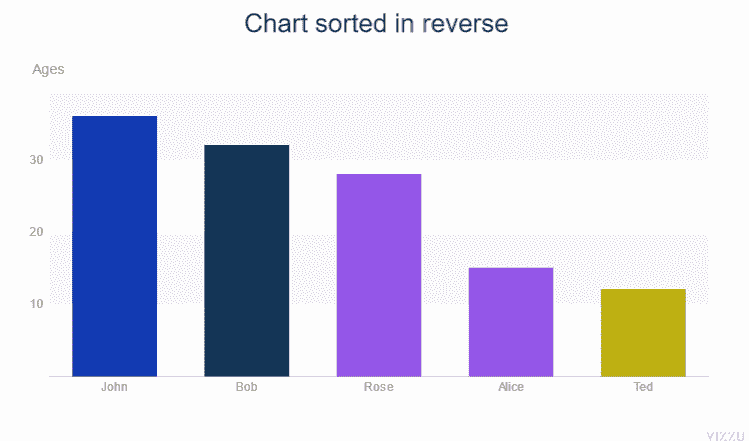

### 对齐

我们可以用不同的方法来对齐图表元素。我们可以拉伸它们，使它们居中，或者保持默认的对齐方式。

让我们看看如何调整图表的对齐方式:

```
barChart.animate({
  config: {
    channels: {...},
    align:"center",
    align:"stretch",

    //the default alignment
    align:"none",
  },
});

```

我们选择我们想要的对齐类型，并将该值传递给`align`属性。

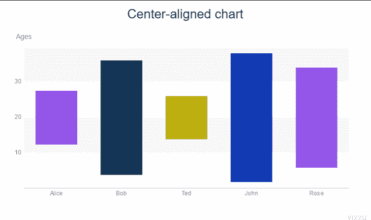

### 图表布局

图表布局有三个独立的部分:顶部的图表标题、左侧的图例和包含图表的绘图区。

我们可以从`style`对象定制图表的布局:

```
barChart.animate({
  config: {
    channels: {
      x: { set: ["Names"] },
      y: { set: ["Ages"] },
      color: { set: ["Names"] },
    },
    title: "A chart with a custom layout",
    legend: "color",
  },
  style: {
    title: {
      backgroundColor: "#bdA030",
      paddingTop: 20,
      paddingBottom: 20,
      paddingLeft: 200,
    },
    plot: { backgroundColor: "#D2D2D2" },
    legend: { backgroundColor: "#d08080", width: 350 },
  },
});

```

这里，我们对图表的标题、情节和图例部分进行了样式化。

首先，我们改变绘图的背景颜色。

接下来，我们更改图例的背景颜色并增加其宽度。

最后，我们增加了标题的填充，并改变了它的背景颜色。

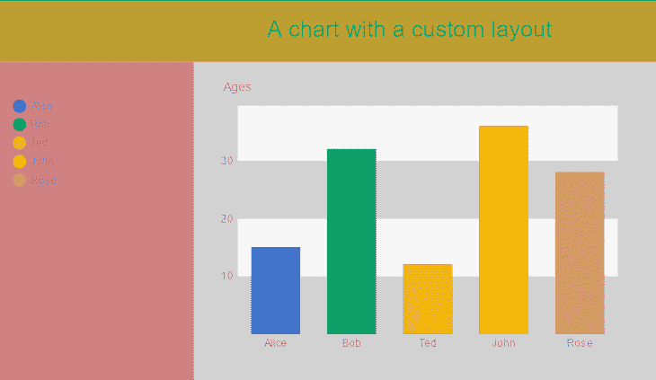

## 结论

数据的呈现方式与其收集同样重要；无法理解的数据是没有意义的。

在本文中，我们看到了 Vizzu 如何让我们以一种易于理解的方式可视化数据。我们还了解了如何用 Vizzu 制作图表动画和定制 Vizzu 图表。