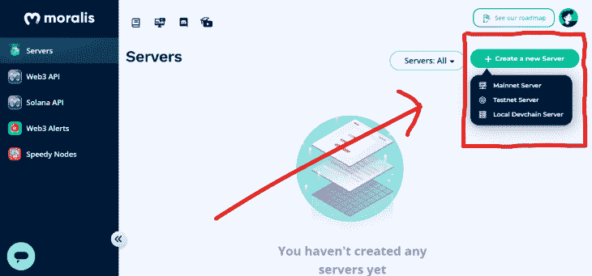
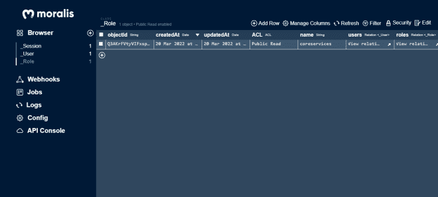
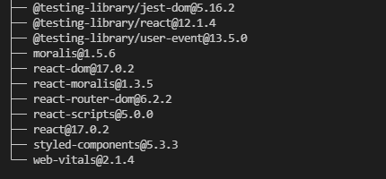

# 构建 DeFi 仪表板:开发者指南

> 原文：<https://blog.logrocket.com/building-defi-dashboard-developers-guide/>

作为区块链的一个受欢迎的用例，去中心化正在缓慢但稳定地在技术世界中获得牵引力。由于其可访问性和持久性，应用程序逐渐转向去中心化。金融科技(FinTech)也开始向区块链迁移，由此产生了 DeFi(去中心化金融)的概念。

DeFi 仪表板是一个平台，允许用户访问和监控 DeFi 资产的实时流，并分析各种指标。这些平台旨在尽可能简化与区块链金融系统的互动。

例如，加密货币和不可替代代币(NFT)现在是区块链最受欢迎的交易形式。DeFi 仪表板被设计成帮助具有最少编程经验的人访问资产和在那些资产上执行授权的活动。

现有 DeFi 仪表板的几个例子是 [Zapper](https://zapper.fi/) 、 [Apeboard](https://apeboard.finance/) 和 [Zerion](https://zerion.io/) 。

在本文中，我们将了解 DeFi 仪表板，它们的制作原因，以及如何制作我们自己的仪表板。

为了遵循本教程，请确保具备以下条件:

*   文本编辑器
*   本地安装的 Node.js
*   React 的工作知识
*   区块链工作原理的实用知识
*   关于道德的叙述

### 内容

## DeFi 仪表板有什么好处？

DeFi 仪表板对于区块链和加密货币用户尤为重要，因为它们可以轻松跟踪众多分散金融平台上的投资。DeFi 仪表板为用户提供以下内容:

首先，它们非常方便快捷地访问 DeFi 资产和服务。对于新手来说，使用大多数典型的区块链应用程序是相当具有挑战性的，访问 DeFi 资产和单独使用他们的服务需要大量的时间和精力。例如，多链或跨链 DeFi 仪表板加快了整个区块链的资产转换过程。

其次是 DeFi 社区的发展。因为 DeFi 仪表板对于新手来说更容易使用，所以他们可以被 DeFi 社区用来让新人加入他们的项目。

第三是 DeFi 活动跟踪和报告。大多数 DeFi 项目参与各种活动，如集资、提供流动资金、农业等等。跟踪所有这些活动变得非常困难，但是 DeFi 仪表板可以帮助跟踪和报告这些活动。

最后，还有 DeFi 活动的可视化。由于区块链的复杂性，DeFi 活动可能不明确，需要对后台运行的某些交易进行确认。这些活动可以使用 DeFi 仪表板可视化。

## 构建 DeFi 仪表板

对于一个网站开发者来说，知道如何设计网站是不够的。要构建一个好的 DeFi 仪表板，您需要学习更多的技巧。

构建 DeFi 仪表板需要了解区块链如何工作、值如何处理或转换、区块链加密等知识。

在接下来的部分中，我们将使用 [Moralis](https://blog.logrocket.com/using-moralis-nextjs/) testnet 服务器和 React 构建一个基本的 DeFi 仪表板。

### 设置 Moralis testnet 服务器

您需要设置一个新的 Moralis 服务器来访问您的应用程序中的 Moralis testnet 服务器资源。

Mainnet、testnet 和本地 devchain 服务器是 Moralis 支持的服务器。Mainnet 用于生产，在其上执行的活动是真实的，并影响实际资产。Testnet 服务器用于开发目的；该服务器允许测试和试验，而不会将实际资产置于风险之中。本地 devchain 服务器类似于 testnet 服务器，除了它们被托管在本地机器上，使得它们只可用于本地开发和使用。

我们将使用 Moralis testnet 服务器。采取以下步骤创建一个:

在 servers 页面的右上角，点击绿色的 **+ Create a new Server** 按钮，从下拉菜单中选择 **Testnet Server** 。



将打开一个模式，显示服务器的设置。填写所需信息，并选择您希望服务器使用的链。


选择想要使用的链后，点击**添加实例**按钮。这将创建一个出现在“服务器”页面上的服务器实例。

服务器部分末尾的**查看信息**按钮可用于预览服务器配置详情。因为这种模式中的信息是私有的，所以当你离开电脑时不要让它打开，并限制谁可以访问它。


当您关闭模式并从下拉菜单中选择服务器项目时，会出现一个**仪表板**按钮，它会将您带到如下所示的类似数据库的仪表板。

该仪表板跟踪当前服务器上发生的所有操作。因为服务器还是新的，所以暂时会空置。



### 在 React 中设置用户界面

我们将使用 React 创建我们的 DeFi 仪表板。我已经为本文创建了一个模板，但是您可以自由地为您的设计构建一个前端，并将逻辑应用于其中。

按照这些步骤来使用我已经创建的模板。
首先，在终端的指定目录下运行下面的命令来克隆 Github 库:

```
git clone https://github.com/wolz-CODElife/DeFidash-template.git

```

然后，运行以下命令将终端目录更改为项目目录:

```
cd DeFidash-template

```

在启动应用服务器之前，安装`package.json`文件中列出的依赖项是非常重要的。

### 安装依赖项

在项目目录的终端中运行以下命令，安装应用程序的依赖项:

```
npm install

```

安装完成后，检查以下软件包是否可用:



在终端上运行以下命令以获取该列表:

```
npm list

```

当您启动应用服务器时，您应该会在浏览器中看到类似这样的内容。


## 在应用程序中配置道德

现在，让我们为我们的用户界面添加一些功能。首先，我们必须从我们创建的 Moralis 帐户向我们的应用程序提供 Moralis 服务器 URL 和应用程序 ID。

在`/src/services/MoralisConfig.js`中有两个标记为`SERVER_URL`和`APP_ID`的常数:

```
export const APP_ID = "YOUR_MORALIS_APP_ID" 
export const SERVER_URL = "YOUR_MORALIS_SERVER_URL"

```

将这些值替换为必要的道德帐户值。既然我们有了这些凭证，我们想用`MoralisProvider`包装我们的应用程序。这将有助于应用程序一启动就初始化 Moralis。

导入`MoralisProvider`并将其作为组件添加到`index.js`文件中，如下所示:

```
import React from 'react';
import ReactDOM from 'react-dom';
import './index.css';
import App from './App';
import { APP_ID, SERVER_URL } from './services/MoralisConfig';
ReactDOM.render(
  <React.StrictMode>
    <MoralisProvider serverUrl={SERVER_URL} appId={APP_ID}>
      <App />
    </MoralisProvider>
  </React.StrictMode>,
  document.getElementById('root')
);

```

我们从上面代码片段中的`MoralisConfig.js`文件导入了`SERVER_URL`和`APP_ID`；这可能不是问题，因为我们正在开发一个测试应用程序。

建议将服务器 URL 和应用程序 ID 存储为[环境变量](https://create-react-app.dev/docs/adding-custom-environment-variables)，供公共使用或处理实际数据的应用程序使用。逆向工程师可能能够访问源代码，如果找到特定的凭据，他们可能会被用来危害平台。

## 在您的 DeFi 仪表板上验证用户

如果一切按计划进行，我们应该能够从我们的应用程序与 Moralis 服务器进行交互和通信。我们想要构建的第一个功能是 Moralis 身份验证，因为我们需要将用户的钱包链接到应用程序，以便它访问他们的资产和交易。

要实现认证，更改`/src/pages/ConnectWallet.js`中的以下代码:

```
import React, { useEffect } from 'react'
import { useNavigate } from 'react-router-dom'
import styled from 'styled-components'
import { useMoralis } from "react-moralis";
const ConnectWallet = ({connected, setConnected}) => {
    const navigate = useNavigate()
    const { authenticate, isAuthenticated } = useMoralis();
    useEffect(() => {
        if(connected){
            navigate("/dashboard")        
        }
    }, [connected, navigate])
    const HandleMetaMask = () => {
        if (!isAuthenticated) {
            authenticate({signingMessage: "Log in using Moralis" })
            .then((user) => {
                if(user){
                    setConnected(true)
                }
            })
            .catch(error => {
                console.log(error);
            });
        }
    }
    const HandleWalletConnect = () => {
        if (!isAuthenticated) {
            authenticate({signingMessage: "Log in using Moralis", provider: "walletconnect", chainId: 56 })
            .then((user) => {
                if(user) {
                    setConnected(true)
                }
            })
            .catch(error => {
                console.log(error);
            });
        }
    }
  return (
    <SigninForm>
        <div className="title">
            <h1>Connect your wallet</h1>
            <p>Connect your wallet and know everything about NFT👉</p>
        </div>
        <div className="wallets">
            <button onClick={HandleMetaMask}>
                
                <h2>MetaMask</h2>
            </button>
            <button onClick={HandleWalletConnect}>
                
                <h2>Wallet Connect</h2>
            </button>
            <a href="https://metamask.io/download" target="_blank" rel="noopener noreferrer">I don't have a wallet</a>
        </div>
    </SigninForm>
  )
}
export default ConnectWallet

const SigninForm = styled.div`
    display: flex;
    flex-direction: column;
    align-items: center;
    padding: 100px;
    @media screen and (max-width: 648px) {
        padding: 100px 50px;
    }
    @media screen and (max-width: 420px) {
        padding: 100px 25px;
    }
    .title {
        text-align: center;
        p {
            font-size: 18px;
        }
    }
    .wallets {
        display: flex;
        flex-direction: column;
        margin-top: 56px;
        button {
            height: 72px;
            width: 452px;
            padding: 24px;
            border: 1px solid #D7D9F2;
            display: flex;
            flex-direction: row;
            align-items: center;
            background: none;
            margin-bottom: 16px;
            border-radius: 14px;
            cursor: pointer;
            transition: all ease 0.4s;
            @media screen and (max-width: 550px) {
                width: 350px;
                padding: 15px;
            }
            @media screen and (max-width: 410px) {
                width: 250px;
                h2 {
                    font-size: 15px;
                }
            }
            img {
                width: 48px;
                height: 48px;
                margin: 0px 48px;
                @media screen and (max-width: 550px) {
                    margin: 0px;
                    margin-right: 20px;
                }
            }
            &:hover {
                border: 1px solid #5A66F9;
                background: #F7FAFA;
            }
        }
        a {
            text-decoration: none;
            color: #111119;
            flex: 1;
            text-align: center;
            font-size: 18px;
            margin: 24px 0px;
            &:hover {
                color: #8A92FF;
            }
        }
    }
`

```

代码摘录包括一个名为`ConnectWallet`的 React 组件，它接受两个道具:`connected`和`setConnected`，这两个道具是状态处理程序，用于检测用户是否已经将他或她的钱包链接到应用程序。

我们在`ConnectWallet`组件中定义了一个常量`navigate`作为钩子`useNavigate()`的函数，如果用户没有连接，我们使用这个函数来重新路由用户。

我们还在`useMoralis()`钩子中定义了两个常量:`authenticated`，这是一个用于认证用户的函数，以及`isAuthenticated`，这是一个测试用户是否被认证的布尔值。

然后，每次安装组件时，`useEffect`检查用户是否仍然连接。如果用户已连接，程序将导航至`/dashboard`路线。

我们还有两种处理钱包连接的方法:`HandleMetaMask`，它使用 Moralis `MetaMask`提供者管理认证，以及`HandleWalletConnect`，它使用 Moralis `walletconnect`提供者处理认证。

然后，该组件生成一个名为`SigninForm`的风格化组件，其中包含了`ConnectWallet`组件的 HTML 结构。

## 在您的 DeFi 仪表板上流式传输实时数据

我们想在用户被授权后从 Moralis 服务器获取他们的信息。为此，更改`/src/pages/Dashboard.js`中的以下代码:

```
import React, { useEffect, useRef, useState } from 'react'
import { useNavigate } from 'react-router-dom'
import styled from 'styled-components'
import History from '../Layouts/History'
import Portfolio from '../Layouts/Portfolio'
import { IconCopy, LogosEthereum } from '../services/icons'
import { useMoralisWeb3Api, useMoralis } from "react-moralis";
import { APP_ID, SERVER_URL } from '../services/MoralisConfig'

const Dashboard = ({connected, setConnected}) => {
  const [address, setAddress] = useState("")
  const addressInput = useRef(null)
  const [nativeBal, setNativeBal] = useState("")
  const [activeTab, setActiveTab] = useState('Portfolio')
  const tabs = ["Portfolio", "History"]
  const navigate = useNavigate()
  const Web3Api = useMoralisWeb3Api();
  const { user, logout, Moralis } = useMoralis();

  useEffect(() => {
    Moralis.start({serverUrl: SERVER_URL, appId: APP_ID})
    if(!connected){
        navigate("/connectwallet")        
    }
    else{
      setAddress(user.get("ethAddress"))
      fetchNativeBalances()
    }
    // eslint-disable-next-line
}, [connected, navigate, user])
  const handleCopy = () => {
    let text = addressInput.current.value
    navigator.clipboard.writeText(text).then(() => {
      alert('Copied address to clipboard!');
    }, function(err) {
      console.error('Async: Could not copy text: ', err);
    });
  }
  const fetchNativeBalances = async () => {
    let options = {
      chain: "ropsten"
    }
    Web3Api.account.getNativeBalance(options).then(balance => {
      console.log(balance);
      let newNativeBalance = parseFloat(Moralis.Units.FromWei(balance.balance)).toFixed(2)
      setNativeBal(newNativeBalance)
    })
  };
  const HandleDisconnectWallet = () => {
    logout().then(() => {
      setConnected(false)
    })
  }
  return (
    <DashContainer>
      <h1 className='overview'>Overview <button onClick={HandleDisconnectWallet}>Disconnect Wallet</button></h1>
      <div className="header">
        
        <span>{address.slice(0, 5) + "..." + address.slice(-4)}</span>
        <button onClick={handleCopy}><IconCopy /></button>
        <input type="hidden" defaultValue={address} ref={addressInput} />
      </div>
      <div className="sub_header">
        <LogosEthereum />
        <h1>{nativeBal || 0} ETH</h1>
      </div>
      <div className="tabs">
        <div className="head">
          {tabs.map(menu => (
            <button key={menu} className={activeTab === menu? "active" : ""} onClick={() => setActiveTab(menu)}>{menu}</button>
          ))}
        </div>
        <div className="body">
          {activeTab === tabs[0] ?
            <Portfolio />
            :
            <History />
          }
        </div>
      </div>
    </DashContainer>
  )
}
export default Dashboard

const DashContainer = styled.div`
    padding: 100px;
    @media screen and (max-width: 768px) {
      padding: 100px 50px;
    }
    @media screen and (max-width: 498px) {
      padding: 100px 25px;
    }

    .overview {
      display: flex;
      align-items: center;
      justify-content: space-between;

      button {
        background: none;
        border: 1px solid #FF0000A6;
        padding: 8px 15px;
        border-radius: 6px;
        cursor: pointer;

        @media screen and (max-width: 498px) {
          transform: scale(0.8);  
        }
        &:hover {
          background: #FF0000A6;
          color: #FFFFFF;
          border: none;
        }
      }
    }
    .header {
      display: flex;
      align-items: center;
      img {
        border-radius: 50%;
        width: 40px;
        height: 40px;
        margin-right: 10px;
      }
      span {
        color: #8a8a8a;
        font-size: 15px;
      }
      button {
        color: #8a8a8a;
        background: none;
        border: none;
        outline: none;
        cursor: pointer;
        svg {
          width: 15px;
          height: 15px;
        }
      }
    }
    .sub_header {
      display: flex;
      flex-direction: column;
      align-items: center;
      margin: 20px 0px;
    }
    .tabs {
      margin: 30px 0px;
      box-shadow: 2px 2px 20px #D7D9F2C0;
      border-radius: 10px;

      .head {
        background: #FFFFFF;
        border-radius: 10px 10px 0px 0px;

        button {
          border: none;
          outline: none;
          cursor: pointer;
          padding: 10px 15px;
          background: none;
          &:hover {
            border-bottom: 2px solid #5A66F960;
          }
          &.active {
            border-bottom: 2px solid #5A66F9;
          }
        }
      }

      .body {
        background: #FFFFFFA5;
        padding: 20px;
        border-radius: 0px 0px 10px 10px;
      }
    }
`

```

上面的代码片段包括一个名为`Dashboard`的 React 组件，它和`ConnectWallet`组件一样，接收两个道具`connected`和`setConnected`。

然后，我们定义一组处理数据的状态。我们还创建了一个名为`Portfolio`和`History`的选项卡列表，用于在用户的投资组合和交易历史预览之间切换。

我们还定义了某些道德实用程序；我们从`useMoralisWeb3Api()`钩子构建了一个名为`Web3Api`的新方法对象，并从`useMoralis()`钩子定义了`user`、`logout`和`Moralis`。

配置资源后，我们运行一个`useEffect`来查看用户是否连接，然后使用`fetchNativeBalances()`方法来获取用户的本机余额。如果用户没有连接，应用程序应该导航到`/connectwallet`路线。

我们还实现了方法`handleCopy`来复制用户的以太坊地址，`fetchNativeBalances`来获取当前用户在 ropsten testnet 上的本地余额(您可以更改链来查看该链的本地余额)，以及`HandleDisconnectWallet`来注销用户。

最后，`Dashboard`组件返回一个`DashContainer`样式的组件，显示用户的本地余额以及两个选项卡，用于显示用户的投资组合和交易历史。

默认情况下,`Portfolio`组件是仪表板上显示的第一个选项卡。该组件包含用户钱包的 ETH 链上令牌余额的列表。

要实现 portfolio 选项卡，请更改`/src/Layouts/Portfolio.js`中的以下代码:

```
import React, { useEffect, useState } from 'react'
import styled from 'styled-components'
import { useMoralisWeb3Api, useMoralis } from "react-moralis";
import { LogosEthereum } from '../services/icons'
import { APP_ID, SERVER_URL } from '../services/MoralisConfig';
const Portfolio = () => {
  const Web3Api = useMoralisWeb3Api();
  const { Moralis } = useMoralis()
  const [tokenBal, setTokenBal] = useState([])
  useEffect(() => {
    Moralis.start({serverUrl: SERVER_URL, appId: APP_ID})
    fetchTokenBalances()

    // eslint-disable-next-line
  }, [])
  const fetchTokenBalances = () => {
    Web3Api.account.getTokenBalances().then(balances => {
    let newBalances = []
    balances.map(bal => (
      newBalances.push({
        token_name: bal.symbol,
        token_logo: bal.logo,
        balance: parseFloat(Moralis.Units.FromWei(bal.balance)).toFixed(2)
      })
      ))
      setTokenBal(newBalances)
    })
  }

  return (
    <PortfolioContainer>
      <div className="table_responsive">
        <table>
          <thead>
            <tr>
              <th>Token</th>
              <th>Balance</th>
            </tr>
          </thead>
          {/* Table body */}
          <tbody>
            {tokenBal.length > 0?
              tokenBal.map(bal => (
                <tr key={bal.token_name}>
                  <td className='token_name'>{bal.token_logo && } {bal.token_name}</td>
                  <td>{bal.balance} ETH</td>
                </tr>
              ))
            :
            <tr>
              <td colSpan="2">No token found</td>
            </tr>
            }
          </tbody>
        </table>
      </div>
    </PortfolioContainer>
  )
}
export default Portfolio
const PortfolioContainer = styled.div`
  .table_responsive {
    width: 100%;
    overflow-x: auto;
    .header {
      display: flex;
      align-items: center;
      svg {
        margin-right: 10px;
        width: 40px;
        height: 40px;
      }
    }
    table {
      border-collapse: collapse;
      width: 100%;
      margin: 20px 0px;
    }
    td, th {
      border: 1px solid #5A66F965;
      text-align: left;
      padding: 8px;
    }
    .token_name {
      display: flex;
      img {
        width: 20px;
        height: 20px;
        border-radius: 50%;
        margin-right: 15px;
      }
    }
    tr:nth-child(even) {
      background-color: #5A66F940;
    }
  }
`

```

上面代码示例中的`Portfolio`组件有一个表，该表有条件地呈现当前用户的令牌余额行。如果用户在 ropsten 链上没有任何令牌，将呈现一个带有“未找到令牌”的行。

当组件被安装时，它触发一个执行`fetchTokenBalances()`方法的`useEffect`。`fetchTokenBalances()`使用`Web3Api`来检索当前用户的代币余额，并在更新`tokenBal`状态之前将每个代币余额添加到`newBalances`的列表中。

在我们设置了 portfolio 选项卡之后，我们需要设置一个选项卡来显示用户的交易历史。

要添加历史选项卡，将`/src/Layouts/History.js`中的代码改为:

```
import React, { useEffect, useState } from 'react'
import styled from 'styled-components'
import { useMoralisWeb3Api, useMoralis } from "react-moralis";
import { APP_ID, SERVER_URL } from '../services/MoralisConfig';
import { IconCopy } from '../services/icons';
const History = () => {
  const Web3Api = useMoralisWeb3Api();
  const { Moralis } = useMoralis()
  const [transactions, setTransactions] = useState([])
  useEffect(() => {
    Moralis.start({serverUrl: SERVER_URL, appId: APP_ID})
    fetchTransactionHistory()
    // eslint-disable-next-line
  }, [])
  const fetchTransactionHistory = async () => {
    let options = {
      chain: "testnet",
    }
    Web3Api.account.getTransactions(options).then(transacts => {
      if(transacts.result.length > 0) {
        let newTransactions = []
        transacts.result.map(transaction => {
          newTransactions.push({
            hash: transaction.hash,
            sender: transaction.from_address,
            receiver: transaction.to_address,
            value: parseFloat(Moralis.Units.FromWei(transaction.value)).toFixed(3),
            status: transaction.receipt_status,
            timestamp: transaction.block_timestamp
          })  
        })
        setTransactions(newTransactions)
      }
    })
  };
  const handleCopy = (address) => {
    navigator.clipboard.writeText(address).then(() => {
      alert('Copied address to clipboard!');
    }, function(err) {
      console.error('Async: Could not copy text: ', err);
    });
  }

  return (
    <HistoryContainer>
      <div className="table_responsive">
        <table>
          <thead>
            <tr>
              <th>Transaction Hash</th>
              <th>Sender Address</th>
              <th>Receiver Address</th>
              <th>Amount</th>
              <th>Status</th>
              <th>Timestamp</th>
            </tr>
          </thead>
          {/* Table body */}
          <tbody>
            {transactions.length > 0?
              transactions.map(transaction => (
                <tr key={transaction.hash + transaction.timestamp}>
                  <td>
                    <div className='trans_address'>
                      {transaction.hash.slice(0, 6) + "..." + transaction.hash.slice(-4)} 
                      <button onClick={() => handleCopy(transaction.hash)}><IconCopy /></button>
                    </div>
                  </td>
                  <td>
                    <div className='trans_address'>
                      {transaction.sender.slice(0, 6) + "..." + transaction.sender.slice(-4)} 
                      <button onClick={() => handleCopy(transaction.sender)}><IconCopy /></button>
                    </div>
                  </td>
                  <td>
                    <div className='trans_address'>
                      {transaction.receiver.slice(0, 6) + "..." + transaction.receiver.slice(-4)} 
                      <button onClick={() => handleCopy(transaction.receiver)}><IconCopy /></button>
                    </div>
                  </td>
                  <td>{transaction.value} ETH</td>
                  <td>{transaction.status === "1"? <span className='success'>Successful</span> : <span className='pending'>Pending</span> }</td>
                  <td>{new Date(transaction.timestamp).toUTCString()}</td>
                </tr>
              ))
            :
            <tr>
              <td colSpan="6">No transactions found</td>
            </tr>
            }
          </tbody>
        </table>
      </div>
    </HistoryContainer>
  )
}
export default History
const HistoryContainer = styled.div`
  .table_responsive {
    width: 100%;
    overflow-x: auto;
    table {
      border-collapse: collapse;
      width: 100%;
      margin: 20px 0px;
    }
    td, th {
      border: 1px solid #5A66F965;
      text-align: left;
      padding: 8px;
      min-width: 150px;
    }

    .trans_address {
      display: flex;
      button {
        color: #8a8a8a;
        background: none;
        border: none;
        outline: none;
        cursor: pointer;
        svg {
          width: 15px;
          height: 15px;
        }
      }
    }

    .success {
      font-size: 10px;
      background: #00aa0060;
      border-radius: 20px;
      padding: 3px 7px;
    }

    .pending {
      font-size: 10px;
      background: #aaaa0060;
      border-radius: 20px;
      padding: 3px 7px;
    }
    tr:nth-child(even) {
      background-color: #5A66F940;
    }
  }

```

在上面的代码中，`History`组件返回一个名为`HistoryContainer`的样式化组件。该组件还调用`fetchTransactionHistory()`方法，该方法使用`Web3Api`实用程序在用户钱包的 testnet 链上收集交易，只要它被挂载。

在将所需的文件编辑到上述代码片段中之后，应用程序应该完全正常工作，并为部署做好了准备。

## 部署应用程序

对于公共访问，您可以选择在任何托管平台上托管应用[；我选择在](https://blog.logrocket.com/8-ways-deploy-react-app-free/)[火力基地](https://firebase.google.com/?gclid=Cj0KCQjwuMuRBhCJARIsAHXdnqNUCWLmF6Yy7k3FB0siukOsn83UjcGdzeHizlFWxjmbVXlIgC0y1C4aAp1gEALw_wcB&gclsrc=aw.ds)部署地雷。

你可以在这里看到我部署的应用[。](https://defidashx.web.app/)

## 结论

读完这篇文章后，读者应该明白什么是 DeFi 仪表板，为什么要制造它们，以及如何从头开始构建一个。

你可以设计一个 [Zapper](https://zapper.fi) 克隆体来测试你的 DeFi 仪表盘构建技能。在下面的评论区，请随时提问或提出建议。

## 加入像 Bitso 和 Coinsquare 这样的组织，他们使用 LogRocket 主动监控他们的 Web3 应用

影响用户在您的应用中激活和交易的能力的客户端问题会极大地影响您的底线。如果您对监控 UX 问题、自动显示 JavaScript 错误、跟踪缓慢的网络请求和组件加载时间感兴趣，

[try LogRocket](https://lp.logrocket.com/blg/web3-signup)

.

[](https://lp.logrocket.com/blg/web3-signup)[https://logrocket.com/signup/](https://lp.logrocket.com/blg/web3-signup)

LogRocket 就像是网络和移动应用的 DVR，记录你的网络应用或网站上发生的一切。您可以汇总和报告关键的前端性能指标，重放用户会话和应用程序状态，记录网络请求，并自动显示所有错误，而不是猜测问题发生的原因。

现代化您调试 web 和移动应用的方式— [开始免费监控](https://lp.logrocket.com/blg/web3-signup)。