# 使用 OneDev 构建和部署 web 应用程序

> 原文：<https://blog.logrocket.com/building-deploying-react-web-app-onedev/>

使用云服务存储、构建和部署代码已经变得无处不在。你有[许多选项可以从](https://blog.logrocket.com/8-ways-deploy-react-app-free/)中选择。如果您想从自己的服务器进行构建和部署，那么选项会变得更加有限。当然，您可以自己安装和配置多种工具，但很难重建 GitHub、GitLab 和其他流行的云服务提供商提供的丰富的开发人员生态系统。这就是 [OneDev](https://code.onedev.io) 可以帮忙的地方。

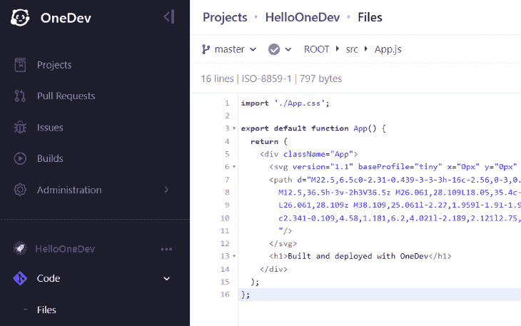

OneDev 是一个一体化的开源 DevOps 系统，您可以将其托管在自己的服务器上。它包括开发人员在流行的 DevOps 平台上已经习惯的一些最常见的功能，包括:

*   基于 Git 的源代码控制，包括拉请求、代码比较工具和注释功能
*   问题跟踪系统，包括可视化问题的板
*   运行构建和部署作业的自动化作业系统

在本文中，我们将从 React web 开发人员的角度探索 OneDev。我们将设置一个新的 OneDev 实例，将 React web 应用源代码推送到它，并设置一些构建和部署作业来部署到 [Azure 应用服务](https://azure.microsoft.com/en-us/products/app-service/)。

*向前跳转:*

## 先决条件

要跟随本教程，您需要以下内容:

## 设置 OneDev

官方的 OneDev [安装指南](https://code.onedev.io/projects/162/files/main/pages/installation-guide.md)描述了如何将 OneDev 设置为独立的 Docker 容器、Kubernetes 集群中的节点或者直接安装到服务器上而不使用容器技术。

最简单的入门方法是将 OneDev 作为独立的 Docker 容器运行。事实上，下面的 Docker compose 文件就像运行一个命令一样简单:

```
version: '3.8'
services:
  onedev:
    image: 1dev/server
    ports:
      - 6610:6610
      - 6611:6611
    volumes:
      # allow Docker to communicate with host
      - /var/run/docker.sock:/var/run/docker.sock
      - onedev_data:/opt/onedev
volumes:
  onedev_data:

```

这个 Docker 编写文件示例为您处理了一些事情:

*   公开所需的端口
*   确保 OneDev 容器中安装的 Docker 可以与本地系统上安装的 Docker 通信
*   将所有 OneDev 数据存储在一个名为`onedev_data`的持久卷中，以便在重启容器时不会丢失数据

将样本 Docker 合成文件保存到系统上的`docker-compose.yml`。然后，在同一文件夹中打开一个新的命令 shell，并运行以下命令以分离模式启动容器:

```
docker compose up -d

```

容器启动后，在浏览器中的 [http://localhost:6610](http://localhost:6610) 访问 OneDev。您可能需要等待几分钟，以便 OneDev 在浏览器中加载之前进行初始化。您首先会看到的是服务器设置屏幕；它将引导您完成初始设置。


完成服务器设置屏幕中的字段。在第二个屏幕上，保留默认的服务器 URL。OneDev 将在服务器设置完成后要求您验证您的电子邮件地址，因此请确保使用真实的电子邮件地址。

OneDev 有自己内置的身份验证和用户存储。如果您删除 Docker 容器和卷，您的帐户和数据将会丢失。如果您不想使用内置的用户存储，可以在管理区域设置外部身份验证源。

花几分钟时间探索 OneDev 用户界面。在左侧，您会发现一个导航菜单，提供对大多数功能的访问。在右上角，您会发现一个菜单，其中有各种用户特定的选项。

## 创建项目

在开始在 OneDev 中工作之前，您需要创建一个项目。一个项目包含一个 Git 存储库，一个问题跟踪器，以及一个或多个自动化(构建)作业。

要创建一个新项目，点击左侧导航菜单中的**项目**，然后点击 **+** (添加)按钮:

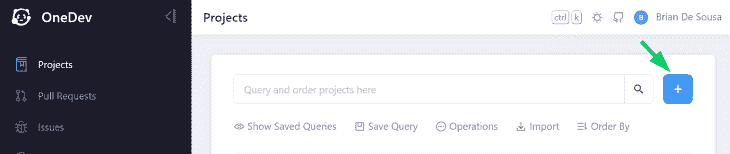

为你的项目指定一个**名称**和**描述**。将所有其他选项保留为默认选项:

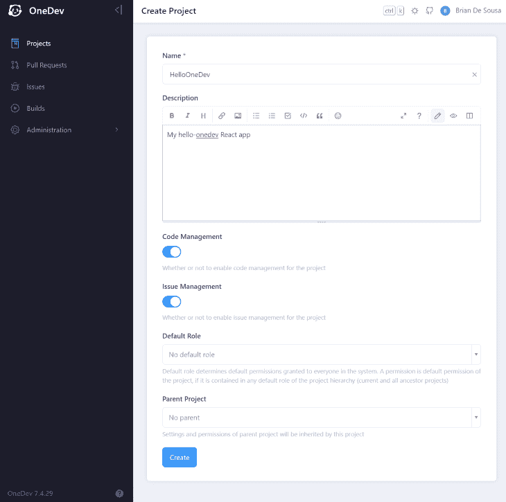

现在您有了一个项目，您将需要一些代码来工作。

## 创建一个示例 React 应用程序

为了简单起见，使用`create-react-app`生成一个新的 React web 应用程序示例:

```
npx create-react-app hello-onedev

```

为了让事情更有趣一点，用下面的代码替换`src/App.js`的内容:

```
import './App.css';

export default function App() {
  return (
    <div className="App">
      <svg version="1.1" baseProfile="tiny" x="0px" y="0px" width="200px" height="200px" viewBox="-0.5 0.5 42 42">
      <path d="M22.5,6.5c0-2.31-0.439-3-3-3h-16c-2.56,0-3,0.69-3,3v29c0,2.5,0.62,3,3,3h10v-2l9-8V6.5z M5.5,8.5h12v24h-12V8.5z
        M12.5,36.5h-3v-2h3V36.5z M26.061,28.109L18.05,35.4c-1.04,1.108-2.7,2.01-1.16,3.898c1.28,1.57,2.969,0.12,3.93-0.898l7.99-7.41
        L26.061,28.109z M38.109,25.061l-2.27,1.959l-1.91-1.97L34.8,22.9l-2.14-2.682c0,0-4.16-3.31-9.36-0.05
        c2.341-0.109,4.58,1.181,6.2,4.021l-2.189,2.121l2.75,2.629l1.799-1.619l2.201,1.93L32.3,30.93l2.14,2.16l5.761-5.58L38.109,25.061z
        "/>
      </svg>
      <h1>Built and deployed with OneDev</h1>
    </div>
  );
};

```

删除`src/App.test.js`文件以避免测试失败。

`create-react-app`命令初始化了一个本地 Git 存储库。不要忘记提交您刚才所做的更改:

```
git add *
git commit -m "make things interesting"

```

使用`npm start`运行您的应用程序，以确认它按预期运行。您应该会看到下面的图标和消息:

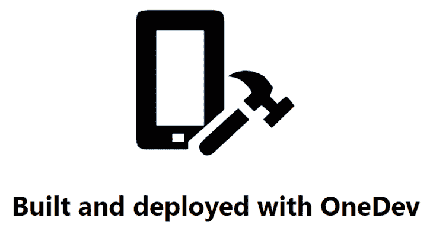

## 推动你的代码

OneDev 包括一个全功能的 Git 服务器。要向它推送代码，您需要将 OneDev 作为远程设备添加到您的本地存储库中。

导航到您之前创建的项目。点击**推送一个现有的存储库**，并针对您的本地存储库运行所示的命令。当在`git push`上提示输入凭据时，使用您刚刚创建的 OneDev 帐户。

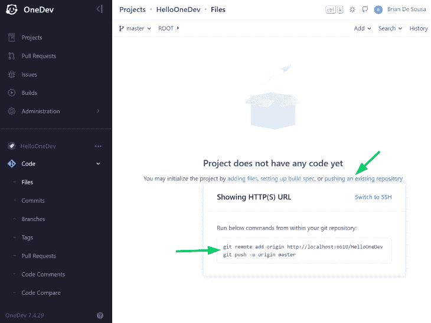

重新加载页面以在 OneDev 中查看您的代码。尽管您的代码现在位于 OneDev 容器中，但出于备份目的，您可能仍想考虑将其推到一个备用的远程位置。例如，您可以添加第二个远程 Git 存储库，将您的代码推送到 GitHub。

## 创建一个作业来构建和测试您的代码

OneDev 有一个内置的自动化作业引擎，允许您定义作业并将它们链接在一起。作业在名为`.onedev-buildspec.yml`的构建规范文件中定义，该文件存储在 Git 存储库的根目录中。您可以将该文件作为代码进行编辑，但是使用内置的构建规范编辑器要容易得多。

如果您的 Git 存储库不包含构建规范文件，OneDev 将提示您创建一个。为此，点击**添加。onedev-buildspec.yml** :

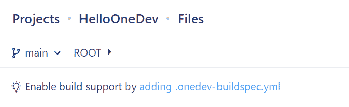

点击**作业**选项卡上的 **+** (添加)按钮，添加一个新作业。命名作业`Build`。

作业包含在作业工作空间中执行的一系列步骤。添加以下三个步骤来检查代码、构建和测试代码，并发布一个构建工件，以便它可以被后续的部署作业部署。

1.  添加一个名为`checkout`的**结帐代码**步骤。将所有其他选项保留为默认选项:

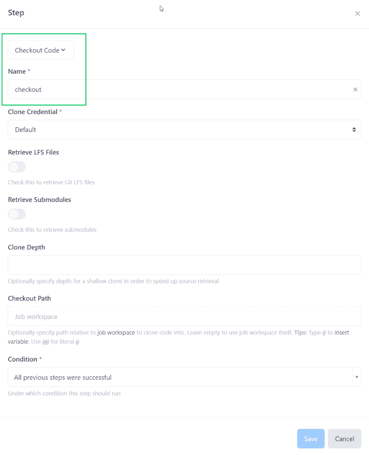

1.  添加一个**执行命令**的步骤，命名为`build & test`。将图像属性设置为`node:current-alpine`，并将命令设置为:

```
npm install
export CI=TRUE
npx react-scripts build
npx react-scripts test --passWithNoTests

```

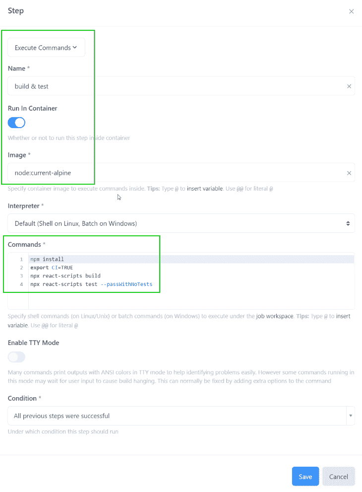

这一步将基于 Node.js 映像创建一个新的 Docker 容器，并在容器内执行构建。

1.  添加一个**发布工件**的步骤，命名为`publish`。将**工件**属性设置为`build/`(这是上一步的构建输出所在的位置)。这些工件将在构建规范中对未来的工作可用:

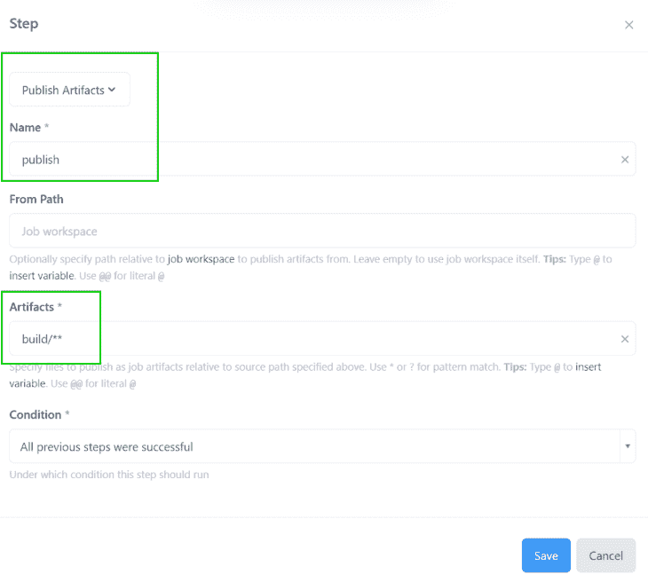

现在您已经指定了所有的步骤，您需要告诉 OneDev 这个作业应该何时运行。

在**参数&触发器**部分下，添加一个新的分支更新触发器。将所有选项保留为默认值。每次将提交推送到任何分支时，都会触发此作业。

到目前为止，您的工作应该是这样的:

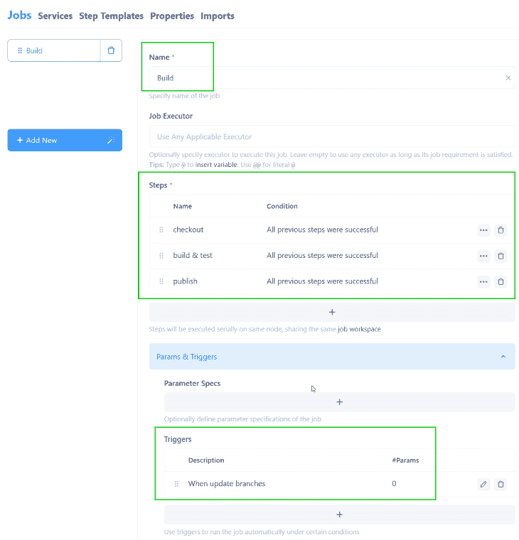

点击**保存**按钮，提交所有配置，在当前选择的分支上构建规范文件。提交后，作业将开始运行。

几分钟后，作业应该会成功完成:

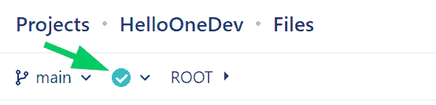

点按绿色勾号以查看构件。然后点击**工件**标签查看发布的工件:

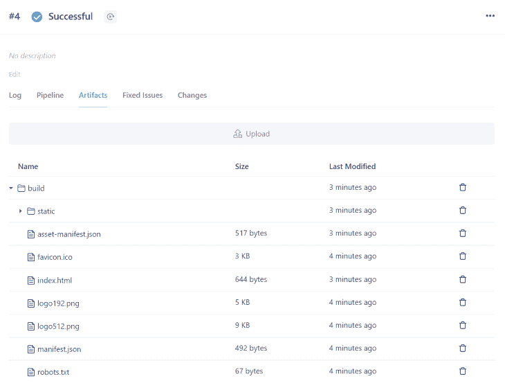

太好了！您在 OneDev 中运行了一个成功的构建作业。让我们更进一步，设置一个部署作业。

## 创建一个作业来部署代码

接下来，我们将演示如何使用 Azure CLI 将您的应用程序部署到 Azure；我们将提供所有需要的 Azure CLI 命令和脚本。

***注意，*** *由这些脚本部署的 Azure 资源是免费的，但是，如前所述，您需要有一个免费的 Azure 帐户*

部署作业将获取构建作业生成的工件，并使用 Azure CLI 将它们部署到 Azure App 服务。您将为您的部署作业创建并使用服务主体来登录您的 Azure 帐户。

从安全的角度来看，我们遵循最小特权访问的原则。您可以将服务主体上的权限限制为部署作业绝对需要的权限。

在 Bash 窗口中运行以下命令来创建一个新的服务主体。您需要指定自己的 Azure 订阅 ID。此命令需要 Azure CLI 的本地安装。或者，按照这些指令在 Azure 门户中创建一个服务主体:

```
# log in to your Azure account
az login

# set the ID of the Azure subscription to use
SUBSCRIPTION_ID="a123b456-7cde-8fgh-901234i5678j"

# create the service principal
MSYS_NO_PATHCONV=1 az ad sp create-for-rbac -n onedev-azure-cd --role Contributor --scopes /subscriptions/$SUBSCRIPTION_ID

```

从命令输出中复制`appId`、`password`和`tenant`的值。你很快就会需要这些。

在左侧导航中导航到**代码>** **文件**。打开`.onedev-buildspec.yml`并点击**编辑**按钮打开构建规范编辑器:


使用 **+** (添加)按钮添加一个名为`Deploy`的新任务。然后，使用以下设置向作业添加一个步骤:

1.  将步骤**类型**设置为`Execute Command`
2.  将步骤**名称**设置为`deploy to Azure`
3.  选择**下入容器**选项，将**图像**设置为`mcr.microsoft.com/azure-cli`；此步骤将在安装了 Microsoft Azure CLI 的容器中执行
4.  Add the below script to the **Commands** field, but make the following changes to the script:
    1.  *   在第 2-4 行，指定您先前创建的服务主体的详细信息
        *   第 7 行，指定两到三个字符来使你的 Azure 资源名称全球唯一

    ```
    # fill in your service principal details:
    APPID='YOUR_APP_ID'
    PASSWORD='YOUR_PASSWORD'
    TENANT='YOUR_TENANT_ID'

    # Azure resource configuration
    UNIQUE_SUFFIX='abc'
    RESOURCEGROUPNAME='onedev'
    LOCATION='eastus'
    APPSERVICEPLANNAME="onedev-react-asp-$UNIQUE_SUFFIX"
    APPNAME="onedev-react-app-$UNIQUE_SUFFIX"

    # Login with service principal
    az login --service-principal -u $APPID -p $PASSWORD --tenant $TENANT

    # Create resource group if it doesn't exist
    if [ $(az group exists --name $RESOURCEGROUPNAME) = false ]; then
        az group create --name $RESOURCEGROUPNAME --location $LOCATION
    else
            echo "Resource group exists already: $RESOURCEGROUPNAME"
    fi

    # Create app service if it doesn't exist
    appServicePlans=$(az appservice plan list -g $RESOURCEGROUPNAME --query "[?name=='$APPSERVICEPLANNAME']")
    if [ $appServicePlans = "[]" ]; then 
            az appservice plan create -n $APPSERVICEPLANNAME -g $RESOURCEGROUPNAME --sku F1
    else
             echo "App service plan exists already: $APPSERVICEPLANNAME"
    fi

    # Create app if it doesn't exist
    webapps=$(az webapp list -g $RESOURCEGROUPNAME --query "[?name=='$APPNAME']")
    if [ $webapps = "[]" ]; then
             az webapp create -n $APPNAME -p $APPSERVICEPLANNAME -g $RESOURCEGROUPNAME
    else
            echo "App service exists already: $APPNAME"
    fi

    # Deploy React app
    (cd ./build && zip -r ../app.zip .)
    az webapp deploy -g $RESOURCEGROUPNAME -n $APPNAME --src-path app.zip
    ```

    这个脚本将使用您的服务主体登录 Azure(第 14 行)，创建所有需要的资源(第 17-37 行)，创建包含您的 React 构建工件的 zip 存档(第 40 行)，并部署它(第 41 行)

5.  在生成作业上添加新的作业依赖项。将所有其他字段保留为默认值。为**工件保留默认值以检索**属性，以确保构建作业中发布的所有工件都可以用于该作业:

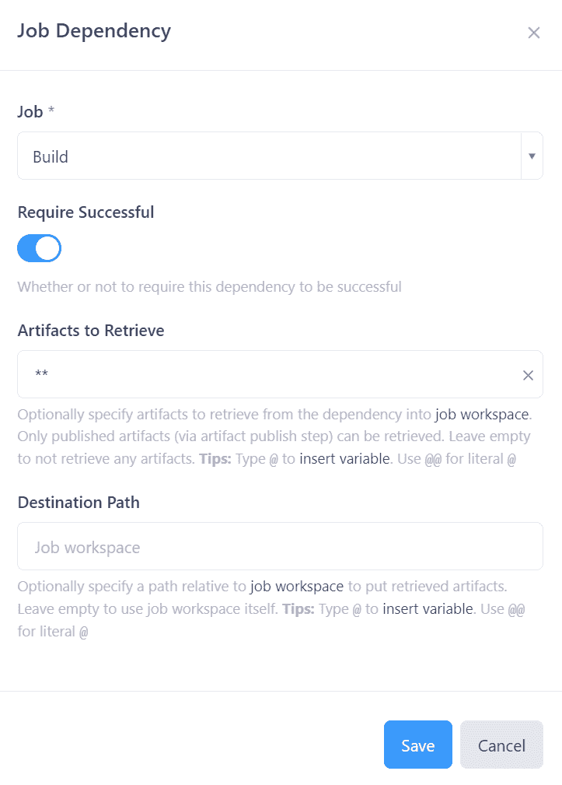

最后，您可以将所有其他选项保留为默认选项。

你的工作应该是这样的:

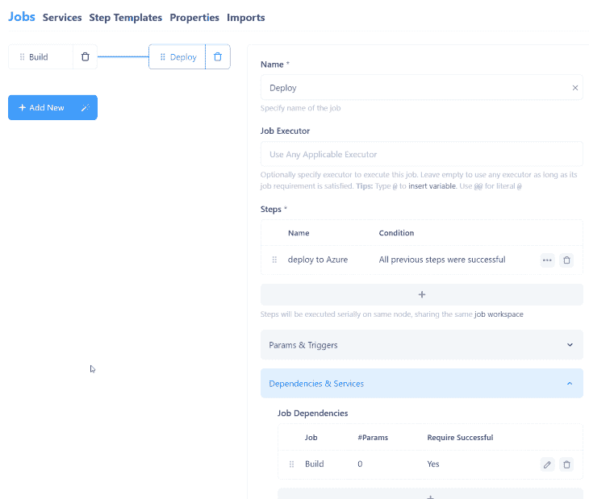

点击**保存**按钮提交对构建规范文件的更改。

因为您没有在部署作业上指定触发器，所以它还不会运行。要解决这个问题，重新打开构建规范编辑器并点击**构建**任务来编辑它。

在 **More Settings** 部分下，添加一个新的 Post Build 操作来运行部署作业，但是带有一个**条件**来限制它只对 Git 存储库的主分支进行修改。构建后操作应该如下所示:

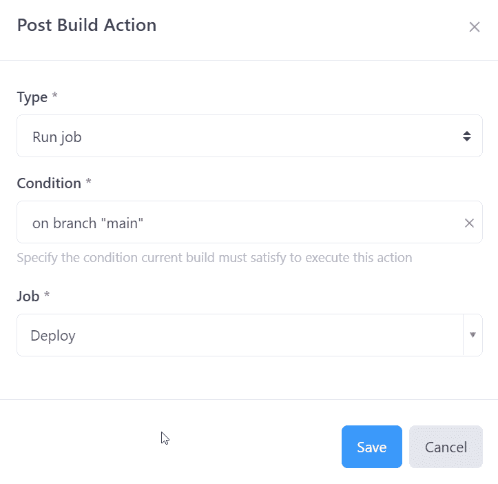

再次保存并提交对构建规范文件的更改。

几分钟后，您的构建和部署作业应该会成功完成。要查看作业输出，请单击左侧导航栏中的**构建**。要查看部署作业的输出，请在 build 列下单击其构建名称，在本例中为 **HelloOneDev#4** :

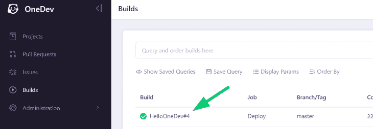

然后，向下滚动到**日志**选项卡的底部，查看指示 Azure 部署成功的输出:

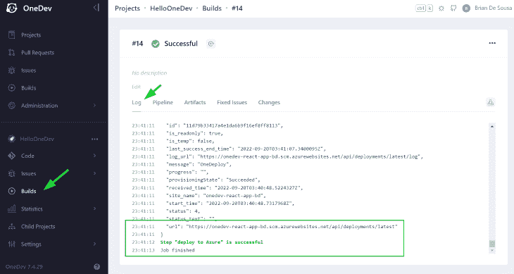

现在，您的 React 应用已经部署到 Azure 应用服务，您可以在浏览器中查看它。默认网站 URL 将是`[https://APPNAME.azurewebsites.net](https://APPNAME.azurewebsites.net)`，其中`APPNAME`是部署作业中使用的 Azure CLI 脚本的第 11 行的值。

当您准备好清理由部署作业创建的 Azure 资源时，在 Bash 窗口中运行以下 Azure CLI 命令:

```
az group delete -g $RESOURCEGROUPNAME --yes
az ad sp delete --id $APPID

```

## 下一步是什么？

可以对构建和部署工作进行大量的改进。例如，在部署作业中硬编码 Azure 服务主体密码意味着它将作为纯文本存储在 GitHub repo 的构建规范文件中。相反，您应该[创建一个作业秘密](https://code.onedev.io/projects/162/files/main/pages/build-spec-secret.md)来将密码安全地存储在项目设置中，并在构建规范文件中引用它。

在本文中，我们在 OneDev 中为 React web 应用程序设置了一个简单的构建、测试和部署工作流，但是还有更多的可能性。您可以将各种类型的步骤和作业组合在一起，形成更复杂的 CI/CD 工作流。

请务必查看 OneDev 在 [GitHub](https://github.com/theonedev/onedev) 或[公司网站](https://code.onedev.io/projects/162/files)上的官方文档，获取更多灵感。

## [LogRocket](https://lp.logrocket.com/blg/react-signup-general) :全面了解您的生产 React 应用

调试 React 应用程序可能很困难，尤其是当用户遇到难以重现的问题时。如果您对监视和跟踪 Redux 状态、自动显示 JavaScript 错误以及跟踪缓慢的网络请求和组件加载时间感兴趣，

[try LogRocket](https://lp.logrocket.com/blg/react-signup-general)

.

[ ](https://lp.logrocket.com/blg/react-signup-general) [](https://lp.logrocket.com/blg/react-signup-general) 

LogRocket 结合了会话回放、产品分析和错误跟踪，使软件团队能够创建理想的 web 和移动产品体验。这对你来说意味着什么？

LogRocket 不是猜测错误发生的原因，也不是要求用户提供截图和日志转储，而是让您回放问题，就像它们发生在您自己的浏览器中一样，以快速了解哪里出错了。

不再有嘈杂的警报。智能错误跟踪允许您对问题进行分类，然后从中学习。获得有影响的用户问题的通知，而不是误报。警报越少，有用的信号越多。

LogRocket Redux 中间件包为您的用户会话增加了一层额外的可见性。LogRocket 记录 Redux 存储中的所有操作和状态。

现代化您调试 React 应用的方式— [开始免费监控](https://lp.logrocket.com/blg/react-signup-general)。