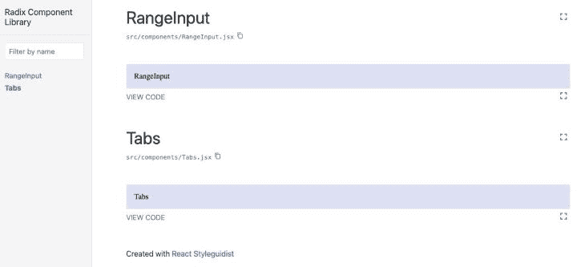
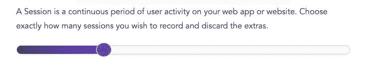
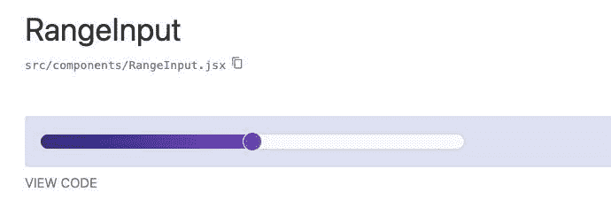
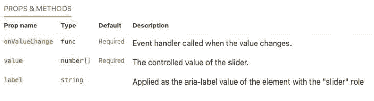
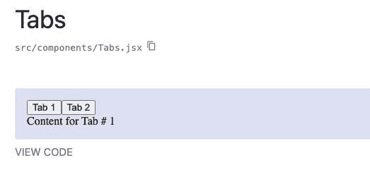
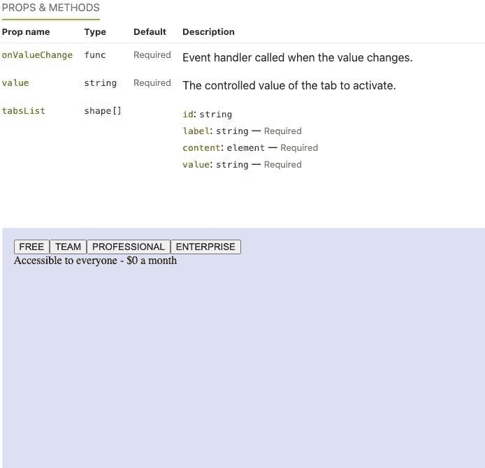
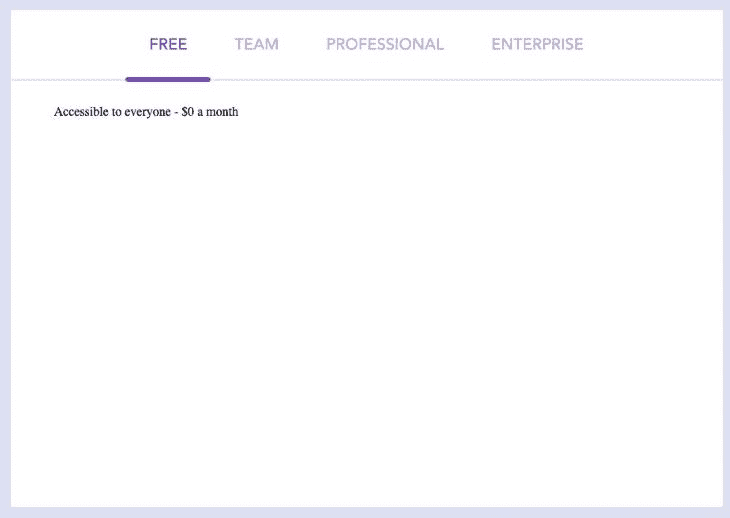

# 用 Radix 构建设计系统

> 原文：<https://blog.logrocket.com/building-design-system-radix/>

Radix 是一个开源库，为构建可访问的、高质量的 React web 应用程序和设计系统提供组件。Radix 是在前端空间创建的新一波无头组件的一部分，这种模式最近获得了很大的关注。

本指南旨在让你更深入地理解基数，以及如何用它来构建设计系统和组件库。本文的后半部分提供了关于使用基数原语构建示例组件库的深入教程。🎨

## 内容

## 基数概述

Radix 由一套三种产品组成:原语、颜色和图标。这些工具可以用来构建设计系统。让我们仔细看看每一个产品，以及如何单独或协同使用它们来满足您的需求。

### 基元

[Radix Primitives](https://www.radix-ui.com) 是该库的旗舰产品。它被描述为“用于在 React 中构建高质量设计系统和 web 应用程序的无样式、可访问的组件”的集合在构建通用组件模式时，基数原语处理许多棘手的部分，而不是重新发明轮子。

构建满足 [WAI-ARIA 标准](https://www.w3.org/WAI/ARIA/apg/patterns/)并适当处理键盘导航等方面的可访问小部件可能是一项巨大的任务。Radix 之类的库旨在通过提供一组灵活且可扩展的组件来简化这一通常对开发人员来说很困难的过程，这些组件是在考虑到可访问性和开发人员体验的情况下预先构建的。

### 颜色；色彩；色调

Radix Colors 是一个精心制作的颜色系统，专为构建出色的 web 应用而设计。它提供了额外的功能，比如自动黑暗模式兼容性，这使得切换到黑暗主题就像向容器应用一个类一样简单，能够[组成调色板](https://www.radix-ui.com/docs/colors/palette-composition/composing-a-palette)以与你的应用程序的品牌或主题配合工作，以及保证通过 WCAG 对比度要求的可访问性考虑。

Radix Colors 提供了一组比例，这些比例是 JavaScript 对象，旨在与您的首选样式解决方案集成，范围从普通 CSS 到 CSS-in-JS 选项(例如， [styled-components](https://styled-components.com) )。

### 核标准情报中心

[Radix Icons](https://icons.radix-ui.com/) 标榜自己是由 WorkOS 团队设计的一套 15×15 的“*清晰图标。*“所有图标都是单独的组件，可以通过一个软件包安装。

只需导入相应的图标，就可以像添加任何其他 React 组件一样将它们添加到您的应用程序中。基数图标也有其他形式，如可下载的 SVG，以及 Figma 和草图文件。

## 设计系统与组件库

我经常看到设计系统和组件库这两个术语互换使用。虽然这两个概念是相关的，但它们属于一个更大的整体的不同部分。

为了消除任何混淆，我将定义每个术语，指出两个相关术语之间的区别和差异。

### 设计系统

尼尔森诺曼集团(Nielsen Norman Group)是一家著名且值得信赖的 UX 研究和咨询公司，它将设计系统定义为“…一套标准，通过减少冗余来管理大规模设计，同时在不同页面和渠道之间创建共享语言和视觉一致性。”

典型的设计系统可能由以下三项组成:

1.  风格指南:一套产品或网站中元素外观和感觉的标准。最常见的风格指南与品牌设计有关，包括字体、版式、颜色和标志等元素
2.  模式库:通常包括旨在提供通用工作流模式的模板和布局结构；建立的模式意味着在整个应用程序中重用和调整
3.  组件库:有时也称为 UI 库或 UI 工具包

一些流行设计系统的例子包括谷歌的[材料设计](https://material.io/design/introduction)、T2 的【Atlassian】设计系统和 IBM 的[碳设计系统](https://carbondesignsystem.com/)。

### 组件库

一个[组件库由一组 UI 元素](https://blog.logrocket.com/top-11-react-ui-libraries-kits/)(即组件)组成，这些元素可以在整个应用程序中重用。这些组件实现了整个样式指南中建立的设计标准。

由于它们的可组合性，组件使得设计团队提供的线框更容易实现。库中常见的组件包括按钮和单个表单元素(例如，输入、复选框等)。)到更复杂的元素，比如日期选择器。

一些流行组件库的例子包括 [MUI](https://mui.com/core/) (艺术家[原名材料 UI](https://mui.com/blog/material-ui-is-now-mui/) )、Tailwind Labs 的[无头 UI](https://headlessui.com/) ，当然还有[根 UI](https://www.radix-ui.com/) 。

因为设计系统是一个庞大的实体，通常涉及不同领域的多个利益相关者，所以建立一个设计系统是一项艰巨的任务。为了让这篇文章易于理解，我们将构建一个组件库作为设计系统的子集。然而，值得注意的是 Radix 提供了一整套工具，为您提供构建成熟设计系统的资源。

## 安装和设置示例项目

UI 库中的文档是必不可少的，因为它提供了一个单一的位置，开发人员和设计人员都可以在这里查看设计系统中的组件列表。开发人员还可以将此文档用作沙盒环境，在沙盒环境中，他们可以测试处于多种状态的组件，并阅读可用于自定义单个组件的不同属性。

因为文档如此重要，我们的示例项目已经预先配置了 [React Styleguidist](https://react-styleguidist.js.org/) ，这是一个用于构建 React 组件的开发环境。我们将在构建组件时使用这个工具来记录组件。

要从 GitHub 克隆 [radix-component-library](https://github.com/Cool-Runningz/radix-component-library) 项目，打开您的终端并运行以下命令:

```
git clone https://github.com/Cool-Runningz/radix-component-library.git

```

接下来，将 cd 放入`radix-component-library`文件夹:

```
cd radix-component-library

```

安装在`package.json`文件中定义的项目依赖关系:

```
npm install

```

安装完成后，启动开发服务器:

```
npm run library

```

在浏览器中导航至 [http://localhost:3020/](http://localhost:3020/) 。您应该会看到以下屏幕:



既然项目已经启动并运行，我们可以开始将 Radix 合并到我们的组件库中了。

## 用基数构建范围输入组件

我们将构建的第一个组件是一个符合 [WAI-ARIA 滑块设计模式](https://www.w3.org/WAI/ARIA/apg/patterns/slider/)的范围输入。

创建一个跨浏览器具有一致外观的自定义范围输入可能是一项艰巨的任务。然而，Radix 通过提供一个 Slider 原语简化了这个过程。范围输入有时被称为滑块；在本文的其余部分，我将交替使用这些术语。

在 Radix 中，每个原语都可以单独安装，因此您可以增量地采用它们。原语也是独立版本化的，以进一步促进增量采用。这减少了代码库的膨胀，因为您只需要导入您需要的单个组件。

### 安装和样板文件

要构建一个范围输入组件，首先要安装[滑块原语](https://www.radix-ui.com/docs/primitives/components/slider):

```
npm install @radix-ui/react-slider

```

接下来，打开`RangeInput.jsx`文件，导入 Radix 原语，并为 slider 组件添加样板文件。此时，您的文件应该包括以下代码:

```
import React from 'react'
import PropTypes from "prop-types"
import "./RangeInput.css"
import * as SliderPrimitive from '@radix-ui/react-slider';

const RangeInput = (props) => {
    return (
        <SliderPrimitive.Root className="rootSlider" value={props.value}>
            <SliderPrimitive.Track className="trackSlider">
                <SliderPrimitive.Range className="rangeSlider" />
            </SliderPrimitive.Track>
            <SliderPrimitive.Thumb className="thumbSlider"  />
        </SliderPrimitive.Root>
    )
}
export default RangeInput

```

Radix 中的`Slider`组件由以下四个元素组成:

1.  [根](https://www.radix-ui.com/docs/primitives/components/slider#root):包含滑块的所有部分
2.  [轨道](https://www.radix-ui.com/docs/primitives/components/slider#track):包含`Slider.Range`的轨道
3.  [范围](https://www.radix-ui.com/docs/primitives/components/slider#range):必须包含在`Slider.Track`内的范围部分
4.  [拇指](https://www.radix-ui.com/docs/primitives/components/slider#thumb):可拖动的拇指

此时，如果您导航到[http://localhost:3020/# range input](http://localhost:3020/#rangeinput)，您会注意到 UI 是空的。这是因为基数组件默认不应用任何样式。

接下来，我们将完成向自定义组件添加 CSS 的过程。

### 设计组件的样式

Radix 对于如何设计组件的样式并不固执己见，它兼容各种 CSS 解决方案，为您提供对样式的完全控制。

使用普通的 ol' CSS，我们将样式化到`RangeInput`组件，以匹配在 [LogRocket 的定价页面](https://logrocket.com/pricing/)的“估算您的成本-专业”部分找到的组件:



#### `Root`

`Root`包含滑块的所有部分，它将为每个拇指呈现一个`input`。

在`RangeInput.css`中创建一个`.rootSlider`类，并添加以下代码:

```
 .rootSlider {
    display: flex;
    align-items: center;
    position: relative;
    height: 1.5rem;
    max-width: 30rem;
}

```

#### `Track`

`Track`包含`Slider.Range`并且是滑块的一部分，拇指沿着它移动。

在`RangeInput.css`中创建一个`.trackSlider`类，并添加以下代码:

```
.trackSlider {
    background-color: #fafafa;
    border: 1px solid #d3d3d3;
    position: relative;
    flex-grow: 1;
    border-radius: 10px;
    height: 1rem;
}

```

#### `Range`

`Range`必须位于`Slider.Track`内，并代表所选值的范围。

在`RangeInput.css`中创建一个`.rangeSlider`类，并添加以下代码:

```
.rangeSlider {
    position: absolute;
    background: linear-gradient(90deg,#252678,#764abc);
    height: 100%;
    border-radius: 10px;
}

```

#### `Thumb`

`Thumb`是轨道上的元素，用户可以移动它来选择不同的范围值。

在`RangeInput.css`中创建一个`.thumbSlider`类，并添加以下代码:

```
.thumbSlider {
    display: block;
    width: 20px;
    height: 20px;
    background-color: #764abc;
    border-radius: 30px;
    border: 1px solid #d9d9d9;
}

.thumbSlider:hover {
    cursor: pointer;
}

.thumbSlider:focus {
    outline: 1px solid white;
}

```

应用了所有这些样式后，如果您导航回[http://localhost:3020/# range input](http://localhost:3020/#rangeinput)，您应该会看到以下呈现的内容:



### 添加道具

构建`RangeInput`组件的最后一步是将它配置为能够接受道具，这反过来将使它更具可重用性和可定制性。对于本例，我们将添加三个道具:

1.  `label`:作为 [`slider`角色](https://developer.mozilla.org/en-US/docs/Web/Accessibility/ARIA/Roles/slider_role)的元素的 [aria-label](https://developer.mozilla.org/en-US/docs/Web/Accessibility/ARIA/Attributes/aria-label) 值应用
2.  `value`:表示滑块的控制值，必须配合`onValueChange`使用
3.  `onValueChange`:值改变时调用的事件处理程序

基数成分可以是[控制的](https://reactjs.org/docs/forms.html#controlled-components)或[不控制的](https://reactjs.org/docs/uncontrolled-components.html)。添加`value`和`onValueChange`道具会将`RangeInput`变成受控组件。

在沙盒环境中呈现`RangeInput`的 markdown 文件已经被预先配置为传入 props。现在我们需要更新组件来处理这些道具。

首先，我们需要用 PropTypes 添加[类型检查。](https://reactjs.org/docs/typechecking-with-proptypes.html)[道具类型](https://www.npmjs.com/package/prop-types)库已经在`RangeInput.jsx`顶部附近导入，所以现在你可以在文件底部添加`propTypes`定义，如下所示:

```
RangeInput.propTypes = {
    /** Applied as the aria-label value of the element with the "slider" role  */
    label: PropTypes.string.isRequired,
    /** The controlled value of the slider. */
    value: PropTypes.arrayOf(PropTypes.number).isRequired,
    /** Event handler called when the value changes. */
    onValueChange: PropTypes.func.isRequired
}

```

当`propTypes`出现时，React Styleguidist 将从对象的声明中选取属性，并在表格中显示它们。现在，任何看到这个例子的人都会知道正确实现这个组件所需要的确切道具。



接下来，我们希望更新`RangeInput.jsx`中的 JSX，以便能够将道具传递给`RangeInput`组件。`value`和`onValueChange`道具需要应用到`SliderPrimitive.Root`元素，而`label`道具需要应用到`SliderPrimitive.Thumb`元素。

有了这些更新，`RangeInput.jsx`文件现在应该包含以下代码:

```
import React from 'react'
import PropTypes from "prop-types"
import "./RangeInput.css"
import * as SliderPrimitive from '@radix-ui/react-slider';

const RangeInput = (props) => {
    return (
        <SliderPrimitive.Root className="rootSlider" 
           value={props.value} onValueChange={props.onValueChange}>
            <SliderPrimitive.Track className="trackSlider">
                <SliderPrimitive.Range className="rangeSlider" />
            </SliderPrimitive.Track>
            <SliderPrimitive.Thumb className="thumbSlider" aria-label={props.label} 
            />
        </SliderPrimitive.Root>
    )
}
export default RangeInput

RangeInput.propTypes = {
    /** Applied as the aria-label value of the element with the "slider" role  */
    label: PropTypes.string.isRequired,
    /** The controlled value of the slider. */
    value: PropTypes.arrayOf(PropTypes.number).isRequired,
    /** Event handler called when the value changes. */
    onValueChange: PropTypes.func.isRequired
}

```

瞧啊。

通过最少的代码，我们能够利用[基数滑块](https://www.radix-ui.com/docs/primitives/components/slider)来创建一个可访问的功能性`RangeInput`组件，其样式与 LogRocket 主题相匹配。

接下来，我们将演示如何为我们的 UI 库再实现一个组件。

## 用基数构建标签组件

我们将构建的第二个组件是一个 Tabs 元素，它利用了 [Radix Tabs 原语](https://www.radix-ui.com/docs/primitives/components/tabs)。该组件的构建遵循了 [WAI-ARIA 标签设计模式](https://www.w3.org/WAI/ARIA/apg/patterns/tabpanel/)。

### 安装和样板文件

首先，安装 Tabs 原语:

```
npm install @radix-ui/react-tabs

```

接下来，打开`Tabs.jsx`文件，导入 Radix 原语，并为`Tabs`组件添加样板文件。

您的文件应该包含以下代码:

```
import React from 'react'
import PropTypes from "prop-types"
import "./Tabs.css"

import * as TabsPrimitive from "@radix-ui/react-tabs";

const Tabs = (props) => {
    return (
        <TabsPrimitive.Root>
            <TabsPrimitive.List>
                <TabsPrimitive.Trigger value="tab1">Tab 1</TabsPrimitive.Trigger>
                <TabsPrimitive.Trigger value="tab2">Tab 2</TabsPrimitive.Trigger>
            </TabsPrimitive.List>
            <TabsPrimitive.Content value="tab1">
                Content for Tab # 1
            </TabsPrimitive.Content>
            <TabsPrimitive.Content value="tab2">
                Content for Tab # 2
            </TabsPrimitive.Content>
        </TabsPrimitive.Root>
    )
}

export default Tabs

```

基数`Tabs`组件的结构由以下四个元素组成:

1.  [根](https://www.radix-ui.com/docs/primitives/components/tabs#root):包含所有`Tabs`组成部分
2.  [列表](https://www.radix-ui.com/docs/primitives/components/tabs#list):包含沿活动内容边缘对齐的触发器
3.  [触发器](https://www.radix-ui.com/docs/primitives/components/tabs#trigger):激活其关联内容的按钮
4.  [内容](https://www.radix-ui.com/docs/primitives/components/tabs#content):包含与每个触发器相关的内容

如果您导航到[http://localhost:3020/# tabs](http://localhost:3020/#tabs)，组件的默认版本应该显示如下:



### 添加道具

接下来，我们需要配置`Tabs`组件来接受道具。对于本例，我们将添加三个道具:

1.  `tabsList`:要显示的标签阵列
2.  `value`:要激活的页签的控制值；这应与`onValueChange`结合使用
3.  `onValueChange`:值改变时调用的事件处理程序

目前，`Tabs`组件只显示固定数量的带有硬编码值的选项卡。为了使组件更加灵活，以便可以呈现任意数量的选项卡，我们将使用以下代码更新`Tabs.jsx`中的 JSX:

```
import React from 'react'
import PropTypes from "prop-types"
import "./Tabs.css"
import * as TabsPrimitive from "@radix-ui/react-tabs";

const Tabs = (props) => {
    return (
        <TabsPrimitive.Root
            className="rootTabs"
            value={props.value}
            onValueChange={props.onValueChange}
        >
            <TabsPrimitive.List className="listTabs">
                {props.tabsList.map((tab) => {
                    return (
                        <TabsPrimitive.Trigger className="triggerTabs"
                            key={tab.id || `${index}-${tab.value}`}
                            value={tab.value}
                        >
                            {tab.label}
                        </TabsPrimitive.Trigger>);
                })}
            </TabsPrimitive.List>
            {props.tabsList.map((tab) => {
                return (
                    <TabsPrimitive.Content className="contentTabs"
                        key={tab.id || `${index}-${tab.value}`} 
                         value={tab.value}
                    >
                        {tab.content}
                    </TabsPrimitive.Content>
                );
            })}
        </TabsPrimitive.Root>
    )
}

export default Tabs

Tabs.propTypes = {
    tabsList: PropTypes.arrayOf(
        PropTypes.shape({
            id: PropTypes.string,
            label: PropTypes.string.isRequired,
            content: PropTypes.element.isRequired,
            value: PropTypes.string.isRequired
        })
    ),
    /** The controlled value of the tab to activate. */
    value: PropTypes.string.isRequired,
    /** Event handler called when the value changes. */
    onValueChange: PropTypes.func.isRequired
}

```

[Tabs.md](https://github.com/Cool-Runningz/radix-component-library/blob/main/src/components/Tabs.md) 已经被预先配置为向`tabsList`道具传递一组项目。当我们导航到[http://localhost:3020/# tabs](http://localhost:3020/#tabs)时，我们应该看到以下内容:



### 设计组件的样式

与前面的组件类似，我们将使用普通的 CSS 样式化`Tabs`组件，以匹配在 [LogRocket 的定价页面](https://logrocket.com/pricing/)的“估算你的成本”部分找到的组件:


#### `Root`

`Root`包含了选项卡组件中包含的所有元素。

在`Tabs.css`中创建一个`.rootTabs`类，并添加以下代码:

```
.rootTabs {
  background-color: white;
}

```

#### `List`

`List`包含所有的`Trigger`元素。

在`Tabs.css`中创建一个`.listTabs`类，并添加以下代码:

```
.listTabs {
    align-items: center;
    display: flex;
    justify-content: center;
    margin: 0 auto;
    width: 85%;
}

```

#### `Trigger`

`Trigger`是控制显示所选选项卡内容的按钮。

在`Tabs.css`中创建一个`.triggerTabs`类，并添加以下代码:

```
.triggerTabs {
    color: #764abc;
    font-family: "Avenir";
    background: none;
    border: none;
    display: block;
    cursor: pointer;
    font-size: 20px;
    font-weight: 500;
    opacity: 0.5;
    padding: 30px;
    position: relative;
}

.triggerTabs[data-state="active"] {
    opacity: 1;
}

.triggerTabs[data-state="active"]::after {
    background-color: #764abc;
    border-radius: 12px;
    bottom: -4px;
    content: "";
    height: 6px;
    left: 0;
    position: absolute;
    width: 100%;
}

```

#### `Content`

`Content`包含与每个选项卡相关的内容。

在`Tabs.css`中创建一个`.contentTabs`类，并添加以下 CSS:

```
.contentTabs {
   border-top: 3px solid hsla(0, 0%, 44%, 0.15);
   padding: 30px 55px;
}

```

应用了所有这些样式后，如果您导航回[http://localhost:3020/# tabs](http://localhost:3020/#tabs)，您现在应该会看到以下呈现的内容:



这就完成了第二个例子，并展示了如何利用 [Radix Tabs 原语](https://www.radix-ui.com/docs/primitives/components/tabs)来快速构建一个功能强大且可访问的`Tabs`组件，该组件的样式与 LogRocket 主题相匹配。

## 结论

在本文中，我们研究了 Radix，并讨论了如何使用它的产品套件来创建设计系统。通过增量构建，我们使用基数原语开发了一个基本的 React 组件库，作为设计系统的子集。

开发定制组件可能会很棘手，合并可访问性和键盘导航等功能会成倍增加复杂性，这进一步验证了利用 Radix 等旨在简化这一过程的工具的好处。

本文中开发的组件库可以在我的 [GitHub](https://github.com/Cool-Runningz/radix-component-library) 中找到。此外，你可以[在这里](https://radix-ui-library.netlify.app)查看最终项目的部署版本。

感谢您的阅读，祝您编码愉快！

## 使用 [LogRocket](https://lp.logrocket.com/blg/signup) 消除传统错误报告的干扰

[](https://lp.logrocket.com/blg/signup)

[LogRocket](https://lp.logrocket.com/blg/signup) 是一个数字体验分析解决方案，它可以保护您免受数百个假阳性错误警报的影响，只针对几个真正重要的项目。LogRocket 会告诉您应用程序中实际影响用户的最具影响力的 bug 和 UX 问题。

然后，使用具有深层技术遥测的会话重放来确切地查看用户看到了什么以及是什么导致了问题，就像你在他们身后看一样。

LogRocket 自动聚合客户端错误、JS 异常、前端性能指标和用户交互。然后 LogRocket 使用机器学习来告诉你哪些问题正在影响大多数用户，并提供你需要修复它的上下文。

关注重要的 bug—[今天就试试 LogRocket】。](https://lp.logrocket.com/blg/signup-issue-free)