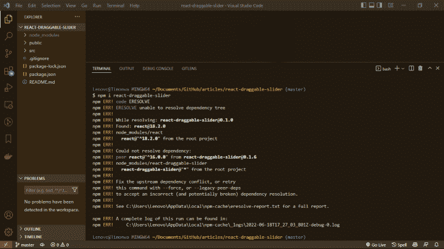

# 在 React 中构建可拖动滑块

> 原文：<https://blog.logrocket.com/building-draggable-slider-react/>

网站滑块是灵活的用户界面元素，有助于共享多个图像或有效地传递信息，而不会浪费主页上的宝贵空间。

在本文中，我们将演示如何使用 [react-draggable-slider](https://www.npmjs.com/package/react-draggable-slider/v/0.1.4) 包在 react 中构建具有可拖动功能的滑块。

*向前跳转:*

## 什么是滑块？

网站滑块是显示一系列图像或项目的幻灯片显示，这些图像或项目在单个空间内水平或垂直排列。图像在定义的时间段内单独显示，在从一个图像或项目到下一个图像或项目的变化之间具有过渡效果。

用户可以使用一组导航控件在滑块图像中导航，并且图像或项目也可以循环通过。滑块可以帮助网站以视觉上吸引人的方式展示单个项目，同时节省屏幕空间。

展示客户评价的网站滑块有利于与新的潜在客户建立信任和可信度。滑块也可用于显示不同的服务产品或展示产品的多个图像，以便潜在客户可以从不同角度对其进行可视化。

对于滚动内容的长页面来说，这种类型的 UI 元素是一个很有吸引力的选项。使用滑块，您可以将信息集中在一个地方，为每个项目之间的循环设置舒适的速度，甚至可以添加自动播放功能。

## 什么是可拖动滑块？

手动导航可拖动的滑块；用户通过按住并向左或向右拖动当前视图中的项目来从一个项目导航到下一个项目。为了查看下一个项目，用户按住当前项目并将其向左拖动。同样，为了查看前一项，用户按住当前项并向右拖动。

## 什么是 react-draggable-slider？

要在 React 中创建一个可拖动的滑块，我们可以从头开始构建或者使用 React 包。

使用 React 包可能会提高您的生产率，因为它会减少您花在编写代码上的时间。然而，这确实意味着您的代码库将依赖于(并且可能容易受到)这个包。这就是为什么最好选择一个开放源码包，有一个大的社区为它做出贡献，发现、报告和修复 bug，从而保持代码安全。

对于本文，我们将使用 react-draggable-slider 包。这个软件包易于使用，并带有内置的悬停效果。

## React 可拖动滑块演示

为了演示在 React 中构建可拖动的滑块，我们将设置一个 React 应用程序，安装 react-draggable-slider 包，然后创建滑块并定义滑块设置。

我们开始吧！

### 创建 React 应用程序

使用以下命令创建一个 React 应用程序，并将其命名为`react-draggable-slider`:

```
npx create-react-app react-draggable-slider
```

现在，在你选择的代码编辑器中打开应用程序。在这个演示中，我将使用 VS 代码。

### 安装 react-draggable-slider 包

在撰写本文时，react-draggable-slider 包与 react v18 不兼容，React v 18 是我们在创建 React 应用程序时将获得的 React 版本。

因此，如果我们现在尝试使用命令:`npm i react-draggable-slider`安装 slider 包，它将不会被安装，我们将在终端中得到一个依赖冲突错误，如下所示:



作为解决方法，我们需要将 React 应用中的`react`包和`react-dom`包的版本降级到 v16，以便与 react-draggable-slider 包兼容。

在创建应用程序时，没有办法指定所需的 React 版本，这就是为什么我们需要在降级版本之前创建应用程序。

首先，导航到`package.json`文件，将`react`包和`react-dom`包的版本从 v18.1.0 更改为 v16.13.1

接下来，在终端中运行命令:`npm install`。这将自动用我们在`package.json`文件中指定的新版本替换我们`node_modules`文件夹中的当前版本。

现在我们准备安装滑块包:

```
npm i react-draggable-slider

```

此时，我们应该不会在终端中看到任何错误。要在浏览器中查看应用程序，请使用以下命令之一运行 React 应用程序:

```
npm start
yarn start

```

你会注意到在浏览器中有一个新的错误，关于`react-dom/client` React 模块没有被找到。发生这个错误是因为我们正在使用 React v16。


为了解决这个错误，我们需要通过改变模块的文件路径来修改我们的`index.js`文件。

导航到`index.js`文件，并更改`ReactDom`导入的文件路径:

```
import ReactDOM from 'react-dom/client';
```

收件人:

```
import ReactDOM from 'react-dom';
```

接下来，我们需要调整将 React 应用程序呈现给 DOM 的方式。为此，将用于呈现 React 应用程序的代码从:

```
const root = ReactDOM.createRoot(document.getElementById("root"));
root.render(
  <React.StrictMode>
    <App />
  </React.StrictMode>
);
```

收件人:

```
ReactDOM.render(
  <React.StrictMode>
    <App />
  </React.StrictMode>,
  document.getElementById("root")
);
```

现在，返回并在浏览器中查看应用程序。您应该会看到应用程序的内容，没有任何错误:


好了，我们已经创建了我们的应用程序；现在是时候创建我们的可拖动滑块了。

### 创建滑块

要构建滑块，进入`App.js`文件并删除当前的`jsx`元素(即`Header`，因为它不再需要。我们将用从`react-draggable-slider`导入的`Slider`组件替换这个元素。我们还将把一个`sliderSettings`对象作为道具传递给我们稍后将创建的`Slider`组件。

```
import Slider from "react-draggable-slider";

…

<div className="App">
     <Slider sliderSettings={sliderSettings} />
</div>
```

接下来，我们将创建一个名为`projectList`的对象数组。我们将使用这个数组来存储将在滑块中的每张幻灯片上显示的项目。

```
const projectList = [
    {
      title: "Nature's Life",
      image: project1,
      description:
        "Praesent quis congue nisi. Vivamus dapibus suscipit magna at imperdiet. Mauris consectetur pharetra metus eu suscipit. Maecenas augue tortor, consequat vitae lacus id, pharetra tempor mauris. Suspendisse sodales commodo erat, non imperdiet nisl scelerisque at. Nulla porttitor gravida diam, in ornare ipsum accumsan bibendum. Morbi ut ante metus. "
    },
    {
      title: "Into The Waters",
      image: project2,
      description:
        "Duis at tellus vitae velit aliquet varius. Fusce luctus libero et ligula tristique lobortis. Vestibulum eu placerat risus, eu semper augue. Integer at purus sit amet elit pretium viverra. Suspendisse id fringilla nibh, nec dictum urna. Class aptent taciti sociosqu ad litora torquent per conubia nostra, per inceptos himenaeos. "
    },
    {
      title: "Higher Than The Stars",
      image: project3,
      description:
        "Praesent quis congue nisi. Vivamus dapibus suscipit magna at imperdiet. Maecenas augue tortor, consequat vitae lacus id, pharetra tempor mauris. Suspendisse sodales commodo erat, non imperdiet nisl scelerisque at. Nulla porttitor gravida diam, in ornare ipsum accumsan bibendum. Morbi ut ante metus. Proin rhoncus magna lectus, nec consequat augue ultricies eu."
    },
    {
      title: "Miniature Wonders",
      image: project4,
      description:
        "Praesent quis congue nisi. Vivamus dapibus suscipit magna at imperdiet. Mauris consectetur pharetra metus eu suscipit. Maecenas augue tortor, consequat vitae lacus id, pharetra tempor mauris. Suspendisse sodales commodo erat, non imperdiet nisl scelerisque at. Nulla porttitor gravida diam, in ornare ipsum accumsan bibendum. Morbi ut ante metus. "
    },
    {
      title: "Giants Of History",
      image: project5,
      description:
        "Duis at tellus vitae velit aliquet varius. Fusce luctus libero et ligula tristique lobortis. Vestibulum eu placerat risus, eu semper augue. Integer at purus sit amet elit pretium viverra. Suspendisse id fringilla nibh, nec dictum urna. Class aptent taciti sociosqu ad litora torquent per conubia nostra, per inceptos himenaeos. "
    }
  ];

```

### 定义滑块设置

现在，我们将定义我们的滑块设置；这些将被传递到我们的滑块来配置它的行为。

我们首先创建一个名为`sliderSettings` 的对象，它有以下属性:`data`、`speed`、`easing`、`showButton`、`buttonText`、`buttunHref`和`buttonTarget`。这些道具定义了滑块的行为和显示方式。

#### 数据

属性接受一个数组。对象数组表示滑块中将显示的项目或幻灯片的详细信息；在我们的例子中，`projectList`。每个对象接受三个键值对:`title`、`image`和`description`。默认情况下，`data`属性被设置为空数组`[].`

#### 速度

属性接受一个整数。它决定了滑块拖动到下一个或上一个项目时的前进速度(以毫秒为单位)。例如，3000 的`speed`值等于 3 秒。默认的`speed`属性值是 500 毫秒。

#### 松开

属性接受一个字符串。有四个可用的 [GSAP](https://greensock.com/gsap/) 季节用于动画滑动:力量，背部，弹性和博览会。每一个都试试，然后选一个你最喜欢的。如果没有指定值，`easing`属性值将默认为浏览器的默认值`ease`。

#### 背景颜色

属性接受一个字符串。它设置整个滑块的背景颜色，并接受十六进制和 RGB(A)值。比如`#ffffff`或者`rgba(255, 255, 255, 0.05)`。`bgColor`道具的默认值是`rgba(255, 255, 255, 0.05)`。

#### 显示按钮

属性接受一个布尔值。如果设置为`true`，将为每个项目或幻灯片显示一个按钮；但是，如果`showButton`道具设置为`false`，则不会显示任何按钮。默认情况下，`showButton`属性值设置为`true`。

#### buttonText

属性接受一个字符串。它表示将在每个项目的按钮内显示的文本。默认情况下，该值设置为`View case study`。

#### 按钮 href

属性接受一个字符串。这个字符串是一个`href`属性，允许滑块中的每个项目链接到另一个页面，使用户能够查看关于该项目的更多细节。默认情况下，`buttonHref`的属性值设置为#。

#### buttonTarget

属性接受一个字符串。当用户点击一个按钮时，这个属性指定链接应该在当前页面还是在另一个页面打开。该值可以是`_self`或`_blank`。默认情况下，`buttonTarget`属性值设置为`_blank`。

让我们从只传入`data`道具开始，看看我们的滑块会是什么样子。

```
const sliderSettings = {
    data: projectList,
  };
```

如果我们在浏览器中查看我们的滑块，我们可以看到它有默认的 react-draggable-slider 属性，如前所述。现在，让我们用我们喜欢的价值观来传递我们剩下的道具。因为我们没有为`easing`属性指定一个值，所以它将默认为`ease`。

```
const sliderSettings = {
    data: projectList,
    speed: 3000,
    bgColor: "#070707",
    showButton: true,
    buttonText: "View projects",
    buttonHref: "https://www.example.com",
    buttonTarget: "_self"
  };
```

我们还将在我们的`styles.css`文件中为我们的 body 和 anchor 标签编写一些样式，这也是我们的动作按钮调用，然后将该文件导入到我们的`App.js`文件中。

```
body {
  font-family: sans-serif;
  text-align: center;
  background-color: #070707;
  color: #fff;
}
a:link,
a:hover,
a:active,
a:visited {
  color: #eee;
  border-top: 1px solid #434141;
  border-bottom: 3px solid #434141;
  border-radius: 20px;
}
```

此时，我们的`App.js`文件应该是这样的:

```
import React from "react";
import Slider from "react-draggable-slider";
import "./styles.css";
import project1 from "./imgs/bibi-pace-Hi4fWKU2KSk-unsplash.jpg";
import project2 from "./imgs/scott-webb-e3dY8laAQtA-unsplash.jpg";
import project3 from "./imgs/alexander-andrews-fsH1KjbdjE8-unsplash.jpg";
import project4 from "./imgs/daan-mooij-RyxShs7mG8E-unsplash.jpg";
import project5 from "./imgs/damien-santos-M5rim8Yh4LY-unsplash.jpg";

export default function App() {
  const projectList = [
    {
      title: "Nature's Life",
      image: project1,
      description:
        "Praesent quis congue nisi. Vivamus dapibus suscipit magna at imperdiet. Mauris consectetur pharetra metus eu suscipit. Maecenas augue tortor, consequat vitae lacus id, pharetra tempor mauris. Suspendisse sodales commodo erat, non imperdiet nisl scelerisque at. Nulla porttitor gravida diam, in ornare ipsum accumsan bibendum. Morbi ut ante metus. "
    },
    {
      title: "Into The Waters",
      image: project2,
      description:
        "Duis at tellus vitae velit aliquet varius. Fusce luctus libero et ligula tristique lobortis. Vestibulum eu placerat risus, eu semper augue. Integer at purus sit amet elit pretium viverra. Suspendisse id fringilla nibh, nec dictum urna. Class aptent taciti sociosqu ad litora torquent per conubia nostra, per inceptos himenaeos. "
    },
    {
      title: "Higher Than The Stars",
      image: project3,
      description:
        "Praesent quis congue nisi. Vivamus dapibus suscipit magna at imperdiet. Maecenas augue tortor, consequat vitae lacus id, pharetra tempor mauris. Suspendisse sodales commodo erat, non imperdiet nisl scelerisque at. Nulla porttitor gravida diam, in ornare ipsum accumsan bibendum. Morbi ut ante metus. Proin rhoncus magna lectus, nec consequat augue ultricies eu."
    },
    {
      title: "Miniature Wonders",
      image: project4,
      description:
        "Praesent quis congue nisi. Vivamus dapibus suscipit magna at imperdiet. Mauris consectetur pharetra metus eu suscipit. Maecenas augue tortor, consequat vitae lacus id, pharetra tempor mauris. Suspendisse sodales commodo erat, non imperdiet nisl scelerisque at. Nulla porttitor gravida diam, in ornare ipsum accumsan bibendum. Morbi ut ante metus. "
    },
    {
      title: "Giants Of History",
      image: project5,
      description:
        "Duis at tellus vitae velit aliquet varius. Fusce luctus libero et ligula tristique lobortis. Vestibulum eu placerat risus, eu semper augue. Integer at purus sit amet elit pretium viverra. Suspendisse id fringilla nibh, nec dictum urna. Class aptent taciti sociosqu ad litora torquent per conubia nostra, per inceptos himenaeos. "
    }
  ];

  const sliderSettings = {
    data: projectList,
    speed: 3000,
    easing: "ease",
    bgColor: "#070707",
    showButton: true,
    buttonText: "View projects",
    buttonHref: "https://www.example.com",
    buttonTarget: "_self"
  };

  return (
    <div className="App">
      <Slider sliderSettings={sliderSettings} />
    </div>
  );
}
```

这是带有新 CSS 样式的滑块:

你会注意到我们已经改变了文本颜色，以及页面和滑块的背景颜色。我们还设计了按钮的样式并更改了它的文本值。如果我们使用`power` GSAP `easings`来制作滑动动画，滑动动画看起来会像这样:

你可以自己尝试其他`easing`道具选项，选择你最喜欢的一个，也可以尝试其他道具值。

您还会注意到，当光标移动到图像卡上时，图像卡有很好的悬停效果。这是 react-draggable-slider 一个很酷的内置特性。

## 结论

在本教程中，我们展示了使用 react-draggable-slider 包在 React 中创建一个可拖动的滑块是多么容易。我们演示了如何补偿 React 最新版本的兼容性问题。我们还展示了如何修改 react-draggable-slider 的默认设置来定制滑块的样式和动画。

随意查看和使用代码[在这里](https://codesandbox.io/s/react-draggable-slider-f9391j)。你可能也想[看看另一个 React 滑块工具 Swiper](https://blog.logrocket.com/building-modern-sliders-html-css-swiper/) ，它也是一个非常酷的包。

## 使用 LogRocket 消除传统反应错误报告的噪音

[LogRocket](https://lp.logrocket.com/blg/react-signup-issue-free)

是一款 React analytics 解决方案，可保护您免受数百个误报错误警报的影响，只针对少数真正重要的项目。LogRocket 告诉您 React 应用程序中实际影响用户的最具影响力的 bug 和 UX 问题。

[ ](https://lp.logrocket.com/blg/react-signup-general) [  ](https://lp.logrocket.com/blg/react-signup-general) [LogRocket](https://lp.logrocket.com/blg/react-signup-issue-free)

自动聚合客户端错误、反应错误边界、还原状态、缓慢的组件加载时间、JS 异常、前端性能指标和用户交互。然后，LogRocket 使用机器学习来通知您影响大多数用户的最具影响力的问题，并提供您修复它所需的上下文。

关注重要的 React bug—[今天就试试 LogRocket】。](https://lp.logrocket.com/blg/react-signup-issue-free)