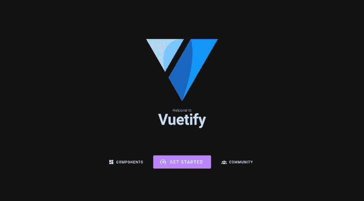
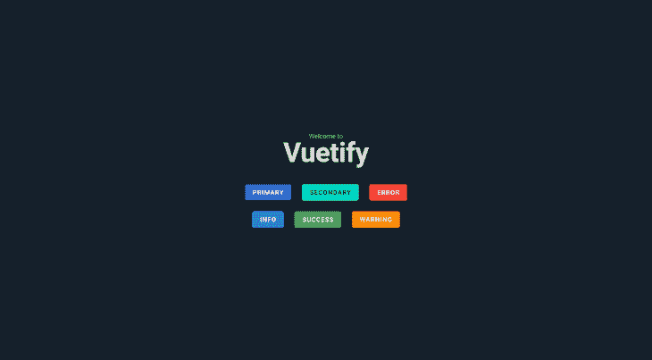
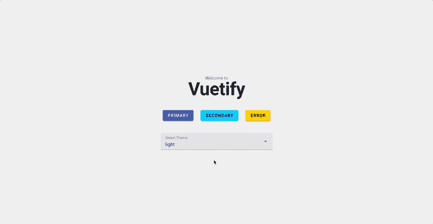

# 为 Vue.js 应用程序构建动态 Vue 化主题

> 原文：<https://blog.logrocket.com/building-dynamic-vuetify-themes/>

在这篇文章中，我们将看看如何使用 Vuetify 颜色主题。我们将介绍如何向 Vue.js 应用程序添加 Vuetify，如何创建自定义主题，以及如何在它们之间动态切换。

向前跳:

## 为什么要对 Vue.js 应用使用 Vue 化主题？

Vuetify 是使用最广泛的 CSS 库之一，[目前最流行的 Vue.js 的材质设计组件库](https://github.com/topics/vue-material)，截止到本文撰写时，这个 Vue 组件框架在 GitHub 上已经有[超过 36k 颗星。](https://github.com/vuetifyjs/vuetify)

除了丰富的组件和图标库，Vuetify 还提供了许多其他特性。其中一个功能是能够以最小的努力动态切换应用程序的颜色主题。这[使得 Vuetify 成为开发人员设计响应迅速、灵活、可扩展的应用的绝佳选择](https://blog.logrocket.com/getting-started-is-vuetify-right-for-you/)。

## 将 Vuetify 添加到 Vue.js 应用程序

让我们从创建一个新的 Vue 应用程序和配置 Vuetify 开始。下面我们将探讨两种不同的方法:推荐使用 Vite 的方法，以及使用 Vue CLI 的替代方法。

### 使用 Vite 创建项目(推荐)

开始创建新的 Vue 和 Vue 化项目的最简单方法是通过下面的命令。[该命令使用 Vite](https://blog.logrocket.com/getting-started-with-vite/) 来搭建新的 Vue 3 应用程序，并在应用程序上安装最新版本的 Vuetify:

```
npx create-vuetify my-app
# OR
yarn create vuetify my-app
```

运行此命令将提示您几个问题，例如您是否希望向您的应用程序添加 TypeScript 支持，您的首选包管理器，等等。

根据您的喜好做出适当的选择。完成后，您现在可以使用以下命令运行您的应用程序:

```
npm run dev
# OR
yarn dev
```

### 使用 Vue CLI 创建项目

另一种选择是使用传统的 Vue CLI 工具。但是，不建议这样做，因为 Vue CLI 当前处于维护模式。

首先，确保 Vue CLI 已在全球范围内安装。然后，运行以下命令创建一个新的应用程序:

```
vue create my-app
```

与 Vite 命令类似，运行该命令将提示您根据自己的喜好进行一些选择。之后，您可以使用以下命令添加 Vuetify:

```
vue add vuetify
```

运行此命令时，还会提示您选择要安装的首选 Vuetify 版本。然后，您可以使用以下命令运行您的应用程序:

```
npm run serve
# OR
yarn serve
```

使用上面提到的两种方法中的任何一种都会为您的应用程序生成必要的支架——具体来说，就是在`/src`文件夹中生成一个新的`plugin/vuetify.js`文件。这个文件包含用 Vue 初始化 Vuetify 的代码，以及我们将来要做的任何主题配置。

对于更多选项，[官方安装页面](https://next.vuetifyjs.com/en/getting-started/installation/)包括如何手动以及通过 CDN 配置 Vuetify 的说明。

## 验证主题配置

Vuetify 预装了两个主题— [一个浅色主题和一个深色主题](https://blog.logrocket.com/which-ui-libraries-support-dark-mode/)。默认情况下，当您运行您的应用程序时，它将在 light 主题中呈现。但是，您可以通过编辑 Vuetify 插件配置文件中的`defaultTheme`选项来更改此设置。

例如，要设置一个默认的深色主题，我们可以像这样修改`defaultTheme`选项:

```
// src/plugins/vuetify.js

import "@mdi/font/css/materialdesignicons.css";
import "vuetify/styles";

import { createVuetify } from "vuetify";

export default createVuetify({
  theme: {
    defaultTheme: "dark",
  },
});
```

我们的应用程序现在应该呈现为深色主题，如下所示:



### 创建自定义主题

在 Vuetify 中，也可以创建基于默认亮或暗主题的自定义主题。我们可以通过在 Vuetify 初始化期间传递一个包含新主题选项的对象来实现这一点——比如它是否扩展了亮或暗主题，以及颜色偏好。

例如，假设您想要创建一个基于深色主题的自定义主题，但是对所使用的颜色做了一些更改。您可以通过如下定义自定义主题来实现这一点:

```
// src/plugins/vuetify.js

import "@mdi/font/css/materialdesignicons.css";
import "vuetify/styles";

import { createVuetify } from "vuetify";
// Custom theme properties
const customDarkTheme = {
  dark: true,
  colors: {
    background: "#15202b",
    surface: "#15202b",
    primary: "#3f51b5",
    secondary: "#03dac6",
    error: "#f44336",
    info: "#2196F3",
    success: "#4caf50",
    warning: "#fb8c00",
  },
};

export default createVuetify({
  theme: {
    defaultTheme: "customDarkTheme",
    themes: {
      customDarkTheme,
    },
  },
});
```

为了验证这些更改，让我们打开默认的`src/App.vue`文件，并将下面的代码粘贴到其中:

```
<template>
  <v-container class="fill-height">
    <v-responsive class="d-flex align-center text-center fill-height">
      <div class="text-body-2 font-weight-light mb-n1">Welcome to</div>

      <h1 class="text-h2 font-weight-bold">Vuetify</h1>

      <div class="py-5" />

      <v-row class="d-flex align-center justify-center">
        <v-col cols="auto"> <v-btn color="primary"> Primary </v-btn> </v-col>
        <v-col cols="auto">
          <v-btn color="secondary"> Secondary </v-btn>
        </v-col>
        <v-col cols="auto"> <v-btn color="error"> Error </v-btn> </v-col>
      </v-row>

      <v-row class="d-flex align-center justify-center">
        <v-col cols="auto">
          <v-btn color="info"> Info </v-btn>
        </v-col>
        <v-col cols="auto">
          <v-btn color="success"> Success </v-btn>
        </v-col>
        <v-col cols="auto">
          <v-btn color="warning"> Warning </v-btn>
        </v-col>
      </v-row>
    </v-responsive>
  </v-container>
</template>
```

为了演示我们的 Vuetify 主题颜色的外观，上面代码中的默认组件被修改为显示不同变体的按钮。如果我们现在运行我们的应用程序，我们应该得到以下结果:



## 使用 Vuetify 在主题之间动态切换

Vuetify 包含一个`useTheme`方法，允许我们轻松地获取和设置应用程序当前主题的值。使用这个方法，我们可以在`theme.global.current.value.dark`访问当前主题值。这将返回一个布尔值(真或假)，表明当前主题是暗还是亮。

此外，要更改当前的应用程序主题，我们只需修改`theme.global.name.value`，将其值设置为 light、dark 或我们创建的自定义主题名称。

例如，我们可以使用下面的代码根据这一原理创建一个动态亮/暗模式切换器:

```
<!-- src/App.vue -->
<template>
  <v-container class="fill-height">
    <v-responsive class="d-flex align-center text-center fill-height">
      <div class="text-body-2 font-weight-light mb-n1">Welcome to</div>

      <h1 class="text-h2 font-weight-bold">Vuetify</h1>

      <div class="py-4" />
      <v-row class="d-flex align-center justify-center">
        <v-col cols="auto">
          <v-switch
            inset
            color="info"
            v-model="darkMode"
            @change="toggleTheme()"
            :label="`It's ${darkMode ? 'Dark' : 'Light'}!`"
          ></v-switch>
        </v-col>
      </v-row>
    </v-responsive>
  </v-container>
</template>

<script setup>
import { ref } from "vue";
import { useTheme } from "vuetify";

const theme = useTheme();
const darkMode = ref(false);

const toggleTheme = () => {
  theme.global.name.value = darkMode.value ? "dark" : "light";
  // Optional: Get value of current theme
  console.log(`Current theme is dark? ${theme.global.current.value.dark}`);
};
</script>
```

上面的代码导入了 Vuetify 的`useTheme`钩子，并用它来获取当前的主题对象。我们还创建了一个反应性的`darkMode`状态，并将其绑定到一个开关组件。将`darkMode`变量设置为`false`，表示默认情况下主题为 light。

接下来，我们定义了一个`toggleTheme`函数来切换亮暗主题。当您切换开关时，该函数会更新`darkMode`变量，并使用它来设置当前的主题名称。

当我们在浏览器中运行应用程序时，应该会看到以下输出:


同样值得注意的是，Vuetify 插件文件中的`defaultTheme`选项被设置为 light 来演示这个例子。

### 在自定义主题之间动态切换

我们还可以使用之前描述的概念在定制主题之间切换。假设我们在插件文件中定义了几个自定义主题，如下所示:

```
// src/plugins/vuetify.js

import "@mdi/font/css/materialdesignicons.css";
import "vuetify/styles";

import { createVuetify } from "vuetify";

const customDarkTheme = {
  dark: true,
  colors: {
    background: "#15202b",
    surface: "#15202b",
    primary: "#3f51b5",
    secondary: "#03dac6",
    error: "#ff5722",
  },
};

const customLightTheme = {
  dark: false,
  colors: {
    background: "#eee",
    surface: "#15202b",
    primary: "#3f51b5",
    secondary: "#00ccff",
    error: "#ffcc00",
  },
};

export default createVuetify({
  theme: {
    defaultTheme: "light",
    themes: {
      customDarkTheme,
      customLightTheme,
    },
  },
});
```

我们可以在它们之间切换，如下面的代码所示:

```
<!-- src/App.vue -->
<template>
  <v-container class="fill-height">
    <v-responsive class="d-flex align-center text-center fill-height">
      <div class="text-body-2 font-weight-light mb-n1">Welcome to</div>

      <h1 class="text-h2 font-weight-bold">Vuetify</h1>

      <div class="py-5" />

      <v-row class="d-flex align-center justify-center">
        <v-col cols="auto"> <v-btn color="primary"> Primary </v-btn> </v-col>
        <v-col cols="auto">
          <v-btn color="secondary"> Secondary </v-btn>
        </v-col>
        <v-col cols="auto"> <v-btn color="error"> Error </v-btn> </v-col>
      </v-row>

      <div class="py-5" />

      <v-row class="d-flex align-center justify-center">
        <v-col cols="4">
          <v-select
            label="Select Theme"
            v-model="selectedTheme"
            :items="myThemes"
            @update:modelValue="setTheme()"
          ></v-select>
        </v-col>
      </v-row>
    </v-responsive>
  </v-container>
</template>

<script setup>
import { ref } from "vue";
import { useTheme } from "vuetify";

const theme = useTheme();
const myThemes = ["light", "dark", "customLightTheme", "customDarkTheme"];
const selectedTheme = ref(myThemes[0]);

const setTheme = () => {
  theme.global.name.value = selectedTheme.value;
  console.log(selectedTheme.value);
};
</script>
```

在上面的代码中，我们定义了一个数组，其中包含 Vuetify 的默认主题`light`和`dark`，以及我们自己的主题`customDarkTheme`和`customLightTheme`。

然后我们使用这个数组来填充一个`select`组件，允许用户从各种主题选项中进行选择。当用户从`select`组件中选择一个不同的主题时，我们的应用程序会更新以使用该主题。

此时，当您运行您的应用程序时，您应该会看到类似这样的内容:



## 在标记中的主题之间切换

Vuetify 提供了额外的方法，让您可以轻松地在标记中直接应用首选主题。

一种方法是使用`theme` prop，它受到所有 Vuetify 组件的支持，允许您轻松地为应用程序的不同部分设置首选主题。下面是如何在卡组件中使用它的一个示例:

```
<v-card width="400" theme="dark">
  <v-card-item>
    <v-card-title>Card title</v-card-title>
  </v-card-item>

  <v-card-text> Lorem ipsum dolor sit amet. </v-card-text>
</v-card>
```

在上面的例子中，不管您在 Vuetify 配置中指定了什么主题，卡片组件及其子组件都将以深色主题呈现。当然，`theme`属性中指定的值也可以是您之前创建的自定义主题名称。

另一种在标记中直接应用主题的方法是使用`<v-theme-provider>`组件。该组件主要用于将不同的主题应用于应用程序的较大部分，无需在每个单独的组件上设置主题道具:

```
<v-theme-provider theme="customLightTheme">
  <v-container>
    <v-row>
      . . .
    </v-row>
  </v-container>
</v-theme-provider>
```

在前面的例子中，我们使用了`<v-theme-provider>`组件将`customLightTheme`应用到我们应用程序的一大部分。

## 结论

在本文中，我们讨论了如何在 Vuetify 中创建定制主题，以及如何在这些主题之间动态切换。为了您的方便，本文中使用的所有示例都是作为单独的组件创建的，并被上传到 Github 中。

## 像用户一样体验您的 Vue 应用

调试 Vue.js 应用程序可能会很困难，尤其是当用户会话期间有几十个(如果不是几百个)突变时。如果您对监视和跟踪生产中所有用户的 Vue 突变感兴趣，

[try LogRocket](https://lp.logrocket.com/blg/vue-signup)

.

[](https://lp.logrocket.com/blg/vue-signup)[https://logrocket.com/signup/](https://lp.logrocket.com/blg/vue-signup)

LogRocket 就像是网络和移动应用程序的 DVR，记录你的 Vue 应用程序中发生的一切，包括网络请求、JavaScript 错误、性能问题等等。您可以汇总并报告问题发生时应用程序的状态，而不是猜测问题发生的原因。

LogRocket Vuex 插件将 Vuex 突变记录到 LogRocket 控制台，为您提供导致错误的环境，以及出现问题时应用程序的状态。

现代化您调试 Vue 应用的方式- [开始免费监控](https://lp.logrocket.com/blg/vue-signup)。