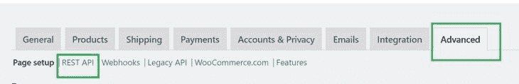
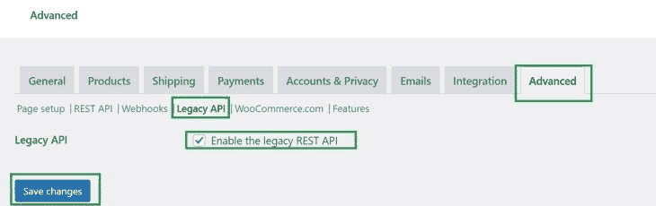
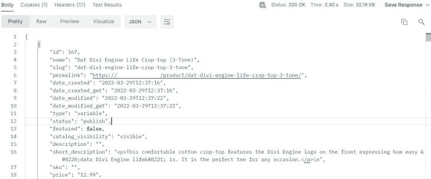
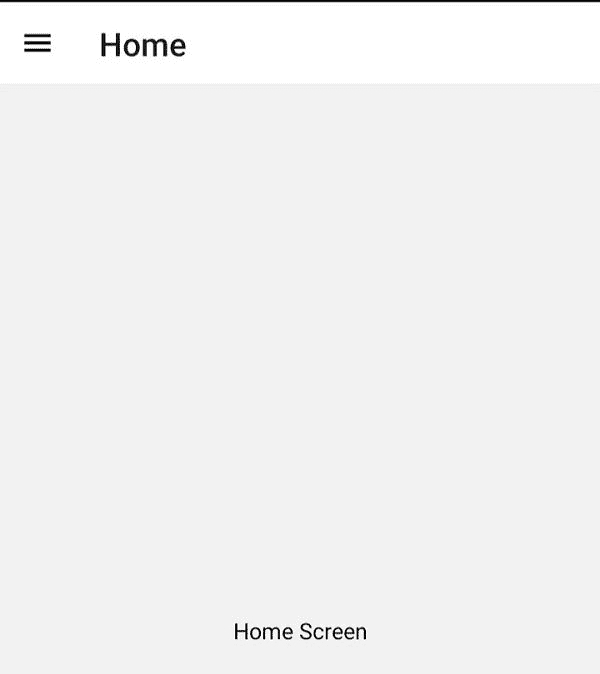
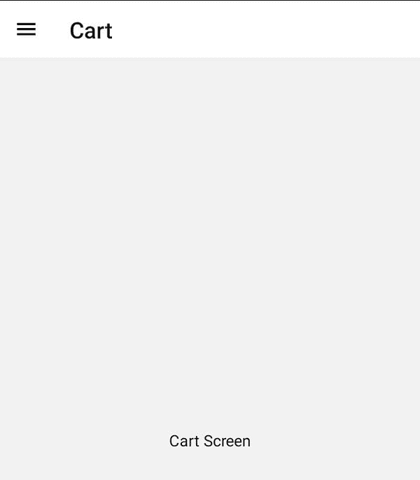
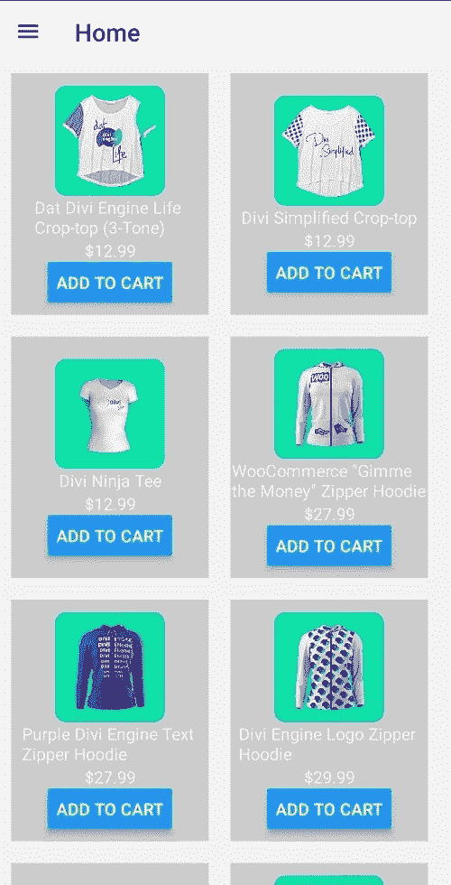
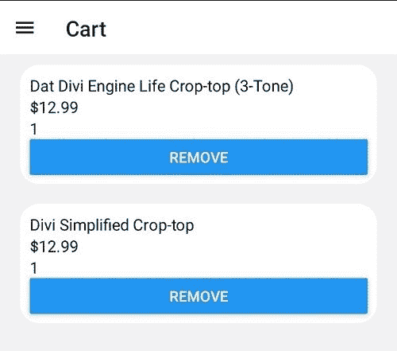
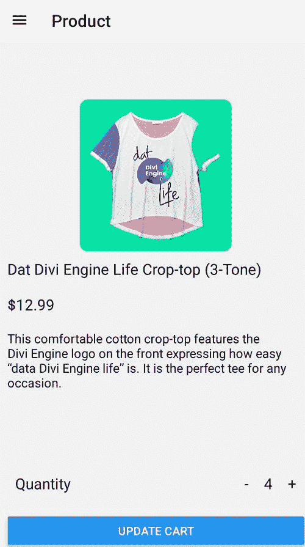

# 用 React Native 和 WooCommerce - LogRocket Blog 构建电子商务移动应用程序

> 原文：<https://blog.logrocket.com/building-ecommerce-mobile-app-react-native-woocommerce/>

## 什么是 WooCommerce？

WooCommerce 是一个流行的平台，你可以用它来建立自己的电子商务商店。它不需要你为整个应用程序编码就能做到这一点，这是通过使用 WordPress 这样的内容管理系统(CMS)来实现的。WordPress 帮助你创建漂亮的网上商店，从展示产品，管理购物车，订购到最终完成结账过程。您可以使用插件和其他资源快速、轻松地设置一切。

WordPress 可以作为一个整体运行；你的后端和前端是一体的。然而，WordPress 也可以作为一个无头 CMS 运行，其中后端和前端是解耦的，单独运行。这给了开发人员决定如何展示他们的服务的灵活性。

WordPress WooCommerce 允许开发者生成 RESTful APIs，在不同的渠道使用电子商务商店。这意味着你可以创建一个交互式的移动应用程序，让用户在你的 WordPress 站点中与相同的 WooCommerce 数据集进行交互。

这样做的好处是，您无需重新创作初始内容就可以使用数据。这也使您能够增强交付渠道的性能。您选择了最适合内容交付的快速、高效、可扩展且更易访问的渠道。

在本文中，我们将构建一个 React 本地购物应用程序，显示来自 WordPress WooCommerce 后端的产品列表。我们还将使用 [React 本地上下文 API](https://blog.logrocket.com/react-context-api-deep-dive-examples/) 作为状态管理工具来集成购物车功能。

### 内容

### 先决条件

要遵循本教程，请确保您具备以下条件:

确保你的 WordPress 域支持 SSL。查看本指南并学习如何为 WordPress 网站设置 SSL。然而，出于开发的目的，如果你的 WordPress 在本地运行或者缺少 SSL，我们将创建一个微小的 Node.js 微服务，让你不用 SSL 就能访问 WooCommerce WordPress。

## 在 WordPress 中设置 WooCommerce

一旦你的 WordPress 站点准备好并运行，导航到你的 WordPress 管理面板。在**插件**菜单下的**添加新**页面搜索 WooCommerce。然后安装并激活它。

WooCommerce 没有安装产品，所以我们将添加新产品，以适应我们想要构建的应用程序。导航到 WordPress 侧边栏菜单，访问**产品**，然后**所有产品**标签。

您可以选择添加自己的新定制产品。在本例中，我们将导入一个产品列表。您可以从这个[页面](https://diviengine.com/woocommerce-sample-products-csv-import-file-freebie/)访问它们，并下载 CSV 文件。或者，如果您有现有的产品列表，您也可以导入它们。

导入文件后，单击**继续**导入所有的列映射。然后，运行导入程序，等待 WooCommerce 为您处理商品。您现在可以开始查看您的产品了。

## 生成 WooCommerce REST API

现在让我们使用 React Native 生成一个 API 来使用这个产品。进入 WordPress 侧边栏，导航到 WooCommerce 设置。

导航到**高级**并点击 **REST API** 设置。



进行到**添加键**。这将生成允许你在 WordPress 之外访问你的商店的密钥。继续添加密钥描述和权限。在本教程中，我们想要读取来自 WooCommerce 的产品，因此确保选择了**读取**权限。

完成后，点击**生成 API 密钥**按钮。这将为您的商店生成一个**消费者** **密钥**和一个**消费者秘密**。请确保复制这些密钥，并将其保存在安全的地方。

最后，我们需要启用遗留的 REST API。导航到 WooCommerce **高级**设置，点击**遗留 API** ，启用，保存更改，如下图所示。



## 测试 REST API

在我们开始设置整个 React 本机应用程序之前，建议首先测试 API 是否工作正常。为此，我们将使用 Postman 向 localhost 发出基本请求。

在这里，我们将发送一个基本的 GET 请求，该请求将响应一个在 WordPress WooCommerce 中设置的产品列表。为此，我们将使用 URL `wp-json/wc/v2/products`并将其映射到运行 WordPress 应用程序的域。比如`[https://logrocket.com/wp-json/wc/v2/products](https://logrocket.com/wp-json/wc/v2/products)`。因此，请根据您的服务器或域名修改您的 URL 端点。

打开 Postman 并向 URL 端点发送 GET 请求

发送请求后，您需要添加授权详细信息。为此，导航到**授权**选项卡并选择**基本授权**。输入您的 WooCommerce 消费者密钥作为用户名，消费者密钥作为密码。

此外，为了避免任何连接问题，请确保禁用 Postman SSL 验证。您可以在 Postman 设置中执行此操作，并检查 SSL 证书验证是否已关闭。

完成后，将您的请求发送到您的端点。这将会给你一个关于 WordPress WooCommerce 商店产品列表的回复。



WooCommerce 已经准备好了，REST API 正在工作。我们现在可以开始使用 React Native 和 WooCommerce 构建一个电子商务移动应用程序。

## 设置 Node.js 微服务

正如我们前面所解释的，我们需要创建一个基本的 Node.js 微服务来处理不支持 SSL 的站点上的请求。

首先，创建一个目录，您希望您的应用程序在其中运行。在该目录中，创建一个不同的目录，并将其命名为`woo_commerce_server_api`。打开命令行，将目录更改为`woo_commerce_server_api`。然后，通过运行以下命令，使用默认配置初始化 Node.js 项目:

```
npm init -y

```

微服务将负责从 WooCommerce 商店获取数据。因此，我们需要安装两个依赖项:

*   Axios 向 WooCommerce 发送请求以获取数据
*   dotenv，用于加载环境变量

通过运行以下命令来安装它们:

```
npm i axios dotenv

```

在项目目录中创建一个`index.js`和一个`.env`文件。在`.env`文件中，添加以下内容:

```
consumer_key = "your_consumer_key"
consumer_secret = "your_consumer_secret"

```

在`index.js`文件中，导入必要的依赖项:

```
const http = require('http');
const https = require('https');
const axios = require('axios');
require("dotenv").config();

```

接下来，实例化一个代理以避免 SSL 证书验证:

```
const agent = new https.Agent({
    rejectUnauthorized: false
});

```

定义运行应用程序的端口:

```
const PORT = process.env.PORT || 5000;

```

然后，创建 HTTP 服务器，并定义从特定 URL 上的商店获取产品的功能:

```
const app = http.createServer((req, res) => {
    if (req.url == "/products" && req.method == "GET") {
        // get the token
        let token = `${process.env.consumer_key}:${process.env.consumer_secret}`;
        // get the base 64 encoded string.
        let basic_auth = Buffer.from(token).toString('base64');
        // Send request to get the data.
        axios.default.get('https://18.117.135.240/wp-json/wc/v2/products?per_page=20', {
            httpsAgent: agent,
            headers: {
                'Content-Type': 'application/json',
                'Authorization': 'Basic ' + basic_auth
            }
        })
            .then((response) => {
                // Successful response
                console.log("Successful request");
                res.statusCode = response.status;
                res.writeHead(200, { 'Content-Type': 'application/json' });
                res.end(JSON.stringify(response.data));
            })
            .catch((error) => {
                // Unsuccessful response
                console.log("Unsuccessful request");
                let message = new Error(error.message);
                res.statusCode = 500;
                res.end(JSON.stringify(message));
            })
    }
});

```

接下来，在指定的端口上启动服务器:

```
app.listen(PORT, () => console.log(`App started on PORT ${PORT}`));

```

在`package.json`文件的`scripts`部分下，添加以下命令:

```
"scripts": {
    "start": "node index.js"
},

```

启动开发服务器。此时，您的微服务已经启动并运行。您可以通过浏览器或邮递员向`[http://localhost:5000/products](http://localhost:5000/products)`发送`GET`请求来测试功能。

## 设置 React 本机应用程序

打开指向项目目录的终端，运行以下命令来初始化应用程序:

```
npx react-native init woocommerceshop

```

该过程完成后，继续到新创建的目录:

```
cd woocommerceshop

```

如果您运行的是 windows，导航到`android`文件夹，创建一个`local.properties`文件，并键入`sdk`目录，如下所示:

```
sdk.dir = relative_path_to_your_sdk

```

最后，启动开发服务器:

```
npm run android

```

默认应用程序将在您使用的调试设备上启动，可以是真实设备，也可以是仿真器。

## 实现抽屉导航

首先，停止正在运行的开发服务器，并安装以下依赖项:

```
npm i @react-native-masked-view/masked-view @react-navigation/drawer @react-navigation/native react-native-gesture-handler react-native-reanimated react-native-safe-area-context react-native-screens

```

在您的`babel.config.js`文件中，添加`react-native-reanimated/plugin`如下:

```
module.exports = {
    presets: ['module:metro-react-native-babel-preset'],
    plugins: ['react-native-reanimated/plugin']
};

```

编辑`android/app/build.gradle`中的`project.ext.react`属性，这样打开[爱马仕](https://blog.logrocket.com/getting-started-with-hermes-in-react-native/):

```
project.ext.react = [
    enableHermes: true,  // <- edit
]

```

在`android/app/src/main/java/com/woo_``ecommerce``_shop/MainApplication.java`下，添加以下导入:

```
import com.facebook.react.bridge.JSIModulePackage; // <- add
import com.swmansion.reanimated.ReanimatedJSIModulePackage;// <- add

```

现在，在`MainApplication`类的`ReactNaitiveHost`初始化下，添加插件`Reanimated`:

```
@Override
protected JSIModulePackage getJSIModulePackage() {
    return new ReanimatedJSIModulePackage(); // <- add
}

```

在主 React 本地项目文件夹中创建一个`src/screens`目录。在`screens`文件夹中，创建两个文件:`Cart.js`用于显示购物车，而`Home.js`用于显示产品。

编辑这些文件以显示一个简单的文本。

在`Home.js`文件中:

```
// Home.js
import React from 'react';
import { View, Text, StyleSheet } from 'react-native';

function Home() {
    return (
        <View style={styles.container}>
            <Text>Home Screen</Text>
        </View>
    );
}

const styles = StyleSheet.create({
    container: {
        flex: 1,
        justifyContent: 'center',
        alignItems: 'center'
    }
});

export default Home;

```

在`Cart.js`文件中:

```
// Cart.js
import React from 'react';
import { View, Text, StyleSheet } from 'react-native';

function Cart() {
    return (
        <View style={styles.container}>
            <Text>Cart Screen</Text>
        </View>
    );
}

const styles = StyleSheet.create({
    container: {
        flex: 1,
        justifyContent: 'center',
        alignItems: 'center'
    }
});

export default Cart;

```

接下来，在`App.js`下，添加以下导入:

```
import {NavigationContainer} from '@react-navigation/native';
import {createDrawerNavigator} from '@react-navigation/drawer';
import HomeScreen from './src/screens/Home';
import CartScreen from './src/screens/Cart';

```

现在我们可以创建一个抽屉导航器:

```
const Drawer = createDrawerNavigator();

```

在`App()`函数中，返回`NavigationContainer`，抽屉导航器指定屏幕:

```
const App = () => {
    return (
        <NavigationContainer>
            <Drawer.Navigator initialRouteName='Home'>
                <Drawer.Screen name="Home" component={HomeScreen} />
                <Drawer.Screen name="Cart" component={CartScreen} />
            </Drawer.Navigator>
        </NavigationContainer>
    );
};

```

启动开发服务器来测试抽屉是否工作。您的应用程序应该类似于下面的图片。

主屏幕:



购物车屏幕:



## 设置应用程序上下文

在应用程序的目录中，导航到上一步中创建的`src`文件夹。创建一个`store`和一个`constants`目录。

在`constants`目录中，创建一个`index.js`文件，并添加以下代码行:

```
let constants = {
    url : "http://ip_address:5000/products"
    // URL of the micro-service
}

export default constants;

```

确保用您计算机的本地 IP 地址替换`ip_address`。

在`store`目录中，创建一个`context.js`文件。在该文件中，添加以下代码块。

首先，导入必要的依赖项:

```
import React from 'react';
import {createContext,useState,useEffect} from 'react';
import constants from '../constants';
import axios from 'axios';

```

然后，实例化应用程序上下文:

```
const AppContext = createContext();

```

接下来，定义应用程序上下文提供者函数:

```
const AppContextProvider = ({ children }) => {

    // product's state
    const [products, setProducts] = useState([]); 
    // cart's state
    const [cart, setCart] = useState([]); 
    // loading's state
    const [loading, setLoading] = useState(false); 

    useEffect(() => {
        // start loading.
        setLoading(true); 
        axios.get(constants.url)
            .then(response => {
                // set the products from the response.
                setProducts(response.data); 
            })
             // In case of an error, log it.
            .catch(err => console.log(err));
        // stop loading.
        return setLoading(false); 
    }, [products, cart]);

    // remove item from cart
    const removeItem = (id) => {
        // Filter item from cart
        setCart(cart.filter(item => item.id !== id)); 
    }

    // return the provider with the defined properties.
    return (
        <AppContext.Provider value={{ products, setProducts, cart, setCart, removeItem, loading }}>
            {children}
        </AppContext.Provider>
    )
}

```

最后，导出应用程序上下文和应用程序上下文提供程序:

```
export {
    AppContext,
     AppContextProvider
}

```

现在，导航到`App.js`文件并导入创建的`AppContextProvider`:

```
import {AppContextProvider} from './src/store/context';

```

用`AppContextProvider`包装`App()`上呈现的所有元素，如下所示:

```
const App = () => {
    return (
        <AppContextProvider>
            <NavigationContainer>
                <Drawer.Navigator initialRouteName='Home'>
                    <Drawer.Screen name="Home" component={HomeScreen} />
                    <Drawer.Screen name="Cart" component={CartScreen} />
                </Drawer.Navigator>
            </NavigationContainer>
        </AppContextProvider>
    );
};

```

这样，应用程序就用一个数据源包装起来了。

因为我们还没有安装 [Axios](https://blog.logrocket.com/using-axios-react-native-manage-api-requests/) ，所以停止开发服务器并运行以下命令来安装它:

```
npm i axios

```

## 展示产品

让我们展示 WordPress WooCommerce 商店中列出的产品。导航到`src`目录并创建一个`components`目录。在里面，创建一个`Products.js`文件并导入这些依赖项和模块:

```
import React, { useContext } from 'react';
import { View, Text, StyleSheet, Button, Image } from 'react-native';
import { AppContext } from '../store/context';

```

然后，创建一个`Products`函数来呈现产品，如下所示:

```
function Products({ }) {
    const { products, cart, setCart, loading } = useContext(AppContext); // from context
    return (
        <View style={styles.container}>
            {
                loading ? <Text>Loading...</Text> :
                    products.map(product => {
                        let already_in_cart = cart.find(item => item.id === product.id); // Check if item is already in cart
                        return ( // render the product card
                            <View key={product.id} style={styles.product}>
                                <Image source={{ uri: product.images[0].src.replace('https', 'http') }} style={styles.image} />
                                <Text>{product.name}</Text>
                                <Text>${product.price}</Text>
                                <Button
                                    title={
                                        already_in_cart ? "Added to cart" : "Add to cart"
                                    }
                                    onPress={
                                        already_in_cart ? () => null :
                                            () => { // add the item to cart
                                                setCart([...cart, {
                                                    id: product.id,
                                                    name: product.name,
                                                    price: product.price,
                                                    quantity: 1
                                                }]);
                                            }
                                    }
                                />
                            </View>
                        )
                    })}
        </View>
    );
}

```

添加这些样式来格式化产品。继续将下面的`StyleSheet`添加到您的`Products`函数的正下方:

```
// styles for the product card
const styles = StyleSheet.create({
    image: {
        width: 100,
        height: 100,
        borderRadius: 10
    },
    container: {
        flex: 1,
        display: 'flex',
        flexDirection: 'row',
        flexWrap: 'wrap',
    },
    product: {
        width: 180,
        height: 220,
        backgroundColor: '#ccc',
        alignItems: 'center',
        justifyContent: 'center',
        margin: 10
    }
});

```

最后，导出`Products`函数，以便其他模块可以访问它:

```
export default Products;

```

在显示这些产品时，我们需要添加一个`ScrollView`,让用户滚动显示产品项目的列表。为此，导航到`screens`文件夹下的`Home.js`文件，并从`react-native`导入`ScrollView`:

```
import {ScrollView} from 'react-native';

```

然后，导入我们之前创建的`Products`组件:

```
import Products from '../components/Products';

```

最后，渲染`ScrollView`中的`Products`组件:

```
function HomeScreen() {
    return (
        <View style={styles.container} >
            <ScrollView>
                <Products />
            </ScrollView>
        </View>
    );
};

```

此时，您应该能够看到您的产品。您的主屏幕现在应该显示如下项目:



## 显示和移除购物车中的商品

让我们来学习如何在购物车中显示商品并移除它们。在您的`src/components`目录中，创建一个`Cart.js`文件并导入必要的依赖项，如下所示:

```
import React, { useContext } from 'react';
import { View, Text, StyleSheet, Button } from 'react-native';
import { AppContext } from '../store/context';

```

然后，定义一个`Cart`函数来呈现购物车:

```
function Cart() {
    // from the context
    const { cart, removeItem } = useContext(AppContext); 
    return (
        <View style={styles.container}>
            {
                cart.length > 0 ?
                // render a cart card.
                    cart.map(item => { 
                        return (
                            <View key={item.id} style={styles.cart}>
                                <Text style={styles.text}>{item.name}</Text>
                                <Text style={styles.text}>${item.price}</Text>
                                <Text style={styles.text}>{item.quantity}</Text>
                                <Button title="Remove" onPress={() => removeItem(item.id)} />
                            </View>
                        )
                    }) : (
                        <Text style={styles.text}>Cart is empty</Text>
                    )
            }
        </View>
    );
}

```

添加这些样式来格式化购物车条目。继续将下面的`StyleSheet`添加到您的`Cart`函数的正下方:

```
const styles = StyleSheet.create({
    container: {
        flex: 1,
        alignItems: 'center'
    },
    text: {
        fontSize: 15,
        color: "#000"
    },
    cart: {
        padding: 10,
        backgroundColor: "#fff",
        width: '90%',
        borderRadius: 20,
        margin: 10
    }
});

```

最后，导出`Cart`函数，以便其他模块可以访问它:

```
export default Cart;

```

要启用购物车物品的`ScrollView`，导航到`screens`下的`Cart.js`文件并导入`ScrollView`:

```
import {ScrollView} from 'react_native';

```

然后导入`Cart`组件:

```
import Cart from '../components/Cart';

```

在 render 函数中，呈现包装在`ScrollView`组件中的`Cart`组件，如下所示:

```
function CartScreen() {
    return (
        <View style={styles.container}>
            <ScrollView>
                <Cart />
            </ScrollView>
        </View>
    );
}

```

另外，更新购物车的`container`和`text`样式，如下所示:

```
const styles = StyleSheet.create({
    container: {
        flex: 1,
        justifyContent: 'center',
    },
    text: {
        color: "#000"
    }
});

```

在主屏幕上，点击**添加到购物车**按钮，将各种商品添加到购物车，然后进入购物车屏幕。您的项目将列出类似于照片中显示的内容。



您也可以点击**移除**从购物车中移除任何商品。

## 展示特定产品

因为产品的一些描述会有 HTML 标签，我们需要安装 [React Native HTMLView](https://www.npmjs.com/package/react-native-htmlview) 包。确保在安装之前已经停止了开发服务器:

```
npm i react-native-htmlview

```

安装完成后，在`src/screens`目录下创建一个`Product.js`文件。在该文件中，导入必要的依赖项和模块:

```
import React, { useState, useContext } from 'react';
import { View, Text, StyleSheet, Image, TouchableOpacity, Button } from 'react-native';
import HTMLView from 'react-native-htmlview';
import { AppContext } from '../store/context';

```

接下来，创建用于呈现产品的`Product`函数:

```
function Product({ route, navigation }) {
    // Get the dynamic product from the params.
    const { product } = route.params; 
    // get the cart and the setcart from the application context
    let { cart, setCart } = useContext(AppContext); 
    // check if item already in cart
    let already_in_cart = cart.find(item => item.id === product.id); 
    // set the quantity 
    let [quantity, setQuantity] = useState(already_in_cart ? already_in_cart.quantity : 1); 
    return (
        <View style={styles.container}>
            <View style={styles.imageContainer}>
                <Image source={{ uri: product.images[0].src.replace('https', 'http') }} style={styles.image} />
            </View>
            <Text style={styles.text}>
                {product.name}
            </Text>
            <Text style={styles.text}>
                ${product.price}
            </Text>
            <HTMLView value={product.short_description} stylesheet={{
                p: {
                    fontSize: 15,
                    color: '#000',
                    //textAlign:'center',
                    width: '100%',
                    padding: 10
                }
            }} />
            <View style={styles.quantityContainer}>
                <Text style={styles.text}>Quantity</Text>
                <View style={styles.quantity}>
                    <TouchableOpacity onPress={() => quantity > 1 ? setQuantity(quantity - 1) : null}>
                        <Text style={styles.text}>-</Text>
                    </TouchableOpacity>
                    <Text style={styles.text}>{quantity}</Text>
                    <TouchableOpacity onPress={() => setQuantity(quantity + 1)}>
                        <Text style={styles.text}>+</Text>
                    </TouchableOpacity>
                </View>
            </View>
            <View style={styles.buttonContainer}>
                <Button onPress={() => {
                    already_in_cart ? setCart(cart.map(item => item.id === product.id ? { ...item, quantity: quantity } : item)) :
                        setCart([...cart, {
                            id: product.id,
                            name: product.name,
                            price: product.price,
                            quantity: quantity
                        }]);
                    navigation.navigate('Cart')
                }} title={
                    already_in_cart ? "Update cart" : "Add to cart"
                } />
            </View>
        </View>
    );
}

```

为产品增添一些风格:

```
const styles = StyleSheet.create({
    container: {
        flex: 1,
        //alignItems:'center',
        justifyContent: 'center',
    },
    imageContainer: {
        //textAlign:'center',
        width: '100%',
        display: 'flex',
        justifyContent: 'center',
        alignItems: 'center',
    },
    text: {
        fontSize: 18,
        color: '#000',
        padding: 10
    },
    image: {
        width: 200,
        height: 200,
        borderRadius: 10,
    },
    quantityContainer: {
        display: 'flex',
        flexDirection: 'row',
        justifyContent: 'space-between',
        alignItems: 'center',
        padding: 10
    },
    quantity: {
        display: 'flex',
        flexDirection: 'row',
        justifyContent: 'center',
        alignItems: 'center',
    },
    buttonContainer: {
        width: '100%',
        padding: 10,
    }
});

```

并导出产品功能:

```
export default Product;

```

现在，在`App.js`文件下，导入我们刚刚创建的模块:

```
import ProductScreen from './src/screens/Product';

```

我们将在`Drawer.Navigator`组件中定义模块。然后，对其进行设计，使其不会显示在抽屉上，因为它是动态的:

```
<Drawer.Screen name="Product" component={ProductScreen} options={{
    drawerItemStyle: {
        display: "none"
    }
}} />

```

在`src/components/Products.js`下，从`react-native`导入`TouchableOpacity`:

```
import {TouchableOpacity} from 'react-native';

```

当呈现产品图像和名称时，用传递动态产品数据的`TouchableOpacity`组件包装它们:

```
<TouchableOpacity onPress={() => navigation.navigate('Product',{product})}>
<Image source={{uri:product.images[0].src.replace('https','http')}} style={styles.image}/>
</TouchableOpacity>
<TouchableOpacity onPress={() => navigation.navigate('Product',{product})}>
<Text>{product.name}</Text>
</TouchableOpacity>

```

至此，万事俱备！在主页上，单击任何产品的图像或标题，您应该会被重定向到一个新的单一产品屏幕，如下图所示。



## 结论

WooCommerce 是 WordPress 上流行的开源电子商务插件之一。它让你可以灵活地建立任何你能想到的商店。WooCommerce 为你的商店生成 API 的能力让你能够选择理想的平台来接触不同的用户。

在本指南中，我们学习了如何在 React 原生移动应用程序中使用 WooCommerce，但是您可以使用相同的 API，开发任何应用程序，并在不同的平台上运行它们。

我建议继续添加其他模块，如您选择的结账和支付集成。

我希望这对你有所帮助！

如果你卡住了，在 [GitHub](https://github.com/Rose-stack/eCommerce-with-react-native-and-wordpress-woocommerce) 上查看本教程使用的代码。

## [LogRocket](https://lp.logrocket.com/blg/ecommerce-signup) :看看用户为什么不完成你的电子商务流程中的一个步骤的技术和 UX 原因。

[](https://lp.logrocket.com/blg/ecommerce-signup)

LogRocket 就像是一个网络和移动应用程序和网站的 DVR，记录你的电子商务应用程序上发生的一切。LogRocket 没有猜测用户不转化的原因，而是主动揭示了阻止你转化的根本原因，比如 JavaScript 错误或死点击。LogRocket 还可以监控应用的性能，报告客户端 CPU 负载、客户端内存使用等指标。

开始主动监控您的电子商务应用程序— [免费试用](https://lp.logrocket.com/blg/ecommerce-signup)。