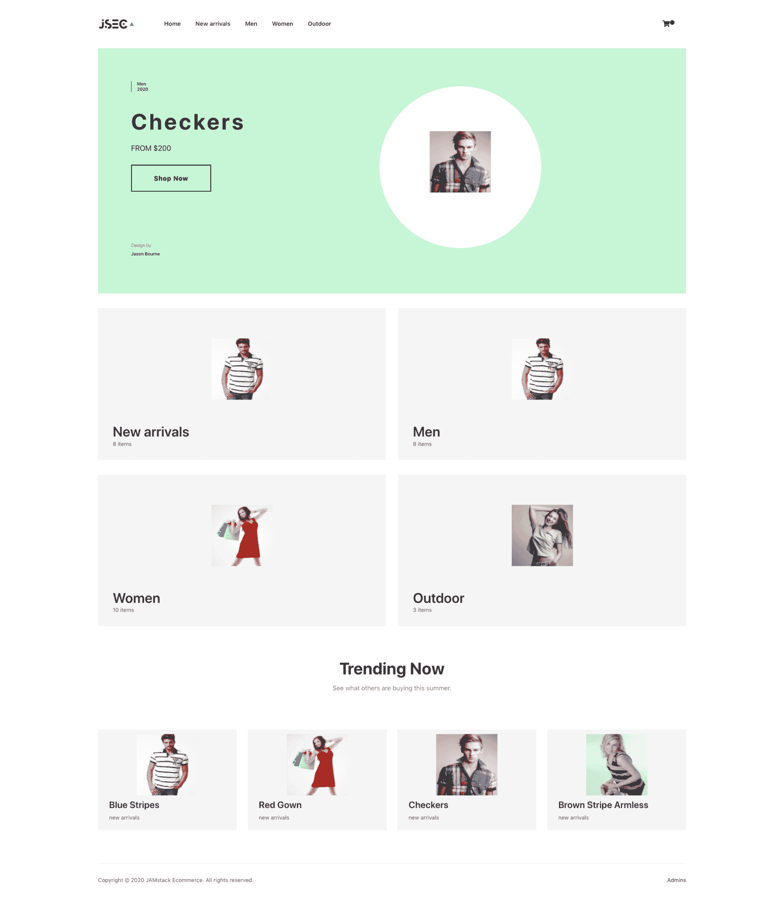

# 用 jamstack 建立一个电子商务网站

> 原文：<https://blog.logrocket.com/building-ecommerce-site-jamstack-ecommerce/>

在过去的十年中，各种类型的企业都开始建立电子商务平台，以增加销售额，并在全球范围内获得新客户。企业主和开发者都采用了 Shopify、WooCommerce、Magento、openCart 和 PrestaShop 等来构建他们的电子商务产品。

但是在本教程中，我们将探索一种使用 JAMstack 构建电子商务平台的新方法。

## JAMstack

JAMstack 中的 JAM 代表 JavaScript、API 和标记。这个堆栈提供了一种更简单的方法来构建 web 应用程序。JAMstack 始于 2016 年，当时一群开发者聚集在一起，他们认为静态网站应该完全静态。

到 2017 年，JAMstack 开始被更广泛的开发人员群体采用，第一批企业 JAMstack 项目公布。2018 年，第一届 JAMstack 大会举行，从那以后，Netlify、Gatsby 和 Contentful 等工具一直在帮助推广该堆栈，社区正在快速增长。

JAMstack 提供:

*   性能提高，因为预构建的标记文件和资产通过内容交付网络(CDN)提供
*   更安全的 web 应用程序，因为没有攻击者可以利用的服务器或数据库漏洞
*   更便宜的托管，因为托管静态文件通常更便宜，甚至完全免费
*   随着用户群或应用程序的增长，轻松扩展应用程序

## 我们将会建造什么

在本教程中，我们将使用[jam stack-ecommerce](https://github.com/jamstack-cms/jamstack-ecommerce)starter 模板构建一个简单的时尚电子商务平台。它是用 Gatsby 框架构建的，并使用 Tailwind CSS 进行样式化。

Gatsby 是一个基于 React 的开源框架，用于创建网站和应用程序。使用 Gatsby，您可以集成来自 API、数据库、CMS、静态文件等的数据。，或者一次多个源。Gatsby 有 2000 多个插件，默认内置了性能、可伸缩性和安全性。

## 设置盖茨比

在安装 Gatsby 之前，您需要正确安装和设置 Node.js。要安装 Gatsby:

```
npm install -g gatsby-cli
```

要确保 Gatsby 安装正确并查看所有可用的命令:

```
gatsby --help 
```

要创建 Gatsby 项目:

```
gatsby new jamstack-commerce
```

这将继续安装所有必要的依赖项。一旦创建了 Gatsby 项目，在终端中导航到项目文件夹并运行:

```
gatsby develop
```

只要您的开发服务器正在运行，您就可以在`[http://localhost:8000/](http://localhost:8000/)`访问本地站点。

## jam stack-电子商务

开始使用 jamstack-ecommerce starter 模板:

```
git clone https://github.com/jamstack-cms/jamstack-ecommerce.git jamstack_fashion
```

### 项目结构

开箱即用，典型的 Gatsby 项目将包含以下文件和文件夹:

*   包含所有与你将在我们的应用程序前端看到的内容相关的代码，如网站标题、页面模板等。
*   `/components`–包含用于以编程方式创建页面的模板
*   `/context`–包含在我们的应用中使用的上下文逻辑
*   `/images`–包含应用程序页面上使用的图像
*   `/layouts`–包含我们的应用程序使用的基本布局和布局样式
*   `/pages`—`src/pages`下的组件自动变成页面，路径基于它们的文件名
*   `/styles`–包含在我们的应用程序页面上使用的 CSS 样式规则和指令
*   `/templates`—`src/templates`下的组件是用于在我们的应用程序中创建应用程序页面的页面模板
*   `/providers`–包含与我们的应用程序逻辑相关的所有代码，例如获取和解析数据以及所有其他 API 操作
*   `/static`–包含应用程序中使用的所有静态资产，如字体、产品图片等。
*   `/snippets`–包含不同处理器的支付逻辑等逻辑
*   `/utils`–包含我们应用中使用的所有其他较小的功能和逻辑
*   Gatsby 希望在这个文件中找到 Gatsby 浏览器 API 的任何用法，如果有的话。这允许自定义/扩展影响浏览器的默认 Gatsby 设置
*   `gatsby-config.js`–这是 Gatsby 站点的主配置文件。在这里你可以指定关于你的站点的信息(元数据),比如站点标题和描述，你想要包含哪些 Gatsby 插件等等。
*   Gatsby 希望在这个文件中找到 Gatsby 节点 API 的任何用法(如果有的话)。这允许定制/扩展影响站点构建过程的默认 Gatsby 设置。
*   Gatsby 希望在这个文件中找到 Gatsby 服务器端呈现 API 的任何用法，如果有的话。这允许定制影响服务器端呈现的默认 Gatsby 设置

## 安装顺风 CSS

我们将使用 Tailwind CSS 来设计我们的应用程序。要安装 Tailwind:

```
# Using npm
npm install tailwindcss
# Using Yarn
yarn add tailwindcss
```

## 添加静态文件

我们时尚网站上的每个产品都会有它的产品形象。让我们删除`static/images`文件夹中的所有图像，并添加我们的图像。您可以根据自己的意愿，按照类别名称、产品类型等对它们进行进一步分类。

如果您想要使用自定义字体，请用您的自定义字体替换`static/fonts`文件夹中的内容。现在，我们的`/static`文件夹看起来像这样:

```
|-- /static
    |-- /fonts
    |-- /images
        |-- /product_image.png
```

要添加您的站点徽标和图标，您可以替换位于`src/images`文件夹中的站点徽标和图标。文件夹`static`中的文件将在`public`文件夹中构建和服务。

## 添加库存数据

使用 jamstack-ecommerce starter 模板，每个产品都是一个库存项目，它们都被硬编码到一个简单的数组中。通过更改`providers/inventoryProvider`中的清单提供者，可以很容易地重新配置为从 Shopify 等远程源或另一个 CMS 或数据源获取。

对于我们的时尚网站，让我们硬编码我们的时尚库存。用下面的清单替换清单。确保将正确的路径添加到产品图像中。

库存模式将遵循以下约定。根据您的需要，您可以决定扩展该方案或删除某些字段。

```
type Product {
  id: ID!
  categories: [String]!
  price: Float!
  name: String!
  image: String!
  description: String!
  currentInventory: Int!
  brand: String
}
```

我们在`providers/inventory.js`中的库存数组将如下所示:

```
let inventory = [
  // Arrivals
  { categories: ['new arrivals', 'men'], name: 'Blue Stripes', price: '1000', image: '../images/products/man1.jpg', description: 'Lorem ipsum dolor sit amet, consectetur adipiscing elit. Nam fringilla augue nec est tristique auctor. Donec non est at libero vulputate rutrum.', brand: 'Jason Bourne', currentInventory: 4 },
  { categories: ['new arrivals', 'men'], name: 'Checkers', price: '1000', image: '../images/products/man2.jpg', description: 'Lorem ipsum dolor sit amet, consectetur adipiscing elit. Nam fringilla augue nec est tristique auctor. Donec non est at libero vulputate rutrum.' , brand: 'Jason Bourne' , currentInventory: 2 },
  { categories: ['new arrivals', 'men'], name: 'Black Leather Jacket', price: '800', image: '../images/products/man3.jpg', description: 'Lorem ipsum dolor sit amet, consectetur adipiscing elit. Nam fringilla augue nec est tristique auctor. Donec non est at libero vulputate rutrum.', brand: 'Jason Bourne', currentInventory: 8 },
  { categories: ['new arrivals', 'men'], name: 'Corperate Blue', price: '900', image: '../images/products/man4.jpg', description: 'Lorem ipsum dolor sit amet, consectetur adipiscing elit. Nam fringilla augue nec est tristique auctor. Donec non est at libero vulputate rutrum.' , brand: 'Jason Bourne', currentInventory: 10},
  { categories: ['new arrivals', 'women'], name: 'Red Gown', price: '1200', image: '../images/products/woman1.jpg', description: 'Lorem ipsum dolor sit amet, consectetur adipiscing elit. Nam fringilla augue nec est tristique auctor. Donec non est at libero vulputate rutrum.', brand: 'Jason Bourne' , currentInventory: 7 },
  { categories: ['new arrivals', 'women'], name: 'Brown Stripe Armless', price: '500', image: '../images/products/woman2.jpg', description: 'Lorem ipsum dolor sit amet, consectetur adipiscing elit. Nam fringilla augue nec est tristique auctor. Donec non est at libero vulputate rutrum.' , brand: 'Jason Bourne', currentInventory: 13},
  { categories: ['new arrivals', 'women'], name: 'America 88', price: '650', image: '../images/products/woman3.jpg', description: 'Lorem ipsum dolor sit amet, consectetur adipiscing elit. Nam fringilla augue nec est tristique auctor. Donec non est at libero vulputate rutrum.' , brand: 'Jason Bourne', currentInventory: 9},
  { categories: ['new arrivals', 'women'], name: 'Peach Belt Gown', price: '1230', image: '../images/productswoman4.jpg', description: 'Lorem ipsum dolor sit amet, consectetur adipiscing elit. Nam fringilla augue nec est tristique auctor. Donec non est at libero vulputate rutrum', brand: 'Jason Bourne', currentInventory: 24 },
  //Outdoor
  { categories: ['outdoor'], name: 'Grey Top', price: '800', image: '../images/products/outdoor1.jpg', description: 'Lorem ipsum dolor sit amet, consectetur adipiscing elit. Nam fringilla augue nec est tristique auctor. Donec non est at libero vulputate rutrum.', brand: 'Jason Bourne', currentInventory: 43 },
  { categories: ['outdoor'], name: 'Red Mini Gown', price: '900', image: '../images/products/outdoor2.jpg', description: 'Lorem ipsum dolor sit amet, consectetur adipiscing elit. Nam fringilla augue nec est tristique auctor. Donec non est at libero vulputate rutrum.', brand: 'Jason Bourne' , currentInventory: 2},
  { categories: ['outdoor'], name: 'Outdoor Chiffon', price: '1200', image: '../images/products/outdoor3.jpg', description: 'Lorem ipsum dolor sit amet, consectetur adipiscing elit. Nam fringilla augue nec est tristique auctor. Donec non est at libero vulputate rutrum.', brand: 'Jason Bourne', currentInventory: 14 },
  // Women
  { categories: ['women'], name: 'Red Gown', price: '300', image: '../images/products/woman1.jpg', description: 'Lorem ipsum dolor sit amet, consectetur adipiscing elit. Nam fringilla augue nec est tristique auctor. Donec non est at libero vulputate rutrum.' , brand: 'Jason Bourne', currentInventory: 12 },
  { categories: ['women'], name: 'Brown Stripe Armless', price: '825', image: '../images/products/woman2.jpg', description: 'Lorem ipsum dolor sit amet, consectetur adipiscing elit. Nam fringilla augue nec est tristique auctor. Donec non est at libero vulputate rutrum.' , brand: 'Jason Bourne', currentInventory: 13},
  { categories: ['women'], name: 'America 88', price: '720', image: '../images/products/woman3.jpg', description: 'Lorem ipsum dolor sit amet, consectetur adipiscing elit. Nam fringilla augue nec est tristique auctor. Donec non est at libero vulputate rutrum.' , brand: 'Jason Bourne', currentInventory: 33},
  { categories: ['women'], name: 'Peach Belt Gown', price: '2000', image: '../images/products/woman4.jpg', description: 'Lorem ipsum dolor sit amet, consectetur adipiscing elit. Nam fringilla augue nec est tristique auctor. Donec non est at libero vulputate rutrum.', brand: 'Jason Bourne', currentInventory: 23 },
  { categories: ['women'], name: 'Blue Sweater', price: '1100', image: '../images/products/woman5.jpg', description: 'Lorem ipsum dolor sit amet, consectetur adipiscing elit. Nam fringilla augue nec est tristique auctor. Donec non est at libero vulputate rutrum.' , brand: 'Jason Bourne', currentInventory: 13},
  { categories: ['women'], name: 'Black Female Singlet', price: '600', image: '../images/products/woman6.jpg', description: 'Lorem ipsum dolor sit amet, consectetur adipiscing elit. Nam fringilla augue nec est tristique auctor. Donec non est at libero vulputate rutrum.', brand: 'Jason Bourne', currentInventory: 15 },
  // Men
  { categories: ['men'], name: 'Blue Stripes', price: '775', image: '../images/products/man1.jpg', description: 'Lorem ipsum dolor sit amet, consectetur adipiscing elit. Nam fringilla augue nec est tristique auctor. Donec non est at libero vulputate rutrum.', brand: 'Jason Bourne', currentInventory: 44 },
  { categories: ['men'], name: 'Checkers', price: '1200', image: '../images/products/man2.jpg', description: 'Lorem ipsum dolor sit amet, consectetur adipiscing elit. Nam fringilla augue nec est tristique auctor. Donec non est at libero vulputate rutrum.', brand: 'Jason Bourne', currentInventory: 17 },
  { categories: ['men'], name: 'Black Leather Jacket', price: '1600', image: '../images/products/man3.jpg', description: 'Lorem ipsum dolor sit amet, consectetur adipiscing elit. Nam fringilla augue nec est tristique auctor. Donec non est at libero vulputate rutrum.', brand: 'Jason Bourne', currentInventory: 28 },
  { categories: ['men'], name: 'Corporate Blue', price: '550', image: '../images/products/man4.jpg', description: 'Lorem ipsum dolor sit amet, consectetur adipiscing elit. Nam fringilla augue nec est tristique auctor. Donec non est at libero vulputate rutrum.', brand: 'Jason Bourne', currentInventory: 31 },  // { 
]
```

如上所述，我们的库存模式要求每个库存项目都有一个:

*   种类
*   产品名称
*   价格
*   产品仿制
*   产品描述
*   商标名称
*   当前库存编号

根据上面的库存列表，我们创建了四个类别:

*   新来的
*   户外的
*   男人
*   女人

您可以根据需要添加更多类别。一个库存项目也可以属于多个类别。

## 货币面额

根据您的偏好，您可能需要更改商店货币。要分配我们网站使用的另一种货币，请在您的库存提供商中将`DENOMINATION`变量更改为您首选的货币面额符号。

```
import inventory from './inventory';
async function getInventory() {
  return new Promise((resolve, reject) => {
    resolve(inventory)
  })
}
const DENOMINATION = '£'
export { DENOMINATION, getInventory as default }
```

默认情况下，使用的货币单位是美元，`$`。

## 主题

我们需要为我们的应用程序创建一个主题。有了主题，我们就能够定义我们的主要和次要颜色。这些颜色将用于设计我们的应用程序，尤其是组件，如行动按钮、购物车物品等。

从项目根中打开主题文件`src/theme.js`，并根据您的选择编辑主要和次要颜色:

```
const colors = {
  primary: '#000000',
  secondary: '#00baa6'
}
export {
  colors
}
```

## 工地布置

jamstack-ecommerce starter 模板带有一个现代的 UI 布局，你可能会发现你不需要对它做太多的修改。如果你想给你的网站一个新的布局或者修改现有的布局，那么`src/pages/index.js`文件就是网站的登陆页面。

出于本教程的考虑，我已经修改了默认布局，添加了更多类别和一个趋势部分，显示其他客户正在购买的商品。将`src/pages/index.js`的内容替换为以下内容:

```
import React from "react"
import SEO from "../components/seo"
import { Center, Footer, Tag, Showcase, DisplaySmall, DisplayMedium } from '../components'
import CartLink from '../components/CartLink'
import { titleIfy, slugify } from '../../utils/helpers'
import { graphql } from 'gatsby'
const Home = ({ data: gqlData }) => {
  const { inventoryInfo, categoryInfo: { data }} = gqlData
  const categories = data.slice(0, 8)
  const inventory = inventoryInfo.data.slice(0, 8)
  return (
    <>
      <CartLink />
      <SEO title="Home" />
      <div className="w-full">
        <div className="bg-green-200
        lg:h-hero
        p-6 pb-10 smpb-6
        flex lg:flex-row flex-col">
          <div className="pt-4 pl-2 sm:pt-12 sm:pl-12 flex flex-col">
            <Tag
              year="2020"
              category="Men"
            />
            <Center
              price="200"
              title={inventory[1].name}
              link={slugify(inventory[1].name)}
            />
            <Footer
              designer="Jason Bourne"
            />
          </div>
          <div className="flex flex-1 justify-center items-center relative">
              <Showcase
                imageSrc={inventory[1].image}
              />
              <div className="absolute
              w-48 h-48 sm:w-72 sm:h-72 xl:w-88 xl:h-88
              bg-white z-0 rounded-full" />
          </div>
        </div>
      </div>
      <div className="my-4 lg:my-8 flex flex-col lg:flex-row justify-between">
        <DisplayMedium imageSrc={categories[0].image} subtitle={`${categories[0].itemCount} items`} title={titleIfy(categories[0].name)} link={slugify(categories[0].name)} />
        <DisplayMedium imageSrc={categories[1].image} subtitle={`${categories[1].itemCount} items`} title={titleIfy(categories[1].name)} link={slugify(categories[1].name)} />
      </div>
      <div className="my-4 lg:my-8 flex flex-col lg:flex-row justify-between">
        <DisplayMedium imageSrc={categories[2].image} subtitle={`${categories[2].itemCount} items`} title={titleIfy(categories[2].name)} link={slugify(categories[2].name)} />
        <DisplayMedium imageSrc={categories[3].image} subtitle={`${categories[3].itemCount} items`} title={titleIfy(categories[3].name)} link={slugify(categories[3].name)} />
      </div>
      <div className="pt-10 pb-6 flex flex-col items-center">
        <h2 className="text-4xl mb-3">Trending Now</h2>
        <p className="text-gray-600 text-sm">See what others are buying this summer.</p>
      </div>
      <div className="my-8 flex flex-col lg:flex-row justify-between">
        <DisplaySmall imageSrc={inventory[0].image} title={inventory[0].name} subtitle={inventory[0].categories[0]} link={slugify(inventory[0].name)} />
        <DisplaySmall imageSrc={inventory[4].image} title={inventory[4].name} subtitle={inventory[4].categories[0]} link={slugify(inventory[4].name)} />
        <DisplaySmall imageSrc={inventory[1].image} title={inventory[1].name} subtitle={inventory[1].categories[0]} link={slugify(inventory[1].name)} />
        <DisplaySmall imageSrc={inventory[5].image} title={inventory[5].name} subtitle={inventory[5].categories[0]} link={slugify(inventory[5].name)} />
      </div>
    </>
  )
}
export const pageQuery = graphql`
  query {
    navInfo {
      data
    }
    categoryInfo {
      data {
        name
        image
        itemCount
      }
    }
    inventoryInfo {
      data {
        image
        name
        categories
        description
        id
      }
    }
  }
`
export default Home
```

综上所述，我们使用 GraphQL 来查询我们的库存，以获取类别和库存项目。英雄部分使用三个组件:`Tag`、`C``enter`、`Footer`、`Showcase`。每个必需的组件属性也被传递。

我们使用`DisplayMedium`组件创建两个部分来向用户显示我们的类别，最后，我们使用`DisplaySmall`组件显示趋势项。

显示的库存项目可以很容易地更改，因为它们是硬编码的。

* * *

### 更多来自 LogRocket 的精彩文章:

* * *

## 运行我们的应用

现在我们已经完全构建了所有组件，让我们来看看我们的应用程序:

```
gatsby develop
```

这将编译我们的应用程序，并将其作为一个公共文件夹放在`localhost:8000`上。在您的浏览器中打开该链接，您应该会看到类似下面的内容:



## 搜索引擎优化

没有 SEO，电子商务平台是不完整的。使用 JAMstack，我们能够使用 [React 头盔](https://github.com/nfl/react-helmet)轻松实现 SEO。React 头盔根据每个页面的内容定制页面元数据，以提高 SEO。要安装:

```
npm install --save gatsby-plugin-react-helmet react-helmet
```

然后将其导入我们的代码，如下所示:

```
import { Helmet } from "react-helmet";
```

创建`src/components/seo.js`文件:

```
import React from "react"
import PropTypes from "prop-types"
import Helmet from "react-helmet"
import { useStaticQuery, graphql } from "gatsby"
function SEO({ description, lang, meta, title }) {
  const { site } = useStaticQuery(
    graphql`
      query {
        site {
          siteMetadata {
            title
            description
            author
          }
        }
      }
    `
  )
  const metaDescription = description || site.siteMetadata.description
  return (
    <Helmet
      htmlAttributes={{
        lang,
      }}
      title={title}
      titleTemplate={`%s | ${site.siteMetadata.title}`}
      meta={[
        {
          name: `description`,
          content: metaDescription,
        },
        {
          property: `og:title`,
          content: title,
        },
        {
          property: `og:description`,
          content: metaDescription,
        },
        {
          property: `og:type`,
          content: `website`,
        },
        {
          name: `twitter:card`,
          content: `summary`,
        },
        {
          name: `twitter:creator`,
          content: site.siteMetadata.author,
        },
        {
          name: `twitter:title`,
          content: title,
        },
        {
          name: `twitter:description`,
          content: metaDescription,
        },
      ].concat(meta)}
    />
  )
}
SEO.defaultProps = {
  lang: `en`,
  meta: [],
  description: ``,
}
SEO.propTypes = {
  description: PropTypes.string,
  lang: PropTypes.string,
  meta: PropTypes.arrayOf(PropTypes.object),
  title: PropTypes.string.isRequired,
}
export default SEO
```

Gatsby 最近推出了`useStaticQuery`，这是一个新功能，允许我们使用 React Hooks 来实时查询 GraphQL。这允许我们的 React 组件通过 GraphQL 查询检索数据，该查询将被解析、评估并注入到组件中。

使用`useStaticQuery`钩子，我们从我们的`gatsby-config.js`中查询站点标题、描述和作者。上面的代码查询 GraphQL API 以获取网站的元数据，包括标题、描述和作者。然后它将标题传递到`title`道具和`meta`数组中。每个条目都有带元属性名的`name`和值的`content`。

元数据可以在`gatsby-config.js`文件中更改，而`SEO`组件可以在任何地方使用。

## 在生产中部署

现在，我们已经做好了一切工作，我们需要部署我们的网站，并使它活起来:

```
gatsby build
```

这将创建一个名为`public`的文件夹。`public`文件夹将包含准备在生产环境中部署的网站。你可以按照这个[指南](https://www.gatsbyjs.com/docs/deploying-and-hosting/)在 Netlify、Surge、AWS、Digital Ocean、Azure、GitLab、Heroku、Firebase 等上进行部署。

## 结论

JAMstack 相对较新，但可能性是无限的。这是一套新的新兴技术，采用率越来越高。它带来了构建 web 应用程序的新体验。

## [LogRocket](https://lp.logrocket.com/blg/ecommerce-signup) :看看用户为什么不完成你的电子商务流程中的一个步骤的技术和 UX 原因。

[](https://lp.logrocket.com/blg/ecommerce-signup)

LogRocket 就像是一个网络和移动应用程序和网站的 DVR，记录你的电子商务应用程序上发生的一切。LogRocket 没有猜测用户不转化的原因，而是主动揭示了阻止你转化的根本原因，比如 JavaScript 错误或死点击。LogRocket 还可以监控应用的性能，报告客户端 CPU 负载、客户端内存使用等指标。

开始主动监控您的电子商务应用程序— [免费试用](https://lp.logrocket.com/blg/ecommerce-signup)。