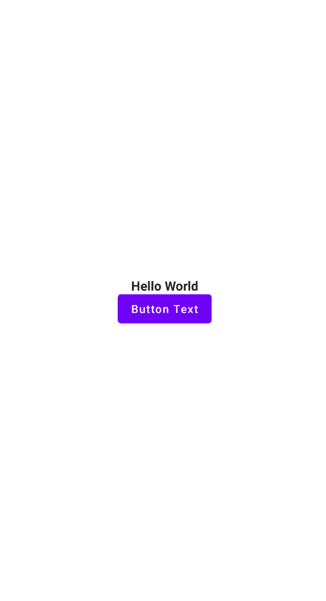
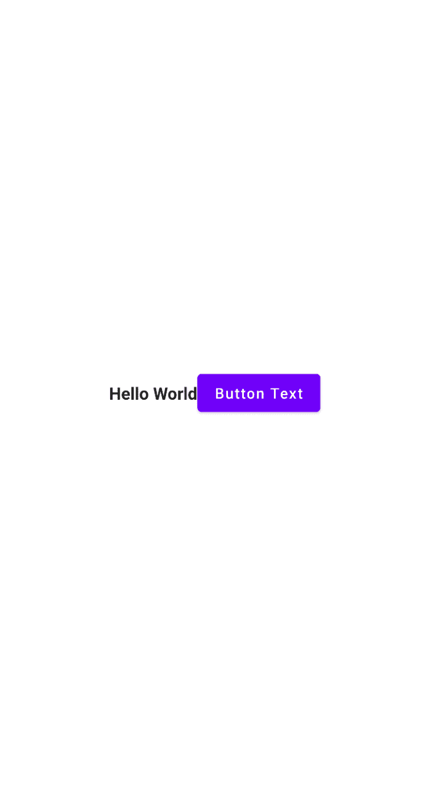
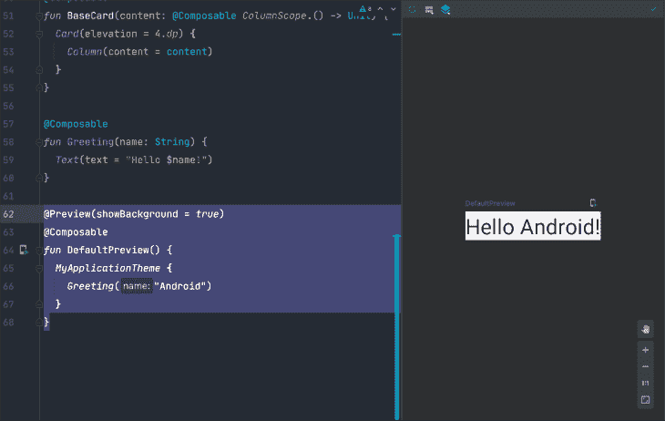

# 用 Jetpack 构建更快的 Android 应用程序

> 原文：<https://blog.logrocket.com/building-faster-android-apps-jetpack-compose/>

Jetpack Compose 是 Google 新的、现代的、用于 Android 应用程序开发的声明式 UI 框架。Compose 将十多年来从以前的 UI 工具包中学到的知识与 Kotlin 编程语言的强大功能相结合，为 Android 开发人员提供了强大的 UI 开发体验。

本文将通过以下方式帮助您快速学习 Jetpack Compose:

1.  快速演示合成 UI 应用程序的构建块
2.  介绍编写更灵活、更可伸缩的可组合代码的一些准则
3.  详述了在使用 Compose 时提高开发人员生产率的几个技巧

## 什么是 Jetpack Compose？

Jetpack Compose 和传统的 Android view 系统最明显的区别就是 Compose UI 完全是用 Kotlin 编写的。不再需要将 XML 用于布局、样式、版式、颜色或其他与 UI 相关的元素。

```
@Composable
fun Composable() {
    Text("Hello World!")
}
```

视图、`TextViews`、按钮、`LinearLayouts`等都不见了。，那你就熟悉了。编写应用程序是使用可组合函数而不是视图函数构建的。可组合的函数用`@Composable`来注释，并代表单独的 UI 元素。我们可以使用预定义的组件，也可以定义自己的组件。

Jetpack Compose 利用 React 和 Flutter 等其他声明性框架的模式，为习惯于声明性编程的人提供直观而熟悉的体验。因为 Compose 应用程序是用 Kotlin 编写的，所以很容易使用您习惯使用的所有相同的控制流结构和语言特性来描述您的 UI。

```
@Composable
fun Title(message: String?) {
  if(message == null) {
    Text("error")
  } else {
    Text(message)
  }
}
```

Compose 承诺简化和加速 UI 开发，并有很大的潜力成为 kot Lin Android 开发的未来。那么，如何开始构建 Jetpack Compose 应用程序呢？

## 使用 Jetpack 撰写

要开始使用 Jetpack Compose，您需要做几件事来[设置您的项目](https://developer.android.com/jetpack/compose/setup)。

1.  下载 Android Studio 的[最新稳定版](https://developer.android.com/studio)
2.  使用 Android Studio 创建一个新的 Android 项目
3.  将应用的 minSdk 版本设置为 21 (Android 5.0)或更高版本
4.  将以下合成依赖项添加到您的`build.gradle`文件中

```
// build.gradle.kts
implementation("androidx.compose.ui:ui:1.0.1")
implementation("androidx.compose.ui:ui-tooling:1.0.1")
implementation("androidx.compose.foundation:foundation:1.0.1")
implementation("androidx.compose.material:material:1.0.1")
```

一旦创建了项目并添加了这些依赖项，就应该能够同步项目并开始使用 Compose APIs 了。首先，让我们在创建的默认`Activity`中显示一个“Hello World”消息。

```
class MainActivity : ComponentActivity() {
    override fun onCreate(savedInstanceState: Bundle?) {
        super.onCreate(savedInstanceState)
        setContent {
            Text("Hello world!")
        }
    }
}
```

注意没有调用`setContentView()`。我们可以使用`setContent{}`函数为`Activity`定义一个基于组合的 UI，而不是膨胀一个基于 XML 的布局。在传递给`setContent()`的 lambda 中，我们可以添加组件来定义我们的用户界面。

让我们来看看开始使用 Jetpack Compose 构建交互式应用程序时需要的一些最常见的构件

## 掌握可组合基础知识

### 添加文本

需要在应用程序中添加一些文本吗？您可能会想要使用`Text` Composable。

```
setContent {
 Text(text = "Hello World")
}
```

`Text` Composable 是一个 Kotlin 函数，它包含许多可选参数，使您能够配置文本的外观。

```
setContent {
 Text(
   text = "Hello World",
   fontWeight = FontWeight.Bold,
   maxLines = 1,
   overflow = TextOverflow.Ellipsis
 )
}
```

### 可组合按钮

要在 UI 中显示一个简单的按钮，可以使用`Button` Composable。

```
Button(onClick = {}) {
 Text("Button Text")
}
```

是一个很好的例子，说明了 Compose 如何更喜欢组合而不是严格的继承。注意，我们将一个 lambda 传递给了`Button`函数。λ定义了`Button`的内容。在这种情况下，我们的按钮的内容是一个简单的文本元素。

这是作曲中常见模式。Composables 通常会使用一个尾随的 lambda 来定义它们的内容，这使得它们更加灵活，也更容易使用。

### `Column`和`Row`组件

为了帮助对齐像`Text`或`Button`这样的元素，我们需要容器来帮助我们排列这些元素。你可能遇到的前两个这样的容器是`[Column](https://developer.android.com/jetpack/compose/layouts/basics#standard-layouts)`和`[Row](https://developer.android.com/jetpack/compose/layouts/basics#standard-layouts)`。

将孩子一个接一个垂直排列。

```
Column(
 modifier = Modifier.fillMaxSize(1f),
 verticalArrangement = Arrangement.Center,
 horizontalAlignment = Alignment.CenterHorizontally
) {
 Text(
   text = "Hello World",
   fontWeight = FontWeight.Bold,
   maxLines = 1,
   overflow = TextOverflow.Ellipsis
 )

 Button(onClick = {}) {
   Text("Button Text")
 }
}
```



如果需要横向内容，可以用`Row`代替`Column`。

```
Row(
 modifier = Modifier.fillMaxSize(1f),
 verticalAlignment = Alignment.CenterVertically,
 horizontalArrangement = Arrangement.Center
) {
 Text(
   text = "Hello World",
   fontWeight = FontWeight.Bold,
   maxLines = 1,
   overflow = TextOverflow.Ellipsis
 )

 Button(onClick = {}) {
   Text("Button Text")
 }
}
```



### `LazyColumn`和`LazyRow`用于大型数据集

处理大型数据集，需要高性能的容器？不使用`Column`和`Row`，我们可以使用`LazyColumn`和`LazyRow`，它们提供了更有效的资源回收和更快的绘图性能。这两个组件在概念上非常类似于`RecyclerView`。

要创建一个`LazyColumn`，我们可以将`Column`改为`LazyColumn`，然后在一个`item{}`可组合组件中定义每个 UI 元素，该组件定义列表中的单个项目，这样我们就可以定义不同的项目类型，而不需要适配器。

```
LazyColumn(
 verticalArrangement = Arrangement.Center,
 horizontalAlignment = Alignment.CenterHorizontally,
 modifier = Modifier.fillMaxSize(1f),
) {
 item { Text("1") }
 item { Text("2") }
 item { Text("3") }
 item { Text("4") }
 item { Text("5") }
 item { Text("6") }
 item { Text("7") }
 item { Text("8") }
 item { Text("9") }
 item { Text("10") }
}
```


需要基于静态计数或数据集合创建一堆项目吗？我们可以使用`items()`函数在我们的`LazyColumn`中重复创建项目。

```
LazyColumn(
 verticalArrangement = Arrangement.Center,
 horizontalAlignment = Alignment.CenterHorizontally,
 modifier = Modifier.fillMaxSize(1f),
) {
 items(100) { index ->
   Text("$index")
 }
}
```


`LazyColumn`或`LazyRow`中的项目不必相同。您可以随意混合 UI 元素，完全不需要单独的适配器或布局。这突出了 Jetpack Compose 在现有 UI 系统上的强大功能和灵活性。

### 在合成中处理填充和边距

我们如何在 Compose 中处理填充和边距？Compose 通过提供一个概念——填充来简化它。

我们可以通过应用`[Modifier](https://developer.android.com/jetpack/compose/layouts/basics#modifiers)`为任何元素定义填充。修饰符允许我们配置一个可组合组件来控制大小、填充、焦点状态、点击处理程序等等。

要将填充添加到上一个示例的项目列表中，我们可以按如下方式更新代码:

```
LazyColumn(
 verticalArrangement = Arrangement.Center,
 horizontalAlignment = Alignment.CenterHorizontally,
 modifier = Modifier.fillMaxSize(1f),
) {
 items(100) { index ->
   Text(
     text = "$index",
     modifier = Modifier.padding(16.dp)
   )
 }
}
```


这里发生了一些有趣的事情。首先，命名参数的使用在组合代码中很常见。其次，我们可以通过直接引用`Modifier`并在其上调用方法来开始构建一个修饰符。

要添加填充，我们可以调用`padding()`并传入一个维度值。这里，我们使用一个名为`dp`的扩展属性来方便地将原始值`16`转换成维度值。

## 更好的组合技巧

我们现在已经讨论了最常见的组件，以及一些常见的使用模式。随着 Android 社区继续使用 Compose、新的模式和约定，最佳实践将会出现。

当您使用 Jetpack Compose 时，这里有一些提示可以帮助您编写更加灵活、可伸缩的合成应用程序。

### 利用默认参数值和命名参数

与 Java 相比，使用 Kotlin 进行 Compose 的一大优势是我们可以利用 Kotlin 语言的特性，比如命名参数和默认参数值。

命名参数允许我们在调用函数时混合参数的顺序。这使得我们的可组合函数更容易使用，并有助于提高代码的可读性。

默认参数允许我们编写一个可以以多种不同方式使用的可组合组件。我们可以使用一个函数来定义合理的默认值，而不必定义许多重载函数。

观察我们一直在使用的`Text`函数:

```
@Composable
fun Text(
   text: String,
   modifier: Modifier = Modifier,
   color: Color = Color.Unspecified,
   fontSize: TextUnit = TextUnit.Unspecified,
   fontStyle: FontStyle? = null,
   fontWeight: FontWeight? = null,
   fontFamily: FontFamily? = null,
   letterSpacing: TextUnit = TextUnit.Unspecified,
   textDecoration: TextDecoration? = null,
   textAlign: TextAlign? = null,
   lineHeight: TextUnit = TextUnit.Unspecified,
   overflow: TextOverflow = TextOverflow.Clip,
   softWrap: Boolean = true,
   maxLines: Int = Int.MAX_VALUE,
   onTextLayout: (TextLayoutResult) -> Unit = {},
   style: TextStyle = LocalTextStyle.current
) { ... }
```

这个函数提供了多种方法来控制文本绘制时的外观。然而，因为唯一需要的参数是`text`，这个可组合的基本用法可以避免全套参数的复杂性。

### 小型私人功能

当你构建你的屏幕和组件时，尽量保持你的单个组件小而集中。将 UI 重构为更小的功能，以限制它们的范围，并使代码更容易阅读和理解。

您还可以利用可见性修饰符来帮助组织您的代码。假设您正在为一个特定的屏幕构建 UI，并将所有的组件放在一个文件中。

如果该文件只公开了一个公共或内部可组合组件，那么您可以在该文件中使用尽可能多的小的、集中的、私有的可组合组件，而不会污染项目的全局名称空间。

### 基于插槽的设计

当您构建自定义组件时，从核心库和素材库的组件提供者那里获得灵感。这些函数利用了基于插槽的 API 设计方法。

许多 Compose APIs 允许调用者自定义内容的绘制方式，因此可以基于特定的提要进行自定义，而不是严格地强制规定必须如何组合或使用内容。

例如，让我们重温一下前面的按钮示例。

```
Button(onClick = {}) {
 Text("Button Text")
}
```

`Button`不需要字符串来显示文本。它让调用者决定文本应该如何显示。或者我们根本不想让文本出现在按钮中。使用这种基于槽的方法，我们可以为按钮使用图标，或者图标、文本等的复杂布局。

当创建在应用程序中重用的低级组件时，这种方法有好处。一个很好的例子是“基本卡”。

```
@Composable
fun BaseCard(content: @Composable ColumnScope.() -> Unit) {
 Card(elevation = 4.dp) {
   Column(content = content)
 }
}
```

您可以定义根卡的外观，但是将内容留给调用者来传递。这种模式对于为您的团队构建一组可重用的组件非常有用。

## 生产率和开发人员体验提示

Jetpack Compose 的主要目标之一是让 Android 开发更快更有趣。记住这一点，有几件有用的事情需要注意。

### 可组合预览

Jetpack Compose 支持预览，这允许我们预览可组合内容的外观，而无需部署到设备上。小的更改，如更新填充常数，可以立即更新预览，而无需任何刷新或重建。

为了定义一个预览，我们可以编写一个新的 Composable 并添加`@Preview`注释。

```
@Preview(showBackground = true)
@Composable
fun DefaultPreview() {
 MyApplicationTheme {
   Greeting("Android")
 }
}
```

当我们开发应用程序时，这些预览就可以在 Android Studio 中看到。



预览也可以用许多有趣的方式定制。

例如，可以将预览配置为显示默认背景、更改预览设备大小或更改深色主题:

```
@Preview(showBackground = true, device = Devices.PIXEL_4)
@Composable
fun Pixel4Preview() {
 MyApplicationTheme {
   Column(
     modifier = Modifier.fillMaxSize(1f),
     verticalArrangement = Arrangement.Center,
     horizontalAlignment = Alignment.CenterHorizontally
   ) {
     Greeting("Android")
   }
 }
}
```

我们甚至可以在同一个文件中定义多个预览，以并排查看这些预览，并查看我们的 Composable 在各种配置下的外观的多个示例。


通过利用这些预览，我们可以实现更快的迭代周期，因为我们可以在不部署应用程序的情况下轻松地可视化用户界面的变化。

### 使用 Jetpack Compose 缩短构建时间

可组合预览的一个潜在问题是，对于较大的代码更改，它们确实需要重新构建应用程序。对于构建速度慢的应用程序，这可能会使预览变得不那么有用。

要解决这个问题，你可以做两件事。

第一个是通过将`org.gradle.caching=true`添加到`gradle.properties`文件来启用本地 Gradle 构建缓存。启用本地构建缓存后，每次刷新预览时，您的构建将需要重新构建更少的代码，这将提高预览速度。

除了启用您的本地 Gradle 构建缓存，您还可以考虑模块化您的应用程序。如果您可以将可组合预览隔离到具有较少依赖项的较小模块中，则可以减少刷新预览时必须重新编译的代码量。

## 使用 Jetpack 撰写时的有用资源

在这篇文章中，我们仅仅触及了 Jetpack Compose 的皮毛。希望这有助于阐明 Compose 与我们过去 10 年构建 Android 应用程序的方式有何不同，并可能让你对未来 10 年的样子感到兴奋。

如果您想继续学习 Compose，这里有一些对您有用的资源:

## 使用 [LogRocket](https://lp.logrocket.com/blg/signup) 消除传统错误报告的干扰

[](https://lp.logrocket.com/blg/signup)

[LogRocket](https://lp.logrocket.com/blg/signup) 是一个数字体验分析解决方案，它可以保护您免受数百个假阳性错误警报的影响，只针对几个真正重要的项目。LogRocket 会告诉您应用程序中实际影响用户的最具影响力的 bug 和 UX 问题。

然后，使用具有深层技术遥测的会话重放来确切地查看用户看到了什么以及是什么导致了问题，就像你在他们身后看一样。

LogRocket 自动聚合客户端错误、JS 异常、前端性能指标和用户交互。然后 LogRocket 使用机器学习来告诉你哪些问题正在影响大多数用户，并提供你需要修复它的上下文。

关注重要的 bug—[今天就试试 LogRocket】。](https://lp.logrocket.com/blg/signup-issue-free)

## LogRocket :即时重现你的安卓应用中的问题。

[](https://lp.logrocket.com/blg/kotlin-signup)

[LogRocket](https://lp.logrocket.com/blg/kotlin-signup) 是一款 Android 监控解决方案，可以帮助您即时重现问题，确定 bug 的优先级，并了解您的 Android 应用程序的性能。

LogRocket 还可以向你展示用户是如何与你的应用程序互动的，从而帮助你提高转化率和产品使用率。LogRocket 的产品分析功能揭示了用户不完成特定流程或不采用新功能的原因。

开始主动监控您的 Android 应用程序— [免费试用 LogRocket】。](hhttps://lp.logrocket.com/blg/kotlin-signup)

1.  [Jetpack 撰写基础代码实验室](https://developer.android.com/codelabs/jetpack-compose-basics)
2.  [构成主题代码实验室](https://developer.android.com/codelabs/jetpack-compose-theming)
3.  [播客:Jetpack 编写制作应用程序提示](https://podcast.goobar.dev/1416712/9085345-jetpack-compose-tips-from-a-production-android-app)