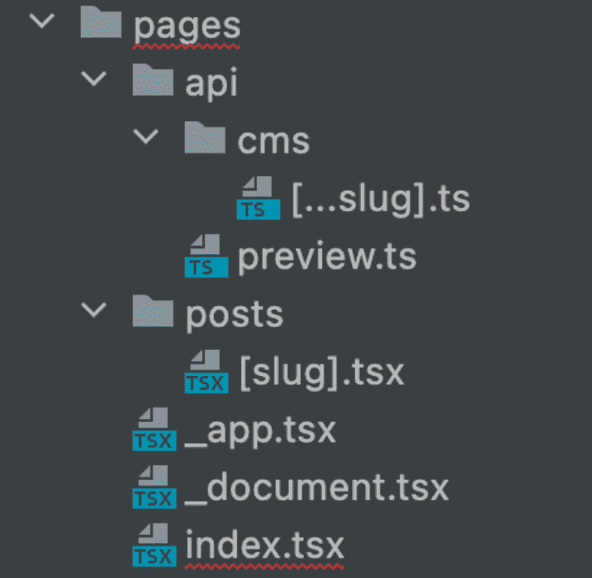
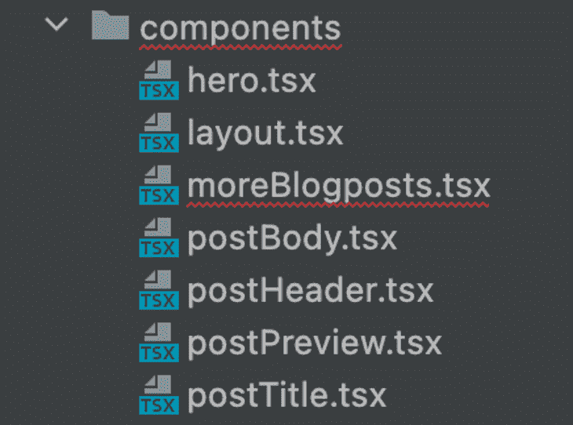
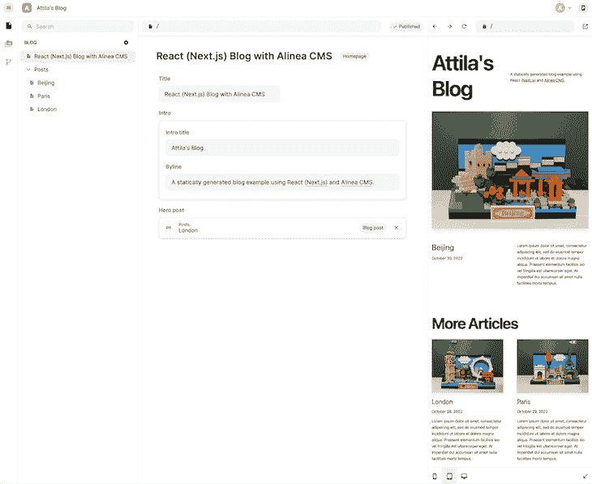
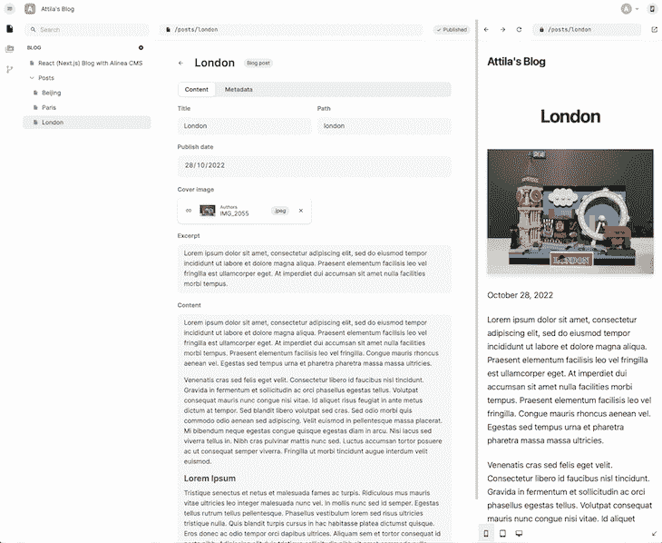

# 用 Alinea 和 React 构建更快的博客

> 原文：<https://blog.logrocket.com/building-faster-blogs-alinea-react/>

我保证这篇文章最激动人心的部分不会是你在一篇博文中读到的如何建立博客。😄让这本书真正吸引人的是，你将在 [Alinea](https://alinea.sh/) 中创建你的新博客，这是一个用 TypeScript 编写的新 CMS。

如果你是内容管理系统和类型化语言的狂热爱好者，并且你已经准备好发现非常新颖和有趣的 Alinea，我建议你带上你最喜欢的饮料，卷起袖子，跟随我踏上发现这种新的 CMS 的旅程。

这些年来，我用过很多内容管理系统。作为一个已经写了 18 年博客的人，CMSs 一直是我的心头好。从 WordPress、Joomla、CouchCMS，甚至 Gatsby，我已经尝试了多种解决方案，每次都得出了相同的结论:你需要为正确的工作使用正确的工具。

考虑到这一点，让我们来探索 Alinea，了解它最适合什么，谁会最常使用它。

在撰写本文时，Alinea 还处于测试阶段，这很令人兴奋，因为您可以尝试一些新的闪亮的东西，并在下一次编码器会议上吹嘘它。然而，我对它的体验可能不是你的体验的翻版。测试版软件总是带有额外的不可预测性和后来的变化，这些可能不会反映在本文中。

*向前跳转:*

## 使用 React 设置新的 Alinea 应用程序

对于一些硬件和软件环境，我在一台苹果硅 MacBook Air M2 上开发了这篇 Alinea 博客，它有 16 GB 的 RAM 和 512 GB 的 SSD。它在 macOS v12.6 上，运行 Node.js v16.16。没有 Docker 映像，没有虚拟机，没有什么特别的，设置非常简单——这就引出了我的第一点。

当构建一个新的 Alinea 博客时，您最好从一个主机应用程序开始。在这里，我们将使用一个简单的 [React 应用](https://blog.logrocket.com/tag/react/)和 [Next.js](https://blog.logrocket.com/tag/nextjs/) ，因为它得到了 Alinea 的良好支持，并且[更适合 SEO](https://blog.logrocket.com/how-next-js-can-help-improve-seo/) 。没有比运行每个人都喜欢的 React 命令更简单的方法了:

```
npx [email protected] --typescript 

```

为了忠实于 Alinea 交付类型化解决方案的使命，我认为我们的主机应用程序应该是 TypeScript。这个练习的重点不会是[打字稿](https://blog.logrocket.com/tag/typescript/)，我们将保持这一部分的基本性。同样值得注意的是，Alinea 作为一个 [JavaScript](https://blog.logrocket.com/tag/vanilla-javascript/) 项目运行良好。要启用它，请将您的`alinea.config.tsx`文件重命名为`alinea.config.js`。对于那些刚接触 TypeScript 的人，我建议这样做，并查看我们的在 React 中使用 TypeScript 的[指南。](https://blog.logrocket.com/your-reference-guide-to-using-typescript-in-react/)

一旦 React 应用程序启动并运行，您就可以通过使用`npm install alinea`安装它来开始使用项目目录中的 Alinea 了。

让我们通过在命令行中键入以下命令来初始化它并在浏览器中启动它:`npx alinea init`然后是`npx alinea serve`。仅此而已。文章结束。享受你的新 CMS。😆

好吧，好吧，我是在开玩笑，当然，但是你必须明白让我们的新 CMS 运行起来是多么的简单。🙂一帆风顺到目前为止，所以让我们的新 CMS 为我们做一些工作！

## 创建博客页面和类型

创建博客有几种方法；不管怎样，你最终可能会创建网页和博客文章。如果你的博客支持多租户——多作者——你也有一个作者类型。为了简洁起见，我们将重点关注页面和博客文章。

Alinea 基于[配置文件](https://blog.logrocket.com/creating-configuration-files-node-js-using-node-config/)运行。这可以是一个文件，也可以分解成多个更小的配置文件。我认为后者是更好的方法，因为它使事情更容易理解和管理。

所以，事不宜迟，让我们为主页、博客页面和博客文章创建主`config`文件和每个相关文件。

当你运行`npx alinea init`时，它创建了`alinea.config.tsx`。让我们用更容易管理的东西来替换它的内容，就像这样:

```
import {IcRoundInsertDriveFile} from '@alinea/ui/icons/IcRoundInsertDriveFile'
import {IcRoundPermMedia} from '@alinea/ui/icons/IcRoundPermMedia'
import {alinea, BrowserPreview, MediaSchema} from 'alinea'
import {BlogCollection, BlogPost, HomePage} from './schema'

const schema = alinea.schema({
  ...MediaSchema,
  HomePage,
  BlogCollection,
  BlogPost
})

export const config = alinea.createConfig({
  schema,
  dashboard: {
    staticFile: './public/admin.html',
    dashboardUrl: '/admin.html',
    handlerUrl: '/api/cms'
  },
  workspaces: {
    main: alinea.workspace('Blog', {
      source: './content',
      mediaDir: './public/assets',
      roots: {
        pages: alinea.root('Blog', {
          icon: IcRoundInsertDriveFile,
          contains: ['HomePage', 'BlogCollection']
        }),
        assets: alinea.root('Assets', {
          icon: IcRoundPermMedia,
          contains: ['MediaLibrary']
        })
      },
      preview({entry, previewToken}) {
        const location =
          process.env.NODE_ENV === 'development' ? 'http://localhost:3000' : ''
        if (['Author', 'BlogCollection'].includes(entry.type)) return null
        return (
          <BrowserPreview
            url={`${location}/api/preview?${previewToken}`}
            prettyUrl={entry.url}
          />
        )
      }
    })
  }
})
```

让我们看看这里有什么。首先，我们做一些特定于 Alinea 的导入和`schema`文件，我们还没有创建它们。文件的其余部分是为 CMS 设置模式和创建配置。其中，这也利用了模式。为了更好地理解这一点，让我们也设置博客页面、主页和博客帖子，这样我们就可以在 CMS 中显示它们。

在您的`root`文件夹中，创建另一个名为`schema`的目录。在内部，让我们创建以下四个文件:

*   `index.ts`
*   `homePage.ts`
*   `blogCollection.ts`
*   `blogPost.ts`

在`index.ts`文件中，导出另外三个`schema`文件，如下所示:

```
export * from './blogCollection'
export * from './blogPost'
export * from './homePage'
```

在`homePage.ts`文件中，设置我们希望在 CMS 中可用的`fields`和`data`类型:

```
import {Entry} from '@alinea/core'
import alinea from 'alinea'

export const HomePage = alinea.type('Homepage', {
  title: alinea.text('Title', {width: 0.5}),
  path: alinea.path('Path', {hidden: true}),
  intro: alinea.object('Intro', {
    fields: alinea.type('Intro fields', {
      title: alinea.text('Intro title'),
      byline: alinea.richText('Byline')
    })
  }),
  heroPost: alinea.entry('Hero post', {
    condition: Entry.type.is('BlogPost')
  })
})
```

非常类似地，在`blogCollection.ts`文件中，我们也将设置`type`和`data`。这实质上是一个容器，用于存放您稍后将创建的所有博客文章:

```
import alinea from 'alinea'

export const BlogCollection = alinea
  .type('Blog posts', {
    title: alinea.text('Title', {width: 0.5}),
    path: alinea.path('Path', {width: 0.5})
  })
  .configure({
    isContainer: true,
    contains: ['BlogPost']
  })
```

最后，让我们看看`blogPost.ts`本身，它定义了我们在每个帖子中可以拥有的数据:

```
import {Entry} from '@alinea/core'
import alinea from 'alinea'

export const BlogPost = alinea.type(
  'Blog post',
  alinea.tabs(
    alinea.tab('Content', {
      title: alinea.text('Title', {width: 0.5}),
      path: alinea.path('Path', {width: 0.5}),
      date: alinea.date('Publish date'),
      coverImage: alinea.image('Cover image', {width: 0.5}),
      author: alinea.entry('Author', {
        width: 0.5,
        condition: Entry.type.is('Author')
      }),
      excerpt: alinea.richText('Excerpt'),
      content: alinea.richText('Content')
    }),
    alinea.tab('Metadata', {
      ogImage: alinea.image('OG Image')
    })
  )
)
```

这就是关于轻量级博客 CMS 的设置和配置。当然，您可以在这个基本配置的基础上进行构建。为此，请参考[官方文档](https://alinea.sh/docs/intro)。现在，让我们将 CMS 连接到我们的前端，即我们在第一步中创建的 React 应用程序。

## 向前端获取数据

现在，人们可能希望在`.alinea`文件夹中设置我们的模式和生成的文件足以简单地从 CMS 中的页面和帖子中提取数据。不幸的是，这还不够。有几种方法可以做到这一点，但是我将向您展示获取数据的最干净也可能是最简单的方法。此外，这也是 Alinea 的演示项目中推荐的方法。因此，让我们创建一个小的`“API”`来提取所有的数据。

首先，在你的`root`文件夹中创建一个`api`目录，在里面添加一个名为`api.ts`的文件，看起来应该是这样的:

```
import {initPages} from '@alinea/content/pages'
import {PreviewData} from 'next'

export function createApi(previewToken?: PreviewData) {
  const pages = initPages(previewToken as string)
  return {
    async getHomePage() {
      return pages.whereType('HomePage').sure()
    },
    async getPostSlugs() {
      return pages.whereType('BlogPost').select(page => page.path)
    },
    async getPostBySlug(slug: string) {
      return pages.whereType('BlogPost').first(page => page.path.is(slug))
    },
    async getAllPosts() {
      return pages.whereType('BlogPost').select(page => ({
        title: page.title,
        date: page.date,
        path: page.path,
        author: page.author,
        coverImage: page.coverImage,
        excerpt: page.excerpt
      }))
    }
  }
}
```

我们在这里真正做的是在视图代码中使我们的生活更容易。随着您添加更多的页面和内容类型，您可以使用额外的端点来扩展这个文件。整洁！

## 在视图中显示数据

这可能是这个过程中最复杂的部分，但也给你提供了最大的自由。此时，您将通过我们在上一步中创建的“`API`”来提取数据，并将其显示在屏幕上。

也就是说，它不仅仅是一个简单的`view`文件。我们至少需要几页纸和一些支持组件，所以在你的`root`目录中，创建两个额外的文件夹:`pages`和`components`。

## 为你的 Alinea 博客创建页面

在`pages`文件夹中，我们还将创建另外两个目录:`api`和`posts`。在`api`文件夹中，我们将有一个`cms`文件夹在里面，我们将创建一个`[slug].ts`文件，而在`api`中，我们将有一个名为`preview.ts`的文件。

然后，在`posts`文件夹中，我们将只有一个文件，我们将它命名为`[slug].tsx`。最后，在`pages`中，我们将创建三个文件:`index.tsx`、`_document.tsx`和`_app.tsx`。

我知道，有很多文件夹和文件，可能很难跟上。所以，这里有一张你的文件夹和文件结构的截图:



每个文件中的内容更多的是关于 [React 和 Next.js](https://blog.logrocket.com/creating-website-next-js-react/) 而不是 Alinea，所以我就不赘述了。然而，您将会看到 CMS 提供了一些额外的组件，例如`RichText`和`TextDoc`。让我们看看我们的网页。

### `pages/index.tsx`

这里没什么特别的。我们的主页有几个标题和副标题，以及一个由来自 Alinea 的`props`填充的`hero`帖子:

```
import {Page} from '@alinea/content'
import Head from 'next/head'
import Hero from '../components/hero'
import Layout from '../components/layout'
import MoreBlogposts from '../components/moreBlogposts'
import {createApi} from '../api/api'
import {RichText} from '@alinea/ui'
import {TextDoc} from 'alinea'

type Props = {
  home: Page.Home
  allPosts: Page.BlogPost[]
  title: string
  byline: TextDoc
}

export default function Index({title, byline, home, allPosts}: Props) {
  const heroPost = allPosts[0]
  const morePosts = allPosts.slice(1)
  return (
    <>
      <Layout>
        <Head>
          <title>{home.title}</title>
        </Head>
        <div>
            <h1>
              {title}
            </h1>
            <h4>
              <RichText
                  doc={byline}
                  a={
                    <a/>
                  }
              />
            </h4>
          {heroPost && (
            <Hero
              title={heroPost.title}
              coverImage={heroPost.coverImage?.src}
              date={heroPost.date}
              slug={heroPost.path}
              excerpt={heroPost.excerpt}
            />
          )}
          {morePosts.length > 0 && <MoreBlogposts posts={morePosts} />}
        </div>
      </Layout>
    </>
  )
}

export const getStaticProps = async context => {
  const api = createApi(context.previewData)
  const home = await api.getHomePage()
  const allPosts = await api.getAllPosts()
  return {
    props: {home, allPosts}
  }
}
```

### `pages/_document.tsx`

Next.js 中所有其他组件的根是最普通的标准。这里没有什么 Alinea 特有的东西需要担心。但是，请确保在`HTML`标签中设置了语言，因为它有利于[的可访问性](https://blog.logrocket.com/a-developers-guide-to-designing-accessible-websites/):

```
import {Head, Html, Main, NextScript} from 'next/document'

export default function Document() {
  return (
    <Html lang="en">
      <Head />
      <body>
        <Main />
        <NextScript />
      </body>
    </Html>
  )
}
```

### `pages/_app.tsx`

这只是一个`root`组件，所以和其他组件一样，没什么特别的。除了在 CMS 中启用预览的`useNextPreview`,它的样板 Next.js 代码:

```
import {useNextPreview} from '@alinea/preview/next'
import {AppProps} from 'next/app'

export default function MyApp({Component, pageProps}: AppProps) {
  useNextPreview()
  return <Component {...pageProps} />
}
```

### `pages/api/cms/[...slug].ts`

对于这个特殊的文件，我想我需要给出一些额外的上下文；不然看起来太隐晦了。`nodeHandler`实用程序基本上将后端句柄导出为 Node.js `http`处理程序，然后生成的后端文件将连接到后端。CMS API 路由在`/api/cms/[...slug]`处理，最后，我们禁用 Next.js 注入的`bodyParser`，让处理程序处理它:

```
import {nodeHandler} from '@alinea/backend/router/NodeHandler'
import {backend} from '@alinea/content/backend'
export default nodeHandler(backend.handle)
export const config = {api: {bodyParser: false}}
```

### `pages/api/preview.ts`

在这里，`previewToken`从`/api/preview?token` URL 得到解析，我们要求 Alinea 解析并验证它。这将导致访问我们正在预览的条目的 URL。这个令牌存储在 Next.js 上下文中，这样我们以后可以在下一个路由中使用它来查询草稿。

Next.js 依靠临时 cookie 来实现并保持这一点。最后，重定向到我们实际想要查看的页面会这样做:

```
import {backend} from '@alinea/content/backend'
import type {NextApiRequest, NextApiResponse} from 'next'

export default async function handler(
  req: NextApiRequest,
  res: NextApiResponse
) {
  const previewToken = req.url!.split('?').pop()
    const {url} = await backend.parsePreviewToken(previewToken)

  res.setPreviewData(previewToken)

  res.redirect(url)
}
```

### `pages/posts/[slug].tsx`

同样，相对简单的东西。为了呈现我们的个人博客文章，我们确保它有一个在浏览器选项卡中也可见的标题。在这里，添加一个标题图像和文章的正文，并使用 Alinea 提供的道具:

```
import {Page} from '@alinea/content'
import {GetStaticPropsContext} from 'next'
import ErrorPage from 'next/error'
import Head from 'next/head'
import {useRouter} from 'next/router'
import Layout from '../../components/layout'
import PostBody from '../../components/postBody'
import PostHeader from '../../components/postHeader'
import PostTitle from '../../components/postTitle'
import {createApi} from '../../api/api'

type Props = {
  post: Page.BlogPost
  morePosts: Page.BlogPost[]
  preview?: boolean
}

export default function Post({post, morePosts, preview}: Props) {
  const router = useRouter()
  if (!router.isFallback && !post?.path) {
    return <ErrorPage statusCode={404} />
  }
  const title = `${post.title} | Next.js Blog Example with Alinea`
  return (
    <Layout preview={preview}>
        <h1>Attila's Blog</h1>
        {router.isFallback ? (
          <PostTitle>Loading...</PostTitle>
        ) : (
          <>
            <article>
              <Head>
                <title>{title}</title>
                <meta property="og:image" content={post.ogImage?.src} />
              </Head>
              <PostHeader
                title={post.title}
                coverImage={post.coverImage?.src}
                date={post.date}
              />
              <PostBody content={post.content} />
            </article>
          </>
        )}
    </Layout>
  )
}

type Params = {
  slug: string
}

export async function getStaticProps({
  params,
  previewData
}: GetStaticPropsContext<Params>) {
  const api = createApi(previewData)
  const post = await api.getPostBySlug(params.slug)
  return {
    props: {post}
  }
}

export async function getStaticPaths(context) {
  const api = createApi(context.previewData)
  const slugs = await api.getPostSlugs()
  return {
    paths: slugs.map(slug => {
      return {
        params: {slug}
      }
    }),
    fallback: false
  }
}
```

您可以看到，我们最终利用了之前创建的`API`和来自 Alinea 的查询内容。我们还导入了许多我们还没有的组件，所以让我们在最后一步解决这个问题。

## 为你的 Alinea 博客构建组件

您的组件可以像您希望的那样简单或复杂。为了简洁起见，我试图让它们足够简单，现在让浏览器来处理样式。最终，这完全是 React 的领域，所以无论你想在组件和样式方面做什么都是完全允许的。Alinea 对你在前端能做什么或不能做什么没有真正的发言权。

也就是说，让我们在`components`目录中创建一些组件。这只是普通的 React 和 Next，所以我不会解释视图代码的细节，除非有 Alinea 特有的东西。您的`components`文件应该是:

*   `hero.tsx`
*   `layout.tsx`
*   `moreBlogposts.tsx`
*   `postBody.tsx`
*   `postHeader.tsx`
*   `postPreview.tsx`
*   `postTitle.tsx`

为了避免混淆，下面是它应该是什么样子的截图:



### `components/hero.tsx`

这是显示在主页上的`hero` post 组件，正如您所料，我们只需要一个`image`、`link`、`title`和`body`。在这种情况下，`excerpt`来自 Alinea，同时也依赖于 Alinea 的`RichText`组件:

```
import {RichText} from '@alinea/ui'
import {TextDoc} from 'alinea'
import Link from 'next/link'

type Props = {
  title: string
  coverImage: string
  date: string
  excerpt: TextDoc
  slug: string
}

const Hero = ({title, coverImage, date, excerpt, slug}: Props) => {
  return (
    <section>
      
      <h3>
        <Link as={`/posts/${slug}`} href="/posts/[slug]">
          {title}
        </Link>
      </h3>
      <p>{date}</p>
          <RichText
            doc={excerpt}
            p={<p/>}
          />
    </section>
  )
}

export default Hero
```

### `components/layout.tsx`

这是布局包装器在 React 中最基本的功能。它自然支持子组件:

```
type Props = {
  preview?: boolean
  children: React.ReactNode
}

const Layout = ({ children }: Props) => {
  return (
    <>
        <main>{children}</main>
    </>
  )
}

export default Layout
```

### `components/moreBlogposts.tsx`

该组件有一个角色，并且只有一个角色——映射所有帖子，并通过`PostPreview`组件在页面中显示`excerpts`:

```
import {BlogPost} from '../schema'
import PostPreview from './postPreview'

type Props = {
  posts: BlogPost[]
}

const MoreBlogposts = ({posts}: Props) => {
  return (
    <section>
      <h2>
        More Blogposts
      </h2>
      <div>
        {posts.map(post => (
          <PostPreview
            key={post.path}
            title={post.title}
            coverImage={post.coverImage?.src}
            date={post.date}
            slug={post.path}
            excerpt={post.excerpt}
          />
        ))}
      </div>
    </section>
  )
}

export default MoreBlogposts
```

### `components/postBody.tsx`

组件名是不言自明的。这是我们构建博客文章的地方。`TextDoc`是内容本身，然后作为`prop`传递给 Alinea 的`RichText`组件:

```
import {RichText} from '@alinea/ui'
import {TextDoc} from 'alinea'

type Props = {
  content: TextDoc
}

const PostBody = ({content}: Props) => {
  return (
    <div>
        <RichText doc={content} />
    </div>
  )
}

export default PostBody
```

我希望现在一切都开始有意义了，因为我们已经在这里建立了一个模式。就像我们如何构建主体一样，我们将为博客文章单独构建标题。请注意，您不必将这些作为单独的组件来做，但毕竟是 React，所以当您可以分解事物时，您可能应该:

```
type Props = {
  title: string
  coverImage: string
  date: string
}

const PostHeader = ({title, coverImage, date}: Props) => {
  return (
    <>
        <h2>{title}</h2>
        
        <p>{date}</p>
    </>
  )
}

export default PostHeader
```

### `components/postPreview.tsx`

在这里，我们有更多以前合作过的`image`、`link`、`date`和`excerpts`。但是，这一次，对于预览视图。哦，对了，为了[的可访问性目的](https://www.youtube.com/watch?v=cTTth6Tr7q0)，我强烈推荐给图片添加替代文本:

```
import {RichText} from '@alinea/ui'
import {TextDoc} from 'alinea'
import Link from 'next/link'

type Props = {
  title: string
  coverImage: string
  date: string
  excerpt: TextDoc
  slug: string
}

const PostPreview = ({
  title,
  coverImage,
  date,
  excerpt,
  slug
}: Props) => {
  return (
    <div>
        
      <h3>
        <Link as={`/posts/${slug}`} href="/posts/[slug]">
          {title}
        </Link>
      </h3>
        <p>{date}</p>
      <RichText
        doc={excerpt}
        p={<p/>}
      />
    </div>
  )
}

export default PostPreview
```

### `components/postTitle.tsx`

最后，有一个`title`组件去与我们的身体。这是一个简单的标题一级反应组件，带孩子:

```
import { ReactNode } from 'react'

type Props = {
  children?: ReactNode
}

const PostTitle = ({ children }: Props) => {
  return (
    <h1>
      {children}
    </h1>
  )
}

export default PostTitle
```

仅有的两个与 Alinea 相关的依赖项是循环的`RichText`和`TextDoc`。两者的文档都可以在 [Alinea 文档页面](https://alinea.sh/docs/intro)找到。为了这次演示，我还从 Alinea 的一个示例项目中的[借鉴了一些风格。尽管如此，我们仍然非常欢迎您添加自己的项目或克隆整个项目，并用您的内容、数据类型和可编辑区域来替换它。这就是开源的力量！😉总之，我的最终结果看起来像这样:](https://github.com/alineacms/alinea/tree/main/examples/framework-next)





> 注意:CMS 本身的样式默认来自 Alinea 没有额外的工作是必要的

## 最后的想法

虽然这并不意味着是对 Alinea 的回顾，但我认为在用新的 CMS 构建博客的过程中，有几件事情值得一提。首先，正如每一个测试版软件一样，这些问题还有待解决，所以在开发过程中，我感觉有些脆弱。

其次，文档并不完全符合我的预期。我不得不在文档和示例项目之间来回移动，以弄清楚发生了什么，以及各个部分是如何组合在一起的。用 Alinea 写博客绝不是一件简单的事情。虽然这是一个很有前途的发展，但它还没有成熟到可以成为其他任何东西的替代品。

尽管如此，即使是在测试阶段，也可以用 React 和 TypeScript 构建一个功能良好、外观合理、可部署的 Alinea 博客。我建议从示例项目中的[开始，因为这将为您在早期阶段省去许多麻烦。](https://github.com/alineacms/alinea/tree/main/examples)

不可否认的是，Alinea 通过模式生成嵌入式 SQLite 数据库的方法，然后作为源代码的一部分推出，导致极快的查询时间，这是优于其他一些传统 CMS 的一个优势。除此之外，即时预览，你有一个潜在的胜利组合的功能，易用性和速度。

## [LogRocket](https://lp.logrocket.com/blg/react-signup-general) :全面了解您的生产 React 应用

调试 React 应用程序可能很困难，尤其是当用户遇到难以重现的问题时。如果您对监视和跟踪 Redux 状态、自动显示 JavaScript 错误以及跟踪缓慢的网络请求和组件加载时间感兴趣，

[try LogRocket](https://lp.logrocket.com/blg/react-signup-general)

.

[ ](https://lp.logrocket.com/blg/react-signup-general) [](https://lp.logrocket.com/blg/react-signup-general) 

LogRocket 结合了会话回放、产品分析和错误跟踪，使软件团队能够创建理想的 web 和移动产品体验。这对你来说意味着什么？

LogRocket 不是猜测错误发生的原因，也不是要求用户提供截图和日志转储，而是让您回放问题，就像它们发生在您自己的浏览器中一样，以快速了解哪里出错了。

不再有嘈杂的警报。智能错误跟踪允许您对问题进行分类，然后从中学习。获得有影响的用户问题的通知，而不是误报。警报越少，有用的信号越多。

LogRocket Redux 中间件包为您的用户会话增加了一层额外的可见性。LogRocket 记录 Redux 存储中的所有操作和状态。

现代化您调试 React 应用的方式— [开始免费监控](https://lp.logrocket.com/blg/react-signup-general)。