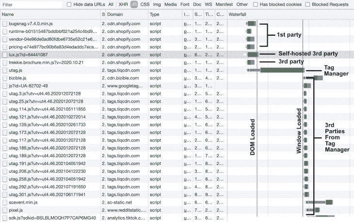

# 为核心网站生命建立更快的网页

> 原文：<https://blog.logrocket.com/building-faster-webpages-for-core-web-vitals/>

这篇文章的目的是检查前端开发者如何建立快速登陆页面，以核心网站的活力来判断。

这些网页性能指标是谷歌搜索的新排名信号，也是数字营销人员和 SEO 专业人士关注的问题。自从谷歌在 2000 年 5 月宣布了它们，企业主们要求前端开发者修复缓慢的页面并建立更快的页面。

既然核心 Web Vitals 已经开始推出，我就去寻找最好的前端性能模式。

## 什么是核心网站生命？

核心 Web Vitals 的主题包括三个以用户为中心的网页性能指标，这些指标来自真实的 Chrome 用户数据(CrUX)。在连续 28 天的时间内，分数累计到第 75 个百分点。这三个指标是:

1.  最大内容绘画(LCP):网站在屏幕上显示最大元素所需的时间。用户应该在 2.5 秒内看到它
2.  首次输入延迟(FID):这是衡量网页响应用户输入的时间，应该在 100 毫秒以内
3.  累积布局偏移(CLS):这是页面加载时网页元素和布局的意外偏移，因此最好避免在加载期间偏移页面布局

根据使用最慢连接和设备的用户来衡量您的页面是至关重要的。

因此，我把我的连接速度调到了 3G，把我的 CPU 速度降低了 6 倍。只有这样，我才能揭露谷歌搜索控制台报告的问题。

## 提高您的核心网络生命指数得分

解决页面速度问题的秘诀是对已经有良好生命力的页面进行逆向工程。首先，我需要一种大多数网站通用的页面类型，因此，出于本文的目的，我选择测量无处不在的定价页面，因为它们在网站之间在视觉上是相似的，并且通常包括一个突出的行动号召。

然后，我用 [Lighthouse](https://developers.google.com/speed/pagespeed/insights/) 测试了 114 个手机页面，并将它们与核心网页指标进行了比较。这给我留下了 25 个快速登陆页面来分析。

这些网站上的技术从 Next.js 到 WordPress 再到 Ruby on Rails，有些甚至使用了 jQuery。无论你(被迫)使用哪种堆栈，总有一种方法可以提高你的核心网页重要分数。

由于这些模式是使用谷歌 Chrome 用户体验报告(CrUX)的数据从现有页面逆向工程而来的，我相信如果你遵循它们，你将建立一个快速的网页，甚至修复一个缓慢的网页。

要自己研究这些模式，我建议加载页面，然后查看源代码。

### 将后端时间保持在 600 毫秒以下

最快的 10 个站点的服务器响应时间从 75 毫秒到 380 毫秒不等，中间值为 110 毫秒。外卖？现场的第 75 百分位可能需要始终低于 600 毫秒。

### 计算绩效预算

在查看代码之前，我建议对所请求的文件进行清点，并按内容类型进行分类。然后将您的页面与快速页面进行比较。这就是所谓的绩效预算。

我通过分解在最大内容绘制(LCP)之前加载的每种类型的文件来创建我的预算。例如， [Shopify](https://www.shopify.com/pricing) 加载了超过 100 个文件，但是在构建页面时，它在最大内容绘制之前加载了 17 个文件。

在 LCP 之前，快速页面通常加载:

*   总共少于 35 个文件
*   四个或更少的第三方脚本
*   没有媒体文件
*   只有两个样式表
*   不超过 10 个脚本
*   多达四种自定义字体
*   多达 15 幅图像

### 在 LCP 之前预连接到请求的域

正确构建的页面从找到这 35 个文件使用的所有域开始，然后使用`preconnect`资源提示。 [Shopify](https://www.shopify.com/pricing) 使用此模式预连接至关键域:

```
<head>
      <link rel="preconnect" href="https://cdn.shopify.com" />
      <link rel="preconnect" href="https://monorail-edge.shopifysvc.com" />
      <link rel="preconnect" href="https://sessions.bugsnag.com" />
      <link rel="preconnect" href="https://www.google-analytics.com" />
      <link rel="preconnect" href="https://www.googletagmanager.com" />
      <link rel="preconnect" href="https://bat.bing.com" />
      <link rel="preconnect" href="https://www.facebook.com" />
      <link rel="preconnect" href="https://connect.facebook.net" />
      <link rel="preconnect" href="https://tags.tiqcdn.com" />
      <link rel="preconnect" href="https://lux.speedcurve.com" />
</head>

```

这允许浏览器在请求文件之前打开连接。

### 预加载和托管字体文件

大多数网站依赖自定义字体，并使用`font-display: swap`以便在自定义字体被下载之前文本是可见的。 [PosterMyWall](https://www.postermywall.com/index.php/premium) 是字体预加载和自托管模式的一个例子。这是加载和呈现自定义字体的最快方式。

```
<head>
     <link rel="preload"
href="https://www.postermywall.com/assets/fonts/NunitoSans/NunitoSans-R
egular.woff2"
     as="font" type="font/woff2" crossorigin="anonymous">
<!-- Suggested improvement →
<link rel="preload" as="style"
      href="https://pro.fontawesome.com/releases/v5.13.0/css/all.css"
      onload=”this.rel='stylesheet'">
</head>

```

如果你需要使用谷歌字体，你应该使用 Mario Ranftl 的 [google-web-fonts-helper](https://google-webfonts-helper.herokuapp.com/fonts) 。

### 避免图标字体

避免图标字体的主要原因是它们[会创建一个请求链](https://web.dev/critical-request-chains/)。这意味着根文档必须加载一个样式表，该样式表又会在呈现图标之前加载图标字体文件。但是具有高度和宽度属性的简单图像没有依赖性。

如果需要使用图标字体， [Sproutsocial](https://sproutsocial.com/trial/) 在预加载字体和异步加载字体时会给出一个有用的模式。我还建议预加载图标字体文件。

```
<head>
<link rel="preload" as="style"
      href="https://pro.fontawesome.com/releases/v5.13.0/css/all.css"
      onload=”this.rel='stylesheet'">
<!-- My recommendation -->
<link rel="preload"
            href="https://pro.fontawesome.com/releases/v5.13.0/webfonts/fa-so    lid-900.woff2"
      as="font" type="font/woff2"
crossorigin="anonymous">
</head>

```

我也看到了内联添加`@fontface`规则的好处，它消除了呈现阻塞`all.css`。

### 不需要内联关键的 CSS 样式

我惊讶地发现，许多网站没有内嵌样式。相反，他们创建小的 CSS 包来加载到`<head>`中。例如， [Loom](https://www.loom.com/pricing) 预加载总大小约为 15KB 的外部样式表。

也就是说， [Amazon AWS](https://aws.amazon.com/ec2/pricing/) 加载了一个 74KB 的渲染阻塞 CSS 文件。所以，不要因为 Lighthouse 或者某个帖子(像这样)推荐就随便用一个模式。

```
<head>
  <link rel="preload" href="/_next/static/css/4971ebe5c5a60f5f989b.css"
    as="style" />
  <link rel="stylesheet" href="/_next/static/css/4971ebe5c5a60f5f989b.css"/>
  <link rel="preload" href="/_next/static/css/33a02aaca547371a75e0.css"
    as="style" />
  <link rel="stylesheet" href="/_next/static/css/33a02aaca547371a75e0.css"/>
</head>

```

### 加载小型 JavaScript 包

我的预算建议在最大的内容丰富的绘画之前不要超过 10 个脚本。这并不允许加载 10 个大文件，但是最好的网站会在页面底部加载小脚本(2 到 35KB ),智能地应用`async`或`defer`属性。

有几个网站使用 [Next.js](https://nextjs.org/docs/basic-features/script) ，它提供了在交互式交付 JavaScript 内联之前和之后加载脚本的能力，以及延迟加载脚本的能力(对于第三方供应商来说非常优秀)。脚本也是预加载的。

如果您在[预加载脚本](https://medium.com/reloading/a-link-rel-preload-analysis-from-the-chrome-data-saver-team-5edf54b08715#.bgj9qkqfr)时有不同的技术堆栈，请注意资源排序。

### 对小图像使用内联 SVG，其余的延迟加载

如果你有相对较小的 SVG 图像，那么就把它们内联起来。Trello 内联文件夹上方的所有 SVG 图像，然后延迟加载屏幕外或隐藏的图像。

我也对折叠上方的图片使用了`loading=eager`。像 Trello 这样的站点使用原生的`loading=lazy`属性，但是也观察到了 JavaScript 解决方案。

```
<body>
     <svg
        height="16"
        viewBox="0 0 16 16"
        width="16"
        <path>...</path>
      </svg>
      <!-- Native -->
      
      <!-- Script -->
      
</body>

```

### 使用`<picture>`元素显示一个大的英雄图像

所分析的页面中没有一个包含英雄图像组件，所以我搜索并找到了 [Trulia](https://www.trulia.com/) ，它采用了一种新颖的模式。一开始，他们设定了一个[的绩效指标](https://developer.mozilla.org/en-US/docs/Web/API/PerformanceMark)，这向我表明了高度的故意。

冒着过于简化的风险，我观察到对于大的英雄图像，开发人员使用了包含 19 个`<source>`元素的`<picture>`元素，覆盖了所有类型的用例。不仅图像大小和压缩适合桌面和移动设备，而且它们利用了`<picture>`艺术指导功能。这也告诉我，UX 团队是这个解决方案的一部分。

```
<picture class="Picture__PictureContainer-sc-1exw3ow-1 gteZiU">
<source
      srcSet="https://www.trulia.com/images/app-shopping/homePage/extraLarge.jpg"
      media="(min-width:993px)" />
<source
      srcSet="https://www.trulia.com/images/app-shopping/homePage/medium.jpg"
      media="(min-width:768px)" />
<source
      srcSet="https://www.trulia.com/images/app-shopping/homePage/medium.jpg"
      media="(min-width:570px)" />
<source
      srcSet="https://www.trulia.com/images/app-shopping/homePage/small.jpg"
      media="(min-width:376px)" />
<source
      srcSet="https://www.trulia.com/images/app-shopping/homePage/small.jpg"
      media="(min-width:0px)" />

</picture>

```

此外，为了模拟背景图像，他们使用`position`属性对几个`<div>`元素进行分层，以完成组件。结果是惊人的。

* * *

### 更多来自 LogRocket 的精彩文章:

* * *

在[桌面](https://www.webpagetest.org/video/compare.php?tests=210716_BiDcM9_f42417c626a589a7180880e7aead5719-r%3A1-c%3A0&thumbSize=200&ival=100&end=visual)上，大背景图像出现在 600ms，LCP 出现在 900ms。然后在[一个慢速移动设备](https://www.webpagetest.org/video/compare.php?tests=210716_AiDcTS_9529009471a867b44a87e1157f5009cd-r%3A1-c%3A0&thumbSize=200&ival=100&end=visual)上，1.8s 出现，2.2s 完成

意象绘画的秘密是巧妙的。

``元素有一个内嵌样式设置，一个 base 64 编码，一个 10px 乘 5px 的 JPG 作为背景图像，高度和宽度设置为 100%。这就是为什么它绘画如此之快，并且有一个很好的效果，使图像从模糊变得清晰。哇哦。

### 当`<readyState>`交互时加载第三方脚本

管理第三方供应商具有挑战性，尤其是当预算建议在 LCP 之前只加载四个脚本时。尽管如此，企业仍然可以使用第三方供应商，因为分析的页面平均要求完全加载 103 个第三方文件。所以我开始研究最好的页面是如何处理供应商脚本的。

最好的模式是在`readyState`之前加载多达四个脚本(即标签管理器、AB 测试、RUM)是交互式的，然后在`document.readyState`之后加载剩余的是`complete`。

```
<head>
    <link rel="preconnect" href="https://assets.adobedtm.com" />
</head>
<body>
      <!-- Bottom of HTML →
<script src="https://assets.adobedtm.com/launch-EN.min.js" async></script>
<! -- Self-host -->
<script src="https://cdn.shopify.com/speedcurve-lux/js/lux.js?id=64441087" async defer crossorigin="anonymous"></script>
</body>

```

如果你雇佣了一个标签管理器，瀑布应该是意料之中的。它在`DOMContentLoaded`之前加载关键的第三方，包括你的标签管理器脚本。然后，将[浏览器事件触发器](https://support.google.com/tagmanager/answer/7679319?hl=en)设置为**窗口加载**，用于所有剩余的脚本。



这描述了最佳模式。然而，你的情况可能需要一些不那么咄咄逼人的东西。要点是控制何时加载脚本，不仅仅是对供应商，而是对所有脚本，以便优化瀑布。

## 数据驱动模式提高核心网络活力

我确信在解决 LCP 问题时我错过了一些东西，但是这些案例研究强调了为什么核心 Web 关键点(首次输入延迟)不能产生更好的 JavaScript 模式。

此外，我不希望这些高质量的网站失败的累积布局转变。但是，我想如果我分析广告支持的文章而不是定价页面，我会发现更多的 CSS 模式。

这个分析并不意外。所有这些模式都有很好的文档记录，除了使用图片元素作为大的英雄图像。

但是如果你正在选择一个解决方案，我会推荐使用这些模式，它们基于案例研究而不是 Lighthouse 列出的建议。