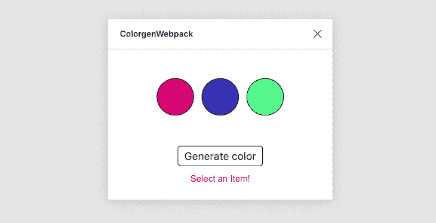

# 用 React 构建 Figma 插件

> 原文：<https://blog.logrocket.com/building-figma-plugins-with-react/>

## 介绍

本文将介绍如何用 webpack 建立一个 Figma 插件项目来实现使用 React 的 UI。该插件的目的是生成三种随机颜色，并让用户选择一种颜色分配给 Figma 文档中选定的元素。

这个示例插件将演示如何在 UI 和插件代码之间建立通信，然后如何使用 API 来完成给定的基本任务。

## 创建插件项目

你需要做的第一件事是通过 Figma 应用程序创建一个 Figma 插件。这将生成一个带有`manifest.json`文件的模板项目，其中包含您的插件及其 ID 的信息。为了创建一个项目，你需要点击左侧菜单中的**社区**部分，然后，在**插件**选项卡下，你可以找到**创建新插件**按钮。

一旦你创建了你的插件，它将生成所有需要的文件，但是为了集成 TypeScript 和 Sass 编译器并捆绑所有的资产，比如 JavaScript、样式文件，可能还有 SVG，我们需要一个捆绑器。为此，我们将使用 webpack。

在配置 webpack 之前，我们需要对源文件进行一些整理。创建一个`/src`文件夹，移动该文件夹中的`ui.html`和`code.ts`文件。您可以删除预先生成的`code.js`文件。现在我们需要一个`ui.tsx`文件，它将包含用 TypeScript 编写的 React 代码。同样在`/src`文件夹下创建这个文件。

我们需要做的最后一件事是编辑`ui.html`文件。这个文件已经包含了一些 HTML 和 JavaScript，但是我们只需要一个 HTML 元素，它将由 React 填充。因此，用下面一行替换`ui.html`的全部内容:

```
<div id="root"></div>
```

最终，`/src`文件夹应该是这样的:

```
-- src
 |- ui.tsx
 |- code.ts
 |- ui.html
```

我们需要的最后一件事是相应地配置`manifest.json`文件。

在那里，你可以看到`main`和`ui`键。它们分别告诉 Figma 在哪里寻找包含插件代码和 UI 代码的文件。由于 webpack 默认将捆绑文件放在`/dist`文件夹下，我们需要为`main`和`ui`键指向该文件夹下的特定文件。

`./dist/code.js`是来自`code.ts`的编译文件，`./dist/ui.html`是 HTML 文件，它将包含`<script></script>`标记之间的内联 JavaScript 代码。

请注意，Figma 接受一个单一的 UI 文件，这意味着您不能让带有`src`属性的`<script>`标签指向一个 JavaScript 文件。这就是为什么`ui.html`应该包含内嵌的 JavaScript 代码；稍后，这将是我们特别告诉 webpack 要做的事情。

```
{
  ...
  "main": "./dist/code.js",
  "ui": "./dist/ui.html"
}
```

### 配置 webpack

首要任务是安装`react`和`react-dom`作为依赖项。一旦你在你的依赖树中有了它们，安装`webpack`、`webpack-cli`和`typescript`作为`devDependencies`。如果已经全局安装了`typescript`，可以跳过。

现在，在插件项目的根目录下创建`webpack.config.js`文件，最初应该是这样的，我们在这里定义了`mode`和`devtool`。请注意，根据 Figma 文档，由于 Figma 的`eval`与普通`eval`的工作方式不同，因此需要`devtool`定义。

```
const webpack = require('webpack');
const path = require('path');

module.exports = (env, argv) => ({
  mode: argv.mode === 'production' ? 'production' : 'development',
  devtool: argv.mode === 'production' ? false : 'inline-source-map',
})
```

现在我们将定义入口点，它将告诉 webpack 要捆绑什么。

```
module.exports = (env, argv) => ({
  mode: argv.mode === 'production' ? 'production' : 'development',
  devtool: argv.mode === 'production' ? false : 'inline-source-map',

  entry: {
    ui: './src/ui.tsx',
    code: './src/code.ts',
  },
})
```

接下来，我们将定义检查特定文件的规则，并用加载器加载它们。我们需要`tsx`加载器和用于样式化的加载器，因为您可能想要在 UI 中包含 SVG 文件，所以拥有一个 SVG 加载器也是很好的。

以`devDependencies`的身份安装以下 npm 软件包:

```
ts-loader
style-loader
css-loader
sass-loader
@svgr/webpack
node-sass
```

添加加载程序后，配置文件应该如下所示:

```
module.exports = (env, argv) => ({
  mode: argv.mode === 'production' ? 'production' : 'development',
  devtool: argv.mode === 'production' ? false : 'inline-source-map',

  entry: {
    ui: './src/ui.tsx',
    code: './src/code.ts',
  },
  module: {
    rules: [
      {
        test: /\.tsx?$/,
        use: 'ts-loader',
        exclude: /node_modules/
      },
      {
        test: /\.sass$/,
        use: [
          'style-loader',
          'css-loader',
          'sass-loader',
        ],
      },
      {
        test: /.svg$/,
        use: '@svgr/webpack',
      },
    ]
  },
})
```

现在我们将告诉 webpack 使用什么插件。我们需要`html-webpack-inline-source-plugin`和`html-webpack-plugin`插件。

将它们作为`devDependencies`安装，然后要求它们位于`webpack.config.js`文件的顶部。

```
const HtmlWebpackInlineSourcePlugin = require('html-webpack-inline-source-plugin')
const HtmlWebpackPlugin = require('html-webpack-plugin')
```

第一个创建一个 HTML 文件，为捆绑的文件提供服务。例如，如果您捆绑了 JavaScript 和 CSS 文件，这些文件会自动添加到您提供的模板 HTML 文件中。在我们的例子中，样式已经包含在 JavaScript 中，因此，我们只需要包含一个 JavaScript 文件。然而，我们需要内联 JavaScript，这就是第二个插件所做的。

我们将`template`指向`src/ui.html`，我们希望输出被命名为`ui.html`。我们还希望只有`js`文件是内联的，这就是为什么我们有`inlineSource: '.(js)$'`。注意这个键需要`HtmlWebpackInlineSourcePlugin`。最后，`chunks: ['ui']`指示 webpack 在`ui.html`中只包含`ui.js`文件，因为我们在`ui.html`中不需要`code.js`。

这是`webpack.config.js`文件的最终形状:

```
const HtmlWebpackInlineSourcePlugin = require('html-webpack-inline-source-plugin');
const HtmlWebpackPlugin = require('html-webpack-plugin');
const webpack = require('webpack');
const path = require('path');

module.exports = (env, argv) => ({
  mode: argv.mode === 'production' ? 'production' : 'development',
  devtool: argv.mode === 'production' ? false : 'inline-source-map',

  entry: {
    ui: './src/ui.tsx',
    code: './src/code.ts',
  },
  module: {
    rules: [
      {
        test: /\.tsx?$/,
        use: 'ts-loader',
        exclude: /node_modules/
      },
      {
        test: /\.sass$/,
        use: [
          'style-loader',
          'css-loader',
          'sass-loader',
        ],
      },
      {
        test: /.svg$/,
        use: '@svgr/webpack',
      },
    ]
  },
  plugins: [
    new HtmlWebpackPlugin({
      template: './src/ui.html',
      filename: 'ui.html',
      inlineSource: '.(js)$',
      chunks: ['ui'],
    }),
    new HtmlWebpackInlineSourcePlugin(),
  ],
})
```

### 进一步的文件调整

为了能够包含 SVG 作为 React 组件，我们需要一个自定义类型。在根目录下创建一个名为`typings-custom`的文件夹，然后在其中创建一个名为`svg.d.ts`的文件。该文件的内容应该是:

```
declare module '*.svg' {
  const content: any;
  export default content;
}
```

现在我们需要在`tsconfig.json`中包含`typings-custom`文件夹的内容。

* * *

### 更多来自 LogRocket 的精彩文章:

* * *

```
{
  ...
  "include": [
    "./typings-custom/**/*.ts"
  ]
}
```

由于我们与 JSX 合作，我们也需要在`tsconfig.json`中指出这一点。只需将下面的键值对添加到`compilerOptions`:

```
"jsx": "react"
```

`tsconfig.json`的最终版本应该是这样的:

```
{
  "compilerOptions": {
    "target": "es6",
    "jsx": "react",
    "typeRoots": [
      "./node_modules/@types",
      "./node_modules/@figma"
    ]
  },
  "include": [
    "./typings-custom/**/*.ts"
  ]
}
```

### 运行 webpack

在添加`build`和`watch`脚本之前，我们需要安装 React 和 Figma 的类型。以`devDependencies`的身份安装以下 npm 软件包:

```
@figma/plugin-typings
@types/react
@types/react-dom
```

现在，在`package.json`文件中，您可以添加以下脚本来构建产品或观察开发中的变化:

```
"scripts": {
  "build": "webpack --mode production",
  "watch": "webpack --mode development --watch"
}
```

尝试在您的控制台中运行`npm run watch`；您可能会遇到一些错误。据我检查，这是由于最新版本的`html-webpack-plugin`。要解决这个问题，请在您的`package.json`文件中将这个包的版本更改为`3.2.0`，然后运行`npm install`来获取这个特定的版本。

```
"html-webpack-plugin": "3.2.0"
```

这应该可以解决问题。

要测试一切是否正常，只需在`ui.tsx`文件中添加一个日志行，比如`console.log('test')`，然后运行`npm run watch`。去 Figma，在`Plugins>Development`下，找到你的插件并运行它。它应该显示一个空窗口。再次进入同一菜单，点击`Open Console`。您应该会在控制台中看到`test`消息。

## UI 和插件代码通信

我们基本上有两个源文件:`ui.tsx`和`code.ts`。您可以将它们分别视为前端和后端代码。`ui.tsx`生成用户界面并向`code.ts`发送消息，`code.ts`监听这些消息并做相应的事情，利用 API 控制 Figma 文档，并可能发回消息通知 UI。

这个双向消息传递系统是唯一将这两个文件相互连接起来的东西，所以从这个意义上来说，如果你的插件有一个用户界面是很重要的。从 UI 发送消息的过程如下:

```
parent.postMessage({ pluginMessage: 'MESSAGE' }, '*');
```

同样，从插件代码向 UI 发送消息也非常相似:

```
figma.ui.postMessage('MESSAGE');
```

## 构建用户界面

为了使本文简短并专注于实际主题，我将提供一个具有所有功能的 React 组件。

当用户点击**生成颜色**按钮时，该组件生成三种随机颜色。单击这些颜色中的任何一种都会设置 Figma 文档中所选元素的填充颜色。如果没有选择任何元素，UI 显示消息**选择一个项目！**警告用户。



UI of our plugin.

```
import * as React from 'react';
import * as ReactDOM from 'react-dom';
import randomColor from 'randomcolor';
import './styles.sass';

interface Props {
}

interface State {
  colors: string[],
  isItemSelected: boolean,
  isColorGenerated: boolean
}

class App extends React.Component<Props, State> {
  constructor(props) {
    super(props);
    this.state = {
      colors: ['#fff', '#fff', '#fff'],
      isItemSelected: false,
      isColorGenerated: false
    }
  }

  componentDidMount() {
    window.onmessage = (msg) => {
      const { type } = msg.data.pluginMessage;
      if (type === "ITEM_SELECTED") {
        this.setState({ isItemSelected: true })
      } else if (type === "ITEM_NOT_SELECTED") {
        this.setState({ isItemSelected: false })
      }
    };
  }

  sendMessage = (type, data = null) => {
    parent.postMessage({
      pluginMessage:
      {
        type,
        data,
      },
    }, '*');
  }

  mapValues = (x) => {
    return (x - 0) * (1 - 0) / (255 - 0) + 0;
  }

  getRGBValues = (str) => {
  var vals = str.substring(str.indexOf('(') +1, str.length -1).split(', ');
    return {
      'r': this.mapValues(parseInt(vals[0])),
      'g': this.mapValues(parseInt(vals[1])),
      'b': this.mapValues(parseInt(vals[2]))
    };
  }

  generateColors = () => {
    const colors = randomColor({ count: 3, format: 'rgb', hue: 'random' });
    this.setState({ colors, isColorGenerated: true });
  }

  assignColor = (color) => {
    this.sendMessage('ASSIGN_COLOR', this.getRGBValues(color));
  }

  render() {
    const { isItemSelected, isColorGenerated, colors } = this.state;
    return (
      <div className="app">
        <div className="colors">
          {colors.map((color, i) => (
            <button
              key={`${i}-${color}`}
              type="button"
              className="color"
              onClick={
                (isItemSelected && isColorGenerated)
                ? () => this.assignColor(color) 
                : null}
              style={{backgroundColor: color}}
            />
          ))}
        </div>
        <button
          type="button"
          onClick={this.generateColors}
        >
          Generate color
        </button>
        {!isItemSelected && <div className="alert">Select an Item!</div>}
      </div>
    );
  }
}

ReactDOM.render(<App />, document.getElementById('root'));
```

重要的是 UI 和插件代码之间的通信。发送带有可选数据的消息由`sendMessage`实用函数处理。注意`assignColor`函数是如何调用`sendMessage`来提醒插件代码的。

```
sendMessage = (type, data = null) => {
  parent.postMessage({
    pluginMessage:
    {
      type,
      data,
    },
  }, '*');
}
```

并且当插件代码发送消息时，UI 应该能够捕捉到它。这就是为什么我们在`componentDidMount`生命周期钩子中有了`window.onmessage`——开始在组件挂载时监听任何传入的消息。

### 从用户界面发送的消息

从 UI 发送到插件代码的唯一消息发生在单击生成的颜色时。UI 发送一条`ASSIGN_COLOR`消息和一个对象，如下所示:

```
{
  r: 0.3,
  g: 0,
  b: 1,
}
```

这是 Figma 在设置颜色时接受的有效对象，这也是为什么还有一些其他的效用函数，比如`getRGBValues`和`mapValues`，它们将生成的颜色转换成`{r,g,b}`形式的对象，并将`0-255`范围分别映射到`0-1`范围。

### 从插件代码发送的消息

插件代码发送了两条消息来通知 UI fig ma 文档中的某个元素是否被选中。然后，该组件相应地设置一个状态变量来更新 UI。

## 基本 API 特性

在开始之前，[这个文档页面](https://www.figma.com/plugin-docs/api/api-overview/)是 API 中所有可用内容的参考。每当你需要弄清楚一些事情时，一定要检查这个文档。

在`code.ts`文件中，已经有一个创建项目时生成的示例代码。这对于开始和理解如何使用 API 是一个很好的参考。

您可以删除`code.ts`中的所有内容，并以下面的代码为起点

```
figma.showUI(__html__);

figma.ui.onmessage = msg => {};
```

`figma.showUI(__html__)`是显示`ui.html`内容所必需的，`figma.ui.onmessage`用于开始监听来自 UI 的即将到来的消息。

该插件在插件代码端有两个基本功能:

1.  检测是否选择了 Figma 文档中的元素，如果是，则通知 UI
2.  监听来自 UI 的`ASSIGN_COLOR`消息，以便将所选元素的 fills 属性设置为与该消息一起发送的颜色

### 选择检测

为了检测选择，我们可以通过`figma.on`函数监听`selectionchange`，该函数将事件类型作为第一个参数，将回调函数作为第二个参数。

```
figma.on('selectionchange', () => {
  detectSelection();
});
```

其中`detectSelection()`函数为:

```
const detectSelection = () => {
  const { selection } = figma.currentPage;
  if (selection.length) {
    figma.ui.postMessage({ type: 'ITEM_SELECTED' });
  } else {
    figma.ui.postMessage({ type: 'ITEM_NOT_SELECTED' });
  }
}
```

`figma.currentPage.selection`返回选定节点的数组。通过检查数组的长度，我们可以断定是否发生了选择。如果长度大于`0`，我们可以向 UI 发送一条`ITEM_SELECTED`消息；否则，我们发送一个`ITEM_NOT_SELECTED`消息。

请注意，这种机制不会检测单个元素的选择。同样，也不能保证选中的元素会有一个`fills`属性要设置(例如，`GroupNode`没有一个`fills`属性)。

为了简单起见，这个例子假设用户选择了一个具有`fills`属性的元素。在一个生产就绪的插件中，这显然应该被自动处理，并且 UI 应该被相应地通知以显示适当的消息来警告用户。

此外，还需要在主作用域中调用`detectSelection()`,以便在插件初始化之前检测任何选中的元素。否则，`selectionchange`不会触发，直到用户做出选择。

选择检测就绪后，`code.ts`如下所示:

```
figma.showUI(__html__);
figma.ui.onmessage = msg => {};

figma.on('selectionchange', () => {
  detectSelection();
});

const detectSelection = () => {
  const { selection } = figma.currentPage;
  console.log(selection)
  if (selection.length) {
    figma.ui.postMessage({ type: 'ITEM_SELECTED' });
  } else {
    figma.ui.postMessage({ type: 'ITEM_NOT_SELECTED' });
  }
}

detectSelection();
```

### 设置`fills`属性

如前所述，当在 UI 上单击一种颜色时，UI 会发送一条`ASSIGN_COLOR`消息和一个颜色数据对象。所以，我们要做的第一件事就是在`figma.ui.onmessage =` `*msg*` `=> {}`函数中监听这条消息。

```
figma.ui.onmessage = msg => {
  const { type } = msg;
  if (type === 'ASSIGN_COLOR') {
    const { selection } = figma.currentPage;
    const { data } = msg;
  }
};
```

`const { selection } = figma.currentPage;`返回选定元素的数组。如前所述，我们假设只选择了一个有效元素。因为我们随消息一起发送数据，所以我们也可以析构`msg`并获得`data`。

注意，`data`的键名来自于`sendMessage`实用函数中的定义。

```
sendMessage = (type, data = null) => {
  parent.postMessage({
    pluginMessage:
    {
      type,
      data,
    },
  }, '*');
}
```

如果您使用`console.log(selection)`，您会看到您选择的元素是一个数组中的对象，并且它具有`fills`属性，这是另一个数组，其中有一个对象。该对象具有`color`属性，如前所述，其格式如下:

```
{
  r: 0,
  g: 0,
  b: 0,
}
```

因此，您可能首先尝试通过执行以下操作来设置该对象:

```
selection[0].fills[0].color = data
```

然而，更复杂的属性如`fills`中有`readonly`对象，原因在 [Figma 文档](https://www.figma.com/plugin-docs/editing-properties/)中解释得很清楚。

因为属性本身不是`readonly`而是它的内容，Figma 告诉我们克隆属性，并在将它赋回属性之前对克隆的属性进行修改。在上面链接的文档中，有两种克隆的建议方法。最简单的方法是将对象字符串化，然后解析回对象。

```
const clone = (val) => {
  return JSON.parse(JSON.stringify(val))
}
```

`if`语句的其余部分现在看起来像这样:

```
figma.ui.onmessage = msg => {
  const { type } = msg;
  if (type === 'ASSIGN_COLOR') {
    const { selection } = figma.currentPage;
    const { data } = msg;
    const fills = clone((selection[0] as any).fills)

    fills[0].color = data;
    (selection[0] as any).fills = fills;
  }
};
```

由于克隆的属性只是一个对象，我们可以做`fills[0].color`并分配我们的`data`，它是包含与 Figma 相同格式的颜色信息的对象。

`code.ts`的最终版本如下:

```
figma.showUI(__html__);

figma.ui.onmessage = msg => {
  const { type } = msg;
  if (type === 'ASSIGN_COLOR') {
    const { selection } = figma.currentPage;
    const { data } = msg;
    const fills = clone((selection[0] as any).fills)
    fills[0].color = data;
    (selection[0] as any).fills = fills;
  }
};

figma.on('selectionchange', () => {
  detectSelection();
});

const detectSelection = () => {
  const { selection } = figma.currentPage;
  console.log(selection)
  if (selection.length) {
    figma.ui.postMessage({ type: 'ITEM_SELECTED' });
  } else {
    figma.ui.postMessage({ type: 'ITEM_NOT_SELECTED' });
  }
}

const clone = (val) => {
  return JSON.parse(JSON.stringify(val))
}

detectSelection();
```

对于那些想要有合适的样式的人，这里是`styles.sass`文件的内容:

```
*
  outline: none
body
  font-family: Arial, Helvetica, sans-serif
.app
  display: flex
  flex-direction: column
  align-items: center
  button
    border: 1px solid black
    text-align: center
    border-radius: 4px
    font-size: 14px
    padding: 4px 8px
    margin-bottom: 10px
  .colors
    margin: 30px 0
    width: 60%
    display: flex
    justify-content: space-between
    .color
      border: none
      width: 50px
      height: 50px
      border-radius: 50%
      cursor: pointer
      border: 1px solid black
  .alert
    font-size: 12px
    color: rgba(red, 0.7)
```

## 结论

通过阅读本教程，您现在应该了解了如何使用 webpack 将 React 集成到 Figma 插件开发中。通过通读 Figma 的文档，或者检查 GitHub 或其他平台上其他插件的源代码，您可以熟悉这个 API，并开始为 Figma 构建自己的插件。

## 使用 LogRocket 消除传统反应错误报告的噪音

[LogRocket](https://lp.logrocket.com/blg/react-signup-issue-free)

是一款 React analytics 解决方案，可保护您免受数百个误报错误警报的影响，只针对少数真正重要的项目。LogRocket 告诉您 React 应用程序中实际影响用户的最具影响力的 bug 和 UX 问题。

[ ](https://lp.logrocket.com/blg/react-signup-general) [  ](https://lp.logrocket.com/blg/react-signup-general) [LogRocket](https://lp.logrocket.com/blg/react-signup-issue-free)

自动聚合客户端错误、反应错误边界、还原状态、缓慢的组件加载时间、JS 异常、前端性能指标和用户交互。然后，LogRocket 使用机器学习来通知您影响大多数用户的最具影响力的问题，并提供您修复它所需的上下文。

关注重要的 React bug—[今天就试试 LogRocket】。](https://lp.logrocket.com/blg/react-signup-issue-free)