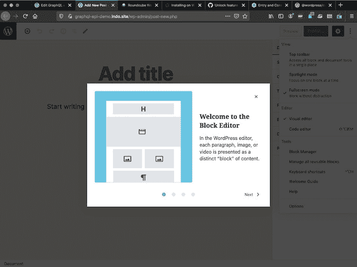
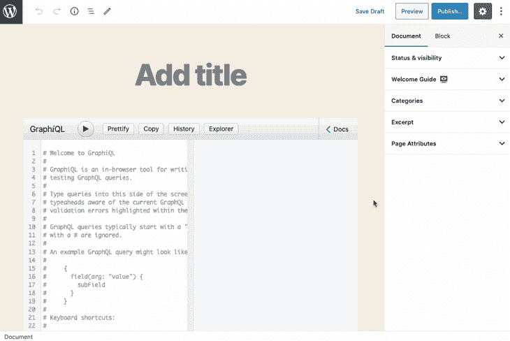
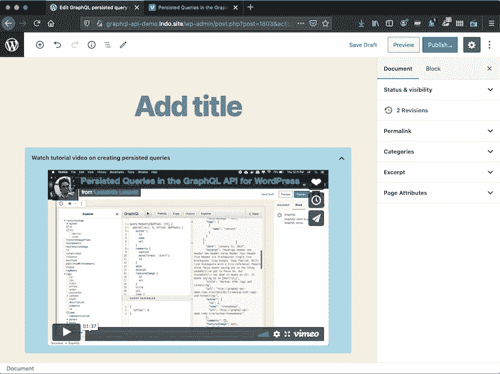
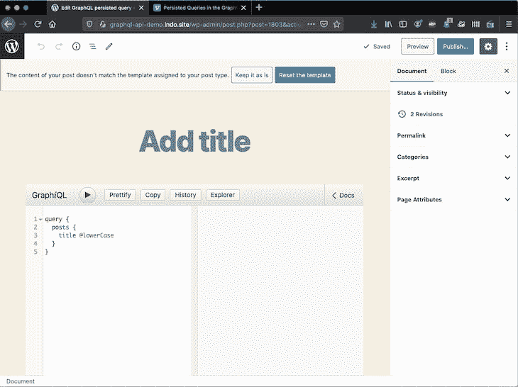
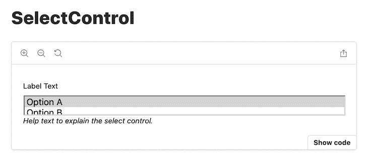
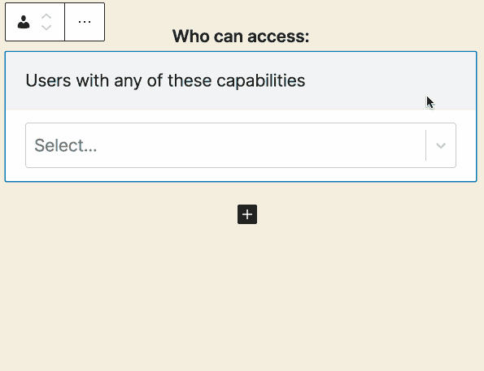
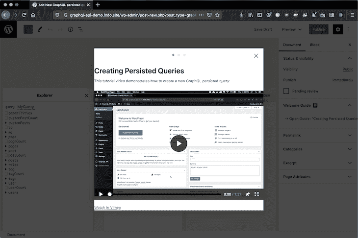
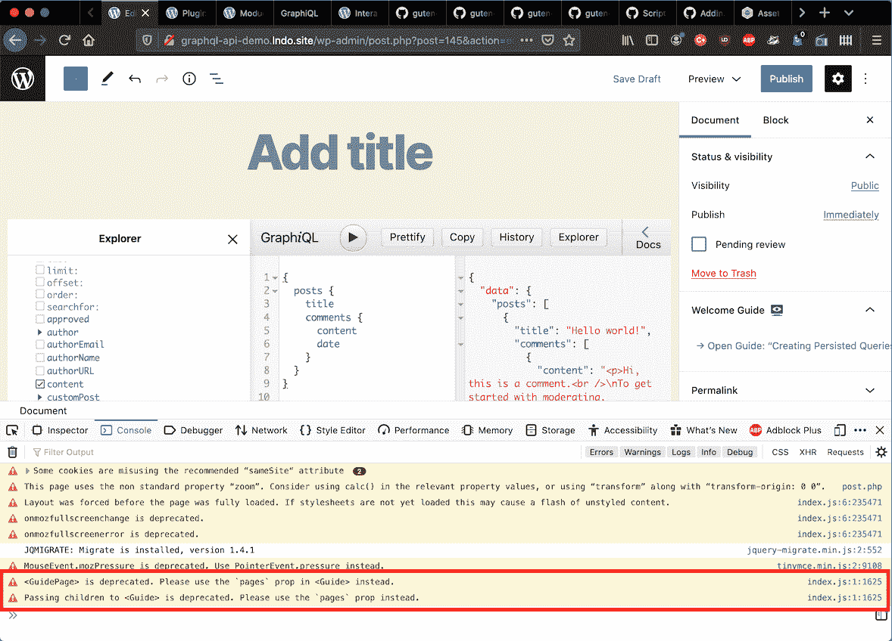
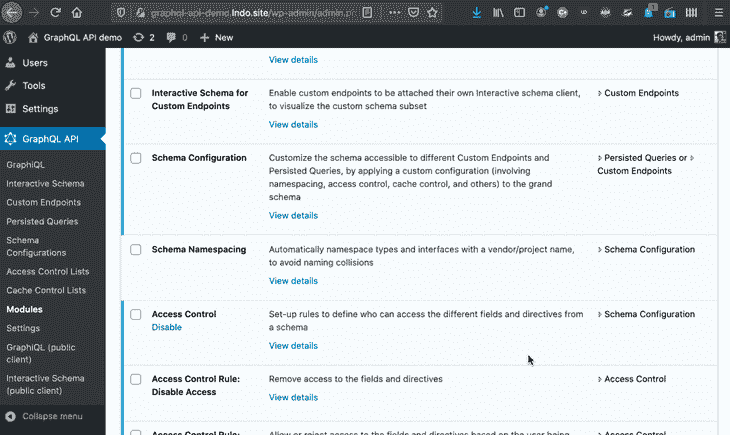

# 建立你的第一个古腾堡 block 的要点

> 原文：<https://blog.logrocket.com/building-first-gutenberg-block/>

PHP 开发人员会发现为新的 WordPress 编辑器 [Gutenberg](https://wordpress.org/gutenberg/) 编写代码令人望而生畏，因为它需要 React 和 JavaScript 的深厚知识。

这是我几个月前开始搭建第一个积木时的亲身经历。尽管我离掌握这些语言还有一段距离，但我已经能够在一定程度上适应新的范式，并成功地制作了几个模块。

在这篇文章中，我将分享几个技巧，以了解在为古腾堡编码时需要注意什么。

## 看看古腾堡团队是如何做到的

我学习如何在 Gutenberg 中做一些事情的主要方法是通过检查 Gutenberg 团队是如何做的，主要是通过检查 repo 中的代码[。](https://github.com/WordPress/gutenberg)

即使我们已经知道 React、JavaScript、Redux、webpack 或 Gutenberg 使用的任何库，检查 repo 中的代码也是非常可取的。Gutenberg 在它所依赖的库之上提供了一个抽象层，它的一些功能只在特定于 Gutenberg 的方式下工作。

例如，通过包`[@wordpress/data](https://github.com/WordPress/gutenberg/tree/master/packages/data)`与数据存储交互就是这种情况。尽管这个包是在 [Redux](https://blog.logrocket.com/why-use-redux-reasons-with-clear-examples-d21bffd5835/) 之上实现的，但是它包含了[和](https://github.com/WordPress/gutenberg/tree/master/packages/data#comparison-with-redux)的几个重要区别，所以从以前的项目中使用 Redux 的经验可能还不足以知道如何在 Gutenberg 中使用它。

## 集中使用 WordPress 编辑器来发现什么可以被重用

为 Gutenberg 实现的任何功能也可供我们自己使用。作为 WordPress 编辑器的重度用户，探索它的所有屏幕和用户交互，发现和试验这些功能，并决定是否将它们移植到我们自己的插件，这是一个好主意。

例如，我注意到用户第一次与 WordPress 编辑器交互时显示的欢迎屏幕:



WordPress editor welcome screen.

我认为这种用户交互对于显示用户文档非常实用，所以我决定将它移植到我自己的插件中。

为了找到代码，我[搜索了字符串](https://github.com/WordPress/gutenberg/search?q=%22In+the+WordPress+editor%2C+each+paragraph%2C+image%2C+or+video%22&unscoped_q=%22In+the+WordPress+editor%2C+each+paragraph%2C+image%2C+or+video%22) `"In the WordPress editor, each paragraph, image, or video"`(它出现在编辑的欢迎指南上)，产生了带有代码的文件`[packages/edit-post/src/components/welcome-guide/index.js](https://github.com/WordPress/gutenberg/blob/7b63e877336bb8f156bcd25191066bad38ba6635/packages/edit-post/src/components/welcome-guide/index.js)`:

```
// imports...
// ...

export default function WelcomeGuide() {
  // ...

  return (
    <Guide
      className="edit-post-welcome-guide"
      contentLabel={ __( 'Welcome to the block editor' ) }
      finishButtonText={ __( 'Get started' ) }
      onFinish={ () => toggleFeature( 'welcomeGuide' ) }
    >
      <GuidePage className="edit-post-welcome-guide__page">
        <h1 className="edit-post-welcome-guide__heading">
          { __( 'Welcome to the block editor' ) }
        </h1>
        <CanvasImage className="edit-post-welcome-guide__image" />
        <p className="edit-post-welcome-guide__text">
          { __(
            'In the WordPress editor, each paragraph, image, or video is presented as a distinct “block” of content.'
          ) }
        </p>
      </GuidePage>

      /* More <GuidePage> components */
      /* ... */
    </Guide>
  );
}
```

我将代码从库中复制/粘贴到我的插件中，并根据我的需要进行编辑。结果非常令人满意:



Reusing the welcome guide for my own plugin.

## 浏览可用的文档

古腾堡的文档可在[块编辑手册](https://developer.wordpress.org/block-editor/)中找到。它是[还没有彻底](https://github.com/WordPress/gutenberg/issues/22151)，这使得初学者很难开始为古腾堡编码。

例如，我从中学到了以下印象:

*   感觉有点混乱，每个包都提供了自己的文档，没有一个总体的地图来显示它们是如何连接的
*   它包含技术术语，只有具有现代 JavaScript 技术经验的开发人员才能理解
*   它确实提供了一些教程，但是这些并没有解释为什么/如何/什么时候需要所有的过程
*   它受到“知识诅咒”的困扰，文档是由专家编写的，他们忽略了琐碎的信息，而这些信息对于非专家来说仍然是有价值的

即使它有很大的改进空间，现有的文档仍然非常有用。所以，一定要浏览所有的文档，多看几遍，直到一切顺利。每当对某个主题不够满意时，尽可能地从存储库中学习代码来填补空白。

## 使用`@wordpress/create-block`包搭建一个新的模块

是一个搭建新积木的工具，由 Gutenberg 团队维护。我在以前的文章 [*中描述了如何使用这个包，建立你的第一个古腾堡项目*](https://blog.logrocket.com/setting-up-first-gutenberg-project/) 。

## 检查你需要的是一个块还是一个组件

Gutenberg 基于 React，这是一个 JavaScript 库，用于构建通过组件描述的用户界面。组件是 JavaScript 类或函数，旨在呈现一些特定的界面，并通过属性对其进行定制。它也是可组合的，即一个组件可以包含另一个组件，从而重用其代码。

Gutenberg 基于[块](https://developer.wordpress.org/block-editor/principles/key-concepts/#blocks)，其中块是具有某些特性的高级 React 组件(例如，它的属性被保存到数据库中)。因此，块可以由组件组成(块也可以包含[嵌套块](https://developer.wordpress.org/block-editor/tutorials/block-tutorial/nested-blocks-inner-blocks/)，但这是另一回事)。

尽管古腾堡看起来完全是关于块的，但在某些情况下，我们不是通过块，而是通过组件与古腾堡互动。

例如，前面显示的欢迎指南在模式窗口中显示用户文档，并通过文档选项卡面板中的链接触发:


Sidebar panel.

创建这个面板是通过`<PluginDocumentSettingPanel>`完成的，它是一个组件，而不是一个模块:

```
import { registerPlugin } from '@wordpress/plugins';
import { PluginDocumentSettingPanel } from '@wordpress/edit-post';

const WelcomeGuidePluginDocumentSettingPanel = () => (
  <PluginDocumentSettingPanel
    name="welcome-guide"
    title="Welcome Guide"
    className="welcome-guide"
  >
    /* Link to open the modal window */
    /* ... */
    /* Modal window */
    /* ... */
  </PluginDocumentSettingPanel>
);

registerPlugin( 'welcome-guide-plugin-document-setting-panel', {
  render: WelcomeGuidePluginDocumentSettingPanel,
  icon: 'welcome-view-site',
} );
```

有没有可能使用一个块来满足相同的用例，即在编辑器中向用户显示文档？我们来看看这个。

我们可以在编辑器的顶部有一个带有折叠元素的块，最初是关闭的:


Accordion with user documentation, initially closed.

当点击它时，它会打开并显示用户文档，在这种情况下是通过 Vimeo 嵌入的视频:



Accordion with user documentation, now open.

然而，这种方案行不通，因为对块(及其数据，除非它是一个[可重用块](https://developer.wordpress.org/block-editor/principles/key-concepts/#reusable-blocks))的引用存储在该帖子的数据库条目中。然后，至少会发生以下问题之一:

*   Vimeo 视频 URL(作为 block 属性传递)也会保存在帖子上，对于每一个帖子，它确实不属于那里
*   或者，URL 可以被硬编码在块中，但是我们需要创建几个折叠块，每个自定义帖子类型(CPT)一个，在那里显示块(假设不同的 CPT 需要显示不同的视频)
*   否则，我们可以使用`core/html`块，并通过一个[模板](https://developer.wordpress.org/block-editor/developers/block-api/block-templates/)用它的内部 HTML 初始化它，但这并不可行，因为模板只允许我们定义属性，而不是内容。即使它真的有效，通过模板传递 HTML 来实现 accordion(这需要 CSS，可能还需要一些 JavaScript)也是一种黑客行为

最后，即使所有这些问题都解决了，一旦块被添加到 CPT，它就不能被修改或删除，因为当模板和保存的内容不同步时，Gutenberg 会显示警告消息。这将使用户困惑，因为不匹配与用户提供的内容无关:



Warning message shown when template and content are out of sync.

结论:块并不适合所有的用例，所以在开始编码之前要注意你是否需要一个块。

## 重用古腾堡组件

古腾堡附带的任何组件也可供自己使用。有三种方法可以浏览组件列表:

1.  查看`[packages/components/src](https://github.com/WordPress/gutenberg/tree/master/packages/components/src)`下的回购
2.  阅读手册的[组件参考](https://developer.wordpress.org/block-editor/components/)
3.  在[古腾堡的故事书](https://wordpress.github.io/gutenberg)里和他们一起玩

所有这些组件都托管在`@wordpress/components`包中，所以我们必须将这个包作为依赖项安装在块的`package.json`文件中。为此，打开一个终端窗口并在块的根文件夹中运行:

```
npm install @wordpress/components --save-dev
```

现在，block 可以`import`任何组件，比如一个`<Button>`:

```
import { Button } from '@wordpress/components';

const MyButton = () => (
 <Button isSecondary>
   Label
 </Button>
);
```

静态`import`语句可以采取几种形式。在这种情况下，组件名`Button`必须用`{ }`括起来。阅读模块[如何导出](https://developer.mozilla.org/en-US/docs/Web/JavaScript/Reference/Statements/export)和[如何导入](https://developer.mozilla.org/en-US/docs/Web/JavaScript/Reference/Statements/import)是一个好主意。

您可以在此查看迄今可用的组件[。](https://developer.wordpress.org/block-editor/components/)

## 使用外部组件

Gutenberg 附带的组件没有覆盖所有用例，所以我们很可能需要从组件库中导入外部组件，如 [Material-UI](https://material-ui.com/) 、 [React Bootstrap](https://react-bootstrap.github.io/) 、 [Chakra UI](https://chakra-ui.com/) 或其他。

例如，我需要为我的插件实现一个多选，尽管 Gutenberg 的`SelectControl`组件允许我们选择多个值，但它的用户界面并不完美:



SelectControl with multiple attribute

因此，我前往 npm 注册表，对“multiselectreact”进行了[搜索，并安装了第一个结果——名为](https://www.npmjs.com/search?q=multiselect%20react)`[react-select](https://www.npmjs.com/package/react-select)`的库。

要为 Gutenberg 块安装这个库(假设我们已经使用`@wordpress/create-block`创建了这个块)，我们到终端，进入项目的根文件夹，执行这个命令:

```
npm install react-select --save-dev
```

该命令将把`"react-select"` JavaScript 依赖项添加到文件`package.json`中，并下载文件夹`node_modules/`下的依赖项。从现在起，该库将可在块内使用，遵循其说明:

```
import Select from 'react-select';

const MultiSelect = ( props ) => {
  const { defaultValue, options } = props;
  return (
    <Select
      defaultValue={ defaultValue }
      options={ options }
      isMulti={ true }
    />
  )
}
```

该组件提供的用户体验非常引人注目，优于 Gutenberg 的`<SelectControl>`:



react-select component.

## 时尚风格

当使用`@wordpress/create-block`搭建一个新的块时，默认情况下，所有的样式都是通过 CSS 预处理器 [Sass](https://sass-lang.com/) 完成的。Sass 增加了生成 CSS 代码的脚本特性——变量、嵌套规则、混合、函数等等。

例如，下面的 Sass 代码:

```
$base-color: #c6538c;
$border-dark: rgba($base-color, 0.88);

.wp-block-my-block {
  .alert {
    border: 1px solid $border-dark;
  }
}

```

产生以下 CSS 输出:

```
.wp-block-my-block .alert {
  border: 1px solid rgba(198, 83, 140, 0.88);
}
```

块有两个独立的样式表:一个用于编辑体验，另一个用于页面上的表示。相应地，脚手架块包含两个 Sass 文件:

1.  `editor.scss`(由`edit.js`编辑`import`)包含仅适用于编辑器的样式，编译为`build/index.css`
2.  `style.scss`(由`index.js`编辑的`import`)包含适用于编辑器和前端的样式，被编译为`build/style-index.css`。

## 自定义 webpack

Gutenberg 的核心是 webpack，它是现代 JavaScript 应用程序的静态模块捆绑器。

webpack 可以用来导入应用程序中的任何类型的资源，而不仅仅是 JavaScript——图像、Markdown 文件(将代码转换成 HTML)或者任何有[加载器](https://webpack.js.org/loaders/)的东西。

古腾堡的网络包配置可以在找到[。一个块还可以通过在根文件夹中添加一个`webpack.config.js`文件](https://github.com/WordPress/gutenberg/blob/master/packages/scripts/config/webpack.config.js)[来提供它自己的 webpack 配置](https://github.com/WordPress/gutenberg/tree/master/packages/scripts#provide-your-own-webpack-config)。自定义配置可以覆盖默认配置，如下所示:

```
// Default webpack configuration
const defaultConfig = require( '@wordpress/scripts/config/webpack.config' );

// Add extra configuration, and export it
module.exports = {
  ...defaultConfig,
  module: {
    ...defaultConfig.module,
    rules: [
      ...defaultConfig.module.rules,
      // Add here a new rule
      // ...
    ],
  },
};
```

例如，我已经决定使用 Markdown 文件为前面显示的欢迎指南编写用户文档。为了处理`.md`文件，我们必须为 webpack 提供一个 Markdown 加载器(根据[的文档](https://www.npmjs.com/package/markdown-loader)，还有一个[的 HTML 加载器](https://webpack.js.org/loaders/html-loader/)，通过一个定制的`webpack.config.js`文件定义它，如下所示:

```
const defaultConfig = require( '@wordpress/scripts/config/webpack.config' );

module.exports = {
  ...defaultConfig,
  module: {
    ...defaultConfig.module,
    rules: [
      ...defaultConfig.module.rules,
      {
        test: /\.md$/,
        use: [
          {
            loader: "html-loader"
          },
          {
            loader: "markdown-loader"
          }
        ]
      }
    ],
  },
};
```

Markdown 和 HTML 加载器都是 JavaScript 依赖项，必须通过在终端的块的根文件夹中执行以下命令将其导入到项目中:

```
npm install --save-dev markdown-loader html-loader
```

现在，我们可以`import`Markdown 文件的内容(已经呈现为 HTML)并在任何组件中使用它:

```
import UserDocumentationContent from './user-documentation.md';

const UserDocumentation = ( props ) => {
  const { className } = props;
  return (
    <div
      className={ className }
      dangerouslySetInnerHTML={ { __html: UserDocumentationContent } }
    />
  );
}
```

## 保持我们的块是最新的

Gutenberg 有两个版本:每两周发布一次新功能的 Gutenberg 插件和每三到四个月整合一次新功能的 WordPress 核心。

如果我们已经使用了`@wordpress/create-block`来搭建新的块，我们可以通过在根文件夹中运行这个命令来用所有 WordPress 包的最新版本来更新这个块:

```
npm run packages-update
```

该命令将检索`package.json`中所有`@wordpress/...`包的列表，并将它们的版本升级到最新版本。

但是，要小心！WordPress 历来避免在新版本中引入突破性的变化，但 Gutenberg 的情况并非如此，所以我们必须检查在升级到新版本后是否有任何东西停止工作。

例如，在将它们升级到使用更新版本的`@wordpress/scripts`之后，几个模块[在为生产](https://github.com/WordPress/gutenberg/issues/23607)编译时停止了工作。原因一点也不清楚:问题可能是由 webpack、Babel、Node 或它们的组合引起的。

我花了五天时间进行调试、研究，并与人们交谈，以了解发生了什么并修复它。这次挫折清楚地表明了 WordPress 已经变得多么复杂。

此外，每当 Gutenberg 插件有新的发布时，我们必须检查我们的块是否仍然工作良好，或者它们是否需要适应新的代码。例如，当我第一次创建前面显示的欢迎指南时，它看起来像这样:


Original welcome guide.

然而，从古腾堡版本`8.2`开始，它看起来是这样的:



Welcome guide after upgrading.

那么，我们如何监控重大变更呢？

所有的[包](https://developer.wordpress.org/block-editor/packages/)都使用[语义版本](https://semver.org/)，所以版本由三个数字组成，中间用一个点隔开:`MAJOR.MINOR.PATCH`。每当一个版本引入了突破性的变化，那么`MAJOR`号就增加(例如，从`9.1.0`到`10.0.0`)。

每个包[都有一个`CHANGELOG`文件](https://github.com/WordPress/gutenberg/blob/master/packages/README.md#maintaining-changelogs)，声明不同版本之间的变化，包括重大变化。因此，我们必须检查块的`package.json`文件中的`@wordpress/...`包列表，并读取每个包的`CHANGELOG`。

比如`@wordpress/scripts`的`CHANGELOG`就是[这个](https://github.com/WordPress/gutenberg/blob/master/packages/scripts/CHANGELOG.md)。我检查了我的块停止工作的版本([版本`10.0.0`](https://github.com/WordPress/gutenberg/blob/master/packages/scripts/CHANGELOG.md#1000-2020-05-28) )，但是它没有声明突破性的改变，所以要么问题一定在其他的包中，要么突破性的改变是在不知情的情况下引入的(我们需要格外注意)。

此外，我们必须在浏览器中加载 Gutenberg，并查看我们是否在 DevTools 控制台中收到错误或反对通知。例如，一个反对通知表明不再使用`<GuidePage>`组件，这就是为什么我的欢迎指南的样式被破坏了:



Deprecation notices by Gutenberg.

每当我们需要修复代码时，我们还必须确保它能与 Gutenberg 的两个版本兼容:插件的最新版本和集成到 WordPress core 的版本。

保持我们的块更新是一项耗时的活动，可能每两周进行一次(Gutenberg 的每个新版本)。在估计构建模块所需的工作量时，应该考虑到这一点。

## 检查遗留的 WordPress 代码是否已经能够满足你的需求

这一节是我最后加的，其实最开始就应该评价。

从上面看到的信息中可以看出，Gutenberg 是复杂的，需要大量的努力来执行，这可以转化为投入到项目中的时间(用于学习技术、编码、测试)或雇佣其他人来做这件事的金钱。

如果你没有这些，那么你就要考虑古腾堡是否值得你去费心了。

在某些情况下，古腾堡当然值得麻烦。例如，如果您的应用程序需要提供引人注目的用户体验，那么 Gutenberg 实际上比使用遗留的 WordPress 代码(主要涉及 PHP、jQuery 和自定义 JavaScript 的组合)更容易做到。

然而，在其他一些情况下，使用遗留的 WordPress PHP 代码对于手边的用例已经足够好了。例如，关于前面显示的带有用户文档的欢迎指南，这个用例可以在没有 Gutenberg 的情况下满足，只使用 PHP 和 CSS 代码，通过[重用已经在 WordPress admin](https://www.designbombs.com/adding-modal-windows-in-the-wordpress-admin/) 中编码的功能:



Opening a modal window without Gutenberg.

两种解决方案都成功地在模态窗口中显示了文档。使用 Gutenberg 的用户体验非常好，但我也花了更长的时间来实现。

总之，在搭建积木之前，确保你真的需要它。

## 结论

Gutenberg 非常强大，但是它有一个陡峭的学习曲线，特别是对于不熟悉 JavaScript 的开发人员。

我几个月前开始使用 Gutenberg，完全是一个 React 和 JavaScript 初学者。从那以后，我学到了一些东西，有时是通过阅读文档，有时是通过探索源代码。我在本文中与我的初学者同伴分享了这些技巧，以便更容易开始使用 Gutenberg。

现在，去搭积木吧！

## 使用 [LogRocket](https://lp.logrocket.com/blg/signup) 消除传统错误报告的干扰

[](https://lp.logrocket.com/blg/signup)

[LogRocket](https://lp.logrocket.com/blg/signup) 是一个数字体验分析解决方案，它可以保护您免受数百个假阳性错误警报的影响，只针对几个真正重要的项目。LogRocket 会告诉您应用程序中实际影响用户的最具影响力的 bug 和 UX 问题。

然后，使用具有深层技术遥测的会话重放来确切地查看用户看到了什么以及是什么导致了问题，就像你在他们身后看一样。

LogRocket 自动聚合客户端错误、JS 异常、前端性能指标和用户交互。然后 LogRocket 使用机器学习来告诉你哪些问题正在影响大多数用户，并提供你需要修复它的上下文。

关注重要的 bug—[今天就试试 LogRocket】。](https://lp.logrocket.com/blg/signup-issue-free)