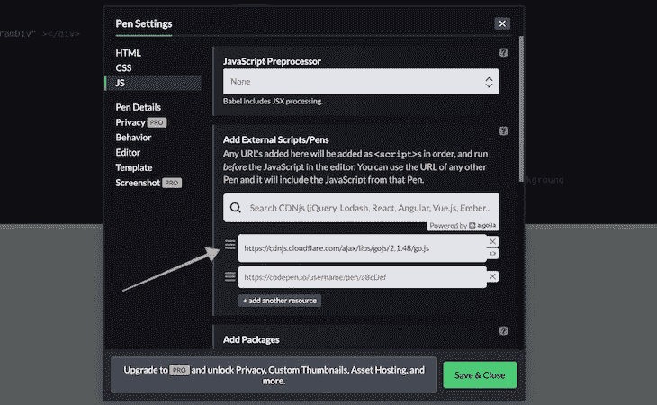
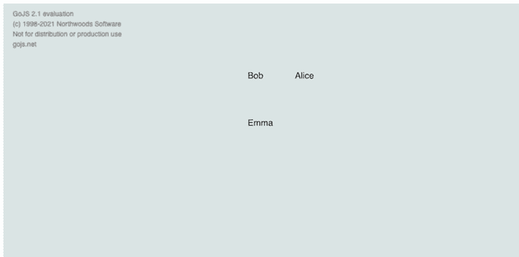
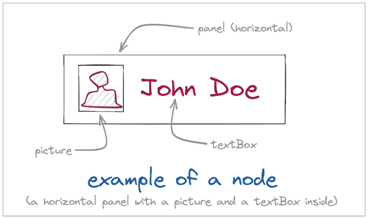
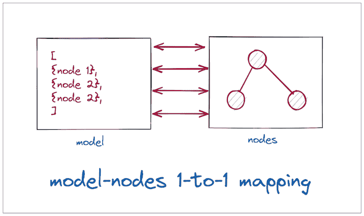
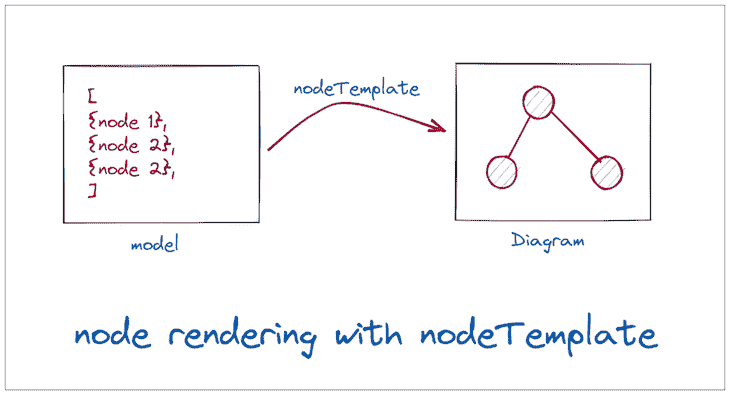
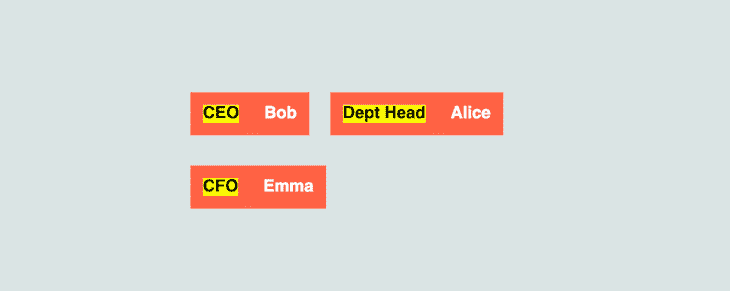
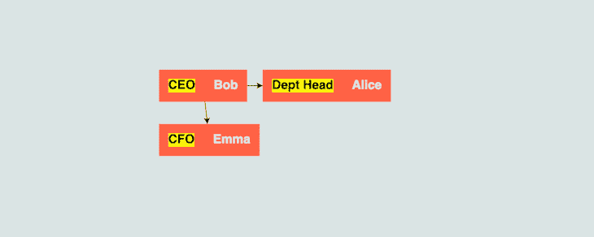
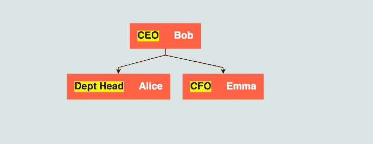
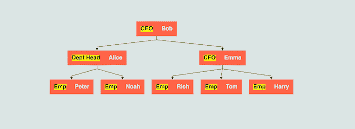

# 用 GoJS 构建流程图

> 原文：<https://blog.logrocket.com/building-flowcharts-gojs/>

如果您以前使用过图表库，您可能熟悉一些流行的库，如 D3.js、Chart.js 或 ApexCharts。这些库允许我们[以编程方式绘制基本图表](https://blog.logrocket.com/charting-react-apexcharts/)，如条形图、折线图和直方图，以及高级图表，如散点图。然而，这些库缺少的或提供的支持最少的一个常见功能是创建流程图。

在本教程中，我们将通过创建简单和复杂的流程图来探索 [GoJS，一个用于构建交互式图表](https://gojs.net/)的 JavaScript 库。我们开始吧！

## 入门指南

> 我们的例子使用了带有 GoJS 的 CodePen 你可以创建你自己的来跟随。

### 导入库

首先，让我们将 GoJS 库导入到我们的 CodePen 中。点击**设置**按钮，然后进入 **JS** 部分。在**添加外部脚本/笔**下，搜索 GoJS，为 GoJS 添加 [CDNjs 库，弹出建议:](https://cdnjs.com/libraries/gojs/2.1.48)



### 搭建操场

现在，我们将得到一个占位符，或操场，用于绘制我们的图表。在 **HTML** 部分，创建一个 div:

```
<div id="diagramDiv"></div>

```

让我们为 div 提供与视口相等的高度和宽度:

```
#diagramDiv {
  width: 100vw;
  height: 100vh;
  background-color: #dae4e4;
}

```

现在，我们应该看到一个灰色区域，在这里我们可以开始绘制图表，我们将在 CodePen 的 **JavaScript** 面板中编写图表。

## 创建一个基本图表

导入库后，让我们在 CodePen 中创建一个基本图表。首先，我们将获得对库函数的引用，并将其存储在`$`变量中，类似于使用`$`符号访问 jQuery 库:

```
var $ = go.GraphObject.make;

```

接下来，我们将在上一节中设置为游乐场的同一区域中初始化一个图。

```
var myDiagram = $(go.Diagram, "diagramDiv");

```

上面的代码在 div 中初始化了一个新的 GoJS 图。它的 ID 是`diagramDiv`。现在，我们将用三个元素初始化一个基本的 GoJS 模型，并将其设置为图模型:

```
myDiagram.model = new go.Model(
  [
    { key: "Bob" },
    { key: "Alice" },
    { key: "Emma" }
  ]);

```

div 中将出现一个最小的图，如下图所示:



## GoJS 元素

现在我们已经创建了一个基本的图表，让我们仔细看看 GoJS 的基础，这样我们就可以实现更复杂的图表。

### 图表

[图表](https://gojs.net/latest/api/symbols/Diagram.html)是指使用 GoJS 绘制的完整图表。图表有模型和节点。它还可能使用节点模板，节点模板定义了模型应该如何在图上呈现。

### 结节

[节点](https://gojs.net/latest/api/symbols/Node.html)是表示图中呈现的单个元素的实体。模型中的每一项都大致转化为图上的一个节点。作为图中的独立单元，节点是我们所看到的并与之交互的。

在 GoJS 中，我们有以下四种类型的节点:

*   `Shape`:显示自定义或预定义的几何形状，并添加颜色和纹理等样式
*   `TextBlock`:在图上显示文本
*   `Picture`:在图表中显示图像
*   `Panel`:将其他节点组织成特定的排列

一个节点中还可以有一个子节点，例如，`Shape`中的`TextBlock`。



### 模型

[模型](https://gojs.net/latest/api/symbols/Model.html)是图表中绘制的图表的数据表示。在我们之前的例子中，模型只包含三个元素。然而，在现实世界的场景中，大多数图会复杂得多，有更多的节点，每个节点都有几个键，并在它们之间形成复杂的关系:



## 在 GoJS 中创建节点

每当我们创建一个图表时，我们实际上是在创建一个图表并在该图表中显示节点。我们有几种不同的方法在 GoJS 中创建节点。

例如，我们可以分别使用`go.Node`、`go.Shape`和`go.TextBlock`函数，它们将返回相同类型的对象。然后，我们可以添加我们期望这些节点具有的属性:

```
var shape = new go.Shape(); // create a shape
shape.figure = "RoundedRectangle"; // set the geometry
shape.fill = "red"; // set the color
var node = new go.Node(go.Panel.Auto); // creates a node
node.add(shape); // add the shape to the node

```

然而，以这种方式在节点之间链接是冗长的，导致图变得太大。

### `go.GraphObject.make`

GoJS 定义了`GraphObject.make`方法，这是一个特殊的构造函数，我们可以用它来创建任何类型的节点，在构造函数中提供节点属性，并提供内部节点作为嵌套参数来创建节点层次结构。

让我们调用`GraphObject.make`方法:

```
go.GraphObject.make(
        Type_of_node,
        Node_properties,
        Node_children)

```

现在，我们将在`$`符号中添加对`GraphObject.make`方法的引用，以提高代码的可读性。我们可以将上面的代码简化为以下内容:

```
var $ = go.GraphObject.make; // get reference to make method
diagram.add(
  $(go.Node, go.Panel.Auto, // create a go.Node
    $(go.Shape, // create a go.Shape inside of it
      { figure: "RoundedRectangle", // geometry of the 
        fill: "red" }),
  ));

```

### `nodeTemplate`

我们可以用`nodeTemplate`方法进一步简化我们的代码，我们将用它来定义图中所有节点的外观。

让我们用上一节定义的节点创建一个`nodeTemplate`:

```
diagram.nodeTemplate(
        // the definition of how every nodes should look like
);
```



接下来，我们简单地定义模型，GoJS 将对图中的所有节点应用相同的模板。GoJS 搜索`go.Binding`中提到的关键字，并用定义模型中的相应值替换它们。让我们看看这是怎么回事！

## 在 GoJS 中创建流程图

现在我们已经了解了 GoJS 是如何工作的，让我们构建一个复杂的图表。我们将创建一个树形图，对公司中的所有职位进行分类。

接下来，这是我们最后的[代码笔](https://codepen.io/kokanek/pen/abwNNoq)。

参见 [CodePen](https://codepen.io) 上 kape El koka ne([@ koka nek](https://codepen.io/kokanek))
的笔 [](https://codepen.io/kokanek/pen/abwNNoq) 。

创建骨架

### 首先，我们将获取对`GraphObject.make`方法的引用，然后创建一个图，并将其附加到我们放在一边的类:

接下来，我们将使用`nodeTemplate`方法来定义图中每个节点的外观。我们将在显示员工姓名的同时显示职位名称。

```
var $ = go.GraphObject.make;
var myDiagram = $(go.Diagram, "diagramDiv");

```

让我们创建一个包含两个`TextBlock`元素的`nodeTemplate`:

我们的两个`TextBlock`元素与模型中的`name`和`title`键绑定在一起:

```
myDiagram.nodeTemplate = $(
  go.Node,
  "Horizontal",
  { background: "tomato" },
  $(
    go.TextBlock,
    {
      text: "a Text Block",
      background: "yellow",
      margin: 12,
      font: "bold 16px sans-serif"
    },
    new go.Binding("text", "title")
  ),
  $(
    go.TextBlock,
    "Default Text",
    { margin: 12, stroke: "white", font: "bold 16px sans-serif" },
    new go.Binding("text", "name")
  )
);

```

当我们渲染我们的图表时，它将看起来像下面的图像:

```
myDiagram.model = new go.Model([
  { name: "Bob", title: "CEO" },
  { name: "Alice", title: "Dept Head" },
  { name: "Emma", title: "CFO" }
]);

```



定义节点之间的链接

## 创建好节点后，下一步是通过在模型中添加一个键和一个父属性来定义它们之间的链接。一旦指定了链接，GoJS 将为我们绘制从父键到子键的链接:

请注意，我们现在正在创建一个`go.TreeModel`而不是`go.Model`。现在，当我们渲染我们的图表时，它将看起来像下面的图像:

```
myDiagram.model = new go.TreeModel([
  { name: "Bob", title: "CEO", key: "1" },
  { name: "Alice", title: "Dept Head", key: "2", parent: "1" },
  { name: "Emma", title: "CFO", key: "3", parent: "1" }
]);

```



为了在适当的层次结构中安排我们的图表，我们可以提供一个 layout 属性，该属性将按逐层的方式布置节点:

现在，我们的图表如下图所示:

```
var myDiagram = $(go.Diagram, "diagramDiv", {
  layout: $(
    go.TreeLayout,
    { angle: 90, layerSpacing: 40 }
  )
});

```



让我们向模型中添加更多的雇员，添加适当的键和父节点:



请记住，这不是一个渲染图像。这是一个完全交互式的图表，这意味着我们可以单击节点，拖放它们，等等！

结论

## 现在，您知道了如何使用 GoJS 在 JavaScript 中创建复杂的流程图。在本教程中，我们介绍了安装 GoJS 库、设置节点，以及最后定义节点之间的链接。

有了这么多可能的配置选项和定制，GoJS 无疑是最全面的库之一。在本教程中，我们只是触及了表面。

除了树形布局之外，其他布局包括定向图、圆形图和分层图。GoJS 还包括其他功能，如笔刷和动画，可以增强图形的外观。

您是否添加了新的 JS 库来提高性能或构建新特性？如果他们反其道而行之呢？

## 毫无疑问，前端变得越来越复杂。当您向应用程序添加新的 JavaScript 库和其他依赖项时，您将需要更多的可见性，以确保您的用户不会遇到未知的问题。

LogRocket 是一个前端应用程序监控解决方案，可以让您回放 JavaScript 错误，就像它们发生在您自己的浏览器中一样，这样您就可以更有效地对错误做出反应。

[LogRocket](https://lp.logrocket.com/blg/javascript-signup) 可以与任何应用程序完美配合，不管是什么框架，并且有插件可以记录来自 Redux、Vuex 和@ngrx/store 的额外上下文。您可以汇总并报告问题发生时应用程序的状态，而不是猜测问题发生的原因。LogRocket 还可以监控应用的性能，报告客户端 CPU 负载、客户端内存使用等指标。

[](https://lp.logrocket.com/blg/javascript-signup)[https://logrocket.com/signup/](https://lp.logrocket.com/blg/javascript-signup)

自信地构建— [开始免费监控](https://lp.logrocket.com/blg/javascript-signup)。

Build confidently — [Start monitoring for free](https://lp.logrocket.com/blg/javascript-signup).