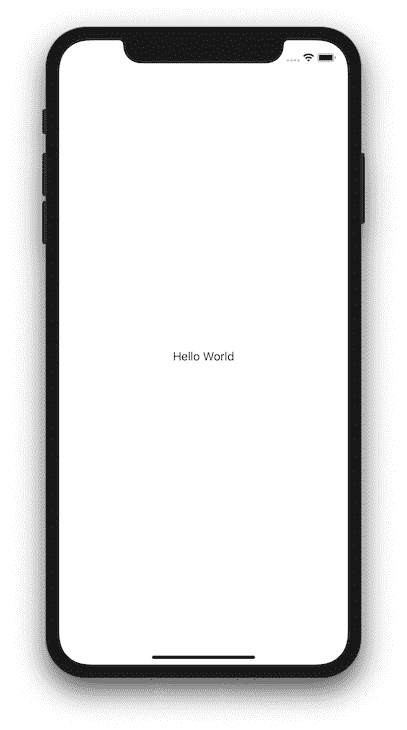
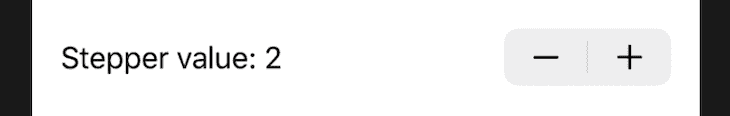
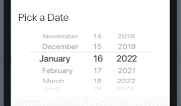
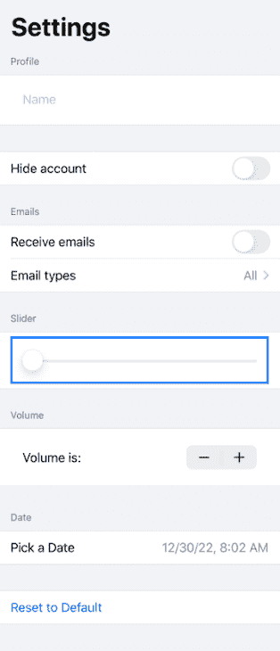

# 用 SwiftUI 构建表单:综合指南

> 原文：<https://blog.logrocket.com/building-forms-swiftui-comprehensive-guide/>

近年来开发工具中最重要的进步之一是 SwiftUI 的出现，这是一个 UI 框架，允许开发人员使用声明性代码设计和构建用户界面。

SwiftUI 目前仅支持 iOS 13 及更新版本。本教程需要 Xcode 11(或更高版本)，我们将全程使用 Swift 5。

在本文中，我们将一起在 SwiftUI 中构建一个表单，所以请按照您自己的进度自由地跟随本教程。我们将涵盖:

让我们抓紧时间开始吧！

## SwiftUI 简介

SwiftUI 是苹果生态系统的创新转变。通过同样复杂的声明性代码构建应用程序——使用更少的代码——使开发人员能够在 iOS 中快速开发应用程序。

有了更简单、更快速的 UI 模式，当您使用 SwiftUI 时，您可以立即使用动态类型、黑暗模式、本地化和可访问性等特性。

SwiftUI 可在所有苹果平台上访问，包括 macOS、iOS、iPadOS、watchOS 和 tvOS。由于使用 SwiftUI 节省了时间，开发人员可以将更多时间用于高效地编写代码、开发特定于平台的功能以及专注于 UI。

简而言之，根据我的经验，我发现它是一个非常有用的工具！

此外，苹果生态系统允许你同时使用 SwiftUI 和 UIKit。这对所有 iOS 开发者来说都是一个很大的优势，更容易适应新的转变。

让我们了解 SwiftUI 的基本组件:

*   SwiftUI 以声明方式处理数据
*   视图合成会产生数据依赖性
*   SwiftUI 刷新由外部事件或用户输入改变的界面元素

在很大程度上，该框架消除了创建视图控制器代码的需要，并使应用程序数据与单个源同步变得容易。

## SwiftUI 中的表单

本教程通过指导您使用基本 UI 设置构建表单，演示如何在 SwiftUI 中设计和使用表单。

用于数据输入的控件被包装在`Form`元素中。SwiftUI 可以包含许多这样的元素，比如文本字段、选择器、按钮、切换、滑块等等。

SwiftUI 中带有简单`Text`元素的`Form`的基本语法如下所示:

```
var form: some View {
  Form {
    Text("Hello World").padding()
  }
}

```

视图包含一个`Form`元素，它有一个`Text`作为它的子元素。写的`Text`的例子在下面的预览中可见:


## 使用 SwiftUI 设置 Xcode 项目

首先，打开 Xcode 并从菜单中选取“创建新的 Xcode 项目”。使用 iOS 时，选择“单视图应用程序”。

是时候命名和描述你的应用了。必须在底部选择“使用 SwiftUI”选项。如果你不点击这个选项，Xcode 会[为你创建故事板文件](https://blog.logrocket.com/storyboard-vs-programmatically-ios-ui-design/)。

现在，Xcode 会自动创建一个名为`ContentView.swift`的文件。这个文件将在右侧向您展示代码的实时预览。

如果你还没有看到预览，只需点击预览窗格中的“继续”按钮。项目构建完成后，您将能够看到预览。

使用新的即时预览功能，您可以输入代码并实时查看视觉变化，从而加快整个编程体验，并允许您在更改发生时查看更改。

为了使用 SwiftUI 构建表单，我们将开发不同的 UI 元素。让我们一个一个地实现它们，并更好地理解它们。

## 创建文本字段

让我们从使用文本标签和文本字段的简单实现开始:

```
//
Text("Name").font(.headline)

```

上面的代码行使用`Text`组件创建了一个标签，并将该标签的值设置为`Name`。此外。`font`属性将其字体类型设置为`headline`。要创建带有占位符的文本字段，您需要编写如下代码:

```
//
TextField(.constant(""), placeholder: Text("Enter your name"))

```

您需要使用一个`VStack`告诉 SwiftUI 框架，并根据需要安排两个组件，以便将标签放在文本字段上方。下面的代码片段显示了如何做到这一点:

```
//
struct ContentView : View {
    var body: some View {
        VStack(alignment: .leading) {

            Text("Name").font(.headline)
            TextField(.constant(""), placeholder: Text("Enter your name"))

        }
    }
}

```

现在我们已经创建了基本的文本字段和标签，让我们来改善外观:

```
//
struct ContentView : View {
    var body: some View {
        VStack(alignment: .leading) {
            Text("Name").font(.headline)
            TextField(.constant(""), placeholder: Text("Enter your name"))
                .padding(.all)
                .background(Color(red: 200.0/255.0, green: 200.0/255.0, blue: 200.0/255.0, opacity: 0.7), cornerRadius: 8.0)
        }
    }
}

```

在上面的代码中，我们添加了一个`.padding(.all)`属性，该属性为文本输入字段中键入的文本提供填充。

此外，`.background`属性允许您定义文本输入字段的背景颜色，并为这个例子设置一个`8.0`的`cornerRadius`。

接下来，让我们固定屏幕边缘的间距。为此，您需要将`.padding`属性指定给`VStack,`,它将元素保存在自身中:

```
//
struct ContentView : View {

    @State var name: String = ""

    var body: some View {
        VStack(alignment: .leading) {
        Text("Name").font(.headline)
            TextField(.constant(""), text: $name, placeholder: Text("Enter your name"))
                .padding(.all)
                .background(Color(red: 200.0/255.0, green: 200.0/255.0, blue: 200.0/255.0, opacity: 0.7), cornerRadius: 8.0)
        }
        .padding(.horizontal, 16)
    }
}

```

注意，我们还添加了一个名为`name`的`State`变量来保存文本输入的值。

* * *

### 更多来自 LogRocket 的精彩文章:

* * *

## 将组件转换为表单

要填充不同的 UI 组件和视图，重用它们比复制代码更有效。

SwiftUI 中的`Form`是一个容器视图，允许您对用于数据输入的控件进行分组。上述部件可以用`Form`进行编码，如下所示:

```
//
struct ContentView: View {

    @State var name: String = ""

    var body: some View {
        NavigationView {
            Form {
                Section(header: Text("Profile")) {
                    Text("Name").font(.headline)
                    TextField(.constant(""), text: $name, placeholder: Text("Enter your name"))
                        .padding(.all)
                        .background(Color(red: 200.0/255.0, green: 200.0/255.0, blue: 200.0/255.0, opacity: 0.7), cornerRadius: 8.0)
                    }
                }
                .padding(.horizontal, 16)
            }
            .navigationBarTitle("Settings")
        }
    }
}

```

上面的代码允许您在一个`NavigationView`中指定`Form`对象。`Section`允许您在“表单”视图中创建一个单独的部分，然后您可以使用`header`属性对其进行标记。

您已经使用 SwiftUI 成功创建了表单中的第一个组件！

## 创建切换

让我们通过添加一个`Toggle`来更新您的表单，以提供隐藏配置文件的选项:

```
//
struct ContentView: View {

    @State var name: String = ""
    @State var isHidden: Bool = false

    var body: some View {
        NavigationView {
            Form {
                Section(header: Text("Profile")) {
                    Text("Name").font(.headline)
                    TextField(.constant(""), text: $name, placeholder: Text("Enter your name"))
                        .padding(.all)
                        .background(Color(red: 200.0/255.0, green: 200.0/255.0, blue: 200.0/255.0, opacity: 0.7), cornerRadius: 8.0)
                    }
                    Toggle(isOn: $isHidden) {
                        Text("Hide account")
                    }
                }
                .padding(.horizontal, 16)
            }
            .navigationBarTitle("Settings")
        }
    }
}

```

在`TextField`下面添加`Toggle`，如代码所示。这允许你打开或关闭`Toggle`。它还将待处理的值保存在名为`isHidden`的变量中，这允许您根据需要访问和更新业务逻辑。

## 创建选取器

您可以使用 SwiftUI `Picker`组件从选项列表中选择所需的值。为了让一个`Picker`正常工作，你必须为它提供一个选项数组和一个记录哪个选项被选中的`State`变量。

让我们创建一个`Picker`来存储选择的偏好:

```
//
struct ContentView: View {

    @State var name: String = ""
    @State var isHidden: Bool = false
    @State var email: String = ""
    @State var receiveEmails: Bool = false
    @State private var index = 0
    var emailOptions = ["All", "Transactional", "Marketing"]

    var body: some View {
        NavigationView {
            Form {
                Section(header: Text("Profile")) {
                    Text("Name").font(.headline)
                    TextField(.constant(""), text: $name, placeholder: Text("Enter your name"))
                        .padding(.all)
                        .background(Color(red: 200.0/255.0, green: 200.0/255.0, blue: 200.0/255.0, opacity: 0.7), cornerRadius: 8.0)
                    }
                    Toggle(isOn: $isHidden) {
                        Text("Hide account")
                    }
                }
                .padding(.horizontal, 16)

                Section(header: Text("Emails")) {
                    Toggle(isOn: $receiveEmails) {
                        Text("Receive emails")
                    }
                    TextField(.constant(""), text: $email, placeholder: Text("Enter your email"))
                        .padding(.all)
                        .background(Color(red: 200.0/255.0, green: 200.0/255.0, blue: 200.0/255.0, opacity: 0.7), cornerRadius: 8.0)
                    }
                    Picker(selection: $index, label: Text("Email types")) {
                        ForEach(0 ..< emailOptions.count) {
                            Text(self.emailOptions[$0])
                        }
                    }
                }
                .padding(.horizontal, 16)
            }
            .navigationBarTitle("Settings")
        }
    }
}

```

正如您在代码中看到的，引入了一个名为`Emails`的新部分，它有一个用于启用电子邮件通知的`Toggle`，一个用于将电子邮件作为输入的`TextField`，以及一个用于选择电子邮件类型的`Picker`组件。

## 创建滑块

滑块是一个组件，它允许您在线上拖动选择，从已经设置的范围中选择一个值。UIKit 中的`UISlider`与 SwiftUI 中的`Slider`类似。

您可以像这样定义滑块:

```
//
struct ContentView: View {

    @State var name: String = ""
    @State var isHidden: Bool = false
    @State var email: String = ""
    @State var receiveEmails: Bool = false
    @State private var index = 0
    var emailOptions = ["All", "Transactional", "Marketing"]
    @State var volumeSliderValue: Double = 0

    var body: some View {
        NavigationView {
            Form {
                Section(header: Text("Profile")) {
                    Text("Name").font(.headline)
                    TextField(.constant(""), text: $name, placeholder: Text("Enter your name"))
                        .padding(.all)
                        .background(Color(red: 200.0/255.0, green: 200.0/255.0, blue: 200.0/255.0, opacity: 0.7), cornerRadius: 8.0)
                    }
                    Toggle(isOn: $isHidden) {
                        Text("Hide account")
                    }
                }
                .padding(.horizontal, 16)

                Section(header: Text("Emails")) {
                    Toggle(isOn: $receiveEmails) {
                        Text("Receive emails")
                    }
                    TextField(.constant(""), text: $email, placeholder: Text("Enter your email"))
                        .padding(.all)
                        .background(Color(red: 200.0/255.0, green: 200.0/255.0, blue: 200.0/255.0, opacity: 0.7), cornerRadius: 8.0)
                    }
                    Picker(selection: $index, label: Text("Email types")) {
                        ForEach(0 ..< emailOptions.count) {
                            Text(self.emailOptions[$0])
                        }
                    }
                }
                .padding(.horizontal, 16)

                Section(header: Text("Emails")) {
                    Slider(value: $volumeSliderValue, in: 0...100, step: 1)
                    .padding()
                    .accentColor(Color.blue)
                    .border(Color.blue, width: 3)
                }
                .padding(.horizontal, 16)
            }
            .navigationBarTitle("Settings")
        }
    }
}

```

在上面的代码中，定义了一个名为`volumeSliderValue`的状态变量，它存储滑块的当前值。通过在`Slider`上传递`volumeSliderValue`和一系列可能的值来创建`Slider`组件。

您也可以通过在参数中定义`step`值来添加`Slider`的增量值。你还可以分别使用修改器`accentColor()`和`border()`来改变滑块和边框的颜色。

## 创建步进器

步进器是一个 UI 控件元素，允许您通过使用它的加号或减号按钮来增加或减少值。SwiftUI 的`Stepper`类似于 UIKit 的`UIStepper`。

让我们看看如何将`Stepper`添加到 SwiftUI 表单中。

首先，您需要声明一个变量来保存`Stepper`的值，如下所示:

```
@State var stepper: Int = 0

```

一旦声明，您需要传递它来初始化`Stepper`，如下所示:

```
VStack {
    Stepper("Stepper's value is: ", value: $stepper)
}.padding()

```

现在让我们学习如何定义步进器的步进值。为此，您需要提供一个`step`值来允许递增或递减动作。

下面是定义`step`值的方法:

```
Stepper("Stepper's value is: ", value: $stepper, step: 1)

```

在许多情况下，您可能希望将`Stepper`值限制在某个范围内。您可以通过如下所示声明范围来限制`Stepper`的范围:

```
Stepper("Stepper's value is: ", value: $stepper, in: 1..10, step: 1)

```

结果应该是这样的:


After adding the `Stepper`, your code would look something like this:

```
//
struct ContentView: View {

    @State var name: String = ""
    @State var isHidden: Bool = false
    @State var email: String = ""
    @State var receiveEmails: Bool = false
    @State private var index = 0
    var emailOptions = ["All", "Transactional", "Marketing"]
    @State var volumeSliderValue: Double = 0
    @State var stepper: Int = 0

    var body: some View {
        NavigationView {
            Form {
                Section(header: Text("Profile")) {
                    Text("Name").font(.headline)
                    TextField(.constant(""), text: $name, placeholder: Text("Enter your name"))
                        .padding(.all)
                        .background(Color(red: 200.0/255.0, green: 200.0/255.0, blue: 200.0/255.0, opacity: 0.7), cornerRadius: 8.0)
                    }
                    Toggle(isOn: $isHidden) {
                        Text("Hide account")
                    }
                }
                .padding(.horizontal, 16)

                Section(header: Text("Emails")) {
                    Toggle(isOn: $receiveEmails) {
                        Text("Receive emails")
                    }
                    TextField(.constant(""), text: $email, placeholder: Text("Enter your email"))
                        .padding(.all)
                        .background(Color(red: 200.0/255.0, green: 200.0/255.0, blue: 200.0/255.0, opacity: 0.7), cornerRadius: 8.0)
                    }
                    Picker(selection: $index, label: Text("Email types")) {
                        ForEach(0 ..< emailOptions.count) {
                            Text(self.emailOptions[$0])
                        }
                    }
                }
                .padding(.horizontal, 16)

                Section(header: Text("Emails")) {
                    Slider(value: $volumeSliderValue, in: 0...100, step: 1)
                    .padding()
                    .accentColor(Color.blue)
                    .border(Color.blue, width: 3)
                }
                .padding(.horizontal, 16)

                Section(header: Text("Volume")) {
                    Stepper("Volume is: ", value: $stepper, in: 1..10, step: 1)
                    .padding()
                    .accentColor(Color.blue)
                }
                .padding(.horizontal, 16)
            }
            .navigationBarTitle("Settings")
        }
    }
}

```

## 创建日期选取器

现在让我们看一个如何向 SwiftUI 表单添加`DatePicker`的例子。

首先，您需要声明一个属性数据类型，如下所示:

```
@State var date = Date()

```

声明后，需要传递该属性来初始化`DatePicker`，如下所示:

```
​​DatePicker("Pick a date", selection: $date, displayedComponents: .date)
}

```

点击每个不同的日期或时间将显示一个专用的选择器 UI 元素。:


With the `DatePicker` added, here’s how your code will look:

```
//
struct ContentView: View {

    @State var name: String = ""
    @State var isHidden: Bool = false
    @State var email: String = ""
    @State var receiveEmails: Bool = false
    @State private var index = 0
    var emailOptions = ["All", "Transactional", "Marketing"]
    @State var volumeSliderValue: Double = 0
    @State var stepper: Int = 0
    @State var date = Date()

    var body: some View {
        NavigationView {
            Form {
                Section(header: Text("Profile")) {
                    Text("Name").font(.headline)
                    TextField(.constant(""), text: $name, placeholder: Text("Enter your name"))
                        .padding(.all)
                        .background(Color(red: 200.0/255.0, green: 200.0/255.0, blue: 200.0/255.0, opacity: 0.7), cornerRadius: 8.0)
                    }
                    Toggle(isOn: $isHidden) {
                        Text("Hide account")
                    }
                }
                .padding(.horizontal, 16)

                Section(header: Text("Emails")) {
                    Toggle(isOn: $receiveEmails) {
                        Text("Receive emails")
                    }
                    TextField(.constant(""), text: $email, placeholder: Text("Enter your email"))
                        .padding(.all)
                        .background(Color(red: 200.0/255.0, green: 200.0/255.0, blue: 200.0/255.0, opacity: 0.7), cornerRadius: 8.0)
                    }
                    Picker(selection: $index, label: Text("Email types")) {
                        ForEach(0 ..< emailOptions.count) {
                            Text(self.emailOptions[$0])
                        }
                    }
                }
                .padding(.horizontal, 16)

                Section(header: Text("Emails")) {
                    Slider(value: $volumeSliderValue, in: 0...100, step: 1)
                    .padding()
                    .accentColor(Color.blue)
                    .border(Color.blue, width: 3)
                }
                .padding(.horizontal, 16)

                Section(header: Text("Volume")) {
                    Stepper("Volume is: ", value: $stepper, in: 1..10, step: 1)
                    .padding()
                    .accentColor(Color.blue)
                }
                .padding(.horizontal, 16)

                Section(header: Text("Date")) {
                    DatePicker("Pick a Date", selection: $date,displayedComponents: .date)
                }
                .padding(.horizontal, 16)
            }
            .navigationBarTitle("Settings")
        }
    }
}

```

## 创建按钮

现在让我们添加一个`Button`，它将允许您将 SwiftUI 表单的配置重置为其默认值。一旦`Button`被点击，它将重置表单中各种元素的所有值。

`Button`应该是这样的:


实现此功能的代码如下所示:

```
//
struct ContentView: View {

    @State var name: String = ""
    @State var isHidden: Bool = false
    @State var email: String = ""
    @State var receiveEmails: Bool = false
    @State private var index = 0
    var emailOptions = ["All", "Transactional", "Marketing"]
    @State var volumeSliderValue: Double = 0
    @State var date = Date()

    var body: some View {
        NavigationView {
            Form {
                Section(header: Text("Profile")) {
                    Text("Name").font(.headline)
                    TextField(.constant(""), text: $name, placeholder: Text("Enter your name"))
                        .padding(.all)
                        .background(Color(red: 200.0/255.0, green: 200.0/255.0, blue: 200.0/255.0, opacity: 0.7))
                    }
                    Toggle(isOn: $isHidden) {
                        Text("Hide account")
                    }
                }
                .padding(.horizontal, 16)

                Section(header: Text("Emails")) {
                    Toggle(isOn: $receiveEmails) {
                        Text("Receive emails")
                    }
                    TextField(.constant(""), text: $email, placeholder: Text("Enter your email"))
                        .padding(.all)
                        .background(Color(red: 200.0/255.0, green: 200.0/255.0, blue: 200.0/255.0, opacity: 0.7))
                    }
                    Picker(selection: $index, label: Text("Email types")) {
                        ForEach(0 ..< emailOptions.count) {
                            Text(self.emailOptions[$0])
                        }
                    }
                }
                .padding(.horizontal, 16)

                Section(header: Text("Slider")) {
                    Slider(value: $volumeSliderValue, in: 0...100, step: 1)
                    .padding()
                    .accentColor(Color.blue)
                    .border(Color.blue, width: 3)
                }
                .padding(.horizontal, 16)

                Section(header: Text("Volume")) {
                    Stepper("Volume is: ", value: $stepper, in: 1..10, step: 1)
                    .padding()
                    .accentColor(Color.blue)
                }
                .padding(.horizontal, 16)

                Section(header: Text("Date")) {
                    DatePicker("Pick a Date", selection: $date)
                }
                .padding(.horizontal, 16)

                Section {
                    Button(action: {
                        print("Reset to Default")
                        name = ""
                        isHidden = false
                        email = ""
                        receiveEmails = false
                        index = 0
                        volumeSliderValue = 0
                    }) {
                        Text("Reset to Default")
                    }
                }
                .padding(horizontal, 16)
            }
            .navigationBarTitle("Settings")
        }
    }
}

```

我们完事了。我们刚刚在 SwiftUI 中创建的最终`Form`应该是这样的:


## 结论

本文展示了 SwiftUI 的使用以及如何使用 SwiftUI 创建表单。虽然本文展示了这个概念的基础，SwiftUI 提供了更多。

查看下面的更多资源，如苹果的文档和 WWDC 2019 年关于该框架的会议:

关于使用 SwiftUI 构建表单，还有其他问题吗？下面评论他们！

## 使用 [LogRocket](https://lp.logrocket.com/blg/signup) 消除传统错误报告的干扰

[](https://lp.logrocket.com/blg/signup)

[LogRocket](https://lp.logrocket.com/blg/signup) 是一个数字体验分析解决方案，它可以保护您免受数百个假阳性错误警报的影响，只针对几个真正重要的项目。LogRocket 会告诉您应用程序中实际影响用户的最具影响力的 bug 和 UX 问题。

然后，使用具有深层技术遥测的会话重放来确切地查看用户看到了什么以及是什么导致了问题，就像你在他们身后看一样。

LogRocket 自动聚合客户端错误、JS 异常、前端性能指标和用户交互。然后 LogRocket 使用机器学习来告诉你哪些问题正在影响大多数用户，并提供你需要修复它的上下文。

关注重要的 bug—[今天就试试 LogRocket】。](https://lp.logrocket.com/blg/signup-issue-free)