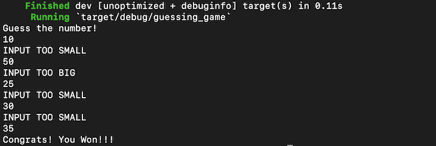

# 用 Rust Rhai 构建一个简单的猜谜游戏

> 原文：<https://blog.logrocket.com/building-game-rust-rhai/>

Rhai 是 Rust 的一种简单的嵌入式脚本语言。它提供了一种向 Rust 应用程序添加脚本的安全有效的方法。Rhai 的语法与 JavaScript 密切相关，这使得它更容易相对快速地掌握。

在这篇文章中，我们将看看 Rhai，并用 Rust 和 Rhai 构建一个非常简单的游戏。

如果你是 Rust 的新手，你可以看看我们的档案[这里](https://blog.logrocket.com/tag/rust/)找到大量关于 Rust 开发的所有基础知识的信息，作为起点，你可能会感兴趣。

也就是说，让我们继续这篇文章，在学习 Rhai 如何使用 Rust 之前，先快速浏览一下它。

*向前跳转:*

## 什么是铁锈？

Rust 是当今非常流行的语言。几年来，它一直被开发者选为最受欢迎的编程语言。尽管它的学习曲线很陡，但是一旦你掌握了它，Rust 会比其他语言提供很多好处，比如安全性、可维护性和可伸缩性。

许多公司已经采用 Rust 作为他们技术堆栈的一部分。Rust 也有一个强大的社区支持它，如果你正在长期寻找一个可扩展的和稳定的编程语言，它是一个很好的选择。

现在您已经知道了什么是 Rust，让我们看看 Rhai 以及它能为您做什么。

## Rhai

Rhai，也称为 RhaiScript，是一种快速的嵌入式脚本语言。它的核心目的是让您能够在 Rust 应用程序中编写脚本。

“Rhai”这个名字来自 Chai，一种 C++语言的脚本语言。和 Rhai 类似，Chai 可以用来用 C++写脚本。还有其他脚本语言，如 Lua，它可以与多种语言一起工作，如 C 和 Python。

使用 Rhai 的一个主要优势是其简单的语法。与 Rust 不同，正如我提到的，Rust 的学习曲线相对较陡，Rhai 在语法上类似于 JavaScript。

这使得 Rhai 在构建大规模 Rust 应用程序时非常有用。您甚至可以使用 Rhai 在 Rust 中编写复杂的算法，这是为 Rust 编写脚本的理想选择。

此外，与 JavaScript 等其他脚本语言相比，Rhai 是内存安全的。Rust 的核心原则之一是内存安全，所以 Rhai 总是在受控的环境中运行——Rhai 脚本不能改变其环境中的任何值，并且总是在沙箱中运行。使 Rhai 对开发人员极具吸引力的其他一些特性包括:

*   动态打字
*   与本机 Rust 函数和类型紧密集成
*   支持通过作用域将 Rust 值作为变量或常量传递到脚本中
*   从 Rust 调用脚本定义的函数
*   对额外依赖的需求最小
*   插件和库可以用来扩展 Rhai 的功能
*   函数和运算符重载
*   可以捕获共享值的闭包的可用性
*   用于修复错误的调试界面

## 用 Rhai 编写脚本

现在您已经知道了 Rhai 可以做什么，让我们看几个 Rhai 脚本的例子。

如果你想跟进，你可以使用[在线游乐场](https://rhai.rs/playground/stable/)自己尝试一些脚本。要在你的系统上安装和运行 Rhai，你可以遵循这里的安装说明。

首先，让我们用 Rhai 写一个 hello world 函数。

要在 Rhai 中使用 Rust，您必须创建一个脚本引擎实例。然后，您可以编写您的 Rhai 脚本，并通过调用 run()函数来执行它。

```
use rhai::{Engine, EvalAltResult};

pub fn main() -> Result<(), Box<EvalAltResult>>
{
  let engine = Engine::new(); // create an instance of "Engine"
  let script = "print('Hello World');"; // one line Rhai script stored in a variable
  engine.run(script)?; // Run the script
  Ok(())
}

```

看看上面的例子，我们调用“Engine”的一个实例来运行 hello world 脚本。但是运行 Rhai 脚本的最佳方式是将代码保存在文件中，然后从 Rust 函数中调用它们。

这是另一个从 Rhai 脚本文件执行 hello world 代码的例子。首先，在. rhai 文件中编写 Rhai 代码。

```
// fiename: helloworld.rhai
print("Hello world");

```

然后，您可以使用 run_file 或 eval_file 方法从 Rust 函数调用您的 Rhai 文件。

```
// filename hello.rs
use rhai::{Engine, EvalAltResult};

pub fn main() -> Result<(), Box<EvalAltResult>>
{
  let engine = Engine::new(); // create an instance of "Engine"
  engine.run_file("helloworld.rhai".into())?; // run the rhai script
  Ok(())
}

```

## 用 Rhai 写游戏

现在让我们用 Rust 和 Rhai 来尝试一个简单的游戏。我们将编写一个猜谜游戏，生成一个 1 到 100 之间的随机数，用户将一直猜，直到猜对为止。

我们将使用货物启动一个项目。 [Cargo](https://doc.rust-lang.org/cargo/) 是 Rust 的一个包管理器，类似于 Node.js 的 npm，除了一些其他有用的功能，它还可以帮助我们创建新项目和管理项目中的依赖关系。

(注意:[这里的](https://github.com/manishmshiva/guessing-game-rust-rhai)是项目的完整源代码，如果你想继续的话)

```
$ cargo new guessing_game
     Created binary (application) `guessing_game` package
$ cd guessing_game
$ ls
Cargo.toml src

```

Cargo.toml 文件包含项目的依赖项。在这个项目中，我们将使用两个依赖项— Rand 和 Rhai。

* * *

### 更多来自 LogRocket 的精彩文章:

* * *

我们需要 Rand 模块来生成一个随机数。Rhai 模块用于调用 Rhai 引擎运行我们的脚本。

现在我们已经设置了项目，我们可以开始编写代码了。我们的游戏逻辑是这样工作的:

*   生成一个 1 到 100 之间的数字
*   从用户那里获得猜测值作为输入。=
*   如果数字大于猜测值，让用户知道并再次获得猜测值
*   如果数字小于猜测值，让用户知道并再次猜测
*   如果用户猜出了正确的数字，告诉他们他们赢了，并退出该功能

在这个猜谜游戏中，我们将把条件流委托给 Rhai。我们将从用户那里获得输入，并将输入和目标数一起发送给 Rhai，告诉我们猜测值是大于、小于还是正确。

在我们开始写脚本之前，让我们理解作用域的概念。在 Rust 中，您可以创建一个作用域并向其中添加值。然后，可以将这个范围发送给我们的 Rhai 脚本，该脚本可以访问这个范围中的值。理解这一点很重要，因为由于内存安全的限制，Rhai 不能直接改变 Rust 程序中的任何值。

因此，让我们编写一个 Rhai 脚本，其中的函数接受一个参数，即猜测。我们将在 Rust 中创建一个作用域，并在运行时添加原始目标数并发送给 Rhai。

```
// filename: guess.rhai

fn guess(input) {
    if input == target{
        print(`Congrats! You Won!!!`);
        return true;
    }
    else if input > target{
        print(`INPUT TOO BIG`);
        return false;
    }
    else{
        print(`INPUT TOO SMALL`);
        return false;
    }
}

```

现在，让我们用 Rust 调用这个脚本。我们将把用户输入提示放在一个循环中，并使用 Rhai 来检查他们是否猜到了正确的数字。我们将向用户发送反馈，直到他们猜出正确的数字。

在前面的示例中，我们看到了运行脚本的 engine.run_file 函数。更好的方法是先编译脚本，然后调用脚本中的函数。对于 Rhai，我们使用 AST 编译器。AST 编译器超出了本文的范围，所以如果您想了解更多，这里的是一个很好的参考资料。

```
// src/main.rs
use rhai::{Engine, Scope, EvalAltResult};
use rand::Rng;
use std::io;
pub fn main() -> Result<(), Box<EvalAltResult>>{

    let engine = Engine::new(); //invoke the RHAI engine
    let mut scope = Scope::new(); // create a new scope

    let target = rand::thread_rng().gen_range(1..=100); // generate a random number between 1 and 100
    scope.push("target", target); // adding the target number to scope for Rhai

    // use ast compiler to compile the script
    let ast = engine.compile_file("guess.rhai".into())?;

    println!("{}","Guess the number!");

    // loop till the user guesses the correct number
    loop{
        let mut input = String::new(); // variable to get user input

        // get the input from user
        io::stdin()
            .read_line(&mut input)
            .expect("Failed to read line");

        // convert the input from string to number
        let guess: i32 = input
            .trim()
            .parse()
            .expect("Wanted a number");

        // call the guess function from the compiled script and pass scope along with the input number. Returns a boolean value. 
        let result = engine.call_fn::<bool>(&mut scope, &ast, "guess", ( guess,) )?;

        // if "true" is returned, break out of the loop
        if result {
            break
        };
    }

    Ok(())
}

```

您可以看到，我们已经调用了 Rhai 引擎的一个实例，随后创建了一个范围。随后生成一个 1 到 100 之间的随机数，并将其推送到作用域。

然后，我们编译 Rhai 脚本，用于调用“guess”函数。现在，我们可以创建一个循环，从用户那里获得输入，并使用 Rhai 脚本运行逻辑。

如果猜测正确，脚本返回 true。这是用来中断循环的。我们使用 engine.call_fn 方法来传递元组中的作用域、函数名和函数参数。

现在，让我们运行我们的脚本。我们可以使用“货物运行”命令来构建和运行我们的 Rust 程序。

```
$ cargo run 
```



恭喜你。你已经用 Rust 和 Rhai 编写了你的第一个游戏。您还可以使用 Rhai 来实现更复杂的脚本和算法，这些脚本和算法在 Rust 中可能更难编写。

## Rhai 的局限性

到目前为止，我们已经看到了很多关于 Rhai 和使用 Rhai 编写脚本的内容。现在，让我们看看 Rhai 的一些缺点。

*   有限的脚本功能:Rhai 不支持类或其他复杂的数据结构，所以 Rhai 最适合编写实用程序脚本，而不是全面的应用程序
*   没有垃圾收集:和 Rust 一样，Rhai 也没有垃圾收集
*   没有正式的语言语法:与 JavaScript 或 Lua 等脚本语言不同，Rhai 缺乏正式的语言语法。这限制了 Rhai 在面向对象语法方面的能力，比如使用继承、接口或泛型

## Rhai 的替代品

Rhai 并不是 Rust 唯一的脚本语言。让我们来看看您可能希望考虑的其他几个选项。

### 游戏列表

如果你正在寻找一个编写游戏的脚本引擎，Gamelisp 是 Rhai 的一个很好的替代品。Gamelisp 可以很容易地与 Rust 集成，并且比 Rhai 拥有更多的功能来编写游戏。这包括垃圾收集、内存安全以及与 Rust api 的无缝集成。

### 君主

[王座](https://lib.rs/crates/throne)是 Rust 的另一个有用的游戏脚本语言。它提供了快速原型和故事逻辑功能，这使它成为在 Rust 中编写游戏的绝佳选择。与 Rhai 相比，王座相对不受欢迎，但正在稳步赢得一个开发者社区。

### 双荷子

Dyon 是 Rust 的另一种动态脚本语言。Dyon 的特性包括 4D 向量、宏和动态模块。如果你想写简单的游戏和交互式编程环境，这是一个很好的选择。

## 结论

Rhai 是一种非常棒的 Rust 脚本语言。在使用 Rust 这样复杂的语言时，它为开发人员提供了简单的脚本编写体验。从编写复杂的算法到简单的游戏，Rhai 都是很好的工具。

与任何脚本语言一样，Rhai 也面临着 it 挑战。它是为使用 Rust 而设计的，所以它没有提供使用 JavaScript 等语言时所期望的全部功能。也就是说，在用 Rust 构建应用程序时，Rhai 是脚本语言的绝佳选择。

## [log rocket](https://lp.logrocket.com/blg/rust-signup):Rust 应用的 web 前端的全面可见性

调试 Rust 应用程序可能很困难，尤其是当用户遇到难以重现的问题时。如果您对监控和跟踪 Rust 应用程序的性能、自动显示错误、跟踪缓慢的网络请求和加载时间感兴趣，

[try LogRocket](https://lp.logrocket.com/blg/rust-signup)

.

[](https://lp.logrocket.com/blg/rust-signup)

LogRocket 就像是网络和移动应用程序的 DVR，记录你的 Rust 应用程序上发生的一切。您可以汇总并报告问题发生时应用程序的状态，而不是猜测问题发生的原因。LogRocket 还可以监控应用的性能，报告客户端 CPU 负载、客户端内存使用等指标。

现代化调试 Rust 应用的方式— [开始免费监控](https://lp.logrocket.com/blg/rust-signup)。