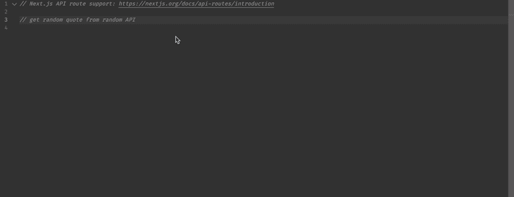
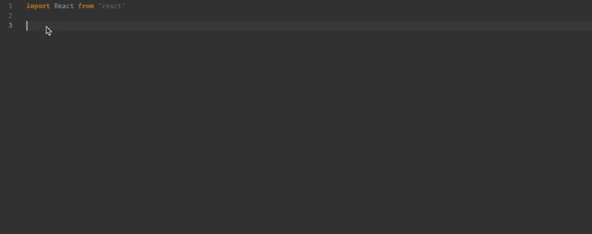
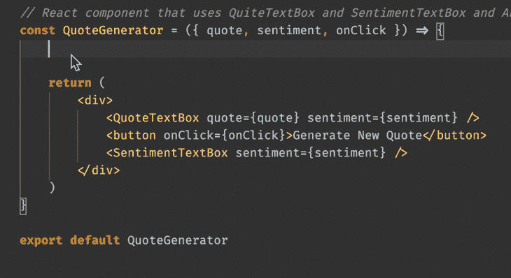
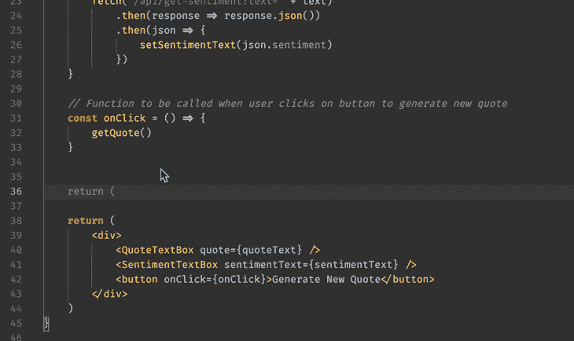
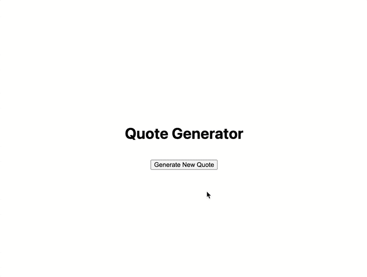

# GitHub Copilot 一周:仅使用 Copilot 构建应用程序

> 原文：<https://blog.logrocket.com/building-github-copilot-app/>

GitHub Copilot 是 GitHub 开发的最新工具，可以在 OpenAI 的帮助下自动完成代码。

Copilot 生成带有上下文的智能代码建议，如文档字符串、代码注释、函数名，甚至文件名。然后，它使用所有这些信息来建议代码片段，开发人员可以通过按键盘上的 Tab 键轻松接受这些代码片段。

根据 Copilot 网站的说法，它理解 Python、JavaScript、TypeScript、Ruby 和 Go，以及数十种其他语言，因为它“接受了数十亿行公共代码的训练”。虽然它目前仍处于有限的技术预览阶段，但感兴趣的人可以注册加入等候名单来试用它。

在本文中，我们将探索 Copilot 的主要功能，如何只用 Copilot 构建一个简单的应用程序，以及它的优缺点。

## 副驾驶的主要特点

Copilot 的主要特点是它的自动完成功能。例如，在输入功能描述时，Copilot 会在用户完成之前完成整个功能。虽然这种自动完成功能类似于其他一般的自动完成功能，但 Copilot 比它更进了一步。

当继续编写代码并添加更多注释时，Copilot 开始通过其 AI 能力理解代码的整个上下文。根据上下文，它会在句子中间自动补全注释。

比如通过添加一个函数，它生成一个整体的注释和一个函数；在这种情况下，它认为最后一个函数应该是一个乘法函数，如下所示。


Copilot 的另一个很酷的功能是能够看到 10 个整页的建议，而不是一个单独的一行建议，并选择哪个最适合代码。

为此，按苹果键盘上的`^ + Return`或窗口上的`Ctrl + Enter`打开一个建议列表，如下所示。


## 只用 GitHub Copilot 可以构建一个应用吗？

凭借 Copilot 的功能，我想挑战自己，只用 Copilot 构建一个小应用程序。对于这个挑战，我想创建一个简单的随机报价应用程序，它还显示报价的情绪。

为了做到这一点，我遵循了一些规则，看看我能从 Copilot 那里得到多少好处。

首先，如果我遇到问题，包括使用堆栈溢出或文档，我无法搜索互联网。这让我看到是否有可能完全依靠 Copilot 的建议来创建工作代码。

第二条规则是我不能自己写任何新代码。然而，我可以编写注释、变量、名称和函数名来触发 Copilot 的建议。类似地，我也可以对建议的代码做一些小的编辑。

最后，我可以触发 Copilot 建议列表并接受一个，因为这是一个内置功能。

### 设置项目

我选择 [Next.js 和 React 来构建这个项目](https://blog.logrocket.com/next-js-vs-react-developer-experience/)，因为它们是我最熟悉的工具，可以帮助我更好地评估 Copilot 的性能。

因为 React 使开发人员构建应用程序变得相当容易，我想看看 Copilot 如何管理 React 组件。

对于 Next.js，它提供了一个很好的起点，我不需要花很多时间来设置一切，并且它有内置的后端函数，这使得它可以在不触发 CORS 错误的情况下调用不同的 API 端点。

虽然对于这个小项目来说，Next.js 可能显得过于强大，但是没有必要事先安装其他依赖项，并且它集成的、易于使用的 API 函数使它成为应对这一挑战的好选择。

* * *

### 更多来自 LogRocket 的精彩文章:

* * *

### 开发 API 端点

从开发 API 端点开始，我想要一个报价生成器，它返回对一个`GET`请求和一个情感分析端点的随机报价。情感分析端点需要接收字符串作为查询参数并返回情感。

由于我不知道返回值会是什么格式，所以我让 Copilot 来写，看看它能返回什么。

#### `/api/get_quote` `GET`请求端点

为了使用 Next.js 创建两个端点，我在`api`文件夹中创建了两个文件:`get_quote.js`和`get_sentiment.js`。然后，Next.js 可以根据文件名创建这些端点。剩下的就是定义这些文件中的处理函数，我让 Copilot 替我做了。

对于`get_quote`端点，我写了一个注释并选择了一个好的建议:

```
// get random quote from random API

```

点击评论，Copilot 会回复一个不同选项的列表。



我选择的建议如下:

```
const getQuote = async () => {
    const response = await fetch('https://quotes.rest/qod.json')
    const quote = await response.json()
    return quote.contents.quotes[0].quote
}

```

这个建议奏效了。我检查过的几乎所有其他建议要么被破坏，要么需要一个我没有的 API 密钥。这可能是因为 Copilot 是在开源 GitHub 代码上接受培训的，一些端点可能已经过时了，这可能会令人沮丧。

此外，这个端点返回当天的报价，这意味着对于每个呼叫，我都会收到当天的相同报价，这不是我所期望的。相反，对于每个端点呼叫，我都希望收到不同的随机报价。

对于这个端点的第二部分，我需要为这个端点创建一个处理程序，调用 Copilot 已经生成的函数。处理程序是当客户机请求端点时 Next.js 调用的函数。

为此，我用它的名字声明了这个函数，看看 Copilot 是否会给出正确的实现。


副驾驶又让我大吃一惊。一切似乎都是正确的。

首先，它调用`getQuote`函数并返回从 web 服务接收的报价。然后，它将引用保存到常数中，并将 JSON 和检索到的引用一起返回给客户机。我唯一需要添加的是`.status(200)`向客户端发送`200`状态码。

### `/api/get_sentiment` `GET`请求端点

对于`get_sentiment`功能，我选择了 Copilot 的建议，不用改什么。

我输入了以下内容:

```
// determine if the text is positive or negative

```

然后，Copilot 建议了下面的代码，我用了:

```
async function getSentiment(text) {
    const response = await fetch(`http://text-processing.com/api/sentiment/`, {
        method: "POST",
        body: `text=${text}`,
        headers: {
            "Content-Type": "application/x-www-form-urlencoded",
        },
    })
    const json = await response.json()
    return json.label
}

```

但是，对于端点部分，我必须添加`.status(200)`，类似于`get_quote`端点。

以下是我提供给副驾驶的信息:

```
export default async function handler(req

```

然后，副驾驶提出了以下建议，我选择了这些建议:

```
export default async function handler(req, res) {
    const sentiment = await getSentiment(req.query.text)
    res.json({ sentiment })
}

```

Copilot 设法再次为我们提供了一个可行的解决方案，建议正确的处理程序，并计算`get_sentiment`句柄函数需要返回什么。这个建议看起来和我们以前的那个相似。

接下来让我们看看 Copilot 是如何处理 React 组件生成的。

### 反应组分

对于前端，我需要几个指定的 React 组件和一个带按钮的 React 控制器组件。显示文本所需的两个指定组件:一个用于报价文本，另一个用于情感文本。

让我们看看 Copilot 是如何创建这些 React 组件的。

#### `QuoteTextBox`

我从显示简单报价的`QuoteTextBox`组件开始；我添加了以下评论，看看 Copilot 会有什么建议:

```
// React component to show a quote inside a div

const

```

Copilot 建议了一个简单的功能组件，我根本不用修改。

```
const QuoteTextBox = (props) => {
  const { quote } = props
  return (
    <div className="quote-text-box">
      <p>{quote}</p>
    </div>
  )
}

export default QuoteTextBox

```


### `SentimentTextBox`

为了构建情感文本框，我添加了以下注释:

```
// React component to show sentiment text inside a div

const

```

对于这个文本框，要找到正确的建议有点困难，我必须滚动浏览大多数建议，直到找到一个适合我的代码的建议:

```
const SentimentTextBox = (props) => {
  // Get sentiment text from props
  const sentimentText = props.sentimentText

  // Return component
  return (
    <div className="sentiment-text-box">
      {sentimentText}
    </div>
  )
}

// Export component
export default SentimentTextBox

```

清楚地了解对 Copilot 的期望很重要，因为它只是一个工具，开发者不能只依赖它给出的第一个建议。



我仍然需要回到这个组件，将 API 返回的内容映射到可读的文本。例如，如果 web 服务返回`neg`，我需要将其映射到`Negative`。

#### 带按钮的控制器组件

我还需要一个控制器组件来管理所有的逻辑。我创建的前两个 React 组件只是接收数据并将其呈现在屏幕上，但是控制器组件需要管理 API 调用。

我开始输入以下内容:

```
// React component that uses QuiteTextBox and SentimentTextBox and APIs to show quotes and sentiment with a button to generate new quotes.

const

```

然后，副驾驶带来了这个建议:

```
const QuoteGenerator = ({quote, sentiment, onClick}) => {
  return (
    <div>
      <QuoteTextBox quote={quote} sentiment={sentiment} />
      <button onClick={onClick}>Generate New Quote</button>
      <SentimentTextBox sentiment={sentiment} />
    </div>
  )
}

export default QuoteGenerator

```

Copilot 建议的控制器组件看起来非常简单；它缺少 API 调用，并且没有为`SentimentTextBox`使用正确的道具。然而，Copilot 确实提供了正确的结构，它只是需要一些调整来完成它。

然后，我只需要向控制器组件添加功能。我没有通过`quote`、`sentiment`、`onClick`，而是让副驾驶生成。我还需要一些钩子来存储从调用 API 中收到的情绪和报价数据。

对于胡克斯，副驾驶马上就知道我需要什么。为了触发第一个钩子的建议，我开始输入一个注释，副驾驶员建议了正确的钩子。

然而，对于第二个钩子，我甚至不需要输入注释。我接受了第一个挂钩建议，移到下一行，副驾驶马上建议第二个挂钩。



虽然端点是正确的，但是我仍然需要做一些修改来使它们工作。我必须非常明确地问我想要什么，否则，Copilot 开始建议不同的网络服务。

我希望它只调用已经创建的端点。此外，当我收到报价时，我需要专门调用`getSentiment`端点，并将情感映射到人类可读的文本。



这是我做了一些小改动后的最终版本:

```
const QuoteGenerator = () => {
    // Hook to store text in state
    const [quoteText, setQuoteText] = React.useState('')
    const [sentimentText, setSentimentText] = React.useState('')

    // Function to get quotes from API /api/get-quote
    const getQuote = () => {
        fetch('/api/get-quote')
            .then(response => response.json())
            .then(json => {
                setQuoteText(json.quote)
                getSentiment(json.quote)
            })
    }

    // Function to get sentiment from API /api/get-sentiment\
    const getSentiment = (text) => {
        fetch('/api/get-sentiment?text=' + text)
            .then(response => response.json())
            .then(json => {
                setSentimentText(json.sentiment)
            })
    }

    // Function to be called when user clicks on button to generate new quote
    const onClick = () => {
        getQuote()
    }

    const mapSentimentToText = {
        'neg': 'Negative',
        'pos': 'Positive',
        'neutral': 'Neutral'
    }

    return (
        <div>
            <QuoteTextBox quote={quoteText} />
            <SentimentTextBox sentimentText={mapSentimentToText[sentimentText]} />
            <button onClick={onClick}>Generate New Quote</button>
        </div>
    )
}

export default QuoteGenerator

```

## 最终应用

在试用了我的简单报价生成应用程序后，我发现 Copilot 为创建一个简单的应用程序提供了足够的帮助。



我没有很高的期望，最初认为我需要修改很多代码来使应用程序工作。

然而，副驾驶让我大吃一惊。在一些地方，它给了我一些毫无意义的建议，但在另一些地方，这些建议是如此之好，以至于我无法相信 Copilot 做出了这些建议。

## 副驾驶的利与弊

为了总结我使用 Copilot 的经验，我整理了使用它的利与弊，这样你就可以决定 Copilot 是否是你可以每天使用的东西。

### 副驾驶职业

使用 Copilot 的主要优点是它提供了自动完成功能。作为一个自动完成工具，我相信它是目前市场上最好的；没有什么比副驾驶更有用的了。

Copilot 还向开发人员展示了解决不同问题的多种方法，这些问题可能不太明显。当需要代码片段时，10 条建议功能非常强大，通常可以用来代替堆栈溢出以提高效率。

总的来说，Copilot 使用起来很有趣。对于所有的技术爱好者来说，这是一个可以尝试的新事物，它让日常工作变得更加有趣。

### 副驾驶的缺点

虽然它的功能提供了更高的效率，但用户必须记住它是一个工具，而不是开发人员的替代品。因为 Copilot 不是万能的，用户不能完全依赖它来编写所有的代码。它的大部分建议需要修改以适应特定的需求。

最后，我注意到 Copilot 建议对逻辑很少的小组件使用 React 类，而不是带钩子的功能组件。因为它是在 GitHub 上公开可用的代码上训练的，Copilot 可能会为编码提供一些贬值的建议。

## 结论

GitHub Copilot 不是那种可以只听一个项目想法就能为你编码所有东西的东西。它也没有接管开发人员的工作。但是它可以使编码更容易。

GitHub Copilot 擅长小任务；当你开始问一些更复杂的问题时，你经常会听到废话。然而，对于初学者和有经验的开发者来说，它都是一个非常好的工具。

## 使用 LogRocket 消除传统反应错误报告的噪音

[LogRocket](https://lp.logrocket.com/blg/react-signup-issue-free)

是一款 React analytics 解决方案，可保护您免受数百个误报错误警报的影响，只针对少数真正重要的项目。LogRocket 告诉您 React 应用程序中实际影响用户的最具影响力的 bug 和 UX 问题。

[ ](https://lp.logrocket.com/blg/react-signup-general) [  ](https://lp.logrocket.com/blg/react-signup-general) [LogRocket](https://lp.logrocket.com/blg/react-signup-issue-free)

自动聚合客户端错误、反应错误边界、还原状态、缓慢的组件加载时间、JS 异常、前端性能指标和用户交互。然后，LogRocket 使用机器学习来通知您影响大多数用户的最具影响力的问题，并提供您修复它所需的上下文。

关注重要的 React bug—[今天就试试 LogRocket】。](https://lp.logrocket.com/blg/react-signup-issue-free)