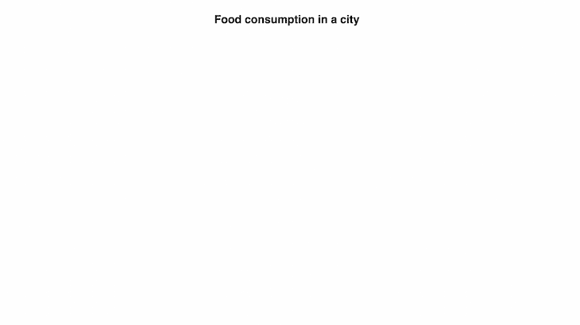
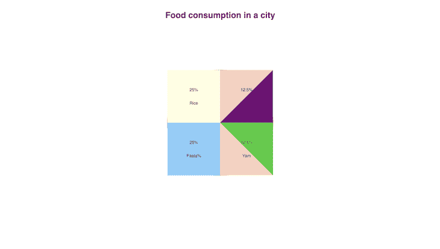
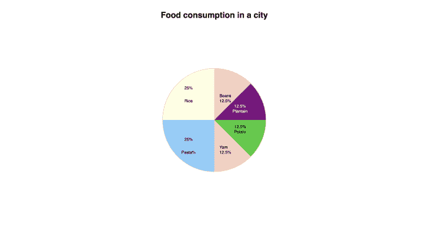
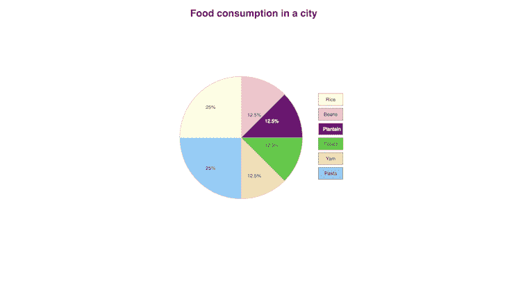
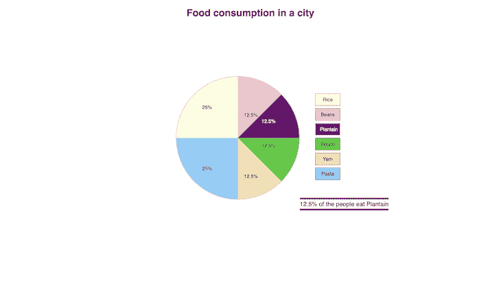
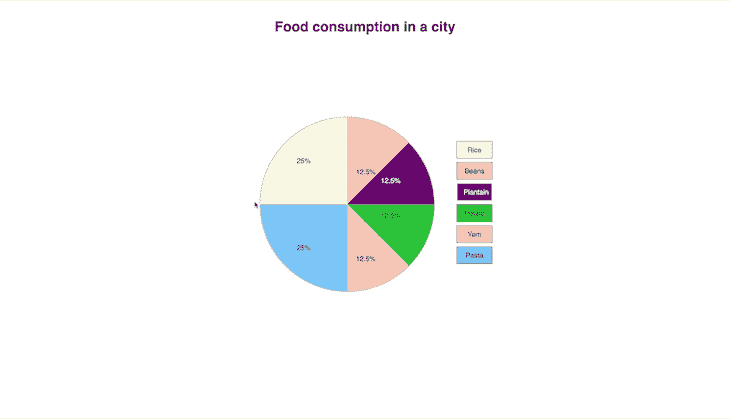

# 如何仅使用 CSS 和 HTML 构建交互式饼图

> 原文：<https://blog.logrocket.com/building-interactive-pie-charts-css-and-html/>

寻找一个简单的指南，如何用 CSS 和 HTML 制作饼状图？那你来对地方了！

饼图一直以来都被用来以美观的方式显示数据；它们通过显示大型数据集的不同部分是如何分解的来帮助分析数据。

那么，作为开发人员，我们有时会被要求在项目中的某个地方实现一个饼图，这不应该太令人惊讶。

当谈到在 web 上显示饼图时，有许多方法可以实现。可以使用 Excel 表、HTML 画布、SVG 和 JavaScript 等方法创建饼图。

构建前端饼状图的一种流行方式是使用许多可用的[图表库](https://blog.logrocket.com/top-5-react-chart-libraries/)中的一个，但是如果这不是你想要的——或者你不想向你的项目添加额外的库——你可以只使用 [HTML](https://blog.logrocket.com/tag/html/) 和 CSS 从头构建它们。

这就是我们今天要做的！我们将只使用 HTML 和 CSS 构建一个交互式饼图，显示一个城市的食品消费数据。

我们的项目完成后会是这样:


我们开始吧！

*向前跳转:*

## 基本 HTML 结构

我们将首先用下面的代码创建基本的 HTML 结构:

```
<!DOCTYPE html>
<html lang="en">
<head>
<meta charset="UTF-8">
<meta http-equiv="X-UA-Compatible" content="IE=edge">
<meta name="viewport" content="width=device-width, initial-scale=1.0">
<link rel="stylesheet" href="styles.css">
<title>Pie chart</title>
</head>
<body>
</body>
</html>

```

上面这几行是任何用 HTML 构建的网页的构建块，因为它们指定了我们希望浏览器如何阅读我们的页面。

## 创建包装器

接下来，我们将添加以下几行，它们将是饼图及其**键**部分的包装器。我们还将向页面添加一个标题，如下所示:

```
<h1 class="heading">Food consumption in a city</h1>
<div class="wrapper">

<div class="pie-wrap"></div>

<div class="key-wrap"></div>

</div>

```

## 基本风格

让我们给页面添加一些基本样式。在`styles.css`中，添加以下内容:

```
body{
    font-family: Helvetica, sans-serif;
}

.heading{
    text-align: center;
    margin-top: 50px;
}

```

上面的样式将文本居中，并在顶部留出一些空间。我们的页面应该是这样的:



## 添加饼图数据

在`pie-wrap` div 中，添加以下行作为饼图的数据:

```
<div class="pie-wrap">

<div class="light-yellow entry">
    <p>25%</p>
    <p class="entry-value">Rice</p>
</div>

<div class="sky-blue entry">
    <p>25%</p>
    <p class="entry-value">Pasta</p>
</div>

<div class="pink entry">
    <p>12.5%</p>
    <p class="entry-value">Beans </p>
</div>

<div class="purple entry">
    <p> 12.5%</p>
    <p class="entry-value">Plantain</p>
</div>

<div class="green entry">
    <p> 12.5%</p>
    <p class="entry-value">Potato</p>
</div>

<div class="wheat entry">
    <p> 12.5%</p>
    <p class="entry-value">Yam</p>
</div>

</div>

```

在上面的代码块中，我们添加了各种条目及其值。这些样式也以它们各自的颜色命名，这样更容易识别每个条目。

## 设计图表及其键的样式

还没有样式，所以我们现在应该添加它们。在`styles.css`中，添加以下样式:

```
.wrapper{
    display: flex;
    align-items: center;
    justify-content: center;
}

.pie-wrap{
    border: 2px solid lightgrey;
    width: 400px;
    height: 400px;
    margin: 10% 50px;
    position: relative;
    border-radius: 50%;
    color: black;
}

```

有了上面的样式，我们通过给饼状图和键一个灵活的位置，让它们并排在一起。这些键还不在我们的 HTML 文件中，所以让我们关注饼图本身。

我们的饼图现在是一个圆圈和一串数字和文本。让我们把它设计成我们都熟悉的饼图。将以下样式添加到 CSS 文件中:

```
.pie-wrap .entry{
    display: flex;
    flex-direction: column;
    justify-content: center;
    align-items: center;
}

/* *the individual entries* */

.sky-blue{
    background-color: lightskyblue;
    height:50%;
    width: 50%;
    display: block;
}

.light-yellow{
    background-color: lightyellow;
    height:50%;
    width: 50%;
}

```

在这个模块中，我们为条目元素做了一些常规的样式，然后我们设计了天蓝色和浅黄色的条目——它们分别代表**大米**和**面食**条目。

我们的页面现在应该是这样的:


这是我们的饼状图——但这些是正方形，对吗？我们很快就会处理，所以不要担心！在开始之前，让我们先设计其他条目的样式。

将以下几行添加到 HTML 文件中:

```
.pink{
    background-color: pink;
    height:50%;
    position: absolute;
    top: 0px;
    right: 0;
    width: 50%;
    clip-path: polygon(0 0, 100% 0%, 0% 100%);
}

.purple{
    background-color: purple;
    height:50%;
    width: 50%;
    right: 0;
    top: 0;
    position: absolute;
    clip-path:polygon(0% 100%, 100% 0%, 100% 100%);
}

.green{
    background-color: limegreen;
    height:50%;
    width: 50%;
    right: 0;
    top: 50%;
    position: absolute;
    clip-path:polygon(0% 0%, 100% 0%, 100% 100%);
}

.wheat{
    background-color: wheat;
    height:50%;
    width: 50%;
    right: 0;
    top: 50%;
    position: absolute;
    clip-path:polygon(0% 0%, 100% 100%, 0% 100%);
}

```

这些新行看起来不像前两个条目。这是因为**米饭**和**意大利面**的价格各为 25%，所以它们完全适合包装。其他人都是 12.5%，所以我们需要创建一个额外的风格他们的形状。

为了获得理想的形状，我们将使用 CSS `clip-path`属性。属性使我们能够使用 CSS 创建不同的形状。

> **注意，**你可以阅读更多关于 [`clip-path`](https://developer.mozilla.org/en-US/docs/Web/CSS/clip-path) 以及如何使用它。

每个条目都有独特的风格，它们的属性也各不相同。您可以根据自己的录入数据调整`clip-path`。我们还可以调整它们在容器中的位置，使其与其他物体完美融合。

我们的页面现在应该是这样的:



您可能已经注意到一些条目值是隐藏的；这是由于我们之前使用的一般输入样式造成的——让我们解决这个问题，让我们所有的输入数据都可见。

将以下样式添加到 CSS 文件中:

```
.pie-wrap .purple p{
    position: absolute;
    top: 140px;
    color: white;
}
.pie-wrap .purple p:first-child{
    top: 120px;
}

.pie-wrap .green p{
    position: absolute;
    top: 20px;
}

.pie-wrap .green p:first-child{
    top: 0px;
}

.pie-wrap .pink p, .pie-wrap .wheat p{
    position: absolute;
    left: 20px;
    top: 80px;
}

.pie-wrap .pink, .pie-wrap .wheat{
    justify-content: flex-start;
}

.pie-wrap .pink p:first-child, .pie-wrap .wheat p:first-child{
    top: 100px;
}

```

现在，我们的页面应该看起来像这样(所有的文本现在应该是可见的):

> **N.B .，**我们还把紫色条目中的文字做成了白色，这样用户就很容易读懂了。


## 完成饼图的样式设计

现在我们已经完成了条目和数据，让我们把饼状图做成一个真正的圆形饼状图，就像我们之前讨论的那样。

在你的`.pie-wrap`风格中添加下面一行:

```
overflow: hidden;

```

`overflow:hidden`样式删除了从`pie-wrap`容器中溢出的所有内容。

你的风格现在应该是这样的:

```
.pie-wrap{
    border: 2px solid lightgrey;
    width: 400px;
    height: 400px;
    margin: 10% 50px;
    position: relative;
    border-radius: 50%;
    color: black;
    overflow: hidden;
}

```

现在，我们的饼图看起来应该是这样的:



## 向饼图添加交互性

我们已经完成了饼图的基本要求，但是让我们添加一些更多的元素来使它更生动，并引入一些交互性。

我们将隐藏每个条目的食物名称，只有当用户将鼠标悬停在条目上时，它们才会显示。

让我们用下面的样式来做这件事:

```
.entry .entry-value{
    display: none;
    transition: all 500ms linear;
}
.entry:hover .entry-value{
    display: block;
}

```

食品的名称现在被隐藏了，但是隐藏和显示它们时的过渡并不像我们希望的那样平滑。让我们为条目添加过渡样式和悬停效果。

将以下几行添加到样式表中:

```
.entry{
    transition: all 500ms linear ;
}
.entry:hover{
    filter: invert();
}

```

现在，当我们悬停在每个条目上时，它会平滑过渡以显示食品的名称，同时还会反转条目的颜色。

它应该是这样的:


## 添加键和颜色

我们已经走了很长一段路，我们的图表现在看起来可以使用了，但是我们可以通过添加关键字来使它变得更漂亮！

让我们现在就这样做；将下面几行添加到之前创建的`.key-wrap` div 中:

```
<!--Pie chart keys  -->
<input type="radio" id="rice" name="values" class="rice-key"/>
<label for="rice" class="rice-label">Rice</label>

<input type="radio" name="values" id="beans" class="beans-key"/>
<label for="beans" class="beans-label"> Beans</label>

<input type="radio" name="values" id="plantain" class="plantain-key"/>
<label for="plantain" class="plantain-label"> Plantain</label>

<input type="radio" name="values" id="potato" class="potato-key"/>
<label for="potato" class="potato-label"> Potato</label>

<input type="radio" name="values" id="yam" class="yam-key"/>
<label for="yam" class="yam-label"> Yam</label>

<input type="radio" name="values" id="pasta" class="pasta-key"/>
<label for="pasta" class="pasta-label"> Pasta</label>

```

您现在应该会看到一些单选按钮和标签。它们将代表我们的饼图的关键。

让我们设计他们的风格，像这样:

```
.key-wrap label{
    display: block;
    border: 1px solid;
    width: 50px;
    text-align: center;
    padding: 10px 15px;
    cursor: pointer;
    margin-bottom: 8px;
    }

```

上面的样式为标签添加边框、填充、设置宽度，然后在每个标签下添加一些空间。单击标签还会检查单选按钮，因此为了美观起见，让我们隐藏单选按钮。

将以下样式添加到您的 CSS 文件中:

```
input[type="radio"]{
    display: none;
}

```

让我们也给标签添加一些背景颜色:

```
.rice-label{
    background-color: lightyellow;
}
.beans-label{
    background-color: pink;
}
.plantain-label{
    background-color: purple;
    color: white;
}
.potato-label{
    background-color: limegreen;
}
.yam-label{
    background-color: wheat;
}
.pasta-label{
    background-color: skyblue;
}

```

我们的键现在应该有相应的颜色，页面应该是这样的:



我们快完成了！

## 显示条目的文本

让我们再加入一条附加信息。当按键被点击时，文本应该显示在相应条目的信息下面。

为此，请将以下代码行添加到 HTML 文件中:

```
<p class="rice-text text">25% of the people eat Rice</p>
<p class="beans-text text">12.5% of the people eat Beans</p>
<p class="plantain-text text">12.5% of the people eat Plantain</p>
<p class="potato-text text">12.5% of the people eat Potato</p>
<p class="yam-text text">12.5% of the people eat Yam</p>
<p class="pasta-text text">25% of the people eat Pasta</p>

```

它应该在你的`.key-wrap` div 里面，就在**意大利面**的标签下面。

我们将隐藏这些文本，只显示相关的文本—让我们用下面的样式来做这件事:

```
.text{
    display: none;
    margin-left: -50px;
    position: absolute;
    margin-top: 50px;
    font-size: 20px;
    padding-bottom: 4px;
    padding-top: 4px;
    border-bottom: 5px solid ;
    border-top: 5px solid ;
}
.key-wrap label:active{
    opacity: .5;
}
.rice-key:checked ~ .rice-text, .beans-key:checked ~ .beans-text, .plantain-key:checked ~ .plantain-text,  .potato-key:checked ~ .potato-text, .yam-key:checked ~ .yam-text, .pasta-key:checked ~ .pasta-text{
    display: block;
}

```

使用上面的样式，我们隐藏了文本，当点击按键时，相应的信息就会显示出来。我们还添加了一个活动样式，所以当按键被点击时，会有一个快速的动画效果。

它现在应该是这样的:



## 改变边框颜色，打造独特风格

现在看起来一切正常，但只剩下一件事:让我们根据显示的信息将每个边框设置为不同的颜色——我们将用下面几行代码来完成:

```
.rice-text{
    border-color: black;
}
.beans-text{
    border-color:  pink;
}
.plantain-text{
    border-color:  purple;
}
.potato-text{
    border-color:  limegreen;
}
.yam-text{
    border-color:  wheat;
}
.pasta-text{
    border-color:  skyblue;
}

```

我们的页面现在应该是这样的:



而且，就是这样！

## 结论

我们制作了一个饼状图，显示一个城市的食物消费百分比。当鼠标悬停在上面时，它还会显示不同食物的名称。

如果你不想停留在它上面，还有一个额外的选项——键让你知道哪种食物有什么百分比。最后，当您单击不同的键时，我们会显示附加信息。

如果您已经完成了本教程，现在您应该能够仅使用 HTML 和 CSS 来构建饼图。当构建以[性能](https://blog.logrocket.com/best-practices-improving-css-performance/)为主要考虑因素的轻量级项目时，仅使用 HTML 和 CSS 就能派上用场。

您可以通过在自己的饼图或数据集中包含附加要素或使用不同的值来构建新获得的知识。你可以在 Github 上的[这个资源库中找到完整的代码。](https://github.com/Iamhafsah/Pie-charts)

感谢你的阅读，请在下面的评论中告诉我你的经历！

## 你的前端是否占用了用户的 CPU？

随着 web 前端变得越来越复杂，资源贪婪的特性对浏览器的要求越来越高。如果您对监控和跟踪生产环境中所有用户的客户端 CPU 使用情况、内存使用情况等感兴趣，

[try LogRocket](https://lp.logrocket.com/blg/css-signup)

.

[](https://lp.logrocket.com/blg/css-signup)[https://logrocket.com/signup/](https://lp.logrocket.com/blg/css-signup)

LogRocket 就像是网络和移动应用的 DVR，记录你的网络应用或网站上发生的一切。您可以汇总和报告关键的前端性能指标，重放用户会话和应用程序状态，记录网络请求，并自动显示所有错误，而不是猜测问题发生的原因。

现代化您调试 web 和移动应用的方式— [开始免费监控](https://lp.logrocket.com/blg/css-signup)。