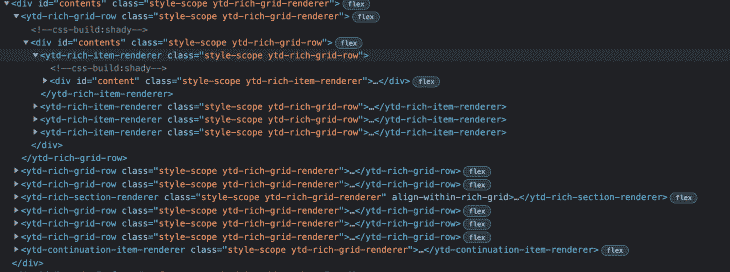

# 用 Tonic 构建 Jamstack 友好的组件

> 原文：<https://blog.logrocket.com/building-jamstack-friendly-components-with-tonic/>

前端 web 开发的世界变化很快，这要归功于混合市场的新框架以及快速发展的新思想和方法。

例如， [React](https://reactjs.org/) 和 [Vue](https://vuejs.org/) 是最早的基于组件的框架之一，它们是目前使用最广泛的。

随着 [Jamstack](https://jamstack.org/) 网站回归静态渲染网站而不是客户端动态渲染网站的趋势，基于 React 或 Vue 构建的新框架越来越受欢迎，比如 [Next。JS](https://nextjs.org/) 、[盖茨比](https://www.gatsbyjs.com/)，以及 [Nuxt](https://nuxtjs.org/) 。

此外，像 [Svelte](https://svelte.dev/) 这样的新框架正在被开发人员采用，因为它们使得创建静态呈现的网站更加容易，同时又不会失去 React 这样的动态框架的现代感。

## 什么是补药？

Tonic 是一个组件框架，它采用了这种最小但优雅的方法，并与 Jamstack 完美地配合，因为它不使用虚拟 DOM，默认情况下是在服务器端呈现的。它基于 web 组件，无需构建工具即可开箱即用。它超级小(5KB！)而且快得惊人。

本文解释了 Tonic 是如何工作的，以及在构建 Jamstack 网站时为什么应该使用它。我还将向您展示如何建立一个项目，并使用 Tonic 构建您的第一个组件。

## 滋补品是如何工作的

Tonic 使用原生的 [web 组件](https://developer.mozilla.org/en-US/docs/Web/Web_Components)，这是 2011 年引入的概念，现在默认情况下是所有现代浏览器的一部分。

由 web 组件驱动的最著名的网站之一是 YouTube。如果您查看源代码，您会很快发现 DOM 中的许多组件:



尽管在本地使用 web 组件是可能的，但它可能很复杂，很难理解。

因此，Tonic 在 web 组件之上添加了一些抽象，这使它看起来与 React 和 Vue 等框架类似，但是，除了使用[虚拟 DOM](https://reactjs.org/docs/faq-internals.html#:~:text=The%20virtual%20DOM%20(VDOM)%20is,This%20process%20is%20called%20reconciliation.&text=They%20may%20also%20be%20considered,virtual%20DOM%E2%80%9D%20implementation%20in%20React.) 来呈现元素之外，它实际上使用了浏览器内置的 web 组件。

## 为什么要用补品？

那么，既然有这么多框架，为什么还要使用它呢？以下是一些你应该使用 Tonic 来创建 Jamstack 网站的理由:

*   它超级小——基本不存在。它只有 350 行代码，大小为 5KB，所以你的网站会很快加载
*   你不需要构建工具。你曾经迷失在 webpack 配置中或者等待你的前端构建完成吗？使用 Tonic，代码可以开箱即用，不需要构建工具
*   当 web 组件出现在生产网站的 HTML 文档中时，您可以调试生产代码，并且可以在网站的 DOM 中看到组件的名称
*   开发人员的体验与其他现代框架是一样的，所以用它来编写组件还是很有趣的

## 如何使用补品

现在我们已经看到了 Tonic 的好处，让我们用它来启动一个项目。我们的目标是拥有一个包含一个`counter`按钮和一个数字的页面，这个数字在我们每次点击按钮时递增。

因为我们不需要构建工具，所以我们可以创建一个简单的 HTML 文件，其中包含:

```
<!doctype html>  
<html>  
<head>  
    <title>Website with Counter</title>  
      <script src="https://unpkg.com/@optoolco/[email protected]/dist/index.js" ></script>  
    <script type="module" src="index.js" ></script>  
    <script src="https://unpkg.com/@optoolco/[email protected]/dist/index.js" ></script>  
    <link rel="stylesheet" type="text/css" href="index.css" media="screen" />  
</head>  
<body>
    <p>Hello</p>
</body>  
</html>

```

让我们浏览一下`head`标签中的部分。我们有我们网站的`title`，我们需要一个`script`标签从 Tonic 导入代码。我们使用 [unpkg](https://unpkg.com/) 工具导入带有`script`标签的内容。

下一个`script`标签用于导入我们的自定义 JavaScript 文件，我们将创建该文件，但目前没有任何内容。我们还需要一些样式，所以我们将创建一个`style.css`文件并将`link`作为样式表。

`body`部分将包含我们的自定义计数器元素。我们暂时将它留空，当我们编写实际的组件时再填充它。现在，我们应该有以下经典的 web 开发文件:

```
-- index.css
-- index.js
-- index.html

```

就是这样！您不需要任何其他文件或节点模块文件夹。但是，如果您想在开发服务器上运行它，您可以将它初始化为一个 npm 包，并使用 [serve](https://www.npmjs.com/package/serve) 通过添加以下`package.json`文件在`localhost`上运行您的网站:

```
// package.json
{  
     "name": "tonic-proj",  
     "version": "1.0.0",  
     "description": "",  
     "main": "index.js",  
     "scripts": {  
         "start": "serve"  
     },  
     "keywords": [],  
     "author": "",  
     "license": "ISC",  
     "dependencies": {  
         "serve": "^13.0.2"  
     }  
}

```

然后，运行`npm i`、`npm start`后，项目在`localhost:3000`开启。这应该是一个相当静态的问候信息。

## 创造第一主音成分

到目前为止，这里没什么特别的。但是要添加实际的计数器，我们需要写第一个主音部分。

我们首先要从导入包中获取补品类。在`index.js`文件的顶部，我们添加以下内容:

```
const components = window.components;  
const Tonic = components.Tonic;

```

然后，我们可以创建扩展 Tonic 类的第一个组件:

```
// ...

class CounterElement extends Tonic {  
    state = { counter: 0 };

    click(e) {
        const trigger = Tonic.match(e.target, "button");
        if (trigger) {
            this.state.counter++;
            this.reRender();      
        }
    }

    render() {  
        if (typeof this.state.counter === "undefined") {  
            this.state.counter = 0;  
        }
        return this.html`
            <div>
                 <button>+1</button>
                <p>Count: ${this.state.counter.toString()}</p>
            </div>
        `;  
    }
}

```

如你所见，它看起来类似于 React 代码和 JSX 模式。与 React 类似，您的类中需要一个`render`函数，它返回继承函数`this.html`的返回值。该函数接受一个字符串，该字符串包含您希望组件呈现的 HTML 元素。

如果您想要呈现动态值，您可以简单地用模板字符串添加它们。该组件还接受一组在 HTML 元素事件被触发时触发的事件方法。

在我们的例子中，当有人点击我们的组件时，我们使用`click`事件来监听。因为我们希望计数只在我们实际点击按钮时触发，而不是在整个组件上，所以我们在`click`方法中为此添加了一个匹配检查。这是因为 Tonic 决定使用[事件委托](https://davidwalsh.name/event-delegate)而不是多个事件监听器。

为了结束这段 JavaScript 代码，我们还需要将这个组件添加到 Tonic 中，方法是在 JavaScript 文件的末尾添加以下内容:

```
// all the above code...

Tonic.add(CounterElement)

```

不要惊慌，你的网站上还没有显示任何东西。我们需要将元素添加到 HTML 文件中，方法是将它添加为 Tonic 自动为您创建的 web 组件。

```
...
<body>
    <counter-element></counter-element>
</body>

```

现在，您应该能够在 DOM 中看到您的 counter 元素，甚至应该能够在检查站点的 DOM 时看到它。


在这里，您可以看到我们刚刚创建的组件的全功能示例:

请看 [CodePen](https://codepen.io) 上 lowe1111 ( [@lowe1111](https://codepen.io/lowe1111) )
无标题的笔。

结论

## 用 Tonic 编写组件和用其他框架编写组件感觉非常相似。特别是，基于类的方法非常类似于在 React 中编写类组件。还有一些生命周期方法，在组件更新或呈现时会自动触发，并且在呈现函数中返回 HTML 元素。

主要区别在于，Tonic 使用您编写的精确代码，DOM 结构与您在服务器上拥有的和用户在浏览器中看到的完全匹配。

这意味着您可以创建 Jamstack 组件，而无需在服务器端安装构建工具或呈现引擎。它利用了 web 组件的力量。

此外，尽管开发人员的体验与 React 或其他现代框架非常相似，但使用 Tonic 要简单得多，调试起来也更简单，这要归功于缺少构建工具，并且由于静态呈现，Tonic 还能以闪电般的速度加载和呈现。黑客快乐！

使用 [LogRocket](https://lp.logrocket.com/blg/signup) 消除传统错误报告的干扰

## [LogRocket](https://lp.logrocket.com/blg/signup) 是一个数字体验分析解决方案，它可以保护您免受数百个假阳性错误警报的影响，只针对几个真正重要的项目。LogRocket 会告诉您应用程序中实际影响用户的最具影响力的 bug 和 UX 问题。

[](https://lp.logrocket.com/blg/signup)

然后，使用具有深层技术遥测的会话重放来确切地查看用户看到了什么以及是什么导致了问题，就像你在他们身后看一样。

LogRocket 自动聚合客户端错误、JS 异常、前端性能指标和用户交互。然后 LogRocket 使用机器学习来告诉你哪些问题正在影响大多数用户，并提供你需要修复它的上下文。

关注重要的 bug—[今天就试试 LogRocket】。](https://lp.logrocket.com/blg/signup-issue-free)

Focus on the bugs that matter — [try LogRocket today](https://lp.logrocket.com/blg/signup-issue-free).