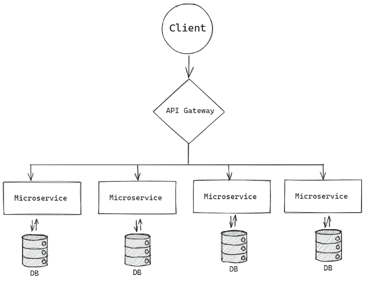
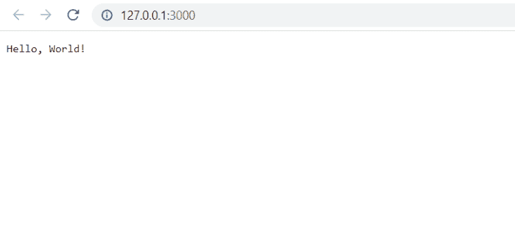
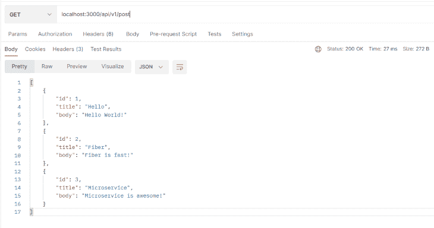
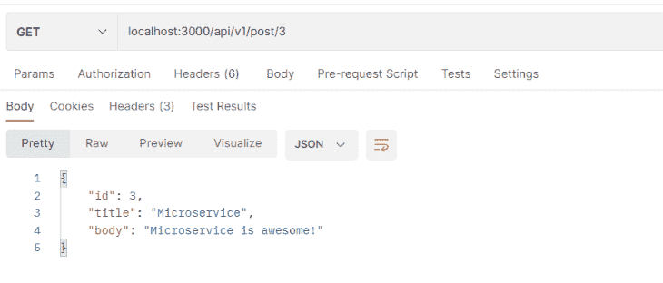

# 使用 Fiber 在 Go 中构建微服务

> 原文：<https://blog.logrocket.com/building-microservices-go-fiber/>

Go 由谷歌工程师罗伯特·格里斯默(Robert Griesemer)、罗布·派克(Rob Pike)和肯·汤普森(Ken Thompson)于 2007 年设计，以快速可靠而闻名，这也是它至今仍受 web 开发人员欢迎的原因。Go 与微服务的强大功能相结合，有助于构建快速、高效、健壮的应用。

在本文中，您将了解如何使用名为 [Fiber](https://gofiber.io/) 的包在 Go 中构建微服务，这是一个受 Node.js Express 框架启发的 Go 框架。它建立在 T2 快速 HTTP 包的基础上，该包被认为是 Go 中最快的 HTTP 引擎。

## 什么是微服务？

微服务或微服务架构是一种架构风格，它将应用程序构建为一组服务，这些服务具有以下特点:

*   可维持的
*   可试验的
*   松散耦合
*   可独立部署
*   由一个小团队拥有

> 微服务架构是一种应用程序架构，其中应用程序是作为服务集合开发的。它提供了独立开发、部署和维护微服务架构图和服务的框架—[Google](https://cloud.google.com/learn/what-is-microservices-architecture)



The above diagram shows what a microservices architecture looks like. Notice that all the microservices are connected through an API gateway that communicates with the client.

微服务架构有助于加快开发过程，而且，因为每个服务都是次要的，所以构建服务可以由小团队来完成。使用微服务维护和测试代码也更容易。

因为所有服务都是独立的，它还提供了改进的故障隔离，所以，如果一个服务失败，整个系统不一定停止工作。

## 什么是纤维？

Fiber 是一个 web 框架，很大程度上受到了 Express 的启发。如果您来自 Node.js、Python 或 Ruby，您会发现 Fiber 非常容易上手。Go 速度快，内存占用少，性能高，这意味着它也使 Fiber 框架速度更快。

Fiber 提供了一种健壮的路由机制，并且为大多数任务内置了中间件，简化了静态资产服务或数据库连接。

Fiber 拥有完整的文档、支持和一个 T2 的大型社区。尽管 Fiber 的主要用例是构建一个一体化的 web 框架，但它也可以用来创建微服务。

## 如何使用光纤

在直接使用光纤构建微服务之前，让我们看一个简单的 Hello World 示例。首先，使用您喜欢的文本编辑器打开一个文件夹来保存您的文件。

要在该文件夹中安装任何依赖项，请使用`go mod`初始化该目录。在您的终端中运行这个命令:`go mod init example.com/username/folder`，其中`example.com`可以是您存储代码的任何网站，`username`是您的用户名，`folder`是您想要保存文件的文件夹名。

运行该命令将在您的工作目录中创建一个`go.mod`文件。这个 [`go.mod`文件](https://go.dev/doc/tutorial/create-module)跟踪项目中使用的所有依赖项。

既然已经创建了`go.mod`文件，您就可以将 Fiber 作为一个依赖项来安装了。在您的终端中运行`go get -u github.com/gofiber/fiber/v2`来下载依赖项。

现在让我们看一下`Hello World`的例子，以了解光纤的基本知识。

```
package main

import "github.com/gofiber/fiber/v2"

func main() {
    app := fiber.New()

    // Create a new endpoint
    app.Get("/", func(c *fiber.Ctx) error {
        return c.SendString("Hello World!")
    })

    // Start server on port 3000
    app.Listen(":3000")
}

```

在上面的例子中，`app := fiber.New()`正在初始化一个新的纤程实例。`app.Get`方法向根路由`/`设置一个 Get 请求，根路由中设置一个字符串作为响应，发送文本`Hello World!`。

最后，`app.Listen(":3000")`在端口`3000`启动一个服务器。上面的代码将给出如下输出:



现在，您已经对光纤的工作原理有了基本的了解，让我们使用它来构建一个简单的微服务。

## 使用光纤在 Go 中构建微服务

我们将构建的微服务由两条路线组成:第一条路线返回所有博客文章，第二条路线根据 ID 返回文章。

```
/api/v1/post - returns all posts
/api/v1/:id - returns post that matches the ID

```

因为这个微服务构建简单，所以我们不会将代码重构为多个文件。相反，代码将是一个单独的`main.go`文件。此外，在这个用例中，我们不会使用数据库。

在`main.go`中，创建一个名为`Blog`的结构——它是字段的集合。

```
type Blog struct {
    Id    int    `json:"id"`
    Title string `json:"title"`
    Body  string `json:"body"`
}

```

上述结构类似于一篇博客文章。每篇博文都包含一个 ID、一个标题和一个正文。`json:`定义当呈现为 JSON 时要显示的字段名称。

接下来，创建一个类型为`Blog`的名为`blogs`的变量，并定义该变量中的值:

```
type blogPosts []Blog

var blogs = blogPosts{
    {Id: 1, Title: "Hello", Body: "Hello World!"},
    {Id: 2, Title: "Fiber", Body: "Fiber is fast!"},
    {Id: 3, Title: "Microservice", Body: "Microservice is awesome!"},
} 

```

## 在 Go 中定义路线

现在，让我们定义路线。

```
func setupRoutes(app *fiber.App) {
    app.Get("/api/v1/post", GetPosts)
    app.Get("/api/v1/post/:id", GetPost)
}

```

创建一个名为`setupRoutes`的函数。它需要一个`fiber.App`的参数。在这里，我们正在定义路线。这个函数使用作为第二个参数传递的函数来映射端点。

`app.Get("/api/v1/post", GetPosts)`告知在收到路由`/api/v1/post`的 get 请求时，将调用`GetPosts`函数。并且，在对路由`/api/v1/post/:id`的 get 请求中，其中`id`是一个变量，将调用`GetPost`函数。

现在让我们定义函数。`GetPost`函数是一个简单的函数，它返回来自`blogs`变量的所有数据。

```
func GetPosts(c *fiber.Ctx) error {
    return c.JSON(blogs)
}

```

`[fiber.Ctx](https://docs.gofiber.io/api/ctx#context)`返回一个`[fasthttp.RequestCtx](https://pkg.go.dev/github.com/valyala/fasthttp#RequestCtx)`实例。它包含传入的请求并管理传出的响应。该函数通过将变量转换为 JSON 来返回`blogs`变量。

现在我们将构建`GetPost`函数。我们先来看看函数:

```
func GetPost(c *fiber.Ctx) error {
    id := c.Params("id")
    i, err := strconv.Atoi(id)
    if err != nil {
        return c.JSON(fiber.Map{"error": "Invalid ID"})
    }
    for _, s := range blogs {
        if s.Id == i {
            return c.JSON(s)
        }
    }
    return c.JSON(fiber.Map{"error": "Post not found"})
}

```

`c.Params`方法获取路由中传递的参数。该函数的第一步是将参数存储到变量中。变量被定义为`id`，它存储了参数`id`。

因为这是一个简单的例子，我们将使用一个`for`循环来查找数据。当使用真正的数据库时，您将有方法找到特定的数据。

默认情况下，`Params`方法返回一个字符串。你必须把字符串转换成整数。否则，将不可能比较整数值和字符串，因为`Blog`结构的`Id`类型是`int`类型。

但是，您可以使用`[ParamsInt](https://docs.gofiber.io/api/ctx#paramsint)`方法通过`id, err := c.ParamsInt("id")`从路由参数中获得一个整数值。对于这个例子，我们将坚持使用`Params`方法。

来自`strconv`包的`Atoi`(“ASCII to integer”)方法将被用来把值转换成整数。该函数返回两个值，转换后的结果和错误。

`i`和`err`变量分别存储转换值和误差。如果`err`变量不是`nil`，那么会有一些错误，函数将返回一个 JSON 值，带有`"error": "Invalid ID"`的键值对。

如果`err`为零，则过程跳转到`for`循环。在`for`循环中，从参数接收的 ID 值与来自`blogs`变量的帖子 ID 进行比较。如果两个值匹配，它将返回特定的结构值。在任何其他情况下，该函数将返回`"error": "Post not found"`。

这是路由所需的最后一个功能。现在，我们可以看看`main`函数。

## `main`光纤的功能

下面是`main`函数的样子:

```
func main() {
    app := fiber.New()

    // Create a new endpoint
    app.Get("/", func(c *fiber.Ctx) error {
        return c.JSON(fiber.Map{"data": "Hello World!"})
    })

    setupRoutes(app)
    // Start server on port 3000
    app.Listen(":3000")
}

```

首先，用`fiber.New()`方法初始化纤程。然后，作为测试路由，根路由被设置在它返回 map 值`"data": "Hello World!"`的地方。你已经看到了上面的`setupRoutes`函数。`setupRoutes`功能保存了我们 app 的路线。

在这个函数中传递了`app`实例来初始化路由。最后，使用`app.Listen(":3000")`在端口`3000`启动一个服务器。

现在，我们准备好了！如果您使用`go run main.go`从终端运行`main.go`文件，它将在您的本地主机端口`3000`启动服务器。你现在可以使用 [Postman](https://www.postman.com/) 或者任何你喜欢的 API 客户端来测试它。

## 使用 Postman 测试光纤

如果您访问端点`localhost:3000/api/v1/post`，您将获得您在`blogs`变量中定义的所有值:



访问路由`localhost:3000/api/v1/post/:id`，其中`id`变量是博客文章中可用的 ID，将返回特定的文章。



## 结论

在本文中，我们介绍了微服务架构的基础知识，并学习了如何使用纤程在 Go 中构建微服务。

Fiber 速度很快，类似于 Node.js express 框架，使得 Node.js 开发人员更容易过渡到使用 Go。本文中讨论的完整代码可以在[这个 repo](https://github.com/nemo0/go-fiber-example) 中找到。