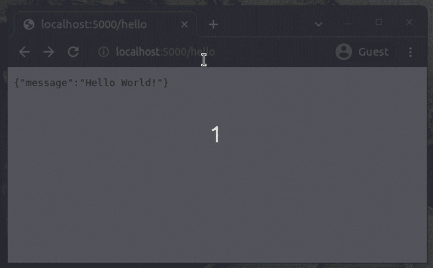
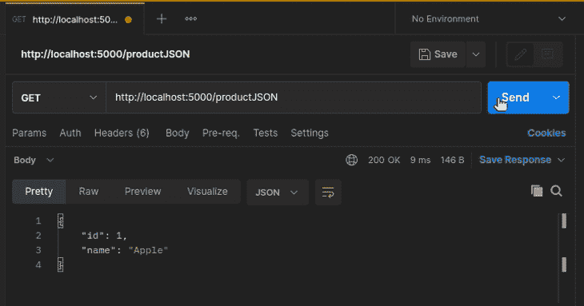
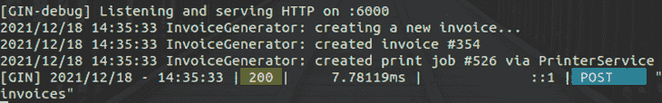
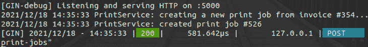

# 用 Gin - LogRocket 博客构建 Go 中的微服务

> 原文：<https://blog.logrocket.com/building-microservices-go-gin/>

开发人员曾经使用单片架构构建基于云的应用程序，他们通常将整个应用程序逻辑嵌入到一个进程中，并在一台服务器计算机上运行。但是整体架构模式为现代 web 应用程序后端带来了可伸缩性挑战和可维护性问题。

现在，几乎所有的开发者都使用微服务架构来避免那些问题。一种方法是使用 Go，一种快速、简单、通用且开发人员友好的编程语言。

我们也可以使用 [Gin 框架](https://github.com/gin-gonic/gin)，它为您提供构建 RESTful 现代微服务所需的所有特性。在本教程中，我将解释如何在 Go with Gin 中构建微服务。

## 杜松子酒的突出特点

Gin 是一个面向 Go 生态系统的全功能、高性能的 HTTP web 框架。由于以下特性，它在 Gophers (Go 开发者)中越来越受欢迎。

### 表演

Gin 附带了一个非常快速和轻量级的 Go HTTP 路由库(参见详细的[基准](https://gin-gonic.com/docs/benchmarks/))。它使用轻量级[http outer](https://github.com/julienschmidt/httprouter)路由库的定制版本，该库使用快速的、基于基数树的路由算法。

### 灵活、可扩展且对开发人员友好的 API

Gin 的中间件系统可以让你随心所欲地扩展框架。它还允许您根据需要定制 HTTP 服务器实例。Gin 为开发人员提供了一个高效的 API，具有路由分组、结构绑定、内置验证器等特性。

### 其他内置功能

*   XML/JSON/YAML/ProtoBuf 渲染
*   错误管理和日志记录
*   JSON 验证
*   静态文件服务功能

## 杜松子酒与其他热门套餐的对比

Gin 提供了具有竞争力的快速 HTTP 路由实现。Gin 比其他流行的路由库和 web 框架更快。它由许多开源贡献者积极维护，经过良好的测试，并且 API 被锁定。因此，未来的 Gin 版本不会破坏您现有的微服务。

我们也可以使用内置的 Go `net/http`包来构建微服务，但是它不提供参数化路由。您可以使用 [Gorilla mux](https://github.com/gorilla/mux) 作为您的路由库，但是与 Gin 相比，Gorilla mux 并不是一个功能全面的 web 框架——它只是一个 HTTP 请求多路复用器。Gorilla mux 不提供内置的数据呈现、JSON 绑定或验证，也不像 Gin 那样提供预建的中间件。

Gin 为 CORS、超时、缓存、认证和会话管理提供了预构建的中间件。

## Gin 框架入门

让我们创建一个简单的微服务来开始使用这个框架。首先，我们需要建立我们的开发环境。

### 设置开发环境

确保你的电脑已经有 Go ≥ v1.13，从[官方 Go 二进制发布](https://go.dev/doc/install)开始，你可以随时安装最新的稳定版本。

现在，我们需要初始化一个新的 Go 项目来使用远程依赖项并下载 Gin 框架包。输入以下命令来初始化一个新项目。

```
mkdir simpleservice
cd simpleservice
go mod init simpleservice

```

现在，下载并参考 Gin 框架。

```
go get -u github.com/gin-gonic/gin

```

### 构建简单的微服务

将下面的代码添加到`main.go`源文件中开始。

```
package main
import (
    "runtime"
    "github.com/gin-gonic/gin"
)
func main() {
    router := gin.Default()
    router.GET("/hello", func(c *gin.Context) {
        c.JSON(200, gin.H{
            "message": "Hello World!",
        })
    })

    router.GET("/os", func(c *gin.Context) {
        c.String(200, runtime.GOOS)
    })
    router.Run(":5000")
}

```

上面的代码定义了两个 HTTP `GET`端点:`/hello`和`/os`。`/hello`端点返回一个 JSON 格式的消息。`/os`端点以纯文本格式返回当前操作系统的名称。

在定义了端点和处理程序之后，我们需要通过`Run()`函数调用启动 HTTP 服务器实例。

使用以下命令运行这个示例微服务。

```
go run main.go

```

通过从您的 web 浏览器导航到以下 URL 来测试它。

```
http://localhost:5000/hello
http://localhost:5000/os

```



## 使用 Postman 测试微服务

刚才，我们用 web 浏览器发送了一个 HTTP GET 请求。我们还可以使用 cURL 命令行工具来测试基于 HTTP 的微服务。

像 Postman 这样的 API 测试应用程序提供了测试微服务所需的所有功能。我将在接下来的演示中使用 Postman 工具。如果您是 Postman 新手，请测试示例微服务以入门。


## 用路由构建微服务

我们可以创建一个只有一个端点来执行单个动作的微服务，就像众所周知的无服务器概念一样。但是我们经常让微服务执行多个动作。例如，您可以构建一个微服务来获取产品详细信息、添加新产品以及删除现有产品。这种方法被称为 RESTful 模式。

看看下面这些宁静的路线。

*   `/products`
*   `/products/:productId/reviews`

开发人员通常为每条路线创建多个端点。例如，可以在`/products`路线下使用以下端点。

*   `GET /products`–列出几种产品
*   `GET /products/:productId`–获取一种产品的详细信息
*   `POST /products`–添加新产品
*   `PUT /products/:productId`–更新产品
*   `DELETE /products/:productId`–删除产品

Gin 为我们提供了 API 函数，通过创建多个端点来构建我们的微服务。此外，为了更好的可维护性，我们可以对路由进行分组。

请看下面的示例代码。

```
package main
import (
    "github.com/gin-gonic/gin"
)
func endpointHandler(c *gin.Context) {
    c.String(200, "%s %s", c.Request.Method, c.Request.URL.Path)
}

func main() {
    router := gin.Default()
    router.GET("/products", endpointHandler)
    router.GET("/products/:productId", endpointHandler)
    // Eg: /products/1052
    router.POST("/products", endpointHandler)
    router.PUT("/products/:productId", endpointHandler)
    router.DELETE("/products/:productId", endpointHandler)
    router.Run(":5000")
}

```

上面的代码定义了五个端点来对产品执行 CRUD 操作。这里，代码使用了一个名为`endpointHandler`的通用端点处理程序，但是您可以使用 Gin 上下文引用创建不同的处理程序来执行不同的操作。

如果你的 RESTful API 有多个版本，你可以使用 Gin 的路由分组特性来编写干净的 API 代码。看下面这个例子。

```
package main
import (
    "github.com/gin-gonic/gin"
)
func v1EndpointHandler(c *gin.Context) {
    c.String(200, "v1: %s %s", c.Request.Method, c.Request.URL.Path)
}
func v2EndpointHandler(c *gin.Context) {
    c.String(200, "v2: %s %s", c.Request.Method, c.Request.URL.Path)
}

func main() {
    router := gin.Default()

    v1 := router.Group("/v1")

    v1.GET("/products", v1EndpointHandler)
    // Eg: /v1/products
    v1.GET("/products/:productId", v1EndpointHandler)
    v1.POST("/products", v1EndpointHandler)
    v1.PUT("/products/:productId", v1EndpointHandler) 
    v1.DELETE("/products/:productId", v1EndpointHandler)

    v2 := router.Group("/v2")

    v2.GET("/products", v2EndpointHandler)
    v2.GET("/products/:productId", v2EndpointHandler)
    v2.POST("/products", v2EndpointHandler)
    v2.PUT("/products/:productId", v2EndpointHandler)
    v2.DELETE("/products/:productId", v2EndpointHandler)

    router.Run(":5000")
}

```

## 接受、处理和回应

每个 RESTful 微服务执行三个关键操作:

1.  接受数据
2.  处理/处理数据
3.  返回数据

微服务通常会向外部环境(如网络或移动应用)发送响应，但它们也可以相互通信。开发人员使用不同的数据格式进行微服务通信，如 JSON、XML 或 YAML。

### 通过 URL 参数接受数据

我们在前面的端点中使用了`:productId`，但是我们也可以在 URL 中提供除了`:productId`之外的值。URL 参数是接受微服务的短输入的好选择。

让我们用两个 URL 参数写一个简单的计算器。将以下代码添加到`main.go`文件中，并启动服务器。

```
package main
import (
    "fmt"
    "strconv"
    "github.com/gin-gonic/gin"
)
func add(c *gin.Context) {
    x, _ := strconv.ParseFloat(c.Param("x"), 64)
    y, _ := strconv.ParseFloat(c.Param("y"), 64)
    c.String(200,  fmt.Sprintf("%f", x + y))
}

func main() {
    router := gin.Default()
    router.GET("/add/:x/:y", add)
    router.Run(":5000")
}

```

上面的代码实现了一个`GET`资源，让我们通过 URL 参数发送两个数字。当它接收到两个数字时，它以这两个数字的和作为响应。比如`GET /add/10/5`会返回`15`，如下图。


### 接受来自 HTTP 消息正文的数据

出于各种原因，我们通常不发送大量带有 URL 参数的数据——URL 可能会变得很长，我们可能会遇到一般的 RESTful 模式冲突，等等。HTTP 消息体是发送任何大型输入的最佳位置。

但是 URL 参数仍然是发送过滤器和模型标识符的最佳方式，比如像`customerId`、`productId`等短数据。

让我们通过使用 HTTP 消息体接受数据来重构前面的计算器端点。

```
package main
import (
    "github.com/gin-gonic/gin"
)
type AddParams struct {
    X float64 `json:"x"`
    Y float64 `json:"y"`
}
func add(c *gin.Context) {
    var ap AddParams
    if err := c.ShouldBindJSON(&ap); err != nil {
        c.JSON(400, gin.H{"error": "Calculator error"})
        return
    }

    c.JSON(200,  gin.H{"answer": ap.X + ap.Y})
}

func main() {
    router := gin.Default()
    router.POST("/add", add)
    router.Run(":5000")
}

```

我们新的计算器实现有一个`POST`端点，接受 JSON 格式的数据。我们不需要在 Gin 处理程序中手动[解组 JSON 有效负载](https://blog.logrocket.com/using-json-go-guide/)——相反，Gin 框架提供了内置函数来将 JSON 结构绑定到内部 Go 结构。上面的代码将传入的 JSON 有效负载绑定到`AddParams`结构。

通过向`POST /add`发送以下 JSON 有效负载，用 Postman 测试上面的示例代码

```
{
    "x": 10,
    "y": 5
}

```


### 以 JSON、YAML 和 XML 格式返回数据

正如我们之前讨论的，微服务使用各种数据格式进行通信。几乎所有的现代微服务都使用 JSON 进行数据交换，但是您可以根据需要使用 YAML 和 XML 数据交换格式。您可以从 Gin 路由器序列化各种数据格式，如下所示。

```
package main
import (
    "github.com/gin-gonic/gin"
)
type Product struct {
    Id int `json:"id" xml:"Id" yaml:"id"`
    Name string `json:"name" xml:"Name" yaml:"name"`
}

func main() {
    router := gin.Default()
    router.GET("/productJSON", func(c *gin.Context) {
        product := Product{1, "Apple"}
        c.JSON(200, product)
    })

    router.GET("/productXML", func(c *gin.Context) {
        product := Product{2, "Banana"}
        c.XML(200, product)
    })
    router.GET("/productYAML", func(c *gin.Context) {
        product := Product{3, "Mango"}
        c.YAML(200, product)
    })
    router.Run(":5000")
}

```

上面的代码有三个端点，以三种不同的数据格式返回数据:JSON、XML 和 YAML。可以传递一个 Go struct 实例，让 Gin 根据 struct 标签自动序列化数据。运行上面的代码片段，用 Postman 测试，如下所示。



## 验证传入的请求

微服务可以处理各种传入的请求。假设您正在实现一个微服务，通过与打印设备通信，将数字文档打印在纸上。如果您需要限制一个打印作业的页数，该怎么办？如果请求不包含启动新打印作业所需的输入，该怎么办？然后，您必须验证请求，并相应地用每个错误消息进行响应。

Gin 提供了一个基于 struct-tag 的验证特性，用更少的代码实现验证。看下面的源代码。

```
package main
import (
    "fmt"
    "github.com/gin-gonic/gin"
)
type PrintJob struct {
    JobId int `json:"jobId" binding:"required,gte=10000"`
    Pages int `json:"pages" binding:"required,gte=1,lte=100"`
}

func main() {
    router := gin.Default()
    router.POST("/print", func(c *gin.Context) {
        var p PrintJob
        if err := c.ShouldBindJSON(&p); err != nil {
            c.JSON(400, gin.H{"error": "Invalid input!"})
            return
        }
        c.JSON(200, gin.H{"message": 
            fmt.Sprintf("PrintJob #%v started!", p.JobId)})
    })
    router.Run(":5000")
}

```

我们需要使用`binding` struct 标签来定义`PrintJob` struct 中的验证规则。Gin 使用 [`go-playground/validator`](https://github.com/go-playground/validator) 来实现内部绑定验证器。上述验证定义接受基于以下规则的输入:

*   `JobId`:必输项，x ≥ 10000
*   页数:必选，100 ≥ x ≥ 1

上述微服务将根据验证定义接受输入，如下所示。


## 用中间件扩展 Gin

中间件指的是在两个相连的软件组件之间起作用的组件。Gin 社区在这个 [GitHub 仓库](https://github.com/gin-contrib)中维护了几个通用中间件。

Gin 的中间件系统允许开发人员修改 HTTP 消息和执行常见操作，而无需在端点处理程序中编写重复的代码。当您使用`gin.Default()`函数创建一个新的 Gin 路由器实例时，它会自动附加日志和恢复中间件。

例如，您可以使用以下代码片段在微服务中启用 CORS:

```
package main
import (
    "github.com/gin-gonic/gin"
    "github.com/gin-contrib/cors"
)

func main() {
    router := gin.Default()
    router.Use(cors.Default())
    router.GET("/", func(c *gin.Context) {
        c.JSON(200, gin.H{"message": "CORS works!"})
    })
    router.Run(":5000")
}

```

也可以用 Gin 的中间件 API 构建自己的中间件。例如，下面的定制中间件截取并打印(记录到控制台)每个 HTTP 请求的`User-Agent`头的值。

```
package main
import (
    "log"
    "github.com/gin-gonic/gin"
)

func FindUserAgent() gin.HandlerFunc {
    return func(c *gin.Context) {
        log.Println(c.GetHeader("User-Agent"))
        // Before calling handler
        c.Next()
        // After calling handler
    }
}
func main() {
    router := gin.Default()
    router.Use(FindUserAgent())
    router.GET("/", func(c *gin.Context) {
        c.JSON(200, gin.H{"message": "Middleware works!"})
    })
    router.Run(":5000")
}

```

## 微服务对微服务通信

外部应用客户端通常直接或通过类似 API 网关的服务与微服务连接和通信。软件架构师根据他们的架构需求使用各种服务间消息传递协议——一些软件开发团队实现 RESTful 服务间通信，而其他团队使用 RabbitMQ 之类的[消息代理实现异步的、基于消息的服务间通信。](https://blog.logrocket.com/kafka-vs-rabbitmq-comparing-node-js-message-brokers/)

Gin 框架是专门为使用 RESTful 模式构建微服务而构建的。因此，我们可以使用 Gin 快速构建同步的、基于 HTTP 的服务间通信。

我们来搭建两个微服务:`InvoiceGenerator`和`PrinterService`。`InvoiceGenerator`微服务将负责生成发票。一旦生成新发票，它会通过服务间通信请求`PrinterService`开始新的打印作业。

请注意，这些微服务通过控制台消息模拟发票生成和打印文档。换句话说，这些微服务演示的只是同步的服务间通信，而不是实际的发票生成和打印。

首先，将以下代码添加到`printer_service.go`

```
package main
import (
    "math/rand"
    "time"
    "log"
    "github.com/gin-gonic/gin"
)

type PrintJob struct {
    Format string `json:"format" binding:"required"`
    InvoiceId int `json:"invoiceId" binding:"required,gte=0"`
    JobId int `json:"jobId" binding:"gte=0"`
}
func main() {
    router := gin.Default()
    router.POST("/print-jobs", func(c *gin.Context) {
        var p PrintJob
        if err := c.ShouldBindJSON(&p); err != nil {
            c.JSON(400, gin.H{"error": "Invalid input!"})
            return
        }
        log.Printf("PrintService: creating new print job from invoice #%v...", p.InvoiceId)
        rand.Seed(time.Now().UnixNano())
        p.JobId = rand.Intn(1000)
        log.Printf("PrintService: created print job #%v", p.JobId)
        c.JSON(200, p)
    })
    router.Run(":5000")
}

```

运行上面的代码并用 Postman 进行测试——当您通过 Postman 发出`POST`请求时，它模拟打印作业的创建。


现在我们将创建`InvoiceGenerator`微服务，它负责根据价格、客户详细信息和购买描述创建发票。

我们需要从`InvoiceGenerator`调用`PrinterService`。因此，我们的项目中需要一个 HTTP 客户端。用下面的命令安装 Go 的 [resty](https://github.com/go-resty/resty) HTTP 客户端库。

```
go get -u github.com/go-resty/resty/v2

```

现在将以下代码添加到`invoice_generator.go`

```
package main
import (
    "math/rand"
    "time"
    "log"
    "github.com/gin-gonic/gin"
    "github.com/go-resty/resty/v2"
)

type Invoice struct {
    InvoiceId int `json:"invoiceId"`
    CustomerId int `json:"customerId" binding:"required,gte=0"`
    Price int `json:"price" binding:"required,gte=0"`
    Description string `json:"description" binding:"required"`
}
type PrintJob struct {
    JobId int `json:"jobId"`
    InvoiceId int `json:"invoiceId"`
    Format string `json:"format"`
}
func createPrintJob(invoiceId int) {
    client := resty.New()
    var p PrintJob
    // Call PrinterService via RESTful interface
    _, err := client.R().
        SetBody(PrintJob{Format: "A4", InvoiceId: invoiceId}).
        SetResult(&p).
        Post("http://localhost:5000/print-jobs")

    if err != nil {
        log.Println("InvoiceGenerator: unable to connect PrinterService")
        return
    }
    log.Printf("InvoiceGenerator: created print job #%v via PrinterService", p.JobId)
}
func main() {
    router := gin.Default()
    router.POST("/invoices", func(c *gin.Context) {
        var iv Invoice
        if err := c.ShouldBindJSON(&iv); err != nil {
            c.JSON(400, gin.H{"error": "Invalid input!"})
            return
        }
        log.Println("InvoiceGenerator: creating new invoice...")
        rand.Seed(time.Now().UnixNano())
        iv.InvoiceId = rand.Intn(1000)
        log.Printf("InvoiceGenerator: created invoice #%v", iv.InvoiceId)

        createPrintJob(iv.InvoiceId) // Ask PrinterService to create a print job
        c.JSON(200, iv)
    })
    router.Run(":6000")
}

```

上面的代码实现了`POST /invoices`端点，它基于 JSON 输入有效负载创建了一个新的发票。创建新发票后，它与`PrinterService`微服务同步通信，创建新的打印作业，并在控制台上打印作业标识符。

通过创建新发票并检查控制台日志来测试服务间的通信。确保在通过 Postman 发送 HTTP 请求之前启动两个微服务。将以下 JSON 有效负载发送到`POST /invoices`:

```
{
    "customerId": 10,
    "description": "Computer repair",
    "price": 150
}

```

现在检查`InvoiceGenerator`日志。您会注意到，它显示了从另一个微服务接收到的新打印作业标识符。



If you check the `PrinterService` logs, you will notice the same print job identifier. We can also see the same invoice identifier from both logs, which means that our inter-service communication implementation worked just fine.



## 项目结构和微服务最佳实践

程序员使用不同的策略来编写可维护的代码库，通常是基于 REST 模式的微服务开发活动的 REST 设计最佳实践。

我们可以遵循 [MVC 模式原则](https://en.wikipedia.org/wiki/Model%E2%80%93view%E2%80%93controller)来构建我们的代码。此外，我们可以尝试使用大多数 Go 开发者接受和使用的通用实践。当您使用基于 Gin 的微服务时，请验证以下清单。

*   如果您的微服务执行 CRUD 操作:为每个实体控制器创建一个源文件，并为每个 CRUD 操作实现单独的函数
    *   例如，您可以为每个 CRUD 操作创建`controllers/product.go`并添加处理程序
*   使用来自`net/http`包的状态代码，而不是硬编码的整数状态代码——为了简化演示，我在示例中使用了硬编码的值
    *   比如用`http.StatusOK`代替`200`
*   如果您觉得在端点处理程序中编写重复的代码，那么实现定制的中间件总是好的
*   用`gin.H`快捷键直接操作 JSON 会产生重复的代码——如果可能的话，尽量使用结构
    *   例如，`gin.H`只是`map[string]interface{}`的简短类型定义
*   确保在服务间通信期间正确处理错误；否则，您将无法轻松跟踪连接问题
*   在日志文件中记录紧急情况

您也可以从以下已经使用 REST 最佳实践的样板项目开始。此外，可以从这些项目中继承一些设计模式到您自己的代码中，而不用使用整个样板代码。

## 结论

在本教程中，我们学习了如何使用 Gin web 框架在 Go 中创建微服务。我们还使用 Postman 工具测试了我们的示例微服务。

实际上，我们通常通过 web 应用、移动应用和物联网框架来消费微服务。但是现代后端开发者通常不会直接调用微服务，因为有伸缩问题和网络安全问题。因此，在将您的微服务公开到互联网之前，开发人员会将它们连接到 API 网关或负载平衡器。

大多数现代软件开发项目让一个 [Kubernetes](https://blog.logrocket.com/tag/kubernetes/) 容器编制器自动管理和扩展微服务实例。我们还可以在各种部署环境和云服务提供商之间轻松转移微服务，这要感谢像 [Docker](https://blog.logrocket.com/tag/docker) 这样的容器服务。

但是迁移到新的 HTTP web 框架需要耗时的代码重构。因此，考虑用像 Gin 这样包含电池的 web 框架来启动 RESTful 微服务。

## 使用 [LogRocket](https://lp.logrocket.com/blg/signup) 消除传统错误报告的干扰

[](https://lp.logrocket.com/blg/signup)

[LogRocket](https://lp.logrocket.com/blg/signup) 是一个数字体验分析解决方案，它可以保护您免受数百个假阳性错误警报的影响，只针对几个真正重要的项目。LogRocket 会告诉您应用程序中实际影响用户的最具影响力的 bug 和 UX 问题。

然后，使用具有深层技术遥测的会话重放来确切地查看用户看到了什么以及是什么导致了问题，就像你在他们身后看一样。

LogRocket 自动聚合客户端错误、JS 异常、前端性能指标和用户交互。然后 LogRocket 使用机器学习来告诉你哪些问题正在影响大多数用户，并提供你需要修复它的上下文。

关注重要的 bug—[今天就试试 LogRocket】。](https://lp.logrocket.com/blg/signup-issue-free)