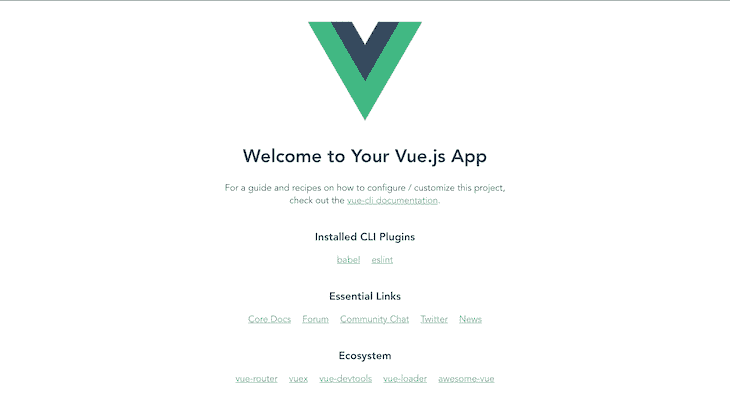
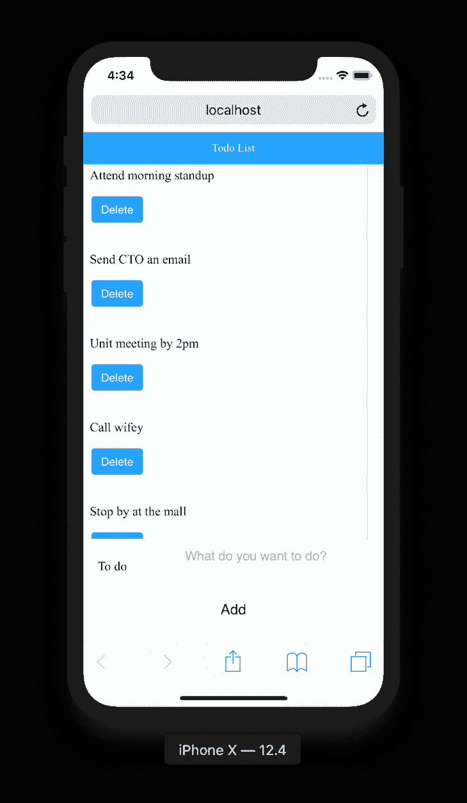
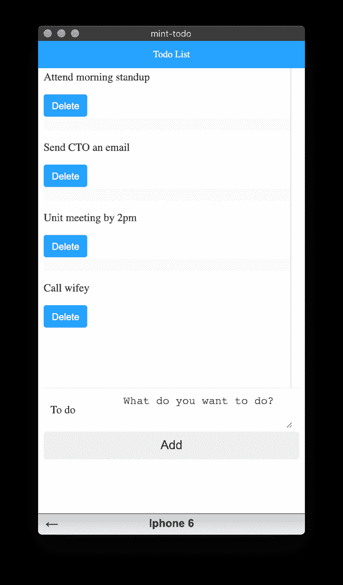

# 使用 Mint UI 和 Vue.js 构建移动 UI

> 原文：<https://blog.logrocket.com/building-mobile-ui-using-mint-ui-vue-js/>

在构建移动应用程序时，如果您决定不使用原生 SDK，有几种框架可供使用。例如，React Native 和 Flutter 用于构建跨平台的移动应用程序。

对于 web，一些库和框架允许我们构建类似移动的前端应用程序。在本文中，我们将使用 Mint UI 和 Vue.js 构建一个简单的待办事项应用程序，该应用程序具有移动友好的用户界面。

## view . js-检视. js

Vue.js 是一个用于构建前端用户界面的开源 JavaScript 库。它还可以用来构建移动和桌面用户界面，根据您的需求和您正在开发的应用程序的类型，它也可以用作框架。

### 设置 Vue.js

Vue.js 是一个非常容易建立的库。使用 npm，从您的终端安装:

```
$ npm install vue
```

要安装 CLI:

```
$ npm install -g @vue/cli
```

## 薄荷 UI

根据[库主页](http://mint-ui.github.io/)介绍，Mint UI 是 Vue.js 的移动 UI 元素库，Mint UI 为构建类似移动的应用提供了丰富的 CSS 和 js 组件。元素的风格接近用户在移动应用程序中的期望；Mint UI 的默认用户界面和 iOS 中的类似。大约 30KB，非常轻便。

要从终端安装 Mint UI，请运行:

```
$ npm i mint-ui
```

## 构建待办事项应用程序

现在我们已经安装了 Vue CLI，我们可以继续创建一个 Vue.js 项目:

```
$ vue create mint-todo
```

出现提示时，确保选择默认预设。这将安装所有必需的依赖项。完成后，切换到您的项目目录:

```
$ cd mint-todo
```

接下来，在本地主机上服务项目:

```
$ npm run serve
```

您应该会看到一个类似如下的用户界面:



现在我们开始构建简单的待办事项应用程序。

### 功能

我们的待办事项应用程序将具有以下功能:

*   显示待办事项
*   添加待办事项
*   将每个待办事项标记为完成
*   删除待办事项

### 项目文件夹结构

Vue.js 文件夹结构相当容易理解。在本教程中，我们将使用`src`文件夹。

`src`文件夹包含`assets`文件夹，它将保存我们的项目资产，如图像、视频、音频文件。`components`文件夹是我们这个项目的组件所在的目录。

`public`文件夹包含将要提供的 HTML 文件。`App.vue`是我们应用程序的主要组件，`main.js`是我们应用程序的主要入口。

### `main.js`

文件是我们应用程序的主要入口。它将根组件初始化为页面上的一个元素。

要在我们的应用程序中使用 Mint UI，我们需要导入并指定 Vue 使用 Mint UI。将它复制并粘贴到您的`main.js`文件中:

```
import Vue from 'vue'
import App from './App.vue'
import MintUI from 'mint-ui'
import 'mint-ui/lib/style.css'
Vue.config.productionTip = false
Vue.use(MintUI)
new Vue({
  render: h => h(App),
}).$mount('#app')
```

`Vue.config`是包含 Vue 全局配置的对象。将`productionTip`属性设置为`false`，以防止 Vue 启动时出现生产提示。

我们还需要在项目中安装 MintUI，所以我们运行:

```
npm i mint-ui
```

## 显示待办事项

在这一部分，我们将构建一个允许我们的应用程序显示待办事项的功能。我们将从虚拟待办事项开始，并确保我们可以在应用程序中显示它们。首先，在各自的文件中创建并粘贴以下代码。

### `Todo.vue`

在`src/components`中，创建一个`Todo.vue`文件并将以下内容粘贴到其中:

```
<template>
  <div>
    <p>{{ todo.title }}</p>
  </div>
</template>
<script>
export default {
  name: 'Todo',
  props: [
    "todo"
  ]
}
</script>
<style scoped>
</style>
```

在这个组件中，我们将呈现待办事项列表中作为道具传递的每个待办事项。

### `Todos.vue`

在`src/components`文件夹中创建一个`Todos.vue`文件。该组件用于呈现待办事项列表中的每个待办事项:

```
<template>
  <div>
    <mt-header fixed title="Todo List"></mt-header>
    <mt-index-section v-bind:key="todo.id" v-for="todo in todos">
          <Todo v-bind:todo="todo"/>
      </mt-index-section>
  </div>
</template>
<script>
import Todo from './Todo';
export default {
  name: 'Todos',
  components: {
    Todo
  },
  props: [
    "todos"
  ]
}
</script>
<style scoped>
</style>
```

在上面的代码块中，我们已经导入了负责呈现每个待办事项的`Todo`组件。添加了`props`数组来定义我们需要在`Todos.vue`中使用的属性，这些属性是从`App.vue`组件传递过来的。

我们使用 Mint UI `mt-header`组件为我们的应用程序创建一个固定的标题，并将标题名称作为属性传递。我们还使用了`mt-index-list`和`mt-index-section`来创建一个列表容器部分，所有的待办事项都将在这里呈现。

属性用来定义容器的高度。如果未指定，它将自动延伸到视口的底部。

### `App.vue`

`App.vue`是我们应用程序的根。它通常用于定义我们页面的模板。

```
<template>
  <div id="app">
    <Todos />
  </div>
</template>
<script>
import Todos from './components/Todos';
export default {
  name: 'app',
  components: {
    Todos
  },
  data() {
    return {
      todos: [
        {
          id: 1,
          title: 'Attend morning standup',
          completed: false
        },
        {
          id: 2,
          title: 'Send CTO an email',
          completed: false
        },
        {
          id: 3,
          title: 'Unit meeting by 2pm',
          completed: false
        },
        {
          id: 4,
          title: 'Call wifey',
          completed: false
        },
        {
          i: 5,
          title: 'Stop by at the mall',
          completed: false
        }
    }
  },
}
</script>
<style>
</style>
```

在上面的代码块中，我们已经从前面导入了`Todos`组件。在我们的`script`标签中，我们还创建了名为`todos`的 JSON 伪数据，它从这个组件传递到`Todos`组件。

## 添加待办事项

在我们创建这个组件之前，我们将需要`uuid`库来为每个待办事项生成唯一的 id。要从终端安装，请执行以下操作:

```
$ npm install vue-uuid
```

现在让我们创建`AddTodo.vue`组件并粘贴以下代码:

```
<template>
  <div>
    <form @submit="addTodo">
      <mt-field label="To do" placeholder="What do you want to do?" type="textarea" rows="2" v-model="title" name="title"></mt-field>
      <mt-button type="submit" size='large'>Add</mt-button>
    </form>
  </div>
</template>
<script>
import {uuid} from "vue-uuid"; 
export default {
  name: 'AddTodo',
  data() {
    return {
      title: ''
    }
  },
  methods: {
    addTodo(e) {
      e.preventDefault();
      const newTodoObj = {
        id: uuid.v4(),
        title: this.title,
      }
      this.$emit('add-todo', newTodoObj);
      this.title = '';
    }
  }
}
</script>
<style scoped>
</style>
```

在上面的代码块中，我们已经导入了我们的`vue-uuid`方法，并在我们的`script`标签中添加了一些数据。该数据包含一个标题，它被绑定到表单中的一个输入，我们在表单中请求待办事项。

* * *

### 更多来自 LogRocket 的精彩文章:

* * *

这通常称为双向绑定。它允许在您的表单中所做的任何更改立即更新到您的数据中，然后当我们添加新的待办事项时，我们可以继续使用上次更新的值。

我们还创建了`addTodo`方法。这个方法负责创建一个新的待办事项对象并管理我们的`add-todo`事件。`e.preventDefault();`阻止`form`标签的默认行为，这将触发页面重新加载。`newTodoObj`保存待办事项及其唯一的 ID。

在`template`标签中，我们将`addToDo`方法绑定到了`@submit`事件处理程序。我们还使用 Mint UI `mt-field`创建了一个带有标签、占位符、行、名称和类型属性的文本区域。`v-model`指令用于将输入绑定到组件数据。Mint UI `mt-button`按钮组件用于创建一个按钮来提交表单数据。

现在我们已经创建了我们的`AddToDo`组件，我们需要能够调用和使用它。为此，我们需要将我们的`App.vue`组件修改为:

```
<template>
  <div id="app">
    <Todos v-bind:todos="todos"/>
    <AddTodo v-on:add-todo="addTodo"/>
  </div>
</template>
<script>
import Todos from './components/Todos';
import AddTodo from './components/AddTodo';
export default {
  name: 'app',
  components: {
    Todos,
    AddTodo
  },
  data() {
    return {
      todos: [
        {
          id: 1,
          title: 'Go workout',
          completed: false
        },
        {
          id: 2,
          title: 'Do laundry',
          completed: false
        },
        {
          id: 3,
          title: 'Cook food',
          completed: false
        },
        {
          id: 4,
          title: 'Clean up room',
          completed: false
        },
        {
          i: 5,
          title: 'Finish work',
          completed: false
        }
      ],
    }
  },
  methods: {
    addTodo(newTodoObj) {
      this.todos = [...this.todos, newTodoObj];
    }
  }
}
</script>
<style>
</style>
```

在上面的代码块中，我们已经在脚本标签中导入并注册了新创建的`AddToDo`组件。我们添加了一个新方法`addTodo`,它接收 to-do 对象，并通过使用 spread 操作符将其添加到我们的 todos 数组中。spread 操作符(`…`)复制我们当前的 todos 数组，并向其中添加新的 todo 对象。

在我们的模板标签中，我们添加了一个`v-on`指令来定义在`add-todo`事件上我们调用的`addTodo`函数，这是我们在脚本标签中定义的。

## 将每个待办事项标记为完成

将待办事项标记为完成不需要我们添加新的组件。我们可以简单地创建一个样式规则，有条件地删除待办事项。

如下修改您的`Todo.vue`组件:

```
<template>
  <div v-bind:class="{ 'completed': todo.completed }">
    <p v-on:click="markComplete">{{ todo.title }}</p>
  </div>
</template>
<script>
export default {
  name: 'Todo',
  props: [
    "todo"
  ],
  methods: {
    markComplete() {
      this.todo.completed = !this.todo.completed
    }
  }
}
</script>
<style scoped>
  .completed {
    text-decoration: line-through;
  }
</style>
```

查看我们的样式脚本，我们已经创建了一个自定义样式类`.completed`，它的`text-decoration`属性值为`line-through`。

在我们的脚本标签中，我们创建了`markComplete`方法，它只是将待办事项的状态从已完成更改为未完成。然后，在我们的模板标签中，我们使用`v-bind:class`来仅在待办事项完成时使用该类。

现在，当你点击一个待办事项时，你应该能够用删除线将它标记为已完成。

## 删除待办事项

实现删除待办事项的逻辑相当简单。我们将在主组件中创建一个调用删除函数的事件，该函数以一个 ID 作为参数，然后用传递的 ID 删除我们的 to-dos 数组中的对象。我们将创建一个按钮来发出调用删除函数的事件。将`Todo.vue`组件更新为:

```
<template>
  <div v-bind:class="{ 'completed': todo.completed }">
    <p v-on:click="markComplete">{{ todo.title }}</p>
    <mt-button type="primary" size='small' @click="$emit('delete-todo', todo.id)">Delete</mt-button>
  </div>
</template>
<script>
export default {
  name: 'Todo',
  props: [
    "todo"
  ],
  methods: {
    markComplete() {
      this.todo.completed = !this.todo.completed
    }
  }
}
</script>
<style scoped>
  .completed {
    text-decoration: line-through;
  }
</style>
```

现在我们添加了一个按钮，它在单击时发出事件`delete-todo`并传递待办事项 ID。我们将在`Todos.vue`组件中处理这个事件。

我们将更新的这个组件的唯一部分是`Todo`组件，使用`v-on`指令发出`delete-todo`事件:

```
<Todo v-bind:todo="todo" v-on:delete-todo="$emit('delete-todo', todo.id)"/>
```

此外，我们需要更新我们的`App.vue`组件，以便它调用通过创建一个`deleteTodo`方法从我们的 to-dos 数组中删除待办事项的方法。这将根据传递的 ID 删除待办事项:

```
deleteTodo(todoId) {
      this.todos = this.todos.filter(todo => todo.id !== todoId);
}
```

## 把所有的放在一起

将所有这些放在一起，组件看起来像:

```
// App.vue

<template>
  <div id="app">
    <Todos v-bind:todos="todos" v-on:delete-todo="deleteTodo"/>
    <AddTodo v-on:add-todo="addTodo"/>
  </div>
</template>
<script>
import Todos from './components/Todos';
import AddTodo from './components/AddTodo';
export default {
  name: 'app',
  components: {
    Todos,
    AddTodo
  },
  data() {
    return {
      todos: [
        {
          id: 1,
          title: 'Attend morning standup',
          completed: false
        },
        {
          id: 2,
          title: 'Send CTO an email',
          completed: false
        },
        {
          id: 3,
          title: 'Unit meeting by 2pm',
          completed: false
        },
        {
          id: 4,
          title: 'Call wifey',
          completed: false
        },
        {
          i: 5,
          title: 'Stop by at the mall',
          completed: false
        }
      ],
    }
  },
  methods: {
    addTodo(newTodoObj) {
      this.todos = [...this.todos, newTodoObj];
    },
    deleteTodo(todoId) {
      this.todos = this.todos.filter(todo => todo.id !== todoId);
    }
  }
}
</script>
<style>
</style>
```

```
// todo.vue

<template>
  <div v-bind:class="{ 'completed': todo.completed }">
    <p v-on:click="markComplete">{{ todo.title }}</p>
    <mt-button type="primary" size='small' @click="$emit('delete-todo', todo.id)">Delete</mt-button>
  </div>
</template>
<script>
export default {
  name: 'Todo',
  props: [
    "todo"
  ],
  methods: {
    markComplete() {
      this.todo.completed = !this.todo.completed
    }
  }
}
</script>
<style scoped>
  .completed {
    text-decoration: line-through;
  }
</style>
```

```
// Todos.vue
<template>
  <div>
    <mt-header fixed title="Todo List"></mt-header>
    <mt-index-list height=500>
      <mt-index-section v-bind:key="todo.id" v-for="todo in todos">
          <Todo v-bind:todo="todo" v-on:delete-todo="$emit('delete-todo', todo.id)"/>
      </mt-index-section>
    </mt-index-list>
  </div>
</template>
<script>
import Todo from './Todo';
export default {
  name: 'Todos',
  components: {
    Todo
  },
  props: [
    "todos"
  ]
}
</script>
<style scoped>
</style>
```

```
// AddToDo.vue

<template>
  <div>
    <form @submit="addTodo">
      <mt-field label="To do" placeholder="What do you want to do?" type="textarea" rows="2" v-model="title" name="title"></mt-field>
      <mt-button type="submit" size='large'>Add</mt-button>
    </form>
  </div>
</template>
<script>
import {uuid} from "vue-uuid"; 
export default {
  name: 'AddTodo',
  data() {
    return {
      title: ''
    }
  },
  methods: {
    addTodo(e) {
      e.preventDefault();
      const newTodoObj = {
        id: uuid.v4(),
        title: this.title,
        completed: false
      }
      this.$emit('add-todo', newTodoObj);
      this.title = '';
    }
  }
}
</script>
<style scoped>
</style>
```

## 运行我们的应用

现在，我们已经完成了简单的待办事项应用程序的构建，我们可以继续下去，看看它现在是什么样子。在您的终端中，键入:

```
$ npm run serve
```

如果一切顺利，在`[http://localhost:8080](http://localhost:8080)`继续在你的 Android 模拟器或 iOS 模拟器中加载本地 URL。您应该会看到一个类似下图的网站:



如果您没有模拟器，可以将浏览器置于响应模式，它应该是这样的:



## 在生产中部署

现在，我们已经做好了一切工作，我们需要部署我们的网站，并使它活起来:

```
$ npm run build
```

这将工作并创建一个名为`dist`的文件夹。`dist`文件夹将包含准备在生产环境中部署的网站。你可以按照这个[指南](https://www.netlify.com/blog/2019/11/30/how-to-deploy-a-vue-site/)在 Netlify 上部署。

## 结论

如您所见，Mint UI 提供了简单、干净、响应迅速的移动用户界面组件。您可以通过添加更多功能和采用更多新的 UI 组件来扩展这个示例。点击这里可以找到 Mint UI 组件[的完整列表。](http://mint-ui.github.io/docs/#/en)

## 像用户一样体验您的 Vue 应用

调试 Vue.js 应用程序可能会很困难，尤其是当用户会话期间有几十个(如果不是几百个)突变时。如果您对监视和跟踪生产中所有用户的 Vue 突变感兴趣，

[try LogRocket](https://lp.logrocket.com/blg/vue-signup)

.

[](https://lp.logrocket.com/blg/vue-signup)[https://logrocket.com/signup/](https://lp.logrocket.com/blg/vue-signup)

LogRocket 就像是网络和移动应用程序的 DVR，记录你的 Vue 应用程序中发生的一切，包括网络请求、JavaScript 错误、性能问题等等。您可以汇总并报告问题发生时应用程序的状态，而不是猜测问题发生的原因。

LogRocket Vuex 插件将 Vuex 突变记录到 LogRocket 控制台，为您提供导致错误的环境，以及出现问题时应用程序的状态。

现代化您调试 Vue 应用的方式- [开始免费监控](https://lp.logrocket.com/blg/vue-signup)。