# 用 HTML、CSS 和 Swiper 构建现代滑块

> 原文：<https://blog.logrocket.com/building-modern-sliders-html-css-swiper/>

滑块是功能性的用户界面单元，它在有限的空间内以压缩和循环的方式组织信息。滑块由以下组件组成:

*   容器，或容纳滑块组件的盒子
*   幻灯片，或包括文本、图像、视频和按钮的内容区域
*   引导用户浏览幻灯片的导航图标
*   用作附加导航的分页可视化工具，通常是放在容器底部的项目符号或数字

此外，滑块具有过渡效果，以避免从一个内容块到另一个内容块的突然变化。从头开始构建这些滑块，并覆盖它们的组件和过渡，可能是令人生畏的。这就是为什么在这篇文章中，我们将使用 Swiper 来创建具有惊人过渡的现代、快速、响应迅速和本地(移动优先)触摸滑块。

### 内容

## Swiper 是什么？

Swiper 是一个 JavaScript 库，它创建了具有硬件加速过渡(利用 GPU 卸载图形密集型过渡并创建更平滑的视觉效果)和出色的本机行为的现代触摸滑块。Swiper 可用于 vanilla JavaScript、Angular、React、Vue.js 和 Svelte。

一些使用 Swiper JS 的最好的网站可以在这里找到。

Swiper 是一个完全免费的开源库，在 [GitHub](https://github.com/nolimits4web/swiper) 上有超过 30.1k 的 stars 和 9.6k 的 forks。Swiper 的一些主要功能包括:

*   响应式设计
*   丰富的 API
*   图像延迟加载
*   图书馆不可知
*   手机友好型
*   多行幻灯片布局
*   [柔性盒布局](https://blog.logrocket.com/how-to-build-a-basic-flexbox-layout-a-tutorial-with-examples/)
*   虚拟幻灯片提高性能
*   嵌套滑块
*   完全导航控制
*   过渡效果(淡入淡出、3D 立方体、3D 溢出、视差、卡片和创意)
*   适用于 iOS、Android 和最新的桌面浏览器
*   RTL(从右向左)布局
*   键盘和鼠标的交互和控制
*   突变观察者
*   自动播放
*   循环模式

## Swiper 入门

在撰写本文时，Swiper 目前在 v.8 上；但是，请查看相应的迁移指南，从 [Swiper 6 升级到 Swiper 7](https://swiperjs.com/migration-guide) 或从 [Swiper 7 升级到 Swiper 8](https://swiperjs.com/migration-guide-v8) 。

将 Swiper 导入到项目中有三个选项:

1.  在本地下载和使用 Swiper 资产[此处](https://unpkg.com/swiper@8/)
2.  通过将以下内容分别添加到 HTML 文件头和正文中，将 Swiper 用作内容交付网络(CDN ):

```
    <link rel="stylesheet" href="https://unpkg.com/[email protected]/swiper-bundle.min.css"/>

    <script src="https://unpkg.com/[email protected]/swiper-bundle.min.js"></script>

```

1.  使用安装命令`$ npm install swiper`从 npm 安装

对于本文，我们将使用选项二。

## 定义标记

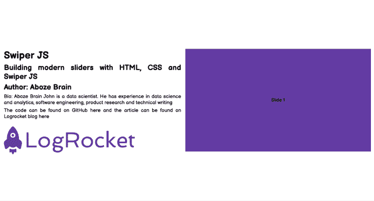

上图显示了构建我们的项目网页、布局及其内容的 HTML 标记。HTML 标记如下所示:

```
<!DOCTYPE html>
<html lang="en">
<head>
   <meta charset="UTF-8">
   <meta http-equiv="X-UA-Compatible" content="IE=edge">
   <meta name="viewport" content="width=device-width, initial-scale=1.0">
   <title>Swiper Article</title>
   <link rel="stylesheet" href="style.css">
   <link rel="stylesheet" href="https://unpkg.com/[email protected]/swiper-bundle.min.css"/>

</head>
<body>
   <div class="container">
       <!-- Project content container -->
       <div class="project_content">
           <h1>Swiper JS</h1>
           <h2>Building modern sliders with HTML, CSS and Swiper JS</h2>
           <h2>Author: Aboze Brain</h2>
           <p>Bio: Aboze Brain John is a data scientist. He has experience in data science and analytics, software engineering, product research and technical writing</p>
           <p>The code can be found on GitHub <a href="#">here</a> and the article can be found on Logrocket blog <a href="#">here</a></p>
           <p></p>
           
       </div>
       <!-- Slider main container -->
       <div class="swiper mySwiper">
           <div class="swiper-wrapper">
             <div class="swiper-slide slide_1">Slide 1</div>
             <div class="swiper-slide slide_2">Slide 2</div>
             <div class="swiper-slide slide_3">Slide 3</div>
             <div class="swiper-slide slide_4">Slide 4</div>
             <div class="swiper-slide slide_5">Slide 5</div>
           </div>
         </div>
   </div>

   <script src="https://unpkg.com/[email protected]/swiper-bundle.min.js"></script>
   <script src="/script.js"></script>
</body>
</html>

```

在 HTML 标记中，您可以看到我们的项目由五张幻灯片组成。接下来，让我们使用 CSS 来设置默认 HTML 标记的样式，如下所示:

```
/* Import google font (Balsamiq Sans) */
@import url('https://fonts.googleapis.com/css2?family=Balsamiq+Sans:ital,[email protected],400;0,700;1,400;1,700&display=swap');

/* Box sizing rules */
*,
*::before,
*::after {
   box-sizing: border-box;
}

/* Remove default padding and margin */
* {
   padding: 0;
   margin: 0;
}

/* Default anchor tag styling */
a {
   text-decoration: none;
   color: black;
}

a:hover {
   cursor: pointer;
}

/* Default image styling */
img {
   padding: 1rem;
   max-width: 75%;
   height: auto;
}

/* Body styling */
html,
body {
 position: relative;
 height: 100%;
}

body {
   font-family: 'Balsamiq Sans', cursive, "Roboto Mono";
   font-size: 1.2rem;
   text-align:justify;
}

.container {
   display: grid;
   grid-template-columns: 1fr 1fr;
   grid-gap: 1rem;
}

.container > div {
   top: 25vh;
   height: 50vh;
}

div.project_content {
   padding-top: 25vh;
   justify-items: center;
   align-items: center;
}
.project_content h1,h2, p {
   padding: 0.2rem 1rem;
}

.project_container img {
   height: 75%;
}

/* Swiper container stylng */
.swiper {
   right: 1rem;
   width: 100%;
   height: 100%;
}

.swiper-slide {
   text-align: center;
    /* Center slide text vertically */
   display: -webkit-box;
   display: -ms-flexbox;
   display: -webkit-flex;
   display: flex;
   -webkit-box-pack: center;
   -ms-flex-pack: center;
   -webkit-justify-content: center;
   justify-content: center;
   -webkit-box-align: center;
   -ms-flex-align: center;
   -webkit-align-items: center;
   align-items: center;
}
 .swiper-slide img {
   display: block;
   width: 100%;
   height: 100%;
   object-fit: cover;
 }

.slide_1 {
   background-color:#643ca3 ;
}

.slide_2 {
   background-color:#e38364 ;
}

.slide_3 {
   background-color:#faf47a ;
}

.slide_4 {
   background-color:#64e3c1 ;
}

.slide_5 {
   background-color:#9e6ffd ;
}

```

接下来，我们用 JavaScript 初始化这个项目中的 Swiper。JavaScript 如下所示:

```
//  Initialize Swiper
let swiper = new Swiper(".mySwiper", {});

```

注意 Swiper 容器`".mySwiper"`中的类用于在 JavaScript 文件中创建 Swiper 对象。

## 实现移动和导航

对于默认网页，我们可以看到五张幻灯片相互重叠，除了用鼠标滑过之外，没有办法一次查看一张幻灯片。

这不是最直观或最清晰的信息交流方式。Swiper 应该是在一个小空间里显示大量信息的工具，所以让我们看看如何用 Swiper 改进这个系统。

### 页码

正如我们之前了解到的，分页只是放置在容器底部的一组传统的项目符号或数字(在本例中，是覆盖幻灯片的盒子)。分页显示容器中有多少滑块重叠。

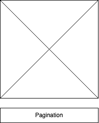

通过做一些修改，它可以很容易地在我们拥有的默认文件上实现。在 HTML 文件中，我们需要在滑块容器下添加分页容器，如下所示:

```
<div class="swiper mySwiper">
           <div class="swiper-wrapper">
             <div class="swiper-slide slide_1">Slide 1</div>
             <div class="swiper-slide slide_2">Slide 2</div>
             <div class="swiper-slide slide_3">Slide 3</div>
             <div class="swiper-slide slide_4">Slide 4</div>
             <div class="swiper-slide slide_5">Slide 5</div>
           </div>
           <div class="swiper-pagination"></div>
</div>

```

CSS 保持不变，但是我们需要对 JavaScript 文件进行更改，以启动分页效果:

```
//  Initialize Swiper
let swiper = new Swiper(".mySwiper", {
   pagination: {
     el: ".swiper-pagination",
   },
 });

```

现在，我们的滑块显示我们总共有多少张幻灯片，以及我们目前正在观看哪张幻灯片。

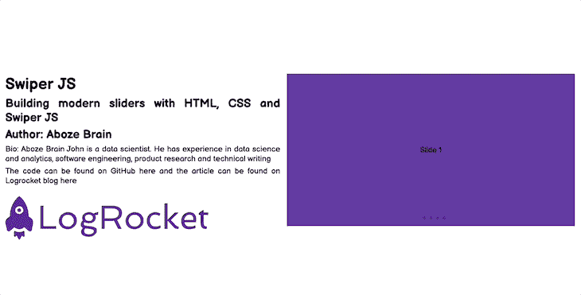

### 航行

导航就像分页一样，是一种通过点击而不是用鼠标滑动来引导幻灯片的工具。它由位于幻灯片容器两侧的左右箭头组成。

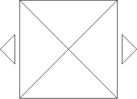

让我们分别对默认文件进行更改。在我们的 HTML 文件中，就像分页一样，我们需要在 sliders 容器下添加导航容器，如下所示:

```
<div class="swiper mySwiper">
           <div class="swiper-wrapper">
             <div class="swiper-slide slide_1">Slide 1</div>
             <div class="swiper-slide slide_2">Slide 2</div>
             <div class="swiper-slide slide_3">Slide 3</div>
             <div class="swiper-slide slide_4">Slide 4</div>
             <div class="swiper-slide slide_5">Slide 5</div>
           </div>
           <div class="swiper-button-next"></div>
           <div class="swiper-button-prev"></div>
       </div>

```

接下来，我们需要为箭头定位(在幻灯片容器的中心)和移除箭头组件轮廓向 CSS 添加一些样式，如下所示:

```
.swiper-button-next,
.swiper-button-prev {
   outline: none;
}

div.swiper-button-next, div.swiper-button-prev {
  top: 70%
}

```

接下来，我们在 JavaScript 文件上启动导航效果，如下所示:

```
//  Initialize Swiper
let swiper = new Swiper(".mySwiper", {
   navigation: {
     nextEl: ".swiper-button-next",
     prevEl: ".swiper-button-prev",
   },
 });

```

### 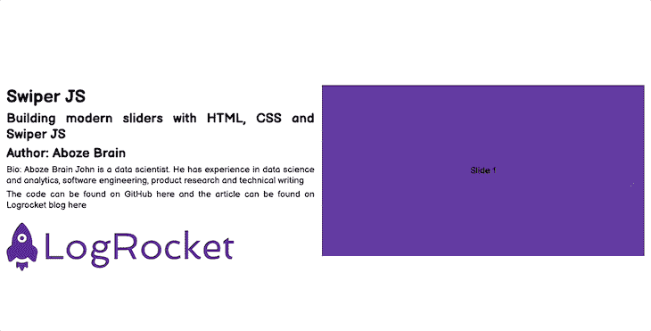

### 卷起

滚动帮助简单的水平可滚动滑块从左向右移动。通过对默认设置进行以下更改，可以很容易地实现这一点。

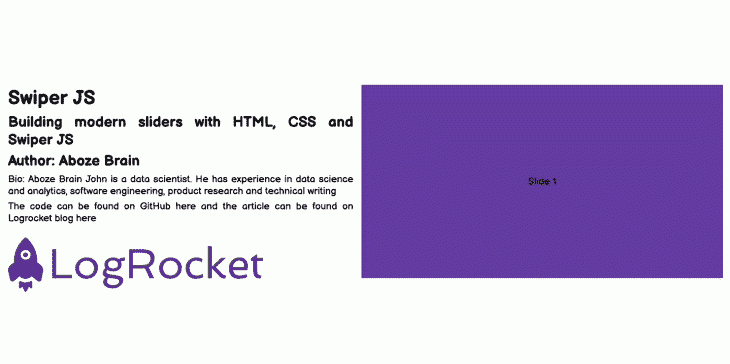

首先，在 HTML 标记上，我们将对 Swiper 容器进行如下更改:

```
<div class="swiper mySwiper">
           <div class="swiper-wrapper">
             <div class="swiper-slide slide_1">Slide 1</div>
             <div class="swiper-slide slide_2">Slide 2</div>
             <div class="swiper-slide slide_3">Slide 3</div>
             <div class="swiper-slide slide_4">Slide 4</div>
             <div class="swiper-slide slide_5">Slide 5</div>
           </div>
           <div class="swiper-scrollbar"></div>
       </div>

```

接下来，使用默认的 CSS，让我们初始化 JavaScript 文件的滚动效果，如下所示:

```
//  Initialize Swiper
letswiper = new Swiper(".mySwiper", {
 scrollbar: {
   el: ".swiper-scrollbar",
   hide: true,
 },
});

```

现在，您可以在我们的幻灯片底部看到一个滚动条。

### 垂直的

垂直意味着垂直分页；垂直分页就像我们之前讨论过的常规分页一样，但是项目符号是在垂直方向上的。

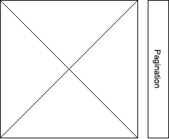

HTML 标记与水平分页相同，我们只需要在 JavaScript 文件中指定方向，如下所示:

```
//  Initialize Swiper
let swiper = new Swiper(".mySwiper", {
 direction: "vertical",
 pagination: {
   el: ".swiper-pagination",
   clickable: true,
   hide: true,
 },
});

```

现在，我们可以看到幻灯片上下移动，而不是左右移动。

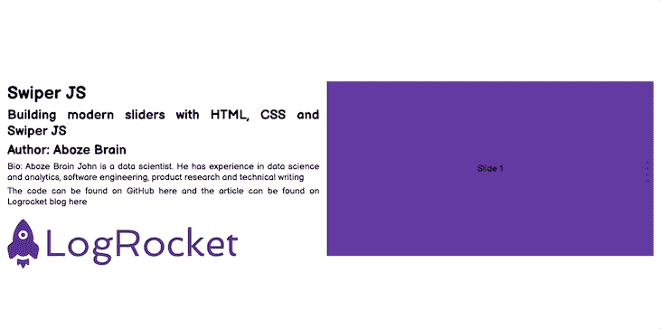

### 嵌套的

嵌套滑块有点棘手。它们是滑块水平和垂直显示的组合，带有分页，为您提供关于每个轴上幻灯片数量的更多信息。

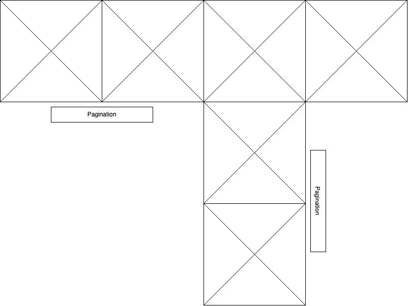

让我们在 HTML 标记上使用默认设置来实现这一点。应该对 swiper 容器进行如下更改:

```
<div class="swiper mySwiper swiper-h">
           <div class="swiper-wrapper">
             <div class="swiper-slide slide_1">Horizontal Slide 1</div>
             <div class="swiper-slide slide_2">Horizontal Slide 2</div>
             <div class="swiper-slide">
               <div class="swiper mySwiper2 swiper-v">
                 <div class="swiper-wrapper">
                   <div class="swiper-slide slide_3">Horizontal Slide 3 & Vertical Slide 1</div>
                   <div class="swiper-slide v_slide_2">Vertical Slide 2</div>
                   <div class="swiper-slide v_slide_3">Vertical Slide 3</div>
                 </div>
                 <div class="swiper-pagination"></div>
               </div>
             </div>
             <div class="swiper-slide slide_4">Horizontal Slide 4</div>
           </div>
           <div class="swiper-pagination"></div>
         </div>

```

接下来，我们需要在默认 CSS 文件中指定一些更改，以适应垂直幻灯片颜色，如下所示:

```
.v_slide_2 {
   background-color: #c164e3;
}

.v_slide_3 {
   background-color: #e3c164;
}

```

然后，我们必须在 JavaScript 脚本上启动带有分页的垂直和水平滑块:

```
let swiper = new Swiper(".mySwiper", {
 spaceBetween: 50,
 pagination: {
   el: ".swiper-pagination",
   clickable: true,
 },
});

let swiper2 = new Swiper(".mySwiper2", {
 direction: "vertical",
 spaceBetween: 50,
 pagination: {
   el: ".swiper-pagination",
   clickable: true,
 },
});

```

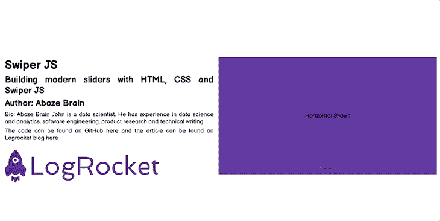

## 实现过渡效果

网页设计中的滑块与一系列过渡效果结合在一起，以避免信息块之间压倒性的突然转换。在本文的上下文中，我们将关注立方体效应和卡片效应。

### 立方体效应

立方体效果过渡使幻灯片看起来像是旋转立方体的侧面。从一张幻灯片切换到下一张幻灯片时，立方体会旋转，将所需的幻灯片移到最前面。

为了实现立方体效果，我们将对默认文件进行如下修改。

在我们的 HTML 标记中，我们将更新 swiper 容器，如下所示:

```
<div class="swiper mySwiper">
           <div class="swiper-wrapper">
             <div class="swiper-slide slide_1">Slide 1</div>
             <div class="swiper-slide slide_2">Slide 2</div>
             <div class="swiper-slide slide_3">Slide 3</div>
             <div class="swiper-slide slide_4">Slide 4</div>
             <div class="swiper-slide slide_5">Slide 5</div>
           </div>
       </div>

```

在 CSS 中，我们必须对 swiper 容器选择器进行一些更改，通过减小幻灯片大小来适应效果转换，如下所示:

```
.swiper {
   width: 280px;
   height: 320px;
}

```

接下来，我们必须在 JavaScript 文件上启动一个立方体效果:

```
//  Initialize Swiper
let swiper = new Swiper(".mySwiper", {
 effect: "cube",
 grabCursor: true,
 cubeEffect: {
   shadow: true,
   slideShadows: true,
   shadowOffset: 20,
   shadowScale: 0.94,
 },
 pagination: {
   el: ".swiper-pagination",
 },
});

```

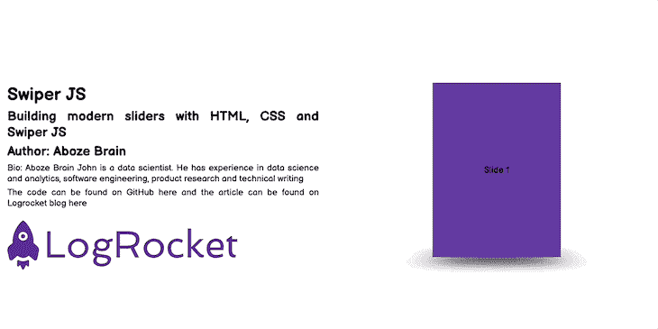

### 卡片效应

这是幻灯片之间切换的过渡效果，就像上面的立方体一样。通过卡片效果，每张幻灯片看起来就像一副牌中的一张卡片，正在被洗牌以将所需的幻灯片放到最前面。

HTML 和 CSS 的立方体效果是一样的，只是改变了卡片的效果如下:

```
//  Initialize Swiper
let swiper = new Swiper(".mySwiper", {
 effect: "cards",
 grabCursor: true,
});

```

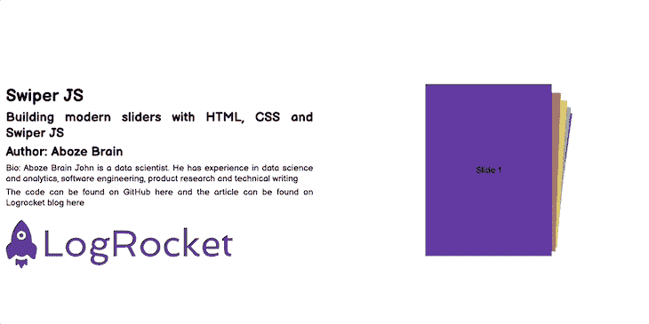

## 为图片库实现滑块

在这一部分，我们将会看到一些非常适合图片或图库的滑块。在我看来，图库滑块的两个很好的选项是缩略图图库和惰性加载，我们将在接下来的章节中学习如何实现。

### 缩略图画廊

此滑块由用作占位符的原件的压缩预览图像组成。缩略图应该比原始图像小，但具体大小由您决定。这个滑块创建一个简单的缩略图画廊模块来保存内容，也可以作为一种导航方式。

使用默认设置，我们可以通过对默认 HTML 标记进行如下更改来实现这一点:

```
<div class="swiper-container">
           <div class="swiper mySwiper2">
               <div class="swiper-wrapper">
                   <div class="swiper-slide slide_1">Slide 1</div>
                   <div class="swiper-slide slide_2">Slide 2</div>
                   <div class="swiper-slide slide_3">Slide 3</div>
                   <div class="swiper-slide slide_4">Slide 4</div>
                   <div class="swiper-slide slide_5">Slide 5</div>
               </div>
               <div class="swiper-button-next"></div>
               <div class="swiper-button-prev"></div>
           </div>

           <div thumbsSlider="" class="swiper mySwiper">
               <div class="swiper-wrapper">
                   <div class="swiper-slide slide_1">Slide 1</div>
                   <div class="swiper-slide slide_2">Slide 2</div>
                   <div class="swiper-slide slide_3">Slide 3</div>
                   <div class="swiper-slide slide_4">Slide 4</div>
                   <div class="swiper-slide slide_5">Slide 5</div>
               </div>
           </div>
 </div>

```

接下来，我们需要对 swiper 容器中的滑块和缩略图进行 CSS 更改，如下所示:

```
div.swiper-container {
   padding-top: 25vh;
}

.swiper-slide {
   display: flex;
   align-items: center;
   justify-content: center;
}

.swiper {
   width: 480px;
}

.mySwiper2 {
   width: 480px;
   height: 320px;
}

.mySwiper {
   height: 30%;
   box-sizing: border-box;
   margin: 10px;
}

.mySwiper .swiper-slide {
   opacity: 0.4;
}

.swiper-slide {
   background-position: center;
}

.mySwiper .swiper-slide-thumb-active {
   opacity: 1;
}

```

然后，我们启动默认 JavaScript 文件上的缩略图滑块:

```
//  Initialize Swiper
let swiper = new Swiper(".mySwiper", {
 spaceBetween: 10,
 slidesPerView: 4,
 freeMode: true,
 watchSlidesProgress: true,
});

let swiper2 = new Swiper(".mySwiper2", {
 spaceBetween: 10,
 navigation: {
   nextEl: ".swiper-button-next",
   prevEl: ".swiper-button-prev",
 },
 thumbs: {
   swiper: swiper,
 },
});
```

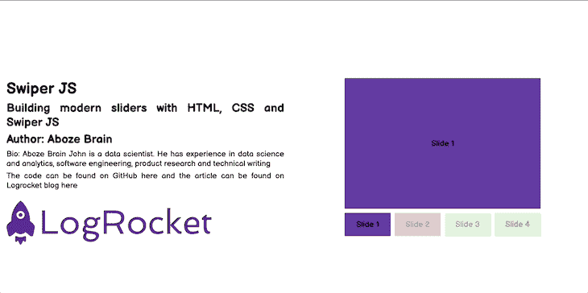

### 惰性装载

惰性加载是一种策略，它将资源的加载或初始化延迟到实际需要时，以减少页面加载时间并节省系统资源。想象一下，在前面的用例中，一个用户下载了整个图库，但是用户只看了第一张幻灯片就离开了；这导致了内存和带宽的浪费。

惰性加载发生在一些用户的交互上，比如导航和滚动。为了看到延迟加载的效果，我们将使用来自[像素](https://www.pexels.com/)的图像。

首先，在默认的 HTML 文件上，对 slider 容器进行如下更改:

```
div class="swiper mySwiper">
           <div class="swiper-wrapper">
              <div class="swiper-slide">
               
              </div>
              <div class="swiper-slide">
               
              </div>
              <div class="swiper-slide">
               
              </div>
              <div class="swiper-slide">
               
              </div>
           </div>

           <div class="swiper-button-next"></div>
           <div class="swiper-button-prev"></div>
           <div class="swiper-pagination"></div>
       </div>

```

在默认 CSS 文件中，删除与 swiper 类相关的所有样式，并添加以下样式:

```
.swiper {
   width: 70%;
   --swiper-navigation-color: #000000;
   --swiper-pagination-color: #000000;
}

.swiper-slide img {
   width: auto;
   height: auto;
   max-width: 85%;
   max-height: 100%;
   -ms-transform: translate(-50%, -50%);
   -webkit-transform: translate(-50%, -50%);
   -moz-transform: translate(-50%, -50%);
   transform: translate(-50%, -50%);
   position: absolute;
   left: 50%;
   top: 50%;
 }

```

接下来，我们需要在 JavaScript 文件上启动延迟加载效果，如下所示:

```
let swiper = new Swiper(".mySwiper", {
 lazy: true,
 pagination: {
   el: ".swiper-pagination",
   clickable: true,
 },
 navigation: {
   nextEl: ".swiper-button-next",
   prevEl: ".swiper-button-prev",
 },
});

```

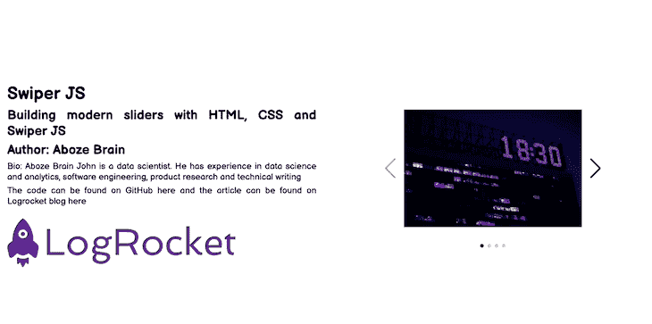

## 自定义控件

这些控件只是浏览幻灯片的几种方式。它们实现起来相对简单，我们只需要在 JavaScript 文件中指定它们就可以生效。让我们来看三个最受欢迎的。

首先是键盘控制。该控件利用键盘上的导航键(箭头键或 WASD)来控制幻灯片的移动。它可以通过向 swiper 对象添加以下内容来启动，如下所示:

```
    keyboard: {
       enabled: true,
     },

```

第二个是鼠标滚轮控件:这个控件通过鼠标的滚动来辅助幻灯片的导航。这是垂直滑块的理想选择，因为鼠标滚轮可以快速滚动内容。可以通过向 JavaScript 中的 swiper 对象添加以下内容来启动它:

```
    mousewheel: true,

```

第三个也是最后一个是抓取光标。这是一个直观的控件，允许鼠标光标抓取内容并向不同方向移动以浏览幻灯片。它可以在 JavaScript 上初始化，如下所示:

```
    grabCursor: true,

```

## 结论

滑块是重要的网页设计单元，值得特别关注。尽管它们在管理空间内容方面有优点，但它们也有一些缺点，比如抑制 SEO 策略和造成 UX 错误。滑块是个人喜好的问题，当有效实施时，可以产生良好的印象。如果你决定将它们包含在你的下一个项目中，Swiper 可以让你很容易地制作它们。

## 你的前端是否占用了用户的 CPU？

随着 web 前端变得越来越复杂，资源贪婪的特性对浏览器的要求越来越高。如果您对监控和跟踪生产环境中所有用户的客户端 CPU 使用、内存使用等感兴趣，

[try LogRocket](https://lp.logrocket.com/blg/css-signup)

.

[](https://lp.logrocket.com/blg/css-signup)[https://logrocket.com/signup/](https://lp.logrocket.com/blg/css-signup)

LogRocket 就像是网络和移动应用的 DVR，记录你的网络应用或网站上发生的一切。您可以汇总和报告关键的前端性能指标，重放用户会话和应用程序状态，记录网络请求，并自动显示所有错误，而不是猜测问题发生的原因。

现代化您调试 web 和移动应用的方式— [开始免费监控](https://lp.logrocket.com/blg/css-signup)。