# 用 Astro 构建多框架仪表板

> 原文：<https://blog.logrocket.com/building-multi-framework-dashboard-with-astro/>

在本文中，我们将探索使用三个最流行框架的组件在 [Astro](https://astro.build/) 中构建网站的过程:React、Svelte 和 Vue.js。

每种框架都有其优点和缺点，在本文中，我们将提供一步一步的指南来构建一个网站。这意味着我可以将每个社区的精华投入到项目中！

*向前跳转:*

## 项目特征

在本演示中，我们将使用以下库来构建仪表板:

我还安装了 [Tailwind CSS](https://tailwindcss.com/) 来创建页面的大部分布局，带有前缀选项`tw-`(这是为了防止 [Tailwind 和 Vuetify](https://github.com/tailwindlabs/tailwindcss/issues/465#issuecomment-388496395) 之间的类冲突)。

我们的最终目标是构建以下仪表板:

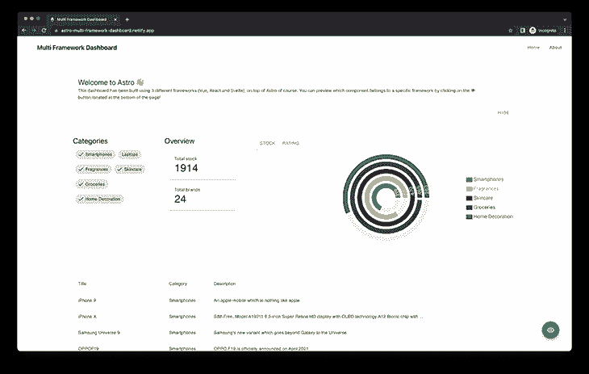

需要强调的是，我们所有的组件都是相互联系的，其中一个组件的交互可以触发另一个组件的变化。这可以通过使用`nanostores`来实现(我们将在本文后面讨论)。

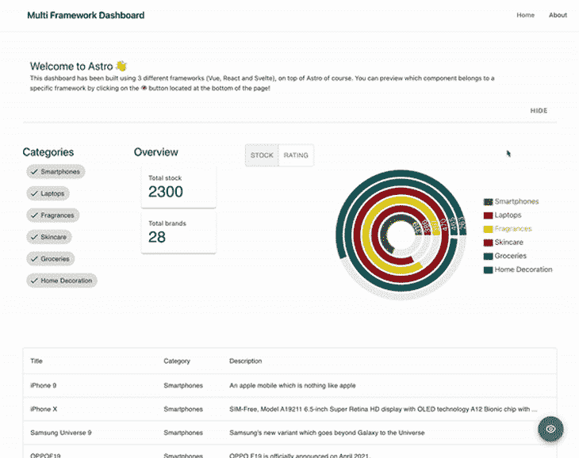

Components are connected: interacting with the Svelte category chart displays changes in the React visual diagram

最后，出于演示的目的，我构建了一个框架荧光笔来可视化地显示负责呈现组件的 UI 框架(React、Vue 或 Svelte)。点击页面底部的蓝色**眼睛图标**可以激活该功能。

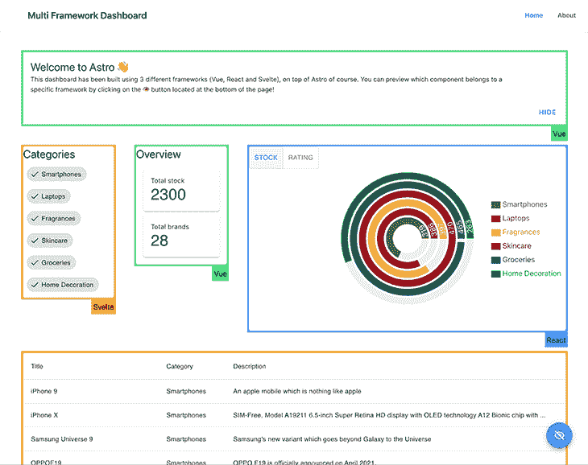

您还可以在这里查看部署的应用程序[。](https://astro-multi-framework-dashboard.netlify.app/)

## 为什么要在一个项目中使用多个框架？

使用 Astro 构建多框架应用程序是创建复杂和多功能软件的一种强大而有效的方式。通过结合不同框架的优势，开发人员可以创建更健壮、更灵活的应用程序，以适应不断变化的需求并满足用户的不同需求。使用 Astro，开发人员可以很容易地集成多个框架，允许他们利用每个框架的最佳特性，创建一个真正出色的应用程序。

除了能够组合多个框架之外，Astro 还非常适合移植。随着软件系统和需求的发展，可能有必要迁移到一个新的框架或一组新的框架。有了 Astro，这个过程可以被简化并变得更加高效，允许开发人员快速、轻松地将他们的应用程序迁移到新的框架，而不会出现大量停机或中断。这可以节省时间、精力和资源，使 Astro 成为任何希望将其应用程序迁移到新框架的人的宝贵工具。

## 建立一个新的天文项目

用 Astro 创建一个[新项目最简单的方法是使用他们的 CLI`create-astro`，它可能是有史以来最友好的编码助手之一:休斯顿！](https://docs.astro.build/en/getting-started/)

```
# create a new project with npm
> yarn create astro

╭─────╮  Houston:
│ ◠ ◡ ◠  Let's make the web weird!
╰─────╯

 astro   v1.6.15 Launch sequence initiated.

✔ Where would you like to create your new project? … astro-dashboard
✔ How would you like to setup your new project? › a few best practices (recommended)
✔ Template copied!
✔ Would you like to install yarn dependencies? (recommended) … yes
✔ Packages installed!
✔ Would you like to initialize a new git repository? (optional) … yes
✔ Git repository created!
✔ How would you like to setup TypeScript? › Strict
✔ TypeScript settings applied!

  next   Liftoff confirmed. Explore your project!

         Enter your project directory using cd ./astro-dashboard
         Run yarn dev to start the dev server. CTRL+C to stop.
         Add frameworks like react or tailwind using astro add.

         Stuck? Join us at https://astro.build/chat

╭─────╮  Houston:
│ ◠ ◡ ◠  Good luck out there, astronaut!
╰─────╯

```

之后，您应该会得到一个结构与此类似的文件夹:

```
/astro-dashboard
├── README.md
├── astro.config.mjs
├── output.txt
├── package.json
├── public
|  └── favicon.svg
├── node_modules # sub folders ignored to keep the directory tree short
├── src
|  ├── components
|  |  └── Card.astro
|  ├── env.d.ts
|  ├── layouts
|  |  └── Layout.astro
|  └── pages
|     └── index.astro
├── tsconfig.json
└── yarn.lock

```

让我们通过运行以下命令来启动我们的开发服务器:

```
> yarn dev

yarn run v1.22.19
$ astro dev
  🚀  astro  v1.6.15 started in 57ms

  ┃ Local    http://127.0.0.1:3000/
  ┃ Network  use --host to expose

```

打开`localhost`网址后，您应该会在浏览器中看到以下屏幕:
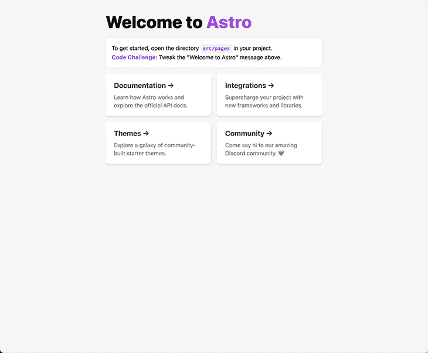

## 添加 UI 框架

Astro 官方文档总结了他们所有的官方集成，包括 UI 框架、SSR 适配器和其他主题，比如 Tailwind。

Astro 团队为每个人简化了它，并在所有新项目中包含了命令`astro add`，我们可以用它来安装任何官方集成。我们只需要执行:

```
> yarn astro add react vue svelte tailwind

✔ Resolving packages...

  Astro will run the following command:
  If you skip this step, you can always run it yourself later

╭─────────────────────────────────────────────────────────────────────────────────────────────────────╮
│ yarn add @astrojs/react @astrojs/svelte @astrojs/tailwind @astrojs/vue @types/[email protected]^18.0.6     │
│ @types/[email protected]^18.0.21 [email protected]^18.0.0 [email protected]^18.0.0 [email protected]^3.46.4 [email protected]^3.0.24            │
│ [email protected]^3.2.30                                                                                         │
╰─────────────────────────────────────────────────────────────────────────────────────────────────────╯

✔ Continue? … yes
✔ Installing dependencies...

  Astro will generate a minimal ./tailwind.config.cjs file.

✔ Continue? … yes

  Astro will make the following changes to your config file:

 ╭ astro.config.mjs ───────────────────────────────────────╮
 │ import { defineConfig } from 'astro/config';            │
 │                                                         │
 │ // https://astro.build/config                           │
 │ import react from "@astrojs/react";                     │
 │ import vue from "@astrojs/vue";                         │
 │ import svelte from "@astrojs/svelte";                   │
 │ import tailwind from "@astrojs/tailwind";               │
 │                                                         │
 │ // https://astro.build/config                           │
 │ export default defineConfig({                           │
 │   integrations: [react(), vue(), svelte(), tailwind()]  │
 │ });                                                     │
 ╰─────────────────────────────────────────────────────────╯

✔ Continue? … yes

   success  Added the following integrations to your project:
  - @astrojs/react
  - @astrojs/vue
  - @astrojs/svelte
  - @astrojs/tailwind

  Astro will make the following changes to your tsconfig.json:

 ╭ tsconfig.json ──────────────────────────╮
 │ {                                       │
 │   "extends": "astro/tsconfigs/strict",  │
 │   "compilerOptions": {                  │
 │     "jsx": "react-jsx",                 │
 │     "jsxImportSource": "react"          │
 │   }                                     │
 │ }                                       │
 ╰─────────────────────────────────────────╯

✔ Continue? … yes

   success  Successfully updated TypeScript settings

```

正如您所看到的，Astro 接管了安装集成的所有手工任务，将它们添加到我们的 Astro 配置文件中，甚至更新我们的`tsconfig.json`以使 React 与 Typescript 很好地协同工作。干得好，休斯顿！

## 设置我们的布局

让我们首先为页面设置我们的`Layout`，它由一个`Header`、`Footer`和一个页面内容容器组成。为了避免我们引入`vuetify`时的几次改变，最好改变我们的`tailwind.config.cjs`文件中的`prefix`，就像这样:

```
# tailwind.config.cjs
/** @type {import('tailwindcss').Config} */
module.exports = {
  content: ['./src/**/*.{astro,html,js,jsx,md,mdx,svelte,ts,tsx,vue}'],
  theme: {
    extend: {},
  },
  plugins: [],
+  prefix: 'tw-',
};

```

让我们将修改应用到我们的`Layout`:

```
// src/layouts/Layout.astro
---
type Props = {
  title: string;
};

const { title } = Astro.props;
---

<!DOCTYPE html>
<html lang="en">
  <head>
    <meta charset="UTF-8" />
    <meta name="viewport" content="width=device-width" />
    <link rel="icon" type="image/svg+xml" href="/favicon.svg" />
    <meta name="generator" content={Astro.generator} />
    <title>{title}</title>
  </head>
  <body>
    <div class="tw-flex tw-h-screen tw-overflow-hidden">
      <main
        class="tw-relative tw-bg-white tw-flex tw-flex-col tw-flex-1 tw-overflow-y-auto tw-overflow-x-hidden"
      >
        <!-- Header -->
        <nav class="tw-bg-white tw-shadow-sm tw-px-2 sm:tw-px-4 tw-py-2.5">
          <div
            class="container tw-flex tw-flex-wrap tw-justify-between tw-items-center tw-mx-auto"
          >
            <a href="/" class="tw-flex tw-items-center">
              
              <span
                class="tw-self-center tw-text-xl tw-font-semibold tw-whitespace-nowrap"
                >{title}
              </span>
            </a>
          </div>
        </nav>

        <!-- Content container -->
        <div class="tw-container tw-mx-auto tw-my-10 tw-flex-grow">
          <slot />
        </div>

        <!-- Footer -->
        <footer
          class="tw-p-4 tw-bg-white tw-rounded-lg tw-shadow md:tw-flex md:tw-items-center md:tw-justify-between md:tw-p-6"
        >
          <span class="tw-text-sm tw-text-gray-500 sm:tw-text-center">
            Built with
            <a href="https://astro.build/" class="hover:tw-underline">Astro</a>
          </span>
        </footer>
      </main>
    </div>
  </body>
</html>

```

在不对我们的初始页面(`src/pages/index.astro`)进行任何更改并应用这些更改的情况下，您应该会看到以下屏幕:


## 获取仪表板数据

对于这个演示，我决定使用来自`[https://dummyjson.com/](https://dummyjson.com/)`的[产品列表端点](https://dummyjson.com/docs/products)，它提供了几个公共 REST APIs，我们可以用它们来模拟从我们的服务器获取数据。当我们调用 API 时，输出具有以下结构:

```
{
  "products": [
    {
      "id": 1,
      "title": "iPhone 9",
      "description": "An apple mobile which is nothing like apple",
      "price": 549,
      "discountPercentage": 12.96,
      "rating": 4.69,
      "stock": 94,
      "brand": "Apple",
      "category": "smartphones",
      "thumbnail": "...",
      "images": ["...", "...", "..."]
    },
    {...},
    {...},
    {...}
    // 30 items
  ],

  "total": 100,
  "skip": 0,
  "limit": 30
}

```

假设我们正在处理一个 TypeScript 项目，那么总是建议键入我们的 API 响应。为此，我们可以对此响应使用以下类型:

```
// src/types.ts
export type Product = {
  id: number;
  title: string;
  description: string;
  price: number;
  discountPercentage: number;
  rating: number;
  stock: number;
  brand: string;
  category: string;
  thumbnail: string;
};

```

为了使用 Astro 获取数据，我们可以在呈现组件之前使用`fetch`函数调用端点，这样做的额外好处是我们不需要在应用程序中处理加载状态。这种加载数据的方式类似于在静态站点上加载数据的方式，在静态站点上，端点在构建时被调用。

同时 Astro 还支持[服务器端渲染](https://docs.astro.build/en/guides/server-side-rendering/#enabling-ssr-in-your-project)。根据您的需求，了解哪种应用程序更适合实现总是很重要的。

因为我们的数据源可以被认为是静态的——产品列表不会随时间而改变——所以运行我们的查询是提高应用程序的性能和 UX 的最佳选择。让我们对初始页面进行以下修改:

```
// src/pages/index.astro
---
import Layout from '../layouts/Layout.astro';
import Card from '../components/Card.astro';
+ import type { Product } from '../types';

// fetch data
+ const products: Product[] = await fetch('https://dummyjson.com/products')
+   .then((res) => res.json())
+   .then((res) => res.products);
---

<Layout title="Welcome to Astro.">
  <main>
    <h1>Welcome to <span class="text-gradient">Astro</span></h1>
...

```

## 在 Astro 应用程序中集成苗条的组件

是时候渲染我们的数据了！让我们重温一下这篇文章的目标:我们希望在同一个项目中使用多个 UI 框架。记住，我们已经将所有的 UI 集成安装到项目中，所以唯一缺少的部分是添加我们的组件。我们一个一个来，从苗条开始！

### 集成表格组件

正如我在本文开头提到的，我们使用的是[超薄材质 UI](https://sveltematerialui.com/) 。要在我们的项目中安装它，我们必须首先将它添加到我们的依赖项中:

```
> yarn add svelte-material-ui

```

之后，我们必须为组件导入必要的 CSS 文件。最好的地方是在我们的`Layout`组件中，因为它将在我们应用程序的每个屏幕中使用。

```
// src/layouts/Layout.astro
---
+ import 'svelte-material-ui/bare.css';

type Props = {
  title: string;
};

const { title } = Astro.props;
---

<!DOCTYPE html>
...

```

在 Astro 中处理 npm 依赖关系时，它构建在 [Vite](https://vitejs.dev/) 之上，之前没有编译(转换成 JavaScript)，我们必须在 Astro 配置中的属性`ssr.noExternal`中指定 Vite，在属性`vite`内。如果你想了解更多关于外部的信息，请参考[官方文档](https://vitejs.dev/guide/ssr.html#ssr-externals)。

```
// astro.config.mjs
import { defineConfig } from 'astro/config';

// https://astro.build/config
import react from '@astrojs/react';
import vue from '@astrojs/vue';
import svelte from '@astrojs/svelte';
import tailwind from '@astrojs/tailwind';

// https://astro.build/config
export default defineConfig({
  integrations: [react(), vue(), svelte(), tailwind()],
+  vite: {
+    ssr: {
+      noExternal: ['@smui/**/*'],
+    },
+  },
});

```

接下来，让我们构建第一个在表格中显示产品列表的细长组件，它将被称为`ProductTable`。幸运的是，`smui`提供了一个叫做`[Data Table](https://sveltematerialui.com/demo/data-table/)`的`Table`组件。下面是该组件的完整代码:

```
// src/components/ProductTable.svelte
<script lang="ts">
  import DataTable, { Head, Body, Row, Cell } from '@smui/data-table';
  import type { Product } from 'types';

  export let products: Product[];
</script>

<DataTable style="width: 100%;">
  <Head>
    <Row>
      <Cell style="width: 100%;">Title</Cell>
      <Cell>Category</Cell>
      <Cell>Description</Cell>
      <Cell>Price</Cell>
      <Cell>Stock</Cell>
    </Row>
  </Head>
  <Body>
    {#each products as item (item.id)}
      <Row>
        <Cell>{item.title}</Cell>
        <Cell>{item.category}</Cell>
        <Cell>{item.description}</Cell>
        <Cell numeric>{item.price}</Cell>
        <Cell numeric>{item.stock}</Cell>
      </Row>
    {/each}
  </Body>
</DataTable>

```

现在，让我们在主页中渲染它。我去掉了模板项目中呈现的`Card`组件。

```
// src/page/index.astro
---
import Layout from '../layouts/Layout.astro';
import ProductTable from '../components/ProductTable.svelte';

import type { Product } from '../types';

// fetch data
const products: Product[] = await fetch('https://dummyjson.com/products')
  .then((res) => res.json())
  .then((res) => res.products);
---

<Layout title="Welcome to Astro.">
  <ProductTable products={products} />
</Layout>

```

我们的应用程序应该是这样的:
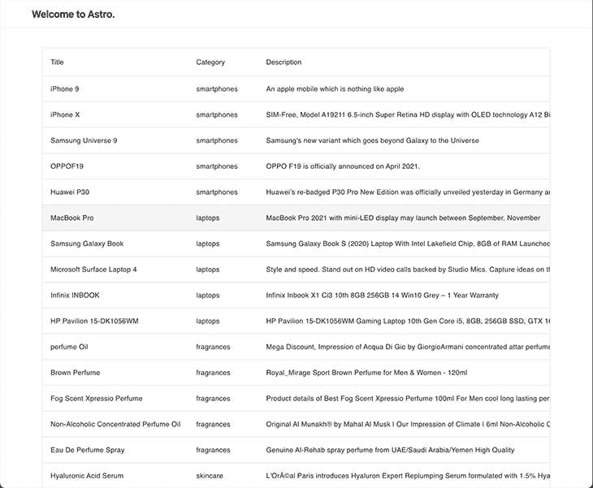

该仪表板的一个关键特性是能够查看所有现有类别，并将它们标记为可见或隐藏。为了构建这个组件，我们将使用来自`smui`的组件[芯片](https://sveltematerialui.com/demo/chips/)。这是组件的一种可能实现:

```
// src/component/CategoryTags.astro
<script lang="ts">
  import Chip, { Set, Text } from '@smui/chips';
  import type { Product } from '../types';

  export let products: Product[];

  let categories = products
    .map((product) => product.category)
    .filter((val, i, arr) => arr.indexOf(val) === i);

  let selected = Array.from(categories);
</script>

<h1>Categories</h1>

<Set chips={categories} let:chip filter bind:selected>
  <Chip {chip} touch>
    <Text>{chip}</Text>
  </Chip>
</Set>

```

考虑到这个组件是交互式的，我们需要从 Astro 指定一个[客户端指令](https://docs.astro.build/en/reference/directives-reference/#client-directives)来加载 JavaScript 否则，当点击类别时什么都不会发生。让我们用`client:load`指令将组件添加到我们的主页面。

```
// src/pages/index.astro
---
import Layout from '../layouts/Layout.astro';
import ProductTable from '../components/ProductTable.svelte';
+ import CategoryTags from '../components/CategoryTags.svelte';

import type { Product } from '../types';

// fetch data
const products: Product[] = await fetch('https://dummyjson.com/products')
  .then((res) => res.json())
  .then((res) => res.products);
---

<Layout title="Welcome to Astro.">
+  <CategoryTags products={products} client:load />
  <ProductTable products={products} client:load />
</Layout>

```

该应用程序现在看起来非常类似于我们的仪表板！

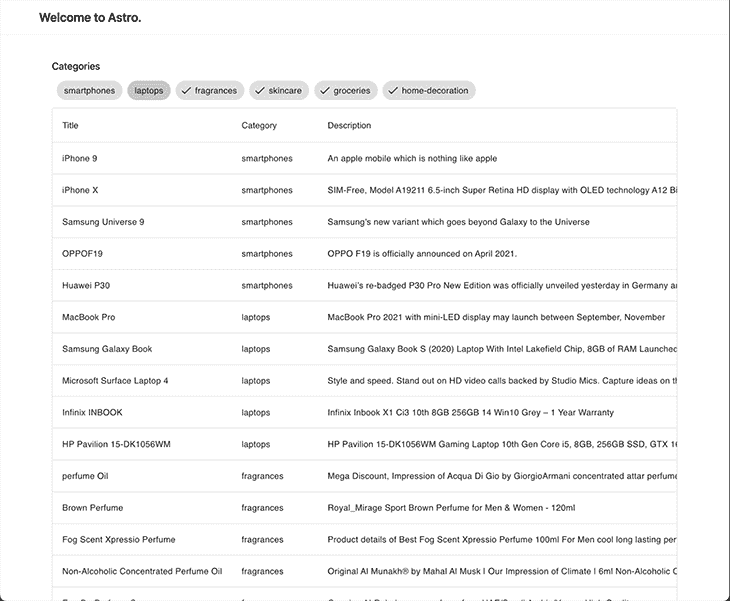

## 使用`nanostores`进行数据同步和状态管理

你在之前的屏幕中发现任何错误了吗？应该隐藏的类别在我们的表中仍然可见。原因是我们没有在我们的`ProductTable`和`CategoryTags`之间传递数据。是时候谈谈国家管理了！

假设每个库都有不同的实现方式，那么我们如何在我的组件之间共享信息呢？我们有几个不同的选择:

*   React 拥有[上下文 API](https://reactjs.org/docs/context.html) ，具有`Provider` / `Consumer`模式
*   Vue 提供了一个[反应式 API](https://vuejs.org/guide/scaling-up/state-management.html#simple-state-management-with-reactivity-api) ，以类似 Redux 的风格遵循`Actions --> State --> View`的约定
*   Svelte 推荐使用[商店](https://svelte.dev/docs#run-time-svelte-store)，提供`readable`、`writable`和`derived`容器来存储数据

所有这些都是解决状态管理问题的有效方法，但是很明显，我们需要找到一个适用于所有 UI 库的通用解决方案。这就是`[nanostores](https://github.com/nanostores/nanostores)`发挥作用的地方！他们在 GitHub 页面上提供的描述非常完美:

React，React Native，Preact，Vue，Svelte 和 vanilla JS 的小型状态管理器。它使用许多原子存储和直接操作。

API 很简单，如下所示:

```
import { atom } from 'nanostores';

// definition of state for primitive values
export const counter = atom(0);

// read and write state
counter.set(counter.get() + 1);

// definition of state for objects
export const car = map({
  brand: 'Tesla',
  km: 0,
});

// update property inside object
car.setKey('km', car.get().km + 1000);

```

nanostores 提供了许多 API 来对状态更新和通知进行更多的控制，所以我强烈建议查看它们的文档，以防您想深入了解。

然而，要涵盖的一个重要部分是与不同 UI 库的集成。对于每个框架，他们提供了一个独立的包，该包遵循包的编码标准:

*   React ( `[@nanostores/react](https://github.com/nanostores/react)`):提供一个`useStore()`钩子来获取存储的值，并根据存储的变化重新呈现组件
*   Vue ( `[@nanostores/vue](https://github.com/nanostores/vue)`):提供一个`useStore()`可组合函数来获取存储的值，并根据存储的变化重新呈现组件
*   斯维尔特:`nanostores`执行[斯维尔特的店铺合同](https://svelte.dev/docs#component-format-script-4-prefix-stores-with-%24-to-access-their-values-store-contract)；我们只需要将`$`放在存储变量之前来获取值并订阅更改

要将`nanostores`添加到我们的项目中，我们只需要安装主要的`nanostores`依赖项和我们需要的集成(在我们的例子中，`vue`和`react`各一个)。

```
> yarn add nanostores @nanostores/react @nanostores/vue

```

还建议将我们的*商店*存放在一个所有组件都可以访问的共享位置。对于我们的类别场景，我们需要一个简单的`string`数组，我们可以添加或删除类别来隐藏它们。

```
// src/state.ts
import { atom } from 'nanostores';

export const hiddenCategories = atom<string[]>([]);

```

让我们连接两个“隔离”的组件。`CategoryTags`组件必须能够从`hiddenCategories`中读取和写入。

```
// src/components/CategoryTags.svelte
<script lang="ts">
  import Chip, { Set, Text } from '@smui/chips';
  import type { Product } from '../types';
+  import { hiddenCategories } from '../state';

  export let products: Product[];

  let categories = products
    .map((product) => product.category)
    .filter((val, i, arr) => arr.indexOf(val) === i);

  let selected = Array.from(categories);

+  function updateSelection() {
+    hiddenCategories.set(
+      categories.filter((category) => !selected.includes(category)),
+    );
+  }
</script>

<h1>Categories</h1>

<Set
  chips={categories}
  let:chip
  filter
  bind:selected
+  on:click={updateSelection}
>
  <Chip {chip} touch>
    <Text>{chip}</Text>
  </Chip>
</Set>

```

我们的`ProductTable`只需要从`hiddenCategories`中读取，然后过滤出属于我州类别的产品。

```
// src/components/ProductTable.svelte
<script lang="ts">
  import DataTable, { Head, Body, Row, Cell } from '@smui/data-table';
  import type { Product } from '../types';
+  import { hiddenCategories } from '../state';

  export let products: Product[];
</script>

<DataTable style="width: 100%;">
  <Head>
    <Row>
      <Cell style="width: 100%;">Title</Cell>
      <Cell>Category</Cell>
      <Cell>Description</Cell>
      <Cell>Price</Cell>
      <Cell>Stock</Cell>
    </Row>
  </Head>
  <Body>
+    {#each products.filter((product) => !$hiddenCategories.includes(product.category)) as item (item.id)}
      <Row>
        <Cell>{item.title}</Cell>
        <Cell>{item.category}</Cell>
        <Cell>{item.description}</Cell>
        <Cell numeric>{item.price}</Cell>
        <Cell numeric>{item.stock}</Cell>
      </Row>
    {/each}
  </Body>
</DataTable>

```

从`CategoryTags`中删除`Smartphones`和`Laptops`类别后，我们可以看到它们在`ProductTable` :
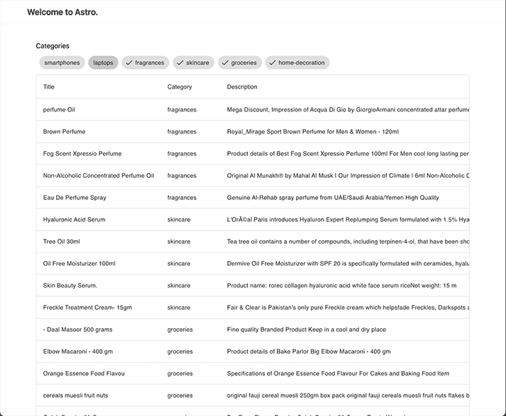中不再存在

## Vue 集成:概述

对于 Vue，我决定使用生态系统中最流行的组件框架选项:[Vue 化](https://next.vuetifyjs.com/en/)。对于替代项目，安装可能有点棘手(比如这个！)，所以希望尽量说清楚。让我们从安装必要的依赖项开始(注意，只有最新版本 v3 与 Vite 兼容):

```
> yarn add [email protected]^3.0.5

```

类似于我们对`smui`所做的，我们需要在我们的`Layout`中导入组件库样式:

```
---
import 'svelte-material-ui/bare.css';
+ import 'vuetify/styles';

type Props = {
  title: string;
};

const { title } = Astro.props;
---

<!DOCTYPE html>
<html lang="en">
  <head>
...

```

接下来，我们需要将`vuetify`挂接到我们的`vue`应用程序中。这在几个版本之前的 Astro 中是不可能的，直到在`pages`文件夹中引入了`_app`文件，该文件允许访问`vue`的`App`实例。

```
//src/pages/_app.ts
import type { App } from 'vue';
import { createVuetify } from 'vuetify';
import * as components from 'vuetify/components';
import * as directives from 'vuetify/directives';

export default (app: App) => {
  const vuetify = createVuetify({
    ssr: true,
    components,
    directives,
  });

  app.use(vuetify);
};

```

对我们的`astro.config.mjs`文件做了一些修改:我们需要将依赖项标记为`noExternal`，并将 Astro Vue 集成与我们刚刚定义的入口点链接起来。

```
// astro.config.mjs
import { defineConfig } from 'astro/config';

// https://astro.build/config
import react from '@astrojs/react';
import vue from '@astrojs/vue';
import svelte from '@astrojs/svelte';
import tailwind from '@astrojs/tailwind';

// https://astro.build/config
export default defineConfig({
  integrations: [
    react(),
+    vue({ appEntrypoint: '/src/pages/_app' }),
    svelte(),
    tailwind(),
  ],
  vite: {
    ssr: {
+      noExternal: ['@smui/**/*', 'vuetify'],
    },
  },
});

```

现在，我们可以实现我们的`Summary`组件，它将让我们看一眼**总库存**和**总品牌**类别以及其中所选的产品。这听起来很适合`[v-card component](https://next.vuetifyjs.com/en/components/cards/)`！

```
// src/components/Overview.vue
<script setup lang="ts">
import type { Product } from 'types';
import { hiddenCategories } from '../state';
import { useStore } from '@nanostores/vue';

type Props = {
  products: Product[];
};

const { products } = defineProps<Props>();
const $hiddenCategories = useStore(hiddenCategories);
</script>

<template>
  <h1>Overview</h1>

  <v-container>
    <v-row dense>
      <v-col cols="12">
        <v-card>
          <v-card-text>
            <div>Total stock</div>
            <p class="text-h4 text--primary">
              <!-- Calculating stock with the value from store -->
              {{
                products
                  .filter(
                    (product) => !$hiddenCategories.includes(product.category),
                  )
                  .reduce((acc, curr) => acc + curr.stock, 0)
              }}
            </p>
          </v-card-text>
        </v-card>
      </v-col>

      <v-col cols="12">
        <v-card>
          <v-card-text>
            <div>Total brands</div>
            <p class="text-h4 text--primary">
              <!-- Calculating brand amount with the value from store -->
              {{
                products
                  .filter(
                    (product) => !$hiddenCategories.includes(product.category),
                  )
                  .filter((product, i, array) => array.indexOf(product) === i)
                  .length
              }}
            </p>
          </v-card-text>
        </v-card>
      </v-col>
    </v-row>
  </v-container>
</template>

```

不要忘记把它添加到主页上！

```
// src/pages/index.astro
---
import Layout from '../layouts/Layout.astro';
import type { Product } from '../types';

import ProductTable from '../components/ProductTable.svelte';
import CategoryTags from '../components/CategoryTags.svelte';
import Overview from '../components/Overview.vue';

// fetch data
const products: Product[] = await fetch('https://dummyjson.com/products')
  .then((res) => res.json())
  .then((res) => res.products);
---

<Layout title="Welcome to Astro.">
  <CategoryTags products={products} client:load />
+ <Overview products={products} client:load />
  <ProductTable products={products} client:load />
</Layout>

```

下面是我们的仪表盘现在的样子:
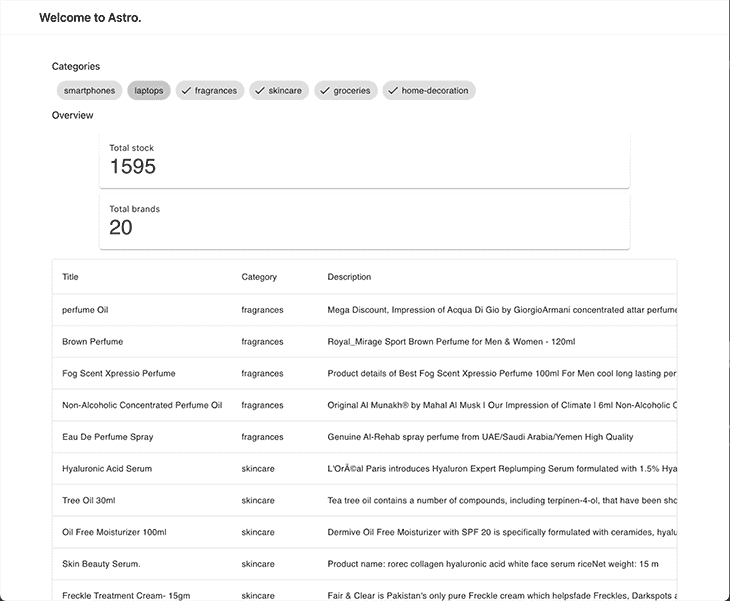

## 反应积分:`CategoryChart`

这是本文的最后一个整合，可能也是最好玩的！除非我们展示一个图表或图示来直观地显示信息，否则不能认为仪表板是完整的。对于这部分演示，我们将使用 [`mui`](https://mui.com/) 表示组件，使用 [`recharts`](https://recharts.org/) 表示图形。

安装非常简单，也许是整个教程中最简单的:

```
# installation for mui
> yarn add @mui/material @emotion/react @emotion/styled

# installation for recharts
> yarn add recharts

```

我们想让用户直观地看到可见类别的`stock`数量和`rating`，这样他们就可以了解比例是如何平衡的。这是`recharts`中`[RadialBarChart](https://recharts.org/en-US/examples/SimpleRadialBarChart)`的完美场景。然后，我们可以使用`mui`中的`[ToggleButton](https://mui.com/material-ui/react-toggle-button/)`来切换要可视化的值(股票或评级)。这是它的一个可能的实现:

```
// src/components/CategoryChart.tsx
import { useStore } from '@nanostores/react';
import React, { useMemo } from 'react';
import {
  RadialBarChart,
  RadialBar,
  Legend,
  ResponsiveContainer,
} from 'recharts';
import type { Product } from '../types';
import { hiddenCategories } from '../state';
import randomColor from 'randomcolor';
import ToggleButtonGroup from '@mui/material/ToggleButtonGroup';
import ToggleButton from '@mui/material/ToggleButton';

const style = {
  top: '50%',
  right: 0,
  transform: 'translate(0, -50%)',
  lineHeight: '30px',
};

type Props = {
  products: Product[];
};

type View = 'stock' | 'rating';

const groupByCategory = (products: Product[]) => {
  return products.reduce((acc, curr) => {
    const existingCategory = acc[curr.category];

    acc[curr.category] = existingCategory
      ? existingCategory.concat(curr)
      : [curr];
    return acc;
  }, {} as Record<string, Product[]>);
};

const CategoryChart = ({ products }: Props) => {
  const [view, setView] = React.useState<View>('stock');
  const disabledCategories = useStore(hiddenCategories);

  const data = useMemo(() => {
    const visibleCategories = products
      .map((product) => product.category)
      .filter((product) => !disabledCategories.includes(product))
      .filter((val, i, arr) => arr.indexOf(val) === i);

    const groupedByCategory = groupByCategory(products);

    return visibleCategories.map((category) => {
      const productsInCategory = groupedByCategory[category];
      const avg =
        productsInCategory.reduce((acc, curr) => acc + curr.rating, 0) /
        products.length;

      return {
        name: category,
        stock: productsInCategory.reduce((acc, curr) => acc + curr.stock, 0),
        rating: Math.round(avg * 100) / 100,
        fill: randomColor({ seed: category, luminosity: 'dark' }),
      };
    });
  }, [products, disabledCategories]);

  return (
    <div style={{ width: '100%', height: 400, position: 'relative' }}>
      <ResponsiveContainer width="100%" height="100%">
        <RadialBarChart
          cx="50%"
          cy="50%"
          innerRadius="20%"
          outerRadius="80%"
          barSize={15}
          data={data}
        >
          <RadialBar
            minAngle={15}
            label={{ position: 'insideStart', fill: '#fff' }}
            background
            dataKey={view}
          />

          <Legend
            iconSize={20}
            layout="vertical"
            verticalAlign="middle"
            wrapperStyle={style}
          />
        </RadialBarChart>
      </ResponsiveContainer>

      <ToggleButtonGroup
        style={{ position: 'absolute', top: 0 }}
        color="primary"
        value={view}
        exclusive
        onChange={(_, val) => val && setView(val)}
      >
        <ToggleButton value="stock">Stock</ToggleButton>
        <ToggleButton value="rating">Rating</ToggleButton>
      </ToggleButtonGroup>
    </div>
  );
};

export default CategoryChart;

```

让我们将它添加到我们的页面，并检查它如何集成到我们的仪表板！

```
// src/pages/index.astro
---
import Layout from '../layouts/Layout.astro';
import type { Product } from '../types';

import ProductTable from '../components/ProductTable.svelte';
import CategoryTags from '../components/CategoryTags.svelte';
import Overview from '../components/Overview.vue';
import CategoryChart from '../components/CategoryChart';

// fetch data
const products: Product[] = await fetch('https://dummyjson.com/products')
  .then((res) => res.json())
  .then((res) => res.products);
---

<Layout title="Welcome to Astro.">
  <CategoryTags products={products} client:load />
+  <Overview products={products} client:load />
  <CategoryChart products={products} client:load />
  <ProductTable products={products} client:load />
</Layout>

```

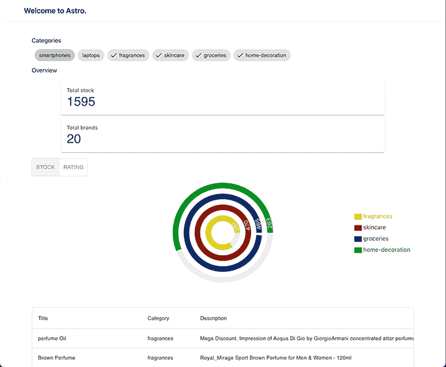

## 让应用程序响应迅速

既然我们已经对所有组件进行了完整的编码和集成，我们需要关注应用程序的响应能力。这就是顺风可以让我们的生活变得更容易的地方，在几行中，我们得到了奇妙的结果！

```
//src/pages/index.astro
---
import Layout from '../layouts/Layout.astro';
import type { Product } from '../types';

import ProductTable from '../components/ProductTable.svelte';
import CategoryTags from '../components/CategoryTags.svelte';
import Overview from '../components/Overview.vue';
import CategoryChart from '../components/CategoryChart';

// fetch data
const products: Product[] = await fetch('https://dummyjson.com/products')
  .then((res) => res.json())
  .then((res) => res.products);
---

<Layout title="Welcome to Astro.">
+  <div class="tw-grid tw-gap-4 tw-grid-cols-3 lg:tw-grid-cols-5 md:tw-gap-10">
+    <div class="tw-col-span-1">
      <CategoryTags client:load products={products} />
+    </div>

+    <div class="tw-col-span-1">
      <Overview client:load products={products} />
+    </div>

+    <div class="tw-col-span-3">
      <CategoryChart client:only="react" products={products} />
+    </div>

+    <div class="tw-col-span-full">
      <ProductTable client:load products={products} />
+    </div>
  </div>
</Layout>

```

既然我们已经对所有组件进行了完整的编码和集成，我们需要关注应用程序的响应能力。这就是顺风可以让我们的生活变得更容易的地方，在几行中，我们得到了奇妙的结果！


The mobile view of our app

让我们采用移动优先的方法。Categories 标记和 overview 呈现在一行中；在它下面，我们有图表，在底部(需要一些滚动)是产品表。

这张图片展示了我们网站的平板电脑视图，提供了桌面和移动版本之间的平衡，在更大的屏幕上提供了方便的浏览体验。

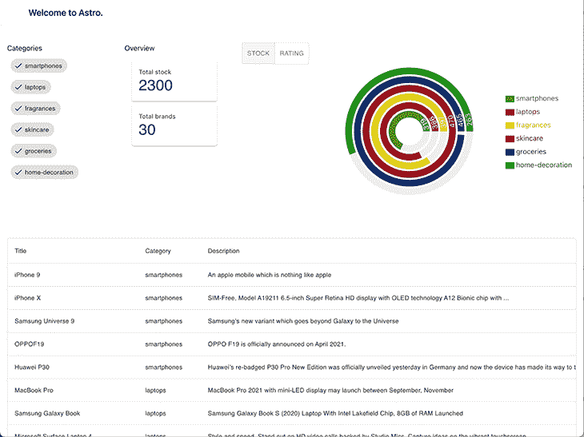

The tablet view of our app

最后，我们有我们的网站的桌面视图，有一个宽的布局，并在两侧添加填充，使内容水平居中。

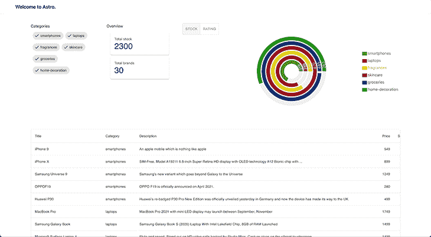

The desktop view of our app

## 结论

在上一篇文章中，我们讨论了 Astro 背后的架构，它使得构建这种应用程序成为可能。如果你不熟悉 Astro 对 islands architecture 的实现，我强烈推荐你看看这篇文章。

Astro 是一个有用的工具，通过允许我们组合多个框架，它可以帮助我们构建复杂和通用的软件。随着我们的软件系统和需求的发展，Astro 可以帮助我们轻松有效地将我们的应用程序迁移到新的框架，节省我们的时间、精力和资源。

最重要的是，它还通过确保我们不会使用不必要的 JavaScript 来帮助我们优化应用程序。这有助于保持我们的应用程序轻量级和高性能，这可以改善用户体验和应用程序的整体功能。Astro 的这一特性使得它在构建满足用户需求的高效高性能应用程序时很有价值。

感谢您的阅读，让我们继续一起努力吧！👷‍♂️

### 参考

您是否添加了新的 JS 库来提高性能或构建新特性？如果他们反其道而行之呢？

## 毫无疑问，前端变得越来越复杂。当您向应用程序添加新的 JavaScript 库和其他依赖项时，您将需要更多的可见性，以确保您的用户不会遇到未知的问题。

LogRocket 是一个前端应用程序监控解决方案，可以让您回放 JavaScript 错误，就像它们发生在您自己的浏览器中一样，这样您就可以更有效地对错误做出反应。

[LogRocket](https://lp.logrocket.com/blg/javascript-signup) 可以与任何应用程序完美配合，不管是什么框架，并且有插件可以记录来自 Redux、Vuex 和@ngrx/store 的额外上下文。您可以汇总并报告问题发生时应用程序的状态，而不是猜测问题发生的原因。LogRocket 还可以监控应用的性能，报告客户端 CPU 负载、客户端内存使用等指标。

[](https://lp.logrocket.com/blg/javascript-signup)[https://logrocket.com/signup/](https://lp.logrocket.com/blg/javascript-signup)

自信地构建— [开始免费监控](https://lp.logrocket.com/blg/javascript-signup)。

Build confidently — [Start monitoring for free](https://lp.logrocket.com/blg/javascript-signup).