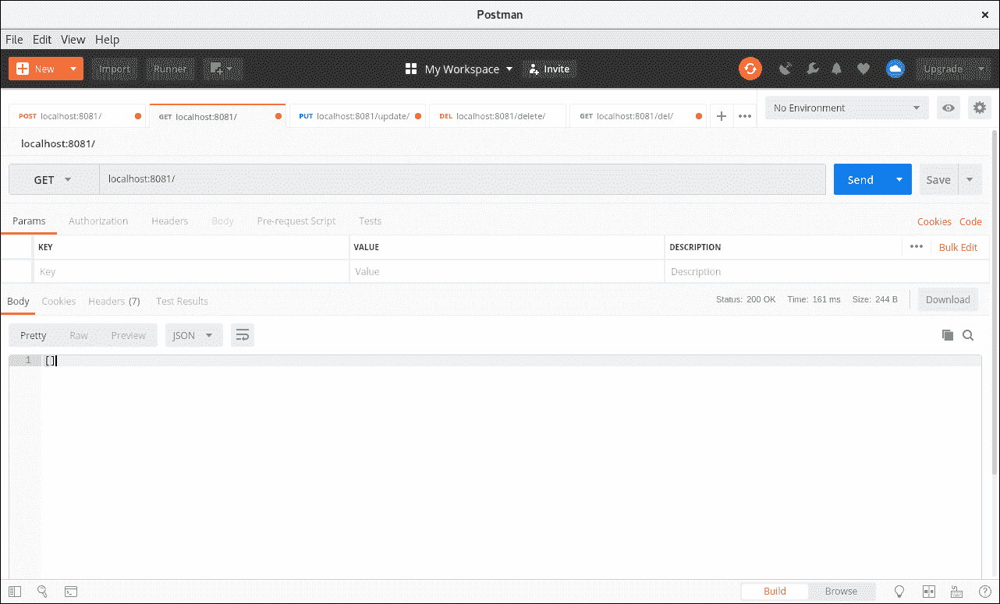
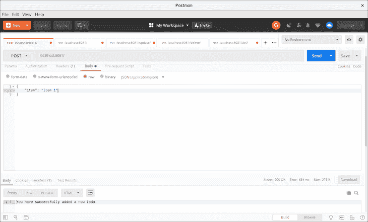
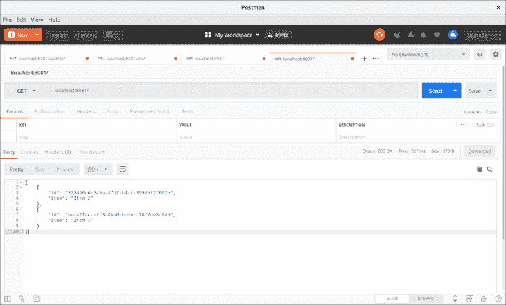
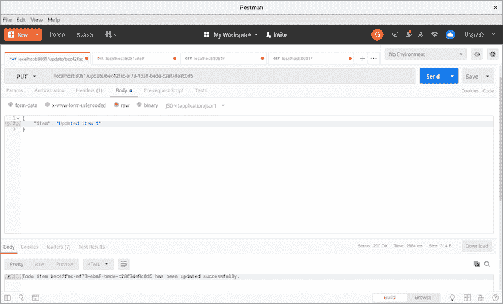
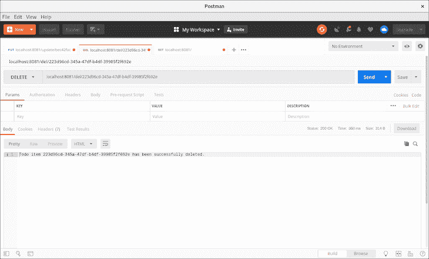
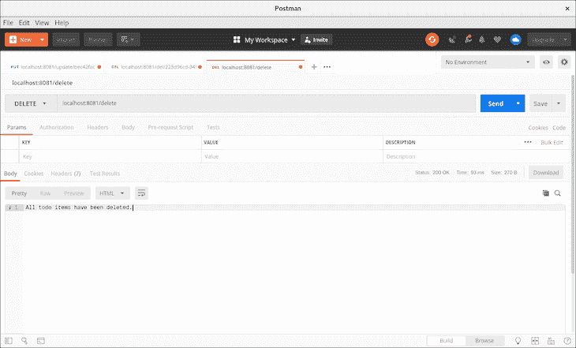
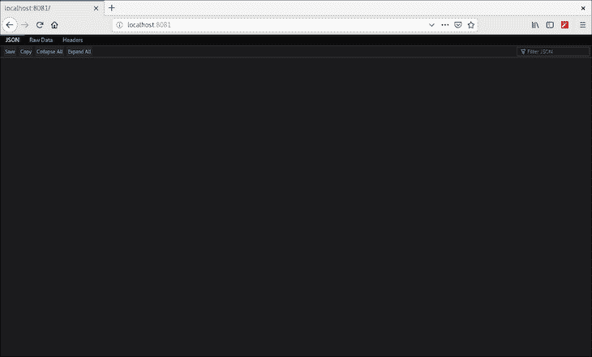

# 构建基于 nanoSQL 的 API-log rocket 博客

> 原文：<https://blog.logrocket.com/building-nanosql-powered-apis/>

数据库经常需要你用一种特定的查询语言与它们交流。就像 SQL 数据库层通过 SQL 查询进行交互一样，MongoDB 和其他数据库层用各自的查询语言进行通信。

在本教程中，我们将向您展示如何使用名为 [nanoSQL](https://nanosql.io/) 的通用数据库层库来弥合语言鸿沟。

## 什么是 nanoSQL？

nanoSQL 是用于客户端、服务器和移动设备的 JavaScript 数据库层。它提供了一种标准化的查询语言，您可以使用这种语言在多个数据库(如 MySQL、MongoDB、indexedDB 和 Redis 等)中执行数据存储和查询操作。

### nanoSQL 功能

nanoSQL 支持多个数据库，并具有相同的 API。与其名字相反，nanoSQL 不仅仅处理 SQL 数据库。它还与关系数据库管理系统(RDBMSs)协同工作。

nanoSQL 执行广泛的操作，从简单的查询数据到导入和导出数据。基本上，它像普通数据库一样执行操作。我们将放大应用程序中需要的几个关键操作。

最好的特性之一是 nanoSQL 的查询 API 的通用性，这使得它可以很容易地迁移到其他数据库，而不必学习新的查询语法。nanoSQL 支持 SQLite(Node.js/Electron、Cordova 和 NativeScript)、Redis、MongoDB 以及其他众多数据库。

### 我们将建造什么

为了演示如何将数据从我们的 [CRUD API](https://blog.logrocket.com/crud-with-node-graphql-react/) 存储到 nanoSQL 中，我们将构建一个简单的待办事项后端。我们还将通过制作我们的数据库层 MongoDB 来验证 nanoSQL 查询语言的通用性。

我假设你已经安装了的 [MongoDB，以及 JavaScript、Node.js、REST 和 Postman 的基础知识。你可以在](https://docs.mongodb.com/manual/installation/) [GitHub](https://github.com/Youngestdev/nanosql-todo-app) 上找到本文使用的代码。

## 设置

在我们深入探讨之前，让我们先规划一下项目结构和待办事项后端应用程序所需的依赖项的安装。我们将从创建项目文件夹开始。

```
mkdir nanosql-todo-app && cd nanosql-todo-app
mkdir src && touch src/{app,database}.js

```

接下来，我们将初始化目录并安装所需的依赖项。

```
npm init -y
npm i express cors body-parser @nano-sql/core @nano-sql/adapter-mongo

```

现在是时候在我们的`app.js`文件中编写后端 API 了。

### `app.js`

该文件负责处理 CRUD 操作所需的路由。首先，我们将通过 CommonJS 模块化的方式导入所需的模块。

```
const express = require("express");
const bodyParser = require("body-parser");
const cors = require('cors')

```

接下来，我们将初始化导入的库。

```
const app = express();
app.use(bodyParser.json());
app.use(cors())

```

下一步是编写 CRUD 操作的路线:

*   返回我们的待办事项列表，并允许我们发布新的待办事项
*   `/:id`返回一个待办事项，其 ID 作为参数传递
*   `/del/:id`删除 ID 与传递的 ID 相匹配的待办事项
*   `/update/:id`更新其 ID 与传递的 ID 相匹配的待办事项
*   `/delete`删除我们 nanoSQL 数据库中的所有待办事项

```
app.get("/", (req, res) => {
});app.get("/:id", (req, res) => {
});

app.post("/", async (req, res) => {
})

app.delete("/del/:id", async (req, res) => {
})

app.put("/update/:id", async (req, res) => {
})

app.delete("/delete", async (req, res) => {
})
```

上面的代码目前不做任何事情。接下来，我们将编写数据库处理程序。

## 构建数据库处理程序

后端 API 依赖数据库来执行任何操作，因此我们需要编写负责每个操作的处理程序。

### `database.js`

这个文件负责处理数据存储和查询我们的应用程序。我们必须创建一个对象来存储所有 CRUD 方法以及启动数据库的触发器函数。

我们将从导入 nanoSQL 并创建它的一个实例开始。

```
const nSQL = require("@nano-sql/core");
const { MongoDB } = require("@nano-sql/adapter-mongo");

const db = nSQL.nSQL;

```

变量`db`存储了 nanoSQL 的一个实例，并将用于执行所有操作。接下来，我们将创建数据库对象。

```
// Start database...

let database = {}

```

数据库对象由负责 CRUD 操作的方法组成。我们需要定义一个`start`方法来启动我们的 nanoSQL 数据库。

```
let database = {
    start: async function() {
    return await db().createDatabase({
      id: "todo_list",
      mode: new MongoDB("mongodb://localhost:27017"),
      tables: [
        {
          name: "todos",
          model: {
            "id:uuid": {pk: true},
            "item:string": {},            
          }
        }
      ],
    }).then(() => {
      // log a confirmation message.
      console.log("Database is up!")
    })
  },
}

```

start 方法是一个异步函数，它在执行 nanoSQL 的`createDatabase()`方法后返回成功消息或错误。`createDatabase()`方法采用以下参数。

*   `id` —唯一的数据库标识符
*   `mode` —一种数据库模式，可以是 TEMP(临时内存数据库)、MySQL、RocksDB、MongoDB，甚至是 localStorage(我们将通过在 MongoDB 中使用它来验证它的通用性)
*   `tables` —表格选项采用一组对象，即可以创建多个表格。

出于本教程的目的，我们将只创建一个表。传递到数组中的对象包括我们的表名、一个定义存储在那里的数据类型的模型、一个作为主键的惟一 ID 和一个 string 类型的项。

* * *

### 更多来自 LogRocket 的精彩文章:

* * *

因为我们的 start 方法是异步的，所以一旦数据库启动并运行，我们将添加一个回调来记录确认消息。

### 询问

要执行任何数据操作，必须发出查询。nanoSQL 中的查询如下所示:

```
db(database_name).query("query type", ...query args).exec()

```

`.query()`方法被附加到数据库实例——在我们的例子中是`db("todos")`。`query()`方法将一个查询类型作为主要的第一个参数，可选参数主要根据需要作为`select`查询的条件。

`query()`方法附加了一个执行查询的`.exec()`函数。除其他外，查询类型包括:

*   `select`
*   `total`
*   `upsert`(插入)
*   `delete`

在接下来的部分中，我们将看到该查询的运行情况。

接下来，让我们定义一个`retrieve`方法，它返回数据库中传递的 ID 的待办事项。

```
let database = {
  ...
  retrieve: async function(id) {
    return await db("todos").query("select").where(["id", "=", id]).exec().then((item) => item)
  },
}

```

`retrieve`方法将`id`作为实参，作为参数发送进行查询。retrieve 方法中传递的查询类型是选择查询。

select 查询通过指示数据库使用`.where()`方法检查项目来返回待办事项。`.where()`方法是 select 语句的前缀附件，因为 select 语句主要是有条件的。

下一步是在`retrieve`方法之后定义一个`retrieveAll`方法，它返回我们数据库中的待办事项列表。

```
retrieveAll: async function() {
    return await (db("todos").query("select").exec())
      .then((rows) => rows)
  },

```

与`retrieve`方法不同，`.where()`方法没有被附加，因为我们查询数据库中的所有条目。这也是从数据库中导出所有数据的好方法。

现在让我们定义一个`insert`方法来向我们的待办事项数据库添加一个新项目。

```
insert: async function(item) {
    return await db("todos").query("upsert", {item: item}).exec();
  },

```

insert 方法接受一个参数和一个条目(即待办事项)，并使用`upser`查询类型将其插入到条目字段中。

接下来定义`update`方法。

```
update: async function(id, item) {
    await db("todos").query("upsert", {item: item}).where(["id", "=", id]).stream((row) => {
      console.log(row)
    }, () => {
      console.log("Item Updated")      
    }, (err) => {
      console.log(err)
    })
  },

```

`update`方法有两个参数:`id`和`item`。它通过它的`id`查找要更新的条目，然后用传递给更新函数的新数据修改它。成功更新数据后，新数据会记录到控制台，并显示一条确认消息。否则，控制台会记录一条错误消息。

接下来，我们将定义负责删除数据库中一个或多个待办事项的`delete`和`deleteAll`方法。

```
delete: async function(id) {
    return await db("todos").query("delete").where(["id", "=", id]).exec();
  },
deleteAll: async function() {
  return await db("todos").query("delete").exec();
},

```

`delete`方法删除一个 ID 被传入其中的待办事项。`deleteAll`删除数据库中的所有待办事项。

在数据库对象之后，我们将导出我们的`database`对象用于`app.js`文件。

```
module.exports = databse;

```

## 将数据库连接到 API 路由

既然我们已经成功地编写了数据库处理程序，我们将在 API 路径中实现它们。让我们导航回我们的`app.js`文件来更新它。

```
const cors = require("cors")
const database = require("./database")
...
database.start();

app.get("/", (req, res) => {
  database.retrieveAll().then((items) => {
    res.send(items)
  })
});

```

我们将从实现`/`路线开始，它返回我们数据库中所有的待办事项。接下来，我们将实现单个待办事项路线。

```
app.get("/:id", (req, res) => {
  database.retrieve(req.params.id).then((item) => {
    res.send(item)
  })
});

```

`/:id`将 ID 作为一个参数从 URL 传递给数据库，以检索待办事项。我们将实现`POST`路线`/`，它允许我们在数据库中插入新的待办事项。

```
app.post("/", async (req, res) => {
  await database.insert(req.body.item).then(() => {    
    res.status(200).send("You have successfully added a new todo.")
  })
})

```

此路由在成功插入后发送确认方法和状态。下一步是实现我们的`/del/:id`方法，它删除单个待办事项，以及`/delete`方法，它删除数据库中的所有待办事项。

```
app.delete("/del/:id", async (req, res) => {
  await database.delete(req.params.id).then(() => {
    res.status(200).send(`Todo item ${req.params.id} has been successfully deleted.`)
  })
})

app.delete("/delete", async (req, res) => {
  await database.deleteAll().then(() => {
    res.status(200).send(`All todo items have been deleted.`)
  })
})

```

我们还实现了我们的`/update/:id` route，它更新单个待办事项。

```
app.put("/update/:id", async (req, res) => {
  await database.update(req.params.id, req.body.item).then(() => {
    res.status(200).send(`Todo item ${req.params.id} has been updated successfully.`)
  })
})

```

最后，我们将实现应用程序的监听器功能。

```
app.listen(8081, () => {
  console.log("App's running on port 8081");
});

```

我们将打开一个新的终端，通过`mongod`启动一个 MongoDB 实例，然后返回到之前的终端启动我们的应用程序。

```
mkdir todo-db && mongod --dbpath todo-db

```

之前的终端是这样的:

```
node src/app.js

```

## 用 Postman 测试 API

在这个阶段，我们应该花点时间来验证上面的代码是否有效。我们将从检索数据库中的待办事项列表开始。



因为我们的数据库中目前没有数据，所以我们得到一个空数组。让我们添加几个待办事项。



我们收到了一个成功的响应，所以让我们运行另一个 GET 请求来验证我们的数据确实在数据库中。



太好了！现在我们将继续更新第一个待办事项，`item 1`。复制第一个待办事项的 ID，放在`localhost:8081/update/`后面。



我们收到了确认消息，这很好。接下来，我们将测试`delete`路线。我们将删除待办事项中的第二个项目，方法是将该项目的 ID 放在删除路径之后:`localhost:8081/del/`。



我们应该得到一个响应，即我们的带有传递 ID 的待办事项已被删除。

让我们测试一下我们的`delete all`路线。



删除请求返回成功消息。如果我们运行 GET 请求来列出我们的待办事项，它会返回空数据。



## 结论

本教程应该让您对 nanoSQL 有一个基本的了解，以及它的特性是如何工作的。主要的收获是，通过构建一个简单的待办事项后端应用程序并在其上执行 CRUD 操作，您可以将 nanoSQL 的查询语言与 MongoDB 一起使用，而无需编写 MongoDB 查询。

nanoSQL 是一个非常有用的库，它需要较少的代码来完成数据库操作，当数据库层发生变化时，您不必重写现有的查询。你可以在 [GitHub](https://github.com/Youngestdev/nanosql-todo-app) 上找到文章中使用的代码。

## 使用 [LogRocket](https://lp.logrocket.com/blg/signup) 消除传统错误报告的干扰

[](https://lp.logrocket.com/blg/signup)

[LogRocket](https://lp.logrocket.com/blg/signup) 是一个数字体验分析解决方案，它可以保护您免受数百个假阳性错误警报的影响，只针对几个真正重要的项目。LogRocket 会告诉您应用程序中实际影响用户的最具影响力的 bug 和 UX 问题。

然后，使用具有深层技术遥测的会话重放来确切地查看用户看到了什么以及是什么导致了问题，就像你在他们身后看一样。

LogRocket 自动聚合客户端错误、JS 异常、前端性能指标和用户交互。然后 LogRocket 使用机器学习来告诉你哪些问题正在影响大多数用户，并提供你需要修复它的上下文。

关注重要的 bug—[今天就试试 LogRocket】。](https://lp.logrocket.com/blg/signup-issue-free)