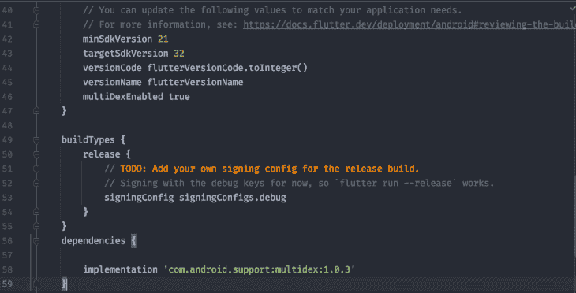
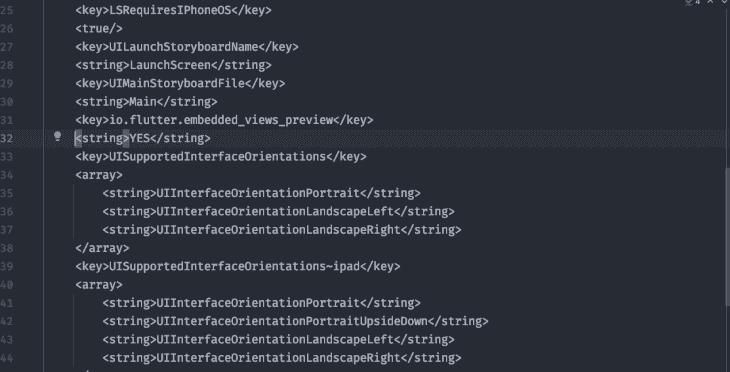
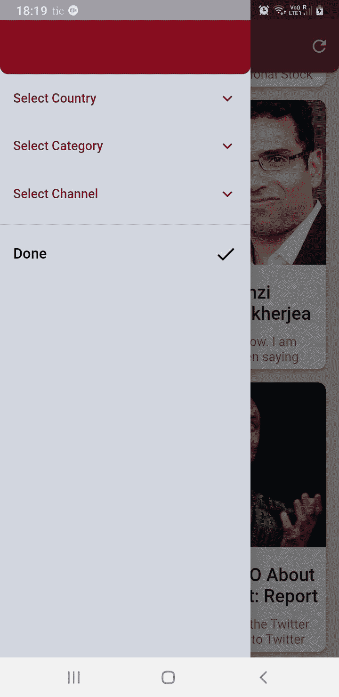
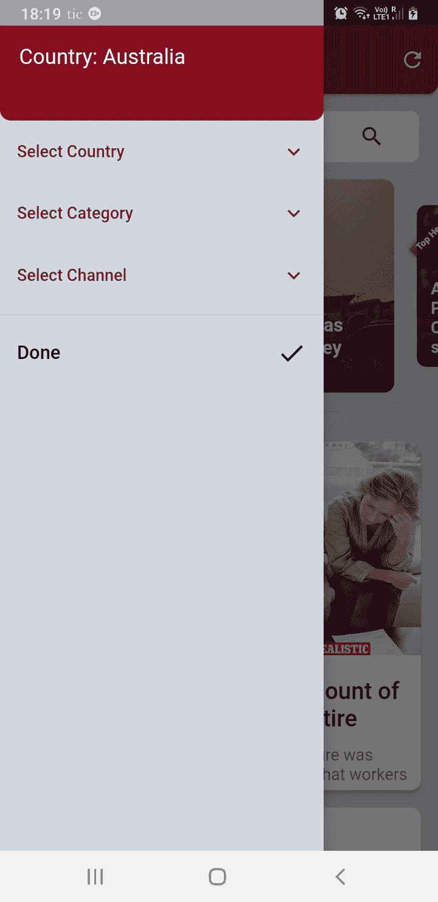
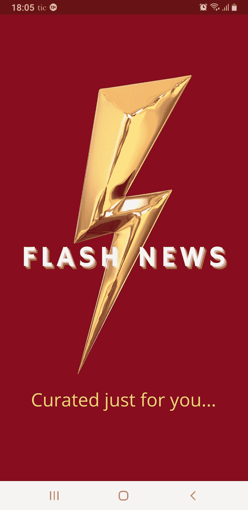

# 用 Flutter - LogRocket Blog 构建新闻应用

> 原文：<https://blog.logrocket.com/building-news-app-flutter/>

你是那种喜欢坐在早餐桌旁一边喝茶或喝咖啡一边看晨报的人吗？嗯，我是那种喜欢早上第一件事就是看新闻来了解最新消息的人。

为什么不开发一个应用程序，为我们自己提供最新的精选新闻呢？让我们应用我们的 Flutter 知识来创建我们自己的新闻应用程序。以下是我们创建应用程序和提高颤振技能的步骤:

1.  1.  [演示应用简介](#introduction-to-the-demo-application)
    2.  [设置依赖关系](#setting-up-dependencies)
    3.  [为 Android 和 iOS 配置 WebView】](#configuring-webview-for-android-and-ios)
    4.  [获取新闻 API 密钥](#acquiring-the-news-api-key)
    5.  [编写模型类](#writing-the-model-classes)
    6.  [用 GetX 控制器类获取数据](#fetching-data-with-the-getx-controller-class)
    7.  [创建新闻卡片小工具](#creating-a-newscard-widget)
    8.  [添加搜索栏小工具](#adding-a-search-bar-widget)
    9.  [添加旋转木马小工具](#adding-a-carousel-widget)
    10.  [添加侧抽屉小工具](#adding-a-side-drawer-widget)
    11.  [完成我们的主屏幕](#completing-our-home-screen)

请继续阅读，看看我们的最终产品会是什么样子。

## 演示应用程序简介

我们正在构建一个单屏幕应用，在屏幕顶部有一个搜索栏；一个旋转木马小部件，显示来自世界各地的头条新闻；以及当用户从侧面抽屉中选择时，基于**国家**、**类别**或**频道**的新闻列表。

运行应用程序时，置顶标题的默认**国家**设置为**印度**，默认**类别**设置为**商业**。


我们将使用来自 NewsAPI.org 的 API 密匙。你也可以使用来自 [MediaStack](https://mediastack.com/) 和 [NewsData](https://newsdata.io/) 的 API，因为我们可以在开发者模式下查询有限数量的新闻文章。新闻 API 每天允许大约 100 个查询。相反，MediaStack 一个月允许 500 次查询，NewsData 一天允许 200 次查询。您可以随时注册不同的帐户来测试您的应用程序。除了惟一的 API 键之外，一切都将保持不变。

牢记这一点，让我们开始建设。

## 设置相关性

在您的`pubspec.yaml`文件中，请添加以下依赖项:

*   http: ^0.13.4 —一个用于发出 http 请求的可组合的、基于未来的库。使用这个包，我们将查询来自 NewsApi.org[的新闻文章](https://newsapi.org/)
*   [webview_flutter: ^3.0.4](https://pub.dev/packages/webview_flutter) —一个在 Android 和 iOS 上提供 webview 小工具的 flutter 插件。有了这个软件包，用户可以阅读整篇新闻文章
*   [carousel_slider: ^4.1.1](https://pub.dev/packages/carousel_slider) —一个支持无限滚动和自定义子部件的 carousel slider 部件。我们使用这个包来显示最新的标题，将自动水平滚动
*   [get: ^4.6.5](https://pub.dev/packages/get) —我们的状态管理解决方案。我已经谈到了使用 [GetX 作为 Flutter 的状态管理解决方案](https://blog.logrocket.com/ultimate-guide-getx-state-management-flutter/)的优势；它实现起来既快又容易，尤其是当开发人员正在构建原型时

## 为 Android 和 iOS 配置 WebView

由于我们使用 WebView 包来显示整篇新闻文章，我们必须对`Runner`文件夹中的 Android app/ `build.gradle`文件和 iOS `info.plist`文件做一些更改。

### 适用于 Android

你至少要把`minSdkVersion`改成`19`。此外，添加对 Android 依赖的`multiDex`支持。请看下图，以供参考:



### 适用于 iOS

在`Runner`文件夹中，您必须添加这一行，以便在 iOS 设备上运行时支持 Flutter 的嵌入式视图:

```
<key>io.flutter.embedded_views_preview</key>
   <string>YES</string>
```

请看下图，以供参考:



我们的依赖项是为新闻应用程序设置的。现在，让我们在 NewsApi.org 上注册，并获得我们独特的 API 密钥。

## 获取新闻 API 密钥

去 NewsAPI.org 用你的电子邮件 ID 和密码注册。一旦您注册，它将为您自己生成一个唯一的 API 密钥，我们将使用它来请求新闻文章。将该键作为常量保存在 Flutter 项目中。

### 端点

要使用这个 API，我们需要理解什么是端点。端点是 API 允许软件或程序相互通信的一个独特的点。

需要注意的是，端点和 API 不是一回事。端点是 API 的一个组件，而 API 是一组允许两个软件共享资源以相互通信的规则。端点是这些资源的位置，API 使用 URL 来检索请求的响应。

#### 新闻 API 的主要端点

1.  **[https://newsapi.org/v2/everything](https://newsapi.org/v2/everything)？**(这将搜索 80，000 多个不同来源发布的每篇文章)
2.  **[https://newsapi.org/v2/top-headlines](https://newsapi.org/v2/top-headlines)？**(根据国家和类别返回突发新闻标题)
3.  还有一个次要端点，主要返回特定发布者的新闻(例如:BBC，ABC)**[https://newsapi.org/v2/top-headlines/sources](https://newsapi.org/v2/top-headlines/sources)？**

对于上述端点，我们必须提供 API 密钥，通过它来处理身份验证。如果 API 键没有附加在 URL 的末尾，我们必然会收到一个`401 - Unauthorized HTTP error`。

因此，URL 看起来会像这样:

**[https://newsapi.org/v2/everything?q=keyword&API key = API key](https://newsapi.org/v2/everything?q=keyword&apiKey=APIKEY)**

上面的 URL 将返回一个类似如下的 JSON 响应:

```
{
"status": "ok",
"totalResults": 9364,
-
"articles": [
-
{
-
"source": {
"id": "the-verge",
"name": "The Verge"
},
"author": "Justine Calma",
"title": "Texas heatwave and energy crunch curtails Bitcoin mining",
"description": "Bitcoin miners in Texas powered down to respond to an energy crunch triggered by a punishing heatwave. Energy demand from cryptomining is growing in the state.",
"url": "https://www.theverge.com/2022/7/12/23205066/texas-heat-curtails-bitcoin-mining-energy-demand-electricity-grid",
"urlToImage": "https://cdn.vox-cdn.com/thumbor/sP9sPjh-2PfK76HRsOfHNYNQWAo=/0x285:4048x2404/fit-in/1200x630/cdn.vox-cdn.com/uploads/chorus_asset/file/23761862/1235927096.jpg",
"publishedAt": "2022-07-12T15:50:17Z",
"content": "Miners voluntarily powered down as energy demand and prices spiked \r\nAn aerial view of the Whinstone US Bitcoin mining facility in Rockdale, Texas, on October 9th, 2021\. The long sheds at North Ameri... [+3770 chars]"
},
```

理解以上内容后，我们现在将开始编程我们的应用程序，从模型类开始，然后是 GetX `Controller`类。

## 编写模型类

我们有 3 个示范班。

1.  `ArticleModel`

    ```
    class ArticleModel {  ArticleModel(this.source, this.author, this.title, this.description, this.url,      this.urlToImage, this.publishedAt, this.content);   String? author, description, urlToImage, content;  String title, url, publishedAt;  SourceModel source;   Map<String, dynamic> toJson() {    return {      'author': author,      'description': description,      'urlToImage': urlToImage,      'content': content,      'title': title,      'url': url,      'publishedAt': publishedAt,      'source': source,    };  }   factory ArticleModel.fromJson(Map<String, dynamic> json) => ArticleModel(        SourceModel.fromJson(json['source'] as Map<String, dynamic>),        json['author'],        json['title'],        json['description'],        json['url'],        json['urlToImage'],        json['publishedAt'],        json['content'],      ); }
    ```

2.  `NewsModel`

    ```
    class NewsModel {  NewsModel(this.status, this.totalResults, this.articles);   String status;  int totalResults;  List<ArticleModel> articles;   Map<String, dynamic> toJson() {    return {      'status': status,      'totalResults': totalResults,      'articles': articles,    };  }   factory NewsModel.fromJson(Map<String, dynamic> json) => NewsModel(        json['status'],        json['totalResults'],        (json['articles'] as List<dynamic>)            .map((e) => ArticleModel.fromJson(e as Map<String, dynamic>))            .toList(),      ); }
    ```

3.  `SourceModel`

    ```
    class SourceModel {  SourceModel({this.id = '', required this.name});   String? id, name;   Map<String, dynamic> toJson() {    return {      'id': id,      'name': name,    };  }   factory SourceModel.fromJson(Map<String, dynamic> json) {    return SourceModel(      id: json['id'],      name: json['name'],    );  } }
    ```

如果您查看上面的示例 JSON 响应，模型类就是基于它的。模型类中的变量名应该与 JSON 响应中的字段相匹配。

## 使用 GetX `Controller`类获取数据

这里我们将定义所有的变量、方法和函数来检索三种类型的新闻文章，它们是:

1.  头条新闻
2.  根据国家、类别和频道的新闻
3.  搜索新闻

从定义和初始化变量开始:

```
// for list view
List<ArticleModel> allNews = <ArticleModel>[];
// for carousel
List<ArticleModel> breakingNews = <ArticleModel>[];
ScrollController scrollController = ScrollController();
RxBool articleNotFound = false.obs;
RxBool isLoading = false.obs;
RxString cName = ''.obs;
RxString country = ''.obs;
RxString category = ''.obs;
RxString channel = ''.obs;
RxString searchNews = ''.obs;
RxInt pageNum = 1.obs;
RxInt pageSize = 10.obs;
String baseUrl = "https://newsapi.org/v2/top-headlines?"; // ENDPOINT
```

下一步是一个 API 函数，从 News API 中检索所有新闻文章的 JSON 对象。使用 HTTP 响应方法，我们从 URL 获取数据，并将 JSON 对象解码成可读的格式。然后我们检查响应状态。

如果响应代码为`200`，则表示状态正常。如果响应有一些数据，它将被加载到列表中，最终显示在 UI 中。这是检索所有新闻的函数:

```
// function to retrieve a JSON response for all news from newsApi.org
getAllNewsFromApi(url) async {
 //Creates a new Uri object by parsing a URI string.
 http.Response res = await http.get(Uri.parse(url));

 if (res.statusCode == 200) {
   //Parses the string and returns the resulting Json object.
   NewsModel newsData = NewsModel.fromJson(jsonDecode(res.body));

   if (newsData.articles.isEmpty && newsData.totalResults == 0) {
     articleNotFound.value = isLoading.value == true ? false : true;
     isLoading.value = false;
     update();
   } else {
     if (isLoading.value == true) {
       // combining two list instances with spread operator
       allNews = [...allNews, ...newsData.articles];
       update();
     } else {
       if (newsData.articles.isNotEmpty) {
         allNews = newsData.articles;
         // list scrolls back to the start of the screen
         if (scrollController.hasClients) scrollController.jumpTo(0.0);
         update();
       }
     }
     articleNotFound.value = false;
     isLoading.value = false;
     update();
   }
 } else {
   articleNotFound.value = true;
   update();
 }
}
```

这里有一个检索突发新闻的功能:

```
// function to retrieve a JSON response for breaking news from newsApi.org
getBreakingNewsFromApi(url) async {
 http.Response res = await http.get(Uri.parse(url));

 if (res.statusCode == 200) {
   NewsModel newsData = NewsModel.fromJson(jsonDecode(res.body));

   if (newsData.articles.isEmpty && newsData.totalResults == 0) {
     articleNotFound.value = isLoading.value == true ? false : true;
     isLoading.value = false;
     update();
   } else {
     if (isLoading.value == true) {
       // combining two list instances with spread operator
       breakingNews = [...breakingNews, ...newsData.articles];
       update();
     } else {
       if (newsData.articles.isNotEmpty) {
         breakingNews = newsData.articles;
         if (scrollController.hasClients) scrollController.jumpTo(0.0);
         update();
       }
     }
     articleNotFound.value = false;
     isLoading.value = false;
     update();
   }
 } else {
   articleNotFound.value = true;
   update();
 }
}
```

接下来，我们添加函数来与我们之前讨论的端点进行通信，并从 API 接收定制的响应。我们需要将一个 URL 字符串传递给上面的函数，我们将在下面的函数中调用它。

要根据搜索关键字获取所有新闻和新闻:

```
// function to load and display all news and searched news on to UI
getAllNews({channel = '', searchKey = '', reload = false}) async {
 articleNotFound.value = false;

 if (!reload && isLoading.value == false) {
 } else {
   country.value = '';
   category.value = '';
 }
 if (isLoading.value == true) {
   pageNum++;
 } else {
   allNews = [];

   pageNum.value = 2;
 }
 // ENDPOINT
 baseUrl = "https://newsapi.org/v2/top-headlines?pageSize=10&page=$pageNum&";
 // default country is set to India
 baseUrl += country.isEmpty ? 'country=in&' : 'country=$country&';
 // default category is set to Business
 baseUrl += category.isEmpty ? 'category=business&' : 'category=$category&';
 baseUrl += 'apiKey=${NewsApiConstants.newsApiKey}';
 // when a user selects a channel the country and category will become null 
 if (channel != '') {
   country.value = '';
   category.value = '';
   baseUrl =
       "https://newsapi.org/v2/top-headlines?sources=$channel&apiKey=${NewsApiConstants.newsApiKey}";
 }
 // when a enters any keyword the country and category will become null
 if (searchKey != '') {
   country.value = '';
   category.value = '';
   baseUrl =
       "https://newsapi.org/v2/everything?q=$searchKey&from=2022-07-01&sortBy=popularity&pageSize=10&apiKey=${NewsApiConstants.newsApiKey}";
 }
 print(baseUrl);
 // calling the API function and passing the URL here
 getAllNewsFromApi(baseUrl);
}
```

要根据用户选择的国家获取突发新闻:

```
// function to load and display breaking news on to UI
getBreakingNews({reload = false}) async {
 articleNotFound.value = false;

 if (!reload && isLoading.value == false) {
 } else {
   country.value = '';
 }
 if (isLoading.value == true) {
   pageNum++;
 } else {
   breakingNews = [];

   pageNum.value = 2;
 }
 // default language is set to English
 /// ENDPOINT
 baseUrl =
     "https://newsapi.org/v2/top-headlines?pageSize=10&page=$pageNum&languages=en&";
 // default country is set to US
 baseUrl += country.isEmpty ? 'country=us&' : 'country=$country&';
 //baseApi += category.isEmpty ? '' : 'category=$category&';
 baseUrl += 'apiKey=${NewsApiConstants.newsApiKey}';
 print([baseUrl]);
 // calling the API function and passing the URL here
 getBreakingNewsFromApi(baseUrl);
}
```

最后，覆盖`onInit`方法并调用上面的两个函数:

```
@override
void onInit() {
 scrollController = ScrollController()..addListener(_scrollListener);
 getAllNews();
 getBreakingNews();
 super.onInit();
}
```

接下来，我们将创建一个自定义小部件，用于显示我们将从 API 获得的新闻文章的图像、标题、描述和 URL。这个小部件将在主屏幕上的 ListView builder 中调用:

```
class NewsCard extends StatelessWidget {
final String imgUrl, title, desc, content, postUrl;

 const NewsCard(
     {Key? key,
     required this.imgUrl,
     required this.desc,
     required this.title,
     required this.content,
     required this.postUrl});

 @override
 Widget build(BuildContext context) {
   return Card(
     elevation: Sizes.dimen_4,
     shape: const RoundedRectangleBorder(
         borderRadius: BorderRadius.all(Radius.circular(Sizes.dimen_10))),
     margin: const EdgeInsets.fromLTRB(
         Sizes.dimen_16, 0, Sizes.dimen_16, Sizes.dimen_16),
     child: Column(
       crossAxisAlignment: CrossAxisAlignment.start,
       mainAxisSize: MainAxisSize.min,
       children: <Widget>[
         ClipRRect(
             borderRadius: const BorderRadius.only(
                 topLeft: Radius.circular(Sizes.dimen_10),
                 topRight: Radius.circular(Sizes.dimen_10)),
             child: Image.network(
               imgUrl,
               height: 200,
               width: MediaQuery.of(context).size.width,
               fit: BoxFit.fill,
              // if the image is null
               errorBuilder: (BuildContext context, Object exception,
                   StackTrace? stackTrace) {
                 return Card(
                   elevation: 0,
                   shape: RoundedRectangleBorder(
                       borderRadius: BorderRadius.circular(Sizes.dimen_10)),
                   child: const SizedBox(
                     height: 200,
                     width: double.infinity,
                     child: Icon(Icons.broken_image_outlined),
                   ),
                 );
               },
             )),
         vertical15,
         Padding(
           padding: const EdgeInsets.all(Sizes.dimen_6),
           child: Text(
             title,
             maxLines: 2,
             style: const TextStyle(
                 color: Colors.black87,
                 fontSize: Sizes.dimen_20,
                 fontWeight: FontWeight.w500),
           ),
         ),
         Padding(
           padding: const EdgeInsets.all(Sizes.dimen_6),
           child: Text(
             desc,
             maxLines: 2,
             style: const TextStyle(color: Colors.black54, fontSize: Sizes.dimen_14),
           ),
         )
       ],
     ),
   );
 }
}
```

这就是我们的`newsCard`的样子。


您可能会注意到代码中的常量值。我习惯在所有的 Flutter 项目中创建常量文件，用于定义颜色、大小、文本域装饰等。我不会在本文中添加这些文件，但是您可以在 GitHub 资源库中找到它们。

现在我们开始构建我们的主屏幕。在屏幕顶部，我们有我们的搜索文本字段。当用户输入任何关键字时，API 将搜索来自不同来源的数千篇文章，并在 NewsCard 小部件的帮助下显示在屏幕上:

```
Flexible(
 child: Container(
   padding: const EdgeInsets.symmetric(horizontal: Sizes.dimen_8),
   margin: const EdgeInsets.symmetric(
       horizontal: Sizes.dimen_18, vertical: Sizes.dimen_16),
   decoration: BoxDecoration(
       color: Colors.white,
       borderRadius: BorderRadius.circular(Sizes.dimen_8)),
   child: Row(
     mainAxisSize: MainAxisSize.max,
     mainAxisAlignment: MainAxisAlignment.spaceBetween,
     children: [
       Flexible(
         fit: FlexFit.tight,
         flex: 4,
         child: Padding(
           padding: const EdgeInsets.only(left: Sizes.dimen_16),
           child: TextField(
             controller: searchController,
             textInputAction: TextInputAction.search,
             decoration: const InputDecoration(
                 border: InputBorder.none,
                 hintText: "Search News"),
             onChanged: (val) {
               newsController.searchNews.value = val;
               newsController.update();
             },
             onSubmitted: (value) async {
               newsController.searchNews.value = value;
               newsController.getAllNews(
                   searchKey: newsController.searchNews.value);
               searchController.clear();
             },
           ),
         ),
       ),
       Flexible(
         flex: 1,
         fit: FlexFit.tight,
         child: IconButton(
             padding: EdgeInsets.zero,
             color: AppColors.burgundy,
             onPressed: () async {
               newsController.getAllNews(
                   searchKey: newsController.searchNews.value);
               searchController.clear();
             },
             icon: const Icon(Icons.search_sharp)),
       ),
     ],
   ),
 ),
),
```

这是我们的搜索栏的外观。


当用户从侧面抽屉中选择一个国家时，carousel 小部件将显示不同国家的头条新闻或突发新闻。这个小部件用`GetBuilder`包装，这样每当选择一个新的国家和突发新闻需要更新时，它就会被重新构建。

我已经设置了轮播选项来自动播放滑块。它会自动水平滚动，无需用户滚动。Stack 小部件显示新闻的图像，并在其顶部显示新闻的标题。

我还在右上角添加了一个横幅，上面写着**头条**，类似于调试横幅。Stack 小部件再次用`InkWell`包装，在它里面是一个`onTap`函数。当用户点击任何新闻条目时，它将把用户带到 WebView 屏幕，在那里将向读者显示整篇新闻文章:

```
GetBuilder<NewsController>(
   init: NewsController(),
   builder: (controller) {
     return CarouselSlider(
       options: CarouselOptions(
           height: 200, autoPlay: true, enlargeCenterPage: true),
       items: controller.breakingNews.map((instance) {
         return controller.articleNotFound.value
             ? const Center(
                 child: Text("Not Found",
                     style: TextStyle(fontSize: 30)))
             : controller.breakingNews.isEmpty
                 ? const Center(child: CircularProgressIndicator())
                 : Builder(builder: (BuildContext context) {
                     try {
                       return Banner(
                         location: BannerLocation.topStart,
                         message: 'Top Headlines',
                         child: InkWell(
                           onTap: () => Get.to(() =>
                               WebViewNews(newsUrl: instance.url)),
                           child: Stack(children: [
                             ClipRRect(
                               borderRadius:
                                   BorderRadius.circular(10),
                               child: Image.network(
                                 instance.urlToImage ?? " ",
                                 fit: BoxFit.fill,
                                 height: double.infinity,
                                 width: double.infinity,
                                // if the image is null
                                 errorBuilder:
                                     (BuildContext context,
                                         Object exception,
                                         StackTrace? stackTrace) {
                                   return Card(
                                     shape: RoundedRectangleBorder(
                                         borderRadius:
                                             BorderRadius.circular(
                                                 10)),
                                     child: const SizedBox(
                                       height: 200,
                                       width: double.infinity,
                                       child: Icon(Icons
                                           .broken_image_outlined),
                                     ),
                                   );
                                 },
                               ),
                             ),
                             Positioned(
                                 left: 0,
                                 right: 0,
                                 bottom: 0,
                                 child: Container(
                                   decoration: BoxDecoration(
                                       borderRadius:
                                           BorderRadius.circular(
                                               10),
                                       gradient: LinearGradient(
                                           colors: [
                                             Colors.black12
                                                 .withOpacity(0),
                                             Colors.black
                                           ],
                                           begin:
                                               Alignment.topCenter,
                                           end: Alignment
                                               .bottomCenter)),
                                   child: Container(
                                       padding: const EdgeInsets
                                               .symmetric(
                                           horizontal: 5,
                                           vertical: 10),
                                       child: Container(
                                           margin: const EdgeInsets
                                                   .symmetric(
                                               horizontal: 10),
                                           child: Text(
                                             instance.title,
                                             style: const TextStyle(
                                                 fontSize: Sizes
                                                     .dimen_16,
                                                 color:
                                                     Colors.white,
                                                 fontWeight:
                                                     FontWeight
                                                         .bold),
                                           ))),
                                 )),
                           ]),
                         ),
                       );
                     } catch (e) {
                       if (kDebugMode) {
                         print(e);
                       }
                       return Container();
                     }
                   });
       }).toList(),
     );
   }),
```

这就是我们的旋转木马的样子。


抽屉控件有三个下拉框，用于选择**国家**、**类别**或**频道**。所有这些主要转化为我们已经讨论过的资源。它是新 API 提供的一个次要端点，用于定制文章的检索。

当您在下拉框中选择以上任何一项时，用户的选择将显示在侧边抽屉中，国家名称将显示在`NewsCard`列表项目上方。这个特性是专门为原型开发添加的，因此作为开发人员，我们知道 API 会根据代码返回一个响应:

```
Drawer sideDrawer(NewsController newsController) {
 return Drawer(
   backgroundColor: AppColors.lightGrey,
   child: ListView(
     children: <Widget>[
       GetBuilder<NewsController>(
         builder: (controller) {
           return Container(
             decoration: const BoxDecoration(
                 color: AppColors.burgundy,
                 borderRadius: BorderRadius.only(
                   bottomLeft: Radius.circular(Sizes.dimen_10),
                   bottomRight: Radius.circular(Sizes.dimen_10),
                 )),
             padding: const EdgeInsets.symmetric(
                 horizontal: Sizes.dimen_18, vertical: Sizes.dimen_18),
             child: Column(
               crossAxisAlignment: CrossAxisAlignment.start,
               children: [
                 controller.cName.isNotEmpty
                     ? Text(
                         "Country: ${controller.cName.value.capitalizeFirst}",
                         style: const TextStyle(
                             color: AppColors.white, fontSize: Sizes.dimen_18),
                       )
                     : const SizedBox.shrink(),
                 vertical15,
                 controller.category.isNotEmpty
                     ? Text(
                         "Category: ${controller.category.value.capitalizeFirst}",
                         style: const TextStyle(
                             color: AppColors.white, fontSize: Sizes.dimen_18),
                       )
                     : const SizedBox.shrink(),
                 vertical15,
                 controller.channel.isNotEmpty
                     ? Text(
                         "Category: ${controller.channel.value.capitalizeFirst}",
                         style: const TextStyle(
                             color: AppColors.white, fontSize: Sizes.dimen_18),
                       )
                     : const SizedBox.shrink(),
               ],
             ),
           );
         },
         init: NewsController(),
       ),
    /// For Selecting the Country
          ExpansionTile(
         collapsedTextColor: AppColors.burgundy,
         collapsedIconColor: AppColors.burgundy,
         iconColor: AppColors.burgundy,
         textColor: AppColors.burgundy,
         title: const Text("Select Country"),
         children: <Widget>[
           for (int i = 0; i < listOfCountry.length; i++)
             drawerDropDown(
               onCalled: () {
                 newsController.country.value = listOfCountry[i]['code']!;
                 newsController.cName.value =
                     listOfCountry[i]['name']!.toUpperCase();
                 newsController.getAllNews();
                 newsController.getBreakingNews();

               },
               name: listOfCountry[i]['name']!.toUpperCase(),
             ),
         ],
       ),
      /// For Selecting the Category
       ExpansionTile(
         collapsedTextColor: AppColors.burgundy,
         collapsedIconColor: AppColors.burgundy,
         iconColor: AppColors.burgundy,
         textColor: AppColors.burgundy,
         title: const Text("Select Category"),
         children: [
           for (int i = 0; i < listOfCategory.length; i++)
             drawerDropDown(
                 onCalled: () {
                   newsController.category.value = listOfCategory[i]['code']!;
                   newsController.getAllNews();

                 },
                 name: listOfCategory[i]['name']!.toUpperCase())
         ],
       ),
      /// For Selecting the Channel
       ExpansionTile(
         collapsedTextColor: AppColors.burgundy,
         collapsedIconColor: AppColors.burgundy,
         iconColor: AppColors.burgundy,
         textColor: AppColors.burgundy,
         title: const Text("Select Channel"),
         children: [
           for (int i = 0; i < listOfNewsChannel.length; i++)
             drawerDropDown(
               onCalled: () {
                 newsController.channel.value = listOfNewsChannel[i]['code']!;
                 newsController.getAllNews(
                     channel: listOfNewsChannel[i]['code']);

               },
               name: listOfNewsChannel[i]['name']!.toUpperCase(),
             ),
         ],
       ),
       const Divider(),
       ListTile(
           trailing: const Icon(
             Icons.done_sharp,
             size: Sizes.dimen_28,
             color: Colors.black,
           ),
           title: const Text(
             "Done",
             style: TextStyle(fontSize: Sizes.dimen_16, color: Colors.black),
           ),
           onTap: () => Get.back()),
     ],
   ),
 );
}
```

这就是我们的`sideDrawer`的样子。





## 完成我们的主屏幕

接下来，我们将前面创建的`NewsCard`小部件添加到 carousel 小部件下面，它根据用户从侧面抽屉中的选择显示所有其他新闻。如果用户在搜索文本字段中输入搜索关键字，新闻文章将显示在这里。

请注意，轮播小工具仅显示所选国家的头条新闻和突发新闻；它不会根据类别或频道进行过滤。如果用户选择一个类别或频道，轮播窗口小部件将不会得到更新；只有`NewsCard`小部件会被更新。但是当用户选择一个新的国家时，carousel 小部件会随着`NewsCard`小部件一起更新。

同样，`NewsCard`小部件由 GetX `Builder`和`InkWell`小部件包装:

```
GetBuilder<NewsController>(
   init: NewsController(),
   builder: (controller) {
     return controller.articleNotFound.value
         ? const Center(
             child: Text('Nothing Found'),
           )
         : controller.allNews.isEmpty
             ? const Center(child: CircularProgressIndicator())
             : ListView.builder(
                 controller: controller.scrollController,
                 physics: const NeverScrollableScrollPhysics(),
                 shrinkWrap: true,
                 itemCount: controller.allNews.length,
                 itemBuilder: (context, index) {
                   index == controller.allNews.length - 1 &&
                           controller.isLoading.isTrue
                       ? const Center(
                           child: CircularProgressIndicator(),
                         )
                       : const SizedBox();
                   return InkWell(
                     onTap: () => Get.to(() => WebViewNews(
                         newsUrl: controller.allNews[index].url)),
                     child: NewsCard(
                         imgUrl: controller
                                 .allNews[index].urlToImage ??
                             '',
                         desc: controller
                                 .allNews[index].description ??
                             '',
                         title: controller.allNews[index].title,
                         content:
                             controller.allNews[index].content ??
                                 '',
                         postUrl: controller.allNews[index].url),
                   );
                 });
   }),
```

`SingleChildScrollView`是主屏幕的父窗口小部件，作为`Scaffold`的主体。`appBar`有一个刷新按钮，可以清除所有的过滤器并将应用程序默认为初始状态。


## 添加 WebView 屏幕

WebView 屏幕是一个有状态的小部件，当用户单击转盘或新闻卡片中的任何新闻条目时，它会显示整篇文章。

这里，我们必须用一个`Completer`类初始化一个`WebViewController`。一个`Completer`类是一种产生`Future`对象并在以后用一个值或一个错误完成它们的方法。`Scaffold`体有直接通过的`WebView`级。该屏幕上没有`appBar`，因此不会妨碍读者阅读整篇文章:

```
class WebViewNews extends StatefulWidget {
 final String newsUrl;
 WebViewNews({Key? key, required this.newsUrl}) : super(key: key);

 @override
 State<WebViewNews> createState() => _WebViewNewsState();
}

class _WebViewNewsState extends State<WebViewNews> {
 NewsController newsController = NewsController();

 final Completer<WebViewController> controller =
     Completer<WebViewController>();

 @override
 Widget build(BuildContext context) {
   return Scaffold(
       body: WebView(
     initialUrl: widget.newsUrl,
     javascriptMode: JavascriptMode.unrestricted,
     onWebViewCreated: (WebViewController webViewController) {
       setState(() {
         controller.complete(webViewController);
       });
     },
   ));
 }
}
```


## 制作闪屏

我将我的应用程序命名为 Flash⚡News，并在 Canva 中设计了我的闪屏图像。启动页面弹出三秒钟，然后用户被转移到主屏幕。闪屏很容易实现，我建议所有的应用程序都应该有一个简短的介绍。



```
class SplashScreen extends StatefulWidget {
 const SplashScreen({Key? key}) : super(key: key);

 @override
 State<SplashScreen> createState() => _SplashScreenState();
}

class _SplashScreenState extends State<SplashScreen> {
 @override
 void initState() {
   super.initState();

   Timer(const Duration(seconds: 3), () {
     //navigate to home screen replacing the view
     Get.offAndToNamed('/homePage');
   });
 }

 @override
 Widget build(BuildContext context) {
   return Scaffold(
     backgroundColor: AppColors.burgundy,
     body: Center(child: Image.asset('assets/flashNews.jpg')),
   );
 }
}
```

仅此而已！我们已经完成了申请。还有一些我之前提到的 Dart 文件，你可以在下面的 GitHub 链接中找到。

我试图保持用户界面整洁。整个焦点是放在用户容易找到和阅读的新闻文章上。API 一次返回一百多篇文章；如果您仔细观察代码，我们只显示了其中的几页。同样，我们被允许进行有限数量的查询，一次加载几篇文章会更快。

希望这能让您了解如何实现 JSON 端点之间的交互，从 API 获取数据，并在屏幕上显示这些数据。

谢谢大家！

链接到 Github 库:[快讯](https://github.com/timelessfusionapps/flash_news_getx)。

## 使用 [LogRocket](https://lp.logrocket.com/blg/signup) 消除传统错误报告的干扰

[](https://lp.logrocket.com/blg/signup)

[LogRocket](https://lp.logrocket.com/blg/signup) 是一个数字体验分析解决方案，它可以保护您免受数百个假阳性错误警报的影响，只针对几个真正重要的项目。LogRocket 会告诉您应用程序中实际影响用户的最具影响力的 bug 和 UX 问题。

然后，使用具有深层技术遥测的会话重放来确切地查看用户看到了什么以及是什么导致了问题，就像你在他们身后看一样。

LogRocket 自动聚合客户端错误、JS 异常、前端性能指标和用户交互。然后 LogRocket 使用机器学习来告诉你哪些问题正在影响大多数用户，并提供你需要修复它的上下文。

关注重要的 bug—[今天就试试 LogRocket】。](https://lp.logrocket.com/blg/signup-issue-free)