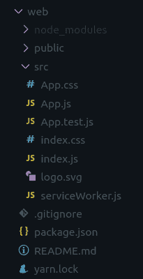
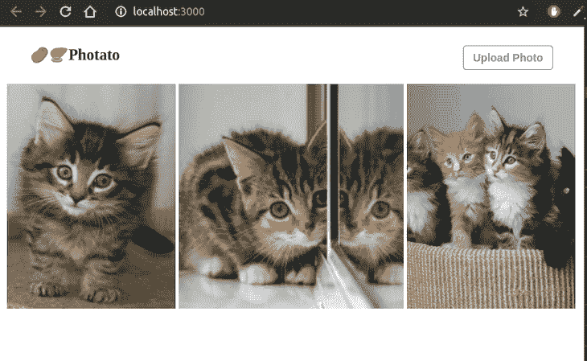
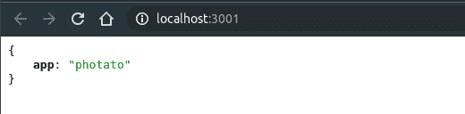
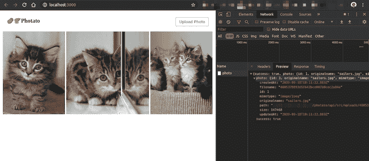
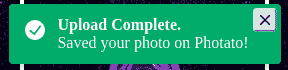
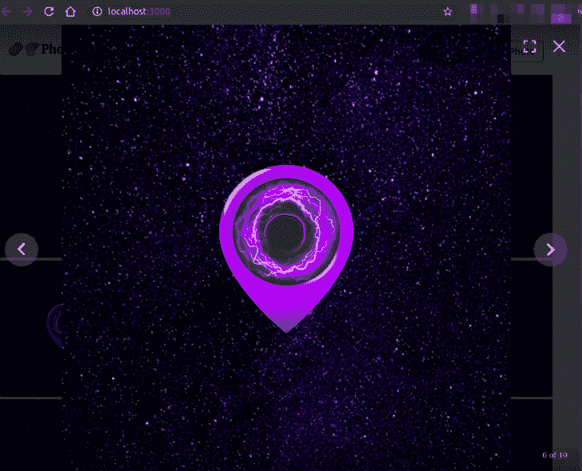

# 使用 Chakra UI 从头开始构建照片库应用程序

> 原文：<https://blog.logrocket.com/building-photo-gallery-app-from-scratch-chakra-ui/>

React 现在是世界上最成熟的前端框架之一，Express.js 是它在后端/服务器框架中的对手。如果你现在正在开发一个应用程序，你不可能找到比这更好的组合了。在这篇文章中，我将带领你使用这两个框架构建一个完整的应用程序，再加上用于组件样式的 Chakra UI。

在我们开始之前，对于像我这样的病人，这里是 GitHub 的完整代码库。你可以随意克隆它，带它去兜风。

## 这是给我的邮件吗？

作为一名自学成才的全栈开发人员，我总是在网上搜索博客帖子/教程，从头开始构建整个应用程序，并演示一个或几个现实生活中常见的应用程序功能。这种帖子有助于开发人员获得广泛的技能和经验。

新手学习如何把最近学的新概念粘在一起，变成一个完整可用的 app。具有中级知识水平的开发人员可以学习如何在构建全栈应用程序时组织、构建和应用最佳实践。

因此，如果你刚刚进入 JS 生态系统——或者如果你已经开发了一两个应用程序，但有时对自己的做法是否正确感到困惑——这篇文章就是为你准备的。

话虽如此，要一口气阅读并完成本教程，您需要具备:

*   对基本的 JS 概念有清晰的理解，并对 ES6 语法有所熟悉
*   至少用过一次 React，并对状态、组件、渲染等常见概念有所了解。
*   熟悉 REST APIs 的概念
*   使用关系数据库
*   将 Node.js 和 Express.js 用于 web 服务器应用程序
*   在您的机器上建立一个工作的 JS 生态系统，即 npm、Node.js 等的最新版本。安装

如果你发现自己缺少以上任何一项，不要担心！网络上有大量的内容可以帮助你开始准备这篇文章。

请注意，我的主要操作系统是 Ubuntu，所以这篇文章中的所有命令都假设你有一个*nix 系统。

## 奠定基础

在开始任何新项目之前，很容易变得不耐烦并立即开始编写代码。然而，首先规划出你的功能和工作流程总是一个好主意——至少我总是这么做。因此，让我们为我们的应用程序如何工作制定一个计划。

我们的应用程序将有两个主要部分。一个是客户端 React 应用程序，让我通过浏览器上传照片。上传的照片会显示在图库视图中。

另一部分是服务器端 API，它接收照片上传，将其存储在某个地方，并让我们查询和显示所有上传的照片。

然而，在所有的编程废话之前，让我们给我们的应用程序起一个吸引人的名字。我把它叫做 *photato* ，但是你可以随意给它取一个更好的名字，并且让我知道你想到了什么。🙂

好了，该编码了。让我们首先为我们的应用程序创建容器文件夹:

```
mkdir photato && cd $_
mkdir web
mkdir api
```

我们将从创建前端 React 应用程序开始。React 附带了一个方便的工具，可以让您快速启动 React 应用程序:

```
cd web
npx create-react-app web
```

现在你应该在`web/`文件夹中有一堆文件和文件夹，输出会告诉你进入目录并运行`yarn start`，你可以在`[http://localhost:3000](http://localhost:3000)`使用你的应用。



如果你以前建立过网站/网络应用程序，你可能熟悉用原始的 HTML 和 CSS 建立用户界面的困难。像 Bootstrap、Semantic UI、Material Kit 等无数的 UI 库，长期以来一直是无法产生“dribbble 名家”品质设计的全栈 dev 的救星。

在这篇文章中，我们将远离上面提到的更常见的传统 UI 库，使用 [Chakra UI](https://chakra-ui.com/) ，它是在实用优先的 CSS 框架 [Tailwind CSS](https://tailwindcss.com/) 上构建的，考虑了可访问性。

按照 Chakra UI 入门指南，在 React 应用程序的根目录下运行以下命令:

```
yarn add @chakra-ui/core @emotion/core @emotion/styled emotion-theming
```

Chakra UI 允许你通过主题化非常容易地定制它的外观和感觉，但是对于这篇文章，我们将坚持它的默认风格。

在我们开始编码之前，我们需要做的最后一件事是增加一个库来获得一个[漂亮的图库](https://github.com/neptunian/react-photo-gallery):

```
yarn add react-photo-gallery
```

我们的应用程序的代码将被封装在`src/`目录中，所以让我们来看看。create-react-app 给了我们一堆文件，在 Chakra UI 的帮助下，我们基本上可以去掉所有 CSS 的东西。删除`App.css`、`index.css`和`logo.svg`文件:

```
cd src
rm -r App.css index.css logo.svg
```

这给了我们一个干净的基础来开始建设。现在让我们来看看服务器 API 应用程序的设置。导航回`api/`文件夹，通过运行以下命令创建一个新文件:

```
cd ../../api
touch package.json
```

现在将以下代码复制并粘贴到`package.json`文件中:

```
{
  "name": "api",
  "version": "1.0.0",
  "description": "Server api for photato",
  "main": "dist",
  "author": "Foysal Ahamed",
  "license": "ISC",
  "entry": "src/index.js",
  "scripts": {
    "dev": "NODE_ENV=development nodemon src/index.js --exec babel-node",
    "start": "node dist",
    "build": "./node_modules/.bin/babel src --out-dir dist --copy-files",
    "prestart": "npm run -s build"
  },
  "eslintConfig": {
    "extends": "eslint:recommended",
    "parserOptions": {
      "ecmaVersion": 7,
      "sourceType": "module"
    },
    "env": {
      "node": true
    },
    "rules": {
      "no-console": 0,
      "no-unused-vars": 1
    }
  },
  "dependencies": {
    "cors": "^2.8.4",
    "express": "^4.13.3",
    "mysql2": "^1.6.1",
    "sequelize": "^5.18.4"
  },
  "devDependencies": {
    "@babel/cli": "^7.1.2",
    "@babel/core": "^7.1.2",
    "@babel/node": "^7.0.0",
    "@babel/plugin-proposal-class-properties": "^7.1.0",
    "@babel/preset-env": "^7.1.0",
    "eslint": "^3.1.1",
    "eslint-config-airbnb": "^17.1.0",
    "eslint-plugin-jsx-a11y": "^6.2.1",
    "nodemon": "^1.9.2"
  }
}
```

请注意，我们有相当多的开发依赖项，它们是使用最新的 ES6 语法编写我们的应用程序所必需的。

巴别塔是一个宏伟的工具，充满了精彩的功能，但对于我们的目的，你需要知道它几乎一无所知。在我们的例子中，我们只需要在`package.json`文件旁边创建一个`.babelrc`文件，并将以下配置放入其中:

```
{
    "presets": [[
        "@babel/preset-env",
        {
            "targets": {
                "node": "current"
            }
        }
    ]],
    "plugins": [
        "@babel/plugin-proposal-class-properties"
    ]
}
```

还有一些其他的依赖项，比如 [Express](https://expressjs.com/) 和 [Sequelize](https://sequelize.org/) ，我们稍后会看到它们的用法。这就是我们的服务器应用程序需要的所有设置，但是在我们继续之前，让我们通过在`api/`文件夹的根目录中运行`npm install`命令来安装所有的包。该命令将生成一个`node_modules/`文件夹和一个`package.lock.json`文件。

## 带有 Chakra UI 和 React 的照片库

我们将从`App.js`文件开始。让我们清理生成的代码，并用下面的代码填充它:

```
import React from 'react';
import { ThemeProvider } from '@chakra-ui/core';

import AppContainer from './app.container';

function App() {
    return (
        <div>
            <ThemeProvider>
                <AppContainer />
            </ThemeProvider>
        </div>
    );
}

export default App;
```

这简化了我们的入口组件，并将实际的逻辑委托给另一个名为`AppContainer`的容器，该容器被包装在 Chakra UI 的`ThemeProvider`中。`ThemeProvider`组件确保它的所有子组件都可以被设计成查克拉 UI 主题或者任何你想要传递给它的自定义主题。

这样一来，我们就再也不用碰`App.js`了。让我们创建新文件`touch src/app.container.js`，并用以下代码填充它:

```
import React from 'react';
import PhotoGallery from 'react-photo-gallery';

import Header from './header.component';

function AppContainer() {
    const photos = [{
            src: 'http://placekitten.com/200/300',
            width: 3,
            height: 4,
        },
        {
            src: 'http://placekitten.com/200/200',
            width: 1,
            height: 1,
        },
        {
            src: 'http://placekitten.com/300/400',
            width: 3,
            height: 4,
        },
    ];

    return (
        <>
            <Header/>
            <PhotoGallery
                photos={photos}
            />
        </>
    );
}

export default App;

```

该组件呈现另外两个组件，`Header`和`PhotoGallery`，其中`PhotoGallery`由 npm 照片库 lib 提供。注意，我们将包含占位符图像的 photos 数组传递给了`PhotoGallery`组件。我们将在稍后的帖子中回到这个问题，并用我们自己上传的照片替换那些温暖人心的小猫照片。

另一个组件`Header`正在从一个尚不存在的文件中导入，所以让我们创建它:`touch src/header.component.js`。将以下代码放入文件中:

```
import React from 'react';
import { Flex, Button, Text } from '@chakra-ui/core';

function Header ({
    isUploading = false, 
    onPhotoSelect,
}) {
    return (
        <Flex 
            px="4"
            py="4"
            justify="space-between"
        >
            <Text 
                as="div"
                fontSize="xl" 
                fontWeight="bold" 
            >
                <span 
                    role="img" 
                    aria-labelledby="potato"
                >
                    🥔 
                </span> 
                <span 
                    role="img" 
                    aria-labelledby="potato"
                >
                    🍠 
                </span> 
                Photato
            </Text>

            <Flex align="end">
                <Button 
                    size="sm"
                    variant="outline"
                    variantColor="blue"
                    isLoading={isUploading}
                    loadingText="Uploading..."
                >
                    Upload Photo     
                </Button>
            </Flex>
        </Flex>
    );
};

export default Header;
```

如果您遵循了上述所有步骤，浏览器中的应用程序应该会呈现如下内容:



让我们来分析一下目前为止我们所做的事情。

组件`Header`将它的所有子组件包装在一个 Chakra UI `Flex`组件中，该组件使用 CSS 样式`display: flex`呈现一个 HTML `div`元素。作为一个基于实用程序的 CSS 框架，Chakra UI 允许你将各种道具传递给它的组件，使它们符合你的喜好，你会看到这在我们的应用程序中使用。

在我们的包装器`Flex`组件中，`px`和`py`道具(分别)为其提供了良好的水平和垂直填充，`justify="space-between"`道具确保其内部的元素以相等的间距呈现。如果你对 CSS flexbox 不太熟悉，我强烈建议你多了解一下这个神奇的布局工具。

在`Flex`容器中，我们在屏幕的左边有一个`Text`，在屏幕的右边有一个用于上传新照片的`Button`。让我们仔细看看这里的`Button`。

我们用`size="sm"`给它一个更小的尺寸，但是你可以用`lg`、`xs`等等来玩。值来更改大小。`variant="outline"`道具使它成为一个有边框的按钮，而不是填充颜色——说到颜色，`variantColor="blue"`使边框和文本为蓝色。Chakra UI 还有其他几种颜色可供选择，我强烈推荐[仔细阅读](https://chakra-ui.com/color-mode)。

到目前为止，我们一直专注于外观。先说功能性。这个组件是编写干净且易于维护的前端代码的核心原则之一的一个很好的例子。它是一个*哑组件*，只呈现标记，没有逻辑被处理。为了使它起作用，我们从父节点传递道具给它。它需要两个道具:

*   `isUploading`，为布尔值，默认为`false`。这个道具决定了**上传照片**按钮的状态。当它为真时，按钮将进入`loading`状态，给用户一个后台正在上传的反馈。
*   `onPhotoSelect`，是用户选择新照片上传时触发的功能。我们稍后将回头讨论这个问题。

这种编写组件的方式确实有助于您一次规划一小块功能和架构。在没有实现实际逻辑的情况下，我们已经根据我们的应用程序的要求计划好了按钮的工作方式。

我们的前端应用程序现在已经有了一个坚实的功能基础，所以让我们在这里暂停一会儿，开始设置我们的后端。

## 服务器 API

我们的服务器 api 的入口点将是`src/index.js`文件，所以让我们创建它:

```
mkdir src
touch index.js
```

然后将以下代码放入该文件:

```
import http from 'http';
import cors from 'cors';
import express from 'express';
import { Sequelize } from 'sequelize';

const config = {
    port: 3001,
    database: {
        username: "root",
        password: "admin",
        host: "localhost",
        port: "3306",
        dialect: "mysql",
        database: "photato",
    }
};

let app = express();
app.server = http.createServer(app);

// 3rd party middlewares
app.use(cors({}));

// connect to db
const database = new Sequelize(config.database);

database.sync().then(() => {
    app.get('/', (req, res) => {
        res.json({app: 'photato'});
    });

    app.server.listen(config.port, () => {
        console.log(`Started on port ${app.server.address().port}`);
    });
});

export default app;
```

这是一个基本的设置；让我们一个一个的分解。

```
import http from 'http';
import cors from 'cors';
import express from 'express';
import { Sequelize } from 'sequelize';

```

从节点的内置 HTTP 包和通过 npm 安装的其他第三方包中导入必要的模块。

```
const config = {
    port: 3001,
    database: {
        username: "root",
        password: "admin",
        host: "localhost",
        port: "3306",
        dialect: "mysql",
        database: "photato",
    }
};
```

这定义了应用程序可用的数据库和服务器端口的配置。您需要根据您的 MySQL 数据库设置更改数据库密码和用户名。另外，确保在 db 中创建了一个名为`photato`的新数据库模式。

请注意，在生产就绪的应用程序中，您将从 env var 传递配置，而不是硬编码它们。

```
let app = express();
app.server = http.createServer(app);

// 3rd party middlewares
app.use(cors({}));
```

这将初始化 Express 应用程序，并使用 Node 的`http.createServer`方法创建一个服务器实例。Express 允许通过中间件插入各种功能。我们将要使用的一个这样的中间件支持 CORS 对我们的 API 的请求。

目前，我们允许来自任何来源的 CORS 请求，但出于安全目的，您可以添加更细粒度的配置，仅允许来自您的前端应用程序域名的请求。

```
// connect to db
const database = new Sequelize(config.database);

database.sync().then(() => {
    app.get('/', (req, res) => {
        res.json({app: 'photato'});
    });

    app.server.listen(config.port, () => {
        console.log(`Started on port ${app.server.address().port}`);
    });
});
```

这将初始化一个 Sequelize 实例，它根据我们的配置连接到我们的 MySQL 数据库。一旦建立了连接，它就为我们的 API 的`/`端点添加一个处理程序，返回一个 JSON 格式的响应。然后通过配置中指定的服务器端口打开应用程序。

我们现在可以启动我们的应用程序，看看我们到目前为止取得了什么成就。运行`api/`文件夹中的`npm run dev`，然后转到`[http://localhost:3001](http://localhost:3001)`。您应该会看到类似这样的内容:



处理文件上传有很多边缘情况和安全问题，所以从头构建它不是一个好主意。我们将使用一个名为 [Multer](https://github.com/expressjs/multer) 的 npm 包，让它变得超级简单。通过运行`npm i --save multer`来安装该包，然后在`src/index.js`文件中进行以下更改:

```
import http from 'http';
import cors from 'cors';
import multer from 'multer';
import { resolve } from 'path';

//previously written code here

const config = {
    port: 3001,
    uploadDir: `${resolve(__dirname, '..')}/uploads/`,
    database: {
        username: "root",
        password: "admin",
        host: "localhost",
        port: "3306",
        dialect: "mysql",
        database: "photato",
    }
};

//previously written code here

// connect to db
const database = new Sequelize(config.database);

// setup multer
const uploadMiddleware = multer({ 
    dest: config.uploadDir,
    fileFilter: function (req, file, cb) {
        if (!file.originalname.match(/\.(jpg|jpeg|png|gif)$/)) {
            return cb(new Error('Only image files are allowed!'));
        }
        cb(null, true);
    }, 
}).single('photo');

//previously written code here

    app.get('/', (req, res) => {
        res.json({app: 'photato'});
    });

    app.post('/photo', uploadMiddleware, async (req, res) => {
        try {
            const photo = await Photo.create(req.file);
            res.json({success: true, photo});
        } catch (err) {
            res.status(422).json({success: false, message: err.message});
        }
    });

//previously written code here
```

新增内容概述:

*   进口多包
*   添加将存储上传文件的目标目录。现在设定为`api/upload/`，还不存在。因此，让我们也创建文件夹:`mkdir upload`
*   初始化 Multer 中间件，该中间件接受一个带有密钥`photo`的文件，并将该文件保存在指定的文件夹中
*   仅允许通过 Multer 上传图像文件
*   添加一个使用上传中间件的新 POST 请求端点。一旦文件被中间件处理，它就附加文件信息，比如目标路径、大小、mimetype 等等。，传递给传递给下一个处理程序的 Express req 对象。在这种情况下，下一个处理程序*尝试*在数据库中保存文件细节(我们将很快讨论这一点)，如果成功，它将返回一个包含文件细节的 JSON 响应，如果失败，它将返回一个包含错误消息的 JSON 响应

然而，这一行`const photo = await Photo.create(req.file);`需要更多的解释。`ModelName.create(modelData)`是你如何通过 Sequelize 在数据库表中创建新行，在上面的代码中，我们期望一个名为`Photo`的 Sequelize 模型存在，我们还没有创建它。让我们通过运行`touch src/photo.model.js`并将以下代码放入该文件来解决这个问题:

```
import { Model, DataTypes } from 'sequelize';

const PhotoSchema = {
    originalname: {
        type: DataTypes.STRING,
        allowNull: false,
    },
    mimetype: {
        type: DataTypes.STRING,
        allowNull: false,
    },
    size: {
        type: DataTypes.INTEGER,
        allowNull: false,
    },
    filename: {
        type: DataTypes.STRING,
        allowNull: false,
    },
    path: {
        type: DataTypes.STRING,
        allowNull: false,
    },
};

class PhotoModel extends Model {
    static init (sequelize) {
        return super.init(PhotoSchema, { sequelize });
    }
};

export default PhotoModel;
```

这有很多代码，但要点是我们正在创建一个 Sequelize 模型类，它有一个模式定义，其中的字段(表列)都是字符串(在 MySQL 中转换为 VARCHAR ),除了 size 字段，它是一个整数。该模式看起来是这样的，因为在处理上传的文件之后，Multer 提供了确切的数据并将其附加到`req.file`。

回到如何在我们的路由处理器中使用这个模型，我们需要通过 Sequelize 将这个模型与 MySQL 连接起来。在我们的`src/index.js`文件中，添加以下几行:

```
// previously written code
import { Sequelize } from 'sequelize';
import PhotoModel from './photo.model';

// previously written code

// connect to db
const database = new Sequelize(config.database);

// initialize models
const Photo = PhotoModel.init(database);

// previously written code
```

既然我们已经拼凑出了`Photo`的缺失案例，那么让我们向我们的 API 添加一个端点，并查看该模型的另一种用法:

```
// previously written code

    app.get('/', (req, res) => {
        res.json({app: 'photato'});
    });

    app.get('/photo', async (req, res) => {
        const photos = await Photo.findAndCountAll();
        res.json({success: true, photos});
    });

// previously written code

```

这将在`/photo`路径中添加一个 GET 请求处理程序，并返回一个包含所有先前上传的照片的 JSON 响应。注意，`Photo.findAndCountAll()`返回一个如下所示的对象:

```
{
    count: <number of entries in the model/table>,
    rows: [
        {<object containing column data from the table>},
        {<object containing column data from the table>},
        ....
    ]
}

```

经过以上所有的更改，您的`src/index.js`文件应该如下所示:

```
import http from 'http';
import cors from 'cors';
import multer from 'multer';
import express from 'express';
import { resolve } from 'path';
import { Sequelize } from 'sequelize';

import PhotoModel from './photo.model';

const config = {
    port: 3001,
    uploadDir: `${resolve(__dirname, '..')}/uploads/`,
    database: {
        username: "root",
        password: "admin",
        host: "localhost",
        port: "3306",
        dialect: "mysql",
        database: "photato",
    }
};

let app = express();
app.server = http.createServer(app);

// 3rd party middlewares
app.use(cors({}));

// connect to db
const database = new Sequelize(config.database);

// initialize models
const Photo = PhotoModel.init(database);

// setup multer
const uploadMiddleware = multer({ 
    dest: config.uploadDir,
    fileFilter: function (req, file, cb) {
        if (!file.originalname.match(/\.(jpg|jpeg|png|gif)$/)) {
            return cb(new Error('Only image files are allowed!'));
        }
        cb(null, true);
    },
}).single('photo');

database.sync().then(() => {
    app.get('/', (req, res) => {
        res.json({app: 'photato'});
    });

    app.get('/photo', async (req, res) => {
        const photos = await Photo.findAndCountAll();
        res.json({success: true, photos});
    });

    app.post('/photo', uploadMiddleware, async (req, res) => {
        try {
            const photo = await Photo.create(req.file);
            res.json({success: true, photo});
        } catch (err) {
            res.status(400).json({success: false, message: err.message});
        }
    });

    app.server.listen(process.env.PORT || config.port, () => {
        console.log(`Started on port ${app.server.address().port}`);
    });
});

export default app;

```

你已经走了这么远，恭喜你！去喝杯咖啡或其他提神的东西，准备好潇洒地跨过终点线。

## 将图库与服务器 API 连接

此时，我们有两个应用:一个是运行在`[http://localhost:3000](http://localhost:3000)`上的基于浏览器的 React 应用，另一个是运行在`[http://localhost:3001](http://localhost:3001)`上的服务器端 Node.js 应用。

然而到目前为止，他们彼此都是陌生人，过着各自的生活。所以，很自然的，下一步就是两人结婚，希望他们从此幸福快乐的生活在一起！

我们将使用浏览器的[获取 API](https://developer.mozilla.org/en-US/docs/Web/API/Fetch_API) 从 React 应用程序与我们的服务器应用程序对话。为了封装我们的服务器通信，我们将创建一个新文件:

```
cd ../web/
touch src/api.js

```

然后，让我们在该文件中添加以下函数:

```
const API_URL = 'http://localhost:3001';

export async function getPhotos () {
    const response = await fetch(`${API_URL}/photo`);
    return response.json();
};

export async function uploadPhoto (file) {
    if (!file)
        return null; 

    const photoFormData = new FormData();

    photoFormData.append("photo", file);

    const response = await fetch(`${API_URL}/photo`, {
        method: 'POST',
        body: photoFormData,
    });

    return response.json();
};
```

让我们来分解一下:

*   我们有一个变量`API_URL`指向我们的服务器应用程序可用的 URL
*   `getPhotos`向服务器的`/photo`端点发出 GET 请求，并在返回之前将响应解析为 JSON
*   `uploadPhoto`接收一个`file`参数并构建一个`FormData`对象，该对象可用于将文件发送到我们服务器的`/photo`端点。发送请求后，它将响应解析为 JSON 并返回

让我们使用这些漂亮的小功能，好吗？打开`src/app.container.js`文件，在其中添加以下新行:

```
import React, { useState } from 'react';
// previously written code...

import { uploadPhoto } from './api';

function AppContainer() {
    const [isUploading, setIsUploading] = useState(false);

    async function handlePhotoSelect (file) {
        setIsUploading(true);
        await uploadPhoto(file);
        setIsUploading(false);
    };

    return (
            // previously written code...
            <Header
                isUploading={isUploading}
                onPhotoSelect={handlePhotoSelect}
            />
            // previously written code...
    );
}
```

有了上面的改变，我们已经在我们的`App`组件中添加了状态挂钩。如果你不熟悉钩子和状态，我鼓励你[仔细阅读它](https://blog.logrocket.com/state-management-using-only-react-hooks/)，但是简而言之，状态允许你在状态值改变时重新呈现你的用户界面。

每当我们的函数`handlePhotoSelect`用文件参数执行时，它将首先把`isUploading`的值改为`true`。然后，它会将文件数据传递给我们的`uploadPhoto`函数，当完成时，它会将`isUploading`的值切换到`false`:

```
<Header
    isUploading={isUploading}
    onPhotoSelect={handlePhotoSelect}
/>
```

然后，我们将我们的`isUploading`状态作为道具传递给我们的 header 组件——如果您还记得的话，当`isUploading`变为`true`时，我们的**上传照片**按钮将转换为加载状态。

第二个道具`onPhotoSelect`得到函数`handlePhotoSelect`。还记得当我们编写`Header`组件时，我们定义了`onPhotoSelect`道具，但从未使用过它吗？好吧，让我们通过在`src/header.component.js`文件中做如下修改来解决这个问题:

```
// previously written code...
function Header ({
    isUploading = false, 
    onPhotoSelect,
}) {
    let hiddenInput = null;

    // previously written code...

    return (
        // previously written code...
                <Button 
                    // previously written code...
                    onClick={() => hiddenInput.click()}
                >
                    Upload Photo     
                </Button>

                <input
                    hidden
                    type='file'
                    ref={el => hiddenInput = el}
                    onChange={(e) => onPhotoSelect(e.target.files[0])}
                />
        // previously written code...
    );
};
```

以上更改添加了一个隐藏的文件输入元素，并将其引用存储在`hiddenInput`变量中。每当点击`Button`时，我们使用引用变量触发对文件输入元素的点击。

从那时起，浏览器的内置行为开始发挥作用，要求用户选择一个文件。在用户做出选择后，`onChange`事件被触发，当发生这种情况时，我们调用`onPhotoSelect` prop 函数并传递所选文件作为它的参数。

这完成了我们的前端和后端应用程序之间的一个通信通道。现在，您应该能够按照下面的步骤操作，并得到类似的结果:

1.  转到`[http://localhost:3000](http://localhost:3000)`
2.  打开开发者工具并转到**网络**选项卡
3.  点击**上传照片**按钮，从本地文件夹中选择一个图像文件。
4.  看到一个新的 POST 请求被发送到`[http://localhost:3001/photos](http://localhost:3001/photos)`并返回一个 JSON 响应。

这是我的样子:



要验证上传是否成功，请进入`api/uploads`目录，您应该会在那里看到一个文件。尝试上传更多照片，并查看它们是否继续显示在该文件夹中。这很棒，对吧？我们实际上是通过 React 应用程序上传照片，并用 Node.js 服务器应用程序保存。

遗憾的是，最后一步是用我们上传的照片替换那些小猫。为此，我们需要能够向服务器请求上传的照片并取回照片文件。让我们通过在`api/src/index.js`文件中再添加一个端点来做到这一点:

```
// previously written code...
    app.get('/', (req, res) => {
        res.json({app: 'photato'});
    });

    app.get("/photo/:filename", (req, res) => {
        res.sendFile(join(config.uploadDir, `/${req.params.filename}`));
    });
// previously written code...
```

新的端点允许我们通过 URL 传递任何字符串来代替`:filename`，服务器在我们的`uploadDir`中查找具有该名称的文件，并在响应中发送该文件。因此，如果我们有一个名为`image1`的文件，我们可以通过转到`[http://localhost:3001/photo/image1](http://localhost:3001/photo/image1)`来访问该文件，转到`[http://localhost:3001/photo/image2](http://localhost:3001/photo/image2)`会给我们一个名为`image2`的文件。

很简单，对吧？现在回到前端。还记得我们最初的样板变量`photos`是什么样子吗？我们从服务器上得到的数据不是这样的，对吗？我们会先解决这个问题。返回到`web/src/api.js`文件，进行以下更改:

```
export async function getPhotos () {
    const response = await fetch(`${API_URL}/photo`);
    const photoData = await response.json();

    if (!photoData.success || photoData.photos.count < 1)
        return [];

    return photoData.photos.rows.map(photo => ({
        src: `${API_URL}/photo/${photo.filename}`,
        width: 1, 
        height: 1,
    }));
};

```

这些额外的行只是将我们的服务器发送的数据转换成可以传递给我们的`PhotoGallery`组件的格式。它从每张照片的`API_URL`和文件名属性构建`src` URL。

回到`app.container.js`文件，我们添加了以下更改:

```
import React, { useState, useEffect } from 'react';
// previously written code...

import { uploadPhoto, getPhotos } from './api';

function AppContainer() {
    const [isUploading, setIsUploading] = useState(false);
    const [photos, setPhotos] = useState([]);

    useEffect(() => {
        if (!isUploading)
            getPhotos().then(setPhotos);
    }, [isUploading]);

    // previously written code...
}

```

就是这样！这就是你需要在图片库显示上传的照片。我们用一个状态变量替换了静态的`photos`变量，并将其初始设置为一个空数组。

上述变化中最值得注意的是`useEffect`函数。每次`isUploading`状态改变时，作为副作用，React 将运行`useEffect`调用中的第一个参数函数。

在该函数中，我们检查`isUploading`是否为`false`，这意味着新的上传完成或者组件第一次被加载。只有在这些情况下，我们执行`getPhotos`，函数的结果存储在`photos`状态变量中。

这确保了除了在第一次加载时加载所有以前的照片之外，上传完成后，画廊还会用新上传的照片进行刷新，而无需刷新窗口。

这很有趣，所以我连续上传了四张照片，这是我的照片现在的样子:


## UX 花絮

虽然我们确实有一个功能正常的应用程序，满足我们设定的所有要求，但它可以使用一些 UX 改进。例如，上传成功/错误不会为用户触发任何反馈。我们将通过使用 Chakra UI 中一个漂亮的小`toast`组件来实现它。

让我们回到`web/src/app.container.js`:

```
// previously written code...
import PhotoGallery from 'react-photo-gallery';
import { useToast } from '@chakra-ui/core';
// previously written code...

    const [photos, setPhotos] = useState([]);
    const toast = useToast();

    async function handlePhotoSelect (file) {
        setIsUploading(true);

        try {
            const result = await uploadPhoto(file);
            if (!result.success)
                throw new Error("Error Uploading photo");

            toast({
                duration: 5000,
                status: "success",
                isClosable: true,
                title: "Upload Complete.",
                description: "Saved your photo on Photato!",
            });
        } catch (err) {
            toast({
                duration: 9000,
                status: "error",
                isClosable: true,
                title: "Upload Error.",
                description: "Something went wrong when uploading your photo!",
            });
        }

        setIsUploading(false);
    };
// previously written code...

```

有了上面的改变，每次你上传一张新的照片，你应该会在你的屏幕底部得到一个绿色的提示。还要注意，为了避免错误，我们用`status:"error"`调用 toast，它将显示红色 toast 而不是绿色。

这是我的成功祝酒词的样子:



图库由缩略图组成。我们不应该也能看到完整的图像吗？这将大大提高 UX，对不对？所以让我们用 [react-images](https://github.com/jossmac/react-images) 包构建一个全屏幕版本的图库。

从运行`web/`目录中的`yarn add react-images`开始。然后，弹出打开`src/app.container.js`文件并添加以下位:

```
import React, { useState, useEffect, useCallback } from 'react';
import Carousel, { Modal, ModalGateway } from "react-images";
// previously written code...

function AppContainer() {
    const [currentImage, setCurrentImage] = useState(0);
    const [viewerIsOpen, setViewerIsOpen] = useState(false);

    const openLightbox = useCallback((event, { photo, index }) => {
        setCurrentImage(index);
        setViewerIsOpen(true);
    }, []);

    const closeLightbox = () => {
        setCurrentImage(0);
        setViewerIsOpen(false);
    };

    // previously written code...
    return (
        // previously written code...
            <PhotoGallery
                photos={photos}
                onClick={openLightbox}
            />
            <ModalGateway>
                {viewerIsOpen && (
                    <Modal onClose={closeLightbox}>
                        <Carousel
                            currentIndex={currentImage}
                            views={photos.map(x => ({
                                ...x,
                                srcset: x.srcSet,
                                caption: x.title
                            }))}
                        />
                    </Modal>
                )}
            </ModalGateway>
        // previously written code...
    );
}

```

这些变化是这样的:

*   从`react-images`导入必要的组件以显示全屏图库
*   启动两个状态变量:`currentImage`和`viewerIsOpen`。我们将很快看到它们是如何被使用的
*   创建一个记忆化的回调函数`openLightbox`，当用户点击照片库中的任何一张照片时，这个函数就会被触发。执行时，该函数将`viewerIsOpen`设置为真，并设置被点击照片的索引号
*   创建了另一个功能`closeLightbox`，它实际上关闭了全屏图库
*   在 render 方法中，如果`viewerIsOpen`是`true`，我们渲染包含来自 react-images 库的`Carousel`组件的模态灯箱
*   组件`Modal`接收道具`onClose={closeLightbox}`以便用户可以关闭全屏图库
*   我们将索引号传递给它，这样它就知道哪张照片将首先显示。此外，我们转换图库中的所有照片，并将其传递到转盘，以便用户可以全屏模式浏览所有照片

最终结果是:



## 结束语

我们在整个旅程中构建的是一个完整的功能性应用程序，但还有很大的改进空间。架构、文件夹结构、可测试性——所有这些都应该在重构我们的客户端和服务器端应用时考虑。我希望你把这作为家庭作业，并添加单元和/或集成测试到代码库。

Chakra UI 是一个很有前途的新工具，它有许多组件，很难在一篇文章中涵盖，所以我强烈建议你[浏览它的文档](https://chakra-ui.com/getting-started)以了解更多。

如今，将上传的内容保存在运行你的应用程序的同一个磁盘上有点不太好。幸运的是，Multer 有许多方便的第三方插件，可以让你将文件直接上传到外部存储器，如 S3。如果你曾经在 ZEIT Now 或 Netlify 等托管服务上部署过你的服务器应用，它们会派上用场。

## 使用 LogRocket 消除传统反应错误报告的噪音

[LogRocket](https://lp.logrocket.com/blg/react-signup-issue-free)

是一款 React analytics 解决方案，可保护您免受数百个误报错误警报的影响，只针对少数真正重要的项目。LogRocket 告诉您 React 应用程序中实际影响用户的最具影响力的 bug 和 UX 问题。

[ ](https://lp.logrocket.com/blg/react-signup-general) [  ](https://lp.logrocket.com/blg/react-signup-general) [LogRocket](https://lp.logrocket.com/blg/react-signup-issue-free)

自动聚合客户端错误、反应错误边界、还原状态、缓慢的组件加载时间、JS 异常、前端性能指标和用户交互。然后，LogRocket 使用机器学习来通知您影响大多数用户的最具影响力的问题，并提供您修复它所需的上下文。

关注重要的 React bug—[今天就试试 LogRocket】。](https://lp.logrocket.com/blg/react-signup-issue-free)