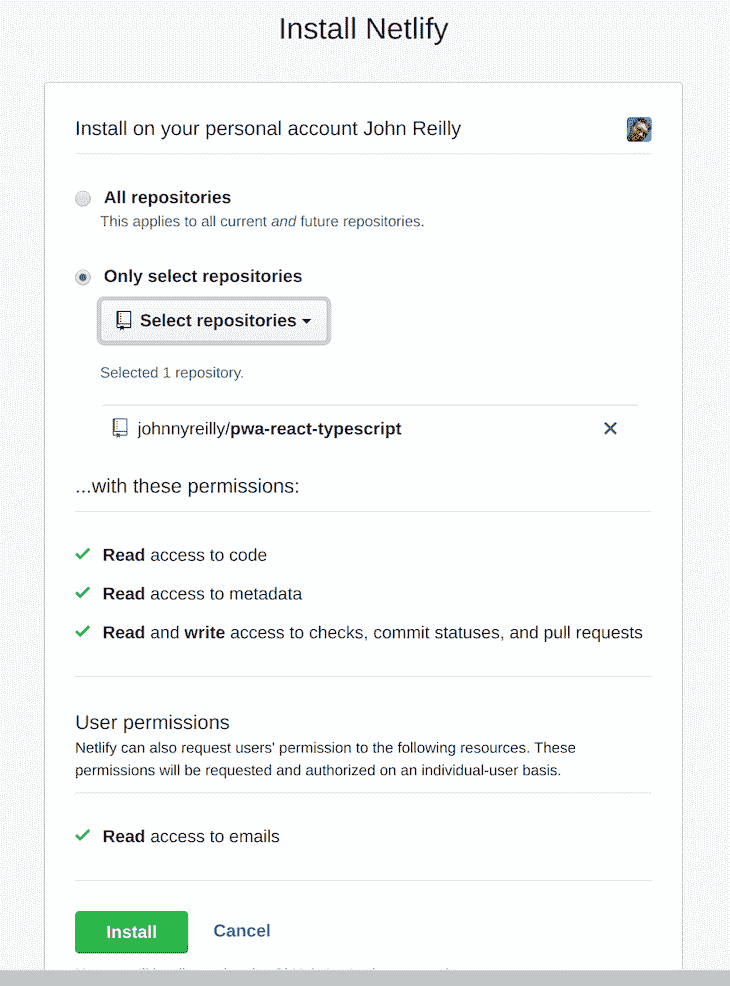
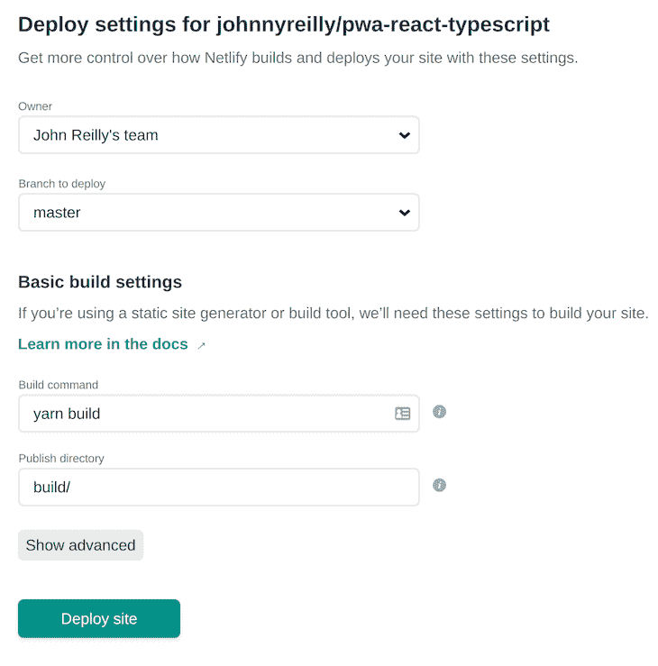
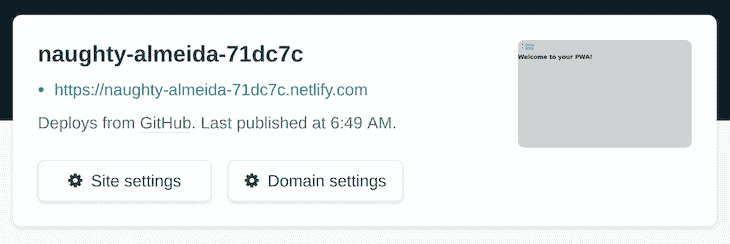
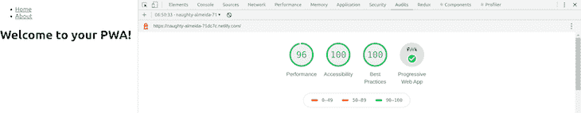

# 使用 React 构建一个渐进式 web 应用程序(PWA)

> 原文：<https://blog.logrocket.com/building-pwa-react/>

***编者按:**本文于 2022 年 6 月 2 日更新，以包含更多关于 Create React App 和 Netlify 的最新信息。*

## 什么是渐进式网络应用程序(PWA)？

渐进式网络应用是一个(名字很糟糕的)好主意。您可以使用 web 技术构建一个适用于所有设备和外形的应用程序。它可以通过网络访问，也可以出现在 Android 或 iOS 设备的主屏幕上。这款应用可以离线工作，启动时显示闪屏，还有通知功能。

PWAs 可以为您的企业节省资金。如果你想为你的用户提供应用程序体验，另一种方法是使用三种不同的技术构建相同的应用程序(一种用于 web，一种用于 Android，一种用于 iOS)。

当你走这条路时，很难避免成本和复杂性的倍增。这通常会导致团队分裂，因为每个人都在不同的堆栈上工作。因此失去一定程度的注意力是很常见的。PWAs 可以在这里提供帮助；不仅从开发人员的角度来看，而且从资源的角度来看，它们都是令人信服的选择。

然而，PWAs 的缺点是它们比普通的 web 应用程序更复杂；从头开始写一个就不那么简单了。但是建立一个 PWA 有助于引导你走向成功的道路。这篇文章将强调其中的一个:如何使用 React 和 TypeScript 从零到你自己的 PWA。

请注意，本文假定您了解:

## 内容

## 使用 Create React 应用程序构建 PWA

为了创建我们的 PWA，我们将使用 [Create React App](https://create-react-app.dev/) 。这个优秀的项目早就内置了对制作 PWAs 的支持。最近几个月，这种支持已经成熟到令人非常满意的程度。

从 Create 向上，可以创建一个`/src/serviceWorker.js`来受益于对 Workbox 的 InjectManifest 插件的内置支持，它将编译我们的服务工作者并注入 URL 进行预缓存。开始创建新 PWA 的最简单方法是使用 Create React App 附带的[自定义模板](https://create-react-app.dev/docs/custom-templates/)之一。

要使用 Create React App 创建支持 TypeScript 的 PWA，请在终端中运行下面的`npx`命令:

```
npx create-react-app pwa-react-typescript --template cra-template-pwa-typescript 
```

这将为您构建一个用 TypeScript 构建的 React web 应用程序，它支持开箱即用的 PWA。它可以在本地使用以下工具进行测试:

```
cd pwa-react-typescript
yarn start 
```

## 使用工具箱从 web 应用程序到 PWA

从 web 应用到 PWA 非常简单——这只是一个选择离线行为的问题。

如果您在新创建的项目中打开`index.tsx`文件，您会发现以下代码:

```
// If you want your app to work offline and load faster, you can change
// unregister() to register() below. Note this comes with some pitfalls.
// Learn more about service workers: https://bit.ly/CRA-PWA
serviceWorker.unregister(); 
```

如提示所示，将`serviceWorker.unregister()`换成`serviceWorker.register()`，你现在就有了一个 PWA。太神奇了！这是什么意思？嗯，让[引用一下文件](https://create-react-app.dev/docs/making-a-progressive-web-app/#why-opt-in):

> –所有静态网站资产都被缓存，以便在后续访问中快速加载您的页面，而不管网络连接(如 2G 或 3G)。更新在后台下载。
> –无论网络状态如何，即使离线，您的应用程序也能正常工作。这意味着您的用户将能够在 10，000 英尺的高空和地铁上使用您的应用程序。

它将负责生成一个服务人员文件，该文件将自动预缓存您的所有本地资产，并在您部署更新时使它们保持最新。服务人员将使用缓存优先策略来处理对本地资产的所有请求，包括对 HTML 的导航请求，确保您的 web 应用程序始终快速，即使在缓慢或不可靠的网络上也是如此。

在引擎盖下，Create React App 通过使用名为 [Workbox](https://developers.google.com/web/tools/workbox) 的技术实现了这一点。Workbox 将自己描述为“一组库和节点模块，使缓存资产变得容易，并充分利用用于构建渐进式 Web 应用程序的功能。”

谷歌的优秀员工意识到编写自己的 PWA 可能会很棘手。有许多新的行为需要配置和了解；很容易犯错误。Workbox 通过实现缓存或离线行为的默认策略来帮助简化前进的道路，这可以通过配置来控制。

在`create-react-app`中使用`Workbox`的一个缺点是(就像 Create React App 中的大多数东西一样),如果默认设置不能满足你的需求，你自己的配置空间就很小。这在未来可能会改变——事实上，[有一个开放的 PR 添加了这种支持](https://github.com/facebook/create-react-app/pull/5369)。

## 使用 React 定制您的 PWA

但不仅仅是线下体验让这成为了 PWA。其他重要因素包括:

*   该应用程序可以添加到您的主屏幕上(A2HS，又名“已安装”)
*   该应用程序有一个可以定制的名称和图标
*   当应用程序启动时，会有一个闪屏显示给用户

使用 Create React 应用程序，上述所有内容都“在盒子里”。让我们开始定制这些。

首先，我们将为我们的应用程序命名。启动`index.html`，用`<title>My PWA</title>`替换`<title>React App</title>`。(请随意编造一个比我建议的更有想象力的名字。)

接下来，打开`manifest.json`并更换以下部件:

```
 "short_name": "React App",
  "name": "Create React App Sample", 
```

有了这个:

```
 "short_name": "My PWA",
  "name": "My PWA", 
```

您的应用程序现在有了名称。你可能会问:这个`manifest.json`文件是什么？嗯，引用谷歌的好人的话:

> web 应用程序清单是一个简单的 JSON 文件，它告诉浏览器有关您的 web 应用程序的信息，以及当它“安装”在用户的移动设备或桌面上时应该如何运行。Chrome 需要一个清单来显示添加到主屏幕提示。典型的清单文件包括应用程序名称、它应该使用的图标、启动时应该开始的`start_url`等信息。

所以`manifest.json`本质上是关于你的应用的元数据。现在应该是这样的:

```
{
  "short_name": "My PWA",
  "name": "My PWA",
  "icons": [
    {
      "src": "favicon.ico",
      "sizes": "64x64 32x32 24x24 16x16",
      "type": "image/x-icon"
    },
    {
      "src": "logo192.png",
      "type": "image/png",
      "sizes": "192x192"
    },
    {
      "src": "logo512.png",
      "type": "image/png",
      "sizes": "512x512"
    }
  ],
  "start_url": ".",
  "display": "standalone",
  "theme_color": "#000000",
  "background_color": "#ffffff"
} 
```

您可以使用上述属性(以及其他尚未配置的属性)来控制您的应用程序的行为。例如，如果你想替换你的应用程序使用的图标，那么很简单:

*   将新的徽标文件放在`public`文件夹中
*   在`manifest.json`中更新对它们的引用
*   最后，对于旧的苹果设备，更新`index.html`中的`<link rel="apple-touch-icon" ... />`

## 在 PWA 中创建多个 URL

到目前为止，我们已经有了一个基本的 PWA。它是可安装的。可以本地运行，用`yarn start`开发。您可以使用`yarn build`构建它以进行部署。

然而，这不是一个可识别的 web 应用程序，因为它不支持不同的页面/URL。我们通常希望以这种方式分解我们的应用程序。让我们现在做那件事。我们将使用`[react-router](https://blog.logrocket.com/react-router-dom-tutorial-examples/)`，React 事实上的路由解决方案。

为了将它添加到我们的项目中(以及 TypeScript 所需的类型定义)，我们使用以下代码:

```
yarn add react-router-dom @types/react-router-dom 
```

现在让我们把我们的应用程序分成几页。我们将用这个替换现有的`App.tsx`:

```
import React from "react";
import { BrowserRouter as Router, Routes, Route, Link } from "react-router-dom";
import About from "./About";
import Home from "./Home";

const App: React.FC = () => (
  <Router>
    <nav>
      <ul>
        <li>
          <Link to="/">Home</Link>
        </li>
        <li>
          <Link to="/about">About</Link>
        </li>
      </ul>
    </nav>
    <Routes>
      <Route path="/about">
        <About />
      </Route>
      <Route path="/">
        <Home />
      </Route>
    </Routes>
  </Router>
);
export default App; 
```

这将是我们的根页面。它负责使用`react-router`来呈现我们想要提供的页面，并提供允许用户导航到这些页面的链接。在进行我们的更改时，我们会破坏我们的测试(该测试检查一个我们现在已经删除的链接)，所以我们将用下面的代码来修复它。

将`App.test.tsx`替换为:

```
import React from 'react';
import { render } from '@testing-library/react';
import App from './App';

test('renders about link', () => {
  const { getByText } = render();
  const linkElement = getByText(/about/i);
  expect(linkElement).toBeInTheDocument();
}); 
```

你会注意到，在我们新的`App.tsx`中，我们导入了两个新组件(或页面):`About`和`Home`。让我们创造这些。

第一，`About.tsx`:

```
import React from "react";

const About: React.FC = () => (
  <h1>This is a PWA</h1>
);

export default About; 
```

然后，`Home.tsx`:

```
import React from "react";

const Home: React.FC = () => (
  <h1>Welcome to your PWA!</h1>
);

export default Home; 
```

## 对您的 PWA 进行代码拆分

既然我们已经将我们的应用程序分成了多个部分，我们也将分割代码。改善 PWAs 加载时间的一个好方法是确保代码不被构建到大文件中。

目前，我们的应用程序构建了一个`single-file.js`。如果你运行`yarn build`，你会看到这个样子:

```
 47.88 KB  build/static/js/2.89bc6648.chunk.js
  784 B     build/static/js/runtime-main.9c116153.js
  555 B     build/static/js/main.bc740179.chunk.js
  269 B     build/static/css/main.5ecd60fb.chunk.css 
```

注意这个`build/static/js/main.bc740179.chunk.js`文件。这是我们的`single-file.js`。它表示构建构成我们的应用程序的 TypeScript 文件的编译输出。它会随着我们的应用程序的增长而增长，最终从用户加载速度的角度来看会变得有问题。

Create React App 基于 webpack 构建。webpack 对代码分割有很好的支持，因此，Create React App [默认支持它](https://reactjs.org/docs/code-splitting.html#code-splitting)。让我们将它应用到我们的应用程序中。同样，我们要改变`App.tsx`。

我们之前有:

```
import About from "./About";
import Home from "./Home"; 
```

让我们将其替换为:

```
const About = lazy(() => import('./About'));
const Home = lazy(() => import('./Home')); 
```

这是 React 中延迟加载组件的语法。您会注意到它在内部使用了动态的`import()`语法，webpack 将它用作“分割点”

让我们在 React 等待动态导入被解析的时候给它一些东西来渲染。就在我们的`<Router>`组件内部，我们还将添加一个`<Suspense>`组件:

```
 <Router>
    <Suspense fallback={<div>Loading...</div>}>
    {/*...*/}
    </Suspense>
  </Router> 
```

在等待动态加载路线代码时，`<Suspense>`组件将呈现`<div>Loading...</div>`。

所以我们最后的`App.tsx`组件看起来像这样:

```
import React, { lazy, Suspense } from "react";
import { BrowserRouter as Router, Switch, Route, Link } from "react-router-dom";
const About = lazy(() => import("./About"));
const Home = lazy(() => import("./Home"));

const App: React.FC = () => (
  <Router>
    <Suspense fallback={<div>Loading...</div>}>
      <nav>
        <ul>
          <li>
            <Link to="/">Home</Link>
          </li>
          <li>
            <Link to="/about">About</Link>
          </li>
        </ul>
      </nav>
      <Switch>
        <Route path="/about">
          <About />
        </Route>
        <Route path="/">
          <Home />
        </Route>
      </Switch>
    </Suspense>
  </Router>
);

export default App; 
```

这现在是一个代码分割应用程序。我们怎么知道？如果我们再次运行`yarn build`,我们会看到类似这样的内容:

```
 47.88 KB          build/static/js/2.89bc6648.chunk.js
  1.18 KB (+428 B)  build/static/js/runtime-main.415ab5ea.js
  596 B (+41 B)     build/static/js/main.e60948bb.chunk.js
  269 B             build/static/css/main.5ecd60fb.chunk.css
  233 B             build/static/js/4.0c85e1cb.chunk.js
  228 B             build/static/js/3.eed49094.chunk.js 
```

注意，我们现在有多个`*.chunk.js`文件:我们的初始`main.*.chunk.js`，然后是代表`Home.tsx`的`3.*.chunk.js`，以及代表`About.tsx`的`4.*.chunk.js`。

随着我们从这一点继续构建我们的应用程序，我们将有一个很好的方法来确保用户在需要时加载文件，并且这些文件不应该太大——可扩展的出色性能。

## 部署您的 PWA

现在我们已经有了基本的 PWA，让我们部署它，这样外界就可以欣赏它了。为此，我们将使用 [Netlify](https://blog.logrocket.com/netlify-vs-cloudflare-pages/) 。

我们 PWA [的源代码就在 GitHub 这里](https://github.com/emmanueletukudo/pwa-react-typescript)。

我们将登录 Netlify，点击**创建新站点**选项，并选择 GitHub 作为提供商。我们需要授权 Netlify 访问我们的 GitHub。

您可能需要点击**在 GitHub 上配置 Netlify**按钮来授予 Netlify 访问您的 repo 的权限，如下所示:



然后，您可以从 Netlify 中选择您的回购协议。Netlify 提供的所有默认设置都适用于我们的用例:



让我们点击神奇的**部署站点**按钮！几分钟后，你会发现 Netlify 已经部署了我们的 PWA。



如果我们浏览 Netlify 提供的 URL，我们将能够看到实际部署的 PWA。您还有机会设置一个自定义域名，这是您在简单演示之外通常需要的。重要的是，这将在 HTTPS 上空提供服务，这将允许我们的服务人员进行操作。

现在我们知道它就在那里，让我们看看我们建立的东西是如何支持专业人士的观点的。我们将针对我们的 PWA 运行 Google Chrome DevTools 审计:



这是我们 PWA 的一个好的开始！

## 结论

将新的或现有的 React 应用程序转换为 PWA 有很多好处，尤其是考虑到前端开发的未来是基于 web 优化的。这种方法将帮助您从一开始就构建一个高性能的 web 应用程序。

## [LogRocket](https://lp.logrocket.com/blg/react-signup-general) :全面了解您的生产 React 应用

调试 React 应用程序可能很困难，尤其是当用户遇到难以重现的问题时。如果您对监视和跟踪 Redux 状态、自动显示 JavaScript 错误以及跟踪缓慢的网络请求和组件加载时间感兴趣，

[try LogRocket](https://lp.logrocket.com/blg/react-signup-general)

.

[ ](https://lp.logrocket.com/blg/react-signup-general) [](https://lp.logrocket.com/blg/react-signup-general) 

LogRocket 结合了会话回放、产品分析和错误跟踪，使软件团队能够创建理想的 web 和移动产品体验。这对你来说意味着什么？

LogRocket 不是猜测错误发生的原因，也不是要求用户提供截图和日志转储，而是让您回放问题，就像它们发生在您自己的浏览器中一样，以快速了解哪里出错了。

不再有嘈杂的警报。智能错误跟踪允许您对问题进行分类，然后从中学习。获得有影响的用户问题的通知，而不是误报。警报越少，有用的信号越多。

LogRocket Redux 中间件包为您的用户会话增加了一层额外的可见性。LogRocket 记录 Redux 存储中的所有操作和状态。

现代化您调试 React 应用的方式— [开始免费监控](https://lp.logrocket.com/blg/react-signup-general)。

## [LogRocket](https://lp.logrocket.com/blg/typescript-signup) :全面了解您的网络和移动应用

[](https://lp.logrocket.com/blg/typescript-signup)

LogRocket 是一个前端应用程序监控解决方案，可以让您回放问题，就像问题发生在您自己的浏览器中一样。LogRocket 不需要猜测错误发生的原因，也不需要向用户询问截图和日志转储，而是让您重放会话以快速了解哪里出错了。它可以与任何应用程序完美配合，不管是什么框架，并且有插件可以记录来自 Redux、Vuex 和@ngrx/store 的额外上下文。

除了记录 Redux 操作和状态，LogRocket 还记录控制台日志、JavaScript 错误、堆栈跟踪、带有头+正文的网络请求/响应、浏览器元数据和自定义日志。它还使用 DOM 来记录页面上的 HTML 和 CSS，甚至为最复杂的单页面和移动应用程序重新创建像素级完美视频。

[Try it for free](https://lp.logrocket.com/blg/typescript-signup)

.