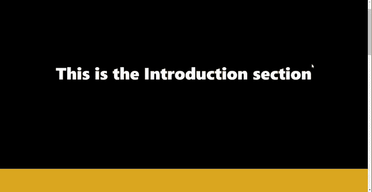
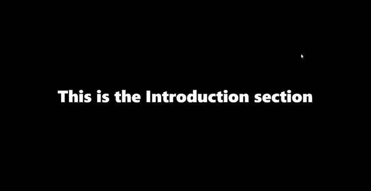
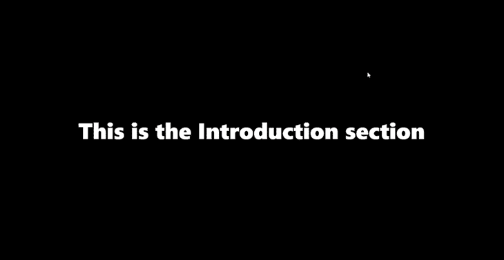
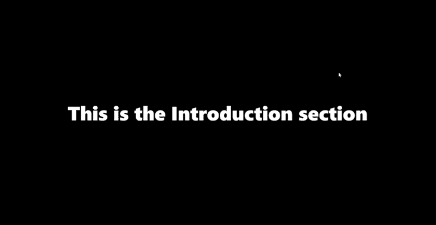

# 用火车头卷轴构建一个 React 投资组合网站

> 原文：<https://blog.logrocket.com/building-react-portfolio-website-locomotive-scroll/>

许多网页都实现了滚动动画，尤其是那些具有大量内容的网页，以使滚动更好，更简单。这些滚动动画在网络上变得越来越普遍，因为引入了能够处理它们的设备。

有许多不同类型的滚动动画:粘性滚动，平滑滚动，CSS 视差，等等。虽然其中一些滚动动画——比如 CSS 视差——可以用 CSS 实现，但你可能需要像 Framer Motion 或 GSAP 这样的[库来处理你项目中更复杂的动画。](https://blog.logrocket.com/react-scroll-animations-framer-motion/)

本文将看看`[react-locomotive-scroll](https://locomotivemtl.github.io/locomotive-scroll/)` [包](https://locomotivemtl.github.io/locomotive-scroll/)，或者我们称之为机车卷轴，一个用于在 React 中处理和创建不同滚动动画的库。

机车卷轴是一个 React 卷轴库，建立在 [ayamflow 的虚拟卷轴](https://github.com/ayamflow/virtual-scroll)之上，这个库用于创建支持触摸和键盘的[定制卷轴。Locomotive Scroll 支持各种形式的滚动动画，包括平滑滚动、动画页面覆盖和视差效果。](https://blog.logrocket.com/react-scroll-animations-framer-motion/)

事不宜迟，让我们设置我们的工作空间，并在 React 应用程序中使用机车滚动包。运行以下命令来构建新的 React 项目:

```
yarn create react-app <Name-of-your-app>

```

接下来，将目录更改为项目文件夹，并使用以下命令安装机车卷轴包:

```
cd locomotive-scroll-react && yarn add locomotive-scroll react-locomotive-scroll

```

清除`src`文件夹中不必要的文件，并导航至`App.js`文件。用下面的代码块替换整个锅炉代码:

```
import './App.css';

function App() {
  return (
    <main>
      <section className='intro'>
        <h1>This is the Introduction section</h1>
      </section>

      <section className='contents'>
        <h1>I Love React</h1>
      </section>

        <section id="stick">
          <h1>
            Hey I'm Sticky
          </h1>
          <p>other contents</p>
          <p>other contents</p>
          <p>other contents</p>
          <p>other contents</p>
          <p>other contents</p>
          <p>other contents</p>
          <p>other contents</p>
          <p>other contents</p>
        </section>

      <section className='footer'>
        <h1>Let's end the application with this Footer</h1>
      </section>
    </main>
  );
}
export default App;

```

接下来，用下面的样式替换整个`App.css`:

```
* {
  margin: 0;
  padding: 0;
  box-sizing: border-box;
}
.App {
  text-align: center;
}
h1{
  font-size: 5rem;
  font-weight: bolder;
}
p {
  font-size: 3rem;
  margin: 1rem;
}
section {
  height: 100vh;
  color: white;
  display: flex;
  align-items: center;
  justify-content: center;
}
.intro{
  background-color: black;
}
.contents {
  background-color: goldenrod;
}
#stick {
  background-color: rgb(71, 14, 64);
  display: flex;
  height: 100vh;
  flex-direction: column;
  justify-content: center;
  align-items: center;
}
.footer {
  background-color: whitesmoke;
  color: seagreen;
}

```

用`yarn start`运行开发服务器后，我们应该会得到类似下面的 GIF:



机车滚动库存储各种具有特定样式的 HTML 数据属性，然后将事件监听器附加到这些数据属性上。然后，这些事件根据数据属性在浏览器视窗中的位置触发指定的行为。

让我们看看这些数据属性和它们在机车卷轴库中的指定行为。

`data-scroll`属性检测它所附加的元素是否在浏览器的视窗中。

属性创建了一个容器，你可以用它来包装任何你想要滚动的页面。该属性对于样式化也是必需的。

`data-scroll-section`属性的工作方式类似于`data-scroll-container`属性。不同之处在于，您可以将页面分成组件，然后对每个组件使用`data-scroll-section`属性，而不是对整个页面使用`data-scroll-container`。

当在元素上使用`data-scroll-direction`时，该属性采用指定的方向——垂直或水平——然后相应地移动元素。该属性用于平滑滚动，通常与`data-scroll-container`和`data-scroll-section`属性一起使用。

您可以使用`data-scroll-speed`进行平滑滚动。此属性采用一个数字来确定它所附加的元素移动的花费。负数反转滚动方向，但仅在与`data-scroll-direction`属性一起使用时。

`data-scroll-target`属性也用于平滑滚动。它针对一个特定的元素，当与`data-scroll-sticky`属性一起使用时效果很好。

最后，`data-scroll-sticky`也有助于平滑滚动。它与`data-scroll-target`属性一起检查目标元素是否在视图中，然后使该元素成为粘性元素。

本节将介绍机车卷轴包中的一些特性，以及如何在我们的应用程序中实现它们。

平滑滚动是机车滚动包的最大特点之一。这使得应用程序在各个部分滚动时有一种快速流畅的感觉。让我们看看这在我们的应用程序中会是什么样子。

机车卷轴有一些自定义属性，拥有一些风格。当添加到一个组件中时，这些样式赋予该组件“火车头”的特性。

根据`[react-locomotive-scroll](https://github.com/locomotivemtl/locomotive-scroll/blob/master/dist/locomotive-scroll.css)` [软件包文档](https://github.com/locomotivemtl/locomotive-scroll/blob/master/dist/locomotive-scroll.css)的建议，将以下样式添加到您的`App.css`文件中:

```
html.has-scroll-smooth {
  overflow: hidden; 
}

html.has-scroll-dragging {
  -webkit-user-select: none;
  -moz-user-select: none;
  -ms-user-select: none;
  user-select: none; 
}

.has-scroll-smooth body {
  overflow: hidden; 
}

.has-scroll-smooth [data-scroll-container] {
  min-height: 100vh; 
}

[data-scroll-direction="horizontal"] [data-scroll-container] {
  height: 100vh;
  display: inline-block;
  white-space: nowrap; 
}

[data-scroll-direction="horizontal"] [data-scroll-section] {
  display: inline-block;
  vertical-align: top;
  white-space: nowrap;
  height: 100%; 
}

.c-scrollbar {
  position: absolute;
  right: 0;
  top: 0;
  width: 11px;
  height: 100%;
  transform-origin: center right;
  transition: transform 0.3s, opacity 0.3s;
  opacity: 0; 
}

  .c-scrollbar:hover {
    transform: scaleX(1.45); 
}

  .c-scrollbar:hover, .has-scroll-scrolling .c-scrollbar, .has-scroll-dragging .c-scrollbar {
    opacity: 1; 
}

[data-scroll-direction="horizontal"] .c-scrollbar {
    width: 100%;
    height: 10px;
    top: auto;
    bottom: 0;
    transform: scaleY(1); 
}

[data-scroll-direction="horizontal"] .c-scrollbar:hover {
      transform: scaleY(1.3); 
}

.c-scrollbar_thumb {
  position: absolute;
  top: 0;
  right: 0;
  background-color: black;
  opacity: 0.5;
  width: 7px;
  border-radius: 10px;
  margin: 2px;
  cursor: -webkit-grab;
  cursor: grab; 
}
  .has-scroll-dragging .c-scrollbar_thumb {
    cursor: -webkit-grabbing;
    cursor: grabbing; 
}
  [data-scroll-direction="horizontal"] .c-scrollbar_thumb {
    right: auto;
    bottom: 0; 
}

```

完成后，导航到`App.js`文件并从`react-locomotive-scroll`导入`LocomotiveScrollProvider`，以及将`useRef`钩子导入到`App.js`文件中。

`react-locomotive-scroll`包导出了一个提供者组件，作为我们应用程序的顶层包装器，从而赋予它移动滚动特性。

接下来，用`LocomotiveScrollProvider`结束`App.js`的`return`语句，并给我们的标签添加一些属性:

```
import { LocomotiveScrollProvider } from "react-locomotive-scroll";
import { useRef } from "react";

function App() {
  const ref = useRef(null);

  const options = {
    smooth: true,
  } 

  return (
    <LocomotiveScrollProvider options={options} containerRef={ref}>
      <main data-scroll-container ref={ref}>
        <section className="intro" data-scroll-section>
          <h1>This is the Introduction section</h1>
        </section>
        <section className="contents" data-scroll-section>
          <h1>I Love React</h1>
        </section>
        <section className="footer" data-scroll-section>
          <h1>Let's end the application with this Footer</h1>
        </section>
      </main>
    </LocomotiveScrollProvider>
  );
}

```

在上面的代码块中，我们创建并分配了我们的`options`对象给`options`道具，分配了`useRef`钩子给`LocomotiveScrollProvider`中的`ref`道具。

属性将一个对象作为自定义滚动行为的参数。我们还为标签添加了一些属性。

该属性是总是被添加到顶级标签的`data-scroll-container`，从而赋予其子组件平滑滚动的能力。

将`data-scroll-section`属性添加到每个组件中，用机车滚动来初始化它，并防止一些混乱的行为。

完成后，我们应该能够实现如下所示的平滑滚动行为:


### 动画页面覆盖

使用`react-locomotive-scroll`包，可以操纵页面和部分，使它们在滚动时出现在其他部分之上。让我们通过编写一些代码来看看这个特性是如何工作的:

```
 <main data-scroll-container ref={ref}>
  <section
    className="intro"
      data-scroll //This attribute makes this section an independent scrollable container
        data-scroll-speed="4"
          data-scroll-section
    >
       <h1>This is the Introduction section</h1>
  </section>

        ...
</main>

```

在上面的代码块中，我们向我们的简介部分标签添加了两个属性:`data-scroll`，它使该部分成为一个独立的可滚动容器，以及`data-scroll-speed`，它决定该部分的滚动速度。

这两个属性一起为应用程序的简介部分提供了一个漂亮的、动画的、滚动的覆盖图，如下面的 GIF 所示:


### 浮动内容

滚动时出现的浮动元素太酷了，使用`react-locomotive-scroll`可以轻松实现！让我们通过更新我们的`App.js`代码来实现这一点:

```
      <main data-scroll-container ref={ref}>  

        ...

        <section className="contents" data-scroll-section>
          <h1
            data-scroll
            data-scroll-direction="horizontal"
            data-scroll-speed="9"
          >
            I Love React
          </h1>
          <h1
            data-scroll
            data-scroll-direction="vertical"
            data-scroll-speed="9" // Values provided here affect the animations
          >
            That's why I code every day
          </h1>
        </section>

        ...

```

在上面的代码块中，我们利用了`data-scroll-direction`和`data-scroll-speed`属性。它们按照提供给`data-scroll-speed`属性的值给元素一个浮动动画:



让我们来谈谈如何在滚动时让一个文本或组件固定在它的位置上。我认为当试图传递信息或改善用户的感觉和体验时，它看起来更有创意。

让我们看看如何使用`locomotive-scroll`包来实现这一点。将以下代码添加到`App.js`文件中:

```
      <main data-scroll-container ref={ref}>

        ...

        <section id="stick" data-scroll-section>
          <h1
            data-scroll
            data-scroll-speed="5"
            data-scroll-sticky // Attibute that enables the sticky scroll
            data-scroll-target="#stick"
          >
            Hey I'm Sticky
          </h1>
          <p>other contents</p>
          <p>other contents</p>
          <p>other contents</p>
          <p>other contents</p>
          <p>other contents</p>
          <p>other contents</p>
          <p>other contents</p>
          <p>other contents</p>
        </section>

        ...
      </main>

```

在上面的代码块中，我们给了我们的`h1`文本 sticky 属性，并将其目标环境分配给 sticky 部分。这个`data-scroll-target`属性将它的孩子限制在提供的部分。现在，我们有了这个:


你有没有想过在滚动进入视图时添加自己的自定义动画？这个`react-locomotive-scroll`套餐为你提供了保障。当滚动到视图中时，它给你调用其他类的灵活性。

让我们用一个简单的淡入动画来演示一下。将以下样式添加到`App.css`文件中:

```
.op-class{
    opacity: 0;
}
.fadeIn {
    opacity: 1;
    transition: opacity 4s ;
}

```

接下来，更新页脚部分:

```
     <main data-scroll-container ref={ref}>

        ...

        <section className="footer" data-scroll-section>
          <h1
            className="op-class"
            data-scroll
            data-scroll-class="fadeIn"
            data-scroll-repeat="true"
            data-scroll-speed="2"
          >
            Let's end the application with this Footer
          </h1>
        </section>
      </main>

```

在上面的代码块中，我们添加了我们的`op-class`和`data-scroll-class`属性。当元素滚动到视图中时，`op-class`触发一个类，当元素不在视图中时，`data-scroll-repeat`通过移除该类使整个过程循环。

这些属性的组合为我们的应用程序的页脚部分创建了一个漂亮的淡入动画，如下所示:



机车滚动包也能让你决定整个应用程序的滚动速度。超级酷吧？

让我们给我们的应用程序一些超级滚动速度。

更新`App.js`中的选项对象:

```
  const options = {
    smooth: true,
    multiplier: 9, //added this
  };

```

我们向 options 对象添加了 multiplier 属性，如上面的代码块所示。multiplier 属性接受一个数字来确定应用程序的速度。

下面的 GIF 显示了设置我们的乘数后我们的应用程序的速度:



让我们把我们到目前为止学到的所有东西都用在建立一个投资组合网站上吧！这里我们将实现一些机车卷轴的特性。

首先，从 [GitHub](https://github.com/IsaacThaJunior/Portfolio-site-with-React-Locomotive-scroll/tree/starter) 中克隆并运行项目的启动文件。starter 文件带有基本的组件和样式，如下面的 GIF 所示。我们将实现机车滚动的各种功能:


我们首先将`useRef`钩子和`LocomotiveScrollProvider`导入到`App.js`文件中，并用`LocomotiveScrollProvider`包装我们的`return`语句。在这之后，我们将创建我们的`options`对象，它将被传递给`LocomotiveScrollProvider`:

```
import { useRef } from "react";
import { LocomotiveScrollProvider } from "react-locomotive-scroll";

const options = {
    smooth: true,
    multiplier: 3,
}

 return (
    <LocomotiveScrollProvider
      options={options}
      containerRef={ref}
    >
      <main data-scroll-container ref={ref}>
        <Introduction />
        <Work />
        <Message />
      </main>
    </LocomotiveScrollProvider>
  );

```

让我们开始为每个部分定制一些漂亮的滚动效果。让我们从网站上的“简介”组件开始。

转到`src/components/intro/Introduction.jsx`文件:

```
// src/components/intro/Introduction.jsx

const Introduction = () => {
  return (
    <section
      className="intro-section"
      data-scroll-section
      data-scroll
      data-scroll-speed="6"
    >
      <div className="intro-image">
        
      </div>
      <div className="intro-title">
        <h1 data-scroll data-scroll-speed="9">
          Isaac Junior
          <br />A Frontend Engineer and Technical writer with a deep focus on
          creating pixel-perfect designs
        </h1>
      </div>
    </section>
  );
};

```

在上面的代码块中，我们已经使用`data-scroll`和`data-scroll-speed`属性初始化了具有叠加效果的组件。我们也给了文本一些滚动速度来创造一种滚动消失的效果。

接下来，转到`src/components/work/Work.jsx`文件，将代码更新为下面的代码:

```
// src/components/work/Work.jsx
const Work = () => {
  return (
    <section id="case-stick" data-scroll-section className="work-section">
      <p
        className="case"
        data-scroll
        data-scroll-sticky
        data-scroll-target="#case-stick"
      >
        CASE STUDIES <br />
        Latest Works
      </p>

      ...

    </section>
  );
};

```

在上面的代码块中，我们使用`data-scroll-section`属性使我们的部分成为一个滚动容器。我们还使用`data-scroll-sticky`和`data-scroll-target`属性，针对我们部分的`id`，使我们的文本在滚动时具有粘性。

如果能给我们的卡片一点滚动效果就好了。转到`src/components/Card.jsx`文件，用下面的代码更新文件:

```
// src/components/Card.jsx

function Card(props) {
 const {image, title, description} = props;
  return (
    <div
      data-scroll
      data-scroll-speed="9"
      className="card container"
    >
      <div className="cardImg">
        
      </div>
      <div className="cardContent">
        <p className="cardTitle">{title}</p>
        <p className="cardDesc">{description}</p>
      </div>
    </div>
  );
}

```

在上面的代码块中，我们用`data-scroll`属性初始化我们的卡，并给我们的卡组件一些滚动速度。

最后，让我们定制我们的“消息”部分。但是在我们开始之前，将下面的样式添加到`src/components/message/message-style.css`文件中:

```
// src/components/message/message-style.css
.op-class{  
    opacity: 0;
}
.fadeIn {
    opacity: 1;
    transition: opacity 4s ;
}

```

我们将使用上面的样式为这个部分创建一个漂亮的淡入动画。现在，转到`src/components/message/Message.jsx`文件，将代码更新为下面的代码:

```
// src/components/message/Message.jsx
const Message = () => {
  return (
    <section data-scroll-section className="message-section">
      <p
        data-scroll
        data-scroll-direction="horizontal"
        data-scroll-speed="2"
        className="message"
      >
        Drop a Message
      </p>
      <div
        className=" op-class"
        data-scroll
        data-scroll-repeat="true"
        data-scroll-class="fadeIn"
        data-scroll-speed="4"
      >
        <input type="text" name="fullName" placeholder="Full Name" id="" />
        <input type="text" name="email" placeholder="Enter Email" id="" />
        <textarea name="" placeholder="Message" id="" />
      </div>
    </section>
  );
};

```

在上面的代码块中，当输入将要滚动到视图中时，我们调用了`fadeIn`类。我们还添加了`data-scroll-repeat`属性，并将其设置为 true，以使`fadeIn`动画能够不断重复。

完成后，您应该能够在我们的新组合网站上看到火车头卷轴库的结果，如下所示:


如今，大多数网站都非常重视审美。视觉上令人愉悦的网站提供了更好的用户体验，并已被证明对用户转化有积极的影响。当你的用户浏览你的网站时，你可以给他们流畅的体验，甚至唤起网站访问者的情感。

火车头卷轴库有大量的选项和属性，当结合在一起时，可以引起积极的反应，增加网站的转化率。也就是说，机车卷轴库可能并不适合所有情况。

并不是每个网站都必须有流畅的滚动和浮动的动画。像电子商务网站和 STEM 博客这样的网站是您可以考虑不使用这个库的好地方，因为它可能会对用户体验产生负面影响。

当计划是启发和告诉你的用户一个故事时，使用机车卷轴库是一个伟大的想法。与电影、艺术、甚至食物和饮料相关的网站都是展示火车头卷轴能力的好地方。

最终，使用火车头卷轴的决定权掌握在网络创造者手中。这个选择应该考虑到你的站点访问者。

你可以前往[机车滚动文档](https://github.com/locomotivemtl/locomotive-scroll)了解更多信息。

在 web 开发中，事件是通知变化的触发器，这些变化来自用户交互(单击、滚动或表单提交)、浏览器变化(页面加载)、环境变化(低电量)以及其他原因。

任何对事件造成不利影响的事情都被称为劫持。web 开发中的劫持形式有很多种，包括 web 劫持、点击劫持、滚动劫持等等。本节的重点将放在卷轴顶起和机车卷轴上。

滚动提升控制浏览器的滚动运动，并将预期的滚动运动改变为某个其他的非预期的运动。向上滚动会使页面导航变得困难，因为预期的上/下或左右摇摆行为会被意外行为改变用途。

这方面的一个例子是让用户停止滚动一段文本几秒钟，以确保他们阅读了该文本。也可以暂时禁止滚动到“我接受条款和条件”部分，以确保用户通读特定软件的条款和条件。

滚动劫持是一种有争议的做法，对可用性、可访问性和性能有负面影响。

机车滚动使用滚动顶起来创建滚动时更具吸引力和流畅的体验，同时还提供美丽和高级的动画，如[官网](https://locomotive.ca/en/articles/should-i-use-locomotive-scroll-on-my-project)所述。在构建应用程序时，应该负责任地决定启用滚动跳转，以避免负面影响。

`react-locomotive-scroll`库并不是 React 中唯一能够滚动动画的库。我们将查看并比较`react-scroll`库和`react-locomotive-scroll`库。

`react-scroll`库用于制作垂直滚动的动画。这个库在 npm 上有超过 40 万次下载，在 Github 上有 4k 颗星。相比之下，`react-locomotive-scroll`库在 npm 上 1k 下载，在 Github 上 5.9k 星。

### `react-scroll`与`react-locomotive-scroll`的优势

`react-scroll`库提供了各种属性来帮助你定义应用程序中的滚动行为。使用`react-scroll`库的一个巨大好处是，你可以获得大量的选项来制作应用程序垂直滚动的动画。

`react-scroll`提供的一些可以添加到你的应用程序中的动画包括`easeIn`、`easeInAndOut`等等。[看看这些动画在你的应用中的视觉表现](https://easings.net/)。

`react-locomotive-scroll`库为您提供预定义的数据属性，用于检测组件和激活检测到的组件。`react-locomotive-scroll`库还允许你像 GSAP 这样的[库一样为你的应用制作动画。](https://blog.logrocket.com/using-gsap-3-for-web-animation/)

`react-locomotive-scroll`库的好处包括你可以为你的应用程序定义动画，也可以为你的应用程序处理自定义的滚动行为。

### `react-locomotive-scroll`与`react-scroll`的用例

当你想在你的应用程序中制作滚动行为的动画时，`react-scroll`库是很好的选择。它对于需要预定义平滑滚动选项的场合也很有用。

在你想要最好的动画和处理滚动行为的情况下,`react-locomotive-scroll`库是很棒的。当你想利用滚动升级来构建半自以为是的滚动网站时，这也是很好的选择。

## 结论

在本文中，我们学习了如何使用`react-locomotive-scroll`包让我们的网站有更好的滚动行为。我们研究了如何为组件提供它们自己的自定义滚动行为，以及滚动提升和机车滚动之间的关系。

这里有 GitHub 上[源代码的链接和 Netlify](https://github.com/IsaacThaJunior/Portfolio-site-with-React-Locomotive-scroll) 上[托管应用的链接。](https://locomotive-scroll-react.vercel.app/)

## [LogRocket](https://lp.logrocket.com/blg/react-signup-general) :全面了解您的生产 React 应用

调试 React 应用程序可能很困难，尤其是当用户遇到难以重现的问题时。如果您对监视和跟踪 Redux 状态、自动显示 JavaScript 错误以及跟踪缓慢的网络请求和组件加载时间感兴趣，

[try LogRocket](https://lp.logrocket.com/blg/react-signup-general)

.

[ ](https://lp.logrocket.com/blg/react-signup-general) [](https://lp.logrocket.com/blg/react-signup-general) 

LogRocket 结合了会话回放、产品分析和错误跟踪，使软件团队能够创建理想的 web 和移动产品体验。这对你来说意味着什么？

LogRocket 不是猜测错误发生的原因，也不是要求用户提供截图和日志转储，而是让您回放问题，就像它们发生在您自己的浏览器中一样，以快速了解哪里出错了。

不再有嘈杂的警报。智能错误跟踪允许您对问题进行分类，然后从中学习。获得有影响的用户问题的通知，而不是误报。警报越少，有用的信号越多。

LogRocket Redux 中间件包为您的用户会话增加了一层额外的可见性。LogRocket 记录 Redux 存储中的所有操作和状态。

现代化您调试 React 应用的方式— [开始免费监控](https://lp.logrocket.com/blg/react-signup-general)。