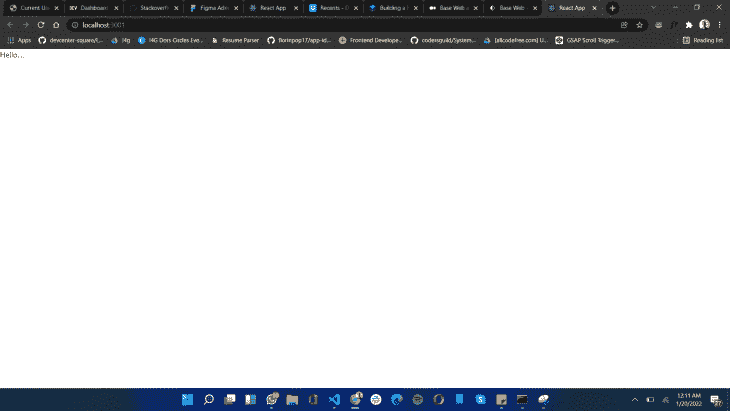
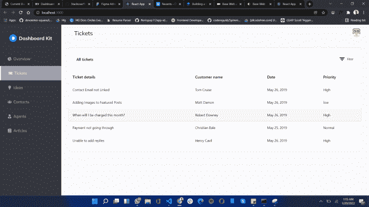

# 使用基础 Web 和 React 构建响应式仪表板

> 原文：<https://blog.logrocket.com/building-responsive-dashboard-base-web-react/>

对于开发人员来说，创建仪表板可能很困难，特别是当他们必须在所有设备上响应时。为了使仪表板更容易实现，许多开发人员使用预定义的组件，或者 UI 库和样式指南，以使工作更快更容易。

其中一个突出的例子是 Base Web(在 npm 中称为 [baseui](https://www.npmjs.com/package/baseui) )，这是一个由优步创建的设计系统和 ui 库，用于帮助开发者创建漂亮的、与设备无关的应用。Base Web 由一系列 React 组件组成，被设计成“[可靠、可访问和可广泛定制的](https://eng.uber.com/introducing-base-web/)”

在这篇文章中，我们将探讨 Base Web，它的起源，我个人的使用经验，以及它与其他 UI 库的不同之处。最后，我们将通过在 React 中实现一个简单的仪表板来演示它的简单性和功能，从而试验一下 Base Web。

## 先决条件

在我们开始有趣的部分之前，有几个先决条件，你应该按照本教程。它们是:

*   React 的工作知识
*   安装在计算机上的 Node.js
*   您选择的文本编辑器
*   您选择的终端

## 什么是基础网络？

Base Web 是一个 React UI 框架，它使用现成的健壮组件来帮助简化 UI 实现。基础网由复杂的组件组成，例如`Data-Table`、`Input`和`Datepicker`等等。

## Base Web 有什么特别之处？

以下是我认为最有用的 Base Web 特性。

### 展开性

随着主题和覆盖 API 的引入，Base Web 变得易于定制，这实际上包括更改组件以适应您的口味。这种级别的定制接受修改组件或在 Base Web 上创建您自己的风格指南。

### 表演

Base Web 使用超快的 Styletron(CSS-in-JS 引擎)来运行和驱动样式。

### 内置可访问性

基本 Web 组件是在考虑到[可访问性](https://blog.logrocket.com/a-practical-guide-to-accessibility-for-forms/)的情况下构建的。他们负责繁重的工作，以便开发人员可以专注于 UI 设置，而不会忽略具有可访问性需求的用户。

### 社区

基础网络社区日益壮大，这有助于提高相关产品的质量。使用它也很容易找到任何问题的答案。

## Base Web、Ant Design、MUI 和 reactstrap 有什么区别？

React 生态系统中有许多不同的 UI 库，这会使事情变得复杂，尤其是当我们试图选择最适合我们特定用例的库时。在本节中，我们将比较 Base Web 与 [Ant Design](https://ant.design/) 、 [MUI](https://mui.com/) 和 [reactstrap](https://blog.logrocket.com/how-to-use-bootstrap-with-react-a354715d1121/) 。

### 成分

众所周知，Base Web 和 Ant Design 提供了一套健壮的组件，而 MUI 提供了高级主题。Reactstrap 被设计为与 [Bootstrap](https://blog.logrocket.com/why-is-bootstrap-so-popular/) 一起工作，它也有很多预构建的组件。

从我自己的角度来看，像数据表、拖放列表、网格表和支付卡这样的基本 Web 组件在其他库中是独一无二的，这使得它特别有用。我还应该提到，选择最好的库取决于您项目的特定组件需求。在使用 UI 库之前，您应该确保它包含您想要的组件。

### 用户化

基本 Web 和 Ant 设计很容易定制，尽管它们使用不同的方法。Base Web 使用覆盖 API，Ant Design 使用主题配置。不幸的是，MUI 和 reactstrap 不容易定制。

### 类型脚本支持

对 TypeScript 的支持是许多 JavaScript 库面临的主要问题之一，因为大多数是为 JS 编写的，需要重新构建以支持 TypeScript，而其他的支持以前版本的 TypeScript，但需要更新以支持新版本。

幸运的是，Base Web 支持 TypeScript，不需要任何额外的配置。Ant Design 和 reactstrap 也支持 TypeScript，但是您可能需要安装一个额外的库才能使其正常工作。最后，MUI 对 TypeScript 还有一些问题，所以我不建议在这种情况下使用它。

### 文件大小

Base Web 与其他库的不同之处在于它能够保持较小的文件大小。不幸的是，Ant Design 以其大文件而闻名。然而，Reactstrap 依赖于引导样式来运行，所以它能够保持较小的文件大小。MUI 还能够将文件大小保持在最小。

## 设置基础网站

首先，我们需要创建一个 React 项目来构建我们的示例仪表板。为此，请在您的首选终端上运行以下命令:

```
npx create-react-app base-ui-dashboard

```

这将安装所有必需的依赖项并创建项目文件夹结构。成功安装后，用您喜欢的文本编辑器打开项目。

接下来，安装基本网站所需的依赖项，包括:

```
# using yarn
yarn add baseui styletron-engine-atomic styletron-react react-icons
# using npm
npm install baseui styletron-engine-atomic styletron-react react-icons

```

安装后，打开您的`App.js`文件，并将以下代码粘贴到其中:

```
import {Client as Styletron} from 'styletron-engine-atomic';
import {Provider as StyletronProvider} from 'styletron-react';
import {LightTheme, BaseProvider} from 'baseui';

const engine = new Styletron();
function App() {
  return (
    <StyletronProvider value={engine}>
      <BaseProvider theme={LightTheme}>
        Hello....
      </BaseProvider>
    </StyletronProvider>
  );
}
export default App;

```

在上面的代码块中，我们正在导入 Styletron(基本 Web 的样式引擎)和`BaseProvider`，这将保存样式状态和`LightTheme`。

`LightTheme`是所有组件的默认样式，它已经被传递到`BaseProvider`中，以将主题持久化到项目中的其他组件。已经用 Styletron 引擎创建了一个`engine`实例，它已经被传递到`StyletronProvider`中，以帮助很好地运行样式。

成功设置后，您应该会看到类似这样的内容:



## 用基本 Web 实现响应性仪表板

首先创建一个名为`components`的文件夹。这将是我们放置仪表板组件的地方。

接下来，创建以下组件:`dashboard.js`、`sidebar.js`、`dashboardHeader.js`、`dashboardContent.js`和`sidebarNavItem.js`。这些组件将是项目的基础。

让我们开始编写我们的 UI。转到`App.js`，用以下内容替换“Hello…”文本:

```
<Dashboard />

```

然后，在顶部导入组件，如下所示:

```
import Dashboard from './components/Dashboard';
```

在我们继续构建仪表板之前，让我们为资产创建一个文件夹。在里面，为图像创建一个文件夹，为常量创建一个名为`constant.js`的文件。

在名称为`logo.svg`的`images`文件夹中添加一个徽标(你喜欢的任何图像)。然后，在`constant.js`文件中添加以下代码:

```
 import { FaBook, FaChartPie, FaLightbulb, FaTicketAlt, FaUsers, FaUserTie } from 'react-icons/fa';
export const menuData = [
    {
        title: 'Overview',
        icon: <FaChartPie style={{ marginRight: '0.5rem' }} />,
    },
    {
        title: 'Tickets',
        icon: <FaTicketAlt style={{ marginRight: '0.5rem' }} />,
        active: true
    },
    {
        title: 'Ideas',
        icon: <FaLightbulb style={{ marginRight: '0.5rem' }} />,
    },
    {
        title: 'Contacts',
        icon: <FaUsers style={{ marginRight: '0.5rem' }} />,
    },
    {
        title: 'Agents',
        icon: <FaUserTie style={{ marginRight: '0.5rem' }} />,
    },
    {
        title: 'Articles',
        icon: <FaBook style={{ marginRight: '0.5rem' }} />,
    }
]

```

这段代码包含一个数组，它是侧边栏的菜单项列表。它使用来自 [react-icons](https://react-icons.github.io/react-icons/) 库中的图标与菜单文本配对。

现在打开您的`sidebar.js`文件并将这段代码粘贴到里面:

```
import React from 'react'
import {styled, useStyletron} from 'baseui';
import logo from '../assets/images/logo.svg'
import SideNavListItem from './SideNavListItem';
import { menuData } from '../assets/constant';

const Sidebar = ({open, setOpen}) => {
    const [css] = useStyletron();
    return (
        <SidebarWrapper className={css({
            '@media (max-width: 768px)': {
                display: open ? 'block' : 'none',
            }
        })}>
            <div className={css({
                position: 'fixed',
                top: '0',
                left: '0',
                width: '100vw',
                background: 'rgba(0, 0, 0, 0.5)',
                height: '100vh',
                zIndex: '-1',
                display: 'none',
                '@media (max-width: 768px)': {
                    display: open ? 'block' : 'none',
                }
            })}
                onClick={() => setOpen(false)}
            />
            <Logo>
                
                Dashboard Kit
            </Logo>
            {
                menuData.map(({ icon, title, active }, index) => (
                    <SideNavListItem key={index} active={active} title={title}>
                        {icon}
                    </SideNavListItem>
                ))
            }
        </SidebarWrapper>
    )
}
export default Sidebar
const SidebarWrapper = styled('section', {
    position: 'fixed',
    top: '0',
    left: '0',
    width: '100%',
    maxWidth: '255px',
    height: '100vh',
    background: '#363740',
    zIndex: '1',
    overflowX: 'hidden',
});
const Logo = styled('div', {
    padding: '2.5rem 2rem',
    display: 'flex',
    alignItems: 'center',
    justifyContent: 'center',
    fontSize: '1.25rem',
    color: '#f2f2f2',
    fontWeight: 'bold',
    boxSizing: 'border-box',
    background: 'none',
})

```

在上面的代码中，我们使用了`useStyletron`和`style`属性来创建动态响应侧边栏的样式。然后，我们为`SidebarWrapper`和徽标创建了一个样式化的组件，并使用从`useStyletron`钩子生成的 CSS 前缀创建了一些内联样式。

* * *

### 更多来自 LogRocket 的精彩文章:

* * *

在上面的代码块中导入的`SideNavListItem`将按照下面的步骤创建。

打开`SideNavListItem.js`组件并添加以下代码:

```
import React from 'react'
import {styled} from 'baseui';
const SideNavListItem = ({ title, children, active }) => {
    return (
        <StyledMenuItem $active={active} title={title}>
            {children}
            {title}
        </StyledMenuItem>
    )
}
export default SideNavListItem
const StyledMenuItem = styled('div', props => ({
    padding: '1.25rem 2rem',
    background: props.$active ? '#9FA2B4' : 'none',
    display: 'flex',
    alignItems: 'center',
    justifyContent: 'flex-start',
    fontSize: '1rem',
    color: props.$active ? '#DDE2FF' :'#A4A6B3',
    cursor: 'pointer',
    width: '100%',
    borderLeft: props.$active ? '4px solid #DDE2FF' : 'none',
    ':hover': {
        background: '#9FA2B4',
        color: '#DDE2FF',
        borderLeft: '4px solid #DDE2FF',
    }
}))

```

该组件充当侧栏的菜单列表项。它正在收集`title`、`active`、`children`作为道具。`active`道具充当组件的活动状态，而子道具像图标一样将内容收集到组件中。

对于样式化，`styled`组件将`active`状态作为一个道具，用于编写一个条件来检查组件是否处于活动状态。

现在打开`dashboard.js`文件并添加以下代码:

```
import React from 'react'
import {styled} from 'baseui';
import Sidebar from './Sidebar';
import DashboardHeader from './DashboardHeader';
import DashboardContent from './DashboardContent';
const Dashboard = () => {
    const [open, setOpen] = React.useState(false);
    return (
        <DashboardWrapper>
            <Sidebar open={open} setOpen={setOpen} />
            <DashboardHeader open={open} setOpen={setOpen} />
            <DashboardContent />
        </DashboardWrapper>
    )
}
export default Dashboard
const DashboardWrapper = styled('section', {
    display: 'flex',
    flexDirection: 'column',
    alignItems: 'flex-start',
    background: '#F7F8FC',
    position: 'relative',
    paddingLeft: '285px',
    paddingRight: '2rem',
    width: '100%',
    minHeight: '100vh',
    maxWidth: '100vw',
    boxSizing: 'border-box',
    '@media (max-width: 768px)': {
        paddingLeft: '0',
    }
});

```

在上面的代码中，我们创建了一个`DashboardWrapper`样式作为仪表板的容器。已经导入了`Sidebar`、`dashboardHeader`和`dashboardContent`，并且创建了一个`open`状态。这已经作为道具传递给了`Sidebar`和`dashboardHeader`组件来控制侧边栏在手机上的行为。

现在，打开`dashboardHeader`并传入以下代码:

```
import React from 'react'
import {
    HeaderNavigation,
    ALIGN,
    StyledNavigationItem as NavigationItem,
    StyledNavigationList as NavigationList,
  } from 'baseui/header-navigation';
import { Avatar } from "baseui/avatar";
import { useStyletron } from 'baseui';
import Menu from 'baseui/icon/menu'
const DashboardHeader = ({open, setOpen}) => {
    const [css] = useStyletron();
    return (
        <HeaderNavigation className={css({
            width: '100%',
            borderBottom: 'none !important',
            marginBottom: '1.5rem',
            '@media (max-width: 768px)': {
                paddingLeft: '0',
            }
        })}>
            <NavigationList $align={ALIGN.left}>
                <NavigationItem className={css({
                    fontSize: '1.5rem',
                })}>
                    <div className={css({
                        display: 'none',
                        '@media (max-width: 768px)': {
                            display: 'block',
                        }
                    })}>
                        <Menu
                        size='1.5rem' 
                        onClick={() => setOpen(!open)}
                        />
                    </div>
                    <span className={css({
                        display: 'block',
                        '@media (max-width: 768px)': {
                            display: 'none',
                        }
                    })}>
                        Tickets
                    </span>
                </NavigationItem>
            </NavigationList>
            <NavigationList $align={ALIGN.center} />
            <NavigationList $align={ALIGN.right}>
                <NavigationItem>
                    <Avatar
                        name="Jane Doe"
                        size="2.5rem"
                        src="https://avatars.dicebear.com/api/human/yard.svg?width=285&mood=happy"
                    />
                </NavigationItem>
            </NavigationList>
        </HeaderNavigation>
    )
}
export default DashboardHeader

```

看上面的代码，一些组件已经从`baseui/header-navigation`导入，它已经被用来设置 header 部分。

这些组件如下:

*   `HeaderNavigation`，一个用来创建标题导航的组件，主要由两部分组成(虽然可以修改):logo 和菜单
*   `ALIGN`，用于根据指定方向对齐组件
*   `NavigationItem`，用于设置导航菜单的菜单项
*   `NavigationList`，用于列出菜单项的组件，接受`alignment`属性

为了创建仪表板内容(包括一个表格)，我们将在一个`constant.js`文件中添加必要的数据。打开文件并添加以下代码:

```
export const tableTitles = ["Ticket details", "Customer name", "Date", "Priority"]

```

这个数组作为表头的内容。要创建表体数据，将下面的代码粘贴到`tableTitles`中:

```
export const data=[
    [
      "Contact Email not Linked",
      "Tom Cruise",
      "May 26, 2019",
      "High"
    ],
    [
      "Adding Images to Featured Posts",
      "Matt Damon",
      "May 26, 2019",
      "low"
    ],
    [
      "When will I be charged this month?",
      "Robert Downey",
      "May 26, 2019",
      "High"
    ],
    [
      "Payment not going through",
      "Christian Bale",
      "May 25, 2019",
      "Normal"
    ],
    [
      "Unable to add replies",
      "Henry Cavil",
      "May 26, 2019",
      "High"
    ],
  ]

```

上面的代码包含了表格的内容。

让我们快速看一下最后一个组件，也就是`DashboardContent`。打开组件文件并添加以下代码:

```
import { useStyletron } from 'baseui';
import React from 'react';
import { Table } from "baseui/table-semantic";
import Filter from 'baseui/icon/filter'
import {
    Label2,
    Paragraph4,
} from 'baseui/typography';

import { data, tableTitles } from '../assets/constant';

const DashboardContent = () => {
    const [css] = useStyletron();
    return <div className={css({
        width: '100%',
        borderRadius: '0.5rem',
        background: '#fff',
        border: "1px solid #DFE0EB",
        overflow: 'hidden',
        '@media (max-width: 768px)': {
            margin: '0 1.5rem'
        }
    })}>
        <div className={css({
            padding: '2rem',
            display: 'flex',
            alignItems: 'center',
            justifyContent: 'space-between',
        })}>
            <Label2>All tickets</Label2>
            <div className={css({
                display: 'flex',
                alignItems: 'center',
                cursor: 'pointer',
            })}>
                <Paragraph4 className={css({
                    display: 'flex',
                    alignItems: 'center',
                })}><Filter size='2rem' className={css({
                    marginRight: '0.3rem',
                })} />Filter</Paragraph4>
            </div>
        </div>
        <Table
            columns={tableTitles}
            data={data}
        />
    </div>;
};
export default DashboardContent;

```

在上面的代码中，table 组件用于以表格形式显示信息。

如果您正确地遵循了这些说明，您应该会看到这样的内容:



## 结论

在本文中，我展示了基础 Web 库有多强大，包括它的局限性。我相信，如果不使用额外的 CSS，很难创建一个完全定制的仪表板，但是库的灵活性使它非常有趣。这也增加了未来扩展的可能性，因为围绕 Base Web 的社区发展非常快。如果你感兴趣，你可以在这里找到这篇文章的源代码。

## [LogRocket](https://lp.logrocket.com/blg/react-signup-general) :全面了解您的生产 React 应用

调试 React 应用程序可能很困难，尤其是当用户遇到难以重现的问题时。如果您对监视和跟踪 Redux 状态、自动显示 JavaScript 错误以及跟踪缓慢的网络请求和组件加载时间感兴趣，

[try LogRocket](https://lp.logrocket.com/blg/react-signup-general)

.

[ ](https://lp.logrocket.com/blg/react-signup-general) [](https://lp.logrocket.com/blg/react-signup-general) 

LogRocket 结合了会话回放、产品分析和错误跟踪，使软件团队能够创建理想的 web 和移动产品体验。这对你来说意味着什么？

LogRocket 不是猜测错误发生的原因，也不是要求用户提供截图和日志转储，而是让您回放问题，就像它们发生在您自己的浏览器中一样，以快速了解哪里出错了。

不再有嘈杂的警报。智能错误跟踪允许您对问题进行分类，然后从中学习。获得有影响的用户问题的通知，而不是误报。警报越少，有用的信号越多。

LogRocket Redux 中间件包为您的用户会话增加了一层额外的可见性。LogRocket 记录 Redux 存储中的所有操作和状态。

现代化您调试 React 应用的方式— [开始免费监控](https://lp.logrocket.com/blg/react-signup-general)。