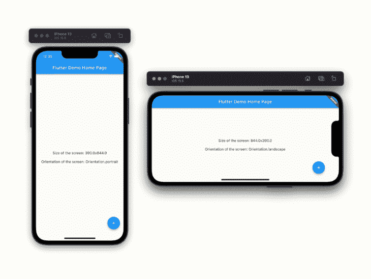
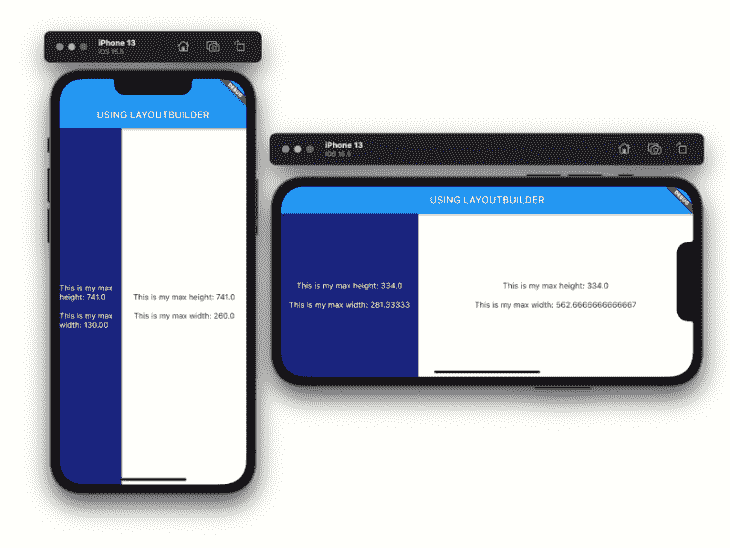
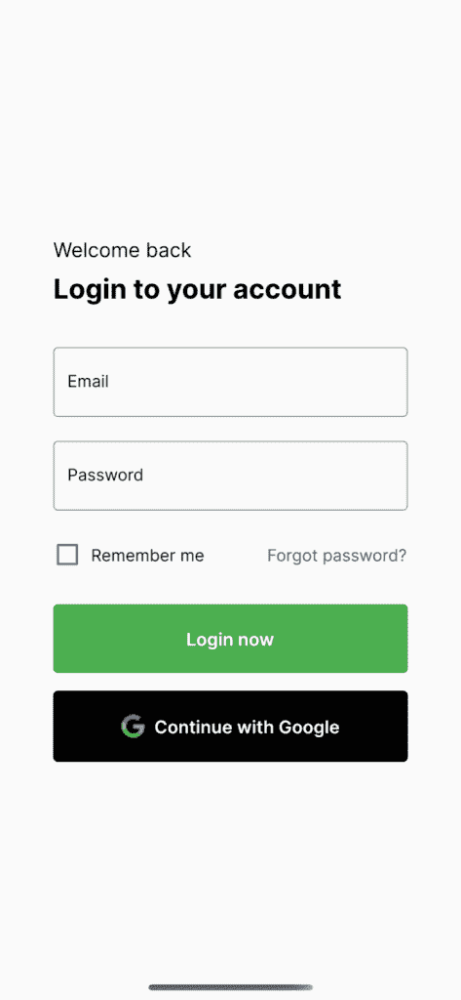
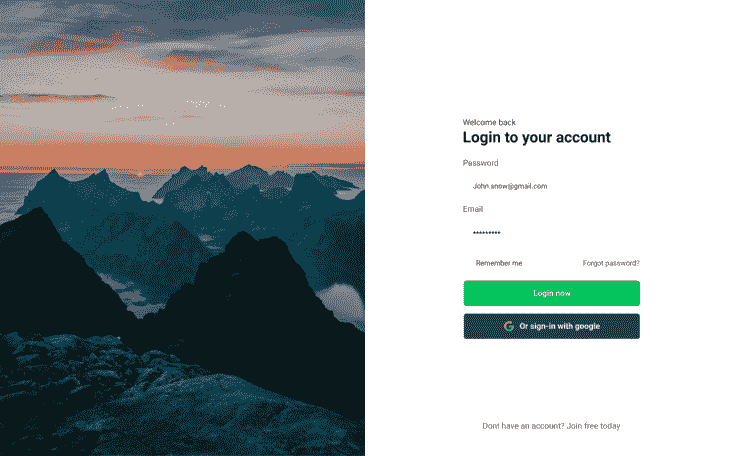
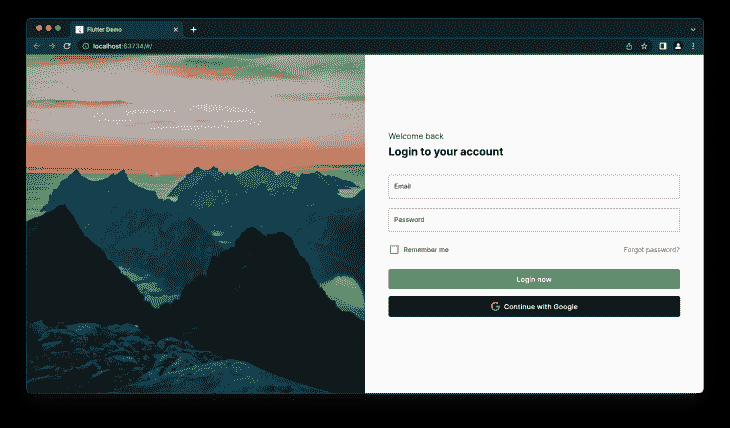
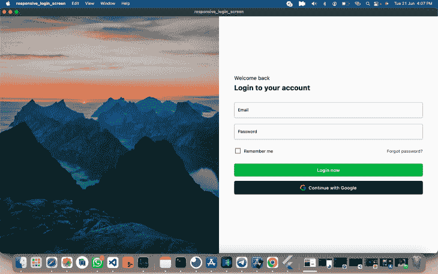
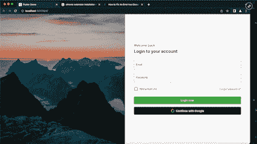

# 在 Flutter 中构建响应性登录页面

> 原文：<https://blog.logrocket.com/building-responsive-login-page-flutter/>

作为一个跨平台的应用程序框架，Flutter 允许你使用一个代码库在任何平台上开发外观和感觉都很棒的应用程序。随着 Flutter 3.0 的发布，我们现在可以完全稳定地运行 Windows、macOS 和 web。

这意味着，在为这些平台开发应用程序时，我们必须考虑到不同的设备规格，并确保我们的应用程序的吸引力是一致的，并为用户提供无缝的体验。

考虑到这一点，Flutter 提供了各种小部件和类，用于在应用程序中创建响应性布局；包括`MediaQuery`、`LayoutBuilder`、`Expanded`、`Flexible`、`AspectRatio`。

在本文中，我们将研究如何使用 Flutter 团队推荐的两种主要方法，即`MediaQuery`和`LayoutBuilder`类，来构建一个响应性登录页面。

在继续之前，我建议您确保满足以下先决条件，以便继续学习本教程:

那么，所有这些都解决了，让我们开始吧。

### 目录

MediaQuery 类有一个`.of`方法，它接受一个上下文，并允许您访问当前应用程序的大小(宽度/高度)和方向(纵向/横向)。

这里有一个例子:

```
//...
class _MyHomePageState extends State<MyHomePage> {
  @override
  Widget build(BuildContext context) {
    final size = MediaQuery.of(context).size; //getting the size property
    final orientation = MediaQuery.of(context).orientation; //getting the orientation
    return Scaffold(
      appBar: AppBar(
        title: Text(widget.title),
      ),
      body: Center(
        child: Column(
          mainAxisAlignment: MainAxisAlignment.center,
          children: <Widget>[
            Text('Size of the screen: ${size.width}x${size.height}',
                style: const TextStyle(fontSize: 16)),
            const SizedBox(height: 20),
            Text('Orientation of the screen: $orientation',
                style: const TextStyle(fontSize: 16)),
          ],
        ),
      ),
      floatingActionButton: FloatingActionButton(
        onPressed: incrementCounter,
        tooltip: 'Increment',
        child: const Icon(Icons.add),
      ),
    );
  }
}

```



Using MediaQuery class

## layyoutubeilder 类

LayoutBuilder 类有一个 Builder 属性，允许我们访问一个`BoxConstraint`对象。

该对象包含特定小部件的约束信息，可用于计算小部件的`maxWidth`和`maxHeight`。这些值对于根据分配给小部件的大小约束来调整我们的显示至关重要。

这里有一个例子:

```
//...
class _MyHomePageState extends State<MyHomePage> {
  @override
  Widget build(BuildContext context) {
    return Scaffold(
      appBar: AppBar(
        title: const Text('USING LAYOUTBUILDER'),
      ),
      body: Row(
        children: [
          Expanded(
            flex: 2,
            child: LayoutBuilder(builder: (context, constraints) {
              return Container(
                width: constraints.maxWidth,
                height: constraints.maxHeight,
                color: Colors.indigo.shade900,
                child: Column(
                  mainAxisAlignment: MainAxisAlignment.center,
                  children: <Widget>[
                    Center(
                      child: Text(
                          'This is my max height: ${constraints.maxHeight}',
                          style: const TextStyle(
                              fontSize: 16, color: Colors.white)),
                    ),
                    const SizedBox(height: 20),
                    Center(
                      child: Text(
                          'This is my max width: ${constraints.maxWidth.toStringAsFixed(2)}',
                          style: const TextStyle(
                              fontSize: 16, color: Colors.white)),
                    ),
                  ],
                ),
              );
            }),
          ),
          Expanded(
            flex: 4,
            child: LayoutBuilder(builder: (context, constraints) {
              return Container(
                width: constraints.maxWidth,
                height: constraints.maxHeight,
                color: Colors.white,
                child: Column(
                  mainAxisAlignment: MainAxisAlignment.center,
                  children: <Widget>[
                    Text('This is my max height: ${constraints.maxHeight}',
                        style: const TextStyle(fontSize: 16)),
                    const SizedBox(height: 20),
                    Text('This is my max width: ${constraints.maxWidth}',
                        style: const TextStyle(fontSize: 16)),
                  ],
                ),
              );
            }),
          ),
        ],
      ),
    );
  }
}

```



Using LayoutBuilder widget

现在我们已经对它们的功能有了一个大致的概念，让我们使用它们来构建一个在所有平台上都很棒的响应性登录页面。

## 项目设置

首先，我们将构建一个类似于下图的简单登录屏幕:



Mobile View



Web/Desktop View
Photo by Daniel on [Figma Community](https://www.figma.com/community/file/836569395944745131)

现在，让我们创建一个新的 Flutter 项目，并将以下代码粘贴到您的`main.dart`文件中，作为我们应用程序的起点:

```
import 'package:flutter/material.dart';

void main() {
  runApp(const MyApp());
}

class MyApp extends StatelessWidget {
  const MyApp({Key? key}) : super(key: key);
  // This widget is the root of your application.
  @override
  Widget build(BuildContext context) {
    return MaterialApp(
      title: 'Flutter Demo',
      debugShowCheckedModeBanner: false,
      theme: ThemeData(
        primarySwatch: Colors.blue,
      ),
      home: const LoginScreen(), //<--
    );
  }
}

```

注意，在上面的代码片段中，我们有一个`LoginScreen`小部件；现在让我们创建`LoginScreen`小部件。这个小部件可以容纳我们的`LayoutBuilder`类，以及我们如何根据设备尺寸规格返回不同的屏幕。

```
class LoginScreen extends StatelessWidget {
  const LoginScreen({Key? key}) : super(key: key);
  @override
  Widget build(BuildContext context) {
    return Scaffold(
      body: LayoutBuilder(
        builder: (context, constraints) {
          if (constraints.maxWidth < 600) {
            return const LoginMobile();
          } else if (constraints.maxWidth > 600 && constraints.maxWidth < 900) {
            return const LoginTablet();
          } else {
            return const LoginDesktop();
          }
        },
      ),
    );
  }
}

```

从上面的代码片段中，注意我们如何设置宽度断点，然后使用从`LayoutBuilder`小部件派生的约束对象来检查设备`maxWidth`值是大于还是小于宽度断点，并根据需要返回适当的小部件。

在我们的例子中，如果`maxWidth`小于 600，我们返回移动视图，如果在 600 和 900 之间，返回平板视图，否则返回桌面/网络视图。

## 移动/平板电脑视图

`LoginMobile`小部件基本上有两个`TextFormField`小部件作为我们的`email`和`password`字段，以及一个处理事件提交的按钮，如下面的代码片段所示。

移动和平板视图本质上呈现的是相同的东西，所以为了简洁起见，我不包括平板视图代码。

```
class _LoginMobileState extends State<LoginMobile> {
  bool _isChecked = false;
  @override
  Widget build(BuildContext context) {
    return Center(
      child: SingleChildScrollView(
        child: Padding(
          padding: const EdgeInsets.all(30),
          child: Center(
            child: SizedBox(
              width: 300,
              child: Column(
                mainAxisAlignment: MainAxisAlignment.center,
                crossAxisAlignment: CrossAxisAlignment.stretch,
                children: [
                  Text(
                    'Welcome back',
                    style: GoogleFonts.inter(
                      fontSize: 17,
                      color: Colors.black,
                    ),
                  ),
                  const SizedBox(height: 8),
                  Text(
                    'Login to your account',
                    style: GoogleFonts.inter(
                      fontSize: 23,
                      color: Colors.black,
                      fontWeight: FontWeight.w700,
                    ),
                  ),
                  const SizedBox(height: 35),
                  TextFormField(
                   //...
                  ),
                  const SizedBox(height: 20),
                  TextFormField(
                   //...
                  ),
                  const SizedBox(height: 25),
                  Row(
                    //...
                  ),
                  const SizedBox(height: 30),
                  TextButton(
                   //...
                  ),
                  const SizedBox(height: 15),
                  TextButton(
                  //...
                  ),
                ],
              ),
            ),
          ),
        ),
      ),
    );
  }
}

```

## 网络/桌面视图

对于 web 视图，我们将显示一个带有图像和我们之前创建的登录组件的分屏。我们通过使用一个`Row`小部件将它们并排放置，然后用一个`Expanded`小部件将两边包装起来，以占据剩余的空闲空间。

```
//...
class _LoginDesktopState extends State<LoginDesktop> {
  //...
  bool _isChecked = false;
  @override
  Widget build(BuildContext context) {
    return Row(
      children: [
        Expanded( //<-- Expanded widget
          child: Image.asset(
             'assets/image 1.png', 
             fit: BoxFit.cover,
        )),
        Expanded( //<-- Expanded widget
          child: Container(
            constraints: const BoxConstraints(maxWidth: 21),
            padding: const EdgeInsets.symmetric(horizontal: 50),
            child: Column(
              mainAxisAlignment: MainAxisAlignment.center,
              crossAxisAlignment: CrossAxisAlignment.stretch,
              children: [
                Text(
                  'Welcome back',
                  style: GoogleFonts.inter(
                    fontSize: 17,
                    color: Colors.black,
                  ),
                ),
                const SizedBox(height: 8),
                Text(
                  'Login to your account',
                  style: GoogleFonts.inter(
                    fontSize: 23,
                    color: Colors.black,
                    fontWeight: FontWeight.w700,
                  ),
                ),
                const SizedBox(height: 35),
                TextField(
                 //...
                ),
                const SizedBox(height: 20),
                TextField(
                 //...
                ),
                const SizedBox(height: 25),
                Row(
                  //...
                ),
                const SizedBox(height: 30),
                TextButton(
                  //...
                ),
                const SizedBox(height: 15),
                TextButton(
                 //...
                ),
              ],
            ),
          ),
        ),
      ],
    );
  }
}

```



Web view:



Desktop (macOS) view:



## 结论

在你的应用中实现响应性使它看起来一致，并给用户一个无缝的体验，我们已经看到了多种处理响应性的方法。您还可以查看响应式包，如[响应式*构建器*](https://pub.dev/packages/responsive_builder) 、[响应器](https://pub.dev/packages/responsive_sizer)和[响应式框架](https://pub.dev/packages/responsive_framework)。

这是我们制作的示例项目的 GitHub 链接:

[https://github.com/dev-tayy/responsive*登录*屏幕](https://github.com/dev-tayy/responsiveloginscreen)

## 使用 [LogRocket](https://lp.logrocket.com/blg/signup) 消除传统错误报告的干扰

[](https://lp.logrocket.com/blg/signup)

[LogRocket](https://lp.logrocket.com/blg/signup) 是一个数字体验分析解决方案，它可以保护您免受数百个假阳性错误警报的影响，只针对几个真正重要的项目。LogRocket 会告诉您应用程序中实际影响用户的最具影响力的 bug 和 UX 问题。

然后，使用具有深层技术遥测的会话重放来确切地查看用户看到了什么以及是什么导致了问题，就像你在他们身后看一样。

LogRocket 自动聚合客户端错误、JS 异常、前端性能指标和用户交互。然后 LogRocket 使用机器学习来告诉你哪些问题正在影响大多数用户，并提供你需要修复它的上下文。

关注重要的 bug—[今天就试试 LogRocket】。](https://lp.logrocket.com/blg/signup-issue-free)