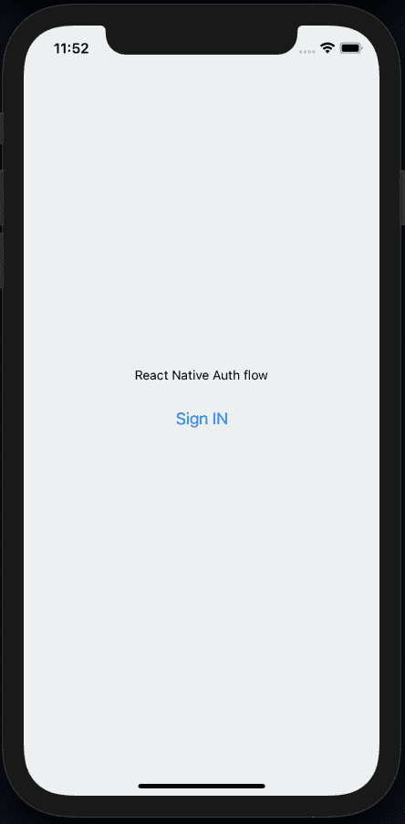
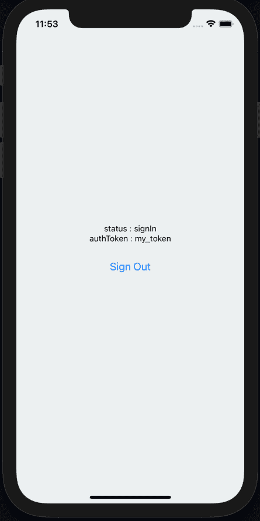

# 在 React Native 中构建可重用的认证流

> 原文：<https://blog.logrocket.com/building-reusable-auth-flow-react-native/>

在开始一个新的应用程序开发项目时获得正确的身份验证流程可以节省大量的时间。为此，今天我们将学习如何在 React Native 中创建一个可重用的 auth 流。

本教程的目标是演示如何从头到尾建立一个基本但真实的授权流。结果将是一个通用的解决方案，可以处理大多数身份验证用例，我们可以很容易地将其复制粘贴到我们的下一个项目中。

### 要求

要遵循本教程，请确保您的开发设置包括以下配置:

*   安装的节点版本≥10.x.x
*   一个包管理器，如 npm 或 Yarn
*   `react-native-cli`安装在您的本地机器上

请注意，我们在本教程中使用的是 [React 原生版本 0.64.0](https://blog.logrocket.com/whats-new-in-react-native-0-64/) ，所以让你使用的是版本≥0.60.x。

对于在本地机器上为 React Native 设置开发环境的完整演练，您可以在这里浏览官方文档。

## 反应本地项目设置

我们现在将创建一个新的 React 本地项目。首先，我们将创建一个目录来包含我们所有的代码，然后`cd`进入那个目录。我们选择了`RNauthflow`作为应用程序名称，并将在整个教程中使用这个名称，但是您可以使用您喜欢的任何名称。

运行此命令创建基本项目文件和配置:

```
npx react-native init RNauthflow
# navigate to project directory
cd RNauthflow

```

完成基本项目设置后，我们可以安装运行和构建演示应用程序所需的所有依赖项:

```
# for navigation

yarn add @react-navigation/native @react-navigation/stack react-native-reanimated react-native-gesture-handler react-native-screens react-native-safe-area-context @react-native-community/masked-view

```

如果你不熟悉的话，在 React 本地项目中使用 React 导航是值得一读的。为了在 iOS 上完成安装，你必须安装 pods(注意，确保你已经安装了[cocoa pods](https://cocoapods.org/))。

```
cd ios/ && pod install
# once pod dependency installed
cd ..
# to run on ios 
react-native run-ios
# to run in android
react-native run-andriod

```

## 创建一个实用函数来存储令牌

为了在这里存储令牌，我们使用了`react-native-async-storage/async-storage` npm 包。
不过，目前已经有针对 Android 和 iOS 平台的解决方案。

要开始使用，首先安装`react-native-async-storage/async-storage`:

```
yarn add @react-native-async-storage/async-storage  

```

然后，我们可以像这样轻松地实现我们的助手函数:

```
// async-storage.js file
import AsyncStorage from '@react-native-async-storage/async-storage';
export async function getItem() {
  const value = await AsyncStorage.getItem('token');
  return value ? JSON.parse(value) : null;
}
export async function setItem(value) {
  return AsyncStorage.setItem('token', JSON.stringify(value));
}
export async function removeItem() {
  return AsyncStorage.removeItem('token');
}

```

## 创建身份验证上下文

注意，我们没有使用任何库来管理我们的项目状态。我们可以使用任何我们想要的状态管理库，但是这里我们将使用 React Context API，它提供了一种在组件之间共享值的方法，而不必通过树的每一层显式地传递一个属性。

首先，我们创建一个简单的 auth 上下文并实现提供者组件。我们
在我们的 auth 上下文中有`status`、`authToken`、`signIn`和`signOut`。我们正在使用`useReducer`方法来更新状态，这将有助于使我们的代码干净并且易于遵循。

我们用`useMemo`钩子创建了我们的 auth 动作来记忆它们。这种优化有助于避免在每次渲染时生成新的实例。最后，我们使用`AuthProvider`来包装我们的应用程序:

```
/**
* AuthProvider.js file
*
**/
import * as React from 'react';
import {
  getItem as getToken,
  setItem as setToken,
  removeItem as removeToken,
} from './async-storage';
const AuthContext = React.createContext({
  status: 'idle',
  authToken: null,
  signIn: () => {},
  signOut: () => {},
});
export const useAuthorization = () => {
  const context = React.useContext(AuthContext);
  if (!context) {
    throw new Error('Error');
  }
  return context;
};
export const AuthProvider = props => {
  const [state, dispatch] = React.useReducer(reducer, {
    status: 'idle',
    authToken: null,
  });
  React.useEffect(() => {
    const initState = async () => {
      try {
        const authToken = await getToken();
        if (authToken !== null) {
          dispatch({type: 'SIGN_IN', token: authToken});
        } else {
          dispatch({type: 'SIGN_OUT'});
        }
      } catch (e) {
        console.log(e);
      }
    };
    initState();
  }, [state, dispatch]);
  const actions = React.useMemo(
    () => ({
      signIn: async token => {
        dispatch({type: 'SIGN_IN', token});
        await setToken(token);
      },
      signOut: async () => {
        dispatch({type: 'SIGN_OUT'});
        await removeToken();
      },
    }),
    [state, dispatch],
  );
  return (
    <AuthContext.Provider value={{...state, ...actions}}>
      {props.children}
    </AuthContext.Provider>
  );
};
const reducer = (state, action) => {
  switch (action.type) {
    case 'SIGN_OUT':
      return {
        ...state,
        status: 'signOut',
        authToken: null,
      };
    case 'SIGN_IN':
      return {
        ...state,
        status: 'signIn',
        authToken: action.token,
      };
  }
};

```

## 添加屏幕和导航

让我们在`src/screens/`目录中创建两个新的屏幕，`HomeScreen`和`LoginScreen`。如果用户没有通过身份验证，这个屏幕组件将负责显示一个登录屏幕。一旦用户获得授权，他们将能够访问主屏幕。

这里我们使用的是 React Navigation v5。它遵循一种更加基于组件的方法，使用一个`NavigatorContainer`和一个`createStackNavigator`实例:

```
/**
* Home.js file
*
*/
import * as React from 'react';
import {NavigationContainer} from '@react-navigation/native';
import {createStackNavigator} from '@react-navigation/stack';
import {HomeScreen, LoginScreen} from '../screens';
const Stack = createStackNavigator();
export function Home() {
  return (
    <NavigationContainer>
      <Stack.Navigator initialRouteName="Root" headerMode="none">
        <Stack.Screen name="Home" component={HomeScreen} />
        <Stack.Screen name="Auth" component={LoginScreen} />
      </Stack.Navigator>
    </NavigationContainer>
  );
}

```

如果我们在模拟器或设备上检查应用程序，我们应该会看到类似下面的输出:



The login screen.



The home screen.

要使用这个解决方案，我们需要用`AuthProvider`包装我们的`Root(App)`组件，并且我们可以开始使用我们的可重用授权流。

```
export default function App() {
  return (
    <AuthProvider>
      <Home />
    </AuthProvider>
  );
}

```

## 结论

现在，我们已经成功地创建了一个通用的、可重用的授权流。我们还学习了如何配置 React 导航和使用其基于组件的方法。我们可以继续使用 Firebase、Okta、Auth0 和其他工具部署这个可重用的授权流。

最后但同样重要的是，你可以在 [GitHub repo 这里](https://github.com/mukeshmandiwal/RNauthflow)找到这个演示中使用的完整代码。

## [LogRocket](https://lp.logrocket.com/blg/react-native-signup) :即时重现 React 原生应用中的问题。

[](https://lp.logrocket.com/blg/react-native-signup)

[LogRocket](https://lp.logrocket.com/blg/react-native-signup) 是一款 React 原生监控解决方案，可帮助您即时重现问题、确定 bug 的优先级并了解 React 原生应用的性能。

LogRocket 还可以向你展示用户是如何与你的应用程序互动的，从而帮助你提高转化率和产品使用率。LogRocket 的产品分析功能揭示了用户不完成特定流程或不采用新功能的原因。

开始主动监控您的 React 原生应用— [免费试用 LogRocket】。](https://lp.logrocket.com/blg/react-native-signup)