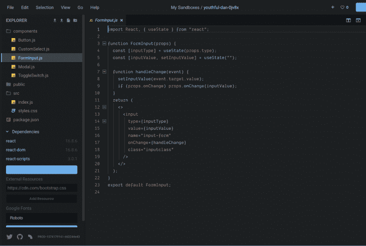
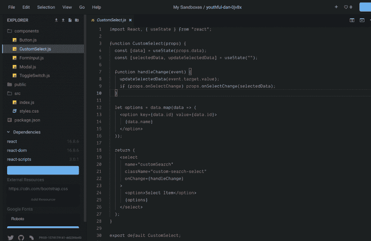
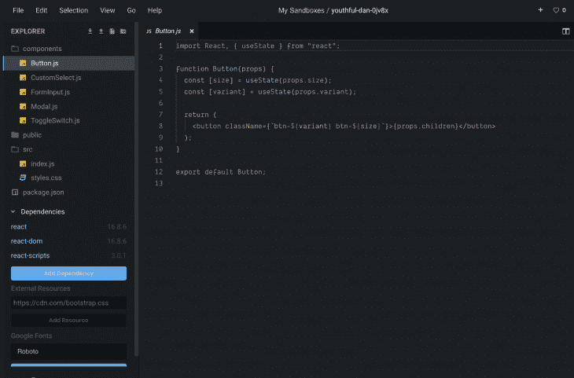
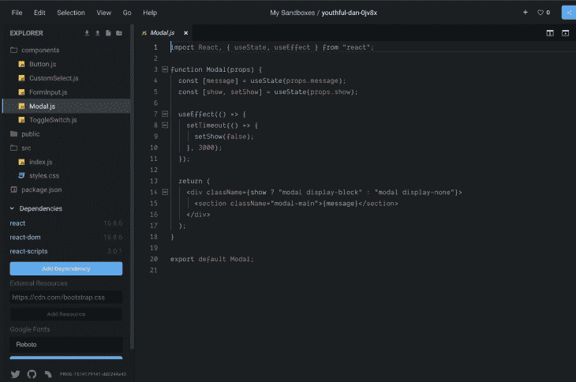
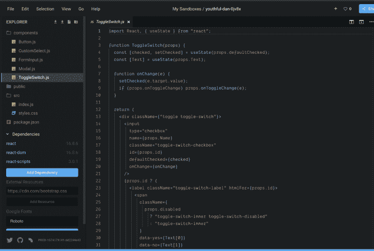

# 用 React 钩子构建可重用的 UI 组件

> 原文：<https://blog.logrocket.com/building-reusable-ui-components-with-react-hooks/>

在 React 中，可重用组件是一个 UI，可以在应用程序的不同部分使用，以构建多个 UI 实例。例如，我们可以在应用程序的几个部分用不同的颜色显示一个按钮组件。尽管当我们为它提供一个数据集(例如颜色或函数)时，它是同一个按钮组件，但它会修改自身并输出该元素的 UI 实例。

这种创建 React 组件的模式是伸缩所必需的。它通过确保编写更少的代码、更快的开发、更简单的代码库以及无压力的维护来帮助节省时间。

在本教程中，我们将构建可重用的 React 组件，这些组件可以在整个项目中使用，以保持逻辑和表示的一致性。我们将使用钩子来管理和操作状态数据。

> 本文假设您对 React 有基本的了解。如果你没有任何使用 React 的经验，可以参考文档[这里](https://reactjs.org/docs/getting-started.html)开始使用。在这个项目中使用的所有例子都可以在[这个沙盒。](https://codesandbox.io/s/reusable-components-with-hooks-7seuf)

## 入门指南

在教程的这一部分，我们将创建各种 HTML 元素作为可重用的组件。我们将使用 CodeSandbox。你可以在这里创建一个新的沙箱[来开始。](https://codesandbox.io/s/new)

## 输入组件

创建可重用输入组件的一个优点是，您可以在应用程序的各个部分保持输入的外观。您还可以通过向输入组件传递一个属性来确定应该呈现什么类型的输入组件(文本、电子邮件等)。虽然我们不会在本教程中深入探讨样式，但是您可以定制您的组件以满足您的视觉需求。

在新创建的沙盒项目中，创建一个带有`FormInput.js`文件的组件文件夹，并向其中添加以下代码:

```
// ./components/FormInput.js
import React, {useState} from "react";

function FormInput(props) {
  const [inputType] = useState(props.type)
  const [inputValue, setInputValue] = useState('')

  function handleChange(event){
    setInputValue(event.target.value);
    if(props.onChange) props.onChange(inputValue)
  }
  return (
    <>
      <input type={inputType} value={inputValue} name="input-form" onChange={handleChange} class="inputclass"/>
    </>
  );
}
export default TextInput;
```

对于可重用的组件，它必须接收数据或数据集(通过 props)并返回输出(通常通过 props 传递的函数)。建议将可变状态保存在组件的 state 属性中，以确保它们正常工作。

上面的`FormInput()`组件接收一个输入类型，以确定呈现什么类型的输入元素(电子邮件、文本等)。它还采用了一个方法`onChange()`来接收从输入端发回的值。

该组件在本地管理其值，并且只将更新后的状态值返回给调用它的组件。

为了实现这一点，我们创建了一个本地函数`handleChange()`。该函数检查通过 props 接收状态数据的方法是否可用，然后将当前状态数据发送给它进行进一步处理。



## 自定义选择组件

在 components 文件夹中，创建一个`CustomSelect.js`文件，并向其中添加以下代码:

```
// ./components/CustomSelect.js
import React, { useState } from "react";
function CustomSelect(props) {
  const [data] = useState(props.data);
  const [selectedData, updateSelectedData] = useState("");
  function handleChange(event) {
    updateSelectedData(event.target.value);
    if (props.onSelectChange) props.onSelectChange(selectedData);
  }
  let options = data.map(data => (
    <option key={data.id} value={data.id}>
      {data.name}
    </option>
  ));
  return (
    <select
      name="customSearch"
      className="custom-search-select"
      onChange={handleChange}
    >
      <option>Select Item</option>
      {options}
    </select>
  );
}
export default CustomSelect;
```

上面，我们通过 props 接收了 select 元素中 options 标签所需的数据集。为了构建选项标记，我们通过 props 遍历数据集，在将它作为 select 标记的一部分呈现之前构建它。

标签的状态(当前选择的选项)存储在本地，当它通过我们的本地函数`handleChange()`改变时，更新并作为输出发送回来。



## 按钮组件

一个可重用的按钮可以用来显示不同的颜色变量或大小，只要它在你的应用程序中使用。在 components 文件夹中，创建一个`Button.js`文件，并向其中添加以下代码:

```
// ./components/Button.js
import React, { useState } from "react";
function Button(props) {
  const [size] = useState(props.size);
  const [variant] = useState(props.variant);
  return (
    <button className={`btn-${variant} btn-${size}`}>{props.children}</button>
  );
}
export default Button;
```

我们的按钮通过 props 接收三个属性。variant(用于确定按钮颜色)，size (lg，xs，sm)确定按钮的大小。我们使用 React 的内置子属性(props.children)动态显示按钮内容。



## 模态分量

模式组件适合在应用程序中发送警报。在 components 文件夹中，创建一个`Modal.js`文件，并向其中添加以下代码:

```
// ./components/Modal.js
import React, { useState, useEffect } from "react";
function Modal(props) {
  const [message] = useState(props.message);
  const [show, setShow] = useState(props.show);
  useEffect(() => {
    setTimeout(() => {
      setShow(false);
    }, 3000);
  });
  return (
    <div className={show ? "modal display-block" : "modal display-none"}>
      <section className="modal-main">{message}</section>
    </div>
  );
}
export default Modal;
```

我们的模态组件做两件事:

*   它接收一个布尔值来决定它是否弹出
*   它还接收弹出时要显示的消息

要关闭模态，我们需要将显示状态设置为 false。我们可以在几秒钟后调用`[useEffect()](https://reactjs.org/docs/hooks-effect.html)`钩子中的`setTimeout()`函数来实现。



## 切换组件

toggle 组件用于需要正确或错误答案的情况。它是一个基本的表单组件。

在 components 文件夹中，创建一个`ToggleSwitch.js`文件，并向其中添加以下代码:

```
// ./components/ToggleSwitch.js
import React, { useState } from "react";
function ToggleSwitch(props) {
  const [checked, setChecked] = useState(props.defaultChecked);
  const [Text] = useState(props.Text);
  function onChange(e) {
    setChecked(e.target.value);
    if (props.onToggleChange) props.onToggleChange(checked);
  }
  return (
    <div className={"toggle toggle-switch"}>
      <input
        type="checkbox"
        name={props.Name}
        className="toggle-switch-checkbox"
        id={props.id}
        defaultChecked={checked}
        onChange={onChange}
      />
      {props.id ? (
        <label className="toggle-switch-label" htmlFor={props.id}>
          <span
            className={
              props.disabled
                ? "toggle-switch-inner toggle-switch-disabled"
                : "toggle-switch-inner"
            }
            data-yes={Text[0]}
            data-no={Text[1]}
          />
          <span
            className={
              props.disabled
                ? "toggle-switch-switch toggle-switch-disabled"
                : "toggle-switch-switch"
            }
          />
        </label>
      ) : null}
    </div>
  );
}
export default ToggleSwitch;
```

我们的 toggle 组件接收以下道具:

*   **ID(必选)**:这是将要传递给复选框输入控件的 ID。没有这个，组件不会渲染
*   **Text(必选)**:切换开关包含两个值的数组，表示真和假的文本
*   **Name(可选)**:这将是复选框输入的标签文本
*   **onChange(可选)**:用于接收组件返回的数据
*   **Checked(可选)**:这将直接传递给元素以获取其当前状态
*   **禁用(可选)**:用于设置按钮的状态

当它改变时，我们更新状态，并通过 props 将值从父组件发送到事件监听器。



## 使用组件

要使用我们刚刚创建的组件，我们需要从父组件中呈现它们，并将相关数据传递给它们。将以下内容添加到您的`index.js`:

```
// ./index.js
import React, { useState } from "react";
import ReactDOM from "react-dom";
import FormInput from "../components/FormInput.js";
import CustomSelect from "../components/CustomSelect.js";
import ToggleSwitch from "../components/ToggleSwitch.js";
import Button from "../components/Button.js";
import Modal from "../components/Modal.js";
import "./styles.css";
function App() {
  const data = [
    {
      id: "1",
      name: "One"
    },
    {
      id: "2",
      name: "Two"
    },
    {
      id: "3",
      name: "Three"
    },
    {
      id: "4",
      name: "Four"
    }
  ];
  function handleChange(event) {
    console.log(event.target.value);
  }
  function onSelectChange(event) {
    console.log(event.target.value);
  }
  function onToggleChange(event) {
    console.log(event.target.checked);
  }
  return (
    <div className="App">
      <form>
        <Modal show={true} message={"Hello"}>
          <p>THIS IS A MODAL</p>
        </Modal>
        <FormInput type={"text"} onChange={handleChange} />
        <FormInput type={"email"} onChange={handleChange} />
        <div>
          <CustomSelect data={data} onSelectChange={onSelectChange} />
        </div>
        <div>
          <ToggleSwitch
            id="id"
            defaultChecked={false}
            disabled={false}
            Text={["Yes", "No"]}
            onToggleChange={onToggleChange}
          />
        </div>
        <Button variant="danger" size={"sm"} >Small Button</Button>
        <Button variant="primary" size={"lg"} >Smaller Button</Button>
        <Button variant="warning" size={"xs"} >Big Button</Button>
      </form>
    </div>
  );
}
const rootElement = document.getElementById("root");
ReactDOM.render(<App />, rootElement);
```

### 您应该会看到以下内容:

## 结论

## 在本教程中，我们学习了如何创建可重用的 React 组件。这些知识可以用来创建高度可伸缩和一致的 React 应用程序。我们还使用钩子来管理和操作状态数据。你可以在 this [CodeSandbox 项目](https://codesandbox.io/s/reusable-components-with-hooks-7seuf)中找到本文中使用的所有代码示例。

要阅读更多关于钩子和 React 组件的内容，请查看这里的文档。

使用 LogRocket 消除传统反应错误报告的噪音

## 是一款 React analytics 解决方案，可保护您免受数百个误报错误警报的影响，只针对少数真正重要的项目。LogRocket 告诉您 React 应用程序中实际影响用户的最具影响力的 bug 和 UX 问题。

[LogRocket](https://lp.logrocket.com/blg/react-signup-issue-free)

自动聚合客户端错误、反应错误边界、还原状态、缓慢的组件加载时间、JS 异常、前端性能指标和用户交互。然后，LogRocket 使用机器学习来通知您影响大多数用户的最具影响力的问题，并提供您修复它所需的上下文。

[ ](https://lp.logrocket.com/blg/react-signup-general) [  ](https://lp.logrocket.com/blg/react-signup-general) [LogRocket](https://lp.logrocket.com/blg/react-signup-issue-free)

关注重要的 React bug—[今天就试试 LogRocket】。](https://lp.logrocket.com/blg/react-signup-issue-free)

Focus on the React bugs that matter — [try LogRocket today](https://lp.logrocket.com/blg/react-signup-issue-free).