# 用 Stencil.js 构建可重用的 web 组件

> 原文：<https://blog.logrocket.com/building-reusable-web-components-with-stencil-js/>

[Stencil](https://stenciljs.com/) 是由 [Ionic 团队](https://ionicframework.com/team)开发的用于生成 web 组件的编译器。Stencil 中的 Web 组件可以用作独立组件，作为 Stencil web 应用程序的一部分，以及作为 Ionic progressive web 应用程序的一部分。

根据 Ionic 团队的说法，Stencil 不应该被称为框架，但在我看来它很像框架:)。

一个 web 组件(如果你错过了的话)只不过是一个定制的 HTML 标签()，用 JavaScript 编写了额外的逻辑。

Stencil 中的组件用 **TypeScript** 编写，然后编译成各种版本的 JavaScript。编译器生成的各种包旨在用于不同的场景。涵盖了所有内容，从带有 polyfills 的旧浏览器到带有所有闪亮 JavaScript 特性的新浏览器。角度与[差载](https://angular.io/guide/deployment#differential-loading)相同。

模板看起来像反应和角的混合物。两个团队的开发人员会发现许多熟悉的概念和关键词，正因为如此，学习 Stencil 应该很容易。

在这个介绍性的例子中，我们可以用一个使用 JSX 的渲染方法来发现一个组件装饰器。

```
import { Component, Prop, h } from '@stencil/core';

@Component({
  tag: 'my-first-component',
})
export class MyComponent {

  // Indicate that name should be a public property on the component
  @Prop() name: string;

  render() {
    return (
      <p>
        My name is {this.name}
      </p>
    );
  }
}
```

并且`Prop`在角度上与`Input`标签相似。

### 模具:

*   可以与所有主要的前端框架结合，也可以与其他 JavaScript 库结合，或者根本没有库
*   它不需要运行时间(像 Angular，React，Vue…)。使用一个生成的 JavaScript 包就足够了
*   它与[自定义元素 v1](https://developers.google.com/web/fundamentals/web-components/customelements) 的实现完全一致
*   生产包的大小从大约 100 kb 开始，polyfills 的大小为大约 133 kb(我们可以压缩它)

## 浏览器支持

一般来说，所有主流浏览器都支持 web 组件(和模板)。从 12 到 18 的(在 WebKit 实现之前)的 [Edge 版本不支持它们。不管怎样，它只占世界上所有使用过的浏览器的 2%。](https://caniuse.com/#search=web%20components)

Stencil 的主要用户是 Ionic framework，[它的所有 UI 组件都是使用 Stencil](https://github.com/ionic-team/ionic/tree/master/core/src/components) 构建的。通过前面的链接，浏览其中的几个，看看他们是怎么做的。阅读高质量的代码是一种很好的学习方式。

## 入门指南

**模板**提供了开箱即用的工具。它附带了一个集成开发服务器、一个组件生成器、一个各种包的编译器、一个文档生成器和一个测试套件。

## 先决条件

我们必须安装最新的 LTS 版本的节点和 NPM，以便与它合作。您应该首先验证您所拥有的:

```
node -v
npm -v
```

确保我们有 [Node.js](https://nodejs.org/en/download/) ≥ 12 和 [NPM](https://www.npmjs.com/get-npm) 版本≥ 6。

我们必须将 Stencil 作为一个全局包安装:

```
npm install -g stencil
```

组件的扩展是 TSX，因为它使用 JSX 作为模板语言。

现在，如果我们想要生成我们的项目，我们将不得不使用由 Stencil through NPM init 提供的交互式向导:

```
npm init stencil
```

为了演示它的用法，让我们构建一个简单的加密货币小部件。

我们想要构建一个可重用的组件，所以我们将选择第三个选项，**组件**。

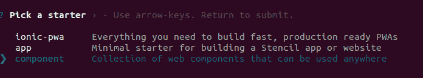

几秒钟后，您应该会看到:

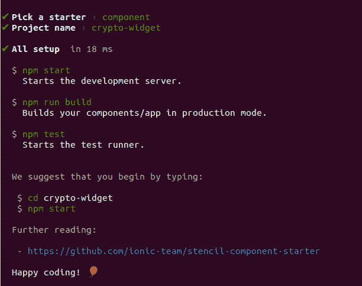

## 创建组件

首先，我们将从代码中删除生成的组件`my-component`。可以随意删除。

之后，使用 **npm run generate** ，我们将生成我们的第一个组件:

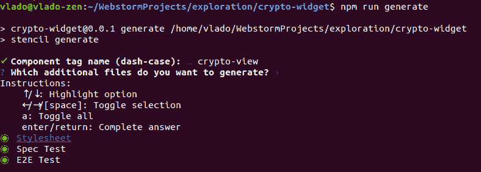

重要的是我们的组件有一个带破折号的名称。在我们的例子中，它是**加密视图**。这将是我们定制的 HTML 标签的名字<加密视图></加密视图>。

手动地，我们必须替换`src/index.html`中从`my-component`到`crypto-view`的引用，以便让开发服务器再次工作:

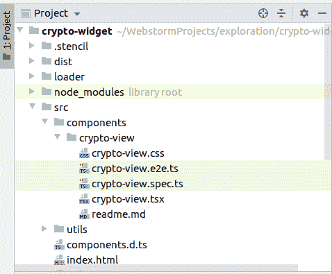

这是我们生成的组件的样子:

```
import { Component, Host, h } from '@stencil/core';

@Component({
  tag: 'crypto-view',
  styleUrl: 'crypto-view.css',
  shadow: true
})
export class CryptoView {

  render() {
    return (
      <Host>
        <slot></slot>
      </Host>
    );
  }

}
```

我们可以立即发现我们的`@Component`装饰器设置`shadow: true`。我们的主(入口)组件有这个设置是非常重要的。基本上，这意味着这个元素将通过影子根与页面中的 DOM 的其余部分隔离开来:

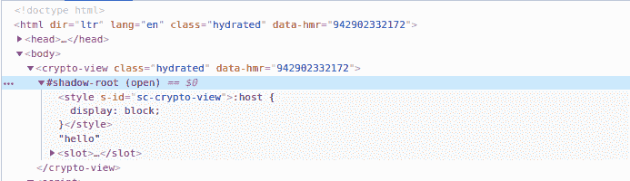

这进一步意味着在`crypto-view.css`中定义的样式将不会被应用到 crypto-view 组件之外的任何元素。

在 render 方法中，我们有:

```
render() {
  return (
    <Host>
      <slot></slot>
    </Host>
  );
}
```

`Host`顾名思义，指主机组件。在我们的例子中，它是<加密视图>元素。看看这个简单的例子:

```
render() {
  return (
    <Host class={'hello'}>
      <slot></slot>
    </Host>
  );
}
```

这将在 crptyo-view 组件上追加类 hello。


Class hydrated is added by Stenci

在 JSX，我们必须有根(包装)元素。默认情况下，它在模板中是`Host`，但也可以是`DIV`。

在主持人中，我们有`slot`。如果你来自有角的生态系统，`slot`就是`ng-content`。它将投射在<加密视图>…</加密视图>标签之间传递的任何内容。我们可以传递 HTML，子组件或者文本，它会投射到我们定义< slot > < /slot >的地方。

我们也可以有多个插槽，请看这个示例:

```
<ui-component>
  <p slot='my-title'>Title</p>
  <p slot='my-description'>Description</p>
</ui-component>
```

它可以使用 slot 中的 name 属性来呈现:

```
render () {
  return (<div>
    <slot name='my-title' />
    <slot name='my-description' />
  </div>)
}
```

## 半铸钢ˌ钢性铸铁(Cast Semi-Steel)

现在让我们打开 CSS 文件`crypto-view.css`:

```
:host {
  display: block;
}
```

我们会看到只有`:host`被定义。类似于 JSX 代码中的`Host`元素，`:host`指的是一个主机组件< crypto-view >，默认为`display: block`。注意，HTML 中的大多数元素都有`display: block`。现在，当这个被设置时，我们可以通过`:host`指令将任何 CSS 样式应用到一个主机元素。

## 道具(属性)

由于我们必须从某个地方获取加密数据，我们将使用 cryptocompare.com 的 API，因为它提供免费的 API 密钥。

我们将定义的第一个道具是 apiKey。带有骆驼大小写专有名称解析为两个单词，中间有一个破折号，因为骆驼大小写在 HTML 中不受支持，而在 JSX 中受支持。

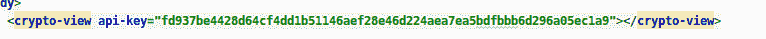

在我们的组件中:

```
import { Component, Host, h, Prop } from '@stencil/core';

@Component({
  tag: 'crypto-view',
  styleUrl: 'crypto-view.css',
  shadow: true
})
export class CryptoView {

  /**
   * Valid API key obtained from cryptocompare.com
   */
  @Prop() apiKey: string;

  componentDidLoad() {
    console.log(this.apiKey);
  }

  render() {
    return (
      <Host>
        <slot></slot>
      </Host>
    );
  }

}
```

## 生命周期方法(挂钩)

注意`componentDidLoad`函数，以及其中的`console.log`。如果我们现在运行应用程序，我们将看到我们的 apiKey 记录在控制台中。

类方法`componentDidLoad`是一个生命周期挂钩。这意味着它在组件生命周期中的某个定义点被触发。来自 React 背景的开发人员会认出这个名字。

以下是一些常用的钩子(模板中的生命周期方法):

*   **componentWillLoad()** 渲染前触发
*   **componentDidLoad()** 渲染后触发(插入到 DOM 中)
*   **componentWillUpdate()** 更新前触发
*   **componentDidUpdate()** 更新后触发
*   **componentDidUnload()** 在卸载(从 DOM 中移除)后触发

我们可以在[模板文档页面上找到生命周期方法](https://stenciljs.com/docs/component-lifecycle)的完整列表和解释。

在我们的例子中，由于 apiKey 不是异步设置的，我们可以使用`componentDidLoad`钩子来获取它的值并调用 API。注意`componentDidLoad`只被调用一次，而有些生命周期方法可以被调用多次。

我们将在`src/utils/utils.ts`中创建函数`getCryptoData`，该函数将获取比特币、以太币和 Ripple 的最新美元和欧元价格。

```
import { CryptoInterface } from '../components/crypto-view/crypto.interface';

export function getCryptoData(apiKey: string): Promise<CryptoInterface> {
  return fetch(`https://min-api.cryptocompare.com/data/pricemulti?fsyms=BTC,ETH,XRP&tsyms=USD,EUR&api_key=${apiKey}`)
    .then(response => response.json());
}
```

来自 API 的响应被映射到接口，以便从 IDE(在我的例子中是 WebStrom)获得类型支持。

```
export interface CryptoInterface {
  BTC: IPrices;
  ETH: IPrices;
  XRP: IPrices;
}

interface IPrices {
  USD: number;
  EUR: number;
}
```

## 状态

来自服务器的响应存储在由`@State`修饰的变量`cryptoData`中。

```
import { Component, Host, h, Prop, State } from '@stencil/core';
import { getCryptoData } from '../../utils/utils';
import { CryptoInterface } from './crypto.interface';

@Component({
  tag: 'crypto-view',
  styleUrl: 'crypto-view.css',
  shadow: true
})
export class CryptoView {

  /**
   * Valid API key obtained from cryptocompare.com
   */
  @Prop() apiKey: string;

  @State() cryptoData: CryptoInterface;

  componentDidLoad() {
    getCryptoData(this.apiKey).then((data) => {
      this.cryptoData = data;
    });
  }

  render() {
    return (
      <Host>
        <slot></slot>
      </Host>
    );
  }

}
```

变量的每个变化都用装饰器`State`标注，这将触发组件的重新呈现。它与 React 中的相同。在 Angular，这是一个不同的(而且更长的)故事。

在 React 中，设置状态是用内部方法`setState`完成的，相当于给 Stencil 中的`cryptoData`变量赋值(不是普通变量，是状态变量)。

在我们的例子中，我们异步获取加密数据，在组件中接收到数据后，我们将其分配给状态变量`cryptoData`。

为了显示数据，我们将创建另一个名为 crypto-table 的组件:

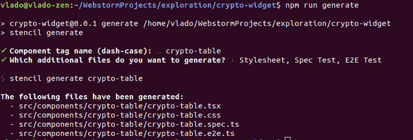

crpyto 表是一个表示组件。这样的组件只通过道具接收东西，并把它们展示到 JSX。没有内部状态，没有本地计算等等。

看起来是这样的:

```
import { Component, Host, h, Prop } from '@stencil/core';

import { CryptoInterface } from '../crypto-view/crypto.interface';

@Component({
  tag: 'crypto-table',
  styleUrl: 'crypto-table.css',
  shadow: false,
  scoped: true
})
export class CryptoTable {

  @Prop() cryptoData: CryptoInterface;
  @Prop() cryptoCurrencies: string[];

  render() {
    return (
      <Host>
        <table class={'crypto'}>
          <tr>
            <td></td>
            <td>USD</td>
            <td>EUR</td>
          </tr>
          {this.cryptoCurrencies.map((item) => {
            return this.cryptoData && item in this.cryptoData ? <tr>
              <td>{item}</td>
              <td>{this.cryptoData[item].USD}</td>
              <td>{this.cryptoData[item].EUR}</td>
            </tr> : null
          })}
        </table>
      </Host>
    );
  }

}
```

现在，如果你熟悉 React，Stencil 使用 JSX 和同样的原理来显示数据。如果你来自 Angular，忘掉`ngIf`和`ngFor`指令，尽快习惯 [JSX](https://stenciljs.com/docs/templating-jsx) 。

在这个组件中，我们将 shadow 设置为 false，因为我们不需要在 DOM 中进一步隔离这个组件。这里的新设置是`scoped: true`，它为这个组件中的每个元素添加了额外的 CSS 类(`cs-crypto-table`):

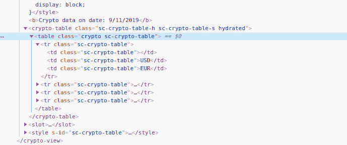

模板中组件装饰器的作用域和阴影属性的组合类似于 Angular 中的`ViewEncapsulation`。

对于创建哑(表示)组件，我们可以使用[功能组件](https://stenciljs.com/docs/functional-components)方法。它们是箭头函数，接受道具作为参数并返回 JSX。

在`CryptoView`组件中，我们将注入`CryptoTable`并通过 props 绑定传递数据:

```
import { Component, Host, h, Prop, State } from '@stencil/core';
import { getCryptoData } from '../../utils/utils';
import { CryptoInterface } from './crypto.interface';

@Component({
  tag: 'crypto-view',
  styleUrl: 'crypto-view.css',
  shadow: true
})
export class CryptoView {

  /**
   * Valid API key obtained from cryptocompare.com
   */
  @Prop() apiKey: string;

  @State() cryptoData: CryptoInterface;

  cryptoCurrencies = ['BTC', 'ETH', 'XRP'];

  componentDidLoad() {
    getCryptoData(this.apiKey).then((data) => {
      this.cryptoData = data;
    });
  }

  render() {
    return (
      <Host>
        <b>Crypto data on date: {new Date().toLocaleDateString()}</b>
        <crypto-table cryptoData={this.cryptoData} cryptoCurrencies={this.cryptoCurrencies} />
        <slot></slot>
      </Host>
    );
  }

}
```

注意，我们不需要在任何地方导入 CryptoTable，这都是由模板编译器完成的。

我从 W3school 抓取了 CSS，我们的 crypto 表看起来是这样的: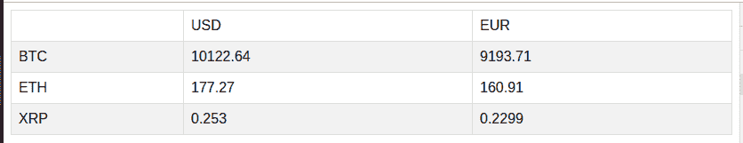

## 方法

如果我们设想一个场景，其中宿主应用程序想要刷新组件中的加密数据。我们必须以某种方式公开将触发重新获取加密数据的方法。

Stencil 为此引入了`Method`装饰器:

```
@Method()
async refreshCryptoData() {
  getCryptoData(this.apiKey).then((data) => {
    this.cryptoData = data;
  });
}
```

公开的类方法必须标记为异步函数。这是模板的要求。

现在，在 index.html 我们可以这样称呼它:

```
<!DOCTYPE html>
<html dir="ltr" lang="en">
<head>
  <meta charset="utf-8">
  <meta name="viewport" content="width=device-width, initial-scale=1.0, minimum-scale=1.0, maximum-scale=5.0">
  <title>Stencil Component Starter</title>

  <script type="module" src="/build/crypto-widget.esm.js"></script>
  <script nomodule src="/build/crypto-widget.js"></script>

</head>
<body>
    <crypto-view api-key="fd937be4428d64cf4dd1b51146aef28e46d224aea7ea5bdfbbb6d296a05ec1a9"></crypto-view>

    <script>
        document.addEventListener('DOMContentLoaded', (event) => {
            const cryptoView = document.querySelector('crypto-view');
            setTimeout(() => {
                cryptoView.refreshCryptoData();
            }, 2000);
        })
    </script>
</body>
</html>
```

为了便于演示，我们等待两秒钟，然后调用`method`来刷新组件中的加密数据。

## 事件

在 Stencil 中，事件类似于 Angular 中的`Output`,其中子组件可以发出某种东西，而父组件可以捕捉到它。事件用于将数据从子组件推送到父组件。这类似于我们每天在 Angular 和 React 中所做的事情。

有两种捕捉事件的方法。一个带有组件的属性，另一个带有`Listen`装饰器。

首先，让我们尝试从子组件通知父组件:

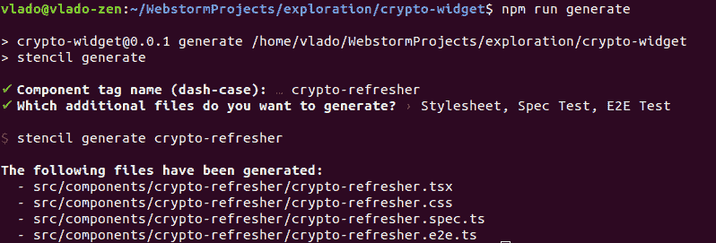

代码如下:

```
import { Component, Host, Event, h, EventEmitter } from '@stencil/core';

@Component({
  tag: 'crypto-refresher',
  styleUrl: 'crypto-refresher.css',
})
export class CryptoRefresher {

  @Event() refreshCryptoData: EventEmitter;

  refresh() {
    this.refreshCryptoData.emit(true);
  }

  render() {
    return (
      <Host>
        <button onClick={() => this.refresh()}>Refresh Crypto Data</button>
      </Host>
    );
  }

}
```

我们的`refreshCryptoData`用`Event`装饰器装饰(不要忘记从@stencil/core 导入它),然后在点击按钮时发出。

```
import { Component, Host, h, Prop, State, Method, Listen } from '@stencil/core';
import { getCryptoData } from '../../utils/utils';
import { CryptoInterface } from './crypto.interface';

@Component({
  tag: 'crypto-view',
  styleUrl: 'crypto-view.css',
  shadow: true
})
export class CryptoView {

  /**
   * Valid API key obtained from cryptocompare.com
   */
  @Prop() apikey: string;

  @State() cryptoData: CryptoInterface;

  cryptoCurrencies = ['BTC', 'ETH', 'XRP'];

  componentDidLoad() {
    this.fetchData();
  }

  fetchData() {
    getCryptoData(this.apikey).then((data) => {
      this.cryptoData = data;
    });
  }

  @Method()
  async refreshCryptoData() {
    this.fetchData();
  }

  @Listen('refreshCryptoData')
  listen(event) {
    console.log(event)
  }

  render() {
    return (
      <Host>
        <b>Crypto data on date: {new Date().toLocaleDateString()}</b>
        <crypto-table cryptoData={this.cryptoData} cryptoCurrencies={this.cryptoCurrencies} />
        <crypto-refresher onRefreshCryptoData={() => this.fetchData()} />
        <slot></slot>
      </Host>
    );
  }

}
```

注意，我们使用了调用组件<crypto-refresher>的简化版本，这是首选方式，因为我们没有向其中投射任何数据。</crypto-refresher>

让我们先用组件上的一个属性来捕捉这个事件。

在 Stencil 中，我们应该用前缀`on`来命名捕捉事件的属性。如果我们的事件被调用，那么捕捉它的属性是`onRefreshCryptoData`。在我们的例子中，`onRefreshCryptoData`是一个箭头函数，它将调用`fetchData`方法。

如果我们通过事件传递一些数据，我们将在箭头函数参数中包含这些数据。

捕捉事件的第二种方法是使用`Listen`装饰器。它接受事件的名称作为参数，并在捕获事件后调用下面的函数。`Listen`装饰器在监听系统事件(如调整大小、滚动等)时非常方便。它在棱角方面与`HostListener`相似。

## 观察(反应)

现在，如果想监听`Props`的变化并调用其他方法或计算其他东西，我们必须使用`Watch`装饰器。

例如，如果我们想要计算 crytpo 表组件中的价格总和并显示出来，我们将不得不等待获取并传递`cryptoData`,然后计算总和。

```
import { Component, Host, h, Prop, Watch, State } from '@stencil/core';

import { CryptoInterface } from '../crypto-view/crypto.interface';

@Component({
  tag: 'crypto-table',
  styleUrl: 'crypto-table.css',
  shadow: false,
  scoped: true
})
export class CryptoTable {

  @Prop() cryptoData: CryptoInterface;
  @Prop() cryptoCurrencies: string[];

  @State() sum: { USD: number, EUR: number };

  @Watch('cryptoData')
  watching(cryptoData: CryptoInterface) {
    this.sum = {
      USD: Math.round(cryptoData.BTC.USD + cryptoData.ETH.USD + cryptoData.XRP.USD),
      EUR: Math.round(cryptoData.BTC.EUR + cryptoData.ETH.EUR + cryptoData.XRP.EUR),
    }
  }

  render() {
    return (
      <Host>
        <table class={'crypto'}>
          <tr>
            <td></td>
            <td>USD</td>
            <td>EUR</td>
          </tr>
          {this.cryptoCurrencies.map((item) => {
            return this.cryptoData && item in this.cryptoData ? <tr>
              <td>{item}</td>
              <td>{this.cryptoData[item].USD}</td>
              <td>{this.cryptoData[item].EUR}</td>
            </tr> : null
          })}
          {this.sum ?
          <tr>
            <td></td>
            <td>{this.sum.USD}</td>
            <td>{this.sum.EUR}</td>
          </tr> : null }
        </table>
      </Host>
    );
  }

}
```

在上面的例子中，每次`cryptoData`改变时，组件将计算所有货币的总和。

## 建筑和使用

为了构建这个项目并产生可共享的包，我们必须运行

```
npm run build
```

构建将在其中产生一个 dist 文件夹和 crypto-widget 文件夹。

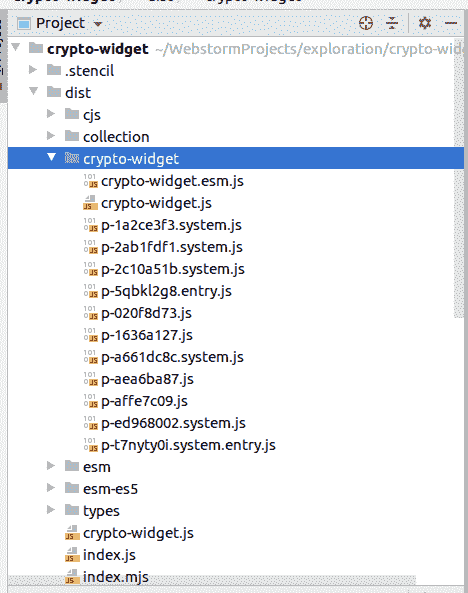

抓取这个文件夹并将其复制到我们想要包含组件的位置是安全的。

在 HTML 中包含两个文件就足够了，第一个是 crypto-widget.js，它是一个 es5 包(带有 polyfills ),旨在用于较旧的浏览器(IE 11)。

第二个是 crypto-widget.esm.js，它带有所有新的 JavaScript 特性，如代码分割、异步等待等。

```
<script type="module" src="/build/crypto-widget.esm.js"></script>
<script nomodule src="/build/crypto-widget.js"></script>
```

如今的浏览器很聪明，它们只会加载自己需要的东西。

## 结论

模板是一个很棒的库。它开发得很好，有很好的文档记录，经过实战检验，由一家大公司支持，符合标准，并且非常容易学习。

模板的使用案例包括:

*   为大型项目和组织创建设计系统(可共享的 UI 组件)
*   创建应用程序的可移植部分，可以在许多不同的地方共享和使用。(查看器、小部件、集成等。)

你可以在这里找到这个项目的 GitHub repo。

编码快乐！

## [LogRocket](https://lp.logrocket.com/blg/typescript-signup) :全面了解您的网络和移动应用

[](https://lp.logrocket.com/blg/typescript-signup)

LogRocket 是一个前端应用程序监控解决方案，可以让您回放问题，就像问题发生在您自己的浏览器中一样。LogRocket 不需要猜测错误发生的原因，也不需要向用户询问截图和日志转储，而是让您重放会话以快速了解哪里出错了。它可以与任何应用程序完美配合，不管是什么框架，并且有插件可以记录来自 Redux、Vuex 和@ngrx/store 的额外上下文。

除了记录 Redux 操作和状态，LogRocket 还记录控制台日志、JavaScript 错误、堆栈跟踪、带有头+正文的网络请求/响应、浏览器元数据和自定义日志。它还使用 DOM 来记录页面上的 HTML 和 CSS，甚至为最复杂的单页面和移动应用程序重新创建像素级完美视频。

## 您是否添加了新的 JS 库来提高性能或构建新特性？如果他们反其道而行之呢？

毫无疑问，前端变得越来越复杂。当您向应用程序添加新的 JavaScript 库和其他依赖项时，您将需要更多的可见性，以确保您的用户不会遇到未知的问题。

LogRocket 是一个前端应用程序监控解决方案，可以让您回放 JavaScript 错误，就像它们发生在您自己的浏览器中一样，这样您就可以更有效地对错误做出反应。

[](https://lp.logrocket.com/blg/javascript-signup)[https://logrocket.com/signup/](https://lp.logrocket.com/blg/javascript-signup)

[LogRocket](https://lp.logrocket.com/blg/javascript-signup) 可以与任何应用程序完美配合，不管是什么框架，并且有插件可以记录来自 Redux、Vuex 和@ngrx/store 的额外上下文。您可以汇总并报告问题发生时应用程序的状态，而不是猜测问题发生的原因。LogRocket 还可以监控应用的性能，报告客户端 CPU 负载、客户端内存使用等指标。

自信地构建— [开始免费监控](https://lp.logrocket.com/blg/javascript-signup)。

[Try it for free](https://lp.logrocket.com/blg/typescript-signup)

.