# 用穿梭者和宁静建造一个锈不和机器人

> 原文：<https://blog.logrocket.com/building-rust-discord-bot-shuttle-serenity/>

Discord 机器人可以为服务器所有者和工作人员节省大量时间和精力，同时还可以为用户提供各种有用的功能。你可以不协调地使用机器人来自动化重复的任务和否则会占用大量时间和精力的任务。

在本文中，您将学习如何创建一个不和谐的机器人，将机器人添加到您的服务器，并将您的 Rust 代码连接到您的机器人。

向前跳:

要理解这篇文章，您至少需要对不和谐有一定程度的了解。你还应该有一个 Discord 账户，一个你自己的 Discord 服务器，以及一些 Rust 的编程经验。

## 设置不和谐机器人

不和谐地设置机器人可能有点棘手，尤其是如果这是你第一次这样做。在本节中，我将指导您为您的服务器设置 bot。

### 不协调地创建应用程序

Discord 应用程序是一种在 Discord 用户和您的代码之间提供接口的服务。应用程序提供的接口称为 bot。机器人接收来自用户的消息并发送响应。

要创建 Discord 应用程序，首先在浏览器中登录 Discord 帐户。接下来，在浏览器中打开[Discord 开发者门户](https://discord.com/developers/applications)，点击页面右上角的“新应用”按钮:

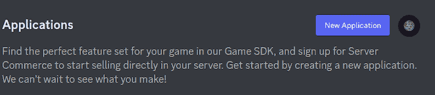

输入应用程序的名称:

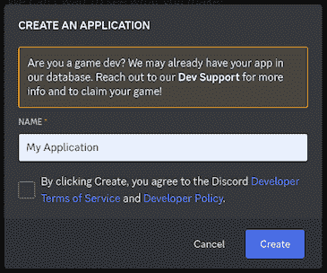

单击标记为“创建”的按钮来创建应用程序。如果操作成功完成，您将看到一个类似如下的控制面板:

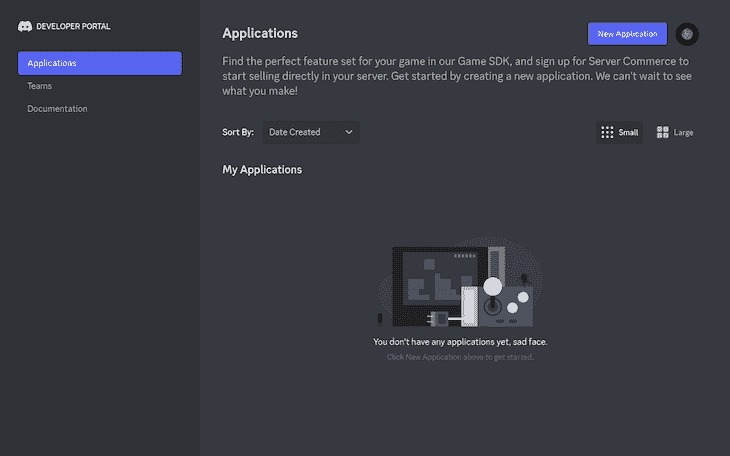

### 为应用程序创建 bot

在本节中，您将为您的 Discord 应用程序创建 bot。在网页的左侧窗格中，单击“bot”打开 Bot 菜单:

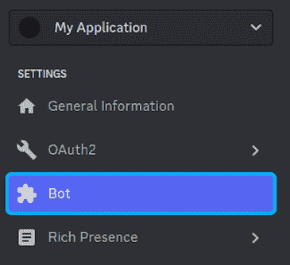

在“构建机器人”部分，单击“添加机器人”按钮创建机器人:

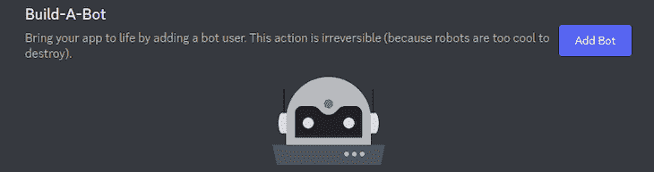

点击此按钮后，您将成功创建不和谐机器人。最后，激活“消息内容意图”选项，以便 bot 可以接收来自 Discord 服务器中用户的消息:


### 将 bot 安装到您的 Discord 服务器

在设置你的机器人时你需要做的最后一件事是把它安装到你的服务器上。在左侧导航窗格中，单击“OAuth2”菜单项切换下拉列表。在此下拉列表中，单击“URL 生成器”选项:

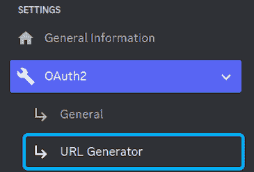

在“范围”下的 URL 生成器菜单中，勾选“bot”选项:

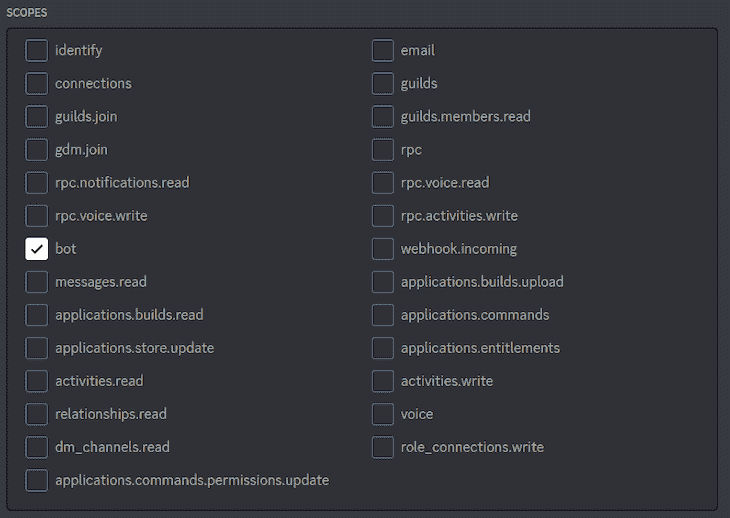

向下滚动页面到“机器人权限”并勾选“管理员”选项，赋予机器人管理员权限:

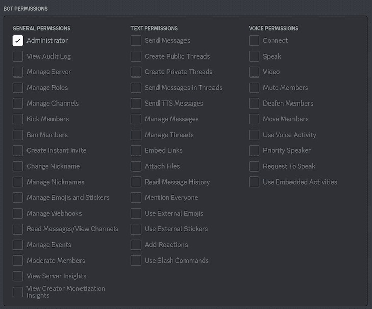

滚动到页面底部，复制底部生成的 URL，然后在浏览器中打开生成的 URL:

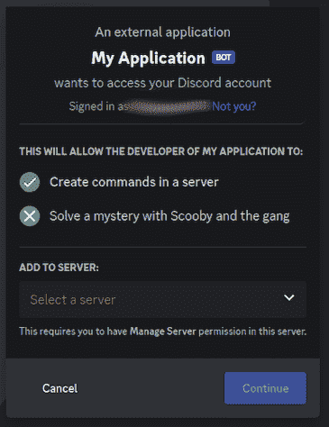

在导航到生成的 URL 后打开的网页中，选择要安装 bot 的服务器。单击“继续”继续。

在下一个屏幕上，单击“授权”然后，网页会提示您验证您是否是人类:

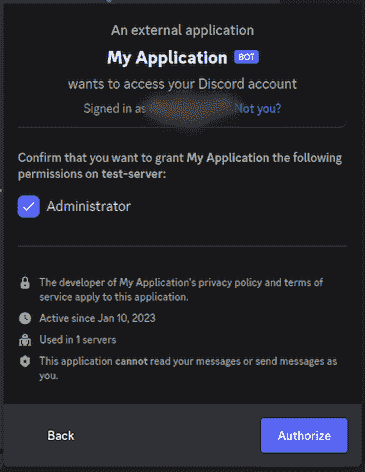

完成这些步骤后，打开服务器的成员列表。您应该看到您的机器人被列为成员。

## 设置 Rust 代码环境

在这一节中，我将指导您为您的 Discord bot 设置 Rust 代码环境。代码环境将为您提供开始构建 bot 所需的代码和包。

为了建立这个项目，我们将使用一个叫做 Shuttle 的工具。Shuttle 允许您在 Rust 中初始化、构建和部署各种项目。

对于这个项目，我们将使用 Shuttle 来初始化 Serenity 项目。Serenity 是一个用于在 Rust 中构建不和谐聊天机器人的框架。

要初始化 Serenity 项目，需要为项目创建一个新目录。然后，使用以下命令安装 Shuttle:

```
cargo install cargo-shuttle
```

接下来，初始化目录中的项目:

```
cargo shuttle init --serenity
```

最后，构建项目:

```
cargo build
```

如果您正确地遵循了这些步骤，您应该看到您的目录中充满了入门所需的代码。

## 将 Rust 代码库连接到你的不和谐机器人

我们在上一节中生成的`src/lib.rs`代码是一个基本项目，您可以将它连接到您的 bot，我们将在本节中一步一步地进行。

为了成功地将您的代码连接到您的 bot，您首先需要获得您的 bot 令牌。bot 令牌是对您的 bot 的引用。每个 bot 都有一个唯一的引用，您可以使用它将代码库连接到您的 bot。

要检索您的 bot 令牌，首先打开 Discord 开发人员仪表板。单击左侧导航窗格中的“Bot”。然后，单击“重置令牌”按钮:

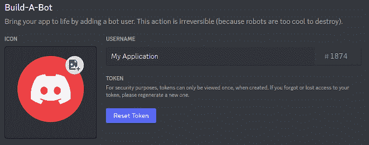

单击“复制”复制令牌:

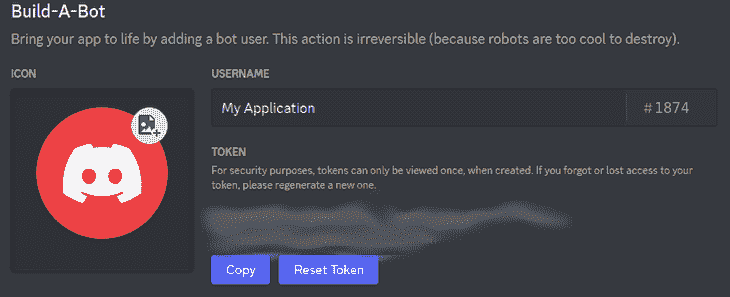

要将代码库连接到您的 bot，请在项目的根目录中创建一个`Secrets.toml`文件。将以下内容写入`Secrets.toml`文件，并用您的 bot 令牌替换`* bot_token *`:

```
DISCORD_TOKEN="* bot_token *"
```

使用以下命令运行项目:

```
cargo shuttle run
```

在这些步骤结束时，您应该在服务器上看到您的 Discord bot 在线。如果你在服务器上输入`!hello`，机器人应该用`world!`来响应。

要理解机器人如何响应`!hello`，请看一下`src/lib.rs`文件第 12–24 行的事件处理程序:

```
struct Bot;

#[async_trait]
impl EventHandler for Bot {
   async fn message(&self, ctx: Context, msg: Message) {
       if msg.content == "!hello" {
           if let Err(e) = msg.channel_id.say(&ctx.http, "world!").await {
               error!("Error sending message: {:?}", e);
           }
       }

   }

   async fn ready(&self, _: Context, ready: Ready) {
       info!("{} is connected!", ready.user.name);
   }
}
```

事件处理程序有一个`message`方法，每当有人在服务器上发送消息时就会调用这个方法。`message`功能有一个`if`模块，用于检查新消息是否为`!hello`:

```
if msg.content == "!hello" {
    if let Err(e) = msg.channel_id.say(&ctx.http, "world!").await {
        error!("Error sending message: {:?}", e);
    }
}
```

如果消息与`!hello`匹配，程序将`world!`消息发送回服务器，并声明:

```
msg.channel_id.say(&ctx.http, "world!").await
```

您可以按照上面的步骤对机器人进行编程，以使用自定义响应来响应任何自定义消息。

## 为不和谐机器人创建命令

命令是与机器人互动的更直接的方式。与消息不同，命令以`/`斜杠开始，例如`/hello`。

你可以像发送消息一样不一致地发送命令，但这是与机器人交互的首选方式，因为你可以很容易地分辨出哪些消息是命令，哪些不是。

要让您的机器人响应命令，您需要安装机器人的服务器的 ID。为了获得服务器 ID，您需要首先在您的帐户上启用开发者模式。

* * *

### 更多来自 LogRocket 的精彩文章:

* * *

### 在你的不和谐帐户上启用开发者模式

开发人员模式是一个不和谐的设置，它赋予开发人员在服务器中更高的特权。在本节中，我将指导您在系统上启用开发人员模式，这样您就可以复制您的服务器 ID 并使您的 bot 能够响应命令。

#### 在 Windows 或 Mac 上

在窗口底部，单击用户名旁边的设置图标。在左侧窗格中，选择“应用程序设置”下的“外观”

在“外观设置”菜单中，单击“高级”打开“高级设置”菜单，在这里您可以切换“开发者模式”选项。最后，右键单击服务器名称并选择“复制 ID”来复制服务器 ID。

#### 在 Linux 上

在窗口底部，单击用户名旁边的设置图标。在左侧窗格中，选择“应用程序设置”下的“高级”以打开“高级设置”菜单，在这里您可以切换“开发人员模式”选项。

然后，右键单击服务器名称并选择“复制 ID”来复制服务器 ID:

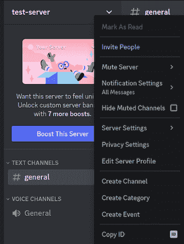

### 使您的机器人能够响应命令

准备好服务器 ID 后，按照以下步骤让您的 bot 能够响应命令。首先，将下面的`ready`方法写入事件处理程序:

```
struct Bot;

#[async_trait]
impl EventHandler for Bot {
   async fn message(&self, ctx: Context, msg: Message) {
       // ...
   }

   // "EventHandler" calls the "ready" method below when the project starts running 
   async fn ready(&self, ctx: Context, ready: Ready) {
       info!("{} is connected!", ready.user.name);

       let guild_id = GuildId(* guild_id *);

       // add "/hello" command to the bot
       GuildId::set_application_commands(&guild_id, &ctx.http, |commands| {
           commands.create_application_command(|command| { command.name("hello").description("Say hello") })
       }).await.unwrap();

   }
}
```

接下来，将下面的`interaction_create`处理程序写入事件处理程序:

```
struct Bot;

#[async_trait]
impl EventHandler for Bot {
   async fn message(&self, ctx: Context, msg: Message) {
       // ...
   }
   // `ready` method runs when the bot starts
   async fn ready(&self, _: Context, ready: Ready) {
       // ...
   }
   // `interaction_create` runs when the user interacts with the bot
   async fn interaction_create(&self, ctx: Context, interaction: Interaction) {
       // check if the interaction is a command
       if let Interaction::ApplicationCommand(command) = interaction {

           let response_content =
               match command.data.name.as_str() {
                   "hello" => "hello".to_owned(),
                   command => unreachable!("Unknown command: {}", command),
               };
           // send `response_content` to the discord server
           command.create_interaction_response(&ctx.http, |response| {
               response
                   .kind(InteractionResponseType::ChannelMessageWithSource)
                   .interaction_response_data(|message| message.content(response_content))
           })
               .await.expect("Cannot respond to slash command");
       }
   }
}

```

在事件处理程序的`ready`方法中，用您的服务器 ID 替换第三行的`* guild_id *`。

如果您的代码仍然在终端中运行，请重新启动它。当你在服务器上看到你的机器人在线时，发送一条`/hello`消息。您应该会看到来自机器人的响应，说`hello`作为响应。

与消息响应一样，您可以通过遵循我们上面介绍的步骤，对您的 bot 进行编程，以使用自定义响应来响应任何自定义命令。

## 将不和谐机器人部署到穿梭服务器

在您的系统上运行您的项目可能有缺点。更复杂的机器人可能需要大量资源来运行和服务每个用户。

部署您的 bot 具有不使用计算机资源运行的优势。它还能让你的机器人保持在线，即使你不在线。

Shuttle 允许你将你的机器人部署到 Shuttle 服务器上。要部署 bot，请在项目目录中运行以下命令:

```
cargo shuttle deploy
```

## 结论

在 Rust 中构建一个不和谐的聊天机器人可能是一项具有挑战性的任务。但是有了正确的知识和工具，这是很容易做到的。

根据本文提供的分步说明，任何有 Rust 编程经验和一个 Discord 帐户的人都可以学习构建自己的 Discord 聊天机器人。如果你正在寻找一些不和谐的机器人，这里有一些想法:

*   欢迎机器人欢迎新用户加入服务器或频道
*   用于玩琐事、智力竞赛、井字游戏和其他游戏的游戏机器人
*   播放音乐或允许用户创建或选择视频、图像或 gif 分享的媒体机器人
*   投票机器人帮助用户创建和发送投票
*   用于自动化服务器功能的实用程序，如回答常见问题等

关于 Rust Discord 机器人的进一步阅读，请查看一些 [Serenity Discord 示例机器人](https://github.com/serenity-rs/serenity/tree/current/examples)或 [Serenity 文档](https://docs.rs/serenity/latest/serenity/index.html)。

## [log rocket](https://lp.logrocket.com/blg/rust-signup):Rust 应用的 web 前端的全面可见性

调试 Rust 应用程序可能很困难，尤其是当用户遇到难以重现的问题时。如果您对监控和跟踪 Rust 应用程序的性能、自动显示错误、跟踪缓慢的网络请求和加载时间感兴趣，

[try LogRocket](https://lp.logrocket.com/blg/rust-signup)

.

[](https://lp.logrocket.com/blg/rust-signup)

LogRocket 就像是网络和移动应用程序的 DVR，记录你的 Rust 应用程序上发生的一切。您可以汇总并报告问题发生时应用程序的状态，而不是猜测问题发生的原因。LogRocket 还可以监控应用的性能，报告客户端 CPU 负载、客户端内存使用等指标。

现代化调试 Rust 应用的方式— [开始免费监控](https://lp.logrocket.com/blg/rust-signup)。