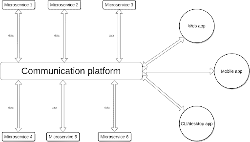
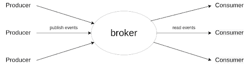
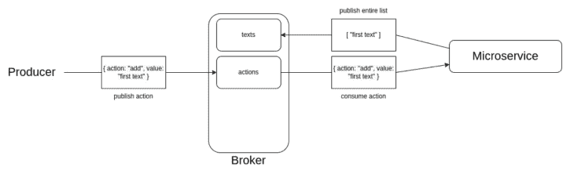

# 用 Apache Kafka 构建 Rust 微服务

> 原文：<https://blog.logrocket.com/building-rust-microservices-apache-kafka/>

[Apache Kafka](https://kafka.apache.org/) 是一个事件流平台，允许软件应用程序之间进行有效的通信。这是将微服务等小型应用连接在一起的绝佳选择。

在本文中，您将了解如何使用 Kafka 的 [Rust](https://www.rust-lang.org/) 构建微服务。我们将涵盖:

你可以在[这个 GitHub repo](https://github.com/TheGhoulRe/rust-microservices) 里看到最终的项目。

## 先决条件

按照这篇文章，你需要在你的系统中安装 Rust 和 Rust 的基本知识。

## 什么是微服务？

微服务是小型、独立的应用程序，它们执行特定的任务，这些任务对于复杂应用程序的解耦组件和促进分布式应用程序都很有用。

把微服务想象成一个更大尺度上的物体。与对象类似，微服务是独立的，可以重用。然而，两者之间的显著区别在于它们返回数据的位置。对象直接获取和返回数据，而微服务将数据返回到池中。

微服务允许开发者用不同的编程语言构建应用。微服务中的错误很少会导致整个应用程序崩溃。



卡夫卡是什么？

## Kafka 是一个用于读写数据的事件流平台，可以轻松连接微服务。要了解更多关于 Kafka 的信息，请查看这个 [Kafka 实时数据流应用教程](https://blog.logrocket.com/apache-kafka-real-time-data-streaming-app/)。

在我们深入讨论这个平台之前，我们需要熟悉一些 Kafka 术语。

事件:在卡夫卡那里，数据被称为事件

*   主题:主题是用于组织事件的标识符。生产者和消费者可以实时读写一个主题
*   生产者:Kafka 使用生产者将事件发布到一个主题
*   消费者:这些从一个主题中读取事件
*   Broker:Kafka 中的服务器被称为 broker
*   集群:几个代理一起工作形成一个集群，防止事件丢失。这一点非常重要，因为事件和主题可以在一个或多个代理之间复制
*   

卡夫卡入门

要继续阅读本文，您需要设置您的 Kafka broker。注意，您将在您的系统上使用一个本地代理。除了本地代理，Kafka 还提供了在云中或远程系统上使用代理的选项。

## 要在您的系统上设置 Kafka，请按照下列步骤操作:

首先，在这里下载最新的 Kafka 版本[，解压压缩文件。之后，在你的终端打开解压后的文件夹，用下面的命令启动](https://www.apache.org/dyn/closer.cgi?path=/kafka/3.2.1/kafka_2.13-3.2.1.tgz) [ZooKeeper](https://kafka.apache.org/documentation/#zk) 服务器:

然后，在解压缩的文件夹中打开另一个终端会话，并启动 Kafka broker:

卡夫卡经纪人需要一个活跃的动物园管理员才能正常工作。ZooKeeper 维护代理，没有它，代理会生成错误消息。

```
$ bin/zookeeper-server-start.sh config/zookeeper.properties
```

设置 Kafka 主题、生产者和消费者

```
$ bin/kafka-server-start.sh config/server.properties
```

接下来，让我们通过设置主题、生产者和消费者来组织 Kafka broker 中发布的事件。

## 要在本地服务器中创建主题，请运行以下命令:

第一个命令在控制台中启动一个消费者，`--topic topic-name`告诉消费者从`topic-name`中读取。`--bootstrap-server localhost:9092`告诉卡夫卡在`localhost:9092`连接到你的本地服务器。

`--from-beginning`告诉消费者阅读最早发布的所有事件。你可以用`--offset earliest`代替`--from-beginning`来达到同样的效果。如果您希望消费者只收听新事件，请使用`--offset latest`。

```
$ bin/kafka-topics.sh --create --topic topic-name --bootstrap-server localhost:9092
```

Kafka 提供了一个可以在终端中运行的消费者和生产者:

上面的命令在控制台中启动一个生成器，生成器将事件发布到由`--topic topic-name`指定的`topic-name`。生产者连接到您在`localhost:9092`的本地服务器，并由`--bootstrap-server localhost:9092`指定。

制造铁锈消费者和生产者

```
# console consumer reading from "topic-name"
$ bin/kafka-console-consumer.sh --topic topic-name --from-beginning --bootstrap-server localhost:9092

# console producer publishing to "topic-name"
$ bin/kafka-console-producer.sh --topic topic-name --bootstrap-server localhost:9092
```

现在，您已经看到了控制台中的生产者和消费者，我将向您展示如何使用 Rust 构建 Kafka 生产者和消费者。用 Rust 构建的基于 Kafka 的微服务通常有一个或多个生产者和消费者。我们开始吧！

## 首先，您需要使用以下命令创建一个新的 Rust 项目:

接下来，将卡夫卡图书馆添加到`Cargo.toml`:

现在我们已经添加了 Kafka 库，我们可以构建项目来获取它的依赖项:

```
$ cargo new kafka_consumer
```

然后将这段代码粘贴到`src/main.rs`:

```
[dependencies]
kafka = "0.9"
```

我们上面创建的消费者读取发布到`topic-name`主题的事件，并将事件消息打印到控制台。下面更详细地介绍了它的工作原理:

```
$ cargo build
```

首先，我们在第 6 行初始化消费者将要连接的主机列表(在本例中是`localhost:9092`)。

```
use kafka::consumer::{Consumer, FetchOffset};
use std::str;

fn main () {

 let hosts = vec!["localhost:9092".to_owned()];

 let mut consumer =
   Consumer::from_hosts(hosts)
     .with_topic("topic-name".to_owned())
     .with_fallback_offset(FetchOffset::Latest)
     .create()
     .unwrap();

 loop {
   for ms in consumer.poll().unwrap().iter() {
     for m in ms.messages() {
       // If the consumer receives an event, this block is executed
       println!("{:?}", str::from_utf8(m.value).unwrap());
     }

     consumer.consume_messageset(ms).unwrap();
   }

   consumer.commit_consumed().unwrap();
 }
}
```

接下来，从第 8 行到第 13 行，我们初始化一个连接到`topic-name`主题(第 10 行)的消费者，并开始从最近发布的事件中读取事件:

最后，我们创建一个无限循环来监听发布到`topic-name`的事件:

```
 let hosts = vec!["localhost:9092".to_owned()];
```

现在，我们已经成功地创建了消费者，让我们看看创建生产者的下一步。

```
 let mut consumer =
   Consumer::from_hosts(hosts)
     .with_topic("topic-name".to_owned())
     .with_fallback_offset(FetchOffset::Latest)
     .create()
     .unwrap();
```

首先，使用以下命令创建一个新的 Rust 项目:

```
 loop {
   for ms in consumer.poll().unwrap().iter() {
     for m in ms.messages() {
       // convert message from bytes to string
       println!("{:?}", str::from_utf8(m.value).unwrap());
     }

     consumer.consume_messageset(ms).unwrap();
   }

   consumer.commit_consumed().unwrap();
 }
```

然后将卡夫卡图书馆添加到`Cargo.toml`:

构建项目以获取其依赖项:

```
$ cargo new kafka_producer
```

然后，将这段代码粘贴到`src/main.rs`:

```
[dependencies]
kafka = "0.9"
```

这个想法是创建一个生产者，发送数字`0`到`9`到`topic-name`主题。下面是它的工作原理:

```
$ cargo build
```

首先，我们定义一个我们正在连接的 Kafka 服务器的列表(`localhost:9092`)。

```
use kafka::producer::{Producer, Record};

fn main() {
 let hosts = vec!["localhost:9092".to_owned()];

 let mut producer =
   Producer::from_hosts(hosts)
     .create()
     .unwrap();

 for i in 0..10 {
   let buf = format!("{i}");
   producer.send(&Record::from_value("topic-name", buf.as_bytes())).unwrap();
   println!("Sent: {i}");
 }
}
```

注意，`Producer::from_hosts`函数初始化了生产者。初始化的生产者连接到本地 Kafka 服务器(`localhost:9092`)。

我们创建了一个从 0 到 9 的循环，并将每个数字发送到`topic-name`主题。

```
let hosts = vec!["localhost:9092".to_owned()];
```

现在我们已经设置了消费者和生产者，让我们运行他们。消费者监听在`topic-name`中发布的事件，生产者项目将事件发布到`topic-name.`，在发布事件之前拥有一个活跃的消费者可以确保事件被实时消费。

```
let mut producer =
   Producer::from_hosts(hosts)
     .create()
     .unwrap();
```

用 Kafka 构建 Rust 微服务

```
for i in 0..10 {
   let buf = format!("{i}");
   producer.send(&Record::from_value("topic-name", buf.as_bytes())).unwrap();
   println!("Sent: {i}");
 }
}
```

在本节中，我们将构建一个微服务来存储和删除文本。这个微服务是通过发送描述添加或删除文本的事件来操作的。该事件将是一个 JSON 字符串，带有描述其动作的动作键和提供必要数据的值键。

## 下图展示了微服务如何添加文本:



如图所示，我们的微服务从 actions 主题读取要执行的操作，然后将文本列表发布到 texts 主题。现在我们有了一些背景，让我们来建立这个微服务。

首先，让我们创建一个新项目:

使用下面的命令将下列依赖项添加到`Cargo.toml` :

使用以下命令构建项目:

```
$ cargo new texts-microservice
```

之后，我们将创建模块，分别处理生产者、消费者和文本。在`src`中，这些模块的文件名分别是`my_consumer.rs`、`my_producer.rs`和`texts.rs`。

```
[dependencies]
kafka = "0.9"
serde_json = "1.0.85"
```

现在，按照以下步骤构建微服务:

```
$ cargo build
```

首先，我们需要初始化模块，因为我们正在将微服务分割成模块。因此，将这个代码块添加到`main.rs`文件中:

之后，在`main.rs`中创建`main`函数:

接下来，在`main.rs`的`main`函数中定义您正在连接微服务的 Kafka 服务器:

```
mod my_consumer;
mod my_producer;
mod texts;

use my_consumer::MyConsumer;
use my_producer::MyProducer;
use texts::Texts;
```

现在，用`main.rs`的`main`函数中的以下代码行初始化文本、消费者和生产者模块:

```
fn main() { 
}
```

接下来，创建一个循环来侦听使用者收到的事件:

```
  let hosts = vec![ "localhost:9092".to_string() ];
```

之后，用下面这行代码从前面代码块的循环中检索数据:

```
  let mut texts = Texts::new();
  let mut consumer = MyConsumer::new( hosts.clone(), "actions".to_string() );
  let mut producer = MyProducer::new( hosts );
```

现在，从事件数据中提取要对文本执行的操作，并在前面的代码块后加上这一行:

```
  loop {
    for ms in consumer.consume_events().iter() {
      for m in ms.messages() {

      }
      consumer.consume_messageset(ms);
    }
    consumer.commit_consumed();
  }
```

之后，使用`if`、`if/else`、`else`块执行`event_data["action"]`指定的动作:

```
        let event_data = MyConsumer::get_event_data(m);
```

最后，将文本转换为 JSON 字符串，并在循环结束时将它发送给带有生产者的文本主题:

```
        let action = event_data["action"].to_string();
```

最后，您的`main.rs`文件应该是这样的:

```
        if action == "\"add\"" {
          texts.add_text( event_data["value"].to_string() );

        } else if action == "\"remove\"" {
          let index = event_data["value"].to_string().parse::<usize>().unwrap();
          texts.remove_text( index );

        } else {
          println!("Invalid action");
        }
```

现在，在`src`中创建一个`my_consumer.rs`文件，并将以下代码粘贴到其中:

```
        producer.send_data_to_topic( "texts", texts.to_json() );
```

此外，创建一个包含以下代码的`my_producer.rs`文件:

```
mod my_consumer;
mod my_producer;
mod texts;

use my_consumer::MyConsumer;
use my_producer::MyProducer;
use texts::Texts;

fn main() { 
  let hosts = vec![ "localhost:9092".to_string() ];

  let mut texts = Texts::new();
  let mut consumer = MyConsumer::new( hosts.clone(), "actions".to_string() );
  let mut producer = MyProducer::new( hosts );
  // put here to show that the microservice has started
  println!("Started...");

  loop {
    for ms in consumer.consume_events().iter() {
      for m in ms.messages() {

        // when the consumer receives an event, this block is executed 
        let event_data = MyConsumer::get_event_data(m);
        let action = event_data["action"].to_string();

        if action == "\"add\"" {
          texts.add_text( event_data["value"].to_string() );

        } else if action == "\"remove\"" {
          let index = event_data["value"].to_string().parse::<usize>().unwrap();
          texts.remove_text( index );

        } else {
          println!("Invalid action");
        }

        producer.send_data_to_topic( "texts", texts.to_json() );
      }
      consumer.consume_messageset(ms);
    }
    consumer.commit_consumed();
  }
}
```

最后，创建一个`texts.rs`文件，并将以下内容粘贴到其中:

```
use kafka::consumer::{Consumer, FetchOffset, MessageSets, MessageSet, Message};
use std::str;
use serde_json::Value;

pub struct MyConsumer {
 consumer: Consumer
}

impl MyConsumer {

 pub fn new (hosts: Vec<String>, topic: String) -> Self {
   Self {
     consumer: Consumer::from_hosts(hosts)
                 .with_topic(topic)
                 .with_fallback_offset(FetchOffset::Latest)
                 .create()
                 .unwrap()
   }
 }

 pub fn get_event_data (m: &Message) -> Value {
   let event = str::from_utf8(m.value).unwrap().to_string();
   serde_json::from_str(&event).unwrap()
 }

 pub fn consume_events(&mut self) -> MessageSets {
   self.consumer.poll().unwrap()
 }

 pub fn consume_messageset(&mut self, ms: MessageSet) {
   self.consumer.consume_messageset(ms).unwrap();
 }

 pub fn commit_consumed(&mut self) {
   self.consumer.commit_consumed().unwrap();
 }

}
```

构建项目后，我们需要运行并测试它。

```
use kafka::producer::{Producer, Record};

pub struct MyProducer {
  producer: Producer
}

impl MyProducer {

  pub fn new( hosts: Vec<String> ) -> Self {
    let producer =
      Producer::from_hosts( hosts )
        .create()
        .unwrap();

    Self {
      producer: producer
    }
  }

  pub fn send_data_to_topic(&mut self, topic: &str, data: String ) {
    let record = Record::from_value( topic, data.as_bytes() );
    self.producer.send(&record).unwrap();
  }

}
```

首先，创建文本和操作主题:

```
use serde_json::json;

pub struct Texts {
  texts: Vec<String>
}

impl Texts {

  pub fn new() -> Self {
    Self {
      texts: vec![]
    }
  }

  pub fn add_text(&mut self, text: String) {
    self.texts.push(text);
  }

  pub fn remove_text(&mut self, index: usize) {
    self.texts.remove( index );
  }

  pub fn to_json(&self) -> String {
    json!(&self.texts).to_string()
  }
}
```

接下来，设置控制台消费者主题`texts`:

为主题操作设置一个生成器。

```
# create texts topic
$ bin/kafka-topics.sh --create --topic texts --bootstrap-server localhost:9092

# create actions topic
$ bin/kafka-topics.sh --create --topic actions --bootstrap-server localhost:9092
```

现在让我们用以下代码运行项目:

```
$ bin/kafka-console-consumer.sh --topic texts --from-beginning --bootstrap-server localhost:9092
```

然后，给制作人写动作:

```
$ bin/kafka-console-producer.sh --topic actions --bootstrap-server localhost:9092
```

最后，让我们看看消费者控制台中每个事件的结果:

```
$ cargo run
```

结论

```
> { "action": "add", "value": "first text" }
> { "action": "add", "value": "second text" }
> { "action": "remove", "value": 1 }
> { "action": "add", "value": "third text" }
```

在本文中，我们介绍了如何用 Rust 创建一个基本的微服务。虽然单个微服务简单且专注于一项任务，但多个或更多高级微服务可以形成易于维护的分布式复杂应用，处理数据库、实时计算、物联网、实时数据收集和欺诈检测。

```
[ "first text" ]
[ "first text", "second text" ]
[ "first text" ]
[ "first text", "third text" ]

```

## [log rocket](https://lp.logrocket.com/blg/rust-signup):Rust 应用的 web 前端的全面可见性

调试 Rust 应用程序可能很困难，尤其是当用户遇到难以重现的问题时。如果您对监控和跟踪 Rust 应用程序的性能、自动显示错误、跟踪缓慢的网络请求和加载时间感兴趣，

## .

LogRocket 就像是网络和移动应用程序的 DVR，记录你的 Rust 应用程序上发生的一切。您可以汇总并报告问题发生时应用程序的状态，而不是猜测问题发生的原因。LogRocket 还可以监控应用的性能，报告客户端 CPU 负载、客户端内存使用等指标。

[try LogRocket](https://lp.logrocket.com/blg/rust-signup)

现代化调试 Rust 应用的方式— [开始免费监控](https://lp.logrocket.com/blg/rust-signup)。

[](https://lp.logrocket.com/blg/rust-signup)

[LogRocket](https://lp.logrocket.com/blg/rust-signup) is like a DVR for web and mobile apps, recording literally everything that happens on your Rust app. Instead of guessing why problems happen, you can aggregate and report on what state your application was in when an issue occurred. LogRocket also monitors your app’s performance, reporting metrics like client CPU load, client memory usage, and more.

Modernize how you debug your Rust apps — [start monitoring for free](https://lp.logrocket.com/blg/rust-signup).