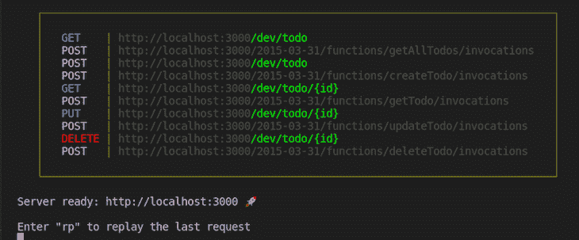
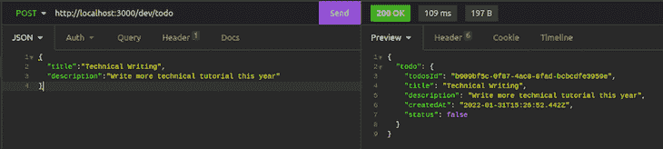
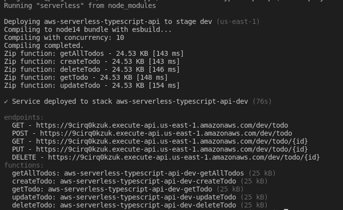

# 使用 TypeScript 构建无服务器应用程序

> 原文：<https://blog.logrocket.com/building-serverless-app-typescript/>

您知道吗，您可以在云上编写和部署代码，而不必担心底层基础架构的供应、维护和扩展。在本教程中，我们将学习如何使用 TypeScript 和[无服务器框架](https://github.com/serverless/serverless)构建一个无服务器应用程序。

该项目的完整代码可在 [GitHub 库](https://github.com/icode247/aws-serverless-typescript-api/)获得。你可以随意克隆这个项目来跟进。我们开始吧！

### 目录

## 什么是无服务器计算？

无服务器计算是云计算的一种执行模式，其中云提供商按需分配机器资源，代表其客户端管理服务器。

术语“无服务器”是误导性的，因为服务器仍然使用云服务提供商为开发者运行代码。代码通常在无状态容器中执行，这些容器可以由 HTTP 请求、队列服务、监控警报、文件上传、预定事件、数据库事件等事件触发。

## 什么是无服务器框架？

无服务器框架是一个开源命令行界面(CLI)和托管仪表板，支持全面的无服务器应用程序生命周期管理。

无服务器框架允许您以最小的开销和成本设计、部署、调试和保护无服务器应用程序，同时提供所需的基础设施资源，如 AWS、Azure、Google 等。它为开箱即用的最佳实践提供了结构、自动化和支持，使您能够专注于开发复杂的、事件驱动的、由函数和事件组成的无服务器系统。

与其他应用程序框架相比，无服务器框架有几个优点。首先，它管理您的代码和基础设施，并支持多种语言，如 Node.js、Python、Java 等等。

它有一个托管的仪表板，允许您导入现有项目、跟踪性能、排除故障、配置 CI/CD 和部署策略，并获得端到端的无服务器应用程序生命周期管理。

## 什么是 AWS Lambda？

[AWS Lambda 是 Amazon Web Services 的一个事件驱动的无服务器计算平台](https://blog.logrocket.com/deploying-a-serverless-api-to-aws-with-claudia-js/)，它运行代码以响应事件，并自动维护代码所需的计算资源。

对于本教程中的例子，我们将使用 AWS Lambda 来运行和管理我们的无服务器功能。首先，[创建一个 AWS 免费层帐户](https://aws.amazon.com/free/#AWS_FREE_TIER)。然后，按照官方无服务器文档中的[步骤创建一个 IAM 用户和访问密钥。设置好一切后，让我们安装 AWS CLI 并设置我们的凭证。](https://www.serverless.com/framework/docs/providers/aws/guide/credentials#create-an-iam-user-and-access-key)

### 设置 AWS CLI

为了从您的终端创建和管理资源，无服务器框架需要访问您的云提供商帐户。要安装 AWS CLI，您可以遵循官方文档中的[步骤。然后，通过运行以下命令来设置您的凭据:](https://docs.aws.amazon.com/cli/latest/userguide/getting-started-install.html)

```
aws configure

```

上面的命令将提示您输入 AWS 凭证。一旦你添加了它们，点击**回车**按钮。

## 项目设置

使用下面的命令，我们将全局安装无服务器软件包，并初始化一个新的无服务器类型脚本项目:

```
# Install serverless package globally
npm install -g serverless
#Initialize a new serverless project
serverless create --template aws-nodejs-typescript --path aws-serverless-typescript-api

```

上面的命令安装无服务器包，然后用以下文件夹结构和一些样板代码初始化一个新的无服务器项目:

```
aws-serverless-typescript-api
 ┣ src
 ┃ ┣ functions
 ┃ ┃ ┣ hello
 ┃ ┃ ┃ ┣ handler.ts
 ┃ ┃ ┃ ┣ index.ts
 ┃ ┃ ┃ ┣ mock.json
 ┃ ┃ ┃ ┗ schema.ts
 ┃ ┃ ┗ index.ts
 ┃ ┗ libs
 ┃ ┃ ┣ api-gateway.ts
   handler-resolver.ts
 ┃ ┃ ┗ lambda.ts
 ┣ .npmignore
┣ .nvmrc
 ┣ README.md
 ┣ package.json
 ┣ serverless.ts
 ┣ tsconfig.json
 ┗ tsconfig.paths.json

```

删除`hello`功能文件夹，然后使用以下命令安装运行应用程序所需的所有软件包:

```
npm install
#OR
yarn

```

### 安装依赖项

让我们安装项目所需的其他依赖项。运行以下命令安装 [uuid 模块](https://www.npmjs.com/package/uuid):

```
#shell
npm install uuid

```

该模块将用于为我们的数据库中的待办事项列表项目生成随机 id。

## 配置我们的项目

接下来，我们将打开`src`文件夹并为我们的项目创建一个文件夹结构。在`src`文件夹中创建以下文件夹:

*   我们将定义我们的模式，并将其连接到我们的数据库
*   我们将创建我们的业务处理函数
*   `Functions/todo`:我们将创建我们的`todos`函数

创建上面的文件夹后，您应该有一个新的项目结构，如下所示:

```
aws-serverless-typescript-api
 ┣ src
 ┃ ┣ functions
 ┃ ┃ ┗ todo
 ┃ ┣ libs
 ┃ ┃ ┣ api-gateway.ts
 ┃ ┃ ┣ handler-resolver.ts
 ┃ ┃ ┗ lambda.ts
 ┃ ┣ model
 ┃ ┗ service
 ┣ .npmignore
 ┣ .nvmrc
 ┣ README.md
 ┣ package.json
 ┣ serverless.ts
 ┣ tsconfig.json
 ┗ tsconfig.paths.json

```

现在，让我们在配置文件`serverless.ts`中添加一些实际的配置。用下面的代码片段替换`serverless.ts`文件中的代码:

```
import type { AWS } from '@serverless/typescript';
import { createTodo, getTodo, getAllTodos, updateTodo, deleteTodo } from '@functions/todo';
const serverlessConfiguration: AWS = {
  service: 'aws-serverless-typescript-api',
  frameworkVersion: '3',
  plugins: ['serverless-esbuild', 'serverless-offline', 'serverless-dynamodb-local'],
  provider: {
    name: 'aws',
    runtime: 'nodejs14.x',
    apiGateway: {
      minimumCompressionSize: 1024,
      shouldStartNameWithService: true,
    },
    environment: {
      AWS_NODEJS_CONNECTION_REUSE_ENABLED: '1',
      NODE_OPTIONS: '--enable-source-maps --stack-trace-limit=1000',
    },
    iam: {
      role: {
        statements: [{
          Effect: "Allow",
          Action: [
            "dynamodb:DescribeTable",
            "dynamodb:Query",
            "dynamodb:Scan",
            "dynamodb:GetItem",
            "dynamodb:PutItem",
            "dynamodb:UpdateItem",
            "dynamodb:DeleteItem",
          ],
          Resource: "arn:aws:dynamodb:us-west-2:*:table/TodosTable",
        }],
      },
    },
  },
  // import the function via paths
  functions: { getAllTodos, createTodo, getTodo, updateTodo, deleteTodo },
  package: { individually: true },
  custom:{
    esbuild: {
      bundle: true,
      minify: false,
      sourcemap: true,
      exclude: ['aws-sdk'],
      target: 'node14',
      define: { 'require.resolve': undefined },
      platform: 'node',
      concurrency: 10,
    },
    dynamodb:{
      start:{
        port: 5000,
        inMemory: true,
        migrate: true,
      },
      stages: "dev"
    }
  },
  resources: {
    Resources: {
      TodosTable: {
        Type: "AWS::DynamoDB::Table",
        Properties: {
          TableName: "TodosTable",
          AttributeDefinitions: [{
            AttributeName: "todosId",
            AttributeType: "S",
          }],
          KeySchema: [{
            AttributeName: "todosId",
            KeyType: "HASH"
          }],
          ProvisionedThroughput: {
            ReadCapacityUnits: 1,
            WriteCapacityUnits: 1
          },

        }
      }
    }
  }
};
module.exports = serverlessConfiguration;

```

让我们回顾一下我们为项目设置的主要配置。首先，关于我们项目的信息在服务部分`aws-serverless-typescript-api`中定义。

是我们的项目运行的无服务器框架的版本。版本 3 是撰写本文时的最新版本。

在`Plugins`中，我们定义了覆盖或扩展项目功能所需的插件。我们有两个插件，`serverless-esbuild`和`serverless-offline`，使我们的项目能够在本地运行。`serverless-dynamodb-local`使我们能够在本地运行 DynamoDB。

在`Provider`中，我们配置了用于我们项目的云提供商。我们定义了云提供者的一些属性，如`name`、`runtime`、`apiGateway`和`iam`语句，以赋予 Lambda 函数`read`和`write`对 DynamoDB 资源表的权限。

在`Resources`中，我们为 DynamoDB 数据库添加了`cloudFormation`资源模板。在这里，我们定义了一些属性，如`tableName`、`AttributeDefinitions`，其中我们指定了表的主键`todosId`，以及`ProvisionedThroughput`，其中我们设置了表在一秒钟内可以读写的单元数量。

在`Custom`中，我们定义了我们的定制配置。我们为 DynamoDB 数据库定义了`port 5000`。

## 连接到 DynamoDB

在`src/model`文件夹中，我们将创建一个`index.ts`文件，并使用下面的代码片段连接到 DynamoDB:

```
import * as AWS from "aws-sdk";
import { DocumentClient } from "aws-sdk/clients/dynamodb";

export default const dynamoDBClient = (): DocumentClient => {
  if (process.env.IS_OFFLINE) {
    return new AWS.DynamoDB.DocumentClient({
      region: "localhost",
      endpoint: "http://localhost:5000",
    });
  }
  return new AWS.DynamoDB.DocumentClient();
};

```

在上面的代码片段中，我们使用`AWS.DynamoDB.DocumentClient`方法连接到了 DynamoDB 数据库。当我们在本地运行项目时，我们将连接到 DynamoDB localhost 端点。然后，我们将使用下面的命令在本地安装 DynamoDB:

```
serverless dynamodb install

```

## 创建我们的模型

在`src/model`文件夹中，我们创建一个`Todo.ts`文件，并添加下面的代码片段:

```
export default interface Todo {
    todosId: string;
    title: string;
    description: string;
    status: boolean;
    createdAt: string;
}

```

在上面的代码片段中，我们为我们的`todo`对象定义了一个接口。所有保存在我们的`TodosTable`中的待办事项列表项都将是那个形式。

## 创造我们的服务

我们将通过在`/src/service`文件夹中创建一个`service.ts`文件来为我们的 Lambda 函数创建服务。然后，我们将从`[aws-sdk](https://www.npmjs.com/package/aws-sdk)`导入`DocumentClinet`，导入我们的`Todo`模型，并用构造函数方法创建一个`TodosService`类。

我们将把`DocumentClient`注入到我们的`TodosService`类中，然后用下面的代码片段为我们的表名创建一个全局变量:

```
import { DocumentClient } from "aws-sdk/clients/dynamodb";
import Todo from "../model/Todo";

export default class TodoServerice {

    private Tablename: string = "TodosTable2";

    constructor(private docClient: DocumentClient) { }
    ...

```

然后，我们创建`getAllTodos`方法，该方法返回数据库中所有待办事项的承诺:

```
    ...
    async getAllTodos(): Promise<Todo[]> {
        const todos = await this.docClient.scan({
            TableName: this.Tablename,
        }).promise()
        return todos.Items as Todo[];
     }
     ...

```

接下来，我们创建`createTodo`方法，这将允许我们向数据库添加新的待办事项列表项。处理函数接受一个`todo`对象作为参数，它的类型是`Todo model`:

```
   ... 
   async createTodo(todo: Todo): Promise<Todo> {
        await this.docClient.put({
            TableName: this.Tablename,
            Item: todo
        }).promise()
        return todo as Todo;

    }
    ...

```

我们创建了一个`getTodo`方法，它接受`todo ID`作为参数，返回带有请求参数 ID 的`todo`:

```
   ...
    async getTodo(id: string): Promise<any> {

        const todo = await this.docClient.get({
            TableName: this.Tablename,
            Key: {
                todosId: id
            }
        }).promise()
        if (!todo.Item) {
            throw new Error("Id does not exit");
        }
        return todo.Item as Todo;

    }
    ...

```

为了更新数据库中的待办事项列表，我们创建了一个`updateTodo`方法。像`getTodo`方法一样，`updateTodo`方法也将`todo id`作为参数，用请求参数中的 ID 更新`todo`的状态:

```
   ...
      async updateTodo(id: string, todo: Partial<Todo>): Promise<Todo> {
        const updated = await this.docClient
            .update({
                TableName: this.Tablename,
                Key: { todosId: id },
                UpdateExpression:
                    "set #status = :status",
                ExpressionAttributeNames: {
                    "#status": "status",
                },
                ExpressionAttributeValues: {
                    ":status": true,
                },
                ReturnValues: "ALL_NEW",
            })
            .promise();
        return updated.Attributes as Todo;
    }
    ...

```

接下来，我们创建一个`deleteTodo`方法，该方法也将`todo id`作为从数据库中删除 todo 的参数:

```
 ...
    async deleteTodo(id: string): Promise<any> {
        return await this.docClient.delete({
            TableName: this.Tablename,
            Key: {
                todosId: id
            }
        }).promise();
       }
     }
    ...

```

在我们的`TodosService`方法中，我们使用了 [DynamoDB `docClient`方法](https://docs.aws.amazon.com/amazondynamodb/latest/developerguide/GettingStarted.NodeJs.03.html)来创建我们的 CRUD 操作。最后，在`/src/service`文件夹中创建一个`index.ts`文件。用下面的代码片段创建并导出我们的`TodosService`的一个实例:

```
import dynamoDBClient from "../model/database";
import TodoServerice from "./todosService"

const todoService = new TodoServerice(dynamoDBClient());
export default todoService;

```

## 创建我们的λ函数

现在，我们将创建我们的 AWS Lambda 函数。首先，在`/src/functions/todo`文件夹中创建一个`handlers.ts`文件。

从 AWS Lambda，导入`APIGatewayProxyEvent`、`APIGatewayProxyResult`、`formatJSONResponse`向客户端返回 JSON 格式的响应，`middyfy`处理我们的中间件，`v4`生成随机字符串，我们的`todosService`:

```
import { APIGatewayProxyEvent, APIGatewayProxyResult } from "aws-lambda";
import { formatJSONResponse } from '@libs/api-gateway';
import { middyfy } from '@libs/lambda';
import { v4 } from "uuid";
import todosService from '../../services'
...

```

接下来，我们将创建我们的`getAllTodos` Lambda 函数。我们将函数包装在`middyfy`函数中，以对函数执行所有与中间件相关的操作。使用下面的代码片段，我们调用`getAllTodos`方法，等待结果，并将 todos 返回给客户端:

```
...
export const getAllTodos = middyfy(async (): Promise<APIGatewayProxyResult> => {
    const todos = await todosService.getAllTodos();
    return formatJSONResponse ({
        todos
    })
})
...

```

接下来，我们将创建自己的`createTodo`函数，其中我们将监听`APIGatewayProxyEvent`来获取请求体中的数据。然后，我们将调用`createTodo`方法并传入一个`todo`对象。我们将从请求体中获取`title`和`description`，并使用下面的代码片段默认添加其他细节:

```
...
export const createTodo = middyfy(async (event: APIGatewayProxyEvent): Promise<APIGatewayProxyResult> => {
    try {
        const id = v4();
        const todo = await todosService.createTodo({
            todosId: id,
            title: event.body.title,
            description: event.body.description,
            createdAt: new Date().toISOString(),
            status: false
        })
        return formatJSONResponse({
            todo
        });
    } catch (e) {
        return formatJSONResponse({
            status: 500,
            message: e
        });
    }
}
...

```

接下来，我们将创建我们的`getTodo`函数来消耗`getTodo`资源。我们将使用`pathParameters`事件从请求参数中获取`todo` ID。然后，我们将用下面的代码片段将 todo 返回给客户端:

```
...
export const getTodo = middyfy(async (event: APIGatewayProxyEvent): Promise<APIGatewayProxyResult> => {
    const id = event.pathParameters.id;
    try {
        const todo = await todosService.getTodo(id)
        return formatJSONResponse({
            todo, id
        });
    } catch (e) {
        return formatJSONResponse({
            status: 500,
            message: e
        });
    }
})
...

```

现在，让我们创建我们的`updateTodo` Lambda 函数。像`getTodo`函数一样，`updateTodo`将从请求参数中获取`todo`的 ID，然后从我们的`todosService`类中调用`deleteTodo`方法，用下面的代码删除一个待办事项:

```
...
export const updateTodo = middyfy(async (): Promise<APIGatewayProxyResult> => {
    const id = event.pathParameters.id;
    try {
        const todo = await todosService.updateTodo(id)
        return formatJSONResponse({
            todo, id
        });
    } catch (e) {
        return formatJSONResponse({
            status: 500,
            message: e
        });
    }
})
...

```

接下来，我们将创建我们的`deleteTodo` Lambda 函数，它也将从请求参数中获取`todo ID`,并从我们的`todosService`类中调用`deleteTodo`方法，删除一个待办事项:

```
...
export const deleteTodo = middyfy(async (event: APIGatewayProxyEvent): Promise<APIGatewayProxyResult> => {
    const id = event.pathParameters.id;
    try {
        const todo = await todosService.deleteTodo(id)
        return formatJSONResponse({
            todo, id
        });
    } catch (e) {
        return formatJSONResponse({
            status: 500,
            message: e
        });
    }
})

```

接下来，我们将配置并导出 Lambda 函数，使它们可用于我们的`serverless.ts`文件。在`functions/todo`文件夹中创建一个`index.ts`文件，并添加下面的代码片段:

```
import { handlerPath } from '@libs/handler-resolver';
export const getAllTodos = {
    handler: `${handlerPath(__dirname)}/handler.getAllTodos`,
    events: [
        {
            http: {
                method: 'get',
                path: 'todo/',
            },
        },
    ],
};

export const createTodo = {
    handler: `${handlerPath(__dirname)}/handler.createTodo`,
    events: [
        {
            http: {
                method: 'post',
                path: 'todo',
            },
        },
    ],
};

export const getTodo = {
    handler: `${handlerPath(__dirname)}/handler.getTodo`,
    events: [
        {
            http: {
                method: 'get',
                path: 'todo/{id}',
            },
        },
    ],
};

export const updateTodo = {
    handler: `${handlerPath(__dirname)}/handler.updateTodo`,
    events: [
        {
            http: {
                method: 'put',
                path: 'todo/{id}',
            },
        },
    ],
};

export const deleteTodo = {
    handler: `${handlerPath(__dirname)}/handler.deleteTodo`,
    events: [
        {
            http: {
                method: 'delete',
                path: 'todo/{id}',
            },
        },
    ],
};

```

在上面的代码中，我们定义了 Lambda 函数的属性，包括所有函数的`http method`和`path`。

最后，使用下面的代码片段，让我们在`serverless.ts`文件中配置 Lambda 函数，使它们可用于我们的无服务器框架:

```
...
import { createTodo, getTodo, getAllTodos, updateTodo, deleteTodo } from '@functions/todo';

//locate the function object, e.g. function: {} Add the code below.
 functions: { getAllTodos, createTodo, getTodo, updateTodo, deleteTodo },

```

至此，我们已经成功创建了 AWS Lambda 函数。

## 测试我们的应用

现在，我们将使用失眠症来测试我们的应用程序。或者，你可以使用邮递员。首先，运行下面的命令在本地启动应用程序:

```
serverless offline start

```

您应该会看到类似下面截图中的输出:



添加带有`POST /dev/todo`路线的待办端点:



继续测试其他端点**。**

## 将我们的 Lambda 函数部署到 AWS

现在，我们将使用下面的命令将 Lambda 函数部署到 AWS:

```
serverless deploy

```

部署完成后，您应该会在终端中看到我们的无服务器端点和功能，如下图所示:



## 结论

无论您想要构建什么类型的应用程序，无服务器框架都可以为您简化这个过程。如果您想使用 Node.js 或 TypeScript 之外的堆栈，无服务器框架支持 Java、Go、PowerShell、C#、Python 和 Ruby 等语言。

既然您已经熟悉了无服务器框架，那么您应该可以随意派生存储库并向项目添加额外的特性。我希望你从这篇教程中学到了很多。如果你喜欢它或有任何问题，请随时分享、评论或通过 [Twitter](https://twitter.com/EkekentaZion) 联系我。

## [LogRocket](https://lp.logrocket.com/blg/typescript-signup) :全面了解您的网络和移动应用

[](https://lp.logrocket.com/blg/typescript-signup)

LogRocket 是一个前端应用程序监控解决方案，可以让您回放问题，就像问题发生在您自己的浏览器中一样。LogRocket 不需要猜测错误发生的原因，也不需要向用户询问截图和日志转储，而是让您重放会话以快速了解哪里出错了。它可以与任何应用程序完美配合，不管是什么框架，并且有插件可以记录来自 Redux、Vuex 和@ngrx/store 的额外上下文。

除了记录 Redux 操作和状态，LogRocket 还记录控制台日志、JavaScript 错误、堆栈跟踪、带有头+正文的网络请求/响应、浏览器元数据和自定义日志。它还使用 DOM 来记录页面上的 HTML 和 CSS，甚至为最复杂的单页面和移动应用程序重新创建像素级完美视频。

[Try it for free](https://lp.logrocket.com/blg/typescript-signup)

.