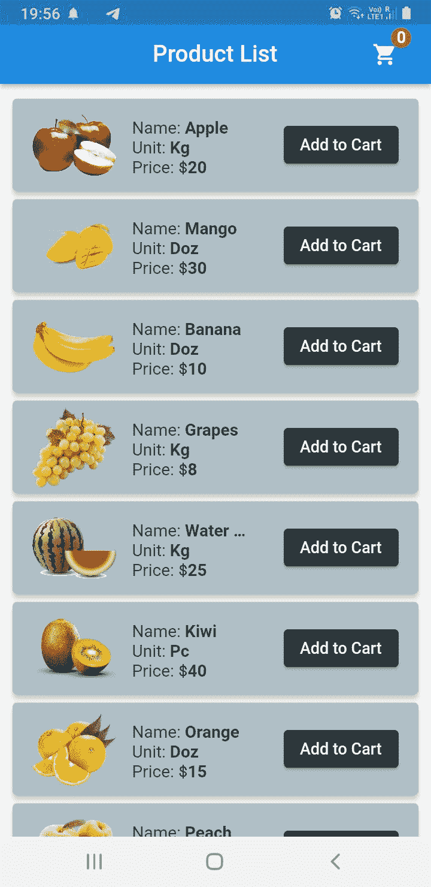
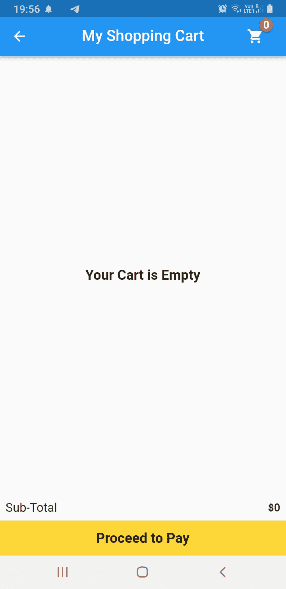
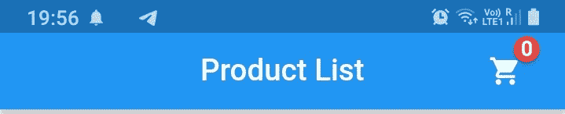
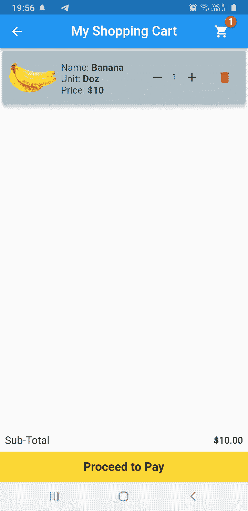
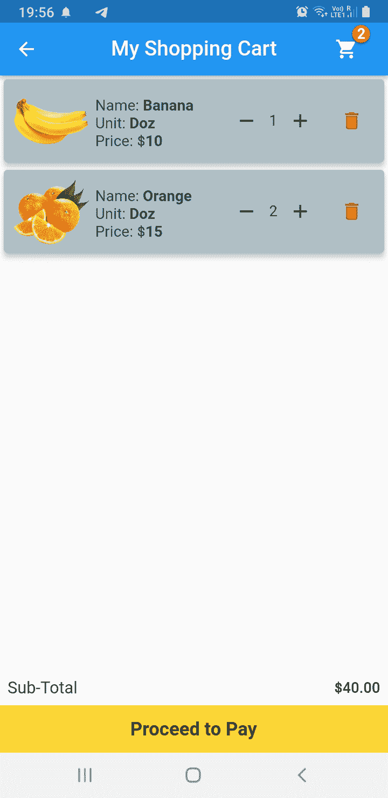
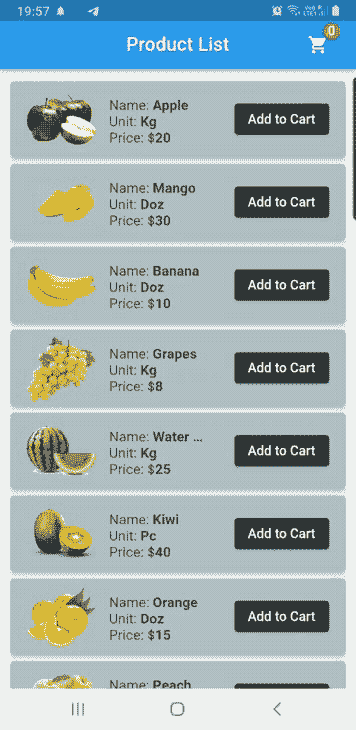

# 在 Flutter - LogRocket 博客中构建购物车

> 原文：<https://blog.logrocket.com/building-shopping-cart-flutter/>

世界和企业都在线。消费者渴望便利，而供应商只需点击一个按钮就能提供服务，这可以通过网站或移动应用程序来实现。

拥有一个电子商务网站或移动应用程序的好处是，企业可以为访问者提供更多的选择，由于空间的限制，这在实体店并不总是可以实现的。记住世界的现状和发展方向，企业将需要越来越多的开发人员为他们的商店创建应用程序。

这就是为什么今天我们创建一个简单的购物车应用程序，它有两个屏幕；UI 没有什么特别的，因为我们这里主要关注的是购物车的操作和功能。

我们将在应用程序中使用 SQFlite 和 SharedPreferences 将数据存储在本地设备上。SQFlite 和 SharedPreferences 存储数据，而 Provider 管理应用程序的状态。

正如我之前所说的，我们有两个屏幕。第一个是产品屏幕，显示水果清单、照片、水果名称和价格。每个列表项都包含一个按钮，允许您将其添加到购物篮中。

AppBar 包括一个带有徽章的购物车图标，每当用户按下 **Add to Car** t 按钮时，该图标就会更新商品计数。

第二个屏幕是购物车屏幕，显示用户添加到其中的物品列表。如果用户决定将其从购物车中删除，则删除按钮会将该商品从购物车屏幕中删除。

全部费用显示在屏幕底部。一个按钮，暂时显示一个 [SnackBar](https://blog.logrocket.com/how-to-display-and-customize-a-snackbar-in-flutter/) 确认付款已被处理。

因此，在简单介绍了我们正在开发的应用程序之后，让我们开始编程吧。





## 添加依赖关系

首先，让我们进入我们的`pubspec.yaml`文件，输入我们将用来构建我们的应用程序的所有必要的依赖项:

```
shared_preferences: ^2.0.15
path_provider: ^2.0.10
sqflite: ^2.0.2+1
badges: ^2.0.2
provider: ^6.0.3
```

您还需要添加图像，因此请确保您取消了对资产的注释，并在资产下添加了 images 文件夹。

## 建立

接下来，我们将开始创建名为`Cart`和`Item`的`Model`类。因此，创建一个新的 Dart 文件，并将其命名为`cart_model`，或者您也可以根据自己的需求命名它。输入下面给出的`Model`类代码:

```
class Cart {
 late final int? id;
 final String? productId;
 final String? productName;
 final int? initialPrice;
 final int? productPrice;
 final ValueNotifier<int>? quantity;
 final String? unitTag;
 final String? image;

 Cart(
     {required this.id,
     required this.productId,
     required this.productName,
     required this.initialPrice,
     required this.productPrice,
     required this.quantity,
     required this.unitTag,
     required this.image});

 Cart.fromMap(Map<dynamic, dynamic> data)
     : id = data['id'],
       productId = data['productId'],
       productName = data['productName'],
       initialPrice = data['initialPrice'],
       productPrice = data['productPrice'],
       quantity = ValueNotifier(data['quantity']),
       unitTag = data['unitTag'],
       image = data['image'];

 Map<String, dynamic> toMap() {
   return {
     'id': id,
     'productId': productId,
     'productName': productName,
     'initialPrice': initialPrice,
     'productPrice': productPrice,
     'quantity': quantity?.value,
     'unitTag': unitTag,
     'image': image,
   };
 }
}
```

创建另一个 Dart 文件，输入`item_model`和下面给出的代码:

```
class Item {
 final String name;
 final String unit;
 final int price;
 final String image;

 Item({required this.name, required this.unit, required this.price, required this.image});

 Map toJson() {
   return {
     'name': name,
     'unit': unit,
     'price': price,
     'image': image,
   };
 }
}
```

## 添加 SQFlite

正如我之前所说的，我们将使用 SQFlite，它本质上是 Flutter 的 SQLite，我们将把数据保存在手机内存中。我们没有从云中上传或获取数据，因为这篇文章的目的是学习购物车屏幕的基本操作。

因此，使用 SQFlite 包，我们正在构建一个名为`DBHelper`的数据库类:

```
import 'package:sqflite/sqflite.dart';
import 'package:path_provider/path_provider.dart';
import 'package:path/path.dart';
import 'dart:io' as io;
import 'package:shopping_cart_app/model/cart_model.dart';

class DBHelper {
 static Database? _database;

 Future<Database?> get database async {
   if (_database != null) {
     return _database!;
   }
   _database = await initDatabase();
   return null;
 }

 initDatabase() async {
   io.Directory directory = await getApplicationDocumentsDirectory();
   String path = join(directory.path, 'cart.db');
   var db = await openDatabase(path, version: 1, onCreate: _onCreate);
   return db;
 }
// creating database table
 _onCreate(Database db, int version) async {
   await db.execute(
       'CREATE TABLE cart(id INTEGER PRIMARY KEY, productId VARCHAR UNIQUE, productName TEXT, initialPrice INTEGER, productPrice INTEGER, quantity INTEGER, unitTag TEXT, image TEXT)');
 }
// inserting data into the table
 Future<Cart> insert(Cart cart) async {
   var dbClient = await database;
   await dbClient!.insert('cart', cart.toMap());
   return cart;
 }
// getting all the items in the list from the database
 Future<List<Cart>> getCartList() async {
   var dbClient = await database;
   final List<Map<String, Object?>> queryResult =
       await dbClient!.query('cart');
   return queryResult.map((result) => Cart.fromMap(result)).toList();
 }
Future<int> updateQuantity(Cart cart) async {
 var dbClient = await database;
 return await dbClient!.update('cart', cart.quantityMap(),
     where: "productId = ?", whereArgs: [cart.productId]);
}

// deleting an item from the cart screen
 Future<int> deleteCartItem(int id) async {
   var dbClient = await database;
   return await dbClient!.delete('cart', where: 'id = ?', whereArgs: [id]);
 }
}
```

## 添加`Provider`类

下一步将是开发我们的`Provider`类，它将包含我们所有的方法，并将我们的 UI 从最终管理我们整个应用程序的逻辑中分离出来。

除了 SqFlite，我们还使用 SharedPreferences。使用 SharedPreferences 的原因是，它包装了特定于平台的持久性来存储简单的数据，如商品数量和总价格，因此即使用户退出应用程序并返回，这些信息仍然可用。

创建一个名为`CartProvider`的新类，并将下面的代码粘贴到其中:

```
class CartProvider with ChangeNotifier {
 DBHelper dbHelper = DBHelper();
 int _counter = 0;
 int _quantity = 1;
 int get counter => _counter;
 int get quantity => _quantity;

 double _totalPrice = 0.0;
 double get totalPrice => _totalPrice;

 List<Cart> cart = [];

 Future<List<Cart>> getData() async {
   cart = await dbHelper.getCartList();
   notifyListeners();
   return cart;
 }

 void _setPrefsItems() async {
   SharedPreferences prefs = await SharedPreferences.getInstance();
   prefs.setInt('cart_items', _counter);
   prefs.setInt('item_quantity', _quantity);
   prefs.setDouble('total_price', _totalPrice);
   notifyListeners();
 }

 void _getPrefsItems() async {
   SharedPreferences prefs = await SharedPreferences.getInstance();
   _counter = prefs.getInt('cart_items') ?? 0;
   _quantity = prefs.getInt('item_quantity') ?? 1;
   _totalPrice = prefs.getDouble('total_price') ?? 0;
 }

 void addCounter() {
   _counter++;
   _setPrefsItems();
   notifyListeners();
 }

 void removeCounter() {
   _counter--;
   _setPrefsItems();
   notifyListeners();
 }

 int getCounter() {
   _getPrefsItems();
   return _counter;
 }

 void addQuantity(int id) {
   final index = cart.indexWhere((element) => element.id == id);
   cart[index].quantity!.value = cart[index].quantity!.value + 1;
   _setPrefsItems();
   notifyListeners();
 }

 void deleteQuantity(int id) {
   final index = cart.indexWhere((element) => element.id == id);
   final currentQuantity = cart[index].quantity!.value;
   if (currentQuantity <= 1) {
     currentQuantity == 1;
   } else {
     cart[index].quantity!.value = currentQuantity - 1;
   }
   _setPrefsItems();
   notifyListeners();
 }

 void removeItem(int id) {
   final index = cart.indexWhere((element) => element.id == id);
   cart.removeAt(index);
   _setPrefsItems();
   notifyListeners();
 }

 int getQuantity(int quantity) {
   _getPrefsItems();
   return _quantity;
 }

 void addTotalPrice(double productPrice) {
   _totalPrice = _totalPrice + productPrice;
   _setPrefsItems();
   notifyListeners();
 }

 void removeTotalPrice(double productPrice) {
   _totalPrice = _totalPrice - productPrice;
   _setPrefsItems();
   notifyListeners();
 }

 double getTotalPrice() {
   _getPrefsItems();
   return _totalPrice;
 }
}
```

现在让我们开始为产品列表屏幕构建 UI。首先，我们将向我们创建的`Item`模型添加数据。我们通过在我们的`Item`模型类中创建一个`List`产品来添加数据:

```
List<Item> products = [
 Item(
     name: 'Apple', unit: 'Kg', price: 20, image: 'assets/images/apple.png'),
 Item(
     name: 'Mango',
     unit: 'Doz',
     price: 30,
     image: 'assets/images/mango.png'),
 Item(
     name: 'Banana',
     unit: 'Doz',
     price: 10,
     image: 'assets/images/banana.png'),
 Item(
     name: 'Grapes',
     unit: 'Kg',
     price: 8,
     image: 'assets/images/grapes.png'),
 Item(
     name: 'Water Melon',
     unit: 'Kg',
     price: 25,
     image: 'assets/images/watermelon.png'),
 Item(name: 'Kiwi', unit: 'Pc', price: 40, image: 'assets/images/kiwi.png'),
 Item(
     name: 'Orange',
     unit: 'Doz',
     price: 15,
     image: 'assets/images/orange.png'),
 Item(name: 'Peach', unit: 'Pc', price: 8, image: 'assets/images/peach.png'),
 Item(
     name: 'Strawberry',
     unit: 'Box',
     price: 12,
     image: 'assets/images/strawberry.png'),
 Item(
     name: 'Fruit Basket',
     unit: 'Kg',
     price: 55,
     image: 'assets/images/fruitBasket.png'),
];
```

因此，从顶部的 AppBar 开始，我们添加了一个 IconButton，它包装在我们添加到应用程序中的`Badge`包中。`Icon`是一个购物车，上面的徽章显示有多少商品被添加到我们的购物车中。

请看看下面的图片和代码。我们用一个`Consumer`小部件包装了`Text`小部件，因为每次用户点击**添加到购物车**按钮时，当`Text`小部件必须更新商品计数时，整个 UI 不需要重新构建。而`Consumer` 小部件正是为我们做的:



```
AppBar(
 centerTitle: true,
 title: const Text('Product List'),
 actions: [
   Badge(
     badgeContent: Consumer<CartProvider>(
       builder: (context, value, child) {
         return Text(
           value.getCounter().toString(),
           style: const TextStyle(
               color: Colors.white, fontWeight: FontWeight.bold),
         );
       },
     ),
     position: const BadgePosition(start: 30, bottom: 30),
     child: IconButton(
       onPressed: () {
         Navigator.push(
             context,
             MaterialPageRoute(
                 builder: (context) => const CartScreen()));
       },
       icon: const Icon(Icons.shopping_cart),
     ),
   ),
   const SizedBox(
     width: 20.0,
   ),
 ],
),
```

`Scaffold`的主体是一个`ListView`构建器，它返回一个`Card`小部件，其中包含我们创建的列表中的信息、水果的名称、单位和单价，以及一个将该商品添加到购物车的按钮。请查看下面提供的图像和代码:


```
ListView.builder(
   padding: const EdgeInsets.symmetric(vertical: 10.0, horizontal: 8.0),
   shrinkWrap: true,
   itemCount: products.length,
   itemBuilder: (context, index) {
     return Card(
       color: Colors.blueGrey.shade200,
       elevation: 5.0,
       child: Padding(
         padding: const EdgeInsets.all(4.0),
         child: Row(
           mainAxisAlignment: MainAxisAlignment.spaceEvenly,
           mainAxisSize: MainAxisSize.max,
           children: [
             Image(
               height: 80,
               width: 80,
               image: AssetImage(products[index].image.toString()),
             ),
             SizedBox(
               width: 130,
               child: Column(
                 crossAxisAlignment: CrossAxisAlignment.start,
                 children: [
                   const SizedBox(
                     height: 5.0,
                   ),
                   RichText(
                     overflow: TextOverflow.ellipsis,
                     maxLines: 1,
                     text: TextSpan(
                         text: 'Name: ',
                         style: TextStyle(
                             color: Colors.blueGrey.shade800,
                             fontSize: 16.0),
                         children: [
                           TextSpan(
                               text:
                                   '${products[index].name.toString()}\n',
                               style: const TextStyle(
                                   fontWeight: FontWeight.bold)),
                         ]),
                   ),
                   RichText(
                     maxLines: 1,
                     text: TextSpan(
                         text: 'Unit: ',
                         style: TextStyle(
                             color: Colors.blueGrey.shade800,
                             fontSize: 16.0),
                         children: [
                           TextSpan(
                               text:
                                   '${products[index].unit.toString()}\n',
                               style: const TextStyle(
                                   fontWeight: FontWeight.bold)),
                         ]),
                   ),
                   RichText(
                     maxLines: 1,
                     text: TextSpan(
                         text: 'Price: ' r"$",
                         style: TextStyle(
                             color: Colors.blueGrey.shade800,
                             fontSize: 16.0),
                         children: [
                           TextSpan(
                               text:
                                   '${products[index].price.toString()}\n',
                               style: const TextStyle(
                                   fontWeight: FontWeight.bold)),
                         ]),
                   ),
                 ],
               ),
             ),
             ElevatedButton(
                 style: ElevatedButton.styleFrom(
                     primary: Colors.blueGrey.shade900),
                 onPressed: () {
                   saveData(index);
                 },
                 child: const Text('Add to Cart')),
           ],
         ),
       ),
     );
   }),
```

我们已经初始化了我们的`CartProvider`类，并创建了一个函数，当点击**添加到购物车**按钮时，该函数会将数据保存到数据库。它还更新了`AppBar`中的`Text`小部件徽章，并将总价格添加到最终将显示在购物车屏幕中的`Database`中:

```
final cart = Provider.of<CartProvider>(context);
void saveData(int index) {
 dbHelper
     .insert(
   Cart(
     id: index,
     productId: index.toString(),
     productName: products[index].name,
     initialPrice: products[index].price,
     productPrice: products[index].price,
     quantity: ValueNotifier(1),
     unitTag: products[index].unit,
     image: products[index].image,
   ),
 )
     .then((value) {
   cart.addTotalPrice(products[index].price.toDouble());
   cart.addCounter();
   print('Product Added to cart');
 }).onError((error, stackTrace) {
   print(error.toString());
 });
}
```

## 制作购物车屏幕

转到购物车屏幕，布局类似于产品列表屏幕。当用户点击**添加到购物车**按钮时，所有信息都会显示在购物车屏幕上。

该实现类似于我们所看到的其他电子商务应用程序。这两种布局的主要区别在于购物车屏幕包括一个增量和减量按钮，用于增加和减少商品的数量。

当用户单击加号时，数量增加，当用户单击减号时，数量减少。当按下加号和减号按钮时，购物车的总价会增加或减少。删除按钮从购物车列表中删除商品，并从总价中减去价格。我们再次用`Consumer`小部件包装了`ListView`构建器，因为只需要重建和更新 UI 的一部分，而不是整个页面。





```
class CartScreen extends StatefulWidget { const CartScreen({
   Key? key,
 }) : super(key: key);

 @override
 State<CartScreen> createState() => _CartScreenState();
}
class _CartScreenState extends State<CartScreen> {
 DBHelper? dbHelper = DBHelper();

 @override
 void initState() {
   super.initState();
   context.read<CartProvider>().getData();
 }

 @override
 Widget build(BuildContext context) {
   final cart = Provider.of<CartProvider>(context);
   return Scaffold(
     appBar: AppBar(
       centerTitle: true,
       title: const Text('My Shopping Cart'),
       actions: [
         Badge(
           badgeContent: Consumer<CartProvider>(
             builder: (context, value, child) {
               return Text(
                 value.getCounter().toString(),
                 style: const TextStyle(
                     color: Colors.white, fontWeight: FontWeight.bold),
               );
             },
           ),
           position: const BadgePosition(start: 30, bottom: 30),
           child: IconButton(
             onPressed: () {},
             icon: const Icon(Icons.shopping_cart),
           ),
         ),
         const SizedBox(
           width: 20.0,
         ),
       ],
     ),
     body: Column(
       children: [
         Expanded(
           child: Consumer<CartProvider>(
             builder: (BuildContext context, provider, widget) {
               if (provider.cart.isEmpty) {
                 return const Center(
                     child: Text(
                   'Your Cart is Empty',
                   style:
                       TextStyle(fontWeight: FontWeight.bold, fontSize: 18.0),
                 ));
               } else {
                 return ListView.builder(
                     shrinkWrap: true,
                     itemCount: provider.cart.length,
                     itemBuilder: (context, index) {
                       return Card(
                         color: Colors.blueGrey.shade200,
                         elevation: 5.0,
                         child: Padding(
                           padding: const EdgeInsets.all(4.0),
                           child: Row(
                             mainAxisAlignment: MainAxisAlignment.spaceEvenly,
                             mainAxisSize: MainAxisSize.max,
                             children: [
                               Image(
                                 height: 80,
                                 width: 80,
                                 image:
                                     AssetImage(provider.cart[index].image!),
                               ),
                               SizedBox(
                                 width: 130,
                                 child: Column(
                                   crossAxisAlignment:
                                       CrossAxisAlignment.start,
                                   children: [
                                     const SizedBox(
                                       height: 5.0,
                                     ),
                                     RichText(
                                       overflow: TextOverflow.ellipsis,
                                       maxLines: 1,
                                       text: TextSpan(
                                           text: 'Name: ',
                                           style: TextStyle(
                                               color: Colors.blueGrey.shade800,
                                               fontSize: 16.0),
                                           children: [
                                             TextSpan(
                                              text:                                            '${provider.cart[index].productName!}\n',
                                                 style: const TextStyle(
                                                     fontWeight:
                                                         FontWeight.bold)),
                                           ]),
                                     ),
                                     RichText(
                                       maxLines: 1,
                                       text: TextSpan(
                                           text: 'Unit: ',
                                           style: TextStyle(
                                               color: Colors.blueGrey.shade800,
                                               fontSize: 16.0),
                                           children: [
                                             TextSpan(
                                                 text:
                                                     '${provider.cart[index].unitTag!}\n',
                                                 style: const TextStyle(
                                                     fontWeight:
                                                         FontWeight.bold)),
                                           ]),
                                     ),
                                     RichText(
                                       maxLines: 1,
                                       text: TextSpan(
                                           text: 'Price: ' r"$",
                                           style: TextStyle(
                                               color: Colors.blueGrey.shade800,
                                               fontSize: 16.0),
                                           children: [
                                             TextSpan(
                                                 text:
                                                     '${provider.cart[index].productPrice!}\n',
                                                 style: const TextStyle(
                                                     fontWeight:
                                                         FontWeight.bold)),
                                           ]),
                                     ),
                                   ],
                                 ),
                               ),
                               ValueListenableBuilder<int>(
                                   valueListenable:
                                       provider.cart[index].quantity!,
                                   builder: (context, val, child) {
                                     return PlusMinusButtons(
                                       addQuantity: () {
                                         cart.addQuantity(
                                             provider.cart[index].id!);
                                         dbHelper!
                                             .updateQuantity(Cart(
                                                 id: index,
                                                 productId: index.toString(),
                                                 productName: provider
                                                     .cart[index].productName,
                                                 initialPrice: provider
                                                     .cart[index].initialPrice,
                                                 productPrice: provider
                                                     .cart[index].productPrice,
                                                 quantity: ValueNotifier(
                                                     provider.cart[index]
                                                         .quantity!.value),
                                                 unitTag: provider
                                                     .cart[index].unitTag,
                                                 image: provider
                                                     .cart[index].image))
                                             .then((value) {
                                           setState(() {
                                             cart.addTotalPrice(double.parse(
                                                 provider
                                                     .cart[index].productPrice
                                                     .toString()));
                                           });
                                         });
                                       },
                                       deleteQuantity: () {
                                         cart.deleteQuantity(
                                             provider.cart[index].id!);
                                         cart.removeTotalPrice(double.parse(
                                             provider.cart[index].productPrice
                                                 .toString()));
                                       },
                                       text: val.toString(),
                                     );
                                   }),
                               IconButton(
                                   onPressed: () {
                                     dbHelper!.deleteCartItem(
                                         provider.cart[index].id!);
                                     provider
                                         .removeItem(provider.cart[index].id!);
                                     provider.removeCounter();
                                   },
                                   icon: Icon(
                                     Icons.delete,
                                     color: Colors.red.shade800,
                                   )),
                             ],
                           ),
                         ),
                       );
                     });
               }
             },
           ),
         ),
         Consumer<CartProvider>(
           builder: (BuildContext context, value, Widget? child) {
             final ValueNotifier<int?> totalPrice = ValueNotifier(null);
             for (var element in value.cart) {
               totalPrice.value =
                   (element.productPrice! * element.quantity!.value) +
                       (totalPrice.value ?? 0);
             }
             return Column(
               children: [
                 ValueListenableBuilder<int?>(
                     valueListenable: totalPrice,
                     builder: (context, val, child) {
                       return ReusableWidget(
                           title: 'Sub-Total',
                           value: r'$' + (val?.toStringAsFixed(2) ?? '0'));
                     }),
               ],
             );
           },
         )
       ],
     ),
     bottomNavigationBar: InkWell(
       onTap: () {
         ScaffoldMessenger.of(context).showSnackBar(
           const SnackBar(
             content: Text('Payment Successful'),
             duration: Duration(seconds: 2),
           ),
         );
       },
       child: Container(
         color: Colors.yellow.shade600,
         alignment: Alignment.center,
         height: 50.0,
         child: const Text(
           'Proceed to Pay',
           style: TextStyle(
             fontSize: 18.0,
             fontWeight: FontWeight.bold,
           ),
         ),
       ),
     ),
   );
 }
}

class PlusMinusButtons extends StatelessWidget {
 final VoidCallback deleteQuantity;
 final VoidCallback addQuantity;
 final String text;
 const PlusMinusButtons(
     {Key? key,
     required this.addQuantity,
     required this.deleteQuantity,
     required this.text})
     : super(key: key);

 @override
 Widget build(BuildContext context) {
   return Row(
     children: [
       IconButton(onPressed: deleteQuantity, icon: const Icon(Icons.remove)),
       Text(text),
       IconButton(onPressed: addQuantity, icon: const Icon(Icons.add)),
     ],
   );
 }
}

class ReusableWidget extends StatelessWidget {
 final String title, value;
 const ReusableWidget({Key? key, required this.title, required this.value});

 @override
 Widget build(BuildContext context) {
   return Padding(
     padding: const EdgeInsets.all(8.0),
     child: Row(
       mainAxisAlignment: MainAxisAlignment.spaceBetween,
       children: [
         Text(
           title,
           style: Theme.of(context).textTheme.subtitle1,
         ),
         Text(
           value.toString(),
           style: Theme.of(context).textTheme.subtitle2,
         ),
       ],
     ),
   );
 }
}
```

在代码末尾，底部导航栏之前，有一个从`Column`小部件中返回`ValueNotifierBuilder`的`Consumer`小部件。当用户单击购物车屏幕上的加号或减号按钮时，它负责更新特定商品的数量。屏幕底部有一个底部导航栏和一个按钮。

支付选项还没有建立，因为不在本文讨论范围内，不过你可以看另一篇文章 [Flutter Stripe SDK](https://blog.logrocket.com/exploring-stripe-flutter-sdk/) 的 Flutter 中的[应用内购买选项。](https://blog.logrocket.com/flutter-in-app-purchase-subscription-capability/)

为了完成购物车屏幕的 UI，我在底部添加了一个按钮，当按下该按钮时，会弹出一个 SnackBar，确认用户已经完成了支付。之后，我们有两个定制的小部件，一个用于增量和减量按钮，另一个用于在屏幕底部显示总价。

这是整个应用程序的工作方式，以及到源代码的 [GitHub](https://github.com/timelessfusionapps/shopping_cart_app) 链接。



## 结论

这就是本文的全部内容。希望你喜欢阅读它，并从中学到一些新的东西！我要感谢我的一个朋友 Rohit Goswami，一个 Flutter 开发者，他帮我调试了这个应用程序中的代码。为他干杯！

谢谢大家！保重，保持安全。

## 使用 [LogRocket](https://lp.logrocket.com/blg/signup) 消除传统错误报告的干扰

[](https://lp.logrocket.com/blg/signup)

[LogRocket](https://lp.logrocket.com/blg/signup) 是一个数字体验分析解决方案，它可以保护您免受数百个假阳性错误警报的影响，只针对几个真正重要的项目。LogRocket 会告诉您应用程序中实际影响用户的最具影响力的 bug 和 UX 问题。

然后，使用具有深层技术遥测的会话重放来确切地查看用户看到了什么以及是什么导致了问题，就像你在他们身后看一样。

LogRocket 自动聚合客户端错误、JS 异常、前端性能指标和用户交互。然后 LogRocket 使用机器学习来告诉你哪些问题正在影响大多数用户，并提供你需要修复它的上下文。

关注重要的 bug—[今天就试试 LogRocket】。](https://lp.logrocket.com/blg/signup-issue-free)