# 用 Go 和 PostgreSQL 构建一个简单的应用程序

> 原文：<https://blog.logrocket.com/building-simple-app-go-postgresql/>

## 介绍

PostgreSQL 是当今最流行的 SQL 数据库之一。根据[官方文档](https://docs.xano.com/technology/postgresql)，它是“一个强大的、开源的对象关系数据库系统，经过三十多年的积极开发，在可靠性、功能健壮性和性能方面赢得了良好的声誉。”

在本文中，我们将探讨如何在 Go 应用程序中使用 Postgres。

## 先决条件

在我们开始开发这个应用程序之前，我们需要设置一些东西:

*   go——因为这是我们选择的编程语言，我们需要将它安装在我们的本地环境中
*   PostgreSQL —我们将使用 PostgreSQL 作为我们的数据库。因此，出于开发目的，您需要将它安装在您的本地环境中。但是，在生产中，您可能会考虑一个更健壮、更安全的解决方案，比如云产品。AWS Aurora 就是一个例子。你可以[在这里](https://www.postgresql.org/download/)从官网下载 PostgreSQL
*   pg admin 4——这是一个用户界面，允许我们可视化地管理我们的 Postgres 数据库。您可以[在这里](https://www.pgadmin.org/download/)下载 pgAdmin

## 我们将建立什么:一个简单的待办事项应用程序

我们将构建一个全栈 web 应用程序，允许我们在 Postgres 数据库上执行 CRUD 操作。基本上，我们将构建一个待办事项应用程序。这是完成后的应用程序的外观:

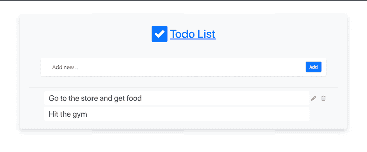

这个应用程序允许我们从数据库中获取、添加、编辑和删除待办事项。事不宜迟，我们开始吧。

在项目文件夹中创建一个名为`server.go`的文件，并添加以下代码:

```
package main

import (
   "fmt"
   "log"
   "os"

   "github.com/gofiber/fiber/v2"
)

func main() {
   app := fiber.New()
   port := os.Getenv("PORT")
   if port == "" {
       port = "3000"
   }
   log.Fatalln(app.Listen(fmt.Sprintf(":%v", port)))
}

```

我们首先导入`os`模块、`log`模块，当然还有我们选择的 web 框架，在本例中是 [Go Fiber](https://blog.logrocket.com/5-top-go-web-frameworks/#fiber) 。如果你对 Go Fiber 没有太多的经验，这里有一个[到 Go Fiber 文档](https://gofiber.io/)的链接供你查看。

我们在这里所做的是用`fiber.New`创建一个新的`fiber`对象，并将它赋给 app 变量。接下来，我们检查环境变量中名为`PORT`的变量，如果不存在，我们将端口分配给`3000`。

然后我们调用`app.Listen`来启动一个监听我们端口的 HTTP 服务器。接下来，我们调用`log.Fatalln()`在出现任何错误时将输出记录到控制台。在运行这段代码之前，让我们添加一些路线:

```
 func main() {
   app := fiber.New()

   app.Get("/", indexHandler) // Add this

   app.Post("/", postHandler) // Add this

   app.Put("/update", putHandler) // Add this

   app.Delete("/delete", deleteHandler) // Add this

   port := os.Getenv("PORT")
   if port == "" {
       port = "3000"
   }
   log.Fatalln(app.Listen(fmt.Sprintf(":%v", port)))
}

```

如您所见，我为我们的应用程序添加了四个方法来处理 GET、POST、PUT 和 DELETE 操作，以及四个处理程序方法，每当有人访问这些路线时都会调用这些方法。现在，让我们定义这些方法，这样 Go 将停止抛出错误:

```
func indexHandler(c *fiber.Ctx) error {
   return c.SendString("Hello")
}
func postHandler(c *fiber.Ctx) error {
   return c.SendString("Hello")
}
func putHandler(c *fiber.Ctx) error {
   return c.SendString("Hello")
}
func deleteHandler(c *fiber.Ctx) error {
   return c.SendString("Hello")
}

```

目前，我们只是在所有路线上回复“你好”。让我们运行我们的应用程序。在命令行上，运行命令`"go mod init"`，然后运行`"go mod tidy"`。这将创建一个`go.mod`文件，并获得应用程序需要的所有依赖项。

为了让我们在开发时有热重装，我们需要一个名为 Air 的 Go 包。

用`"go get github.com/cosmtrek/air"`导入。现在运行`"go run github.com/cosmtrek/air"`启动你的应用。这将启动我们的 web 服务器，并监视项目目录中的所有文件，允许我们在文件发生更改时进行热重新加载。

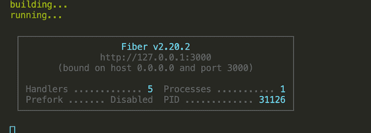

现在访问 [http://localhost/](http://localhost/) 查看应用。

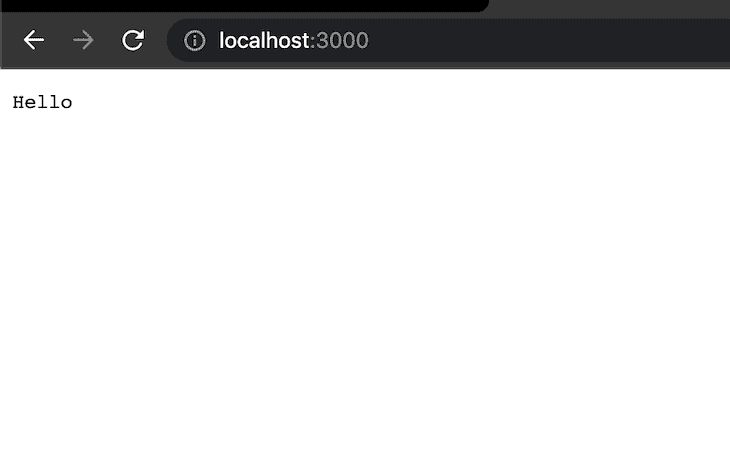

让我们创建一个到数据库的连接。在您的`main`方法中，在创建 Fiber 应用程序的实例之前，添加以下代码:

```
 connStr := "postgresql://<username>:<password>@<database_ip>/todos?sslmode=disable
"
   // Connect to database
   db, err := sql.Open("postgres", connStr)
   if err != nil {
       log.Fatal(err)
   }

```

确保用您数据库的用户名、密码和 IP 地址替换`username`、`password`、**、**和`database_ip`。

首先，我们需要导入将用于连接数据库的 SQL 驱动程序。[cocroach db](https://blog.logrocket.com/crud-golang-cockroachdb/)是一个 SQL 数据库，所以我们可以使用任何 Go Postgres/SQL 数据库驱动程序连接到它。在我们的例子中，我们将使用 pq 驱动程序。将您的导入更新为:

```
import (
   "database/sql" // add this
   "fmt"
   "log"
   "os"
   _ "github.com/lib/pq" // add this

   "github.com/gofiber/fiber/v2"
)

```

pq 驱动程序依赖于数据库/sql 包，所以我们也导入它。我们不会直接使用 pq 驱动程序，所以我们在它的导入前面加了一个下划线。

我们将使用 database/sql 包来执行所有数据库操作，如连接和执行查询。现在停止 app，运行`"go get github.com/lib/pq"`安装 pq 驱动。

接下来，我们将添加代码来创建数据库连接，并更新我们的路由以将数据库连接传递给我们的处理程序，以便我们可以使用它来执行数据库查询:

```
 connStr := "postgresql://<username>:<password>@<database_ip>/todos?sslmode=disable"
   // Connect to database
   db, err := sql.Open("postgres", connStr)
   if err != nil {
       log.Fatal(err)
   }

   app := fiber.New()

   app.Get("/", func(c *fiber.Ctx) error {
       return indexHandler(c, db)
   })

   app.Post("/", func(c *fiber.Ctx) error {
       return postHandler(c, db)
   })

   app.Put("/update", func(c *fiber.Ctx) error {
       return putHandler(c, db)
   })

   app.Delete("/delete", func(c *fiber.Ctx) error {
       return deleteHandler(c, db)
   })

```

如您所见，代替我们的处理程序，我们现在传递一个函数，该函数接受`fiber`上下文对象并将其与数据库连接一起传递给我们的处理程序。`fiber`上下文对象包含关于传入请求的所有内容，比如头、查询字符串参数、post 主体等。有关更多详细信息，请参考光纤文档。

现在，让我们更新我们的处理程序，以接受指向数据库连接的指针:

```
 func indexHandler(c *fiber.Ctx, db *sql.DB) error {
   return c.SendString("Hello")
}

func postHandler(c *fiber.Ctx, db *sql.DB) error {
   return c.SendString("Hello")
}

func putHandler(c *fiber.Ctx, db *sql.DB) error {
   return c.SendString("Hello")
}

func deleteHandler(c *fiber.Ctx, db *sql.DB) error {
   return c.SendString("Hello")
}
Now start the app again and you see it runs without errors. Here’s the full code up to here for reference.
package main

import (
   "database/sql" // add this
   "fmt"
   "log"
   "os"

   _ "github.com/lib/pq" // add this

   "github.com/gofiber/fiber/v2"
)

func indexHandler(c *fiber.Ctx, db *sql.DB) error {
   return c.SendString("Hello")
}

func postHandler(c *fiber.Ctx, db *sql.DB) error {
   return c.SendString("Hello")
}

func putHandler(c *fiber.Ctx, db *sql.DB) error {
   return c.SendString("Hello")
}

func deleteHandler(c *fiber.Ctx, db *sql.DB) error {
   return c.SendString("Hello")
}

func main() {
   connStr := "postgresql://<username>:<password>@<database_ip>/todos?sslmode=disable"
   // Connect to database
   db, err := sql.Open("postgres", connStr)
   if err != nil {
       log.Fatal(err)
   }
   app := fiber.New()

   app.Get("/", func(c *fiber.Ctx) error {
       return indexHandler(c, db)
   })

   app.Post("/", func(c *fiber.Ctx) error {
       return postHandler(c, db)
   })

   app.Put("/update", func(c *fiber.Ctx) error {
       return putHandler(c, db)
   })

   app.Delete("/delete", func(c *fiber.Ctx) error {
       return deleteHandler(c, db)
   })

   port := os.Getenv("PORT")
   if port == "" {
       port = "3000"
   }
   log.Fatalln(app.Listen(fmt.Sprintf(":%v", port)))
}

```

## 亮出我们的路线处理程序

在我们开始充实我们的处理程序之前，让我们建立我们的数据库。导航到您的 pgAdmin 4 控制台，创建一个名为 **todos** 的数据库。

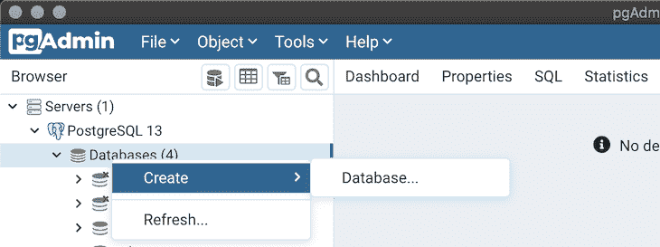

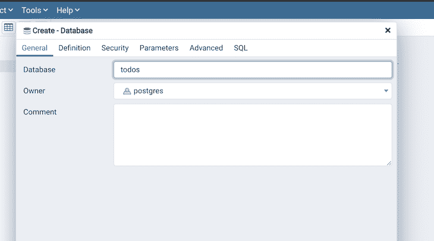

点击**保存**创建数据库。现在，展开 **todos** 数据库，在公共模式下，创建一个名为 **todos** 的新表，其中有一个名为 **item** 的列。

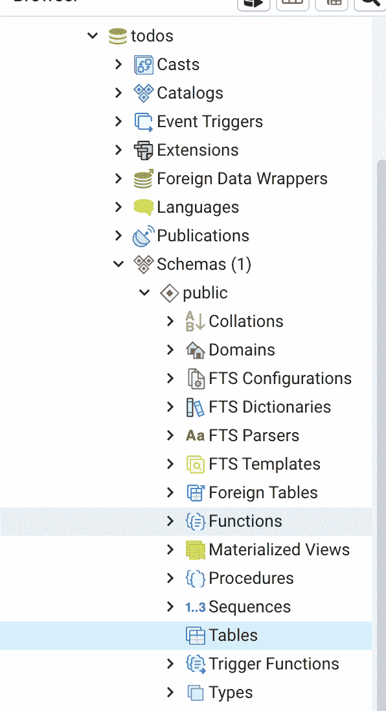

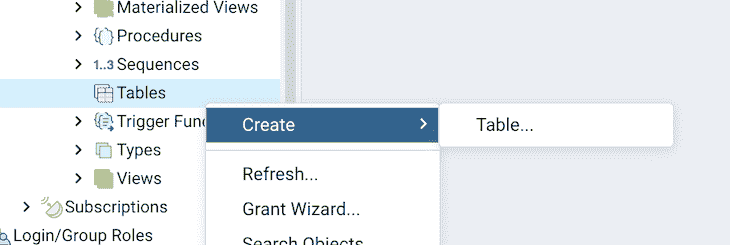

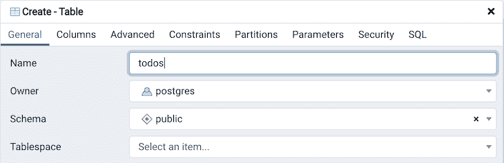

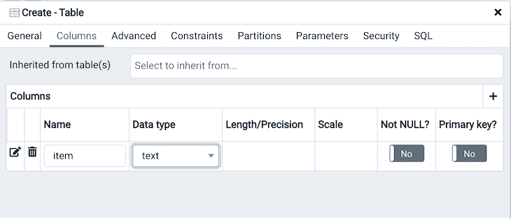

您已经成功创建了我们将要连接的数据库。关闭 pgAdmin 应用程序，让我们开始充实我们的处理程序方法。

将索引处理程序修改为:

```
 func indexHandler(c *fiber.Ctx, db *sql.DB) error {
   var res string
   var todos []string
   rows, err := db.Query("SELECT * FROM todos")
   defer rows.Close()
   if err != nil {
       log.Fatalln(err)
       c.JSON("An error occured")
   }
   for rows.Next() {
       rows.Scan(&res)
       todos = append(todos, res)
   }
   return c.Render("index", fiber.Map{
       "Todos": todos,
   })
}

```

好吧，你要理解的太多了！首先，我们使用`db`对象通过`db.Query()`函数在数据库上执行 SQL 查询。这将向我们返回与我们的查询匹配的所有行以及可能发生的任何错误。我们调用`defer rows.Close()`来关闭这些行，并在函数完成时阻止进一步的枚举。我们检查是否有任何错误，然后遍历所有行，每次迭代都调用`rows.Next()`，并使用`rows.Scan()`方法将该行的当前值赋给`res`变量，我们将其定义为一个字符串。然后我们将`res`的值添加到`todos`数组中。

注意`rows.Scan()`要求您传递一个数据类型与数据库中存储的数据相对应的变量。例如，如果你有多个列，比如姓名和年龄，你可以传入一个带有字段`name`和`age`的结构。更多信息请参考 [SQL 文档](https://pkg.go.dev/database/sql#Rows.Scan)。

然后我们返回到`index`视图，并将`todos`数组传递给它。谈到视图，让我们配置我们的 Fiber 应用程序来服务我们的 HTML 视图。这样修改你的`main`方法:

```
 engine := html.New("./views", ".html")
   app := fiber.New(fiber.Config{
       Views: engine,
   })

```

我们配置我们的 Fiber 应用程序使用 HTML 模板引擎，并传入`./views`作为视图所在位置的路径。停止应用程序，用`go get github.com/gofiber/template/html`安装 HTML 引擎，并确保导入它。

然后，在项目根目录下创建一个名为`views`的文件夹。在`views`中，创建一个名为`index .html`的文件，并添加以下代码:

```
<!DOCTYPE html>
<html lang="en">
<head>
   <meta charset="UTF-8">
   <meta http-equiv="X-UA-Compatible" content="IE=edge">
   <meta name="viewport" content="width=device-width, initial-scale=1.0">
   <link rel="stylesheet" href="/style.css"/>
   <link rel="stylesheet" href="https://stackpath.bootstrapcdn.com/bootstrap/4.1.3/css/bootstrap.min.css"/>
   <link rel="stylesheet" href="https://fonts.googleapis.com/css2?family=Open+Sans:ital,[email protected],300;0,400;0,600;0,700;0,800;1,300;1,400;1,600;1,700;1,800&amp;display=swap"/>
   <link rel="stylesheet" href="https://stackpath.bootstrapcdn.com/font-awesome/4.7.0/css/font-awesome.min.css"/>
   <link rel="stylesheet" href="https://cdnjs.cloudflare.com/ajax/libs/bootstrap-datepicker/1.9.0/css/bootstrap-datepicker.standalone.min.css"/>

   <title>Document</title>
</head>
<body>
   <div class="container m-5 p-2 rounded mx-auto bg-light shadow">
       <!-- App title section -->
       <div class="row m-1 p-4">
           <div class="col">
               <div class="p-1 h1 text-primary text-center mx-auto display-inline-block">
                   <i class="fa fa-check bg-primary text-white rounded p-2"></i>
                   <u>Todo List</u>
               </div>
           </div>
       </div>
       <!-- Create todo section -->
       <div class="row m-1 p-3">
           <div class="col col-11 mx-auto">
               <form action="/" method="POST" class="row bg-white rounded shadow-sm p-2 add-todo-wrapper align-items-center justify-content-center">
                   <div class="col">
                       <input name="Item" class="form-control form-control-lg border-0 add-todo-input bg-transparent rounded" type="text" placeholder="Add new ..">
                   </div>
                   <div class="col-auto px-0 mx-0 mr-2">
                       <button type="submit" class="btn btn-primary">Add</button>
                   </div>
               </form>
           </div>
       </div>
       <div class="p-2 m-2 mx-4 border-black-25 border-bottom"></div>
       <!-- Todo list section -->
       <div class="row mx-1 px-5 pb-3 w-80">
           <div class="col mx-auto">
               <!-- Todo Item-->
               {{range .Todos}}
               <div class="row px-3 align-items-center todo-item editing rounded">
                   <div class="col px-1 m-1 d-flex align-items-center">
                       <input type="text" class="form-control form-control-lg border-0 edit-todo-input bg-transparent rounded px-3 d-none" readonly value="{{.}}" title="{{.}}" />
                       <input  id="{{.}}"  type="text" class="form-control form-control-lg border-0 edit-todo-input rounded px-3" value="{{.}}" />
                   </div>
                   <div class="col-auto m-1 p-0 px-3 d-none">
                   </div>
                   <div class="col-auto m-1 p-0 todo-actions">
                       <div class="row d-flex align-items-center justify-content-end">
                           <h5 class="m-0 p-0 px-2">
                               <i onclick="updateDb('{{.}}')" class="fa fa-pencil text-warning btn m-0 p-0" data-toggle="tooltip" data-placement="bottom" title="Edit todo"></i>
                           </h5>
                           <h5 class="m-0 p-0 px-2">
                               <i onclick="removeFromDb('{{.}}')" class="fa fa-trash-o text-danger btn m-0 p-0" data-toggle="tooltip" data-placement="bottom" title="Delete todo"></i>
                           </h5>
                       </div>
                   </div>
               </div>
               {{end}}
           </div>
       </div>
   </div>
   </form>
   <script src="index.js"></script>
   <script src="https://code.jquery.com/jquery-3.3.1.slim.min.js"></script>
   <script src="https://cdnjs.cloudflare.com/ajax/libs/popper.js/1.14.3/umd/popper.min.js"></script>
   <script src="https://stackpath.bootstrapcdn.com/bootstrap/4.1.3/js/bootstrap.min.js"></script>
   <script src="https://stackpath.bootstrapcdn.com/bootlint/1.1.0/bootlint.min.js"></script>
</body>
</html>

```

这将遍历我们传入的`todos`数组并显示每一项。如果您检查该文件，您将看到我们也链接了一个样式表。创建一个名为`public`的文件夹，在其中创建一个名为`style.css`的文件，并添加以下代码:

```
 body {
   font-family: "Open Sans", sans-serif;
   line-height: 1.6;
}

.add-todo-input,
.edit-todo-input {
   outline: none;
}

.add-todo-input:focus,
.edit-todo-input:focus {
   border: none !important;
   box-shadow: none !important;
}

.view-opt-label,
.date-label {
   font-size: 0.8rem;
}

.edit-todo-input {
   font-size: 1.7rem !important;
}

.todo-actions {
   visibility: hidden !important;
}

.todo-item:hover .todo-actions {
   visibility: visible !important;
}

.todo-item.editing .todo-actions .edit-icon {
   display: none !important;
}

```

现在，让我们配置 Go 来服务这个文件。在启动 web 服务器之前，将其添加到您的`main`方法中:

```
 app.Static("/", "./public") // add this before starting the app
   log.Fatalln(app.Listen(fmt.Sprintf(":%v", port)))

```

再次启动应用程序，您应该会看到以下内容。

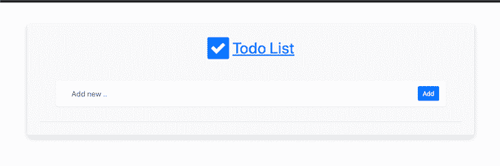

对于我们的其他处理程序，修改如下:

```
 type todo struct {
   Item string
}

func postHandler(c *fiber.Ctx, db *sql.DB) error {
   newTodo := todo{}
   if err := c.BodyParser(&newTodo); err != nil {
       log.Printf("An error occured: %v", err)
       return c.SendString(err.Error())
   }
   fmt.Printf("%v", newTodo)
   if newTodo.Item != "" {
       _, err := db.Exec("INSERT into todos VALUES ($1)", newTodo.Item)
       if err != nil {
           log.Fatalf("An error occured while executing query: %v", err)
       }
   }

   return c.Redirect("/")
}

func putHandler(c *fiber.Ctx, db *sql.DB) error {
   olditem := c.Query("olditem")
   newitem := c.Query("newitem")
   db.Exec("UPDATE todos SET item=$1 WHERE item=$2", newitem, olditem)
   return c.Redirect("/")
}

func deleteHandler(c *fiber.Ctx, db *sql.DB) error {
   todoToDelete := c.Query("item")
   db.Exec("DELETE from todos WHERE item=$1", todoToDelete)
   return c.SendString("deleted")
}

```

首先，我们创建一个结构来保存待办事项。然后，在我们的`postHandler`中，我们从请求体中获得要插入数据库的待办事项的名称。接下来，我们使用`db.Exec()`方法执行一个 SQL 查询，将新的待办事项添加到数据库中。然后我们重定向回主页。

*注意，每当我们期望数据库查询的结果时，我们使用* `db.Query()` *方法，当我们不期望时，使用* `db.Exec()` *方法。再次参考* [*SQL 文档*](https://pkg.go.dev/database/sql#Rows.Scan) *了解更多信息。*

对于我们的 put 处理程序，我们从请求查询字符串参数中获取旧的和新的项目名称。然后，我们执行一个查询，用数据库中的新名称替换旧名称。最后，我们重定向回主页。

对于我们的删除处理程序，我们从请求查询字符串参数中获取要删除的名称，并执行一个查询来从数据库中删除该名称，然后我们发回一个表示`"deleted"`的字符串。我们返回这个字符串，这样我们就知道函数已经成功完成。

如果你检查一下`index.html`文件，你会注意到每当你分别点击**编辑**按钮和**删除**按钮时，我们都在调用一个`updateDb`和一个`deleteFromDb`函数。

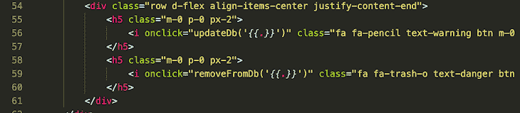

这些函数已经在一个`index.js`文件中定义，我们在下面的 HTML 文件中链接了这个文件。下面是`index.js`文件的样子:

```
 function removeFromDb(item){
   fetch(`/delete?item=${item}`, {method: "Delete"}).then(res =>{
       if (res.status == 200){
           window.location.pathname = "/"
       }
   })
}

function updateDb(item) {
   let input = document.getElementById(item)
   let newitem = input.value
   fetch(`/update?olditem=${item}&newitem=${newitem}`, {method: "PUT"}).then(res =>{
       if (res.status == 200){
       alert("Database updated")
           window.location.pathname = "/"
       }
   })
}

Now add the above code in a file called index.js in the public folder.
Ok here’s the full server.go file code for a reference
package main

import (
   "database/sql" // add this
   "fmt"
   "log"
   "os"

   _ "github.com/lib/pq" // add this

   "github.com/gofiber/fiber/v2"
   "github.com/gofiber/template/html"
)

func indexHandler(c *fiber.Ctx, db *sql.DB) error {
   var res string
   var todos []string
   rows, err := db.Query("SELECT * FROM todos")
   defer rows.Close()
   if err != nil {
       log.Fatalln(err)
       c.JSON("An error occured")
   }
   for rows.Next() {
       rows.Scan(&res)
       todos = append(todos, res)
   }
   return c.Render("index", fiber.Map{
       "Todos": todos,
   })
}

type todo struct {
   Item string
}

func postHandler(c *fiber.Ctx, db *sql.DB) error {
   newTodo := todo{}
   if err := c.BodyParser(&newTodo); err != nil {
       log.Printf("An error occured: %v", err)
       return c.SendString(err.Error())
   }
   fmt.Printf("%v", newTodo)
   if newTodo.Item != "" {
       _, err := db.Exec("INSERT into todos VALUES ($1)", newTodo.Item)
       if err != nil {
           log.Fatalf("An error occured while executing query: %v", err)
       }
   }

   return c.Redirect("/")
}

func putHandler(c *fiber.Ctx, db *sql.DB) error {
   olditem := c.Query("olditem")
   newitem := c.Query("newitem")
   db.Exec("UPDATE todos SET item=$1 WHERE item=$2", newitem, olditem)
   return c.Redirect("/")
}

func deleteHandler(c *fiber.Ctx, db *sql.DB) error {
   todoToDelete := c.Query("item")
   db.Exec("DELETE from todos WHERE item=$1", todoToDelete)
   return c.SendString("deleted")
}

func main() {
   connStr := "postgresql://postgres:[email protected]/todos?sslmode=disable"
   // Connect to database
   db, err := sql.Open("postgres", connStr)
   if err != nil {
       log.Fatal(err)
   }
   engine := html.New("./views", ".html")
   app := fiber.New(fiber.Config{
       Views: engine,
   })

   app.Get("/", func(c *fiber.Ctx) error {
       return indexHandler(c, db)
   })

   app.Post("/", func(c *fiber.Ctx) error {
       return postHandler(c, db)
   })

   app.Put("/update", func(c *fiber.Ctx) error {
       return putHandler(c, db)
   })

   app.Delete("/delete", func(c *fiber.Ctx) error {
       return deleteHandler(c, db)
   })

   port := os.Getenv("PORT")
   if port == "" {
       port = "3000"
   }
   app.Static("/", "./public")
   log.Fatalln(app.Listen(fmt.Sprintf(":%v", port)))
}

```

如果你正确地遵循了上面的教程，你的应用应该是这样的:

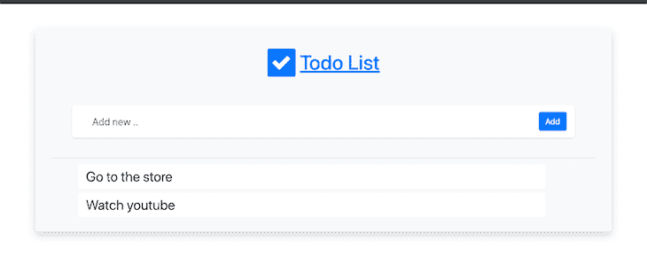

## 结论

我们终于来到了本教程的结尾。我们已经了解了如何使用 Go 连接到 PostgreSQL 数据库，并且已经成功地构建了一个待办事项应用程序。有很多方法可以改进这一点，我迫不及待地想看看你下一步会做什么。感谢阅读。

## 使用 [LogRocket](https://lp.logrocket.com/blg/signup) 消除传统错误报告的干扰

[](https://lp.logrocket.com/blg/signup)

[LogRocket](https://lp.logrocket.com/blg/signup) 是一个数字体验分析解决方案，它可以保护您免受数百个假阳性错误警报的影响，只针对几个真正重要的项目。LogRocket 会告诉您应用程序中实际影响用户的最具影响力的 bug 和 UX 问题。

然后，使用具有深层技术遥测的会话重放来确切地查看用户看到了什么以及是什么导致了问题，就像你在他们身后看一样。

LogRocket 自动聚合客户端错误、JS 异常、前端性能指标和用户交互。然后 LogRocket 使用机器学习来告诉你哪些问题正在影响大多数用户，并提供你需要修复它的上下文。

关注重要的 bug—[今天就试试 LogRocket】。](https://lp.logrocket.com/blg/signup-issue-free)