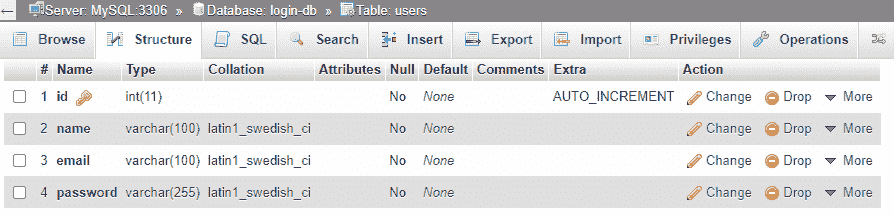
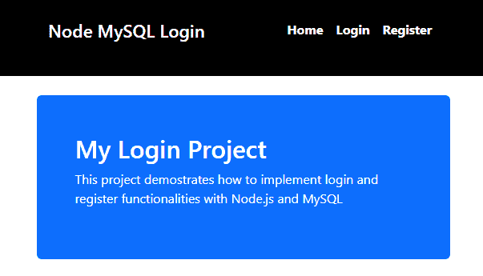
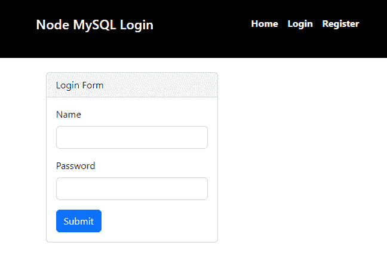
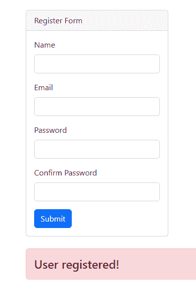
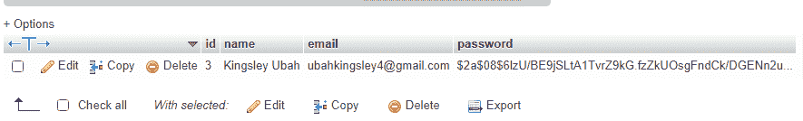

# 用 Node.js - LogRocket Blog 构建一个简单的登录表单

> 原文：<https://blog.logrocket.com/building-simple-login-form-node-js/>

登录表单用在网站、web 应用程序或移动应用程序的前端，用于收集验证用户是否已在系统数据库中注册所需的信息。

认证过程很简单。首先，用户通过登录表单向后端提交一些凭证——通常是电子邮件和密码。然后，后端应用程序检查电子邮件和密码是否在数据库中。从那里，后端应用程序要么授予用户访问权限，要么要求他们注册。

在本教程中，我们将学习如何用 [Node.js](https://blog.logrocket.com/tag/node/) 构建一个简单的登录表单。该表单将要求用户注册一个帐户。然后，我们将使用输入的信息，并在用户登录之前将其存储在 MySQL 数据库中。

现在我们已经对项目有了一个大致的了解，让我们开始构建吧！

*向前跳转:*

## 先决条件

您需要在本地开发机器上安装 [Node.js](https://nodejs.org/en/download/) 和 [npm](https://www.npmjs.com/) 来遵循本教程。如果您不确定是否安装了它们，请运行以下命令来检查它们的可用性:

```
# To check if Node is installed, run:
node -v

# To check if Node is installed, run:
npm -v

```

除了 Node.js，您还需要安装并运行一个 MySQL 服务器。你可以使用[独立的 MySQL](https://dev.mysql.com/downloads/installer/) 安装程序或者内置 MySQL 的服务器发行版，比如 [WAMP](https://www.wampserver.com/en/) 和 [XAMP](https://www.apachefriends.org/download.html) 。

## 构建 Node.js 登录表单

让我们为应用程序创建一个新文件夹，并使用带有`cd`指令的命令行导航到该文件夹:

```
cd path/to/your/folder

```

然后，运行以下命令安装本教程所需的依赖项:

```
npm i express mysql dotenv hbs bcryptjs

```

让我解释一下每个库的用途:

*   [Express](https://www.npmjs.com/package/express) :用于创建 API 和 web 路由，设置 app 后端
*   MySQL :用于连接我们本地的 MySQL 服务器
*   [dotenv](https://www.npmjs.com/package/dotenv) :用于存储不应该在 app 源代码中公开的环境变量
*   [hbs](https://www.npmjs.com/package/hbs) :用于在服务器上渲染 HTML
*   [Bcryptjs](https://www.npmjs.com/package/bcrypt) :用于散列密码

另外，我推荐安装 [nodemon](https://www.npmjs.com/package/nodemon) ，它会在检测到文件更改时自动重启服务器，节省您宝贵的开发时间。使用以下命令安装它:

```
npm i nodemon --save

```

最后，用代码编辑器打开应用程序的`package.json`文件，并在`scripts`对象中添加以下字段:

```
"start": "nodemon app.js"

```

现在，我们已经完成了项目设置。接下来，我们将连接到 MySQL 数据库，并创建一个表来存储用户登录信息。

## 在 Node.js 中设置数据库连接

首先在 MySQL 环境中创建一个名为`login-db`的新数据库。之后，用 ID、姓名、电子邮件和密码构建一个`users`表。将 ID 设置为`INT`和`AUTOINCREMENT`，将姓名、邮箱和密码设置为`VARCHAR`。

最终，`phpMyAdmin`中的数据库将如下所示:



然后，在应用程序的根文件夹中创建一个`.env`文件。在`.env`中，将您的数据库名称、主机域、用户名和密码值添加到它们对应的变量名中。以下是 MySQL 的默认值:

```
DATABASE = login-db
DATABASE_HOST = localhost
DATABASE_ROOT = root
DATABASE_PASSWORD =

```

一旦你设置了变量，在根文件夹中创建`app.js`。用文本编辑器打开它，并导入以下依赖项:

```
const express = require('express');
const mysql = require("mysql")
const dotenv = require('dotenv')

```

然后，创建一个快速应用程序:

```
const app = express();

```

之后，指定环境变量的路径:

```
dotenv.config({ path: './.env'})

```

这里，我们告诉服务器在与`app.js`相同的目录中查找`.env`。

接下来，从`process.env`访问变量，并将它们传递给各自的连接属性:

```
const db = mysql.createConnection({
    host: process.env.DATABASE_HOST,
    user: process.env.DATABASE_USER,
    password: process.env.DATABASE_PASSWORD,
    database: process.env.DATABASE
})

```

现在，您已经使用数据库凭据配置了连接，请连接数据库:

```
db.connect((error) => {
    if(error) {
        console.log(error)
    } else {
        console.log("MySQL connected!")
    }
})

```

连接要么成功，要么失败。如果失败，我们将在回调中看到`error`，并在控制台上打印出来。否则，我们输出`"MySQL connected!"`字符串。

最后，通过在终端上运行以下命令来启动服务器:

```
npm start

```

如果一切顺利，你会看到`MySQL is connected`。让我们创建主页。

## 设置主页

在项目的根文件夹中，创建`views`文件夹。然后，在`views`中，创建`index.hbs`、`register.hbs`和`login.hbs`。正如您可能已经猜到的，这些是主页、登录和注册页面的手柄文件。

现在，对于它们中的每一个，包括基本的 HTML 标记:

```
<!DOCTYPE html>
<html lang="en">
<head>    
    <link href="https://cdn.jsdelivr.net/npm/[email protected]/dist/css/bootstrap.min.css" rel="stylesheet" integrity="sha384-iYQeCzEYFbKjA/T2uDLTpkwGzCiq6soy8tYaI1GyVh/UjpbCx/TYkiZhlZB6+fzT" crossorigin="anonymous">
  </head>
</head>
<body>

{{!-- Navigation links --}}
    <nav>
        <h4>Node MySQL Login</h4>
        <ul>
            <li><a href="/">Home</a></li>
            <li><a href="/login">Login</a></li>
            <li><a href="/register">Register</a></li>
        </ul>
    </nav>

    {{!-- Body of each page will go here --}}
</body>
</html>

```

这里，我们将两个`<link>`元素链接到我们的自定义`style sheet`和引导 CSS 库。我们还创建了一个导航菜单，它将在所有页面中重复使用，以包含登录和注册页面的链接。

接下来，在`index.hbs`中，使用`<body>`标签中的以下标记将一个[大屏幕](https://getbootstrap.com/docs/4.0/components/jumbotron/)添加到您网站的主页中:

```
    {{!-- Body --}}
    <div class="container mt-4">
        <div class="mt-4 p-5 bg-primary text-white rounded">
            <h1>My Login Project</h1>
            <p>This project demonstrates how to implement login and register functionalities with Node.js and MySQL </p>
        </div>
    </div>

```

然后，在`app.js`中将`view engine`指定为把手:

```
app.set('view engine', 'hbs')

```

从那里，导入`path`来指定车把模板中使用的静态资产:

```
// other imports
const path = require("path")

const publicDir = path.join(__dirname, './public')

app.use(express.static(publicDir))
```

接下来，在主页上注册渲染`index.hbs`的路线:

```
app.get("/", (req, res) => {
    res.render("index")
})

```

最后，在`app.listen()`中为 app 配置端口:

```
app.listen(5000, ()=> {
    console.log("server started on port 5000")
})

```

通过运行`npm start`启动您的服务器，然后导航到`localhost:5000`查看主页:



接下来，我们将创建注册和登录表单。

## 在 Node.js 中创建登录和注册表单

在`views`中打开`register.hbs`，在`<body>`内和`<nav>`后包含以下标记:

```
<div class="container mt-4">
        <div class="card" style="width: 18rem;">            
            <div class="card-header">Register Form</div>    
            <div class="card-body">
                <form action="/auth/register" method="POST">
                    <div class="mb-3">
                        <label for="name-reg" class="form-label">Name</label>
                        <input type="text" class="form-control" id="name-reg" name="name">                        
                    </div>
                    <div class="mb-3">
                        <label for="email-reg" class="form-label">Email</label>
                        <input type="text" class="form-control" id="email-reg" name="email">                        
                    </div>
                    <div class="mb-3">
                        <label for="password-reg" class="form-label">Password</label>
                        <input type="password" class="form-control" id="password-reg" name="password">
                    </div>
                    <div class="mb-3">
                        <label for="password-conf-reg" class="form-label">Confirm Password</label>
                        <input type="password" class="form-control" id="password-conf-reg" name="password-confirm">
                    </div>

                    <button type="submit" class="btn btn-primary">Submit</button>
                </form>
            </div>
        </div>
    </div>

```

我们将创建一个 HTML 表单，输入用户名、电子邮件、密码和密码确认。该表单会将数据发送到我们在`action`中指定的路线。

接下来，在`app.js`中，将路线注册到注册页面并保存文件:

```
app.get("/register", (req, res) => {
    res.render("register")
})

```

之后，导航到您的浏览器并在导航栏中选择**注册**。您应该会看到注册表:


要创建登录表单，打开`views`中的`login.hbs`，使用与上面相同的表单。删除`inputs`和`labels`确认邮件和密码。另外，将`id`属性和卡片标题从**登记表**更改为**登录表**。

接下来，在`app.js`中注册登录路径:

```
app.get("/login", (req, res) => {
    res.render("login")
})

```

保存文件并转到浏览器。当您选择导航栏上的**登录**时，它应该是这样的:



现在我们已经完成了前端的工作，让我们把注意力转移到在后端注册用户上。

## 注册用户

提交注册表单时，表单值将被发送到`/auth/register`路线。让我们建造它！

在`app.js`中，通过导入`bcrypt`开始:

```
const bcrypt = require("bcryptjs")

```

接下来，将 Express 服务器配置为以`[JSON](https://blog.logrocket.com/reading-writing-json-files-nodejs-complete-tutorial/)`的形式接收表单值:

```
app.use(express.urlencoded({extended: 'false'}))
app.use(express.json())

```

然后，创建`auth/register`并检索用户的表单值:

```
app.post("/auth/register", (req, res) => {    
    const { name, email, password, password_confirm } = req.body

    // db.query() code goes here
})

```

现在您已经有了值，查询数据库以检查电子邮件是否在服务器上。这样，用户就不能用同一个电子邮件注册多次:

```
    db.query('SELECT email FROM users WHERE email = ?', [email], async (error, res) => {
       // remaining code goes here
    })

```

如果在执行查询时出现错误，我们将访问`error`并将其显示在服务器的终端上:

```
        if(error){
            console.log(error)
        }
        // other code

```

接下来，检查是否有结果以及两个密码是否匹配。如果有任何条件为真，则重新呈现注册页面以通知用户该电子邮件已被使用或密码不匹配:

```
        if( result.length > 0 ) {
            return res.render('register', {
                message: 'This email is already in use'
            })
        } else if(password !== password_confirm) {
            return res.render('register', {
                message: 'Passwords do not match!'
            })
        }
       // other code

```

如果上述条件不成立，用户将被添加到数据库中。加密密码，并将其与其他值一起发布到数据库:

```
        let hashedPassword = await bcrypt.hash(password, 8)

        db.query('INSERT INTO users SET?', {name: name, email: email, password: hashedPassword}, (err, res) => {
            if(error) {
                console.log(error)
            } else {
                return res.render('register', {
                    message: 'User registered!'
                })
            }
        })

```

如果有错误，我们会在控制台上打印出来。否则，重新呈现页面，并向用户发送一条消息，表明他们已注册。

需要注意的是，要显示用户消息，您需要编辑`register.hbs`并在`<div>`下包含以下模板:

```
{{#if message }}
    <h4 class="alert alert-danger mt-4">{{message}}</h4>
{{/if}}

```

最后，保存所有文件更改，并在浏览器上测试应用程序:





## 结论

我希望你在阅读本教程时和我在创建它时一样开心。随意从 [GitHub 库](https://github.com/KingsleyUbah/Nodejs-form)中派生并使用代码。毕竟，把手弄脏才是最好的学习方式。

如有疑问，在下方评论！

## 200 只显示器出现故障，生产中网络请求缓慢

部署基于节点的 web 应用程序或网站是容易的部分。确保您的节点实例继续为您的应用程序提供资源是事情变得更加困难的地方。如果您对确保对后端或第三方服务的请求成功感兴趣，

[try LogRocket](https://lp.logrocket.com/blg/node-signup)

.

[](https://lp.logrocket.com/blg/node-signup)[https://logrocket.com/signup/](https://lp.logrocket.com/blg/node-signup)

LogRocket 就像是网络和移动应用程序的 DVR，记录下用户与你的应用程序交互时发生的一切。您可以汇总并报告有问题的网络请求，以快速了解根本原因，而不是猜测问题发生的原因。

LogRocket 检测您的应用程序以记录基线性能计时，如页面加载时间、到达第一个字节的时间、慢速网络请求，还记录 Redux、NgRx 和 Vuex 操作/状态。

[Start monitoring for free](https://lp.logrocket.com/blg/node-signup)

.